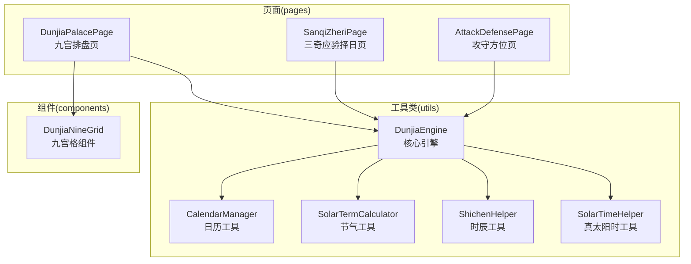
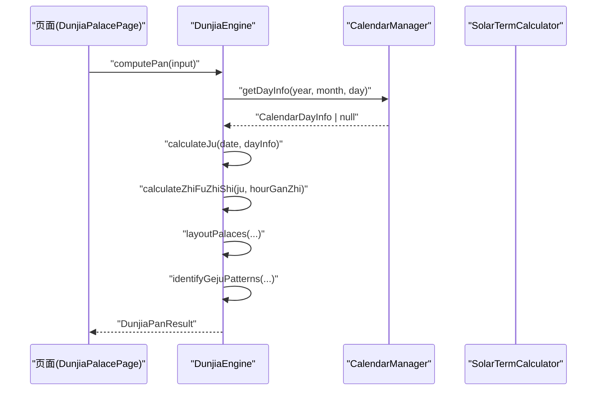
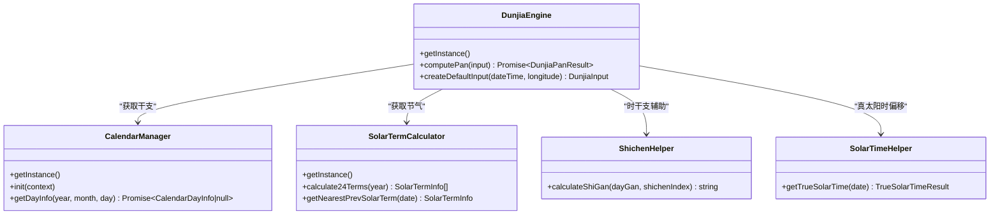

# API参考文档

<cite>
**本文档引用的文件**
- [DunjiaEngine.ets](file://entry/src/main/ets/utils/DunjiaEngine.ets)
- [CalendarManager.ets](file://entry/src/main/ets/utils/CalendarManager.ets)
- [SolarTermCalculator.ets](file://entry/src/main/ets/utils/SolarTermCalculator.ets)
- [ShichenHelper.ets](file://entry/src/main/ets/utils/ShichenHelper.ets)
- [SolarTimeHelper.ets](file://entry/src/main/ets/utils/SolarTimeHelper.ets)
- [DunjiaPalacePage.ets](file://entry/src/main/ets/pages/DunjiaPalacePage.ets)
- [SanqiZheriPage.ets](file://entry/src/main/ets/pages/SanqiZheriPage.ets)
- [AttackDefensePage.ets](file://entry/src/main/ets/pages/AttackDefensePage.ets)
- [DunjiaNineGrid.ets](file://entry/src/main/ets/components/DunjiaNineGrid.ets)
</cite>

## 目录
1. [简介](#简介)
2. [项目结构](#项目结构)
3. [核心组件](#核心组件)
4. [架构总览](#架构总览)
5. [详细组件分析](#详细组件分析)
6. [依赖关系分析](#依赖关系分析)
7. [性能考量](#性能考量)
8. [故障排查指南](#故障排查指南)
9. [结论](#结论)
10. [附录](#附录)

## 简介
本API参考文档面向开发者与技术使用者，系统梳理遁甲引擎工具链的公共接口与使用规范，涵盖DunjiaEngine核心引擎、CalendarManager日历工具、SolarTermCalculator节气工具、ShichenHelper时辰工具、SolarTimeHelper真太阳时工具，并结合页面与组件的典型调用示例，提供类型定义、参数说明、返回值、错误处理、最佳实践、性能优化与迁移指南。

## 项目结构
- 工具类位于 utils 目录，提供独立的业务能力封装与缓存策略。
- 页面 pages 与组件 components 组合使用工具类，完成完整的排盘与展示流程。
- 资源文件 rawfile 下包含万年历与规则JSON数据，供运行期加载使用。

图表来源
- [DunjiaEngine.ets](file://entry/src/main/ets/utils/DunjiaEngine.ets#L98-L162)
- [CalendarManager.ets](file://entry/src/main/ets/utils/CalendarManager.ets#L30-L92)
- [SolarTermCalculator.ets](file://entry/src/main/ets/utils/SolarTermCalculator.ets#L30-L159)
- [ShichenHelper.ets](file://entry/src/main/ets/utils/ShichenHelper.ets#L14-L113)
- [SolarTimeHelper.ets](file://entry/src/main/ets/utils/SolarTimeHelper.ets#L29-L245)
- [DunjiaPalacePage.ets](file://entry/src/main/ets/pages/DunjiaPalacePage.ets#L82-L236)
- [SanqiZheriPage.ets](file://entry/src/main/ets/pages/SanqiZheriPage.ets#L76-L134)
- [AttackDefensePage.ets](file://entry/src/main/ets/pages/AttackDefensePage.ets#L9-L48)
- [DunjiaNineGrid.ets](file://entry/src/main/ets/components/DunjiaNineGrid.ets#L23-L179)

章节来源
- [DunjiaEngine.ets](file://entry/src/main/ets/utils/DunjiaEngine.ets#L1-L961)
- [CalendarManager.ets](file://entry/src/main/ets/utils/CalendarManager.ets#L1-L123)
- [SolarTermCalculator.ets](file://entry/src/main/ets/utils/SolarTermCalculator.ets#L1-L375)
- [ShichenHelper.ets](file://entry/src/main/ets/utils/ShichenHelper.ets#L1-L114)
- [SolarTimeHelper.ets](file://entry/src/main/ets/utils/SolarTimeHelper.ets#L1-L270)
- [DunjiaPalacePage.ets](file://entry/src/main/ets/pages/DunjiaPalacePage.ets#L1-L1017)
- [SanqiZheriPage.ets](file://entry/src/main/ets/pages/SanqiZheriPage.ets#L1-L146)
- [AttackDefensePage.ets](file://entry/src/main/ets/pages/AttackDefensePage.ets#L1-L50)
- [DunjiaNineGrid.ets](file://entry/src/main/ets/components/DunjiaNineGrid.ets#L1-L179)

## 核心组件
本节聚焦DunjiaEngine核心引擎的公共API，包括输入、输出、内部算法与扩展点。

- 公共枚举与类型
  - DunType：阳遁/阴遁
  - DunjiaSceneType：研习场景类型（普通研习、布局/局势研习、时机窗口研习）
  - PalaceIndex：宫位索引（0-8）
  - DunjiaInput：输入参数
  - PalaceState：宫位状态
  - RuleHit：规则命中
  - EvaluationSummary：整体结构评估
  - DunjiaPanResult：完整盘面结果
  - GejuPattern：格局模式

- 核心方法
  - computePan(input: DunjiaInput): Promise<DunjiaPanResult>
    - 功能：从输入时间、经度与场景，计算完整的遁甲盘面与结构化分析。
    - 参数：见DunjiaInput
    - 返回：Promise<DunjiaPanResult>
    - 错误处理：当日历信息缺失时返回空盘（createEmptyPan）
  - createDefaultInput(dateTime: Date, longitude: number): DunjiaInput
    - 功能：便捷构造默认输入（场景类型为普通研习）
  - 内部算法方法（私有）
    - getDayGanZhi(date: Date): Promise<CalendarDayInfo | null>
    - calculateJu(date: Date, dayInfo: CalendarDayInfo): JuInfo
    - calculateZhiFuZhiShi(ju: JuInfo, hourGanZhi: HourGanZhi): ZhiFuZhiShiInfo
    - calculateZhiShiPalace(juNumber: number, dunType: DunType, hourGanZhi: HourGanZhi): PalaceIndex
    - layoutPalaces(...)：布九宫（九星、八门、三奇六仪、八神）
    - layoutStars(...)、layoutDoors(...)、layoutTianGan(...)、layoutDeities(...)
    - identifyGejuPatterns(...)：识别多种格局（三奇得使、三遁、三奇合、伏吟、反吹、青龙返首、飞鸟跌穴、三奇入墓、六仪击刑、太白入荧惑、荧惑入太白、天网四张等）
    - generateStructureTag(ju: JuInfo): string
    - createEmptyPan(input: DunjiaInput): DunjiaPanResult
    - calculateSolarTimeOffset(longitude: number): number

- 使用示例（页面调用）
  - 在页面生命周期中构造DunjiaInput并调用engine.computePan(input)，随后将结果传入组件渲染。

章节来源
- [DunjiaEngine.ets](file://entry/src/main/ets/utils/DunjiaEngine.ets#L98-L162)
- [DunjiaEngine.ets](file://entry/src/main/ets/utils/DunjiaEngine.ets#L645-L651)
- [DunjiaEngine.ets](file://entry/src/main/ets/utils/DunjiaEngine.ets#L166-L661)
- [DunjiaEngine.ets](file://entry/src/main/ets/utils/DunjiaEngine.ets#L678-L936)
- [DunjiaPalacePage.ets](file://entry/src/main/ets/pages/DunjiaPalacePage.ets#L218-L236)
- [SanqiZheriPage.ets](file://entry/src/main/ets/pages/SanqiZheriPage.ets#L117-L134)
- [AttackDefensePage.ets](file://entry/src/main/ets/pages/AttackDefensePage.ets#L32-L48)

## 架构总览
DunjiaEngine作为核心引擎，依赖CalendarManager与SolarTermCalculator获取干支与时令信息，结合ShichenHelper与时辰干支计算，最终生成完整的盘面与格局识别结果。页面与组件通过统一的DunjiaPanResult进行数据流转。

图表来源
- [DunjiaPalacePage.ets](file://entry/src/main/ets/pages/DunjiaPalacePage.ets#L218-L236)
- [DunjiaEngine.ets](file://entry/src/main/ets/utils/DunjiaEngine.ets#L113-L162)
- [CalendarManager.ets](file://entry/src/main/ets/utils/CalendarManager.ets#L51-L92)
- [SolarTermCalculator.ets](file://entry/src/main/ets/utils/SolarTermCalculator.ets#L143-L159)

## 详细组件分析

### DunjiaEngine（核心引擎）
- 类型与接口
  - 输入输出与内部类型：DunjiaInput、DunjiaPanResult、PalaceState、RuleHit、EvaluationSummary、GejuPattern、JuInfo、HourGanZhi、ZhiFuZhiShiInfo
  - 枚举：DunType、DunjiaSceneType
  - 单例：getInstance()

- 方法详解
  - computePan(input: DunjiaInput): Promise<DunjiaPanResult>
    - 步骤：获取干支 -> 计算局数与阴阳遁 -> 计算时干支 -> 计算值符值使 -> 布九宫 -> 识别格局 -> 生成评估摘要
    - 返回：包含盘面、值符值使、九宫状态、规则命中、格局、摘要、日干支、时辰干支、真太阳时偏移、地理经度等
    - 错误处理：当日历信息为空时返回空盘
  - createDefaultInput(dateTime: Date, longitude: number): DunjiaInput
    - 快速构造默认输入（场景类型为普通研习）
  - 内部算法
    - getDayGanZhi：委托CalendarManager获取当日干支
    - calculateJu：根据节气与地支仲孟季确定上中下元与局数
    - calculateZhiFuZhiShi/calculateZhiShiPalace：值符值使按阴阳遁规则飞布
    - layoutPalaces/layoutStars/layoutDoors/layoutTianGan/layoutDeities：九宫元素布局
    - identifyGejuPatterns：识别多种格局并标注等级与描述
    - generateStructureTag/createEmptyPan/calculateSolarTimeOffset：辅助方法

- 使用示例（页面）
  - 构造DunjiaInput（含日期、经度、场景类型），调用engine.computePan(input)，将结果传入DunjiaNineGrid等组件。

- 最佳实践
  - 建议使用createDefaultInput快速构造输入
  - 对返回的DunjiaPanResult进行判空与字段存在性检查
  - 使用gejuPatterns进行格局分析，结合summary与focusPoints进行学习提示

- 常见陷阱
  - 未初始化CalendarManager导致getDayInfo返回null
  - 未设置sceneType导致默认为普通研习，注意区分布局/时机场景
  - 未处理computePan异常，导致UI无响应

章节来源
- [DunjiaEngine.ets](file://entry/src/main/ets/utils/DunjiaEngine.ets#L7-L16)
- [DunjiaEngine.ets](file://entry/src/main/ets/utils/DunjiaEngine.ets#L21-L84)
- [DunjiaEngine.ets](file://entry/src/main/ets/utils/DunjiaEngine.ets#L98-L162)
- [DunjiaEngine.ets](file://entry/src/main/ets/utils/DunjiaEngine.ets#L645-L651)
- [DunjiaEngine.ets](file://entry/src/main/ets/utils/DunjiaEngine.ets#L166-L661)
- [DunjiaEngine.ets](file://entry/src/main/ets/utils/DunjiaEngine.ets#L678-L936)
- [DunjiaPalacePage.ets](file://entry/src/main/ets/pages/DunjiaPalacePage.ets#L218-L236)
- [SanqiZheriPage.ets](file://entry/src/main/ets/pages/SanqiZheriPage.ets#L117-L134)
- [AttackDefensePage.ets](file://entry/src/main/ets/pages/AttackDefensePage.ets#L32-L48)

### CalendarManager（日历工具）
- 单例：getInstance()
- 初始化：init(context: common.Context): void
- 方法
  - getDayInfo(year: number, month: number, day: number): Promise<CalendarDayInfo | null>
    - 功能：按年份分片加载万年历JSON，缓存后查询指定日期
    - 返回：CalendarDayInfo或null（未初始化、越界、加载失败）
    - 附加：若为节气日，附加节气精确时刻
  - 私有：getFileNameForYear、loadJson

- 使用示例（页面）
  - 页面中通过CalendarManager获取当日干支，作为DunjiaEngine输入的一部分

- 最佳实践
  - 在应用启动阶段调用init(context)初始化
  - 对返回值进行null检查
  - 合理利用缓存，避免重复加载

- 常见陷阱
  - 未初始化导致getDayInfo返回null
  - 年份超出支持范围（1900-2060）

章节来源
- [CalendarManager.ets](file://entry/src/main/ets/utils/CalendarManager.ets#L30-L92)
- [CalendarManager.ets](file://entry/src/main/ets/utils/CalendarManager.ets#L94-L121)
- [DunjiaPalacePage.ets](file://entry/src/main/ets/pages/DunjiaPalacePage.ets#L218-L236)

### SolarTermCalculator（节气工具）
- 单例：getInstance()
- 方法
  - calculate24Terms(year: number): SolarTermInfo[]
    - 功能：计算指定年份24节气（缓存）
  - getSolarTermByDate(date: Date): SolarTermInfo | null
    - 功能：判断指定日期是否为节气日
  - getNextSolarTerm(date: Date): SolarTermInfo
  - getNearestPrevSolarTerm(date: Date): SolarTermInfo | null
  - formatSolarTermTime(term: SolarTermInfo): string
  - getShortDescription(term: SolarTermInfo): string
  - clearCache(): void
  - preloadYears(startYear: number, endYear: number): void

- 使用示例（引擎）
  - 引擎内部通过getNearestPrevSolarTerm确定局数与阴阳遁

- 最佳实践
  - 预加载常用年份节气，提升首次访问性能
  - 使用formatSolarTermTime与getShortDescription进行友好展示

- 常见陷阱
  - 跨年节气判断（小寒在1月初）需合并前后年份节气

章节来源
- [SolarTermCalculator.ets](file://entry/src/main/ets/utils/SolarTermCalculator.ets#L30-L159)
- [SolarTermCalculator.ets](file://entry/src/main/ets/utils/SolarTermCalculator.ets#L331-L355)
- [SolarTermCalculator.ets](file://entry/src/main/ets/utils/SolarTermCalculator.ets#L360-L373)
- [DunjiaEngine.ets](file://entry/src/main/ets/utils/DunjiaEngine.ets#L256-L281)

### ShichenHelper（时辰工具）
- 单例：getAllShichen()、getCurrentShichenIndex()
- 方法
  - calculateShiGan(dayGan: string, shichenIndex: number): string
    - 功能：根据日干与时辰索引计算时干（五鼠遁法）
  - getShizhuInfo(dayGan: string, shichenIndex: number): string
    - 功能：返回时干时支组合
  - getShichenDisplayText(shichenIndex: number, dayGan?: string): string
    - 功能：返回带显示文本

- 使用示例（引擎）
  - 引擎内部使用getHourGanZhi与calculateShiGan推导时干支

- 最佳实践
  - 与DunjiaEngine的时干支计算配合使用
  - 用于UI展示时干支组合

章节来源
- [ShichenHelper.ets](file://entry/src/main/ets/utils/ShichenHelper.ets#L14-L113)
- [DunjiaEngine.ets](file://entry/src/main/ets/utils/DunjiaEngine.ets#L169-L198)

### SolarTimeHelper（真太阳时工具）
- 构造：new SolarTimeHelper(longitude: number)
- 方法
  - setLongitude(longitude: number): void
  - getTrueSolarTime(date: Date): TrueSolarTimeResult
  - formatTrueSolarTime(date: Date): string
  - getTimeDifferenceDescription(date: Date): string
  - getDetailedInfo(date: Date): string
  - 预定义城市经度：CHINA_CITY_LONGITUDES

- 使用示例（引擎）
  - 引擎内部使用calculateSolarTimeOffset进行真太阳时偏移计算

- 最佳实践
  - 使用CHINA_CITY_LONGITUDES预置常用城市经度
  - 用于UI展示真太阳时与本地时间差异

- 常见陷阱
  - 经度为负值（西经）需正确传入

章节来源
- [SolarTimeHelper.ets](file://entry/src/main/ets/utils/SolarTimeHelper.ets#L29-L245)
- [DunjiaEngine.ets](file://entry/src/main/ets/utils/DunjiaEngine.ets#L658-L661)

### 页面与组件（典型调用）
- DunjiaPalacePage
  - aboutToAppear中构造DunjiaInput并调用engine.computePan，将结果传入DunjiaNineGrid与详情组件
  - 支持用神映射与三奇应验规则加载
- SanqiZheriPage
  - 从路由参数接收timestamp，构造输入并计算盘面
- AttackDefensePage
  - 与DunjiaPalacePage类似，用于攻守方位分析
- DunjiaNineGrid
  - 接收DunjiaPanResult，渲染九宫格与时间信息

章节来源
- [DunjiaPalacePage.ets](file://entry/src/main/ets/pages/DunjiaPalacePage.ets#L82-L236)
- [SanqiZheriPage.ets](file://entry/src/main/ets/pages/SanqiZheriPage.ets#L76-L134)
- [AttackDefensePage.ets](file://entry/src/main/ets/pages/AttackDefensePage.ets#L9-L48)
- [DunjiaNineGrid.ets](file://entry/src/main/ets/components/DunjiaNineGrid.ets#L23-L179)

## 依赖关系分析
- DunjiaEngine依赖
  - CalendarManager：获取当日干支
  - SolarTermCalculator：获取节气信息
  - ShichenHelper：辅助时干支计算
  - SolarTimeHelper：真太阳时偏移计算
- 页面与组件依赖
  - 页面通过DunjiaEngine获取盘面数据
  - 组件消费DunjiaPanResult进行渲染

图表来源
- [DunjiaEngine.ets](file://entry/src/main/ets/utils/DunjiaEngine.ets#L4-L5)
- [CalendarManager.ets](file://entry/src/main/ets/utils/CalendarManager.ets#L30-L46)
- [SolarTermCalculator.ets](file://entry/src/main/ets/utils/SolarTermCalculator.ets#L47-L52)
- [ShichenHelper.ets](file://entry/src/main/ets/utils/ShichenHelper.ets#L59-L91)
- [SolarTimeHelper.ets](file://entry/src/main/ets/utils/SolarTimeHelper.ets#L54-L77)

## 性能考量
- 缓存策略
  - SolarTermCalculator：按年份缓存节气结果
  - CalendarManager：按年份文件缓存万年历数据
  - 建议：在页面进入前预加载常用年份节气（preloadYears）
- I/O与资源
  - 万年历JSON较大，建议按需加载与缓存
  - 节气计算为纯数学运算，注意避免重复计算
- 异步与并发
  - computePan为异步，页面应显示loading态
  - 多页面同时请求可能造成资源竞争，建议集中管理

[本节为通用指导，无需特定文件引用]

## 故障排查指南
- CalendarManager未初始化
  - 现象：getDayInfo返回null
  - 处理：确保在应用启动阶段调用init(context)
- 节气计算异常
  - 现象：getNearestPrevSolarTerm返回null
  - 处理：检查日期范围与跨年节气逻辑
- computePan失败
  - 现象：返回空盘或抛出异常
  - 处理：捕获异常并提示用户重试；检查输入参数（日期、经度、场景类型）
- 真太阳时偏移
  - 现象：UI显示偏移异常
  - 处理：确认经度单位与符号（东经为正）

章节来源
- [CalendarManager.ets](file://entry/src/main/ets/utils/CalendarManager.ets#L52-L55)
- [DunjiaEngine.ets](file://entry/src/main/ets/utils/DunjiaEngine.ets#L118-L120)
- [DunjiaPalacePage.ets](file://entry/src/main/ets/pages/DunjiaPalacePage.ets#L232-L235)

## 结论
本API参考文档系统梳理了遁甲引擎工具链的公共接口与使用方式，提供了类型定义、参数说明、返回值、错误处理、最佳实践与性能优化建议。建议在实际项目中遵循单例初始化、输入校验、异步处理与缓存策略，以获得稳定可靠的排盘体验。

[本节为总结性内容，无需特定文件引用]

## 附录

### API版本兼容性与迁移指南
- 版本兼容性
  - 采用单例与静态方法的工具类，接口变更风险较低
  - 若需扩展新场景（如策略研习、时机窗口），可通过DunjiaSceneType扩展
- 迁移建议
  - 从旧项目迁移时，确保拷贝utils目录与rawfile/calendar目录
  - 页面与组件中统一通过DunjiaEngine.getInstance()获取实例
  - 对接CalendarManager时，务必在应用启动阶段调用init(context)

章节来源
- [DunjiaEngine.ets](file://entry/src/main/ets/utils/DunjiaEngine.ets#L103-L108)
- [CalendarManager.ets](file://entry/src/main/ets/utils/CalendarManager.ets#L44-L46)
- [组件化细要.md](file://组件化细要.md#L364-L383)

### 类型定义与接口规范
- DunjiaInput
  - dateTime: Date
  - longitude: number
  - sceneType: DunjiaSceneType
- DunjiaPanResult
  - dunType: DunType
  - juLabel: string
  - input: DunjiaInput
  - zhiFuPalace: PalaceIndex
  - zhiShiPalace: PalaceIndex
  - palaces: PalaceState[]
  - ruleHits: RuleHit[]
  - summary: EvaluationSummary
  - dayInfo?: CalendarDayInfo
  - hourGanZhi?: string
  - solarTimeOffset?: number
  - gejuPatterns?: GejuPattern[]
- PalaceState
  - palace: PalaceIndex
  - palaceName: string
  - palaceElement: string
  - starName?: string
  - doorName?: string
  - tianGan?: string
  - diGan?: string
  - deityName?: string
  - isZhiFu?: boolean
  - isZhiShi?: boolean
- RuleHit
  - id: string
  - name: string
  - level: 'info' | 'hint' | 'focus'
  - description: string
- EvaluationSummary
  - structureTag: string
  - overview: string
  - focusPoints: string[]
- GejuPattern
  - id: string
  - name: string
  - description: string
  - palaceIndices: number[]
  - level: 'minor' | 'major' | 'special'

章节来源
- [DunjiaEngine.ets](file://entry/src/main/ets/utils/DunjiaEngine.ets#L21-L84)
- [DunjiaEngine.ets](file://entry/src/main/ets/utils/DunjiaEngine.ets#L89-L95)