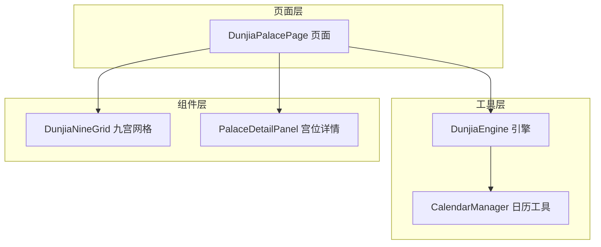
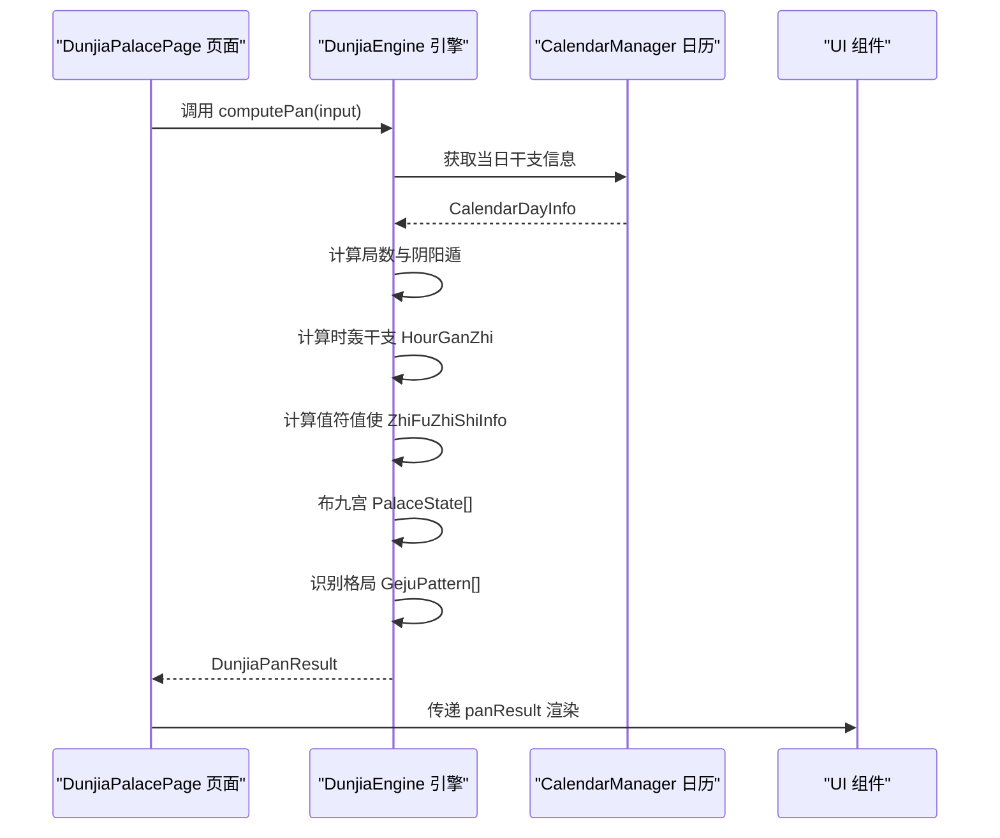
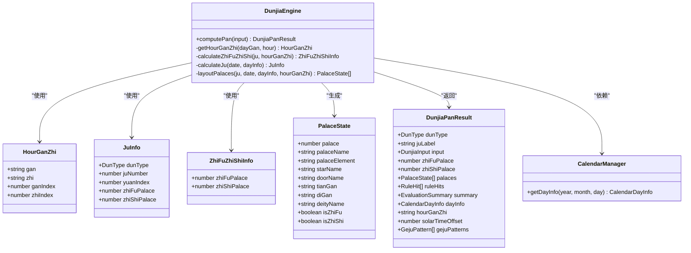
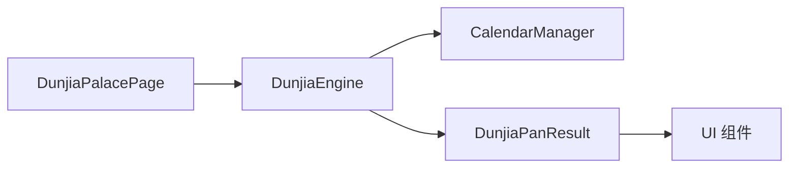

# 内部数据结构

<cite>
**本文引用的文件**
- [DunjiaEngine.ets](file://entry/src/main/ets/utils/DunjiaEngine.ets)
- [CalendarManager.ets](file://entry/src/main/ets/utils/CalendarManager.ets)
- [DunjiaPalacePage.ets](file://entry/src/main/ets/pages/DunjiaPalacePage.ets)
- [PalaceDetailPanel.ets](file://entry/src/main/ets/components/PalaceDetailPanel.ets)
- [组件化细要.md](file://组件化细要.md)
</cite>

## 目录
1. [简介](#简介)
2. [项目结构](#项目结构)
3. [核心组件](#核心组件)
4. [架构总览](#架构总览)
5. [详细组件分析](#详细组件分析)
6. [依赖分析](#依赖分析)
7. [性能考量](#性能考量)
8. [故障排查指南](#故障排查指南)
9. [结论](#结论)
10. [附录](#附录)

## 简介
本文件聚焦于遁甲应用内部使用的数据结构，包括：
- HourGanZhi 时轰干支结构
- JuInfo 局数信息结构
- ZhiFuZhiShiInfo 值符值使信息结构

文档将从属性定义、数据类型、业务含义出发，解释这些内部结构与外部接口的关系与转换过程，并提供使用示例与维护注意事项，说明它们在遁甲算法实现中的作用。

## 项目结构
本项目采用“页面 + 工具类 + 组件”的组织方式。核心引擎位于 utils/DunjiaEngine.ets，负责从输入时间与地点推导出完整的遁甲时空盘；页面层通过注入引擎实例进行排盘计算；组件层消费引擎输出的数据结构进行渲染与交互。

图表来源
- [DunjiaEngine.ets](file://entry/src/main/ets/utils/DunjiaEngine.ets#L98-L113)
- [CalendarManager.ets](file://entry/src/main/ets/utils/CalendarManager.ets#L30-L46)
- [DunjiaPalacePage.ets](file://entry/src/main/ets/pages/DunjiaPalacePage.ets#L82-L115)

章节来源
- [DunjiaEngine.ets](file://entry/src/main/ets/utils/DunjiaEngine.ets#L1-L113)
- [CalendarManager.ets](file://entry/src/main/ets/utils/CalendarManager.ets#L1-L46)
- [DunjiaPalacePage.ets](file://entry/src/main/ets/pages/DunjiaPalacePage.ets#L1-L115)

## 核心组件
- DunjiaEngine：核心引擎，负责计算局数、时轰干支、值符值使、九宫布盘、格局识别等。
- CalendarManager：提供公历日期对应的干支、节气等日历信息。
- 页面与组件：消费引擎输出的结构化结果，进行渲染与交互。

章节来源
- [DunjiaEngine.ets](file://entry/src/main/ets/utils/DunjiaEngine.ets#L98-L113)
- [CalendarManager.ets](file://entry/src/main/ets/utils/CalendarManager.ets#L30-L92)
- [DunjiaPalacePage.ets](file://entry/src/main/ets/pages/DunjiaPalacePage.ets#L82-L115)

## 架构总览
引擎计算流程概览如下：输入时间与地点 → 获取当日干支 → 计算局数与阴阳遁 → 计算时轰干支 → 计算值符值使 → 布九宫（九星、八门、三奇六仪、八神）→ 识别格局 → 输出结构化结果。

图表来源
- [DunjiaEngine.ets](file://entry/src/main/ets/utils/DunjiaEngine.ets#L113-L162)
- [CalendarManager.ets](file://entry/src/main/ets/utils/CalendarManager.ets#L51-L92)
- [DunjiaPalacePage.ets](file://entry/src/main/ets/pages/DunjiaPalacePage.ets#L218-L236)

## 详细组件分析

### HourGanZhi 时轰干支结构
- 结构定义与用途
  - 用于表示“时干 + 时支”的组合，作为遁甲排盘中值符、值使飞布与三奇六仪布局的起点。
- 属性与数据类型
  - gan: string —— 时干，如“甲”、“乙”等十天干之一
  - zhi: string —— 时支，如“子”、“丑”等十二地支之一
  - ganIndex: number —— 天干索引（0-9），便于按偏移量飞布
  - zhiIndex: number —— 地支索引（0-11），用于确定时轰区间
- 业务含义
  - 时干由“日干起时法”确定，与时支共同决定值符、值使的宫位与三奇六仪的天盘布局。
- 计算逻辑要点
  - 时支按小时区间映射到子、丑、寅…亥，23点至次日凌晨1点为子时。
  - 时干按“日干起时表”计算，日干与地支索引共同决定时干索引。
- 在遁甲算法中的作用
  - 值符宫位按“时干相对甲的偏移量”从局数宫起顺/逆飞布（跳过中宫）。
  - 值使宫位按“时干索引”从起始宫（阳遁从一宫、阴遁从九宫）顺/逆飞布（跳过中宫）。
  - 天盘三奇六仪布局依赖“时干”与“局数”、“阴阳遁”共同确定。
- 外部接口关系与转换
  - 输入：日干（来自 CalendarDayInfo）、小时（Date.getHours）
  - 输出：HourGanZhi 对象，供引擎内部计算使用
  - 页面层不直接消费该结构，但通过引擎间接获得值符值使与九宫状态

章节来源
- [DunjiaEngine.ets](file://entry/src/main/ets/utils/DunjiaEngine.ets#L169-L198)
- [DunjiaEngine.ets](file://entry/src/main/ets/utils/DunjiaEngine.ets#L206-L246)
- [DunjiaEngine.ets](file://entry/src/main/ets/utils/DunjiaEngine.ets#L429-L462)
- [DunjiaEngine.ets](file://entry/src/main/ets/utils/DunjiaEngine.ets#L470-L556)

### JuInfo 局数信息结构
- 结构定义与用途
  - 表示“阴阳遁类型 + 局数 + 元数 + 值符/值使宫位”的核心局信息，贯穿整个遁甲布局过程。
- 属性与数据类型
  - dunType: DunType —— 阴/阳遁枚举
  - juNumber: number —— 局数（1-9）
  - yuanIndex: number —— 元数索引（0=上元，1=中元，2=下元）
  - zhiFuPalace: PalaceIndex —— 值符所在宫位（0-8）
  - zhiShiPalace: PalaceIndex —— 值使所在宫位（0-8）
- 业务含义
  - 局数决定“起始宫”与“飞布方向”（顺/逆），元数决定“上中下元”的局数组合。
  - 值符/值使宫位在计算时可能先占位，随后由时轰干支修正。
- 计算逻辑要点
  - 通过节气判断阴阳遁，再根据“节气 + 日干地支”查表得到局数组合。
  - 元数按“甲日/己日 + 地支仲孟季”判定。
  - 值符/值使初始占位中宫，随后由 calculateZhiFuZhiShi 重算。
- 在遁甲算法中的作用
  - 作为布盘的“骨架”，决定九星、八门、三奇六仪、八神的起始与飞布规则。
- 外部接口关系与转换
  - 输入：Date、CalendarDayInfo
  - 输出：JuInfo 对象，供引擎内部布局与值符值使计算使用

章节来源
- [DunjiaEngine.ets](file://entry/src/main/ets/utils/DunjiaEngine.ets#L256-L281)
- [DunjiaEngine.ets](file://entry/src/main/ets/utils/DunjiaEngine.ets#L286-L323)
- [DunjiaEngine.ets](file://entry/src/main/ets/utils/DunjiaEngine.ets#L332-L353)
- [DunjiaEngine.ets](file://entry/src/main/ets/utils/DunjiaEngine.ets#L942-L948)

### ZhiFuZhiShiInfo 值符值使信息结构
- 结构定义与用途
  - 表示“值符宫位 + 值使宫位”的计算结果，用于标记九宫盘上的主导力量与门位。
- 属性与数据类型
  - zhiFuPalace: PalaceIndex —— 值符宫位（0-8）
  - zhiShiPalace: PalaceIndex —— 值使宫位（0-8）
- 业务含义
  - 值符代表“天时之利”，值使代表“门位之动”。二者共同决定“时局”与“时机”。
- 计算逻辑要点
  - 值符：按“时干相对甲的偏移量”从“局数宫”起顺/逆飞布（跳过中宫）。
  - 值使：按“时干索引”从“起始宫”（阳遁从一宫、阴遁从九宫）顺/逆飞布（跳过中宫）。
- 在遁甲算法中的作用
  - 作为九宫布盘的“锚点”，影响三奇六仪、八神等的定位。
- 外部接口关系与转换
  - 输入：JuInfo、HourGanZhi
  - 输出：ZhiFuZhiShiInfo 对象，随后写入 JuInfo 的 zhiFuPalace/zhiShiPalace

章节来源
- [DunjiaEngine.ets](file://entry/src/main/ets/utils/DunjiaEngine.ets#L206-L246)
- [DunjiaEngine.ets](file://entry/src/main/ets/utils/DunjiaEngine.ets#L429-L462)
- [DunjiaEngine.ets](file://entry/src/main/ets/utils/DunjiaEngine.ets#L957-L960)

### DunjiaPanResult 与 PalaceState（补充）
- DunjiaPanResult
  - 顶层结果对象，包含阴阳遁、局数标签、原始输入、值符/值使宫位、九宫状态、规则命中、整体摘要、日干支、时干支、真太阳时偏移、格局识别等。
- PalaceState
  - 九宫状态，包含宫位索引、宫名、宫位五行、九星、八门、天盘/地盘天干、八神、是否值符/值使等字段。

章节来源
- [DunjiaEngine.ets](file://entry/src/main/ets/utils/DunjiaEngine.ets#L59-L84)
- [DunjiaEngine.ets](file://entry/src/main/ets/utils/DunjiaEngine.ets#L30-L41)

### CalendarDayInfo（外部输入数据结构）
- 用途：提供公历日期对应的干支、节气、农历等信息，作为引擎计算的外部输入。
- 关键字段：year_gan、year_zhi、month_gan、month_zhi、day_gan、day_zhi、solar_term 等。
- 与引擎的对接：引擎通过 CalendarManager 获取 CalendarDayInfo，再用于计算局数、元数与节气判断。

章节来源
- [CalendarManager.ets](file://entry/src/main/ets/utils/CalendarManager.ets#L5-L28)
- [DunjiaEngine.ets](file://entry/src/main/ets/utils/DunjiaEngine.ets#L247-L250)

### 类关系图（代码级）

图表来源
- [DunjiaEngine.ets](file://entry/src/main/ets/utils/DunjiaEngine.ets#L98-L937)
- [CalendarManager.ets](file://entry/src/main/ets/utils/CalendarManager.ets#L30-L92)

## 依赖分析
- DunjiaEngine 依赖 CalendarManager 获取当日干支信息。
- 页面层通过注入引擎单例调用 computePan，获得 DunjiaPanResult。
- 组件层消费 DunjiaPanResult 的字段进行渲染与交互。

图表来源
- [DunjiaPalacePage.ets](file://entry/src/main/ets/pages/DunjiaPalacePage.ets#L82-L115)
- [DunjiaEngine.ets](file://entry/src/main/ets/utils/DunjiaEngine.ets#L98-L113)
- [CalendarManager.ets](file://entry/src/main/ets/utils/CalendarManager.ets#L30-L46)

章节来源
- [DunjiaPalacePage.ets](file://entry/src/main/ets/pages/DunjiaPalacePage.ets#L82-L115)
- [DunjiaEngine.ets](file://entry/src/main/ets/utils/DunjiaEngine.ets#L98-L113)
- [CalendarManager.ets](file://entry/src/main/ets/utils/CalendarManager.ets#L30-L46)

## 性能考量
- 缓存策略：CalendarManager 对年份数据进行缓存，避免重复读取 JSON。
- 计算复杂度：引擎核心计算为 O(1)（查表与线性飞布），整体开销较小。
- I/O 优化：日历数据按年份分片存储，按需加载，减少内存占用。
- 建议：在高频切换时间时，保持引擎实例单例，避免重复初始化。

章节来源
- [CalendarManager.ets](file://entry/src/main/ets/utils/CalendarManager.ets#L30-L46)
- [CalendarManager.ets](file://entry/src/main/ets/utils/CalendarManager.ets#L62-L69)

## 故障排查指南
- 无法获取干支信息
  - 现象：返回空盘或报错
  - 排查：确认 CalendarManager 已初始化、资源路径正确、日期范围合法
  - 参考：[CalendarManager.ets](file://entry/src/main/ets/utils/CalendarManager.ets#L51-L92)
- 值符/值使位置异常
  - 现象：值符/值使不在预期宫位
  - 排查：核对时干索引与地支索引、阴阳遁与局数、飞布方向与中宫跳过逻辑
  - 参考：[DunjiaEngine.ets](file://entry/src/main/ets/utils/DunjiaEngine.ets#L206-L246), [DunjiaEngine.ets](file://entry/src/main/ets/utils/DunjiaEngine.ets#L429-L462)
- 三奇六仪布局错误
  - 现象：天盘/地盘天干与预期不符
  - 排查：确认阴阳遁规则、起始宫、飞布顺序与中宫跳过
  - 参考：[DunjiaEngine.ets](file://entry/src/main/ets/utils/DunjiaEngine.ets#L470-L556)

章节来源
- [CalendarManager.ets](file://entry/src/main/ets/utils/CalendarManager.ets#L51-L92)
- [DunjiaEngine.ets](file://entry/src/main/ets/utils/DunjiaEngine.ets#L206-L246)
- [DunjiaEngine.ets](file://entry/src/main/ets/utils/DunjiaEngine.ets#L429-L462)
- [DunjiaEngine.ets](file://entry/src/main/ets/utils/DunjiaEngine.ets#L470-L556)

## 结论
HourGanZhi、JuInfo、ZhiFuZhiShiInfo 三个内部数据结构构成了遁甲排盘的核心骨架：前者提供“时局”的起点，后者决定“飞布”的规则与锚点，最终驱动九宫布盘与格局识别。通过清晰的结构定义与严格的计算逻辑，引擎能够稳定输出一致的遁甲时空盘结果。页面与组件层通过消费 DunjiaPanResult 实现可视化与交互，形成“数据结构 → 引擎计算 → UI 渲染”的完整闭环。

## 附录

### 使用示例与维护注意事项
- 使用示例（页面层）
  - 页面通过注入引擎单例，构造 DunjiaInput，调用 computePan 获取 DunjiaPanResult，再传给 UI 组件渲染。
  - 参考：[DunjiaPalacePage.ets](file://entry/src/main/ets/pages/DunjiaPalacePage.ets#L218-L236)
- 维护注意事项
  - 保持 CalendarDayInfo 字段与日历 JSON 数据一致，避免字段缺失导致计算失败。
  - 修改飞布规则时，同步更新 HourGanZhi 与 ZhiFuZhiShiInfo 的索引计算逻辑。
  - 新增格局识别时，确保 GejuPattern 的 palaceIndices 与九宫索引一致。
  - 参考：[组件化细要.md](file://组件化细要.md#L326-L383)

章节来源
- [DunjiaPalacePage.ets](file://entry/src/main/ets/pages/DunjiaPalacePage.ets#L218-L236)
- [组件化细要.md](file://组件化细要.md#L326-L383)