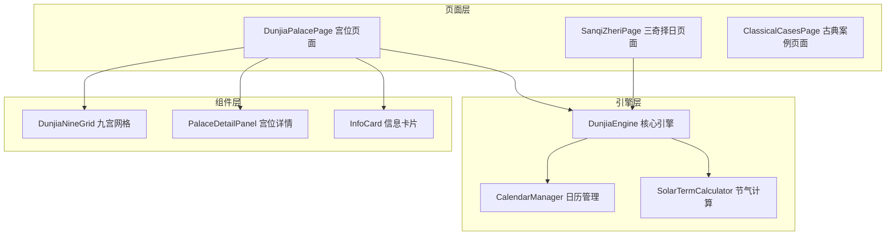
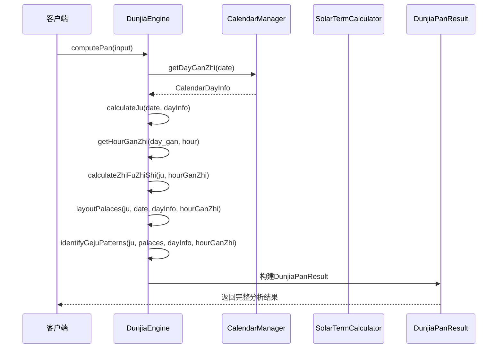
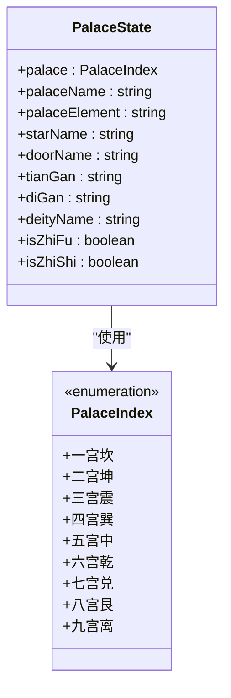

# 引擎结果接口

<cite>
**本文档引用的文件**
- [DunjiaEngine.ets](file://entry/src/main/ets/utils/DunjiaEngine.ets)
- [CalendarManager.ets](file://entry/src/main/ets/utils/CalendarManager.ets)
- [DunjiaPalacePage.ets](file://entry/src/main/ets/pages/DunjiaPalacePage.ets)
- [SanqiZheriPage.ets](file://entry/src/main/ets/pages/SanqiZheriPage.ets)
</cite>

## 目录
1. [简介](#简介)
2. [项目结构](#项目结构)
3. [核心组件](#核心组件)
4. [架构概览](#架构概览)
5. [详细组件分析](#详细组件分析)
6. [依赖分析](#依赖分析)
7. [性能考虑](#性能考虑)
8. [故障排除指南](#故障排除指南)
9. [结论](#结论)

## 简介

本文档详细说明了遁甲时空盘引擎的结果接口DunjiaPanResult，这是一个核心的数据结构，包含了完整的遁甲排盘分析结果。该接口提供了从时间、地点信息到九宫状态、规则命中、格局识别等全方位的遁甲分析数据。

## 项目结构

该项目采用ArkTS技术栈构建，主要包含以下关键模块：



**图表来源**
- [DunjiaEngine.ets](file://entry/src/main/ets/utils/DunjiaEngine.ets#L98-L162)
- [DunjiaPalacePage.ets](file://entry/src/main/ets/pages/DunjiaPalacePage.ets#L1-L250)

**章节来源**
- [DunjiaEngine.ets](file://entry/src/main/ets/utils/DunjiaEngine.ets#L1-L100)
- [DunjiaPalacePage.ets](file://entry/src/main/ets/pages/DunjiaPalacePage.ets#L1-L61)

## 核心组件

DunjiaPanResult作为引擎的核心输出接口，定义了完整的遁甲时空盘分析结果结构。该接口继承了所有必要的遁甲要素，为上层应用提供了丰富的分析数据。

**章节来源**
- [DunjiaEngine.ets](file://entry/src/main/ets/utils/DunjiaEngine.ets#L59-L84)

## 架构概览

引擎采用分层架构设计，从输入参数到最终结果输出的完整流程如下：



**图表来源**
- [DunjiaEngine.ets](file://entry/src/main/ets/utils/DunjiaEngine.ets#L113-L162)

## 详细组件分析

### DunjiaPanResult 主接口

DunjiaPanResult是引擎的核心输出接口，包含了完整的遁甲时空盘分析结果。该接口定义了以下关键属性：

#### 基础信息属性

| 属性名 | 数据类型 | 取值范围 | 描述 | 业务逻辑 |
|--------|----------|----------|------|----------|
| dunType | DunType | 'yang' \| 'yin' | 阴遁/阳遁类型 | 根据节气判断阴阳遁属性 |
| juLabel | string | 自定义格式 | 局数标签，如"阳遁三局" | 格式化输出阴阳遁和局数信息 |
| input | DunjiaInput | 对象实例 | 原始输入参数 | 保留用户输入用于回显和调试 |

#### 核心定位属性

| 属性名 | 数据类型 | 取值范围 | 描述 | 业务逻辑 |
|--------|----------|----------|------|----------|
| zhiFuPalace | PalaceIndex | 0-8 | 值符所在宫位索引 | 代表天时之利的主导力量 |
| zhiShiPalace | PalaceIndex | 0-8 | 值使所在宫位索引 | 代表行动时机的重要位置 |

#### 九宫状态数组

| 属性名 | 数据类型 | 取值范围 | 描述 | 业务逻辑 |
|--------|----------|----------|------|----------|
| palaces | PalaceState[] | 数组长度=9 | 九宫详细状态数组 | 包含九宫的完整信息，包括九星、八门、三奇六仪等 |

#### 规则分析属性

| 属性名 | 数据类型 | 取值范围 | 描述 | 业务逻辑 |
|--------|----------|----------|------|----------|
| ruleHits | RuleHit[] | 数组 | 命中的结构规则列表 | 不直接输出吉凶，只说明结构特征 |
| summary | EvaluationSummary | 对象 | 整体结构评估摘要 | 针对当前场景的研习向描述 |

#### 日期相关信息

| 属性名 | 数据类型 | 取值范围 | 描述 | 业务逻辑 |
|--------|----------|----------|------|----------|
| dayInfo | CalendarDayInfo? | 可选对象 | 当日干支信息（包含农历） | 提供完整的万年历信息 |
| hourGanZhi | string? | 格式如"甲子" | 时辰干支 | 格式化的时干时支信息 |
| solarTimeOffset | number? | 数值（分钟） | 真太阳时偏移量 | 经度换算产生的时差修正 |

#### 高级分析属性

| 属性名 | 数据类型 | 取值范围 | 描述 | 业务逻辑 |
|--------|----------|----------|------|----------|
| gejuPatterns | GejuPattern[]? | 可选数组 | 识别的格局列表 | 高级遁甲格局的自动识别结果 |

**章节来源**
- [DunjiaEngine.ets](file://entry/src/main/ets/utils/DunjiaEngine.ets#L59-L84)

### PalaceState 九宫状态

每个宫位的状态信息包含以下关键要素：



**图表来源**
- [DunjiaEngine.ets](file://entry/src/main/ets/utils/DunjiaEngine.ets#L30-L40)

### CalendarDayInfo 日历信息

日历信息提供了完整的传统历法数据：

| 字段名 | 数据类型 | 描述 | 示例值 |
|--------|----------|------|--------|
| date | string | 格里历日期 | "2024-01-15" |
| year | number | 年份 | 2024 |
| month | number | 月份 | 1-12 |
| day | number | 日期 | 1-31 |
| lunar_year | number | 农历年份 | 2024 |
| lunar_month | number | 农历月份 | 1-12 |
| lunar_day | number | 农历日期 | 1-30 |
| zodiac | string | 生肖 | "龙" |
| year_gan | string | 年天干 | "甲"-"癸" |
| year_zhi | string | 年地支 | "子"-"亥" |
| month_gan | string | 月天干 | "甲"-"癸" |
| month_zhi | string | 月地支 | "子"-"亥" |
| day_gan | string | 日天干 | "甲"-"癸" |
| day_zhi | string | 日地支 | "子"-"亥" |
| week_day | number | 星期 | 0-6 |
| week_name | string | 星期名称 | "星期一" |
| is_holiday | number | 是否节假日 | 0/1 |
| holiday_name | string | 节假日名称 | "元旦" |
| solar_term | string | 节气名称 | "冬至" |
| solar_term_time | SolarTermInfo? | 节气精确时刻 | 可选的节气时间信息 |

**章节来源**
- [CalendarManager.ets](file://entry/src/main/ets/utils/CalendarManager.ets#L5-L28)

### 使用示例

#### 基础使用模式

```typescript
// 创建引擎实例并计算时空盘
const engine = DunjiaEngine.getInstance();
const input: DunjiaInput = {
  dateTime: new Date(),
  longitude: 116.4074,
  sceneType: DunjiaSceneType.GENERAL_STUDY
};

try {
  const result: DunjiaPanResult = await engine.computePan(input);
  
  // 访问基本属性
  console.log(`当前为${result.juLabel}`);
  console.log(`值符在${result.palaces[result.zhiFuPalace].palaceName}`);
  console.log(`值使在${result.palaces[result.zhiShiPalace].palaceName}`);
  
  // 访问九宫状态
  result.palaces.forEach((palace, index) => {
    console.log(`${palace.palaceName}: ${palace.starName} ${palace.doorName}`);
  });
  
} catch (error) {
  console.error('计算失败:', error);
}
```

#### 高级分析使用

```typescript
// 检查特定格局
if (result.gejuPatterns && result.gejuPatterns.length > 0) {
  result.gejuPatterns.forEach(pattern => {
    console.log(`发现格局: ${pattern.name} - ${pattern.description}`);
  });
}

// 获取真太阳时信息
if (result.solarTimeOffset !== undefined) {
  const hours = Math.floor(Math.abs(result.solarTimeOffset) / 60);
  const minutes = Math.abs(result.solarTimeOffset) % 60;
  const direction = result.solarTimeOffset > 0 ? '东' : '西';
  console.log(`真太阳时偏移: ${direction}${hours}小时${minutes}分钟`);
}
```

**章节来源**
- [DunjiaPalacePage.ets](file://entry/src/main/ets/pages/DunjiaPalacePage.ets#L218-L236)
- [SanqiZheriPage.ets](file://entry/src/main/ets/pages/SanqiZheriPage.ets#L117-L134)

## 依赖分析

引擎结果接口的依赖关系如下：

```mermaid
graph TD
subgraph "外部依赖"
CalendarManager[CalendarManager]
SolarTermCalculator[SolarTermCalculator]
Router[@ohos.router]
end
subgraph "内部模块"
DunjiaEngine[DunjiaEngine]
DunjiaPanResult[DunjiaPanResult]
PalaceState[PalaceState]
CalendarDayInfo[CalendarDayInfo]
end
subgraph "页面组件"
DunjiaPalacePage[DunjiaPalacePage]
SanqiZheriPage[SanqiZheriPage]
end
DunjiaEngine --> CalendarManager
DunjiaEngine --> SolarTermCalculator
DunjiaEngine --> DunjiaPanResult
DunjiaPanResult --> PalaceState
DunjiaPanResult --> CalendarDayInfo
DunjiaPalacePage --> DunjiaEngine
SanqiZheriPage --> DunjiaEngine
DunjiaPalacePage --> Router
```

**图表来源**
- [DunjiaEngine.ets](file://entry/src/main/ets/utils/DunjiaEngine.ets#L4-L5)
- [DunjiaPalacePage.ets](file://entry/src/main/ets/pages/DunjiaPalacePage.ets#L1-L5)

**章节来源**
- [DunjiaEngine.ets](file://entry/src/main/ets/utils/DunjiaEngine.ets#L1-L28)

## 性能考虑

### 计算复杂度分析

1. **时间复杂度**: O(1) - 引擎计算涉及固定数量的操作，不随输入规模变化
2. **空间复杂度**: O(1) - 九宫状态数组大小固定为9个元素
3. **缓存策略**: CalendarManager实现了年数据缓存机制，避免重复读取

### 最佳实践

1. **输入验证**: 始终验证输入参数的有效性
2. **错误处理**: 实现完善的异常捕获和错误恢复机制
3. **资源管理**: 合理管理引擎实例的生命周期
4. **数据持久化**: 对于频繁访问的结果进行适当的缓存

## 故障排除指南

### 常见问题及解决方案

#### 1. 无法获取干支信息

**症状**: 返回空盘结果
**原因**: 日历数据加载失败
**解决方案**: 
- 检查网络连接状态
- 验证日历数据文件完整性
- 实现重试机制和降级策略

#### 2. 值符值使位置异常

**症状**: 值符或值使位置不在预期宫位
**原因**: 时干计算错误或局数计算异常
**解决方案**:
- 验证输入的时干计算逻辑
- 检查节气转换的准确性
- 实现中间结果验证

#### 3. 格局识别不准确

**症状**: 自动识别的格局与预期不符
**原因**: 规则匹配逻辑需要优化
**解决方案**:
- 扩展规则匹配条件
- 实现多层级的格局识别
- 添加人工校验机制

**章节来源**
- [DunjiaEngine.ets](file://entry/src/main/ets/utils/DunjiaEngine.ets#L613-L639)

## 结论

DunjiaPanResult接口作为遁甲时空盘引擎的核心输出，提供了完整的遁甲分析数据结构。该接口设计合理，涵盖了从基础信息到高级分析的全方位需求。通过清晰的属性定义、合理的数据类型选择和完善的错误处理机制，为上层应用提供了可靠的数据支撑。

在未来的发展中，可以考虑：
1. 扩展更多高级格局识别能力
2. 增强规则匹配的智能化程度
3. 优化性能表现，支持更大规模的数据处理
4. 提供更丰富的可视化展示选项