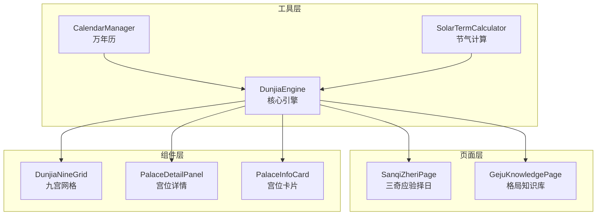
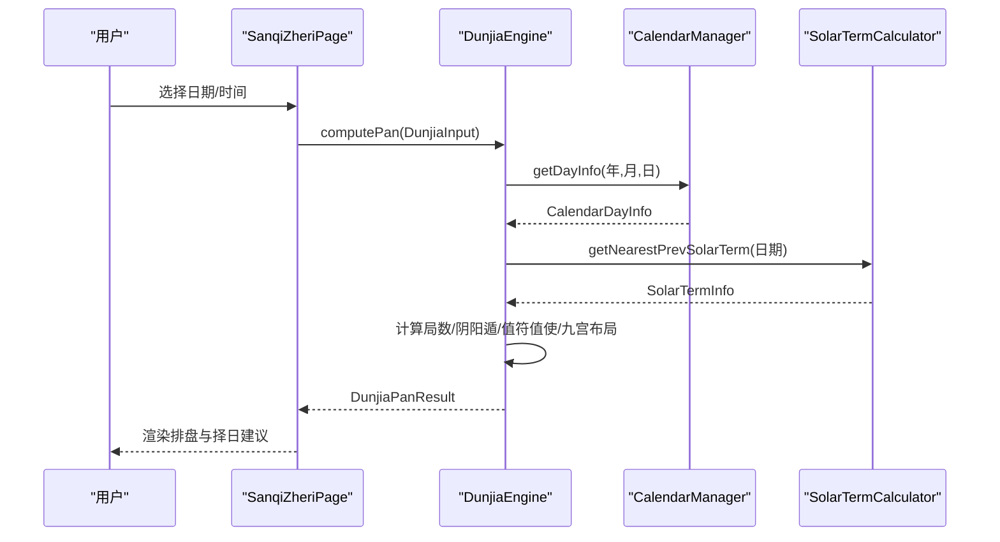
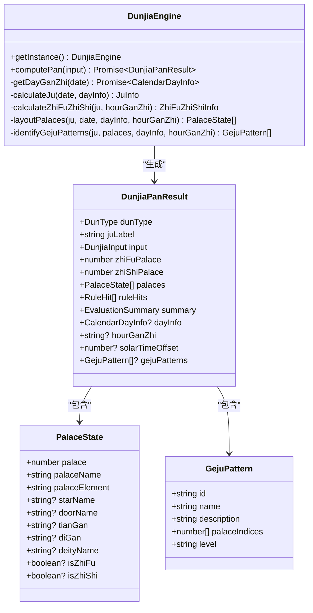
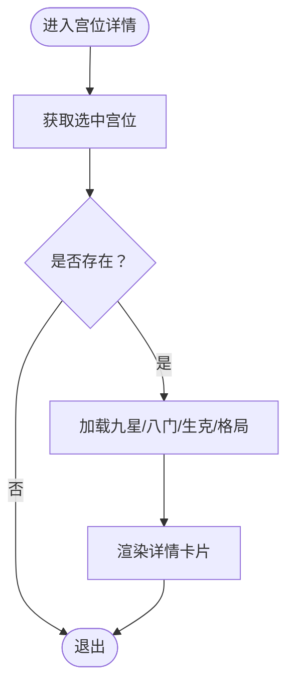
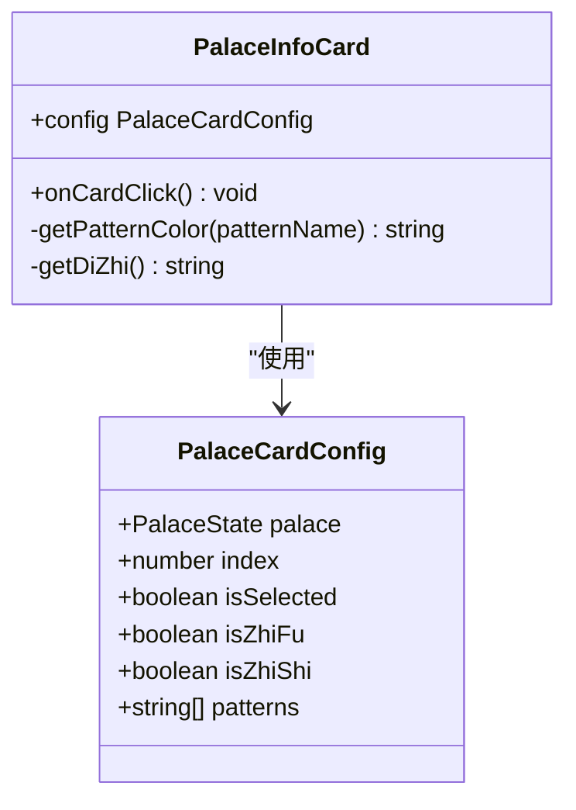
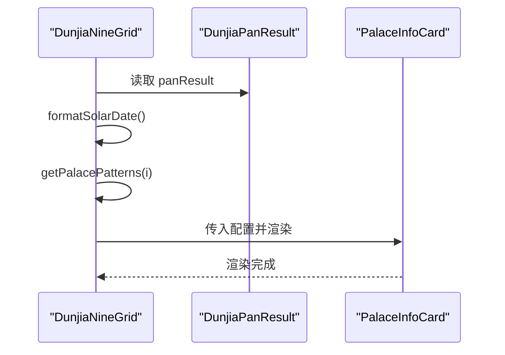
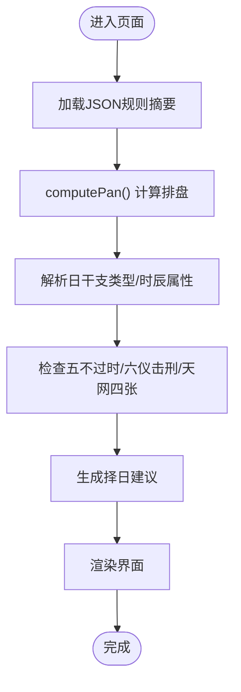
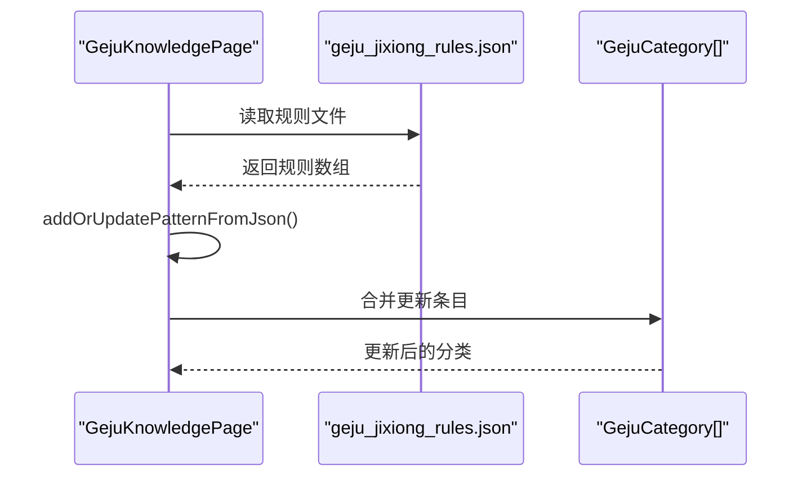
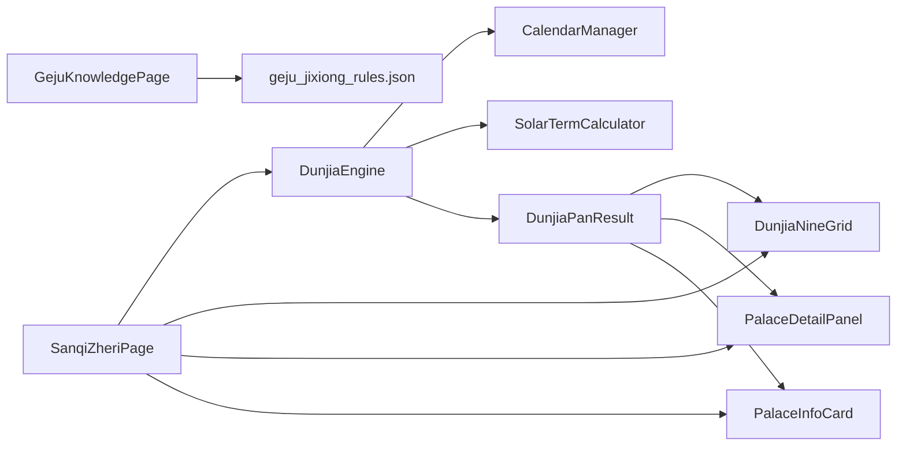

# 数据模型API

<cite>
**本文档引用的文件**
- [DunjiaEngine.ts](file://entry/build/default/cache/default/default@CompileArkTS/esmodule/debug/entry/src/main/ets/utils/DunjiaEngine.ts)
- [DunjiaEngine.ets](file://entry/src/main/ets/utils/DunjiaEngine.ets)
- [PalaceDetailPanel.ts](file://entry/build/default/cache/default/default@CompileArkTS/esmodule/debug/entry/src/main/ets/components/PalaceDetailPanel.ts)
- [PalaceInfoCard.ts](file://entry/build/default/cache/default/default@CompileArkTS/esmodule/debug/entry/src/main/ets/components/PalaceInfoCard.ts)
- [DunjiaNineGrid.ts](file://entry/build/default/cache/default/default@CompileArkTS/esmodule/debug/entry/src/main/ets/components/DunjiaNineGrid.ts)
- [SanqiZheriPage.ts](file://entry/build/default/cache/default/default@CompileArkTS/esmodule/debug/entry/src/main/ets/pages/SanqiZheriPage.ts)
- [GejuKnowledgePage.ts](file://entry/build/default/cache/default/default@CompileArkTS/esmodule/debug/entry/src/main/ets/pages/GejuKnowledgePage.ts)
- [CalendarManager.ts](file://entry/build/default/cache/default/default@CompileArkTS/esmodule/debug/entry/src/main/ets/utils/CalendarManager.ts)
- [SolarTermCalculator.ts](file://entry/build/default/cache/default/default@CompileArkTS/esmodule/debug/entry/src/main/ets/utils/SolarTermCalculator.ts)
</cite>

## 目录
1. [简介](#简介)
2. [项目结构](#项目结构)
3. [核心数据结构](#核心数据结构)
4. [架构总览](#架构总览)
5. [详细组件分析](#详细组件分析)
6. [依赖关系分析](#依赖关系分析)
7. [性能考量](#性能考量)
8. [故障排查指南](#故障排查指南)
9. [结论](#结论)

## 简介
本文件为遁甲排盘系统的核心数据模型API参考文档，聚焦以下关键数据结构与接口：
- PalaceState 宫位状态
- RuleHit 规则命中
- EvaluationSummary 评估摘要
- GejuPattern 格局模式
- DunjiaPanResult 排盘结果
- DunjiaInput 输入参数
- CalendarDayInfo 万年历日信息
- SolarTermInfo 节气信息

文档提供每个字段的类型、取值范围、业务含义、验证规则与约束条件，并通过关系图与序列图展示数据流转与生命周期管理。

## 项目结构
系统采用分层架构：
- 工具层：DunjiaEngine（核心引擎）、CalendarManager（日历）、SolarTermCalculator（节气）
- 页面层：SanqiZheriPage、GejuKnowledgePage 等页面组件
- 组件层：DunjiaNineGrid、PalaceDetailPanel、PalaceInfoCard 等UI组件
- 数据层：各类接口定义与JSON规则文件

图表来源
- [DunjiaEngine.ts](file://entry/build/default/cache/default/default@CompileArkTS/esmodule/debug/entry/src/main/ets/utils/DunjiaEngine.ts#L86-L139)
- [SanqiZheriPage.ts](file://entry/build/default/cache/default/default@CompileArkTS/esmodule/debug/entry/src/main/ets/pages/SanqiZheriPage.ts#L80-L104)
- [GejuKnowledgePage.ts](file://entry/build/default/cache/default/default@CompileArkTS/esmodule/debug/entry/src/main/ets/pages/GejuKnowledgePage.ts#L64-L90)
- [DunjiaNineGrid.ts](file://entry/build/default/cache/default/default@CompileArkTS/esmodule/debug/entry/src/main/ets/components/DunjiaNineGrid.ts#L11-L22)
- [PalaceDetailPanel.ts](file://entry/build/default/cache/default/default@CompileArkTS/esmodule/debug/entry/src/main/ets/components/PalaceDetailPanel.ts#L26-L36)
- [PalaceInfoCard.ts](file://entry/build/default/cache/default/default@CompileArkTS/esmodule/debug/entry/src/main/ets/components/PalaceInfoCard.ts#L26-L41)

章节来源
- [DunjiaEngine.ts](file://entry/build/default/cache/default/default@CompileArkTS/esmodule/debug/entry/src/main/ets/utils/DunjiaEngine.ts#L1-L139)
- [SanqiZheriPage.ts](file://entry/build/default/cache/default/default@CompileArkTS/esmodule/debug/entry/src/main/ets/pages/SanqiZheriPage.ts#L80-L104)
- [GejuKnowledgePage.ts](file://entry/build/default/cache/default/default@CompileArkTS/esmodule/debug/entry/src/main/ets/pages/GejuKnowledgePage.ts#L64-L90)
- [DunjiaNineGrid.ts](file://entry/build/default/cache/default/default@CompileArkTS/esmodule/debug/entry/src/main/ets/components/DunjiaNineGrid.ts#L11-L22)
- [PalaceDetailPanel.ts](file://entry/build/default/cache/default/default@CompileArkTS/esmodule/debug/entry/src/main/ets/components/PalaceDetailPanel.ts#L26-L36)
- [PalaceInfoCard.ts](file://entry/build/default/cache/default/default@CompileArkTS/esmodule/debug/entry/src/main/ets/components/PalaceInfoCard.ts#L26-L41)

## 核心数据结构

### PalaceState 宫位状态
- 字段定义
  - palace: number 宫位索引（0-8）
  - palaceName: string 宫名（如"一宫坎"）
  - palaceElement: string 五行（水/火/木/金/土）
  - starName?: string 九星名称（如"天蓬"）
  - doorName?: string 八门名称（如"生门"）
  - tianGan?: string 天盘天干（暗干）
  - diGan?: string 地盘天干（明干）
  - deityName?: string 八神名称（如"九天"）
  - isZhiFu?: boolean 是否为值符宫
  - isZhiShi?: boolean 是否为值使宫
- 取值范围与约束
  - palace ∈ [0,8]，且与九宫一一对应
  - palaceElement ∈ {"水","火","木","金","土"}
  - starName ∈ ["天蓬","天芮","天冲","天辅","天禽","天心","天柱","天任","天英"]
  - doorName ∈ {"休门","死门","伤门","杜门","开门","惊门","生门","景门",""（中宫无门）}
  - deityName ∈ {"值符","腾蛇","太阴","六合","白虎","玄武","九地","九天","天禽"（中宫）}
  - tianGan/diGan ∈ {"甲","乙","丙","丁","戊","己","庚","辛","壬","癸"} 或空
- 业务含义
  - 描述九宫中九星、八门、三奇六仪、八神、天干地支等信息
  - isZhiFu/isZhiShi 标识值符/值使宫位，用于排盘核心定位

章节来源
- [DunjiaEngine.ts](file://entry/build/default/cache/default/default@CompileArkTS/esmodule/debug/entry/src/main/ets/utils/DunjiaEngine.ts#L23-L34)
- [DunjiaEngine.ts](file://entry/build/default/cache/default/default@CompileArkTS/esmodule/debug/entry/src/main/ets/utils/DunjiaEngine.ts#L310-L335)

### RuleHit 规则命中
- 字段定义
  - id: string 规则唯一标识（如"sanqi_deshi"）
  - name: string 规则名称（如"三奇得使"）
  - level: 'info' | 'hint' | 'focus' UI提示等级
  - description: string 面向研习者的结构化说明文案
- 取值范围与约束
  - level ∈ {'info','hint','focus'}
- 业务含义
  - 记录引擎识别到的结构化规则命中，不直接输出吉凶，仅说明结构特征

章节来源
- [DunjiaEngine.ts](file://entry/build/default/cache/default/default@CompileArkTS/esmodule/debug/entry/src/main/ets/utils/DunjiaEngine.ts#L35-L40)

### EvaluationSummary 评估摘要
- 字段定义
  - structureTag: string 简短结构特征标签（如"偏向主动推进"）
  - overview: string 概览说明（用于研习参考）
  - focusPoints: string[] 建议关注的宫位或要素
- 取值范围与约束
  - structureTag 为结构化标签文本
  - overview 为自然语言描述
  - focusPoints 为字符串数组，元素为宫位或要素名称
- 业务含义
  - 面向学习者提供整体结构评估与关注要点

章节来源
- [DunjiaEngine.ts](file://entry/build/default/cache/default/default@CompileArkTS/esmodule/debug/entry/src/main/ets/utils/DunjiaEngine.ts#L41-L48)

### GejuPattern 格局模式
- 字段定义
  - id: string 格局唯一标识（如"sanqi_deshi_丙"）
  - name: string 格局名称（如"三奇得使(丙)"）
  - description: string 格局说明
  - palaceIndices: number[] 涉及的宫位索引集合
  - level: 'minor' | 'major' | 'special' 次要/主要/特殊格局
- 取值范围与约束
  - palaceIndices ⊆ {0,1,2,3,4,5,6,7,8}
  - level ∈ {'minor','major','special'}
- 业务含义
  - 表示遁甲排盘中识别到的格局，用于指导研习与应用

章节来源
- [DunjiaEngine.ts](file://entry/build/default/cache/default/default@CompileArkTS/esmodule/debug/entry/src/main/ets/utils/DunjiaEngine.ts#L78-L84)

### DunjiaPanResult 排盘结果
- 字段定义
  - dunType: DunType 阴遁/阳遁
  - juLabel: string 局数标签（如"阳遁上元三局"）
  - input: DunjiaInput 原始输入
  - zhiFuPalace: number 值符所在宫位
  - zhiShiPalace: number 值使所在宫位
  - palaces: PalaceState[] 九宫详细状态
  - ruleHits: RuleHit[] 结构规则命中列表
  - summary: EvaluationSummary 整体结构评估
  - dayInfo?: CalendarDayInfo 当日干支信息（含农历）
  - hourGanZhi?: string 时辰干支
  - solarTimeOffset?: number 真太阳时偏移量（分钟）
  - gejuPatterns?: GejuPattern[] 识别的格局列表
- 取值范围与约束
  - zhiFuPalace、zhiShiPalace ∈ {0,1,2,3,4,5,6,7,8}
  - palaces.length = 9，且按索引0-8对应九宫
  - gejuPatterns 为空或存在
- 业务含义
  - 完整的遁甲排盘结果，包含时间、地点、九宫状态、规则命中、评估摘要与格局

章节来源
- [DunjiaEngine.ts](file://entry/build/default/cache/default/default@CompileArkTS/esmodule/debug/entry/src/main/ets/utils/DunjiaEngine.ts#L49-L74)

### DunjiaInput 输入参数
- 字段定义
  - dateTime: Date 建议使用真太阳时校正后的公历时间
  - longitude: number 地理经度（用于真太阳时与节气研习，东经为正）
  - sceneType: DunjiaSceneType 研习场景类型
- 取值范围与约束
  - longitude ∈ (-∞,+∞)，通常为0-360范围内的十进制度数
  - sceneType ∈ {"general_study","strategy_study","time_window"}
- 业务含义
  - 作为排盘计算的输入，决定局数、值符值使与真太阳时偏移

章节来源
- [DunjiaEngine.ts](file://entry/build/default/cache/default/default@CompileArkTS/esmodule/debug/entry/src/main/ets/utils/DunjiaEngine.ts#L15-L22)

### CalendarDayInfo 万年历日信息
- 字段定义
  - date: string 日期字符串（YYYY-MM-DD）
  - year: number 年
  - month: number 月
  - day: number 日
  - lunar_year: number 农历年
  - lunar_month: number 农历月
  - lunar_day: number 农日
  - zodiac: string 生肖
  - year_gan: string 年干
  - year_zhi: string 年支
  - month_gan: string 月干
  - month_zhi: string 月支
  - day_gan: string 日干
  - day_zhi: string 日支
  - week_day: number 星期（0-6）
  - week_name: string 星期名称
  - is_holiday: number 是否节假日
  - holiday_name: string 节假日名称
  - solar_term: string 节气名称
  - festivals: string 节庆
  - solar_term_time?: SolarTermInfo 节气精确时刻
- 取值范围与约束
  - week_day ∈ {0,1,2,3,4,5,6}
  - solar_term ∈ 24节气名称之一或空
- 业务含义
  - 提供公历/农历、干支、节气、节假日等综合信息，支撑排盘与择日

章节来源
- [CalendarManager.ts](file://entry/build/default/cache/default/default@CompileArkTS/esmodule/debug/entry/src/main/ets/utils/CalendarManager.ts#L6-L29)

### SolarTermInfo 节气信息
- 字段定义
  - name: string 节气名称（如"小寒"）
  - time: Date 交节时刻（北京时间）
  - longitude: number 太阳黄经（度）
  - index: number 节气索引（0-23）
- 取值范围与约束
  - name ∈ {"小寒","大寒",...,"冬至"}
  - index ∈ {0,1,...,23}
- 业务含义
  - 精确节气时刻，用于确定遁甲局数与阴阳遁类型

章节来源
- [SolarTermCalculator.ts](file://entry/build/default/cache/default/default@CompileArkTS/esmodule/debug/entry/src/main/ets/utils/SolarTermCalculator.ts#L22-L27)

## 架构总览
核心流程：输入时间与地点 → 获取日干支与节气 → 计算局数与阴阳遁 → 布局九宫（九星、八门、三奇六仪、八神）→ 计算值符值使 → 识别格局 → 生成排盘结果。

图表来源
- [SanqiZheriPage.ts](file://entry/build/default/cache/default/default@CompileArkTS/esmodule/debug/entry/src/main/ets/pages/SanqiZheriPage.ts#L279-L294)
- [DunjiaEngine.ts](file://entry/build/default/cache/default/default@CompileArkTS/esmodule/debug/entry/src/main/ets/utils/DunjiaEngine.ts#L98-L139)
- [CalendarManager.ts](file://entry/build/default/cache/default/default@CompileArkTS/esmodule/debug/entry/src/main/ets/utils/CalendarManager.ts#L47-L81)
- [SolarTermCalculator.ts](file://entry/build/default/cache/default/default@CompileArkTS/esmodule/debug/entry/src/main/ets/utils/SolarTermCalculator.ts#L123-L136)

## 详细组件分析

### DunjiaEngine 核心引擎
- 职责
  - 计算排盘结果 DunjiaPanResult
  - 识别格局 GejuPattern
  - 生成结构规则 RuleHit 与评估摘要 EvaluationSummary
- 关键算法
  - 值符值使计算：基于时干/时支与阴阳遁规则
  - 九宫布局：九星、八门、三奇六仪、八神的固定与飞布规则
  - 局数与阴阳遁：依据节气与地支仲孟季判断
- 数据流
  - 输入 DunjiaInput → 输出 DunjiaPanResult（含 palaces、gejuPatterns、summary）

图表来源
- [DunjiaEngine.ts](file://entry/build/default/cache/default/default@CompileArkTS/esmodule/debug/entry/src/main/ets/utils/DunjiaEngine.ts#L86-L139)
- [DunjiaEngine.ts](file://entry/build/default/cache/default/default@CompileArkTS/esmodule/debug/entry/src/main/ets/utils/DunjiaEngine.ts#L23-L34)
- [DunjiaEngine.ts](file://entry/build/default/cache/default/default@CompileArkTS/esmodule/debug/entry/src/main/ets/utils/DunjiaEngine.ts#L78-L84)
- [DunjiaEngine.ts](file://entry/build/default/cache/default/default@CompileArkTS/esmodule/debug/entry/src/main/ets/utils/DunjiaEngine.ts#L49-L74)

章节来源
- [DunjiaEngine.ts](file://entry/build/default/cache/default/default@CompileArkTS/esmodule/debug/entry/src/main/ets/utils/DunjiaEngine.ts#L86-L800)

### PalaceDetailPanel 宫位详情面板
- 职责
  - 展示选中宫位的九星断语、八门吉凶、五行生克、值符值使说明、相关格局
- 关键逻辑
  - 获取选中宫位：getSelectedPalaceState()
  - 相关格局筛选：getRelatedPatterns()
  - 五行生克关系：getWuxingRelation()
  - 值符值使说明：getZhiFuZhiShiInfo()

图表来源
- [PalaceDetailPanel.ts](file://entry/build/default/cache/default/default@CompileArkTS/esmodule/debug/entry/src/main/ets/components/PalaceDetailPanel.ts#L80-L92)
- [PalaceDetailPanel.ts](file://entry/build/default/cache/default/default@CompileArkTS/esmodule/debug/entry/src/main/ets/components/PalaceDetailPanel.ts#L96-L118)
- [PalaceDetailPanel.ts](file://entry/build/default/cache/default/default@CompileArkTS/esmodule/debug/entry/src/main/ets/components/PalaceDetailPanel.ts#L122-L132)
- [PalaceDetailPanel.ts](file://entry/build/default/cache/default/default@CompileArkTS/esmodule/debug/entry/src/main/ets/components/PalaceDetailPanel.ts#L136-L188)
- [PalaceDetailPanel.ts](file://entry/build/default/cache/default/default@CompileArkTS/esmodule/debug/entry/src/main/ets/components/PalaceDetailPanel.ts#L192-L247)

章节来源
- [PalaceDetailPanel.ts](file://entry/build/default/cache/default/default@CompileArkTS/esmodule/debug/entry/src/main/ets/components/PalaceDetailPanel.ts#L26-L694)

### PalaceInfoCard 宫位信息卡片
- 职责
  - 展示宫位基本信息（九星、八门、天盘地盘干支、八神）
  - 标识值符/值使宫位
  - 显示相关格局徽章
- 关键逻辑
  - 地支映射：根据宫位索引映射到地支
  - 徽章颜色：按格局类型设置颜色
  - 点击事件：回调父组件

图表来源
- [PalaceInfoCard.ts](file://entry/build/default/cache/default/default@CompileArkTS/esmodule/debug/entry/src/main/ets/components/PalaceInfoCard.ts#L18-L25)
- [PalaceInfoCard.ts](file://entry/build/default/cache/default/default@CompileArkTS/esmodule/debug/entry/src/main/ets/components/PalaceInfoCard.ts#L64-L82)

章节来源
- [PalaceInfoCard.ts](file://entry/build/default/cache/default/default@CompileArkTS/esmodule/debug/entry/src/main/ets/components/PalaceInfoCard.ts#L26-L322)

### DunjiaNineGrid 九宫网格
- 职责
  - 渲染九宫网格，展示宫位卡片
  - 显示时间、局数、真太阳时偏移、评估摘要
- 关键逻辑
  - 格式化日期：formatSolarDate()
  - 获取宫位相关格局：getPalacePatterns()
  - 构建宫位卡片：buildPalaceCard()

图表来源
- [DunjiaNineGrid.ts](file://entry/build/default/cache/default/default@CompileArkTS/esmodule/debug/entry/src/main/ets/components/DunjiaNineGrid.ts#L66-L81)
- [DunjiaNineGrid.ts](file://entry/build/default/cache/default/default@CompileArkTS/esmodule/debug/entry/src/main/ets/components/DunjiaNineGrid.ts#L85-L150)
- [DunjiaNineGrid.ts](file://entry/build/default/cache/default/default@CompileArkTS/esmodule/debug/entry/src/main/ets/components/DunjiaNineGrid.ts#L151-L364)

章节来源
- [DunjiaNineGrid.ts](file://entry/build/default/cache/default/default@CompileArkTS/esmodule/debug/entry/src/main/ets/components/DunjiaNineGrid.ts#L11-L369)

### SanqiZheriPage 三奇应验择日
- 职责
  - 计算排盘并展示
  - 加载三奇应验、择日应用、神煞JSON规则摘要
  - 生成择日建议（日干支类型、五阳/五阴时、五不过时、五不可击等）
- 关键逻辑
  - computePan()：调用引擎计算排盘
  - loadZeriAndSanqiJson()：读取JSON规则并解析摘要
  - getZheriSuggestion()：综合生成择日建议

图表来源
- [SanqiZheriPage.ts](file://entry/build/default/cache/default/default@CompileArkTS/esmodule/debug/entry/src/main/ets/pages/SanqiZheriPage.ts#L259-L294)
- [SanqiZheriPage.ts](file://entry/build/default/cache/default/default@CompileArkTS/esmodule/debug/entry/src/main/ets/pages/SanqiZheriPage.ts#L295-L458)
- [SanqiZheriPage.ts](file://entry/build/default/cache/default/default@CompileArkTS/esmodule/debug/entry/src/main/ets/pages/SanqiZheriPage.ts#L679-L696)

章节来源
- [SanqiZheriPage.ts](file://entry/build/default/cache/default/default@CompileArkTS/esmodule/debug/entry/src/main/ets/pages/SanqiZheriPage.ts#L80-L800)

### GejuKnowledgePage 格局知识库
- 职责
  - 展示预置格局分类与条目
  - 从JSON规则文件动态更新/合并格局条目
- 关键逻辑
  - loadGejuJson()：读取 geju_jixiong_rules.json
  - addOrUpdatePatternFromJson()：按类别与ID合并更新
  - mapGejuType()/mapGejuCategoryId()：映射类型与类别

图表来源
- [GejuKnowledgePage.ts](file://entry/build/default/cache/default/default@CompileArkTS/esmodule/debug/entry/src/main/ets/pages/GejuKnowledgePage.ts#L351-L422)
- [GejuKnowledgePage.ts](file://entry/build/default/cache/default/default@CompileArkTS/esmodule/debug/entry/src/main/ets/pages/GejuKnowledgePage.ts#L423-L518)

章节来源
- [GejuKnowledgePage.ts](file://entry/build/default/cache/default/default@CompileArkTS/esmodule/debug/entry/src/main/ets/pages/GejuKnowledgePage.ts#L64-L800)

## 依赖关系分析
- DunjiaEngine 依赖 CalendarManager 与 SolarTermCalculator 获取日干支与节气信息
- 页面与组件通过 DunjiaEngine 获取 DunjiaPanResult 并进行渲染
- GejuKnowledgePage 依赖 JSON 规则文件动态扩展格局知识

图表来源
- [DunjiaEngine.ts](file://entry/build/default/cache/default/default@CompileArkTS/esmodule/debug/entry/src/main/ets/utils/DunjiaEngine.ts#L1-L7)
- [SanqiZheriPage.ts](file://entry/build/default/cache/default/default@CompileArkTS/esmodule/debug/entry/src/main/ets/pages/SanqiZheriPage.ts#L22-L26)
- [GejuKnowledgePage.ts](file://entry/build/default/cache/default/default@CompileArkTS/esmodule/debug/entry/src/main/ets/pages/GejuKnowledgePage.ts#L10-L10)

章节来源
- [DunjiaEngine.ts](file://entry/build/default/cache/default/default@CompileArkTS/esmodule/debug/entry/src/main/ets/utils/DunjiaEngine.ts#L1-L7)
- [SanqiZheriPage.ts](file://entry/build/default/cache/default/default@CompileArkTS/esmodule/debug/entry/src/main/ets/pages/SanqiZheriPage.ts#L22-L26)
- [GejuKnowledgePage.ts](file://entry/build/default/cache/default/default@CompileArkTS/esmodule/debug/entry/src/main/ets/pages/GejuKnowledgePage.ts#L10-L10)

## 性能考量
- 缓存策略
  - CalendarManager 对年份数据进行缓存，避免重复读取
  - SolarTermCalculator 对节气结果进行缓存，减少重复计算
- 异步处理
  - 日历与JSON规则读取采用异步方式，避免阻塞UI
- 渲染优化
  - 组件按需渲染，仅在数据变化时更新
  - PalaceInfoCard 限制显示的格局徽章数量，提升性能

## 故障排查指南
- 排盘计算失败
  - 检查输入时间是否有效，经度范围是否合理
  - 查看日干支获取是否成功（CalendarManager）
  - 检查节气计算是否返回有效结果（SolarTermCalculator）
- JSON规则加载失败
  - 确认资源路径正确（rules/geju_jixiong_rules.json 等）
  - 检查JSON格式是否合法
- UI渲染异常
  - 检查 DunjiaPanResult 是否为空
  - 确认宫位索引与九宫映射关系

章节来源
- [SanqiZheriPage.ts](file://entry/build/default/cache/default/default@CompileArkTS/esmodule/debug/entry/src/main/ets/pages/SanqiZheriPage.ts#L290-L294)
- [SanqiZheriPage.ts](file://entry/build/default/cache/default/default@CompileArkTS/esmodule/debug/entry/src/main/ets/pages/SanqiZheriPage.ts#L300-L328)
- [GejuKnowledgePage.ts](file://entry/build/default/cache/default/default@CompileArkTS/esmodule/debug/entry/src/main/ets/pages/GejuKnowledgePage.ts#L363-L368)

## 结论
本文档系统梳理了遁甲排盘系统的数据模型API，明确了核心数据结构、接口定义、验证规则与约束条件，并通过关系图与序列图展示了数据流转与生命周期管理。开发者可据此进行二次开发与集成，确保数据一致性与业务正确性。