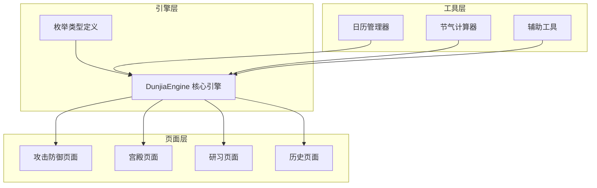
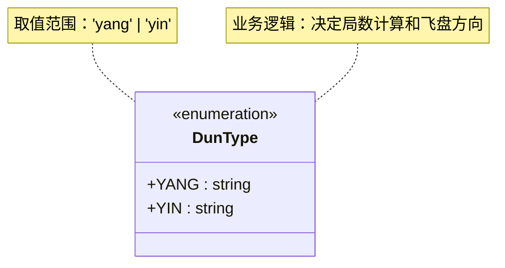
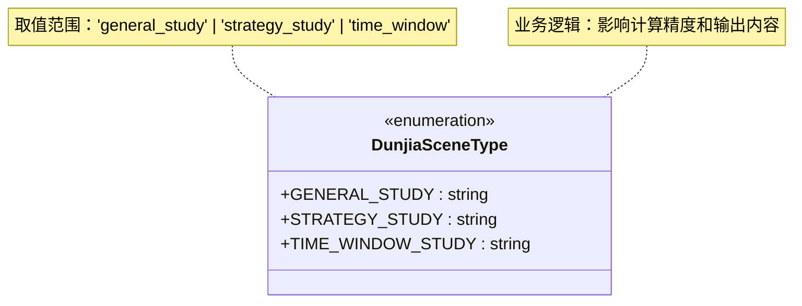
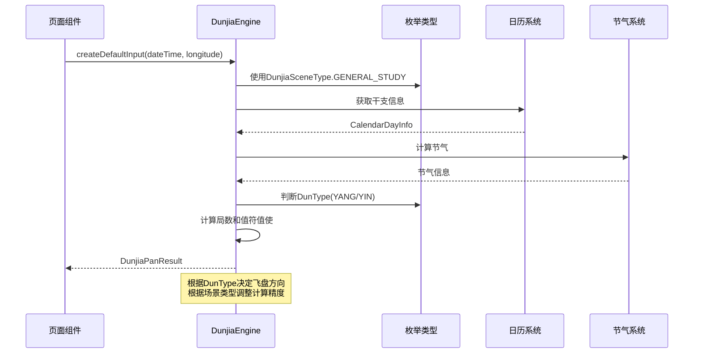
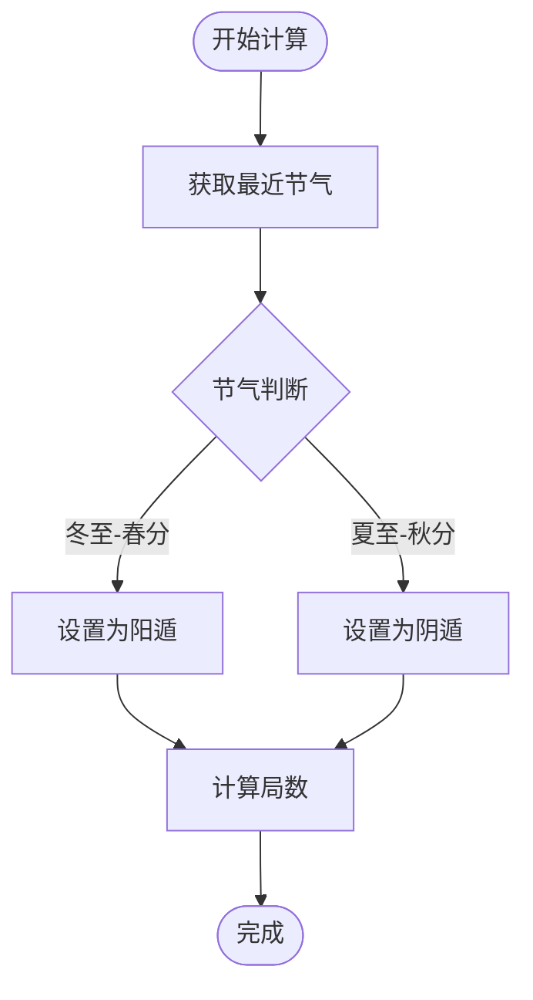
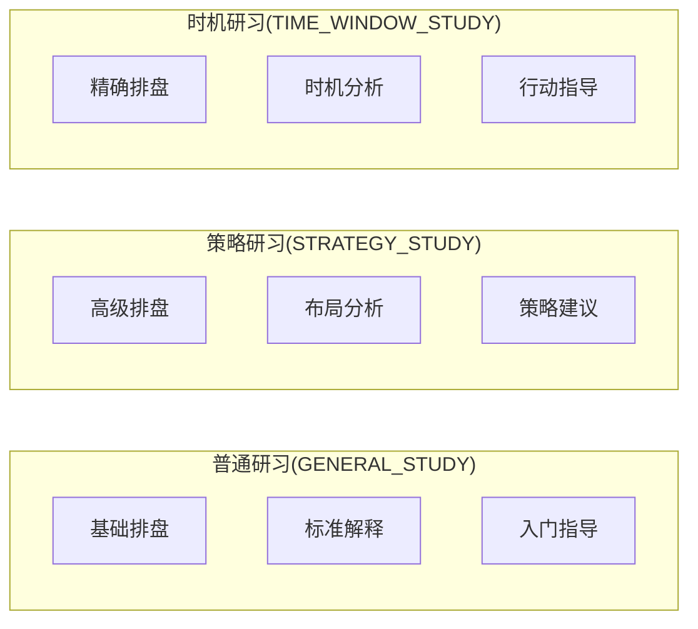
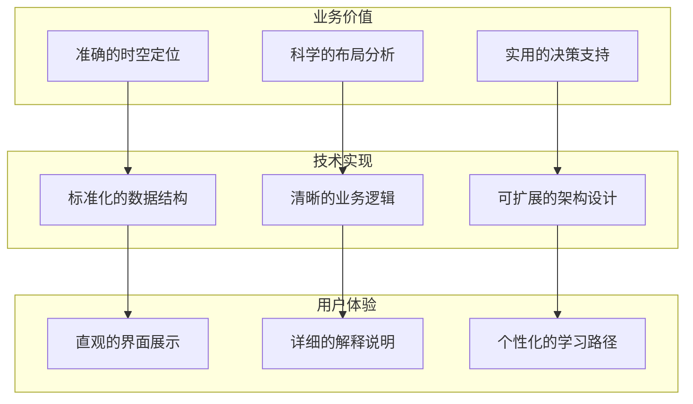
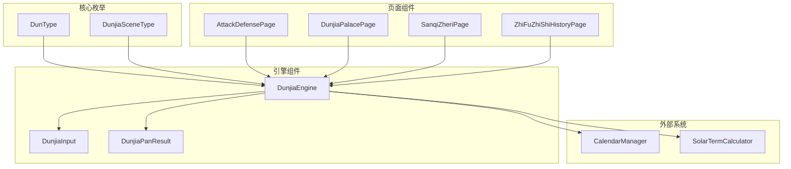

# 枚举类型定义

<cite>
**本文档引用的文件**
- [DunjiaEngine.ets](file://entry/src/main/ets/utils/DunjiaEngine.ets)
- [AttackDefensePage.ets](file://entry/src/main/ets/pages/AttackDefensePage.ets)
- [DunjiaPalacePage.ets](file://entry/src/main/ets/pages/DunjiaPalacePage.ets)
- [SanqiZheriPage.ets](file://entry/src/main/ets/pages/SanqiZheriPage.ets)
- [ZhiFuZhiShiHistoryPage.ets](file://entry/src/main/ets/pages/ZhiFuZhiShiHistoryPage.ets)
</cite>

## 目录
1. [简介](#简介)
2. [项目结构](#项目结构)
3. [核心组件](#核心组件)
4. [架构概览](#架构概览)
5. [详细组件分析](#详细组件分析)
6. [依赖分析](#依赖分析)
7. [性能考虑](#性能考虑)
8. [故障排除指南](#故障排除指南)
9. [结论](#结论)

## 简介

本文档提供了遁甲引擎中枚举类型定义的完整参考文档。重点涵盖两个核心枚举类型：DunType阴阳遁枚举和DunjiaSceneType遁甲场景类型枚举。这些枚举类型是遁甲时空盘计算引擎的基础数据结构，决定了遁甲盘面的布局规则、计算逻辑和应用场景。

遁甲作为中国传统术数的重要组成部分，通过天干地支、九宫八卦、九星八门等元素的组合，形成复杂的时空盘面。本文档将详细解释这些枚举值的含义、取值范围、业务逻辑以及在实际应用中的使用方式。

## 项目结构

遁甲引擎采用模块化的架构设计，主要包含以下关键组件：



**图表来源**
- [DunjiaEngine.ets](file://entry/src/main/ets/utils/DunjiaEngine.ets#L1-L961)
- [AttackDefensePage.ets](file://entry/src/main/ets/pages/AttackDefensePage.ets#L1-L50)

**章节来源**
- [DunjiaEngine.ets](file://entry/src/main/ets/utils/DunjiaEngine.ets#L1-L961)

## 核心组件

### DunType 阴阳遁枚举

DunType枚举定义了遁甲中的阴阳遁类型，这是遁甲盘面布局的核心基础。



**图表来源**
- [DunjiaEngine.ets](file://entry/src/main/ets/utils/DunjiaEngine.ets#L7-L10)

### DunjiaSceneType 遁甲场景类型枚举

DunjiaSceneType枚举定义了不同的遁甲研习场景类型，用于指导计算引擎采用相应的计算策略。



**图表来源**
- [DunjiaEngine.ets](file://entry/src/main/ets/utils/DunjiaEngine.ets#L12-L16)

**章节来源**
- [DunjiaEngine.ets](file://entry/src/main/ets/utils/DunjiaEngine.ets#L7-L16)

## 架构概览

遁甲引擎的架构基于《遁甲符应经》的传统规则，通过枚举类型驱动整个计算流程：



**图表来源**
- [DunjiaEngine.ets](file://entry/src/main/ets/utils/DunjiaEngine.ets#L113-L162)
- [DunjiaEngine.ets](file://entry/src/main/ets/utils/DunjiaEngine.ets#L286-L289)

## 详细组件分析

### DunType 阴阳遁枚举详解

#### 取值范围和含义

| 枚举值 | 字符串值 | 含义 | 业务逻辑 |
|--------|----------|------|----------|
| YANG | 'yang' | 阳遁 | 冬至后开始，顺飞布局，值符从一宫顺飞 |
| YIN | 'yin' | 阴遁 | 夏至后开始，逆飞布局，值符从九宫逆飞 |

#### 实现细节



**图表来源**
- [DunjiaEngine.ets](file://entry/src/main/ets/utils/DunjiaEngine.ets#L286-L289)

#### 使用场景

1. **局数计算**：根据阴阳遁类型选择对应的局数表
2. **值符布局**：决定值符的飞盘方向（顺飞/逆飞）
3. **值使计算**：确定值使门的起始位置和移动规律

**章节来源**
- [DunjiaEngine.ets](file://entry/src/main/ets/utils/DunjiaEngine.ets#L286-L289)

### DunjiaSceneType 场景类型枚举详解

#### 取值范围和含义

| 枚举值 | 字符串值 | 含义 | 业务逻辑 |
|--------|----------|------|----------|
| GENERAL_STUDY | 'general_study' | 普通研习 | 标准计算，适用于一般学习和研究 |
| STRATEGY_STUDY | 'strategy_study' | 局势/布局研习 | 高精度计算，重点关注布局和策略分析 |
| TIME_WINDOW_STUDY | 'time_window' | 时机窗口研习 | 精确到时辰的计算，重点关注时机把握 |

#### 实际应用场景



**图表来源**
- [AttackDefensePage.ets](file://entry/src/main/ets/pages/AttackDefensePage.ets#L36-L42)
- [DunjiaPalacePage.ets](file://entry/src/main/ets/pages/DunjiaPalacePage.ets#L220-L230)

#### 在代码中的使用示例

1. **攻击防御页面**：
   ```typescript
   const input: DunjiaInput = {
       dateTime: this.currentDateTime,
       longitude: 116.4074,
       sceneType: DunjiaSceneType.GENERAL_STUDY
   }
   ```

2. **宫殿页面**：
   ```typescript
   const input: DunjiaInput = {
       dateTime: this.currentDateTime,
       longitude: this.longitude,
       sceneType: DunjiaSceneType.GENERAL_STUDY
   }
   ```

3. **三奇择日页面**：
   ```typescript
   const input: DunjiaInput = {
       dateTime: this.currentDateTime,
       longitude: this.longitude,
       sceneType: DunjiaSceneType.GENERAL_STUDY
   }
   ```

4. **历史页面**：
   ```typescript
   const input: DunjiaInput = {
       dateTime: this.currentDateTime,
       longitude: this.longitude,
       sceneType: DunjiaSceneType.GENERAL_STUDY
   }
   ```

**章节来源**
- [AttackDefensePage.ets](file://entry/src/main/ets/pages/AttackDefensePage.ets#L36-L42)
- [DunjiaPalacePage.ets](file://entry/src/main/ets/pages/DunjiaPalacePage.ets#L220-L230)
- [SanqiZheriPage.ets](file://entry/src/main/ets/pages/SanqiZheriPage.ets#L120-L130)
- [ZhiFuZhiShiHistoryPage.ets](file://entry/src/main/ets/pages/ZhiFuZhiShiHistoryPage.ets#L50-L60)

### 枚举类型在整个遁甲引擎中的作用

#### 核心作用

1. **计算逻辑控制**：决定遁甲盘面的布局规则和计算方向
2. **场景适配**：根据不同的研习需求调整计算精度和输出内容
3. **数据一致性**：确保引擎内部各模块使用统一的枚举值

#### 业务重要性



## 依赖分析

### 枚举类型依赖关系



**图表来源**
- [DunjiaEngine.ets](file://entry/src/main/ets/utils/DunjiaEngine.ets#L21-L28)
- [DunjiaEngine.ets](file://entry/src/main/ets/utils/DunjiaEngine.ets#L59-L84)

### 耦合度分析

| 组件 | 耦合程度 | 说明 |
|------|----------|------|
| DunType | 低耦合 | 仅作为数据标识，不影响业务逻辑 |
| DunjiaSceneType | 中等耦合 | 影响计算精度和输出内容 |
| DunjiaEngine | 高耦合 | 依赖多个外部系统和组件 |
| 页面组件 | 低耦合 | 仅使用引擎的公共接口 |

**章节来源**
- [DunjiaEngine.ets](file://entry/src/main/ets/utils/DunjiaEngine.ets#L1-L961)

## 性能考虑

### 枚举类型的优势

1. **内存效率**：枚举值占用固定大小的内存空间
2. **类型安全**：编译时检查枚举值的有效性
3. **可读性强**：枚举名称比字符串字面量更易理解

### 性能优化建议

1. **避免重复创建**：使用单例模式管理DunjiaEngine实例
2. **缓存计算结果**：对频繁查询的节气和干支信息进行缓存
3. **延迟初始化**：按需初始化外部依赖组件

## 故障排除指南

### 常见问题及解决方案

#### 问题1：枚举值无效
**症状**：运行时出现类型错误或逻辑异常
**解决方案**：
- 确保使用正确的枚举值
- 检查枚举导入是否正确
- 验证枚举值的字符串匹配

#### 问题2：计算结果不符合预期
**症状**：遁甲盘面布局与传统规则不符
**解决方案**：
- 检查节气计算的准确性
- 验证阴阳遁判断逻辑
- 确认值符值使计算的正确性

#### 问题3：场景类型影响计算精度
**症状**：不同场景类型下的计算结果差异较大
**解决方案**：
- 明确各场景类型的应用场景
- 根据具体需求选择合适的场景类型
- 验证场景类型对计算逻辑的影响

**章节来源**
- [DunjiaEngine.ets](file://entry/src/main/ets/utils/DunjiaEngine.ets#L286-L289)

## 结论

遁甲引擎中的枚举类型定义体现了传统术数与现代软件工程的完美结合。DunType和DunjiaSceneType两个核心枚举不仅提供了清晰的数据结构定义，更重要的是它们承载了《遁甲符应经》的核心规则和智慧。

通过标准化的枚举类型，遁甲引擎实现了：

1. **规则的规范化**：将复杂的传统规则转化为明确的代码逻辑
2. **计算的准确性**：确保遁甲盘面布局符合传统要求
3. **应用的灵活性**：支持不同研习场景的需求
4. **系统的稳定性**：通过类型检查避免运行时错误

这些枚举类型在整个遁甲引擎中发挥着基础性的作用，是连接传统智慧与现代技术的桥梁。它们的存在使得复杂的遁甲计算变得有序、可控且易于维护，为用户提供了准确可靠的遁甲研习工具。

在未来的发展中，这些枚举类型将继续作为系统的基础构件，支撑着遁甲引擎的持续演进和功能扩展。通过合理的设计和实现，它们将帮助更多用户理解和掌握这一古老而深邃的中华传统文化。