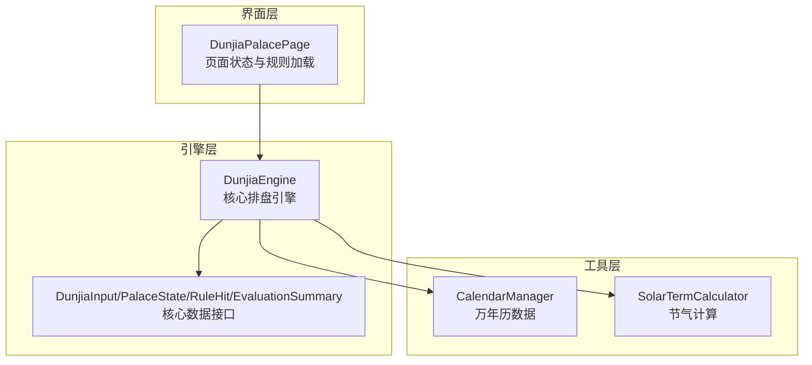
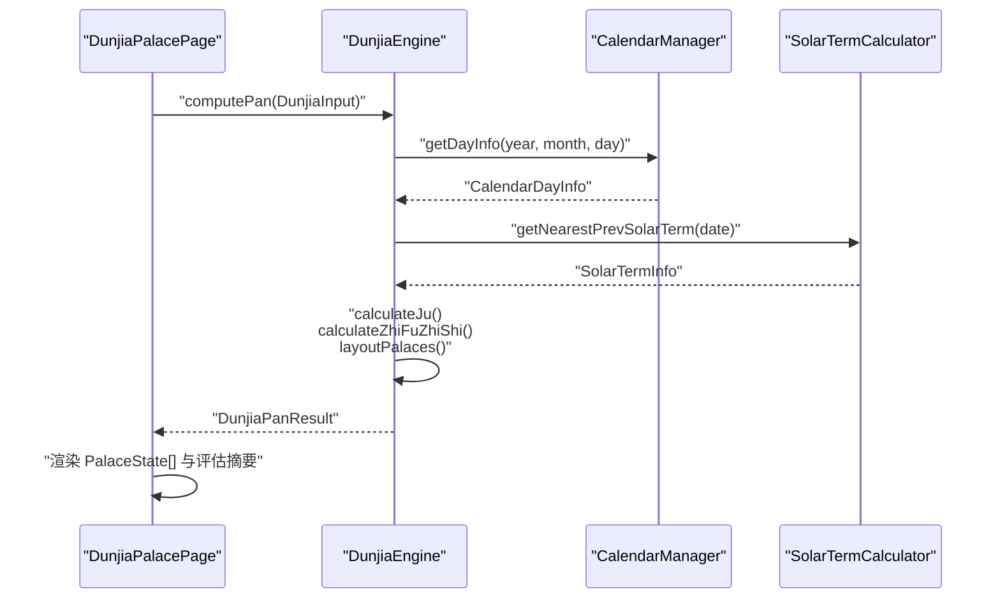
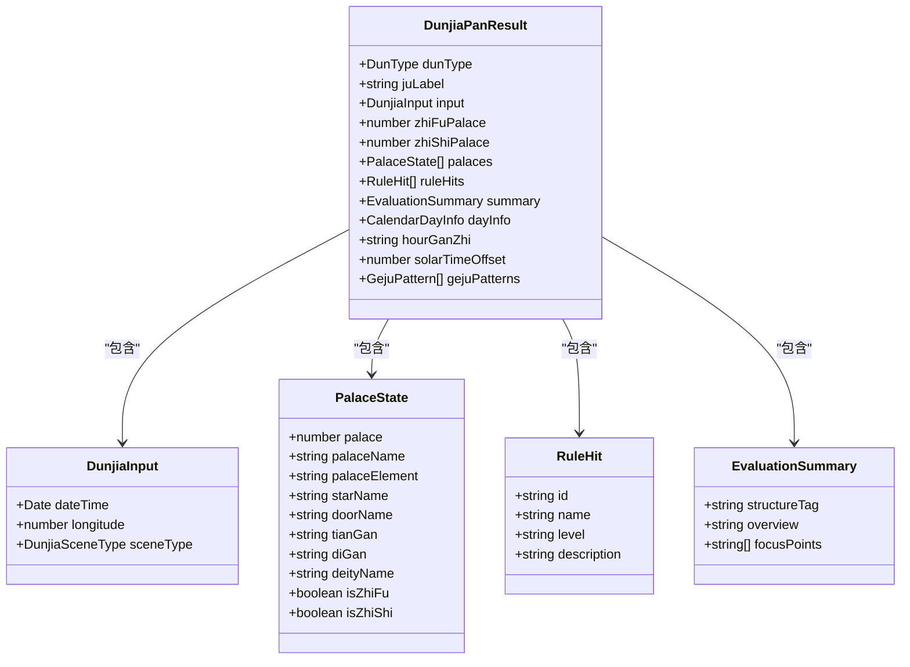
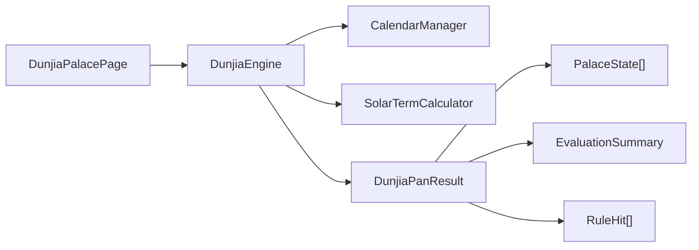

# 核心数据接口

<cite>
**本文档引用的文件**
- [DunjiaEngine.ets](file://entry/src/main/ets/utils/DunjiaEngine.ets)
- [CalendarManager.ets](file://entry/src/main/ets/utils/CalendarManager.ets)
- [SolarTermCalculator.ets](file://entry/src/main/ets/utils/SolarTermCalculator.ets)
- [DunjiaPalacePage.ets](file://entry/src/main/ets/pages/DunjiaPalacePage.ets)
</cite>

## 目录
1. [简介](#简介)
2. [项目结构](#项目结构)
3. [核心组件](#核心组件)
4. [架构总览](#架构总览)
5. [详细组件分析](#详细组件分析)
6. [依赖关系分析](#依赖关系分析)
7. [性能考量](#性能考量)
8. [故障排除指南](#故障排除指南)
9. [结论](#结论)

## 简介
本文件聚焦于遁甲应用的核心数据接口，系统性梳理以下关键数据结构：
- DunjiaInput 输入接口：承载时间、地理与研习场景等输入信息
- PalaceState 宫位状态接口：描述九宫内九星、八门、三奇六仪、八神等元素状态
- RuleHit 规则命中接口：记录结构化规则命中及其提示等级
- EvaluationSummary 评估摘要接口：提供针对当前场景的整体结构评估

文档将为每个接口属性提供类型定义、取值范围、业务含义与使用场景，并通过关系图与数据流说明展示它们之间的协作关系，最后提供代码示例路径与数据验证规则。

## 项目结构
核心数据接口位于引擎模块中，配合日历与节气计算工具，形成完整的遁甲排盘数据管线。

图表来源
- [DunjiaEngine.ets](file://entry/src/main/ets/utils/DunjiaEngine.ets#L1-L961)
- [CalendarManager.ets](file://entry/src/main/ets/utils/CalendarManager.ets#L1-L123)
- [SolarTermCalculator.ets](file://entry/src/main/ets/utils/SolarTermCalculator.ets#L1-L375)
- [DunjiaPalacePage.ets](file://entry/src/main/ets/pages/DunjiaPalacePage.ets#L1-L200)

章节来源
- [DunjiaEngine.ets](file://entry/src/main/ets/utils/DunjiaEngine.ets#L1-L961)
- [CalendarManager.ets](file://entry/src/main/ets/utils/CalendarManager.ets#L1-L123)
- [SolarTermCalculator.ets](file://entry/src/main/ets/utils/SolarTermCalculator.ets#L1-L375)
- [DunjiaPalacePage.ets](file://entry/src/main/ets/pages/DunjiaPalacePage.ets#L1-L200)

## 核心组件
本节对四个核心数据接口进行逐项解析，包括类型、取值范围、业务含义与典型使用场景。

- DunjiaInput 输入接口
  - 类型：接口
  - 字段
    - dateTime: Date
      - 类型：Date
      - 取值范围：任意有效日期时间
      - 业务含义：公历时间，建议使用真太阳时校正后的时刻
      - 使用场景：作为排盘计算的首要输入
    - longitude: number
      - 类型：number
      - 取值范围：通常为经度值（东经为正）
      - 业务含义：地理经度，用于真太阳时与节气研习
      - 使用场景：计算真太阳时偏移量
    - sceneType: DunjiaSceneType
      - 类型：枚举
      - 取值范围："general_study" | "strategy_study" | "time_window"
      - 业务含义：研习场景类型
      - 使用场景：影响评估摘要与规则识别的侧重点

- PalaceState 宫位状态接口
  - 类型：接口
  - 字段
    - palace: number
      - 类型：number
      - 取值范围：0-8（对应九宫索引）
      - 业务含义：宫位索引
      - 使用场景：九宫布局定位
    - palaceName: string
      - 类型：string
      - 取值范围：固定九宫名称集合
      - 业务含义：宫名，如"一宫坎"
      - 使用场景：UI渲染与文本描述
    - palaceElement: string
      - 类型：string
      - 取值范围：固定五行集合
      - 业务含义：宫位五行属性
      - 使用场景：结构分析与相生相克判断
    - starName?: string
      - 类型：string（可选）
      - 取值范围：九星名称集合
      - 业务含义：九星名称
      - 使用场景：格局识别与断语
    - doorName?: string
      - 类型：string（可选）
      - 取值范围：八门名称集合
      - 业务含义：八门名称
      - 使用场景：值使宫位与门的关联
    - tianGan?: string
      - 类型：string（可选）
      - 取值范围：天盘天干集合
      - 业务含义：天盘天干（暗干）
      - 使用场景：三奇六仪与格局识别
    - diGan?: string
      - 类型：string（可选）
      - 取值范围：地盘天干集合
      - 业务含义：地盘天干（明干）
      - 使用场景：三奇六仪与格局识别
    - deityName?: string
      - 类型：string（可选）
      - 取值范围：八神名称集合
      - 业务含义：八神名称
      - 使用场景：八神定位与断语
    - isZhiFu?: boolean
      - 类型：boolean（可选）
      - 取值范围：true/false
      - 业务含义：是否为值符宫
      - 使用场景：定位值符宫位
    - isZhiShi?: boolean
      - 类型：boolean（可选）
      - 取值范围：true/false
      - 业务含义：是否为值使宫
      - 使用场景：定位值使宫位

- RuleHit 规则命中接口
  - 类型：接口
  - 字段
    - id: string
      - 类型：string
      - 取值范围：规则唯一标识
      - 业务含义：规则唯一标识
      - 使用场景：规则匹配与去重
    - name: string
      - 类型：string
      - 取值范围：规则名称
      - 业务含义：规则名称
      - 使用场景：UI展示与说明
    - level: 'info' | 'hint' | 'focus'
      - 类型：联合类型
      - 取值范围：info/hint/focus
      - 业务含义：提示等级（用于UI呈现权重）
      - 使用场景：控制提示的视觉权重
    - description: string
      - 类型：string
      - 取值范围：结构化说明文案
      - 业务含义：面向研习者的结构化说明文案（不做个人预测）
      - 使用场景：研习参考与教学

- EvaluationSummary 评估摘要接口
  - 类型：接口
  - 字段
    - structureTag: string
      - 类型：string
      - 取值范围：结构特征标签
      - 业务含义：简短结构特征标签，如"偏向主动推进"、"结构偏稳健"
      - 使用场景：快速把握整体结构特征
    - overview: string
      - 类型：string
      - 取值范围：概览说明
      - 业务含义：概览说明，用于研习参考
      - 使用场景：整体结构概述
    - focusPoints: string[]
      - 类型：string[]
      - 取值范围：建议关注的宫位或要素
      - 业务含义：建议关注的宫位或要素，用于学习提示
      - 使用场景：学习提示与重点标注

章节来源
- [DunjiaEngine.ets](file://entry/src/main/ets/utils/DunjiaEngine.ets#L21-L84)

## 架构总览
核心数据接口在引擎中被统一消费，形成从输入到输出的数据流。

图表来源
- [DunjiaPalacePage.ets](file://entry/src/main/ets/pages/DunjiaPalacePage.ets#L96-L115)
- [DunjiaEngine.ets](file://entry/src/main/ets/utils/DunjiaEngine.ets#L113-L162)
- [CalendarManager.ets](file://entry/src/main/ets/utils/CalendarManager.ets#L51-L92)
- [SolarTermCalculator.ets](file://entry/src/main/ets/utils/SolarTermCalculator.ets#L143-L159)

章节来源
- [DunjiaPalacePage.ets](file://entry/src/main/ets/pages/DunjiaPalacePage.ets#L96-L115)
- [DunjiaEngine.ets](file://entry/src/main/ets/utils/DunjiaEngine.ets#L113-L162)
- [CalendarManager.ets](file://entry/src/main/ets/utils/CalendarManager.ets#L51-L92)
- [SolarTermCalculator.ets](file://entry/src/main/ets/utils/SolarTermCalculator.ets#L143-L159)

## 详细组件分析

### DunjiaInput 输入接口
- 类型定义与用途
  - 作为排盘计算的唯一输入，承载时间、地理与场景信息
- 取值范围与约束
  - dateTime：任意有效日期时间；建议使用真太阳时校正后的时刻
  - longitude：经度值（东经为正）；用于真太阳时偏移量计算
  - sceneType：限定枚举值；影响评估摘要与规则识别的侧重点
- 使用场景
  - 页面入口参数传递、默认输入构造、真太阳时校正
- 示例路径
  - [DunjiaEngine.createDefaultInput](file://entry/src/main/ets/utils/DunjiaEngine.ets#L645-L651)
  - [DunjiaPalacePage.aboutToAppear](file://entry/src/main/ets/pages/DunjiaPalacePage.ets#L98-L115)

章节来源
- [DunjiaEngine.ets](file://entry/src/main/ets/utils/DunjiaEngine.ets#L21-L28)
- [DunjiaEngine.ets](file://entry/src/main/ets/utils/DunjiaEngine.ets#L645-L651)
- [DunjiaPalacePage.ets](file://entry/src/main/ets/pages/DunjiaPalacePage.ets#L98-L115)

### PalaceState 宫位状态接口
- 类型定义与用途
  - 描述九宫内九星、八门、三奇六仪、八神等元素状态
- 取值范围与约束
  - palace：0-8（九宫索引）
  - palaceName：固定九宫名称集合
  - palaceElement：固定五行集合
  - starName/doorName/tianGan/diGan/deityName：可选字段，存在即为有效值
  - isZhiFu/isZhiShi：布尔标记，唯一值为true
- 使用场景
  - 布局九宫、值符值使定位、格局识别、UI渲染
- 示例路径
  - [DunjiaEngine.layoutPalaces](file://entry/src/main/ets/utils/DunjiaEngine.ets#L358-L389)
  - [DunjiaEngine.calculateZhiFuZhiShi](file://entry/src/main/ets/utils/DunjiaEngine.ets#L206-L246)
  - [DunjiaEngine.calculateZhiShiPalace](file://entry/src/main/ets/utils/DunjiaEngine.ets#L429-L462)

章节来源
- [DunjiaEngine.ets](file://entry/src/main/ets/utils/DunjiaEngine.ets#L30-L41)
- [DunjiaEngine.ets](file://entry/src/main/ets/utils/DunjiaEngine.ets#L358-L389)
- [DunjiaEngine.ets](file://entry/src/main/ets/utils/DunjiaEngine.ets#L206-L246)
- [DunjiaEngine.ets](file://entry/src/main/ets/utils/DunjiaEngine.ets#L429-L462)

### RuleHit 规则命中接口
- 类型定义与用途
  - 记录结构化规则命中及其提示等级
- 取值范围与约束
  - id：规则唯一标识
  - name：规则名称
  - level：info/hint/focus
  - description：结构化说明文案
- 使用场景
  - 规则识别、UI提示权重、研习参考
- 示例路径
  - [DunjiaEngine.computePan 概述生成](file://entry/src/main/ets/utils/DunjiaEngine.ets#L138-L143)
  - [DunjiaEngine.identifyGejuPatterns](file://entry/src/main/ets/utils/DunjiaEngine.ets#L678-L936)

章节来源
- [DunjiaEngine.ets](file://entry/src/main/ets/utils/DunjiaEngine.ets#L43-L48)
- [DunjiaEngine.ets](file://entry/src/main/ets/utils/DunjiaEngine.ets#L138-L143)
- [DunjiaEngine.ets](file://entry/src/main/ets/utils/DunjiaEngine.ets#L678-L936)

### EvaluationSummary 评估摘要接口
- 类型定义与用途
  - 提供针对当前场景的整体结构评估（研习向描述）
- 取值范围与约束
  - structureTag：简短结构特征标签
  - overview：概览说明
  - focusPoints：建议关注的宫位或要素
- 使用场景
  - 页面概览、学习提示、结构特征总结
- 示例路径
  - [DunjiaEngine.computePan 概述生成](file://entry/src/main/ets/utils/DunjiaEngine.ets#L138-L143)
  - [DunjiaEngine.generateStructureTag](file://entry/src/main/ets/utils/DunjiaEngine.ets#L606-L608)

章节来源
- [DunjiaEngine.ets](file://entry/src/main/ets/utils/DunjiaEngine.ets#L50-L57)
- [DunjiaEngine.ets](file://entry/src/main/ets/utils/DunjiaEngine.ets#L138-L143)
- [DunjiaEngine.ets](file://entry/src/main/ets/utils/DunjiaEngine.ets#L606-L608)

### 数据接口关系图

图表来源
- [DunjiaEngine.ets](file://entry/src/main/ets/utils/DunjiaEngine.ets#L21-L84)

章节来源
- [DunjiaEngine.ets](file://entry/src/main/ets/utils/DunjiaEngine.ets#L21-L84)

## 依赖关系分析
- DunjiaEngine 依赖 CalendarManager 获取当日干支信息，依赖 SolarTermCalculator 获取节气信息
- 页面层通过 DunjiaEngine 进行排盘计算，并渲染 PalaceState 与评估摘要
- 规则识别在引擎内部完成，产出 RuleHit 与 EvaluationSummary

图表来源
- [DunjiaEngine.ets](file://entry/src/main/ets/utils/DunjiaEngine.ets#L113-L162)
- [CalendarManager.ets](file://entry/src/main/ets/utils/CalendarManager.ets#L51-L92)
- [SolarTermCalculator.ets](file://entry/src/main/ets/utils/SolarTermCalculator.ets#L143-L159)
- [DunjiaPalacePage.ets](file://entry/src/main/ets/pages/DunjiaPalacePage.ets#L96-L115)

章节来源
- [DunjiaEngine.ets](file://entry/src/main/ets/utils/DunjiaEngine.ets#L113-L162)
- [CalendarManager.ets](file://entry/src/main/ets/utils/CalendarManager.ets#L51-L92)
- [SolarTermCalculator.ets](file://entry/src/main/ets/utils/SolarTermCalculator.ets#L143-L159)
- [DunjiaPalacePage.ets](file://entry/src/main/ets/pages/DunjiaPalacePage.ets#L96-L115)

## 性能考量
- 节气计算采用缓存策略，避免重复计算
- 万年历数据按年份缓存，减少IO开销
- 排盘计算为纯逻辑运算，复杂度与九宫数量线性相关
- 建议在页面层进行必要的防抖与节流，避免频繁触发排盘

## 故障排除指南
- 输入时间无效
  - 现象：排盘失败或返回空盘
  - 排查：检查 dateTime 是否为有效 Date 对象
  - 参考：[DunjiaEngine.createEmptyPan](file://entry/src/main/ets/utils/DunjiaEngine.ets#L613-L639)
- 无法获取干支信息
  - 现象：CalendarManager 返回 null
  - 排查：确认 CalendarManager 已初始化且资源可用
  - 参考：[CalendarManager.getDayInfo](file://entry/src/main/ets/utils/CalendarManager.ets#L51-L92)
- 节气计算异常
  - 现象：节气时间不准确或为空
  - 排查：检查 SolarTermCalculator 缓存与年份范围
  - 参考：[SolarTermCalculator.getNearestPrevSolarTerm](file://entry/src/main/ets/utils/SolarTermCalculator.ets#L143-L159)

章节来源
- [DunjiaEngine.ets](file://entry/src/main/ets/utils/DunjiaEngine.ets#L613-L639)
- [CalendarManager.ets](file://entry/src/main/ets/utils/CalendarManager.ets#L51-L92)
- [SolarTermCalculator.ets](file://entry/src/main/ets/utils/SolarTermCalculator.ets#L143-L159)

## 结论
本文档系统梳理了遁甲应用的核心数据接口，明确了各接口的类型、取值范围、业务含义与使用场景，并通过关系图与数据流展示了它们在引擎与页面层的协作方式。遵循本文档的接口定义与使用建议，可确保数据一致性与可维护性，为后续扩展与优化奠定坚实基础。