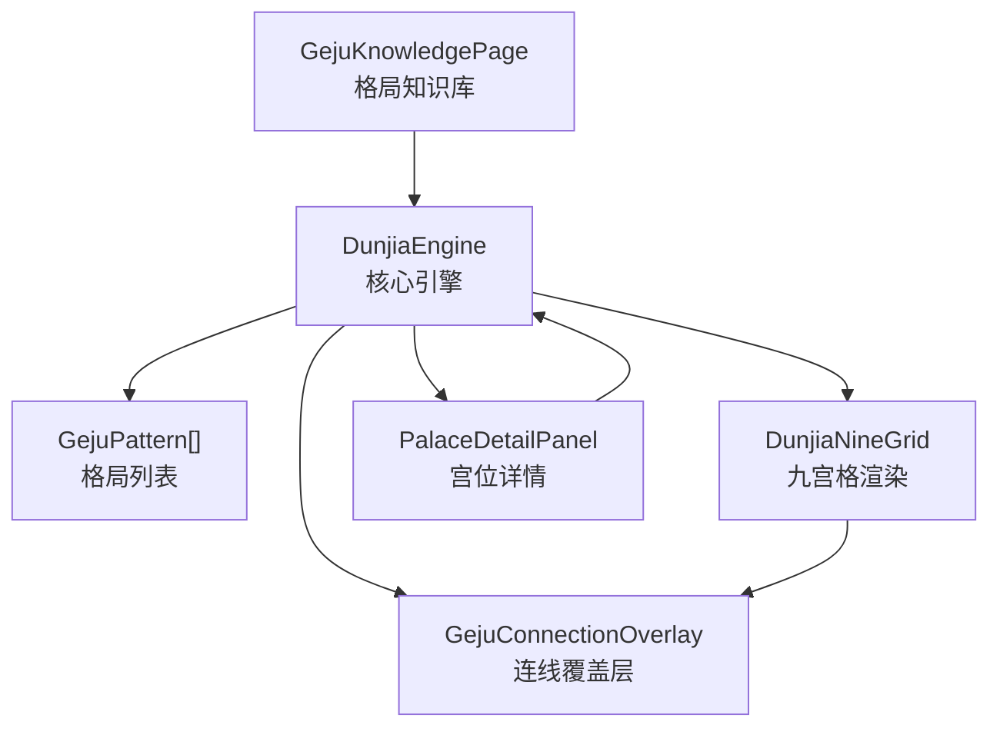
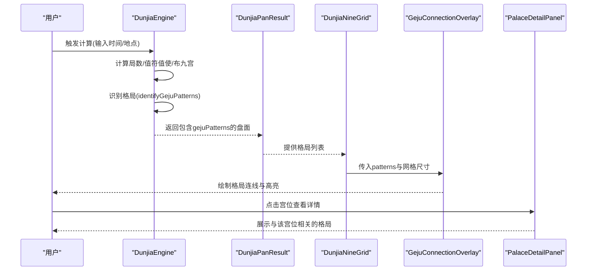
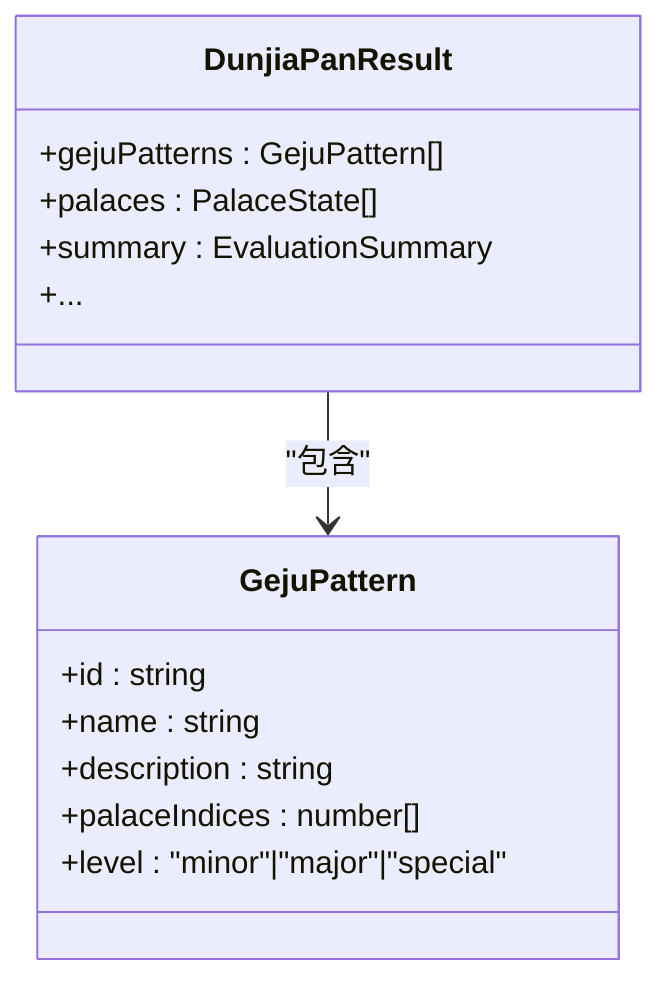
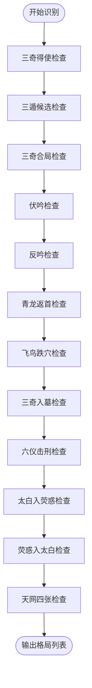
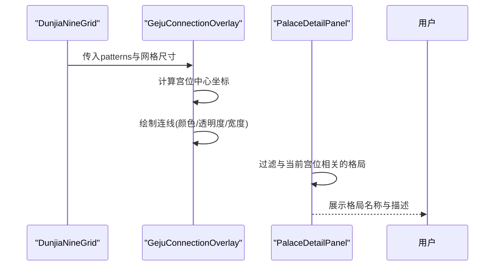
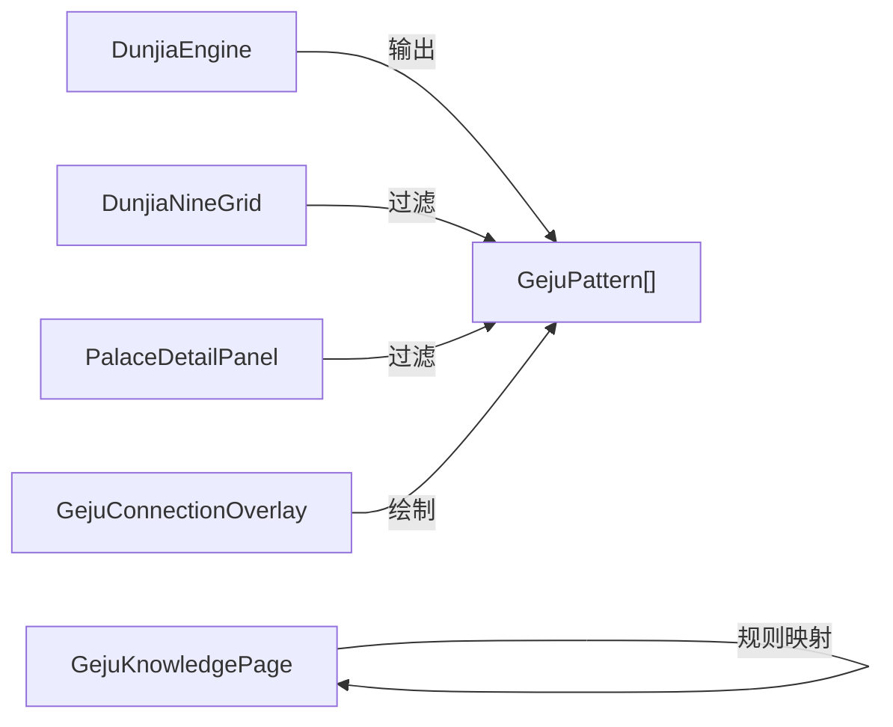

# 格局模式接口

<cite>
**本文档引用的文件**
- [DunjiaEngine.ets](file://entry/src/main/ets/utils/DunjiaEngine.ets)
- [GejuKnowledgePage.ets](file://entry/src/main/ets/pages/GejuKnowledgePage.ets)
- [GejuConnectionOverlay.ets](file://entry/src/main/ets/components/GejuConnectionOverlay.ets)
- [DunjiaNineGrid.ets](file://entry/src/main/ets/components/DunjiaNineGrid.ets)
- [PalaceDetailPanel.ets](file://entry/src/main/ets/components/PalaceDetailPanel.ets)
</cite>

## 目录
1. [简介](#简介)
2. [项目结构](#项目结构)
3. [核心组件](#核心组件)
4. [架构总览](#架构总览)
5. [详细组件分析](#详细组件分析)
6. [依赖关系分析](#依赖关系分析)
7. [性能考量](#性能考量)
8. [故障排除指南](#故障排除指南)
9. [结论](#结论)
10. [附录](#附录)

## 简介
本文件系统性阐述遁甲应用中的格局模式接口（GejuPattern）。该接口用于描述遁甲排盘中出现的各种格局形态，包括但不限于三奇得使、三遁（天遁/地遁/人遁）、三奇合局、伏吟、反吟、青龙返首、飞鸟跌穴、三奇入墓、六仪击刑、太白入荧惑、荧惑入太白、天网四张等。接口定义了格局的唯一标识、名称、描述、涉及宫位索引数组以及级别（minor次要、major主要、special特殊），并提供了识别逻辑、可视化展示与知识库集成能力。

## 项目结构
与格局模式接口直接相关的模块分布如下：
- 核心引擎：负责计算遁甲盘面并识别格局模式
- 可视化组件：在九宫格上渲染格局连线与高亮
- 页面组件：展示宫位详情与相关格局
- 知识库页面：加载并展示格局规则与效果

图表来源
- [DunjiaEngine.ets](file://entry/src/main/ets/utils/DunjiaEngine.ets#L89-L95)
- [DunjiaNineGrid.ets](file://entry/src/main/ets/components/DunjiaNineGrid.ets#L41-L46)
- [PalaceDetailPanel.ets](file://entry/src/main/ets/components/PalaceDetailPanel.ets#L48-L53)
- [GejuConnectionOverlay.ets](file://entry/src/main/ets/components/GejuConnectionOverlay.ets#L19-L23)
- [GejuKnowledgePage.ets](file://entry/src/main/ets/pages/GejuKnowledgePage.ets#L73-L76)

章节来源
- [DunjiaEngine.ets](file://entry/src/main/ets/utils/DunjiaEngine.ets#L89-L95)
- [DunjiaNineGrid.ets](file://entry/src/main/ets/components/DunjiaNineGrid.ets#L41-L46)
- [PalaceDetailPanel.ets](file://entry/src/main/ets/components/PalaceDetailPanel.ets#L48-L53)
- [GejuConnectionOverlay.ets](file://entry/src/main/ets/components/GejuConnectionOverlay.ets#L19-L23)
- [GejuKnowledgePage.ets](file://entry/src/main/ets/pages/GejuKnowledgePage.ets#L73-L76)

## 核心组件
- 接口定义：GejuPattern
  - id：字符串，格局唯一标识
  - name：字符串，格局名称（如“三奇得使”、“天遁”）
  - description：字符串，格局说明
  - palaceIndices：数字数组，涉及的宫位索引集合
  - level：枚举，'minor' | 'major' | 'special'，表示格局级别
- 识别函数：DunjiaEngine.identifyGejuPatterns
  - 输入：局信息、九宫状态、当日信息、时辰干支
  - 输出：GejuPattern[]，识别出的所有格局
- 可视化组件：GejuConnectionOverlay
  - 根据格局的palaceIndices在九宫格上绘制连线
  - 支持高亮选中格局并在连线上标注名称
- 页面组件：DunjiaNineGrid、PalaceDetailPanel
  - DunjiaNineGrid：按宫位索引过滤并展示格局名称
  - PalaceDetailPanel：展示与选中宫位相关的格局详情
- 知识库页面：GejuKnowledgePage
  - 加载规则JSON，映射为内部知识条目，支持分类展示与详情弹窗

章节来源
- [DunjiaEngine.ets](file://entry/src/main/ets/utils/DunjiaEngine.ets#L89-L95)
- [DunjiaEngine.ets](file://entry/src/main/ets/utils/DunjiaEngine.ets#L678-L936)
- [GejuConnectionOverlay.ets](file://entry/src/main/ets/components/GejuConnectionOverlay.ets#L19-L23)
- [DunjiaNineGrid.ets](file://entry/src/main/ets/components/DunjiaNineGrid.ets#L41-L46)
- [PalaceDetailPanel.ets](file://entry/src/main/ets/components/PalaceDetailPanel.ets#L48-L53)
- [GejuKnowledgePage.ets](file://entry/src/main/ets/pages/GejuKnowledgePage.ets#L73-L76)

## 架构总览
下图展示了从核心引擎到界面组件的完整流程，包括格局识别、数据传递与可视化渲染：

图表来源
- [DunjiaEngine.ets](file://entry/src/main/ets/utils/DunjiaEngine.ets#L113-L162)
- [DunjiaEngine.ets](file://entry/src/main/ets/utils/DunjiaEngine.ets#L678-L936)
- [DunjiaNineGrid.ets](file://entry/src/main/ets/components/DunjiaNineGrid.ets#L41-L46)
- [GejuConnectionOverlay.ets](file://entry/src/main/ets/components/GejuConnectionOverlay.ets#L67-L79)
- [PalaceDetailPanel.ets](file://entry/src/main/ets/components/PalaceDetailPanel.ets#L48-L53)

## 详细组件分析

### 接口定义与数据模型
- GejuPattern接口字段
  - id：用于唯一标识某个格局实例，便于状态管理与持久化
  - name：格局名称，用于UI展示与筛选
  - description：格局解释与影响说明
  - palaceIndices：涉及宫位索引数组，用于连线绘制与宫位关联查询
  - level：格局级别，决定视觉样式与重要性提示
- DunjiaPanResult中包含gejuPatterns字段，作为识别结果的载体

图表来源
- [DunjiaEngine.ets](file://entry/src/main/ets/utils/DunjiaEngine.ets#L82-L95)

章节来源
- [DunjiaEngine.ets](file://entry/src/main/ets/utils/DunjiaEngine.ets#L82-L95)

### 格局识别逻辑与判断标准
- 三奇得使（major）
  - 判断：三奇（乙/丙/丁）中任意一奇落在值使宫
  - 效果：主贵人扶助，事半功倍
- 三遁（major）
  - 天遁：生门 + 丙奇
  - 地遁：开门 + 乙奇
  - 人遁：休门 + 丁奇
- 三奇合局（major）
  - 判断：乙/丙/丁三奇同聚某一宫（天盘+地盘合计）
- 伏吟（minor）
  - 判断：某宫天干=地干
  - 效果：静守为宜，不宜轻举妄动
- 反吟（minor）
  - 判断：两宫天干互为对冲（如甲子与甲午等）
- 青龙返首（special）
  - 判断：天盘为甲/戊/己，地盘为丙
- 飞鸟跌穴（special）
  - 判断：天盘为丙，地盘为甲/戊/己
- 三奇入墓（major）
  - 判断：乙奇入坤宫（木墓），或丙/丁奇入戌宫（火墓）
- 六仪击刑（major）
  - 判断：特定日干（如甲日）与时支落在相应“相刑”地支时
- 太白入荧惑（major）
  - 判断：天盘庚加地盘丙
- 荧惑入太白（minor）
  - 判断：天盘丙加地盘庚
- 天网四张（major）
  - 判断：简化为时干为癸

图表来源
- [DunjiaEngine.ets](file://entry/src/main/ets/utils/DunjiaEngine.ets#L678-L936)

章节来源
- [DunjiaEngine.ets](file://entry/src/main/ets/utils/DunjiaEngine.ets#L678-L936)

### 可视化与交互
- 连线覆盖层（GejuConnectionOverlay）
  - 根据palaceIndices在九宫格上绘制连线
  - 高亮选中格局并在连线上标注名称
  - 不同格局使用不同颜色区分（如天遁/三奇得使用橙色，地遁/人遁用金色等）
- 九宫格渲染（DunjiaNineGrid）
  - 按宫位索引过滤并展示格局名称
- 宫位详情（PalaceDetailPanel）
  - 展示与选中宫位相关的所有格局详情

图表来源
- [GejuConnectionOverlay.ets](file://entry/src/main/ets/components/GejuConnectionOverlay.ets#L28-L44)
- [GejuConnectionOverlay.ets](file://entry/src/main/ets/components/GejuConnectionOverlay.ets#L90-L131)
- [DunjiaNineGrid.ets](file://entry/src/main/ets/components/DunjiaNineGrid.ets#L41-L46)
- [PalaceDetailPanel.ets](file://entry/src/main/ets/components/PalaceDetailPanel.ets#L48-L53)

章节来源
- [GejuConnectionOverlay.ets](file://entry/src/main/ets/components/GejuConnectionOverlay.ets#L28-L44)
- [GejuConnectionOverlay.ets](file://entry/src/main/ets/components/GejuConnectionOverlay.ets#L90-L131)
- [DunjiaNineGrid.ets](file://entry/src/main/ets/components/DunjiaNineGrid.ets#L41-L46)
- [PalaceDetailPanel.ets](file://entry/src/main/ets/components/PalaceDetailPanel.ets#L48-L53)

### 知识库与规则映射
- GejuKnowledgePage负责加载规则JSON，映射为内部知识条目
- 支持分类：大吉格局、强凶格局、对敌战术、其他格局
- 提供条件、效应与来源说明，便于学习与查阅

章节来源
- [GejuKnowledgePage.ets](file://entry/src/main/ets/pages/GejuKnowledgePage.ets#L73-L76)
- [GejuKnowledgePage.ets](file://entry/src/main/ets/pages/GejuKnowledgePage.ets#L299-L369)
- [GejuKnowledgePage.ets](file://entry/src/main/ets/pages/GejuKnowledgePage.ets#L371-L471)

## 依赖关系分析
- DunjiaEngine是核心，依赖于时间/地点信息与九宫状态，输出GejuPattern[]
- DunjiaNineGrid与PalaceDetailPanel依赖DunjiaEngine提供的gejuPatterns进行过滤与展示
- GejuConnectionOverlay依赖GejuPattern的palaceIndices进行连线绘制
- GejuKnowledgePage独立加载规则JSON，与识别逻辑解耦，便于维护与扩展

图表来源
- [DunjiaEngine.ets](file://entry/src/main/ets/utils/DunjiaEngine.ets#L113-L162)
- [DunjiaNineGrid.ets](file://entry/src/main/ets/components/DunjiaNineGrid.ets#L41-L46)
- [PalaceDetailPanel.ets](file://entry/src/main/ets/components/PalaceDetailPanel.ets#L48-L53)
- [GejuConnectionOverlay.ets](file://entry/src/main/ets/components/GejuConnectionOverlay.ets#L90-L131)
- [GejuKnowledgePage.ets](file://entry/src/main/ets/pages/GejuKnowledgePage.ets#L299-L369)

章节来源
- [DunjiaEngine.ets](file://entry/src/main/ets/utils/DunjiaEngine.ets#L113-L162)
- [DunjiaNineGrid.ets](file://entry/src/main/ets/components/DunjiaNineGrid.ets#L41-L46)
- [PalaceDetailPanel.ets](file://entry/src/main/ets/components/PalaceDetailPanel.ets#L48-L53)
- [GejuConnectionOverlay.ets](file://entry/src/main/ets/components/GejuConnectionOverlay.ets#L90-L131)
- [GejuKnowledgePage.ets](file://entry/src/main/ets/pages/GejuKnowledgePage.ets#L299-L369)

## 性能考量
- 格局识别采用线性扫描（宫位遍历与配对检查），复杂度约为O(n^2)，其中n=9，开销可忽略
- palaceIndices数组长度通常较小，过滤与连线绘制成本低
- 建议：若未来扩展更多规则，可考虑缓存中间结果与预计算索引，避免重复计算

## 故障排除指南
- 识别结果为空
  - 检查输入时间/地点是否正确，确认已成功获取当日干支与局数
  - 确认九宫状态已正确布盘
- 连线不显示
  - 检查palaceIndices长度是否至少为2
  - 确认网格尺寸传入正确
- 格局名称未高亮
  - 检查selectedPattern与pattern.name是否匹配
- 知识库加载失败
  - 检查规则JSON路径与内容格式
  - 查看控制台错误日志

章节来源
- [GejuConnectionOverlay.ets](file://entry/src/main/ets/components/GejuConnectionOverlay.ets#L90-L92)
- [GejuKnowledgePage.ets](file://entry/src/main/ets/pages/GejuKnowledgePage.ets#L306-L369)

## 结论
GejuPattern接口清晰定义了遁甲格局的数据结构与识别边界，配合DunjiaEngine的识别逻辑与多组件的可视化呈现，形成了从计算到展示的完整闭环。通过知识库页面的规则映射，用户可以系统学习各类格局的条件、效应与来源，提升对遁甲排盘的理解与应用能力。

## 附录

### 格局级别说明
- minor（次要）：对整体盘面有一定影响，但非决定性因素
- major（主要）：对盘面有显著影响，需重点考虑
- special（特殊）：具有独特象征意义，常用于关键决策参考

### 实际应用场景与学习指导
- 决策辅助：在重大事件（如出兵、迁徙、交易）前，结合major/special格局进行取舍
- 行事策略：依据minor格局调整节奏，避免在不利时机强行推进
- 学习路径：先掌握三奇得使、三遁、三奇合局等基础格局，再逐步学习青龙返首、飞鸟跌穴等特殊格局与对敌战术规则