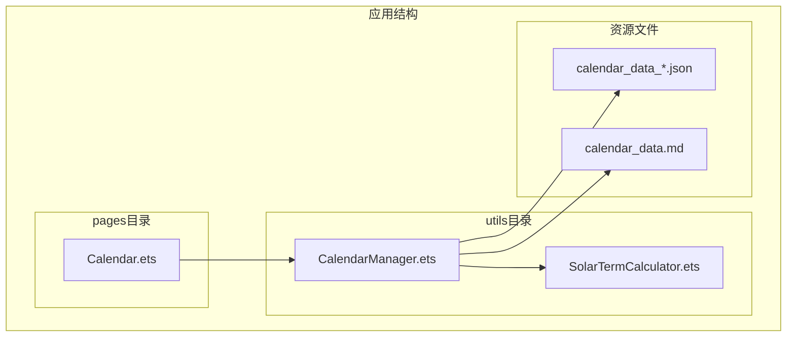
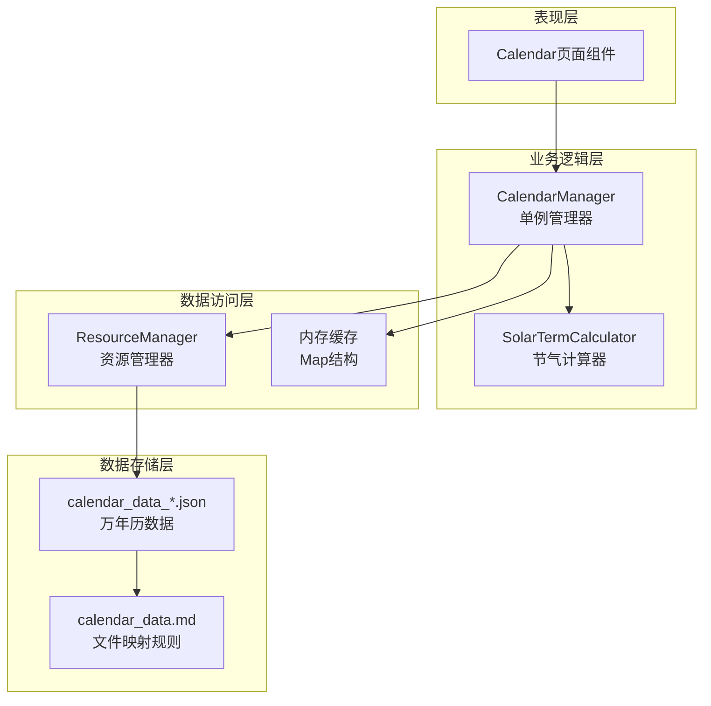
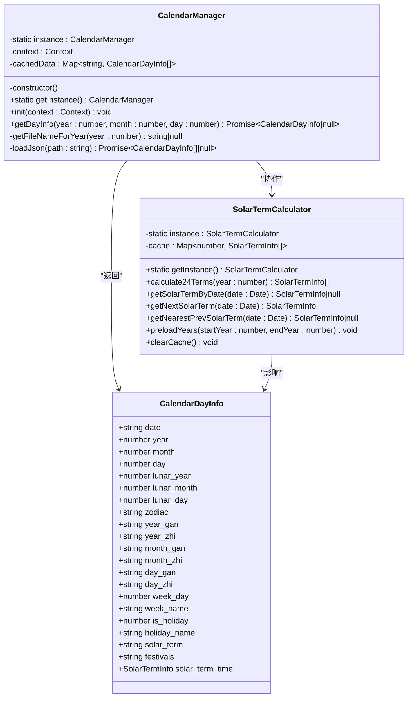
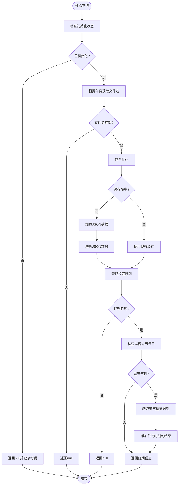
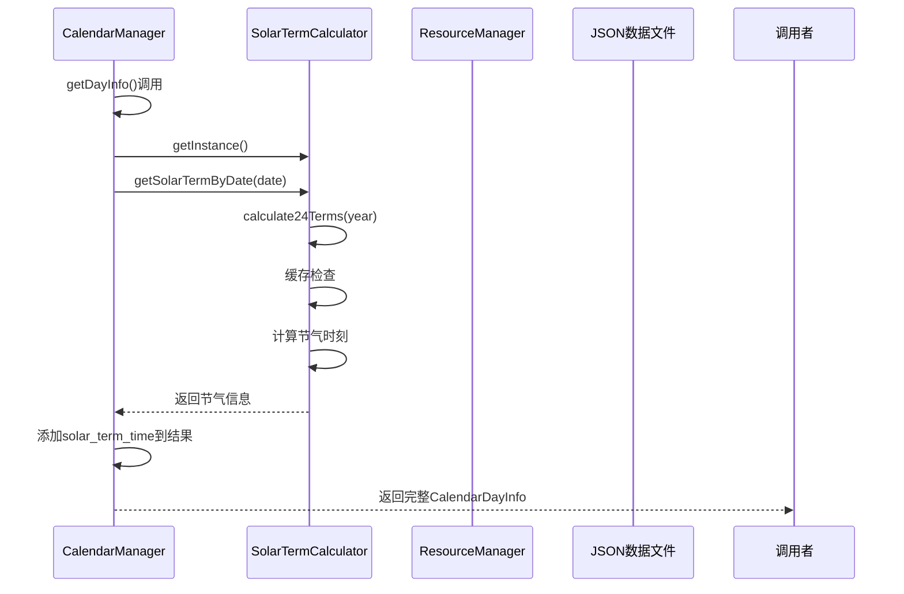
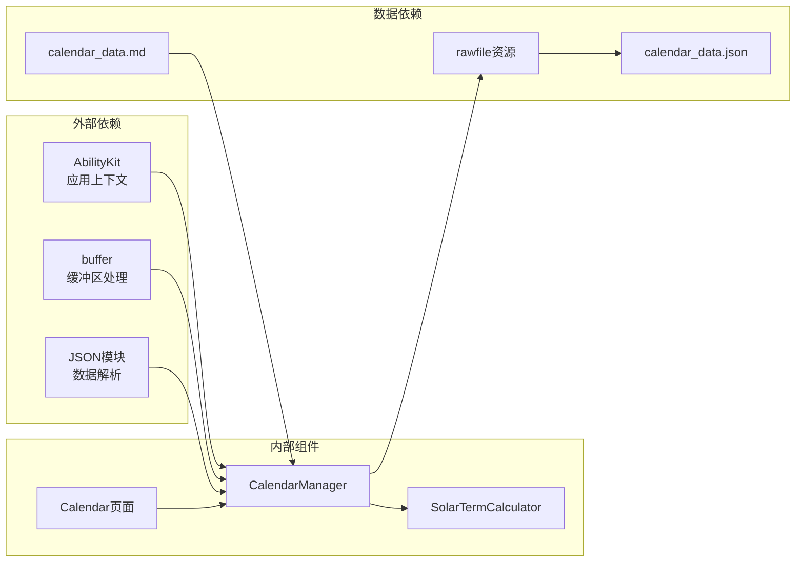

# CalendarManager日历管理器

<cite>
**本文档引用的文件**
- [CalendarManager.ets](file://entry/src/main/ets/utils/CalendarManager.ets)
- [SolarTermCalculator.ets](file://entry/src/main/ets/utils/SolarTermCalculator.ets)
- [Calendar.ets](file://entry/src/main/ets/pages/Calendar.ets)
- [calendar_data_0001.json](file://entry/src/main/resources/rawfile/calendar/calendar_data_0001.json)
- [calendar_data.md](file://entry/src/main/resources/rawfile/calendar/calendar_data.md)
</cite>

## 目录
1. [简介](#简介)
2. [项目结构](#项目结构)
3. [核心组件](#核心组件)
4. [架构概览](#架构概览)
5. [详细组件分析](#详细组件分析)
6. [依赖关系分析](#依赖关系分析)
7. [性能考虑](#性能考虑)
8. [故障排除指南](#故障排除指南)
9. [结论](#结论)
10. [附录](#附录)

## 简介
CalendarManager是一个专门的日历管理器，负责提供万年历信息查询服务。它采用单例模式设计，支持公历、农历、节气、节日等多维度的日期信息查询，并与SolarTermCalculator紧密协作以提供精确的节气时刻信息。

该组件主要服务于遁甲符应经应用，为用户提供完整的传统历法信息，包括天干地支、生肖、节气精确时刻等传统文化要素。

## 项目结构
CalendarManager位于应用的utils目录下，作为独立的工具类模块存在：



**图表来源**
- [CalendarManager.ets](file://entry/src/main/ets/utils/CalendarManager.ets#L1-L123)
- [SolarTermCalculator.ets](file://entry/src/main/ets/utils/SolarTermCalculator.ets#L1-L375)
- [Calendar.ets](file://entry/src/main/ets/pages/Calendar.ets#L1-L602)

**章节来源**
- [CalendarManager.ets](file://entry/src/main/ets/utils/CalendarManager.ets#L1-L123)
- [Calendar.ets](file://entry/src/main/ets/pages/Calendar.ets#L1-L602)

## 核心组件
CalendarManager提供以下核心功能：

### 单例模式实现
- 使用静态私有实例变量确保全局唯一性
- 提供getInstance()静态方法获取实例
- 构造函数私有化防止外部直接实例化

### 初始化机制
- init()方法接收应用上下文
- 必须在使用前完成初始化
- 未初始化调用会返回空值并记录错误

### 数据查询接口
- getDayInfo()方法支持指定年月日查询
- 自动处理JSON数据缓存
- 支持节气精确时刻查询

**章节来源**
- [CalendarManager.ets](file://entry/src/main/ets/utils/CalendarManager.ets#L30-L46)

## 架构概览
CalendarManager采用分层架构设计，实现了数据访问层、业务逻辑层和表现层的有效分离：



**图表来源**
- [CalendarManager.ets](file://entry/src/main/ets/utils/CalendarManager.ets#L30-L123)
- [SolarTermCalculator.ets](file://entry/src/main/ets/utils/SolarTermCalculator.ets#L30-L375)
- [Calendar.ets](file://entry/src/main/ets/pages/Calendar.ets#L1-L602)

## 详细组件分析

### CalendarManager类分析

#### 类结构图


**图表来源**
- [CalendarManager.ets](file://entry/src/main/ets/utils/CalendarManager.ets#L5-L28)
- [CalendarManager.ets](file://entry/src/main/ets/utils/CalendarManager.ets#L30-L123)
- [SolarTermCalculator.ets](file://entry/src/main/ets/utils/SolarTermCalculator.ets#L30-L375)

#### getDayInfo()方法流程图


**图表来源**
- [CalendarManager.ets](file://entry/src/main/ets/utils/CalendarManager.ets#L51-L92)

#### CalendarDayInfo接口详解

CalendarDayInfo接口定义了完整的日历信息结构：

| 字段名 | 类型 | 描述 | 示例 |
|--------|------|------|------|
| date | string | 日期字符串 | "2024-01-01" |
| year | number | 公历年份 | 2024 |
| month | number | 公历月份 | 1 |
| day | number | 公历日期 | 1 |
| lunar_year | number | 农历年份 | 2023 |
| lunar_month | number | 农历月份 | 12 |
| lunar_day | number | 农历日期 | 29 |
| zodiac | string | 生肖 | "龙" |
| year_gan | string | 年天干 | "甲" |
| year_zhi | string | 年地支 | "子" |
| month_gan | string | 月天干 | "乙" |
| month_zhi | string | 月地支 | "丑" |
| day_gan | string | 日天干 | "丙" |
| day_zhi | string | 日地支 | "寅" |
| week_day | number | 星期几 | 0 |
| week_name | string | 星期名称 | "星期一" |
| is_holiday | number | 是否节假日 | 0 |
| holiday_name | string | 节假日名称 | "" |
| solar_term | string | 节气名称 | "小寒" |
| festivals | string | 节庆信息 | "元旦" |

**章节来源**
- [CalendarManager.ets](file://entry/src/main/ets/utils/CalendarManager.ets#L5-L28)
- [calendar_data_0001.json](file://entry/src/main/resources/rawfile/calendar/calendar_data_0001.json#L1-L200)

### SolarTermCalculator协作分析

#### 节气计算流程


**图表来源**
- [CalendarManager.ets](file://entry/src/main/ets/utils/CalendarManager.ets#L83-L89)
- [SolarTermCalculator.ets](file://entry/src/main/ets/utils/SolarTermCalculator.ets#L93-L115)

**章节来源**
- [SolarTermCalculator.ets](file://entry/src/main/ets/utils/SolarTermCalculator.ets#L30-L375)

## 依赖关系分析

### 组件间依赖图


**图表来源**
- [CalendarManager.ets](file://entry/src/main/ets/utils/CalendarManager.ets#L1-L3)
- [Calendar.ets](file://entry/src/main/ets/pages/Calendar.ets#L1-L10)

### 数据流分析
CalendarManager的数据流遵循以下路径：
1. 页面组件调用CalendarManager
2. CalendarManager检查初始化状态
3. 根据年份确定JSON文件名
4. 从ResourceManager读取原始数据
5. 解析JSON数据到CalendarDayInfo数组
6. 在缓存中查找指定日期
7. 如为节气日，调用SolarTermCalculator获取精确时刻
8. 返回完整的日期信息给调用者

**章节来源**
- [CalendarManager.ets](file://entry/src/main/ets/utils/CalendarManager.ets#L111-L121)
- [Calendar.ets](file://entry/src/main/ets/pages/Calendar.ets#L155-L182)

## 性能考虑

### 缓存策略
- **内存缓存**：使用Map结构缓存已加载的年份数据
- **文件名映射**：根据年份范围自动计算对应JSON文件
- **懒加载**：仅在首次访问时加载相应年份的数据

### 性能优化建议
1. **预加载机制**：在应用启动时预加载常用年份数据
2. **批量查询**：利用Calendar页面的批量查询优化
3. **缓存清理**：定期清理过期或不常用的年份缓存
4. **异步处理**：合理使用async/await避免阻塞UI线程

### 内存使用优化
- 控制缓存大小，避免同时加载过多年份
- 使用WeakMap等弱引用结构减少内存泄漏风险
- 及时释放不再使用的数据引用

## 故障排除指南

### 常见问题及解决方案

#### 初始化错误
**问题**：调用getDayInfo()返回null且控制台输出错误信息
**原因**：未调用init()方法初始化
**解决**：确保在应用启动时调用init()方法

#### 文件加载失败
**问题**：控制台显示"Failed to load calendar data"错误
**原因**：JSON文件不存在或路径错误
**解决**：
1. 检查calendar_data.md中的文件映射规则
2. 确认对应年份的JSON文件存在于rawfile目录
3. 验证文件名格式是否正确

#### 日期查询为空
**问题**：查询指定日期返回null
**原因**：
1. 日期超出支持范围（1900-2060年）
2. 日期格式不正确
3. 对应年份数据文件缺失

**解决**：
1. 检查年份是否在支持范围内
2. 确保日期格式为YYYY-MM-DD
3. 验证对应年份的JSON文件完整性

#### 节气信息缺失
**问题**：节气日没有精确时刻信息
**原因**：SolarTermCalculator缓存未命中
**解决**：调用SolarTermCalculator.preloadYears()预加载相关年份

**章节来源**
- [CalendarManager.ets](file://entry/src/main/ets/utils/CalendarManager.ets#L52-L55)
- [CalendarManager.ets](file://entry/src/main/ets/utils/CalendarManager.ets#L117-L120)

## 结论
CalendarManager作为遁甲符应经应用的核心日历组件，成功实现了传统历法信息的现代化呈现。其单例模式设计确保了资源的有效管理，智能缓存机制提供了良好的性能表现，与SolarTermCalculator的协作保证了节气信息的准确性。

该组件的设计充分考虑了移动应用的性能要求，在保证功能完整性的同时，通过合理的缓存策略和异步处理机制，为用户提供了流畅的使用体验。

## 附录

### 使用示例

#### 基本使用流程
```typescript
// 1. 获取CalendarManager实例
const calendarManager = CalendarManager.getInstance();

// 2. 初始化（在应用启动时）
calendarManager.init(getContext(this));

// 3. 查询指定日期信息
const dateInfo = await calendarManager.getDayInfo(2024, 1, 1);
if (dateInfo) {
    console.log(`公历: ${dateInfo.year}-${dateInfo.month}-${dateInfo.day}`);
    console.log(`农历: ${dateInfo.lunar_year}-${dateInfo.lunar_month}-${dateInfo.lunar_day}`);
    console.log(`天干地支: ${dateInfo.day_gan}${dateInfo.day_zhi}`);
    console.log(`节气: ${dateInfo.solar_term}`);
    if (dateInfo.solar_term_time) {
        console.log(`节气时刻: ${dateInfo.solar_term_time.time}`);
    }
}
```

#### 批量查询优化
```typescript
// Calendar页面中的批量查询示例
const datesToQuery = [/* 多个日期 */];
const dateInfos = await Promise.all(
    datesToQuery.map(date => this.getDateInfo(date))
);
```

### API参考

#### CalendarManager类方法
- `getInstance()` - 获取单例实例
- `init(context)` - 初始化组件
- `getDayInfo(year, month, day)` - 查询指定日期信息

#### CalendarDayInfo接口字段
- 基础信息：date, year, month, day
- 农历信息：lunar_year, lunar_month, lunar_day
- 天干地支：year_gan/year_zhi, month_gan/month_zhi, day_gan/day_zhi
- 其他：zodiac, week_day, week_name, is_holiday, holiday_name, solar_term, festivals

**章节来源**
- [Calendar.ets](file://entry/src/main/ets/pages/Calendar.ets#L155-L182)
- [CalendarManager.ets](file://entry/src/main/ets/utils/CalendarManager.ets#L51-L92)