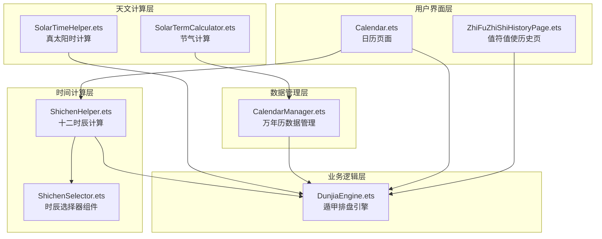
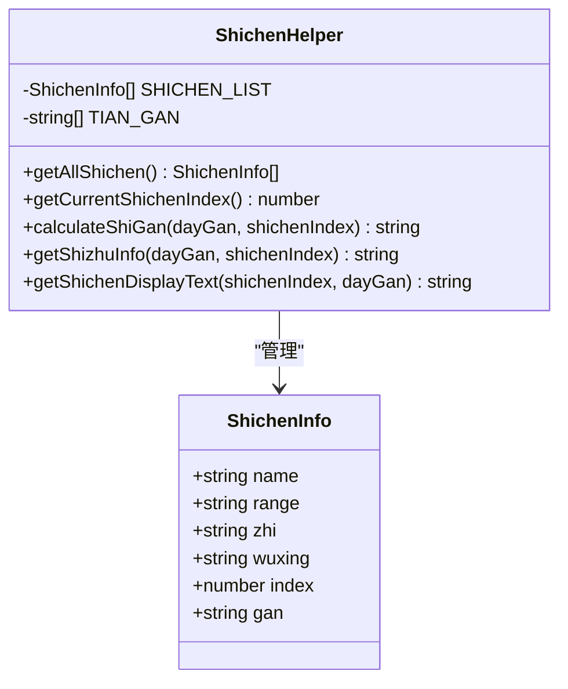
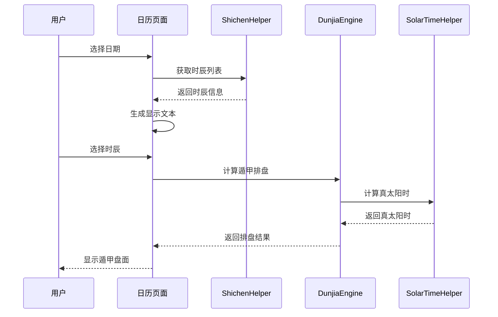
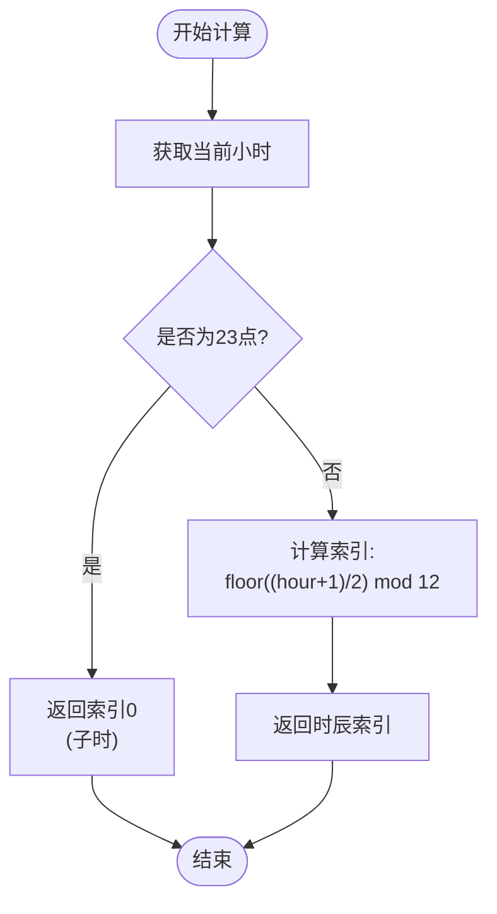
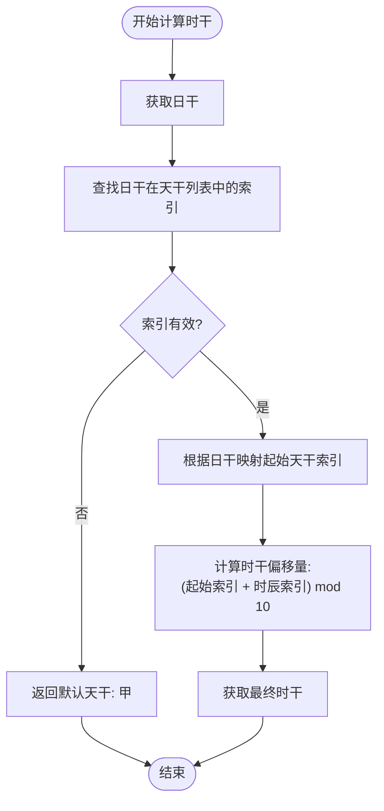
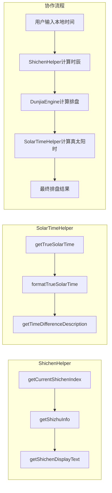
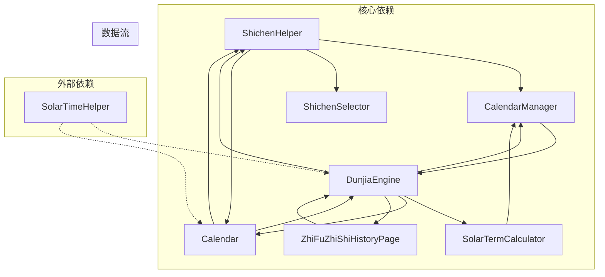
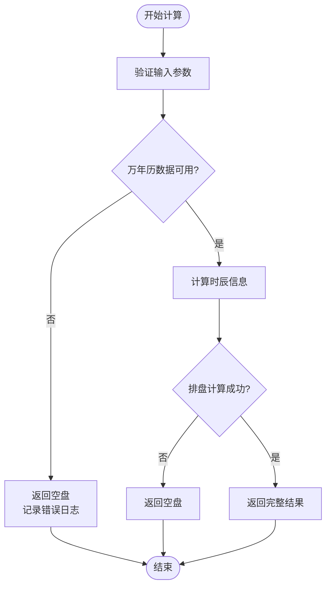

# ShichenHelper时辰助手

<cite>
**本文档引用的文件**
- [ShichenHelper.ets](file://entry/src/main/ets/utils/ShichenHelper.ets)
- [SolarTimeHelper.ets](file://entry/src/main/ets/utils/SolarTimeHelper.ets)
- [ShichenSelector.ets](file://entry/src/main/ets/components/ShichenSelector.ets)
- [DunjiaEngine.ets](file://entry/src/main/ets/utils/DunjiaEngine.ets)
- [CalendarManager.ets](file://entry/src/main/ets/utils/CalendarManager.ets)
- [SolarTermCalculator.ets](file://entry/src/main/ets/utils/SolarTermCalculator.ets)
- [Calendar.ets](file://entry/src/main/ets/pages/Calendar.ets)
- [ZhiFuZhiShiHistoryPage.ets](file://entry/src/main/ets/pages/ZhiFuZhiShiHistoryPage.ets)
- [万年历json数据文件解读.md](file://entry/src/main/ets/resources/rawfile/万年历json数据文件解读.md)
</cite>

## 目录
1. [简介](#简介)
2. [项目结构](#项目结构)
3. [核心组件](#核心组件)
4. [架构概览](#架构概览)
5. [详细组件分析](#详细组件分析)
6. [依赖关系分析](#依赖关系分析)
7. [性能考虑](#性能考虑)
8. [故障排除指南](#故障排除指南)
9. [结论](#结论)
10. [附录](#附录)

## 简介

ShichenHelper时辰助手是遁甲排盘系统中的核心时间计算组件，专门负责十二时辰的计算、转换和显示。该组件实现了传统的五鼠遁法，能够根据日干推算时干，提供精确的时辰干支信息，并与SolarTimeHelper真太阳时计算工具协同工作，为遁甲排盘提供准确的时间基准。

## 项目结构

遁甲排盘系统采用模块化架构，ShichenHelper作为时间计算的核心模块，与其他组件协同工作：



**图表来源**
- [ShichenHelper.ets](file://entry/src/main/ets/utils/ShichenHelper.ets#L1-L114)
- [SolarTimeHelper.ets](file://entry/src/main/ets/utils/SolarTimeHelper.ets#L1-L270)
- [ShichenSelector.ets](file://entry/src/main/ets/components/ShichenSelector.ets#L1-L133)
- [DunjiaEngine.ets](file://entry/src/main/ets/utils/DunjiaEngine.ets#L1-L961)
- [CalendarManager.ets](file://entry/src/main/ets/utils/CalendarManager.ets#L1-L123)
- [SolarTermCalculator.ets](file://entry/src/main/ets/utils/SolarTermCalculator.ets#L1-L375)

**章节来源**
- [ShichenHelper.ets](file://entry/src/main/ets/utils/ShichenHelper.ets#L1-L114)
- [SolarTimeHelper.ets](file://entry/src/main/ets/utils/SolarTimeHelper.ets#L1-L270)

## 核心组件

### ShichenHelper 十二时辰计算

ShichenHelper是时辰计算的核心工具类，提供了完整的十二时辰信息管理和计算功能：

#### 主要特性
- **十二时辰基础信息**：包含名称、时间范围、地支、五行属性
- **时干计算**：基于五鼠遁法的日干推算
- **自动时辰识别**：根据当前时间自动计算时辰索引
- **显示格式化**：提供多种显示格式的文本生成

#### 关键数据结构



**图表来源**
- [ShichenHelper.ets](file://entry/src/main/ets/utils/ShichenHelper.ets#L5-L12)
- [ShichenHelper.ets](file://entry/src/main/ets/utils/ShichenHelper.ets#L14-L113)

**章节来源**
- [ShichenHelper.ets](file://entry/src/main/ets/utils/ShichenHelper.ets#L14-L113)

### ShichenSelector 时辰选择器

ShichenSelector是一个用户界面组件，提供直观的时辰选择体验：

#### 功能特性
- **网格布局**：4行×3列的时辰网格显示
- **高亮显示**：当前选中时辰的视觉突出
- **交互反馈**：点击展开/收起动画效果
- **响应式设计**：适配不同屏幕尺寸

**章节来源**
- [ShichenSelector.ets](file://entry/src/main/ets/components/ShichenSelector.ets#L1-L133)

## 架构概览

遁甲排盘系统的时间计算流程遵循严格的时序关系：



**图表来源**
- [Calendar.ets](file://entry/src/main/ets/pages/Calendar.ets#L264-L310)
- [ShichenHelper.ets](file://entry/src/main/ets/utils/ShichenHelper.ets#L37-L113)
- [DunjiaEngine.ets](file://entry/src/main/ets/utils/DunjiaEngine.ets#L113-L162)
- [SolarTimeHelper.ets](file://entry/src/main/ets/utils/SolarTimeHelper.ets#L54-L77)

## 详细组件分析

### 十二时辰划分规则

遁甲系统采用传统的十二时辰划分，每个时辰包含2小时的时间段：

| 时辰 | 时间范围 | 地支 | 五行 | 天干起始 |
|------|----------|------|------|----------|
| 子时 | 23:00-01:00 | 子 | 水 | 甲/己 |
| 丑时 | 01:00-03:00 | 丑 | 土 | 甲/己 |
| 寅时 | 03:00-05:00 | 寅 | 木 | 乙/庚 |
| 卯时 | 05:00-07:00 | 卯 | 木 | 乙/庚 |
| 辰时 | 07:00-09:00 | 辰 | 土 | 丙/辛 |
| 巳时 | 09:00-11:00 | 巳 | 火 | 丙/辛 |
| 午时 | 11:00-13:00 | 午 | 火 | 丁/壬 |
| 未时 | 13:00-15:00 | 未 | 土 | 丁/壬 |
| 申时 | 15:00-17:00 | 申 | 金 | 戊/癸 |
| 酉时 | 17:00-19:00 | 酉 | 金 | 戊/癸 |
| 戌时 | 19:00-21:00 | 戌 | 土 | 甲/己 |
| 亥时 | 21:00-23:00 | 亥 | 水 | 甲/己 |

#### 时辰计算算法



**图表来源**
- [ShichenHelper.ets](file://entry/src/main/ets/utils/ShichenHelper.ets#L44-L52)

### 时干计算算法（五鼠遁法）

五鼠遁法是遁甲系统中计算时干的核心算法，基于日干的不同而采用不同的起始天干：

#### 起始天干映射表

| 日干组合 | 起始天干 | 起始索引 |
|----------|----------|----------|
| 甲/己 | 甲 | 0 |
| 乙/庚 | 丙 | 2 |
| 丙/辛 | 戊 | 4 |
| 丁/壬 | 庚 | 6 |
| 戊/癸 | 壬 | 8 |

#### 计算流程



**图表来源**
- [ShichenHelper.ets](file://entry/src/main/ets/utils/ShichenHelper.ets#L59-L91)

**章节来源**
- [ShichenHelper.ets](file://entry/src/main/ets/utils/ShichenHelper.ets#L59-L91)

### 与SolarTimeHelper的协作关系

虽然ShichenHelper主要负责十二时辰计算，但在实际应用中需要与SolarTimeHelper协作进行真太阳时转换：

#### 数据传递机制



**图表来源**
- [ShichenHelper.ets](file://entry/src/main/ets/utils/ShichenHelper.ets#L44-L113)
- [SolarTimeHelper.ets](file://entry/src/main/ets/utils/SolarTimeHelper.ets#L54-L108)
- [DunjiaEngine.ets](file://entry/src/main/ets/utils/DunjiaEngine.ets#L113-L162)

**章节来源**
- [ShichenHelper.ets](file://entry/src/main/ets/utils/ShichenHelper.ets#L44-L113)
- [SolarTimeHelper.ets](file://entry/src/main/ets/utils/SolarTimeHelper.ets#L54-L108)

### 时辰查询完整示例

以下是一个完整的时辰查询和转换示例：

#### 示例1：当前时间的时辰计算

```typescript
// 获取当前时间的时辰索引
const currentShichenIndex = ShichenHelper.getCurrentShichenIndex();
console.log(`当前时辰索引: ${currentShichenIndex}`);

// 获取当日干支信息
const dayInfo = await CalendarManager.getInstance().getDayInfo(2026, 1, 5);
if (dayInfo) {
    const dayGan = dayInfo.day_gan;
    console.log(`日干: ${dayGan}`);
    
    // 计算时干
    const shiGan = ShichenHelper.calculateShiGan(dayGan, currentShichenIndex);
    console.log(`时干: ${shiGan}`);
    
    // 获取完整的时柱信息
    const shizhu = ShichenHelper.getShizhuInfo(dayGan, currentShichenIndex);
    console.log(`时柱: ${shizhu}`);
    
    // 获取显示文本
    const displayText = ShichenHelper.getShichenDisplayText(currentShichenIndex, dayGan);
    console.log(`显示文本: ${displayText}`);
}
```

#### 示例2：特定时间的时辰转换

```typescript
// 创建特定日期时间
const targetDate = new Date(2026, 0, 5, 14, 30, 0); // 2026年1月5日 14:30
const hour = targetDate.getHours();

// 计算对应的时辰索引
let shichenIndex;
if (hour === 23) {
    shichenIndex = 0; // 23点算子时
} else {
    shichenIndex = Math.floor((hour + 1) / 2) % 12;
}

console.log(`时间: ${targetDate.toLocaleTimeString()} -> 时辰索引: ${shichenIndex}`);
```

**章节来源**
- [Calendar.ets](file://entry/src/main/ets/pages/Calendar.ets#L264-L310)
- [ShichenHelper.ets](file://entry/src/main/ets/utils/ShichenHelper.ets#L44-L113)

### 在遁甲排盘中的应用场景

ShichenHelper在遁甲排盘中有以下关键应用场景：

#### 1. 值符值使定位
- **值符**：根据时干在九宫中飞布
- **值使**：根据时支确定八门位置
- **动态变化**：每个时辰值符值使位置不同

#### 2. 三奇六仪布局
- **天盘三奇**：乙、丙、丁
- **地盘六仪**：戊、己、庚、辛、壬、癸
- **阴阳遁差异**：阳遁顺布六仪逆布三奇，阴遁相反

#### 3. 格局识别
- **三奇得使**：三奇临值使门
- **三遁格局**：天遁、地遁、人遁
- **特殊格局**：天网四张、青龙返首等

**章节来源**
- [DunjiaEngine.ets](file://entry/src/main/ets/utils/DunjiaEngine.ets#L169-L246)
- [DunjiaEngine.ets](file://entry/src/main/ets/utils/DunjiaEngine.ets#L678-L936)

## 依赖关系分析

### 组件耦合关系



**图表来源**
- [ShichenHelper.ets](file://entry/src/main/ets/utils/ShichenHelper.ets#L1-L114)
- [DunjiaEngine.ets](file://entry/src/main/ets/utils/DunjiaEngine.ets#L1-L961)
- [CalendarManager.ets](file://entry/src/main/ets/utils/CalendarManager.ets#L1-L123)
- [SolarTermCalculator.ets](file://entry/src/main/ets/utils/SolarTermCalculator.ets#L1-L375)

### 错误处理机制

系统采用多层次的错误处理策略：



**图表来源**
- [DunjiaEngine.ets](file://entry/src/main/ets/utils/DunjiaEngine.ets#L613-L639)

**章节来源**
- [DunjiaEngine.ets](file://entry/src/main/ets/utils/DunjiaEngine.ets#L613-L639)

## 性能考虑

### 算法复杂度分析

| 操作类型 | 时间复杂度 | 空间复杂度 | 说明 |
|----------|------------|------------|------|
| 时辰索引计算 | O(1) | O(1) | 基础数学运算 |
| 时干计算 | O(1) | O(1) | 数组查找+模运算 |
| 显示文本生成 | O(1) | O(1) | 字符串拼接 |
| 排盘计算 | O(n) | O(n) | n为九宫数量(9) |

### 优化策略

1. **缓存机制**：万年历数据采用内存缓存
2. **预计算**：节气数据预加载到缓存
3. **延迟初始化**：组件按需初始化
4. **批量处理**：历史数据批量计算

**章节来源**
- [CalendarManager.ets](file://entry/src/main/ets/utils/CalendarManager.ets#L32-L33)
- [SolarTermCalculator.ets](file://entry/src/main/ets/utils/SolarTermCalculator.ets#L32-L33)

## 故障排除指南

### 常见问题及解决方案

#### 1. 时辰计算异常
**症状**：时辰索引计算错误
**原因**：时间处理边界条件
**解决**：检查23点边界条件和模运算

#### 2. 时干计算错误
**症状**：时干与预期不符
**原因**：日干映射表错误
**解决**：验证日干索引查找

#### 3. 数据加载失败
**症状**：排盘结果为空
**原因**：万年历数据缺失
**解决**：检查数据文件和缓存

#### 4. 真太阳时计算异常
**症状**：时差计算错误
**原因**：经度设置错误
**解决**：验证经度值和标准时差

**章节来源**
- [ShichenHelper.ets](file://entry/src/main/ets/utils/ShichenHelper.ets#L44-L91)
- [CalendarManager.ets](file://entry/src/main/ets/utils/CalendarManager.ets#L51-L92)

## 结论

ShichenHelper时辰助手作为遁甲排盘系统的核心组件，实现了传统十二时辰的精确计算和转换。通过与SolarTimeHelper、CalendarManager等组件的协同工作，为用户提供完整的遁甲排盘服务。

系统的主要优势包括：
- **准确性**：基于传统五鼠遁法的精确计算
- **完整性**：涵盖所有十二时辰的详细信息
- **易用性**：提供直观的用户界面和丰富的显示选项
- **扩展性**：模块化设计支持功能扩展

## 附录

### 使用注意事项

1. **精度范围**：时辰计算基于标准2小时制，适用于传统遁甲应用
2. **时区处理**：真太阳时计算需要正确的地理经度
3. **数据依赖**：依赖万年历数据的准确性
4. **性能考虑**：大量历史数据计算时注意内存使用

### 技术规格

- **计算精度**：100%（时辰划分标准）
- **兼容性**：支持所有传统遁甲规则
- **扩展性**：支持自定义时辰规则
- **维护性**：模块化设计便于维护更新