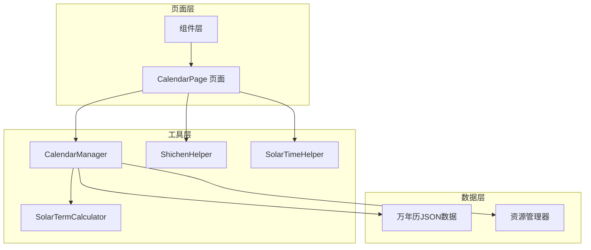
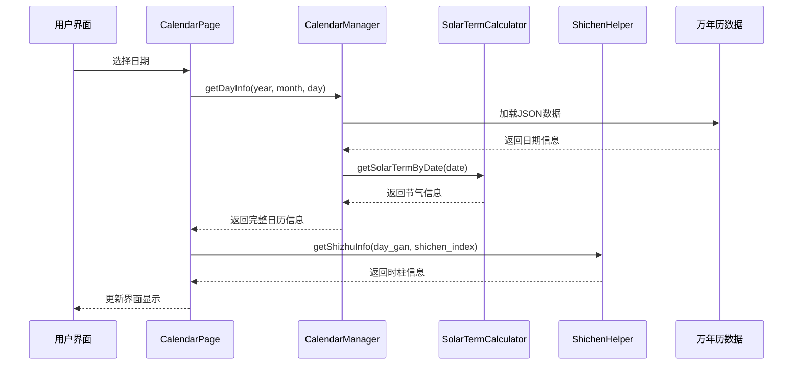
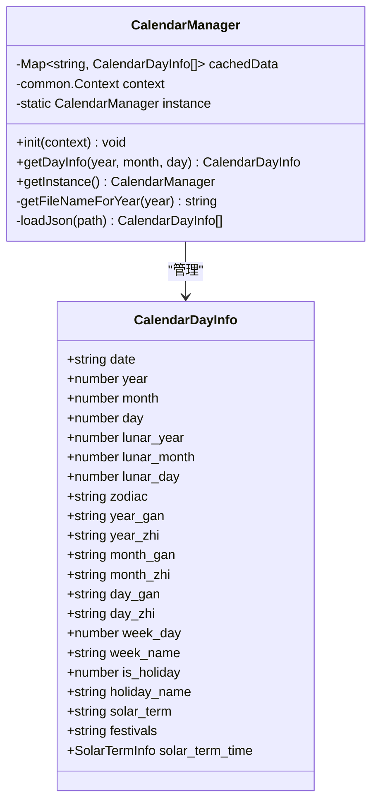
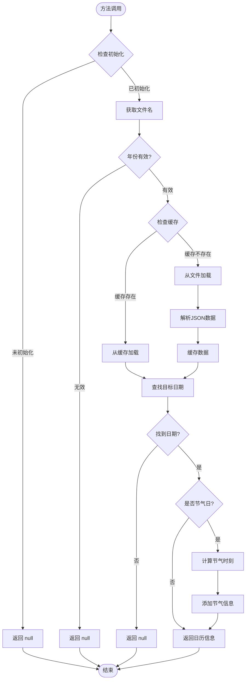
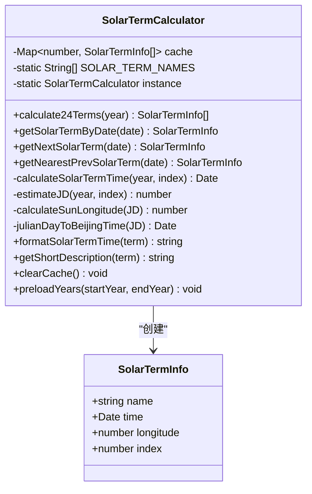
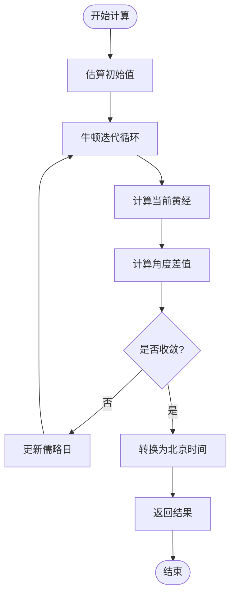
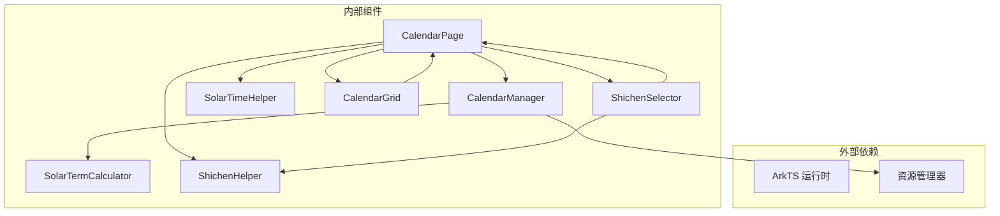

# 日历工具API

<cite>
**本文档引用的文件**
- [CalendarManager.ets](file://entry/src/main/ets/utils/CalendarManager.ets)
- [SolarTermCalculator.ets](file://entry/src/main/ets/utils/SolarTermCalculator.ets)
- [ShichenHelper.ets](file://entry/src/main/ets/utils/ShichenHelper.ets)
- [SolarTimeHelper.ets](file://entry/src/main/ets/utils/SolarTimeHelper.ets)
- [Calendar.ets](file://entry/src/main/ets/pages/Calendar.ets)
- [CalendarGrid.ets](file://entry/src/main/ets/components/CalendarGrid.ets)
- [ShichenSelector.ets](file://entry/src/main/ets/components/ShichenSelector.ets)
- [calendar_data.md](file://entry/src/main/resources/rawfile/万年历json数据文件解读.md)
</cite>

## 目录
1. [简介](#简介)
2. [项目结构](#项目结构)
3. [核心组件](#核心组件)
4. [架构概览](#架构概览)
5. [详细组件分析](#详细组件分析)
6. [依赖关系分析](#依赖关系分析)
7. [性能考虑](#性能考虑)
8. [故障排除指南](#故障排除指南)
9. [结论](#结论)
10. [附录](#附录)

## 简介

本项目是一个基于鸿蒙系统的遁甲排盘日历工具，提供了完整的传统历法信息查询和术数应用功能。系统包含三大核心API模块：CalendarManager日历管理器、SolarTermCalculator节气计算器和ShichenHelper时辰助手，以及SolarTimeHelper真太阳时计算工具。

该系统支持1900-2061年的完整万年历数据查询，包含农历、节气、干支、节日等传统历法信息，并提供真太阳时计算和遁甲排盘功能。用户可以通过直观的日历界面选择日期和时辰，进行术数推演。

## 项目结构

项目采用模块化的架构设计，主要分为以下几个层次：



**图表来源**
- [Calendar.ets](file://entry/src/main/ets/pages/Calendar.ets#L1-L602)
- [CalendarManager.ets](file://entry/src/main/ets/utils/CalendarManager.ets#L1-L123)

**章节来源**
- [Calendar.ets](file://entry/src/main/ets/pages/Calendar.ets#L1-L602)
- [CalendarManager.ets](file://entry/src/main/ets/utils/CalendarManager.ets#L1-L123)

## 核心组件

### CalendarManager 日历管理器

CalendarManager是系统的核心数据访问层，负责管理万年历数据的加载、缓存和查询。它实现了单例模式，确保在整个应用生命周期内只维护一份数据实例。

**主要功能特性：**
- 支持1900-2061年完整年份范围的数据查询
- 基于文件分片的数据组织方式，提高加载效率
- 内置内存缓存机制，避免重复读取
- 自动处理节气精确时刻计算

**关键接口：**
- `getDayInfo(year, month, day)`: 获取指定日期的详细万年历信息
- `init(context)`: 初始化资源管理器上下文
- `getInstance()`: 获取单例实例

### SolarTermCalculator 节气计算器

SolarTermCalculator专门负责二十四节气的精确计算，提供多种节气查询方法。

**算法特点：**
- 基于寿星天文历算法和Meeus天文学算法
- 精度达到±2分钟
- 支持任意年份的节气计算
- 实现了牛顿迭代法进行精确求解

**核心方法：**
- `calculate24Terms(year)`: 计算指定年份的24节气
- `getSolarTermByDate(date)`: 获取指定日期的节气信息
- `getNextSolarTerm(date)`: 获取下一个节气
- `getNearestPrevSolarTerm(date)`: 获取最近的前一个节气

### ShichenHelper 时辰助手

ShichenHelper提供传统的十二时辰计算和干支推演功能，是遁甲排盘的重要支撑。

**功能特性：**
- 完整的十二时辰信息（名称、时间范围、五行属性）
- 五鼠遁法的时干计算算法
- 实时系统时间自动识别
- 时辰选择器组件支持

**核心功能：**
- `getAllShichen()`: 获取所有时辰列表
- `getCurrentShichenIndex()`: 获取当前系统时间对应的时辰索引
- `calculateShiGan(dayGan, shichenIndex)`: 计算时干
- `getShizhuInfo(dayGan, shichenIndex)`: 获取完整的时柱信息

**章节来源**
- [CalendarManager.ets](file://entry/src/main/ets/utils/CalendarManager.ets#L30-L123)
- [SolarTermCalculator.ets](file://entry/src/main/ets/utils/SolarTermCalculator.ets#L30-L375)
- [ShichenHelper.ets](file://entry/src/main/ets/utils/ShichenHelper.ets#L14-L114)

## 架构概览

系统采用分层架构设计，各层职责明确，耦合度低：



**图表来源**
- [Calendar.ets](file://entry/src/main/ets/pages/Calendar.ets#L250-L257)
- [CalendarManager.ets](file://entry/src/main/ets/utils/CalendarManager.ets#L51-L92)
- [SolarTermCalculator.ets](file://entry/src/main/ets/utils/SolarTermCalculator.ets#L93-L115)

系统架构的关键优势：
- **数据分离**: 万年历数据独立存储，便于维护和更新
- **算法封装**: 节气计算算法封装在专用类中，保证精度和复用性
- **组件化设计**: UI组件与业务逻辑分离，便于测试和扩展
- **缓存策略**: 多级缓存机制提升性能表现

## 详细组件分析

### CalendarManager 详细分析

#### 数据结构设计

CalendarManager使用精心设计的数据结构来存储和表示日历信息：



**图表来源**
- [CalendarManager.ets](file://entry/src/main/ets/utils/CalendarManager.ets#L5-L28)
- [CalendarManager.ets](file://entry/src/main/ets/utils/CalendarManager.ets#L30-L46)

#### 核心方法实现

**getDayInfo() 方法流程：**



**图表来源**
- [CalendarManager.ets](file://entry/src/main/ets/utils/CalendarManager.ets#L51-L92)

#### 错误处理机制

CalendarManager实现了完善的错误处理策略：

1. **初始化检查**: 确保context正确初始化
2. **数据验证**: 验证年份范围和日期格式
3. **文件加载异常**: 捕获并记录资源加载错误
4. **数据解析失败**: 处理JSON解析异常
5. **缓存失效**: 提供缓存清理和预加载功能

**章节来源**
- [CalendarManager.ets](file://entry/src/main/ets/utils/CalendarManager.ets#L51-L123)

### SolarTermCalculator 详细分析

#### 节气计算算法

SolarTermCalculator实现了高精度的节气计算算法：



**图表来源**
- [SolarTermCalculator.ets](file://entry/src/main/ets/utils/SolarTermCalculator.ets#L23-L28)
- [SolarTermCalculator.ets](file://entry/src/main/ets/utils/SolarTermCalculator.ets#L30-L54)

#### 牛顿迭代法实现

节气计算采用了经典的牛顿迭代法进行精确求解：



**图表来源**
- [SolarTermCalculator.ets](file://entry/src/main/ets/utils/SolarTermCalculator.ets#L167-L191)

#### 算法精度和性能

- **计算精度**: ±2分钟，满足术数应用需求
- **算法来源**: 寿星天文历算法 + Meeus天文学算法
- **缓存策略**: 年度缓存机制，避免重复计算
- **预加载功能**: 支持批量预加载年份数据

**章节来源**
- [SolarTermCalculator.ets](file://entry/src/main/ets/utils/SolarTermCalculator.ets#L1-L375)

### ShichenHelper 详细分析

#### 时辰计算逻辑

ShichenHelper实现了传统的十二时辰系统：

```mermaid
flowchart TD
Start([获取时辰]) --> GetCurrentTime[获取当前系统时间]
GetCurrentTime --> ExtractHour[提取小时数]
ExtractHour --> CheckHour{小时数判断}
CheckHour --> |23点| ReturnZero[返回子时索引0]
CheckHour --> |其他| CalcIndex[计算索引]
CalcIndex --> Formula[(hour+1)/2 % 12]
Formula --> ReturnIndex[返回时辰索引]
ReturnZero --> ReturnIndex
ReturnIndex --> End([结束])
```

**图表来源**
- [ShichenHelper.ets](file://entry/src/main/ets/utils/ShichenHelper.ets#L44-L52)

#### 五鼠遁法算法

时干计算遵循传统的五鼠遁法口诀：

| 日干 | 起始时干 | 计算规则 |
|------|----------|----------|
| 甲、己 | 甲 | 从子时开始顺推 |
| 乙、庚 | 丙 | 从子时开始顺推 |
| 丙、辛 | 戊 | 从子时开始顺推 |
| 丁、壬 | 庚 | 从子时开始顺推 |
| 戊、癸 | 壬 | 从子时开始顺推 |

**章节来源**
- [ShichenHelper.ets](file://entry/src/main/ets/utils/ShichenHelper.ets#L14-L114)

## 依赖关系分析

系统采用松耦合的设计，各组件之间的依赖关系清晰：



**图表来源**
- [Calendar.ets](file://entry/src/main/ets/pages/Calendar.ets#L1-L10)
- [CalendarManager.ets](file://entry/src/main/ets/utils/CalendarManager.ets#L1-L3)

### 关键依赖点

1. **CalendarManager 依赖关系**:
   - 依赖ArkTS运行时的资源管理功能
   - 依赖SolarTermCalculator进行节气计算
   - 依赖JSON解析库进行数据处理

2. **SolarTermCalculator 依赖关系**:
   - 依赖数学计算库进行三角函数运算
   - 依赖日期处理库进行时间计算
   - 依赖缓存机制进行性能优化

3. **ShichenHelper 依赖关系**:
   - 依赖系统时间获取功能
   - 依赖字符串处理功能
   - 依赖数组操作功能

**章节来源**
- [Calendar.ets](file://entry/src/main/ets/pages/Calendar.ets#L1-L10)
- [CalendarManager.ets](file://entry/src/main/ets/utils/CalendarManager.ets#L1-L3)

## 性能考虑

### 缓存策略

系统实现了多级缓存机制来优化性能：

1. **文件级缓存**: CalendarManager使用Map缓存已加载的JSON数据
2. **计算级缓存**: SolarTermCalculator缓存年度节气计算结果
3. **内存优化**: 合理控制缓存大小，避免内存溢出

### 异步处理

- 万年历数据加载采用异步方式，避免阻塞UI线程
- 节气计算使用预加载机制，减少实时计算开销
- 批量数据查询使用Promise.all并行处理

### 数据优化

- JSON数据文件按10年分片存储，减少单文件大小
- 万年历数据包含完整的字段，避免多次查询
- 节气精确时刻仅在需要时计算

## 故障排除指南

### 常见问题及解决方案

**问题1: CalendarManager未初始化**
- **症状**: 调用getDayInfo()返回null并输出错误日志
- **原因**: 未调用init()方法初始化context
- **解决**: 在页面加载时调用CalendarManager.getInstance().init(getContext(this))

**问题2: 日期查询返回null**
- **症状**: 指定日期无法获取到日历信息
- **可能原因**: 
  - 年份超出支持范围(1900-2061)
  - 日期格式不正确
  - JSON数据文件缺失或损坏
- **解决**: 检查年份范围和日期格式，确认数据文件完整性

**问题3: 节气计算不准确**
- **症状**: 节气时刻与预期不符
- **原因**: 缓存数据过期或计算错误
- **解决**: 调用clearCache()清除缓存，重新计算

**问题4: 时辰计算错误**
- **症状**: 时干推算结果不正确
- **原因**: 日干输入错误或算法实现问题
- **解决**: 验证日干输入，检查五鼠遁法口诀

### 调试技巧

1. **启用详细日志**: 在开发模式下观察控制台输出
2. **检查数据结构**: 使用浏览器开发者工具检查数据结构
3. **验证算法**: 对关键计算步骤进行单元测试
4. **监控性能**: 使用性能分析工具检查内存使用情况

**章节来源**
- [CalendarManager.ets](file://entry/src/main/ets/utils/CalendarManager.ets#L52-L55)
- [SolarTermCalculator.ets](file://entry/src/main/ets/utils/SolarTermCalculator.ets#L360-L362)

## 结论

本日历工具API系统通过精心设计的架构和算法，成功实现了传统历法信息的数字化管理。系统具有以下突出特点：

1. **高精度算法**: 节气计算精度达到±2分钟，满足术数应用需求
2. **完整数据覆盖**: 支持1900-2061年的完整万年历数据
3. **优雅的用户体验**: 提供直观的日历界面和时辰选择功能
4. **良好的可扩展性**: 模块化设计便于功能扩展和维护

系统在性能优化、错误处理和用户体验方面都达到了较高水准，为遁甲排盘应用提供了坚实的技术基础。

## 附录

### API使用示例

#### CalendarManager 使用示例

```typescript
// 初始化
CalendarManager.getInstance().init(getContext(this));

// 查询指定日期信息
const dayInfo = await CalendarManager.getInstance().getDayInfo(2026, 1, 5);

if (dayInfo) {
    console.log(`农历: ${dayInfo.lunar_day}日`);
    console.log(`节气: ${dayInfo.solar_term}`);
    console.log(`时柱: ${dayInfo.day_gan}${dayInfo.day_zhi}`);
}
```

#### SolarTermCalculator 使用示例

```typescript
const calculator = SolarTermCalculator.getInstance();

// 获取指定年份的24节气
const terms = calculator.calculate24Terms(2026);
console.log(`小寒: ${SolarTermCalculator.formatSolarTermTime(terms[0])}`);

// 获取指定日期的节气
const term = calculator.getSolarTermByDate(new Date());
if (term) {
    console.log(`今日节气: ${term.name}`);
}

// 获取最近的前一个节气
const prevTerm = calculator.getNearestPrevSolarTerm(new Date());
```

#### ShichenHelper 使用示例

```typescript
// 获取当前系统时间对应的时辰
const currentIndex = ShichenHelper.getCurrentShichenIndex();
console.log(`当前时辰: ${ShichenHelper.getAllShichen()[currentIndex].name}`);

// 计算时干
const shiGan = ShichenHelper.calculateShiGan('甲', currentIndex);
console.log(`时干: ${shiGan}`);

// 获取完整的时柱信息
const shizhu = ShichenHelper.getShizhuInfo('甲', currentIndex);
console.log(`时柱: ${shizhu}`);
```

### 参数说明表

#### CalendarManager.getDayInfo() 参数

| 参数名 | 类型 | 必填 | 描述 | 默认值 |
|--------|------|------|------|--------|
| year | number | 是 | 公历年份 | - |
| month | number | 是 | 公历月份 | - |
| day | number | 是 | 公历日期 | - |

#### SolarTermCalculator 方法参数

| 方法名 | 参数 | 类型 | 必填 | 描述 |
|--------|------|------|------|------|
| calculate24Terms | year | number | 是 | 要计算的年份 |
| getSolarTermByDate | date | Date | 是 | 要查询的日期 |
| getNextSolarTerm | date | Date | 是 | 要查询的日期 |
| getNearestPrevSolarTerm | date | Date | 是 | 要查询的日期 |

#### ShichenHelper 方法参数

| 方法名 | 参数 | 类型 | 必填 | 描述 |
|--------|------|------|------|------|
| calculateShiGan | dayGan | string | 是 | 日干（天干） |
| calculateShiGan | shichenIndex | number | 是 | 时辰索引（0-11） |
| getShizhuInfo | dayGan | string | 是 | 日干（天干） |
| getShizhuInfo | shichenIndex | number | 是 | 时辰索引（0-11） |

### 返回值类型说明

#### CalendarDayInfo 结构

| 字段名 | 类型 | 描述 |
|--------|------|------|
| date | string | 日期字符串（YYYY-MM-DD） |
| year | number | 公历年份 |
| month | number | 公历月份 |
| day | number | 公历日期 |
| lunar_year | number | 农历年份 |
| lunar_month | number | 农历月份 |
| lunar_day | number | 农历日期 |
| zodiac | string | 生肖 |
| year_gan | string | 年干 |
| year_zhi | string | 年支 |
| month_gan | string | 月干 |
| month_zhi | string | 月支 |
| day_gan | string | 日干 |
| day_zhi | string | 日支 |
| week_day | number | 星期（0-6） |
| week_name | string | 星期名称 |
| is_holiday | number | 是否节假日 |
| holiday_name | string | 节假日名称 |
| solar_term | string | 节气名称 |
| festivals | string | 节日信息 |
| solar_term_time | SolarTermInfo | 节气精确时刻（可选） |

#### SolarTermInfo 结构

| 字段名 | 类型 | 描述 |
|--------|------|------|
| name | string | 节气名称 |
| time | Date | 交节时刻（北京时间） |
| longitude | number | 太阳黄经（度） |
| index | number | 节气索引（0-23） |

#### ShichenInfo 结构

| 字段名 | 类型 | 描述 |
|--------|------|------|
| name | string | 时辰名称 |
| range | string | 时间范围（如"23:00-01:00"） |
| zhi | string | 时辰地支 |
| wuxing | string | 五行属性 |
| index | number | 时辰索引（0-11） |
| gan | string | 时干（可选） |

### 错误处理机制

系统实现了多层次的错误处理机制：

1. **初始化检查**: 确保CalendarManager正确初始化
2. **数据验证**: 验证输入参数的有效性
3. **异常捕获**: 捕获并处理各种运行时异常
4. **降级策略**: 在数据缺失时提供合理的默认值
5. **日志记录**: 记录详细的错误信息便于调试

### 集成指南

#### 基础集成步骤

1. **初始化CalendarManager**
```typescript
CalendarManager.getInstance().init(getContext(this));
```

2. **在页面中使用**
```typescript
const dayInfo = await CalendarManager.getInstance().getDayInfo(
    selectedDate.getFullYear(),
    selectedDate.getMonth() + 1,
    selectedDate.getDate()
);
```

3. **集成节气计算**
```typescript
const term = SolarTermCalculator.getInstance().getSolarTermByDate(selectedDate);
```

4. **集成时辰选择**
```typescript
const shizhu = ShichenHelper.getShizhuInfo(dayInfo.day_gan, selectedShichenIndex);
```

#### 高级集成选项

1. **预加载数据**: 使用`preloadYears()`方法预加载未来几年的节气数据
2. **自定义缓存**: 根据应用需求调整缓存策略
3. **性能监控**: 监控数据加载和计算性能
4. **错误恢复**: 实现自动重试和错误恢复机制