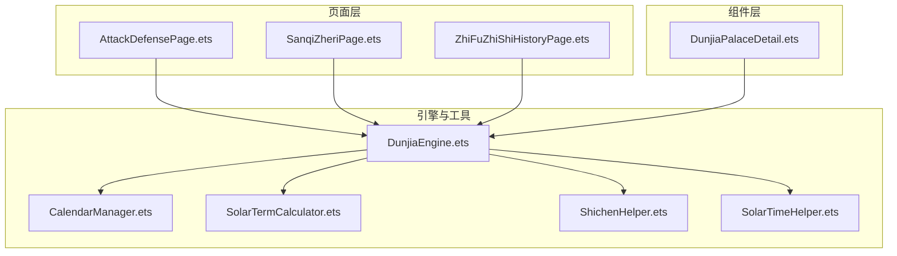
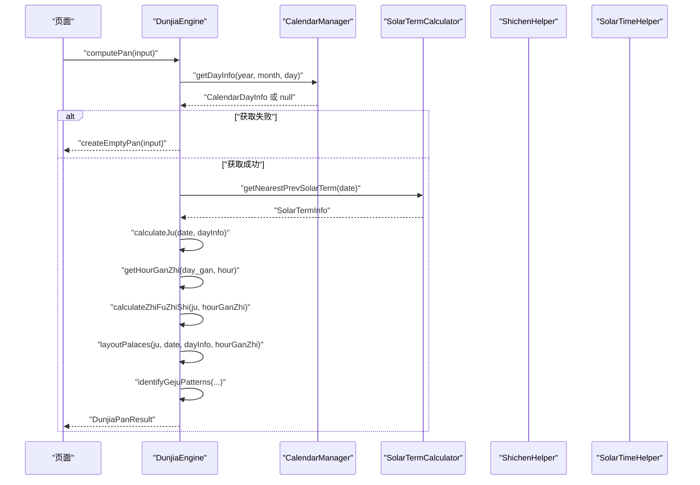
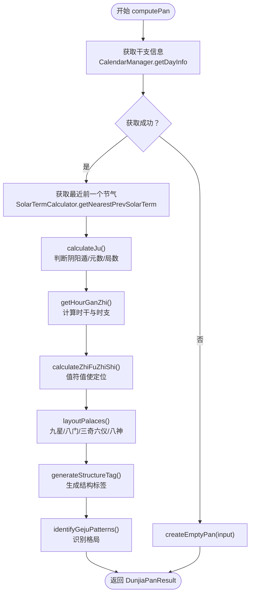
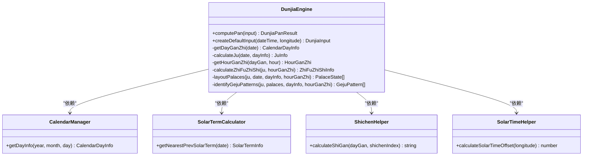

# 引擎核心方法

<cite>
**本文档引用的文件**
- [DunjiaEngine.ets](file://entry/src/main/ets/utils/DunjiaEngine.ets)
- [CalendarManager.ets](file://entry/src/main/ets/utils/CalendarManager.ets)
- [SolarTermCalculator.ets](file://entry/src/main/ets/utils/SolarTermCalculator.ets)
- [ShichenHelper.ets](file://entry/src/main/ets/utils/ShichenHelper.ets)
- [SolarTimeHelper.ets](file://entry/src/main/ets/utils/SolarTimeHelper.ets)
- [Index.ets](file://entry/src/main/ets/pages/Index.ets)
- [AttackDefensePage.ets](file://entry/src/main/ets/pages/AttackDefensePage.ets)
- [SanqiZheriPage.ets](file://entry/src/main/ets/pages/SanqiZheriPage.ets)
- [ZhiFuZhiShiHistoryPage.ets](file://entry/src/main/ets/pages/ZhiFuZhiShiHistoryPage.ets)
- [DunjiaPalaceDetail.ets](file://entry/src/main/ets/components/DunjiaPalaceDetail.ets)
- [ArkTS开发规范指南.md](file://ArkTS开发规范指南.md)
- [组件化细要.md](file://组件化细要.md)
</cite>

## 目录
1. [简介](#简介)
2. [项目结构](#项目结构)
3. [核心组件](#核心组件)
4. [架构概览](#架构概览)
5. [详细组件分析](#详细组件分析)
6. [依赖分析](#依赖分析)
7. [性能考量](#性能考量)
8. [故障排查指南](#故障排查指南)
9. [结论](#结论)
10. [附录](#附录)

## 简介
本文件聚焦“遁甲时空盘”引擎的核心方法，系统梳理 computePan() 主计算流程与 createDefaultInput() 便捷方法，涵盖输入验证、干支信息获取、局数计算、值符值使定位、九宫布局、规则识别与格局判定、错误处理与异常分支、以及最佳实践与性能优化建议。文档面向不同技术背景读者，既提供代码级细节，也给出可视化图示帮助理解。

## 项目结构
该引擎位于 entry/src/main/ets/utils/ 目录，配合 pages 与 components 目录中的页面与组件共同完成从输入到渲染的完整链路。核心文件如下：
- utils/DunjiaEngine.ets：核心引擎与主计算方法 computePan()
- utils/CalendarManager.ets：万年历与干支信息获取
- utils/SolarTermCalculator.ets：节气精确时刻计算
- utils/ShichenHelper.ets：十二时辰与五鼠遁法
- utils/SolarTimeHelper.ets：真太阳时计算
- pages/*：调用引擎进行排盘的页面
- components/*：渲染九宫与宫位详情的组件

图表来源
- [DunjiaEngine.ets](file://entry/src/main/ets/utils/DunjiaEngine.ets#L113-L162)
- [CalendarManager.ets](file://entry/src/main/ets/utils/CalendarManager.ets#L51-L92)
- [SolarTermCalculator.ets](file://entry/src/main/ets/utils/SolarTermCalculator.ets#L143-L159)
- [ShichenHelper.ets](file://entry/src/main/ets/utils/ShichenHelper.ets#L59-L91)
- [SolarTimeHelper.ets](file://entry/src/main/ets/utils/SolarTimeHelper.ets#L54-L77)

章节来源
- [DunjiaEngine.ets](file://entry/src/main/ets/utils/DunjiaEngine.ets#L1-L120)
- [CalendarManager.ets](file://entry/src/main/ets/utils/CalendarManager.ets#L1-L123)
- [SolarTermCalculator.ets](file://entry/src/main/ets/utils/SolarTermCalculator.ets#L1-L160)
- [ShichenHelper.ets](file://entry/src/main/ets/utils/ShichenHelper.ets#L1-L114)
- [SolarTimeHelper.ets](file://entry/src/main/ets/utils/SolarTimeHelper.ets#L1-L270)

## 核心组件
- DunjiaEngine：单例引擎，提供 computePan() 主计算方法与 createDefaultInput() 便捷方法；内部包含干支与时辰计算、局数与阴阳遁判断、值符值使定位、九宫布局、规则识别与格局判定等算法。
- CalendarManager：提供按年份分片的万年历 JSON 数据加载与缓存，返回当日干支信息。
- SolarTermCalculator：计算节气精确时刻，支持“最近前一个节气”查询，用于局数与元数判断。
- ShichenHelper：提供十二时辰基础信息与五鼠遁法计算时干。
- SolarTimeHelper：提供真太阳时计算与格式化输出。

章节来源
- [DunjiaEngine.ets](file://entry/src/main/ets/utils/DunjiaEngine.ets#L98-L108)
- [CalendarManager.ets](file://entry/src/main/ets/utils/CalendarManager.ets#L30-L46)
- [SolarTermCalculator.ets](file://entry/src/main/ets/utils/SolarTermCalculator.ets#L30-L54)
- [ShichenHelper.ets](file://entry/src/main/ets/utils/ShichenHelper.ets#L14-L39)
- [SolarTimeHelper.ets](file://entry/src/main/ets/utils/SolarTimeHelper.ets#L29-L47)

## 架构概览
引擎采用“单例 + 工具类协作”的架构：页面通过单例获取引擎实例，传入输入参数后触发 computePan()，内部按步骤调用 CalendarManager、SolarTermCalculator、ShichenHelper、SolarTimeHelper 等工具，最终产出 DunjiaPanResult 结果。

图表来源
- [DunjiaEngine.ets](file://entry/src/main/ets/utils/DunjiaEngine.ets#L113-L162)
- [CalendarManager.ets](file://entry/src/main/ets/utils/CalendarManager.ets#L51-L92)
- [SolarTermCalculator.ets](file://entry/src/main/ets/utils/SolarTermCalculator.ets#L143-L159)
- [ShichenHelper.ets](file://entry/src/main/ets/utils/ShichenHelper.ets#L59-L91)
- [SolarTimeHelper.ets](file://entry/src/main/ets/utils/SolarTimeHelper.ets#L54-L77)

## 详细组件分析

### computePan() 主计算方法
computePan() 是引擎的核心入口，负责从输入参数到完整盘面与结构化分析结果的全流程。其执行顺序与关键步骤如下：

- 输入参数校验与准备
  - 接收 DunjiaInput：包含 dateTime、longitude、sceneType。
  - 建议使用真太阳时校正后的 dateTime，longitude 用于真太阳时与节气研习。

- 获取干支信息
  - 调用 CalendarManager.getDayInfo() 获取当日干支与节气信息。
  - 若获取失败，返回 createEmptyPan(input)，避免空指针与异常传播。

- 确定阴阳遁与局数
  - 通过 SolarTermCalculator.getNearestPrevSolarTerm() 获取最近前一个节气。
  - 根据节气名称判断 DunType（YANG/YIN）。
  - 根据日干支与“仲孟季”规则确定 YuanIndex（上/中/下元）。
  - 查表确定 juNumber（局数），返回 JuInfo。

- 计算时干与时支
  - 通过 getHourGanZhi() 计算时干与时支，用于值符值使定位与三奇六仪布局。

- 计算值符值使位置
  - calculateZhiFuZhiShi()：值符随“时干”飞布，按阴阳遁顺逆飞，跳过中宫。
  - calculateZhiShiPalace()：值使随“时支”飞布，阳遁从一宫顺飞，阴遁从九宫逆飞，跳过中宫。

- 布九宫（九星、八门、三奇六仪、八神）
  - layoutStars()/layoutDoors()：固定九宫对应（不随局数飞布）。
  - layoutTianGan(isTianPan=true/false)：天盘（暗干）与地盘（明干）布局，区分阳遁顺布六仪逆布三奇、阴遁逆布六仪顺布三奇。
  - layoutDeities()：九天、九地、太阴、六合等八神按值符位置顺逆飞布。

- 生成规则命中与结构总结
  - generateStructureTag() 生成结构标签。
  - summary.overview 汇总当前遁类型、局数、值符值使所在宫位。

- 识别格局
  - identifyGejuPatterns()：识别三奇得使、三遁、三奇合、伏吟、反吹、青龙返首、飞鸟跌穴、三奇入墓、六仪击刑、太白入荧惑、荧惑入太白、天网四张等格局，返回 GejuPattern[]。

- 返回结果
  - 返回 DunjiaPanResult，包含 dunType、juLabel、input、zhiFuPalace、zhiShiPalace、palaces、ruleHits、summary、dayInfo、hourGanZhi、solarTimeOffset、gejuPatterns 等字段。

图表来源
- [DunjiaEngine.ets](file://entry/src/main/ets/utils/DunjiaEngine.ets#L113-L162)
- [DunjiaEngine.ets](file://entry/src/main/ets/utils/DunjiaEngine.ets#L247-L250)
- [DunjiaEngine.ets](file://entry/src/main/ets/utils/DunjiaEngine.ets#L256-L281)
- [DunjiaEngine.ets](file://entry/src/main/ets/utils/DunjiaEngine.ets#L169-L198)
- [DunjiaEngine.ets](file://entry/src/main/ets/utils/DunjiaEngine.ets#L206-L246)
- [DunjiaEngine.ets](file://entry/src/main/ets/utils/DunjiaEngine.ets#L358-L389)
- [DunjiaEngine.ets](file://entry/src/main/ets/utils/DunjiaEngine.ets#L678-L936)

章节来源
- [DunjiaEngine.ets](file://entry/src/main/ets/utils/DunjiaEngine.ets#L113-L162)
- [DunjiaEngine.ets](file://entry/src/main/ets/utils/DunjiaEngine.ets#L247-L281)
- [DunjiaEngine.ets](file://entry/src/main/ets/utils/DunjiaEngine.ets#L169-L246)
- [DunjiaEngine.ets](file://entry/src/main/ets/utils/DunjiaEngine.ets#L358-L462)
- [DunjiaEngine.ets](file://entry/src/main/ets/utils/DunjiaEngine.ets#L470-L601)
- [DunjiaEngine.ets](file://entry/src/main/ets/utils/DunjiaEngine.ets#L678-L936)

### createDefaultInput() 便捷方法
- 方法用途：快速从当前时间生成默认输入，适合“从当前日期进入时空盘”的场景。
- 参数说明：
  - dateTime: Date —— 建议使用真太阳时校正后的日期时间。
  - longitude: number —— 地理经度（东经为正），用于真太阳时与节气研习。
- 返回值：DunjiaInput，包含 dateTime、longitude、sceneType=GENERAL_STUDY。
- 使用场景：
  - 页面首次进入时，直接构造输入并调用 computePan()。
  - 与页面生命周期（如 aboutToAppear）结合，避免重复构造。

章节来源
- [DunjiaEngine.ets](file://entry/src/main/ets/utils/DunjiaEngine.ets#L645-L651)

### 关键内部方法与数据结构
- getDayGanZhi()：异步获取 CalendarDayInfo，失败时返回 null。
- calculateJu()：根据节气与日干支确定 DunType、YuanIndex、JuNumber。
- getHourGanZhi()：根据日干与时区间计算时干与时支。
- calculateZhiFuZhiShi()：值符随“时干”飞布，值使随“时支”飞布。
- layoutPalaces()：九星、八门、三奇六仪、八神布局。
- identifyGejuPatterns()：识别多种格局并返回 GejuPattern[]。
- createEmptyPan()：当干支信息缺失时返回空盘。

章节来源
- [DunjiaEngine.ets](file://entry/src/main/ets/utils/DunjiaEngine.ets#L247-L250)
- [DunjiaEngine.ets](file://entry/src/main/ets/utils/DunjiaEngine.ets#L256-L323)
- [DunjiaEngine.ets](file://entry/src/main/ets/utils/DunjiaEngine.ets#L169-L198)
- [DunjiaEngine.ets](file://entry/src/main/ets/utils/DunjiaEngine.ets#L206-L246)
- [DunjiaEngine.ets](file://entry/src/main/ets/utils/DunjiaEngine.ets#L358-L462)
- [DunjiaEngine.ets](file://entry/src/main/ets/utils/DunjiaEngine.ets#L678-L936)
- [DunjiaEngine.ets](file://entry/src/main/ets/utils/DunjiaEngine.ets#L613-L639)

### 方法签名与返回值结构
- computePan(input: DunjiaInput): Promise<DunjiaPanResult>
- createDefaultInput(dateTime: Date, longitude: number): DunjiaInput
- getDayGanZhi(date: Date): Promise<CalendarDayInfo | null>
- calculateJu(date: Date, dayInfo: CalendarDayInfo): JuInfo
- getHourGanZhi(dayGan: string, hour: number): HourGanZhi
- calculateZhiFuZhiShi(ju: JuInfo, hourGanZhi: HourGanZhi): ZhiFuZhiShiInfo
- layoutPalaces(ju: JuInfo, date: Date, dayInfo: CalendarDayInfo, hourGanZhi: HourGanZhi): PalaceState[]
- identifyGejuPatterns(ju: JuInfo, palaces: PalaceState[], dayInfo: CalendarDayInfo, hourGanZhi: HourGanZhi): GejuPattern[]
- createEmptyPan(input: DunjiaInput): DunjiaPanResult

章节来源
- [DunjiaEngine.ets](file://entry/src/main/ets/utils/DunjiaEngine.ets#L113-L162)
- [DunjiaEngine.ets](file://entry/src/main/ets/utils/DunjiaEngine.ets#L645-L651)
- [DunjiaEngine.ets](file://entry/src/main/ets/utils/DunjiaEngine.ets#L247-L281)
- [DunjiaEngine.ets](file://entry/src/main/ets/utils/DunjiaEngine.ets#L169-L246)
- [DunjiaEngine.ets](file://entry/src/main/ets/utils/DunjiaEngine.ets#L358-L462)
- [DunjiaEngine.ets](file://entry/src/main/ets/utils/DunjiaEngine.ets#L678-L936)
- [DunjiaEngine.ets](file://entry/src/main/ets/utils/DunjiaEngine.ets#L613-L639)

### 使用示例与调用关系
- 页面调用示例（摘自项目源码）：
  - 在页面生命周期中构造 DunjiaInput，调用 engine.computePan(input) 获取 DunjiaPanResult。
  - 将结果传递给 DunjiaNineGrid 与 DunjiaPalaceDetail 组件进行渲染。
- 历史值符值使页面：遍历12个时辰，逐个计算并记录值符/值使所在宫位与名称。

章节来源
- [AttackDefensePage.ets](file://entry/src/main/ets/pages/AttackDefensePage.ets#L32-L48)
- [SanqiZheriPage.ets](file://entry/src/main/ets/pages/SanqiZheriPage.ets#L117-L134)
- [ZhiFuZhiShiHistoryPage.ets](file://entry/src/main/ets/pages/ZhiFuZhiShiHistoryPage.ets#L42-L76)
- [DunjiaPalaceDetail.ets](file://entry/src/main/ets/components/DunjiaPalaceDetail.ets#L12-L21)

## 依赖分析
- DunjiaEngine 依赖：
  - CalendarManager：获取干支与节气信息。
  - SolarTermCalculator：获取节气精确时刻与最近前一个节气。
  - ShichenHelper：提供时干与时支的基础信息（五鼠遁法）。
  - SolarTimeHelper：计算真太阳时偏移量（分钟）。
- 页面与组件依赖：
  - 页面通过单例获取引擎实例，调用 computePan()。
  - 组件接收 DunjiaPanResult 并渲染九宫与宫位详情。

图表来源
- [DunjiaEngine.ets](file://entry/src/main/ets/utils/DunjiaEngine.ets#L4-L5)
- [CalendarManager.ets](file://entry/src/main/ets/utils/CalendarManager.ets#L51-L92)
- [SolarTermCalculator.ets](file://entry/src/main/ets/utils/SolarTermCalculator.ets#L143-L159)
- [ShichenHelper.ets](file://entry/src/main/ets/utils/ShichenHelper.ets#L59-L91)
- [SolarTimeHelper.ets](file://entry/src/main/ets/utils/SolarTimeHelper.ets#L658-L661)

章节来源
- [DunjiaEngine.ets](file://entry/src/main/ets/utils/DunjiaEngine.ets#L4-L5)
- [CalendarManager.ets](file://entry/src/main/ets/utils/CalendarManager.ets#L51-L92)
- [SolarTermCalculator.ets](file://entry/src/main/ets/utils/SolarTermCalculator.ets#L143-L159)
- [ShichenHelper.ets](file://entry/src/main/ets/utils/ShichenHelper.ets#L59-L91)
- [SolarTimeHelper.ets](file://entry/src/main/ets/utils/SolarTimeHelper.ets#L658-L661)

## 性能考量
- 缓存策略
  - CalendarManager 对年份数据进行缓存，避免重复加载 JSON。
  - SolarTermCalculator 对节气结果进行缓存，减少重复计算。
- 批量与延迟
  - 页面批量计算值符值使历史时，建议合并请求与结果处理，避免频繁重绘。
- 数据结构
  - 九宫布局使用固定数组映射，访问 O(1)，整体布局算法为 O(1)。
- I/O 与网络
  - 万年历 JSON 为本地资源，注意文件大小与加载耗时；必要时进行预加载。
- 真太阳时
  - 计算真太阳时偏移量为纯数学运算，开销极低；若启用高精度算法，需权衡性能与精度。

章节来源
- [CalendarManager.ets](file://entry/src/main/ets/utils/CalendarManager.ets#L33-L34)
- [SolarTermCalculator.ets](file://entry/src/main/ets/utils/SolarTermCalculator.ets#L32)
- [ArkTS开发规范指南.md](file://ArkTS开发规范指南.md#L684-L729)

## 故障排查指南
- 干支信息为空
  - 现象：computePan() 返回空盘。
  - 原因：CalendarManager.getDayInfo() 未初始化或找不到对应年份数据。
  - 处理：确保页面生命周期中调用 CalendarManager.getInstance().init(context)，并检查年份范围与 JSON 文件存在性。
- 节气计算异常
  - 现象：局数与元数错误。
  - 原因：SolarTermCalculator.getNearestPrevSolarTerm() 返回 null 或节气名称不在映射表中。
  - 处理：检查输入日期是否在有效年份范围内，确认节气数据文件加载成功。
- 值符值使定位异常
  - 现象：值符/值使宫位与预期不符。
  - 原因：时干/时支计算错误或飞布方向/跳宫规则未正确应用。
  - 处理：核对 getHourGanZhi() 与 calculateZhiFuZhiShi()/calculateZhiShiPalace() 的实现与边界条件。
- 格局识别不准确
  - 现象：识别结果缺失或误判。
  - 原因：天盘/地盘干支叠加判断、相对宫位关系或特定规则未覆盖。
  - 处理：对照《遁甲符应经》与中卷规则，逐步完善 identifyGejuPatterns() 的判断分支。
- 真太阳时偏移量
  - 现象：显示与本地时间差异较大。
  - 原因：经度输入错误或未使用真太阳时校正。
  - 处理：确认 longitude 输入为东经为正，建议使用 SolarTimeHelper 进行校正后再传入 computePan()。

章节来源
- [DunjiaEngine.ets](file://entry/src/main/ets/utils/DunjiaEngine.ets#L118-L120)
- [CalendarManager.ets](file://entry/src/main/ets/utils/CalendarManager.ets#L52-L55)
- [SolarTermCalculator.ets](file://entry/src/main/ets/utils/SolarTermCalculator.ets#L143-L159)
- [DunjiaEngine.ets](file://entry/src/main/ets/utils/DunjiaEngine.ets#L658-L661)

## 结论
DunjiaEngine 以清晰的职责划分与模块化设计实现了从输入到盘面与格局识别的完整流程。computePan() 作为主入口，串联了干支、节气、时辰、值符值使与九宫布局等关键环节；createDefaultInput() 提供了便捷的默认输入构造方式。通过合理的缓存与错误处理机制，可在保证准确性的同时兼顾性能与可维护性。建议在实际应用中结合页面生命周期与组件化架构，持续完善规则识别与用户体验。

## 附录
- 页面与组件使用参考
  - 页面示例：AttackDefensePage、SanqiZheriPage、ZhiFuZhiShiHistoryPage。
  - 组件示例：DunjiaPalaceDetail。
- 开发规范参考
  - 组件化引用规范、类型安全要求、初始化流程与状态传递规范。
- 移植与复用指南
  - 组件与工具类的迁移清单与注意事项。

章节来源
- [AttackDefensePage.ets](file://entry/src/main/ets/pages/AttackDefensePage.ets#L1-L50)
- [SanqiZheriPage.ets](file://entry/src/main/ets/pages/SanqiZheriPage.ets#L1-L146)
- [ZhiFuZhiShiHistoryPage.ets](file://entry/src/main/ets/pages/ZhiFuZhiShiHistoryPage.ets#L42-L76)
- [DunjiaPalaceDetail.ets](file://entry/src/main/ets/components/DunjiaPalaceDetail.ets#L1-L22)
- [组件化细要.md](file://组件化细要.md#L223-L383)
- [ArkTS开发规范指南.md](file://ArkTS开发规范指南.md#L684-L729)