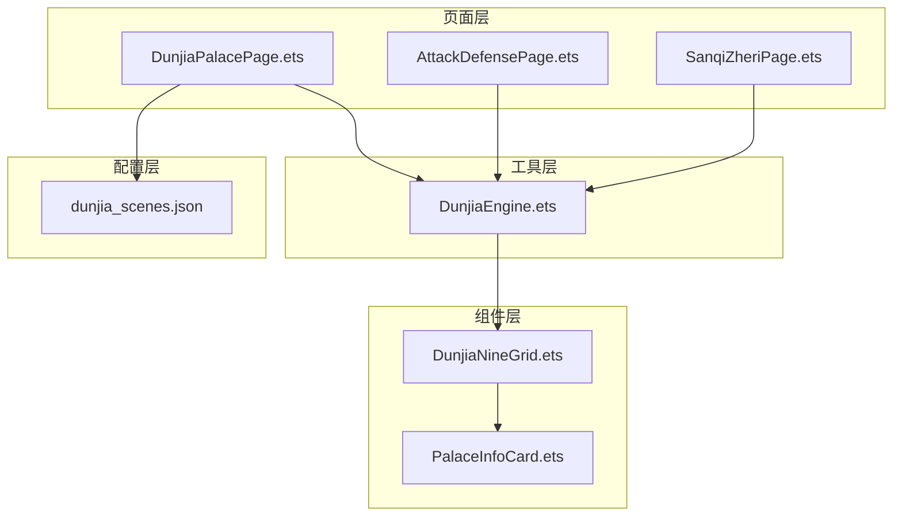
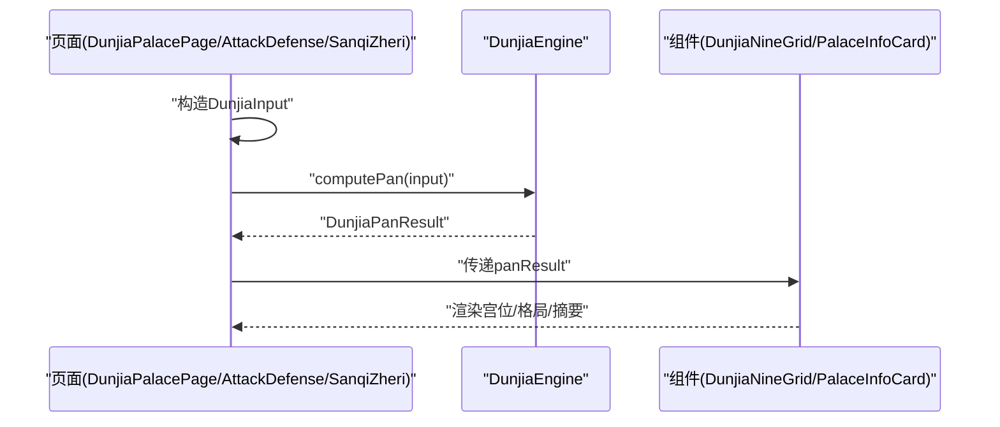
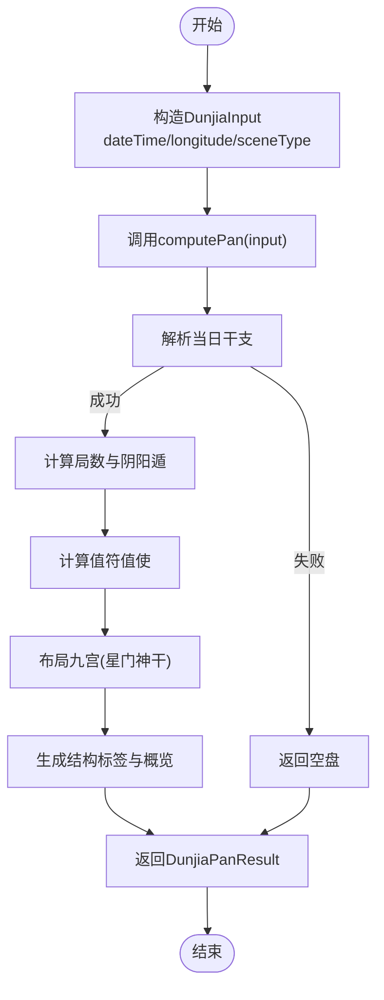
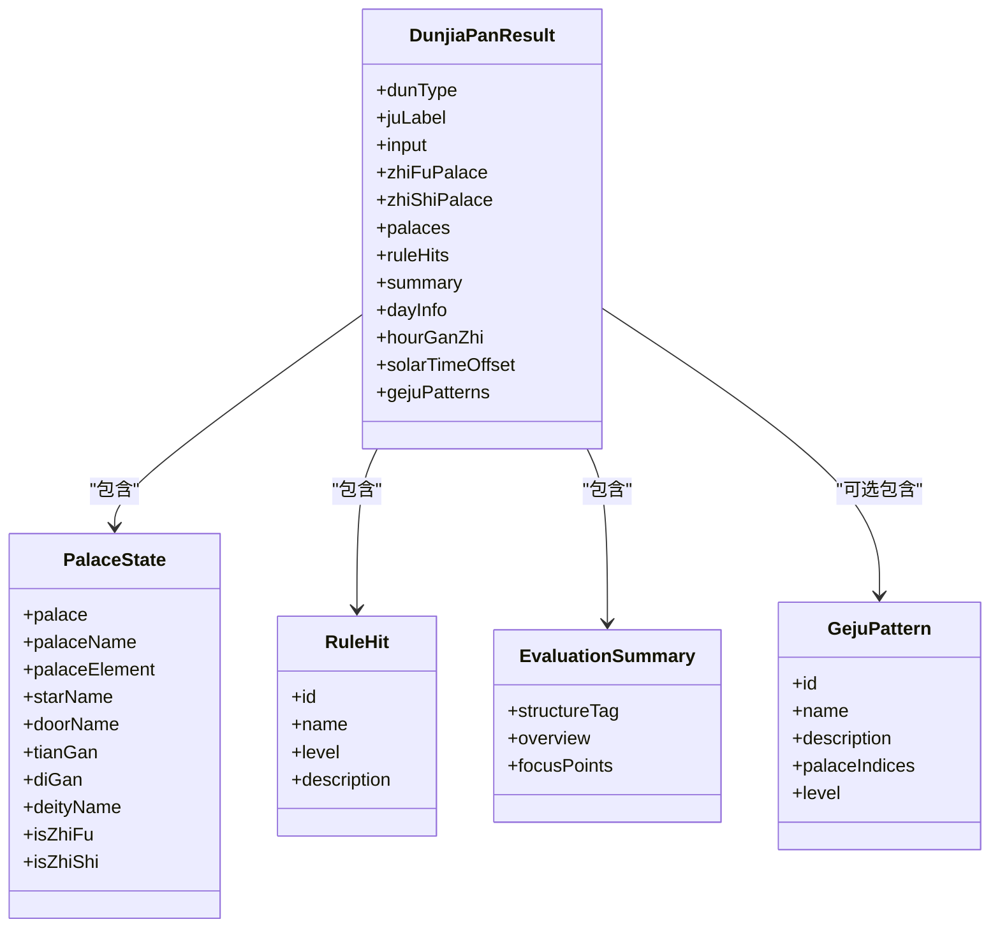
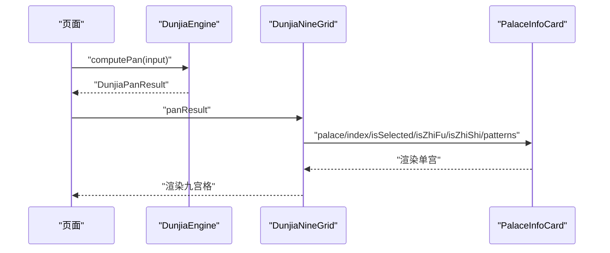
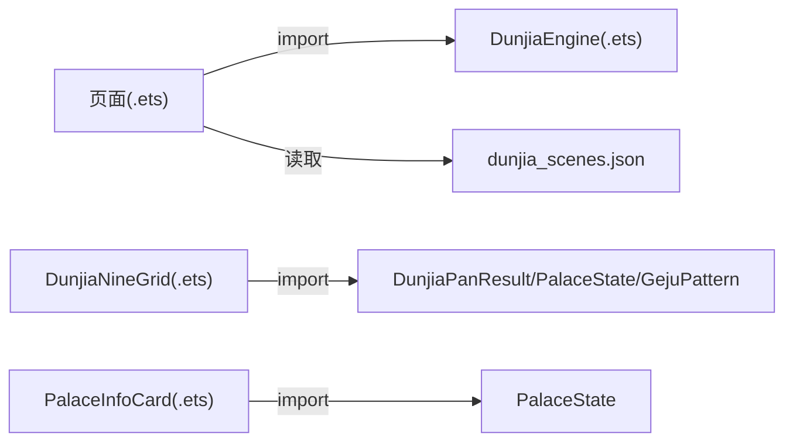

# 数据接口类型

<cite>
**本文引用的文件**
- [DunjiaEngine.ets](file://entry/src/main/ets/utils/DunjiaEngine.ets)
- [DunjiaPalacePage.ets](file://entry/src/main/ets/pages/DunjiaPalacePage.ets)
- [AttackDefensePage.ets](file://entry/src/main/ets/pages/AttackDefensePage.ets)
- [SanqiZheriPage.ets](file://entry/src/main/ets/pages/SanqiZheriPage.ets)
- [DunjiaNineGrid.ets](file://entry/src/main/ets/components/DunjiaNineGrid.ets)
- [PalaceInfoCard.ets](file://entry/src/main/ets/components/PalaceInfoCard.ets)
- [dunjia_scenes.json](file://entry/src/main/resources/rawfile/dunjia_scenes.json)
</cite>

## 目录
1. [简介](#简介)
2. [项目结构](#项目结构)
3. [核心组件](#核心组件)
4. [架构总览](#架构总览)
5. [详细组件分析](#详细组件分析)
6. [依赖分析](#依赖分析)
7. [性能考量](#性能考量)
8. [故障排查指南](#故障排查指南)
9. [结论](#结论)
10. [附录](#附录)

## 简介
本文件面向“遁甲数据接口类型”的综合说明，聚焦以下目标：
- 详述输入接口 DunjiaInput 的字段定义、用途与约束条件
- 详述输出结果 DunjiaPanResult 的完整结构，包括 dunType、juLabel、palaces、ruleHits、summary 等关键字段
- 说明宫位状态接口 PalaceState、规则命中接口 RuleHit、评估摘要接口 EvaluationSummary 的字段与含义
- 描述接口在页面与组件中的使用场景与数据流转关系
- 总结类型安全最佳实践与常见错误规避方法

## 项目结构
该应用采用 ArkTS + 自绘组件的前端架构，核心数据流围绕“输入参数 → 引擎计算 → 结果对象 → 页面渲染”的主线展开。关键文件分布如下：
- 输入/输出/中间类型定义集中在工具模块：utils/DunjiaEngine.ets
- 页面负责接收参数、触发计算、展示结果：pages/*.ets
- 组件负责结果的可视化与交互：components/*.ets
- 规则与配置以 JSON 形式提供：resources/rawfile/*.json

图表来源
- [DunjiaEngine.ets](file://entry/src/main/ets/utils/DunjiaEngine.ets#L21-L84)
- [DunjiaPalacePage.ets](file://entry/src/main/ets/pages/DunjiaPalacePage.ets#L1-L200)
- [AttackDefensePage.ets](file://entry/src/main/ets/pages/AttackDefensePage.ets#L30-L229)
- [SanqiZheriPage.ets](file://entry/src/main/ets/pages/SanqiZheriPage.ets#L110-L134)
- [DunjiaNineGrid.ets](file://entry/src/main/ets/components/DunjiaNineGrid.ets#L1-L179)
- [PalaceInfoCard.ets](file://entry/src/main/ets/components/PalaceInfoCard.ets#L1-L179)
- [dunjia_scenes.json](file://entry/src/main/resources/rawfile/dunjia_scenes.json#L1-L50)

章节来源
- [DunjiaEngine.ets](file://entry/src/main/ets/utils/DunjiaEngine.ets#L21-L84)
- [DunjiaPalacePage.ets](file://entry/src/main/ets/pages/DunjiaPalacePage.ets#L1-L200)
- [AttackDefensePage.ets](file://entry/src/main/ets/pages/AttackDefensePage.ets#L30-L229)
- [SanqiZheriPage.ets](file://entry/src/main/ets/pages/SanqiZheriPage.ets#L110-L134)
- [DunjiaNineGrid.ets](file://entry/src/main/ets/components/DunjiaNineGrid.ets#L1-L179)
- [PalaceInfoCard.ets](file://entry/src/main/ets/components/PalaceInfoCard.ets#L1-L179)
- [dunjia_scenes.json](file://entry/src/main/resources/rawfile/dunjia_scenes.json#L1-L50)

## 核心组件
本节聚焦数据接口类型定义与使用要点。

- DunjiaInput 输入接口
  - 字段
    - dateTime: Date
      - 用途：公历时间，建议使用真太阳时校正后的时间
      - 约束：必须为有效日期对象；若 CalendarManager 无法解析，引擎将返回空盘
    - longitude: number
      - 用途：地理经度，用于真太阳时与节气研习（东经为正）
      - 约束：通常取值范围为 0°~360° 或 -180°~180°，需与系统经度单位一致
    - sceneType: DunjiaSceneType
      - 用途：研习场景类型
      - 取值：general_study、strategy_study、time_window
  - 使用场景：页面构造输入参数，调用 DunjiaEngine.computePan 进行计算

- DunjiaPanResult 输出结果
  - 字段
    - dunType: DunType
      - 用途：阴阳遁类型
      - 取值：yang、yin
    - juLabel: string
      - 用途：局数标签，如“阳遁上元三局”
    - input: DunjiaInput
      - 用途：原始输入（便于回显）
    - zhiFuPalace: number
      - 用途：值符所在宫位索引（0-8）
    - zhiShiPalace: number
      - 用途：值使所在宫位索引（0-8）
    - palaces: PalaceState[]
      - 用途：九宫详细状态数组
    - ruleHits: RuleHit[]
      - 用途：结构规则命中列表（不直接输出吉凶，只说明结构特征）
    - summary: EvaluationSummary
      - 用途：针对当前场景的整体结构评估（研习向描述）
    - dayInfo?: CalendarDayInfo
      - 用途：当日干支信息（包含农历）
    - hourGanZhi?: string
      - 用途：时辰干支（如“甲子”）
    - solarTimeOffset?: number
      - 用途：真太阳时偏移量（分钟）
    - gejuPatterns?: GejuPattern[]
      - 用途：识别到的格局列表

- PalaceState 宫位状态
  - 字段
    - palace: number
      - 用途：宫位索引（0-8）
    - palaceName: string
      - 用途：宫名，如“一宫坎”
    - palaceElement: string
      - 用途：宫位五行：水、火、木、金、土
    - starName?: string
      - 用途：九星名称，如“天蓬”
    - doorName?: string
      - 用途：八门名称，如“生门”
    - tianGan?: string
      - 用途：天盘天干（暗干）
    - diGan?: string
      - 用途：地盘天干（明干）
    - deityName?: string
      - 用途：八神名称，如“九天”、“太阴”
    - isZhiFu?: boolean
      - 用途：是否为值符宫
    - isZhiShi?: boolean
      - 用途：是否为值使宫

- RuleHit 规则命中
  - 字段
    - id: string
      - 用途：规则唯一标识，如“sanqi_deshi”
    - name: string
      - 用途：规则名称，如“三奇得使”
    - level: 'info' | 'hint' | 'focus'
      - 用途：提示等级（用于 UI 呈现权重）
    - description: string
      - 用途：面向研习者的结构化说明文案（不做个人预测）

- EvaluationSummary 评估摘要
  - 字段
    - structureTag: string
      - 用途：简短结构特征标签，如“偏向主动推进”、“结构偏稳健”
    - overview: string
      - 用途：概览说明，用于研习参考
    - focusPoints: string[]
      - 用途：建议关注的宫位或要素，用于学习提示

章节来源
- [DunjiaEngine.ets](file://entry/src/main/ets/utils/DunjiaEngine.ets#L21-L84)
- [DunjiaEngine.ets](file://entry/src/main/ets/utils/DunjiaEngine.ets#L89-L95)

## 架构总览
下图展示了从页面到组件再到引擎的数据流与职责分工：

图表来源
- [DunjiaPalacePage.ets](file://entry/src/main/ets/pages/DunjiaPalacePage.ets#L96-L115)
- [AttackDefensePage.ets](file://entry/src/main/ets/pages/AttackDefensePage.ets#L32-L48)
- [SanqiZheriPage.ets](file://entry/src/main/ets/pages/SanqiZheriPage.ets#L117-L134)
- [DunjiaEngine.ets](file://entry/src/main/ets/utils/DunjiaEngine.ets#L113-L162)
- [DunjiaNineGrid.ets](file://entry/src/main/ets/components/DunjiaNineGrid.ets#L25-L68)
- [PalaceInfoCard.ets](file://entry/src/main/ets/components/PalaceInfoCard.ets#L24-L177)

## 详细组件分析

### 输入接口 DunjiaInput
- 字段定义与约束
  - dateTime: Date
    - 必填；建议使用真太阳时校正后时间
    - 若 CalendarManager 无法解析，引擎将返回空盘
  - longitude: number
    - 必填；用于真太阳时与节气研习（东经为正）
    - 与 solarTimeOffset 计算相关
  - sceneType: DunjiaSceneType
    - 必填；研习场景类型，影响页面与规则的呈现策略
- 使用场景
  - 页面在 aboutToAppear 或按钮触发时构造输入
  - 调用引擎 computePan 获取结果
- 数据流转
  - 页面 → 引擎 → 计算局数/值符值使/九宫布局 → 返回结果

图表来源
- [DunjiaEngine.ets](file://entry/src/main/ets/utils/DunjiaEngine.ets#L113-L162)
- [DunjiaEngine.ets](file://entry/src/main/ets/utils/DunjiaEngine.ets#L247-L250)
- [DunjiaEngine.ets](file://entry/src/main/ets/utils/DunjiaEngine.ets#L256-L281)
- [DunjiaEngine.ets](file://entry/src/main/ets/utils/DunjiaEngine.ets#L206-L246)
- [DunjiaEngine.ets](file://entry/src/main/ets/utils/DunjiaEngine.ets#L358-L389)

章节来源
- [DunjiaPalacePage.ets](file://entry/src/main/ets/pages/DunjiaPalacePage.ets#L96-L115)
- [AttackDefensePage.ets](file://entry/src/main/ets/pages/AttackDefensePage.ets#L32-L48)
- [SanqiZheriPage.ets](file://entry/src/main/ets/pages/SanqiZheriPage.ets#L117-L134)
- [DunjiaEngine.ets](file://entry/src/main/ets/utils/DunjiaEngine.ets#L21-L28)

### 输出接口 DunjiaPanResult
- 关键字段说明
  - dunType/juLabel/input：基础信息与回显
  - zhiFuPalace/zhiShiPalace：值符值使定位
  - palaces：九宫状态数组，承载 PalaceState
  - ruleHits：结构规则命中列表，承载 RuleHit
  - summary：结构评估摘要，承载 EvaluationSummary
  - dayInfo/hourGanZhi/solarTimeOffset/gejuPatterns：扩展信息与识别结果
- 使用场景
  - 页面接收结果后，渲染九宫格与详情
  - 组件消费 palaces、summary、gejuPatterns 等进行可视化

图表来源
- [DunjiaEngine.ets](file://entry/src/main/ets/utils/DunjiaEngine.ets#L59-L84)
- [DunjiaEngine.ets](file://entry/src/main/ets/utils/DunjiaEngine.ets#L30-L48)
- [DunjiaEngine.ets](file://entry/src/main/ets/utils/DunjiaEngine.ets#L43-L48)
- [DunjiaEngine.ets](file://entry/src/main/ets/utils/DunjiaEngine.ets#L50-L57)
- [DunjiaEngine.ets](file://entry/src/main/ets/utils/DunjiaEngine.ets#L89-L95)

章节来源
- [DunjiaEngine.ets](file://entry/src/main/ets/utils/DunjiaEngine.ets#L59-L84)

### 宫位状态 PalaceState
- 字段与含义
  - palace/palaceName/palaceElement：宫位索引、名称、五行
  - starName/doorName/tianGan/diGan/deityName：九星、八门、天干、八神
  - isZhiFu/isZhiShi：值符/值使标记
- 使用场景
  - 页面渲染九宫格与详情
  - 组件按字段进行样式与徽章展示

章节来源
- [DunjiaEngine.ets](file://entry/src/main/ets/utils/DunjiaEngine.ets#L30-L41)
- [DunjiaNineGrid.ets](file://entry/src/main/ets/components/DunjiaNineGrid.ets#L54-L68)
- [PalaceInfoCard.ets](file://entry/src/main/ets/components/PalaceInfoCard.ets#L50-L177)

### 规则命中 RuleHit
- 字段与含义
  - id/name：规则标识与名称
  - level：info/hint/focus，用于 UI 呈现权重
  - description：研习说明文案
- 使用场景
  - 页面/组件展示规则命中列表，辅助学习与判断

章节来源
- [DunjiaEngine.ets](file://entry/src/main/ets/utils/DunjiaEngine.ets#L43-L48)

### 评估摘要 EvaluationSummary
- 字段与含义
  - structureTag：结构特征标签
  - overview：概览说明
  - focusPoints：建议关注点
- 使用场景
  - 页面顶部展示整体结构评估，指导学习重点

章节来源
- [DunjiaEngine.ets](file://entry/src/main/ets/utils/DunjiaEngine.ets#L50-L57)

### 页面与组件的数据流转
- 页面层
  - 构造 DunjiaInput，调用 DunjiaEngine.computePan
  - 接收 DunjiaPanResult，传递给组件
- 组件层
  - DunjiaNineGrid：渲染时间、局数、九宫格
  - PalaceInfoCard：渲染单宫信息、值符值使、格局徽章

图表来源
- [DunjiaPalacePage.ets](file://entry/src/main/ets/pages/DunjiaPalacePage.ets#L96-L115)
- [DunjiaNineGrid.ets](file://entry/src/main/ets/components/DunjiaNineGrid.ets#L52-L70)
- [PalaceInfoCard.ets](file://entry/src/main/ets/components/PalaceInfoCard.ets#L50-L177)

章节来源
- [DunjiaPalacePage.ets](file://entry/src/main/ets/pages/DunjiaPalacePage.ets#L96-L115)
- [DunjiaNineGrid.ets](file://entry/src/main/ets/components/DunjiaNineGrid.ets#L52-L70)
- [PalaceInfoCard.ets](file://entry/src/main/ets/components/PalaceInfoCard.ets#L50-L177)

## 依赖分析
- 页面对引擎的依赖
  - 通过 import 引入 DunjiaEngine，并调用 computePan
- 组件对引擎类型的依赖
  - 通过 import 引入 DunjiaPanResult、PalaceState、GejuPattern
- 配置对页面的依赖
  - 页面读取 dunjia_scenes.json 作为研习模块导航配置

图表来源
- [DunjiaEngine.ets](file://entry/src/main/ets/utils/DunjiaEngine.ets#L1-L10)
- [DunjiaNineGrid.ets](file://entry/src/main/ets/components/DunjiaNineGrid.ets#L1-L3)
- [PalaceInfoCard.ets](file://entry/src/main/ets/components/PalaceInfoCard.ets#L1-L2)
- [dunjia_scenes.json](file://entry/src/main/resources/rawfile/dunjia_scenes.json#L1-L50)

章节来源
- [DunjiaEngine.ets](file://entry/src/main/ets/utils/DunjiaEngine.ets#L1-L10)
- [DunjiaNineGrid.ets](file://entry/src/main/ets/components/DunjiaNineGrid.ets#L1-L3)
- [PalaceInfoCard.ets](file://entry/src/main/ets/components/PalaceInfoCard.ets#L1-L2)
- [dunjia_scenes.json](file://entry/src/main/resources/rawfile/dunjia_scenes.json#L1-L50)

## 性能考量
- 计算复杂度
  - computePan 主要包含干支解析、局数计算、值符值使计算、九宫布局与格局识别，整体为 O(1) 的常数级计算
- I/O 与异步
  - getDayGanZhi 为异步调用，可能成为页面渲染的阻塞点
- 建议
  - 在页面层增加 loading 状态与错误兜底
  - 对规则命中与格局识别进行缓存或懒加载

## 故障排查指南
- 常见问题
  - 无法解析干支：getDayGanZhi 返回 null，引擎返回空盘
    - 现象：页面显示“数据加载中”或空九宫
    - 处理：检查日期合法性与 CalendarManager 配置
  - 经度异常导致真太阳时偏移异常
    - 现象：真太阳时偏移显示异常
    - 处理：确保 longitude 合法且单位一致
  - 规则命中为空
    - 现象：ruleHits 为空数组
    - 处理：确认引擎识别逻辑与输入参数正确
- 最佳实践
  - 输入参数校验：确保 dateTime 有效、longitude 合法、sceneType 正确
  - 错误捕获：在页面层捕获 computePan 异常并设置 loading=false
  - 空盘兜底：当引擎返回空盘时，提供默认 UI 提示

章节来源
- [DunjiaEngine.ets](file://entry/src/main/ets/utils/DunjiaEngine.ets#L113-L120)
- [DunjiaEngine.ets](file://entry/src/main/ets/utils/DunjiaEngine.ets#L613-L639)
- [AttackDefensePage.ets](file://entry/src/main/ets/pages/AttackDefensePage.ets#L44-L47)

## 结论
本文系统梳理了遁甲数据接口类型，明确了输入输出结构、字段含义与约束，并结合页面与组件展示了数据流转关系。遵循类型安全与错误兜底的最佳实践，可显著提升系统的稳定性与可维护性。

## 附录
- 类型安全最佳实践
  - 使用非空断言前进行判空与类型守卫
  - 对外部 JSON 数据进行结构校验后再使用
  - 将计算逻辑收敛在引擎内，页面仅负责展示与路由
- 常见错误规避
  - 避免直接使用未校验的路由参数构造 Date
  - 避免在组件中直接访问可能不存在的字段
  - 对异步 I/O 增加超时与重试机制