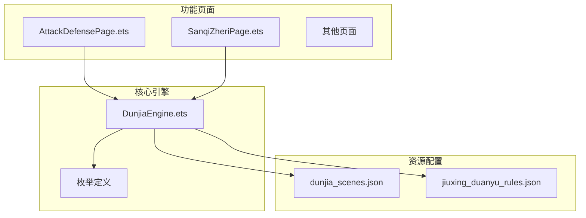
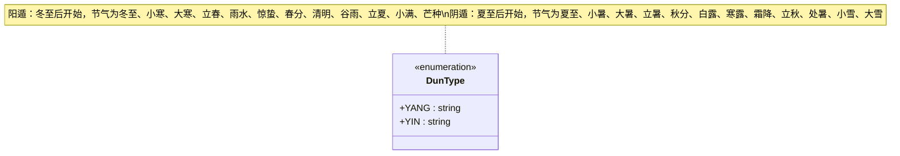
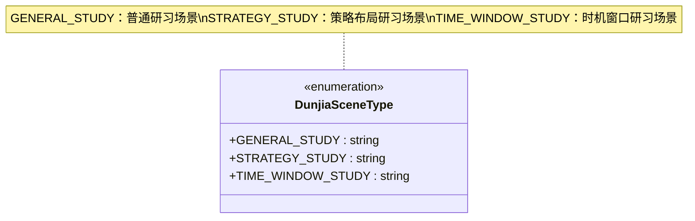
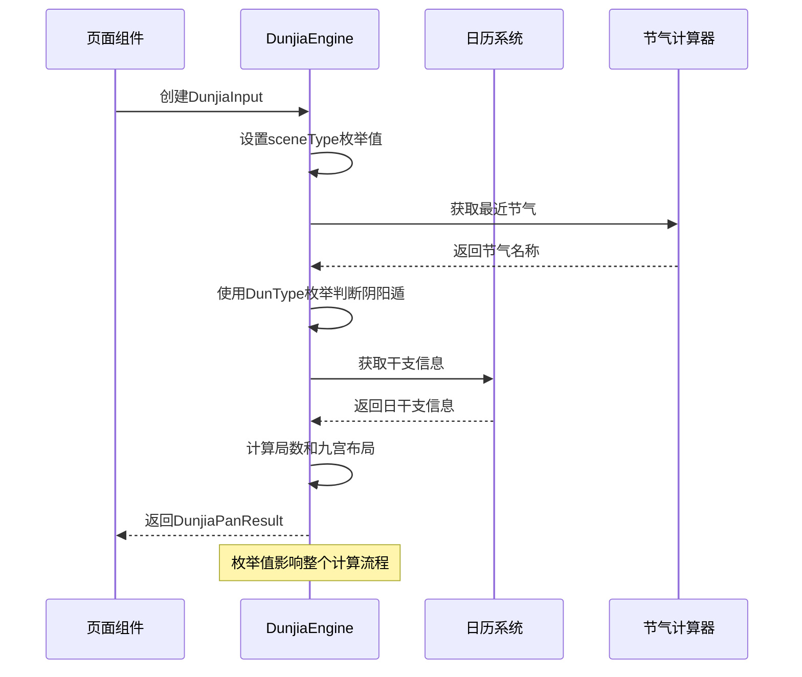
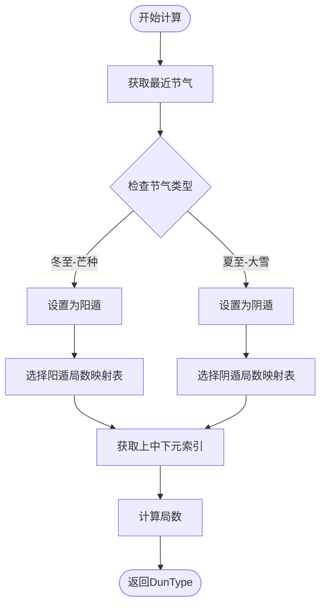
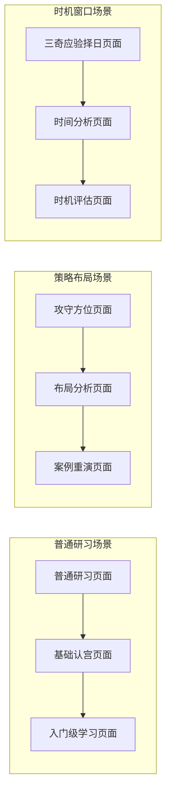
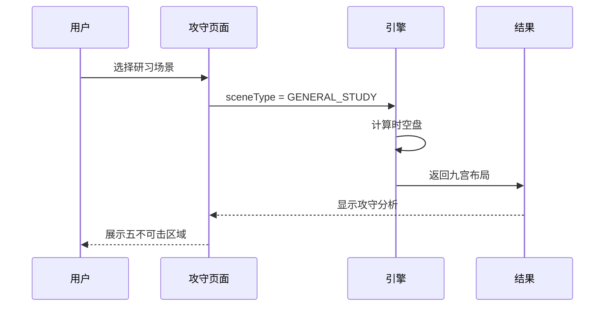
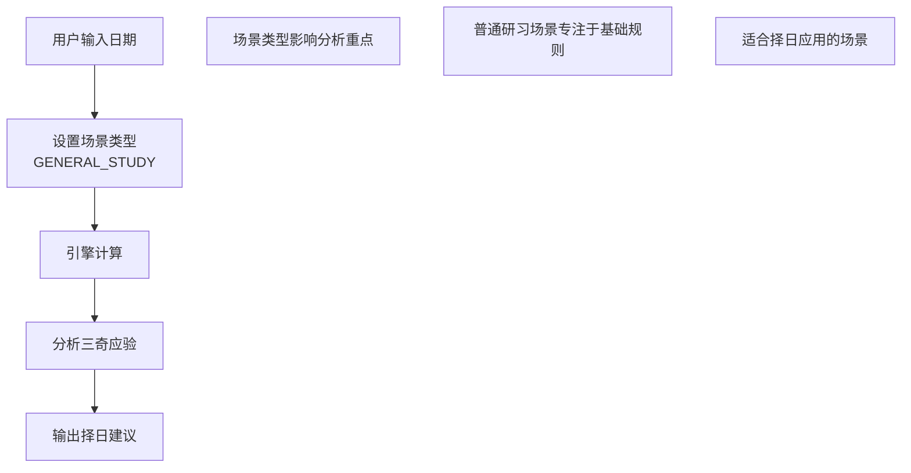
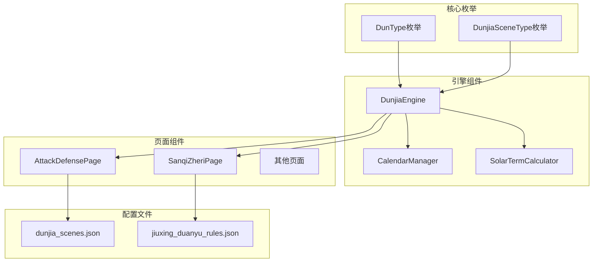
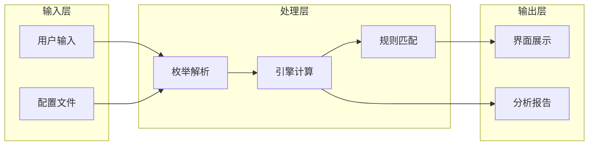

# 枚举类型定义

<cite>
**本文档引用的文件**
- [DunjiaEngine.ets](file://entry/src/main/ets/utils/DunjiaEngine.ets)
- [AttackDefensePage.ets](file://entry/src/main/ets/pages/AttackDefensePage.ets)
- [SanqiZheriPage.ets](file://entry/src/main/ets/pages/SanqiZheriPage.ets)
- [dunjia_scenes.json](file://entry/src/main/resources/rawfile/dunjia_scenes.json)
- [jiuxing_duanyu_rules.json](file://entry/src/main/resources/rawfile/rules/jiuxing_duanyu_rules.json)
</cite>

## 目录
1. [简介](#简介)
2. [项目结构](#项目结构)
3. [核心组件](#核心组件)
4. [架构概览](#架构概览)
5. [详细组件分析](#详细组件分析)
6. [依赖分析](#依赖分析)
7. [性能考虑](#性能考虑)
8. [故障排除指南](#故障排除指南)
9. [结论](#结论)

## 简介

本文档详细介绍了遁甲引擎中的两个核心枚举类型：DunType（阴阳遁类型枚举）和DunjiaSceneType（遁甲场景类型枚举）。这两个枚举类型在遁甲计算中发挥着至关重要的作用，直接影响时空盘的布局和分析结果。

遁甲作为中国古代术数体系的重要组成部分，通过阴阳遁的变化来反映宇宙时空的运行规律。DunType枚举定义了阳遁和阴遁两种基本的时空运行模式，而DunjiaSceneType枚举则为不同的研习场景提供了明确的分类和指导。

## 项目结构

项目采用模块化的架构设计，核心引擎位于utils目录下，各个功能页面分布在pages目录中：

**图表来源**
- [DunjiaEngine.ets](file://entry/src/main/ets/utils/DunjiaEngine.ets#L1-L100)
- [AttackDefensePage.ets](file://entry/src/main/ets/pages/AttackDefensePage.ets#L1-L50)
- [SanqiZheriPage.ets](file://entry/src/main/ets/pages/SanqiZheriPage.ets#L1-L50)

## 核心组件

### DunType枚举（阴阳遁类型）

DunType枚举定义了遁甲中的两种基本时空运行模式：

**图表来源**
- [DunjiaEngine.ets](file://entry/src/main/ets/utils/DunjiaEngine.ets#L7-L10)

### DunjiaSceneType枚举（遁甲场景类型）

DunjiaSceneType枚举为不同的遁甲研习场景提供了明确的分类：

**图表来源**
- [DunjiaEngine.ets](file://entry/src/main/ets/utils/DunjiaEngine.ets#L12-L16)

**章节来源**
- [DunjiaEngine.ets](file://entry/src/main/ets/utils/DunjiaEngine.ets#L1-L100)

## 架构概览

遁甲引擎的架构围绕两个核心枚举展开，形成了完整的时空盘计算和分析体系：

**图表来源**
- [DunjiaEngine.ets](file://entry/src/main/ets/utils/DunjiaEngine.ets#L113-L162)
- [AttackDefensePage.ets](file://entry/src/main/ets/pages/AttackDefensePage.ets#L32-L48)

## 详细组件分析

### DunType枚举的深度分析

#### 阴阳遁的计算逻辑

DunType枚举的计算基于二十四节气系统的精确划分：

**图表来源**
- [DunjiaEngine.ets](file://entry/src/main/ets/utils/DunjiaEngine.ets#L285-L323)

#### 阴阳遁在九宫布局中的应用

阴阳遁类型直接影响九宫的布局方式：

| 阴阳遁类型 | 值符移动方向 | 值使移动方向 | 特殊规则 |
|------------|-------------|-------------|----------|
| 阳遁 | 顺时针 | 顺时针 | 跳过中宫（索引4） |
| 阴遁 | 逆时针 | 逆时针 | 跳过中宫（索引4） |

**章节来源**
- [DunjiaEngine.ets](file://entry/src/main/ets/utils/DunjiaEngine.ets#L206-L246)
- [DunjiaEngine.ets](file://entry/src/main/ets/utils/DunjiaEngine.ets#L429-L462)

### DunjiaSceneType枚举的详细分析

#### 场景类型的具体应用

DunjiaSceneType枚举在不同页面中的具体应用：

**图表来源**
- [AttackDefensePage.ets](file://entry/src/main/ets/pages/AttackDefensePage.ets#L36-L40)
- [SanqiZheriPage.ets](file://entry/src/main/ets/pages/SanqiZheriPage.ets#L121-L125)

#### 场景类型对计算逻辑的影响

不同场景类型会影响引擎的计算重点和输出内容：

**普通研习场景（GENERAL_STUDY）**
- 重点：基础时空结构理解
- 输出：完整的九宫布局和基本规则
- 适用：初学者和基础学习

**策略布局场景（STRATEGY_STUDY）**
- 重点：攻守分析和布局优化
- 输出：五不可击、三吉门等策略信息
- 适用：军事、商业策略分析

**时机窗口场景（TIME_WINDOW_STUDY）**
- 重点：三奇应验和择日分析
- 输出：三奇入墓、天网四张等时机信息
- 适用：重要决策的时间选择

**章节来源**
- [AttackDefensePage.ets](file://entry/src/main/ets/pages/AttackDefensePage.ets#L36-L40)
- [SanqiZheriPage.ets](file://entry/src/main/ets/pages/SanqiZheriPage.ets#L121-L125)

### 枚举在实际业务中的应用示例

#### 攻守方位分析中的应用

在攻守方位页面中，DunjiaSceneType.GENERAL_STUDY确保了基础的时空盘计算：

**图表来源**
- [AttackDefensePage.ets](file://entry/src/main/ets/pages/AttackDefensePage.ets#L32-L48)

#### 三奇应验择日中的应用

在择日页面中，DunjiaSceneType.GENERAL_STUDY支持专门的择日计算：

**图表来源**
- [SanqiZheriPage.ets](file://entry/src/main/ets/pages/SanqiZheriPage.ets#L117-L134)

**章节来源**
- [AttackDefensePage.ets](file://entry/src/main/ets/pages/AttackDefensePage.ets#L32-L48)
- [SanqiZheriPage.ets](file://entry/src/main/ets/pages/SanqiZheriPage.ets#L117-L134)

## 依赖分析

### 枚举与其他组件的关系

**图表来源**
- [DunjiaEngine.ets](file://entry/src/main/ets/utils/DunjiaEngine.ets#L1-L100)
- [AttackDefensePage.ets](file://entry/src/main/ets/pages/AttackDefensePage.ets#L1-L10)
- [SanqiZheriPage.ets](file://entry/src/main/ets/pages/SanqiZheriPage.ets#L1-L5)

### 数据流向分析

**图表来源**
- [DunjiaEngine.ets](file://entry/src/main/ets/utils/DunjiaEngine.ets#L113-L162)
- [dunjia_scenes.json](file://entry/src/main/resources/rawfile/dunjia_scenes.json#L1-L50)

**章节来源**
- [DunjiaEngine.ets](file://entry/src/main/ets/utils/DunjiaEngine.ets#L1-L961)
- [dunjia_scenes.json](file://entry/src/main/resources/rawfile/dunjia_scenes.json#L1-L50)

## 性能考虑

### 枚举使用的性能优势

1. **内存效率**：枚举值使用字符串常量，避免了重复字符串分配
2. **类型安全**：编译时检查，减少运行时错误
3. **访问速度**：枚举值的比较比字符串比较更快

### 优化建议

1. **缓存机制**：对于频繁使用的枚举值，可以考虑添加缓存
2. **批量处理**：在大量数据处理时，优先使用枚举而非字符串比较
3. **避免不必要的转换**：保持枚举值的原始类型，减少类型转换开销

## 故障排除指南

### 常见问题及解决方案

#### 枚举值解析错误

**问题**：场景类型无法正确解析
**解决方案**：
1. 检查枚举值是否正确导入
2. 验证字符串值与枚举定义的一致性
3. 确保使用正确的枚举语法

#### 阴阳遁计算错误

**问题**：阳遁阴遁判断不准确
**解决方案**：
1. 验证节气列表的完整性
2. 检查getYuanIndex方法的逻辑
3. 确认地支与元数的对应关系

#### 场景类型影响分析

**问题**：不同场景类型下的分析结果异常
**解决方案**：
1. 检查场景类型在各页面中的设置
2. 验证场景类型对引擎计算逻辑的影响
3. 确保场景类型与页面功能的匹配

**章节来源**
- [DunjiaEngine.ets](file://entry/src/main/ets/utils/DunjiaEngine.ets#L332-L353)
- [AttackDefensePage.ets](file://entry/src/main/ets/pages/AttackDefensePage.ets#L36-L40)

## 结论

DunType和DunjiaSceneType两个枚举类型在遁甲引擎中发挥着核心作用，它们不仅定义了基本的时空运行模式，还为不同的研习场景提供了明确的指导。通过合理的使用和扩展，这些枚举类型能够帮助开发者构建更加灵活和强大的遁甲分析系统。

在未来的发展中，建议：
1. 保持枚举定义的稳定性，避免频繁修改
2. 添加适当的注释和文档，提高代码可维护性
3. 考虑添加更多的场景类型以适应不同的应用需求
4. 建立完善的测试机制，确保枚举使用的正确性

通过精心设计和合理使用，这些枚举类型将成为遁甲引擎稳定可靠的重要基石。