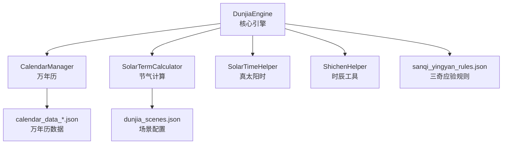
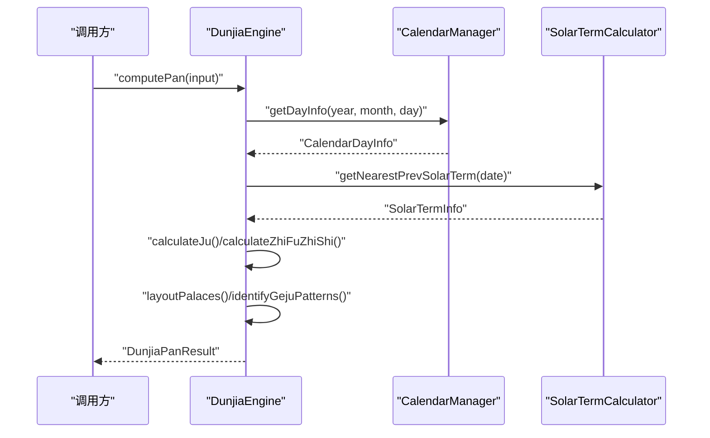
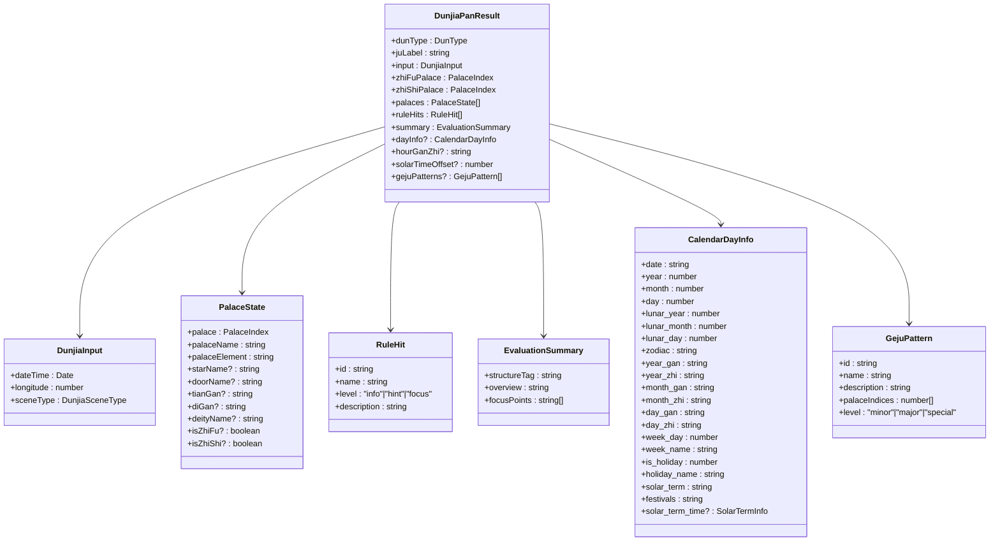
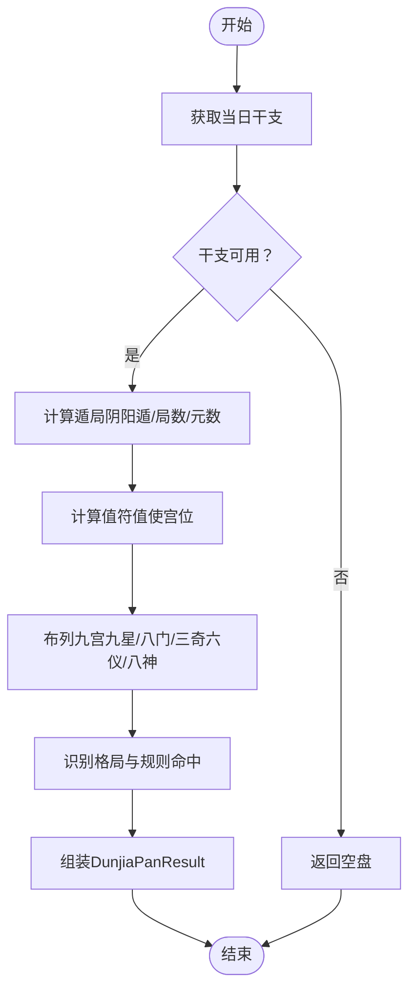
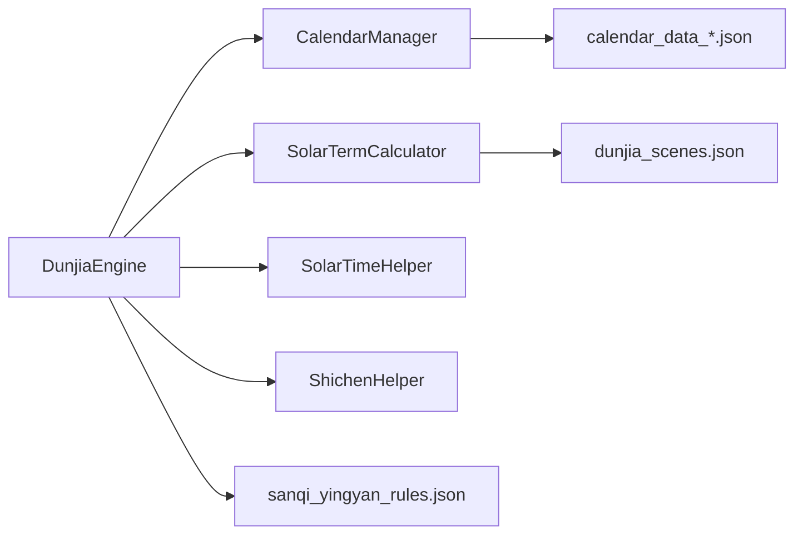

# 核心引擎API

<cite>
**本文引用的文件**
- [DunjiaEngine.ets](file://entry/src/main/ets/utils/DunjiaEngine.ets)
- [CalendarManager.ets](file://entry/src/main/ets/utils/CalendarManager.ets)
- [SolarTermCalculator.ets](file://entry/src/main/ets/utils/SolarTermCalculator.ets)
- [ShichenHelper.ets](file://entry/src/main/ets/utils/ShichenHelper.ets)
- [SolarTimeHelper.ets](file://entry/src/main/ets/utils/SolarTimeHelper.ets)
- [dunjia_scenes.json](file://entry/src/main/resources/rawfile/dunjia_scenes.json)
- [calendar_data_0001.json](file://entry/src/main/resources/rawfile/calendar/calendar_data_0001.json)
- [sanqi_yingyan_rules.json](file://entry/src/main/resources/rawfile/rules/sanqi_yingyan_rules.json)
</cite>

## 目录
1. [简介](#简介)
2. [项目结构](#项目结构)
3. [核心组件](#核心组件)
4. [架构总览](#架构总览)
5. [详细组件分析](#详细组件分析)
6. [依赖关系分析](#依赖关系分析)
7. [性能考量](#性能考量)
8. [故障排查指南](#故障排查指南)
9. [结论](#结论)
10. [附录](#附录)

## 简介
本文件面向使用遁甲时空盘核心引擎的开发者与研习者，系统化梳理DunjiaEngine类的公共API，包括主计算方法computePan()、便捷方法createDefaultInput()，以及输入输出接口DunjiaInput、DunjiaPanResult的字段定义与使用说明。文档同时给出枚举类型DunType、DunjiaSceneType的含义，展示类型定义与接口规范，并提供最佳实践、常见错误处理与性能优化建议。

## 项目结构
该引擎位于entry/src/main/ets/utils目录，围绕“时间-节气-真太阳时-干支-遁局-九宫”链路构建，核心模块如下：
- DunjiaEngine：核心引擎，负责从输入时间与地点计算时空盘与结构化分析
- CalendarManager：万年历数据访问与缓存
- SolarTermCalculator：节气精确时刻计算
- ShichenHelper：十二时辰与日干推导
- SolarTimeHelper：真太阳时与均时差计算

图表来源
- [DunjiaEngine.ets](file://entry/src/main/ets/utils/DunjiaEngine.ets#L1-L961)
- [CalendarManager.ets](file://entry/src/main/ets/utils/CalendarManager.ets#L1-L123)
- [SolarTermCalculator.ets](file://entry/src/main/ets/utils/SolarTermCalculator.ets#L1-L375)
- [ShichenHelper.ets](file://entry/src/main/ets/utils/ShichenHelper.ets#L1-L114)
- [SolarTimeHelper.ets](file://entry/src/main/ets/utils/SolarTimeHelper.ets#L1-L270)
- [dunjia_scenes.json](file://entry/src/main/resources/rawfile/dunjia_scenes.json#L1-L50)
- [calendar_data_0001.json](file://entry/src/main/resources/rawfile/calendar/calendar_data_0001.json#L1-L800)
- [sanqi_yingyan_rules.json](file://entry/src/main/resources/rawfile/rules/sanqi_yingyan_rules.json#L1-L525)

章节来源
- [DunjiaEngine.ets](file://entry/src/main/ets/utils/DunjiaEngine.ets#L1-L961)
- [CalendarManager.ets](file://entry/src/main/ets/utils/CalendarManager.ets#L1-L123)
- [SolarTermCalculator.ets](file://entry/src/main/ets/utils/SolarTermCalculator.ets#L1-L375)
- [ShichenHelper.ets](file://entry/src/main/ets/utils/ShichenHelper.ets#L1-L114)
- [SolarTimeHelper.ets](file://entry/src/main/ets/utils/SolarTimeHelper.ets#L1-L270)
- [dunjia_scenes.json](file://entry/src/main/resources/rawfile/dunjia_scenes.json#L1-L50)
- [calendar_data_0001.json](file://entry/src/main/resources/rawfile/calendar/calendar_data_0001.json#L1-L800)
- [sanqi_yingyan_rules.json](file://entry/src/main/resources/rawfile/rules/sanqi_yingyan_rules.json#L1-L525)

## 核心组件
- DunjiaEngine：单例核心引擎，提供computePan()主计算方法与createDefaultInput()便捷方法
- 输入接口DunjiaInput：包含公历时间、地理经度、研习场景类型
- 输出接口DunjiaPanResult：包含遁类型、局数、值符值使、九宫状态、规则命中、结构评估、干支与真太阳时等
- 枚举DunType、DunjiaSceneType：阴阳遁与研习场景类型
- 内部类型：JuInfo、HourGanZhi、ZhiFuZhiShiInfo等

章节来源
- [DunjiaEngine.ets](file://entry/src/main/ets/utils/DunjiaEngine.ets#L7-L16)
- [DunjiaEngine.ets](file://entry/src/main/ets/utils/DunjiaEngine.ets#L21-L84)
- [DunjiaEngine.ets](file://entry/src/main/ets/utils/DunjiaEngine.ets#L942-L961)

## 架构总览
DunjiaEngine的计算流程以“时间-节气-遁局-九宫”为主线，结合CalendarManager与SolarTermCalculator获取干支与节气，再按《遁甲符应经》规则布列九宫要素（九星、八门、三奇六仪、八神），并识别格局与规则命中，最终输出结构化结果。

图表来源
- [DunjiaEngine.ets](file://entry/src/main/ets/utils/DunjiaEngine.ets#L113-L162)
- [CalendarManager.ets](file://entry/src/main/ets/utils/CalendarManager.ets#L51-L92)
- [SolarTermCalculator.ets](file://entry/src/main/ets/utils/SolarTermCalculator.ets#L143-L159)

## 详细组件分析

### DunjiaEngine类与公共API

- 单例获取
  - getInstance()：返回DunjiaEngine单例实例
  - 章节来源：[DunjiaEngine.ets](file://entry/src/main/ets/utils/DunjiaEngine.ets#L103-L108)

- 主计算方法：computePan(input)
  - 参数
    - input: DunjiaInput
  - 返回值
    - Promise<DunjiaPanResult>
  - 行为概述
    - 获取当日干支信息
    - 计算遁局（阴阳遁、局数、元数）
    - 计算值符值使宫位
    - 布列九宫（九星、八门、三奇六仪、八神）
    - 生成规则命中与结构评估
    - 识别格局（三奇得使、三遁、三奇合、伏吟、反吹、青龙返首、飞鸟跌穴、三奇入墓、六仪击刑、太白入荧惑、荧惑入太白、天网四张等）
    - 返回包含干支、真太阳时偏移、格局列表的结果
  - 章节来源：[DunjiaEngine.ets](file://entry/src/main/ets/utils/DunjiaEngine.ets#L113-L162)

- 便捷方法：createDefaultInput(dateTime, longitude)
  - 参数
    - dateTime: Date
    - longitude: number（经度，东经为正）
  - 返回值
    - DunjiaInput（sceneType默认GENERAL_STUDY）
  - 使用场景
    - 快速从当前时间生成默认输入，便于“从当前日期进入时空盘”
  - 章节来源：[DunjiaEngine.ets](file://entry/src/main/ets/utils/DunjiaEngine.ets#L645-L651)

- 内部算法要点（与computePan配合）
  - getDayGanZhi(date)：通过CalendarManager获取当日干支信息
  - calculateJu(date, dayInfo)：根据节气与日干支确定遁局
  - calculateZhiFuZhiShi(ju, hourGanZhi)：计算值符值使宫位
  - layoutPalaces(ju, date, dayInfo, hourGanZhi)：布列九宫要素
  - identifyGejuPatterns(...)：识别多种格局
  - createEmptyPan(input)：干支信息缺失时返回空盘
  - calculateSolarTimeOffset(longitude)：计算真太阳时偏移（分钟）
  - 章节来源：[DunjiaEngine.ets](file://entry/src/main/ets/utils/DunjiaEngine.ets#L169-L661)

- 输入接口：DunjiaInput
  - 字段
    - dateTime: Date（建议使用真太阳时校正后的时间）
    - longitude: number（地理经度，用于真太阳时与节气研习，东经为正）
    - sceneType: DunjiaSceneType（研习场景类型）
  - 章节来源：[DunjiaEngine.ets](file://entry/src/main/ets/utils/DunjiaEngine.ets#L21-L28)

- 输出接口：DunjiaPanResult
  - 字段
    - dunType: DunType（阳遁/阴遁）
    - juLabel: string（局数标签，如“阳遁上元三局”）
    - input: DunjiaInput（原始输入）
    - zhiFuPalace: PalaceIndex（值符所在宫）
    - zhiShiPalace: PalaceIndex（值使所在宫）
    - palaces: PalaceState[]（九宫状态）
    - ruleHits: RuleHit[]（规则命中列表）
    - summary: EvaluationSummary（整体结构评估）
    - dayInfo?: CalendarDayInfo（当日干支信息，含农历）
    - hourGanZhi?: string（时辰干支）
    - solarTimeOffset?: number（真太阳时偏移量，分钟）
    - gejuPatterns?: GejuPattern[]（识别到的格局列表）
  - 章节来源：[DunjiaEngine.ets](file://entry/src/main/ets/utils/DunjiaEngine.ets#L59-L84)

- 内部类型与枚举
  - 枚举
    - DunType: YANG, YIN
    - DunjiaSceneType: GENERAL_STUDY, STRATEGY_STUDY, TIME_WINDOW_STUDY
  - 类型
    - PalaceIndex: number（0-8，对应九宫）
    - PalaceState、RuleHit、EvaluationSummary、GejuPattern等
  - 章节来源：[DunjiaEngine.ets](file://entry/src/main/ets/utils/DunjiaEngine.ets#L7-L16)
  - 章节来源：[DunjiaEngine.ets](file://entry/src/main/ets/utils/DunjiaEngine.ets#L30-L95)

- 时干与时支内部类型
  - HourGanZhi：包含时干、时支、索引
  - ZhiFuZhiShiInfo：值符值使宫位
  - 章节来源：[DunjiaEngine.ets](file://entry/src/main/ets/utils/DunjiaEngine.ets#L950-L961)

- 与辅助工具的关系
  - CalendarManager：提供当日干支信息
  - SolarTermCalculator：提供节气精确时刻与最近前一个节气
  - ShichenHelper：提供时辰基础信息与日干推导
  - SolarTimeHelper：提供真太阳时与均时差
  - 章节来源：[DunjiaEngine.ets](file://entry/src/main/ets/utils/DunjiaEngine.ets#L4-L5)
  - 章节来源：[CalendarManager.ets](file://entry/src/main/ets/utils/CalendarManager.ets#L1-L123)
  - 章节来源：[SolarTermCalculator.ets](file://entry/src/main/ets/utils/SolarTermCalculator.ets#L1-L375)
  - 章节来源：[ShichenHelper.ets](file://entry/src/main/ets/utils/ShichenHelper.ets#L1-L114)
  - 章节来源：[SolarTimeHelper.ets](file://entry/src/main/ets/utils/SolarTimeHelper.ets#L1-L270)

### 数据模型与字段说明

图表来源
- [DunjiaEngine.ets](file://entry/src/main/ets/utils/DunjiaEngine.ets#L21-L95)
- [CalendarManager.ets](file://entry/src/main/ets/utils/CalendarManager.ets#L5-L28)

章节来源
- [DunjiaEngine.ets](file://entry/src/main/ets/utils/DunjiaEngine.ets#L21-L95)
- [CalendarManager.ets](file://entry/src/main/ets/utils/CalendarManager.ets#L5-L28)

### 使用示例与最佳实践

- 示例1：从当前时间生成默认输入并计算盘面
  - 步骤
    - 调用createDefaultInput(dateTime, longitude)生成DunjiaInput
    - 调用computePan(input)获取DunjiaPanResult
  - 注意
    - longitude建议使用城市经度或用户自定义经度（东经为正）
    - 若computePan返回空盘（干支信息缺失），需提示用户或回退策略
  - 章节来源：[DunjiaEngine.ets](file://entry/src/main/ets/utils/DunjiaEngine.ets#L645-L651)
  - 章节来源：[DunjiaEngine.ets](file://entry/src/main/ets/utils/DunjiaEngine.ets#L113-L162)

- 示例2：结合真太阳时偏移
  - 通过solarTimeOffset字段了解真太阳时与本地时间的偏差（分钟）
  - 章节来源：[DunjiaEngine.ets](file://entry/src/main/ets/utils/DunjiaEngine.ets#L658-L661)

- 示例3：识别格局与规则命中
  - gejuPatterns包含识别到的格局（如三奇得使、三遁、青龙返首等）
  - ruleHits包含规则命中（用于UI呈现权重）
  - 章节来源：[DunjiaEngine.ets](file://entry/src/main/ets/utils/DunjiaEngine.ets#L678-L936)

- 示例4：研习场景类型
  - DunjiaSceneType.GENERAL_STUDY：普通研习
  - DunjiaSceneType.STRATEGY_STUDY：布局/局势类研习
  - DunjiaSceneType.TIME_WINDOW_STUDY：时机窗口研习
  - 章节来源：[DunjiaEngine.ets](file://entry/src/main/ets/utils/DunjiaEngine.ets#L12-L16)

### 关键算法流程

- 值符值使计算（时干与时支联动）
  - 值符：随“时干”在遁局宫位上顺/逆飞（跳过中宫）
  - 值使：随“时支”在固定八门盘上顺/逆飞（跳过中宫）
  - 章节来源：[DunjiaEngine.ets](file://entry/src/main/ets/utils/DunjiaEngine.ets#L206-L246)
  - 章节来源：[DunjiaEngine.ets](file://entry/src/main/ets/utils/DunjiaEngine.ets#L429-L462)

- 三奇六仪布局（天盘/地盘）
  - 天盘（暗干）：阳遁顺布六仪逆布三奇，阴遁逆布六仪顺布三奇
  - 地盘（明干）：固定布局（跳过中宫）
  - 章节来源：[DunjiaEngine.ets](file://entry/src/main/ets/utils/DunjiaEngine.ets#L470-L556)

- 八神布局（九天、九地、太阴、六合等）
  - 依据值符宫位顺逆飞布列
  - 章节来源：[DunjiaEngine.ets](file://entry/src/main/ets/utils/DunjiaEngine.ets#L561-L601)

- 识别格局（简化版）
  - 三奇得使、三遁（天遁/地遁/人遁）、三奇合、伏吟、反吹、青龙返首、飞鸟跌穴、三奇入墓、六仪击刑、太白入荧惑、荧惑入太白、天网四张
  - 章节来源：[DunjiaEngine.ets](file://entry/src/main/ets/utils/DunjiaEngine.ets#L678-L936)

图表来源
- [DunjiaEngine.ets](file://entry/src/main/ets/utils/DunjiaEngine.ets#L113-L162)
- [DunjiaEngine.ets](file://entry/src/main/ets/utils/DunjiaEngine.ets#L256-L281)
- [DunjiaEngine.ets](file://entry/src/main/ets/utils/DunjiaEngine.ets#L206-L246)
- [DunjiaEngine.ets](file://entry/src/main/ets/utils/DunjiaEngine.ets#L358-L389)
- [DunjiaEngine.ets](file://entry/src/main/ets/utils/DunjiaEngine.ets#L678-L936)

## 依赖关系分析

图表来源
- [DunjiaEngine.ets](file://entry/src/main/ets/utils/DunjiaEngine.ets#L4-L5)
- [CalendarManager.ets](file://entry/src/main/ets/utils/CalendarManager.ets#L1-L123)
- [SolarTermCalculator.ets](file://entry/src/main/ets/utils/SolarTermCalculator.ets#L1-L375)
- [ShichenHelper.ets](file://entry/src/main/ets/utils/ShichenHelper.ets#L1-L114)
- [SolarTimeHelper.ets](file://entry/src/main/ets/utils/SolarTimeHelper.ets#L1-L270)
- [dunjia_scenes.json](file://entry/src/main/resources/rawfile/dunjia_scenes.json#L1-L50)
- [calendar_data_0001.json](file://entry/src/main/resources/rawfile/calendar/calendar_data_0001.json#L1-L800)
- [sanqi_yingyan_rules.json](file://entry/src/main/resources/rawfile/rules/sanqi_yingyan_rules.json#L1-L525)

章节来源
- [DunjiaEngine.ets](file://entry/src/main/ets/utils/DunjiaEngine.ets#L4-L5)
- [CalendarManager.ets](file://entry/src/main/ets/utils/CalendarManager.ets#L1-L123)
- [SolarTermCalculator.ets](file://entry/src/main/ets/utils/SolarTermCalculator.ets#L1-L375)
- [ShichenHelper.ets](file://entry/src/main/ets/utils/ShichenHelper.ets#L1-L114)
- [SolarTimeHelper.ets](file://entry/src/main/ets/utils/SolarTimeHelper.ets#L1-L270)
- [dunjia_scenes.json](file://entry/src/main/resources/rawfile/dunjia_scenes.json#L1-L50)
- [calendar_data_0001.json](file://entry/src/main/resources/rawfile/calendar/calendar_data_0001.json#L1-L800)
- [sanqi_yingyan_rules.json](file://entry/src/main/resources/rawfile/rules/sanqi_yingyan_rules.json#L1-L525)

## 性能考量
- 数据缓存
  - SolarTermCalculator使用Map缓存年份节气结果，避免重复计算
  - CalendarManager按年份文件缓存calendar_data_*.json，减少IO
  - 章节来源：[SolarTermCalculator.ets](file://entry/src/main/ets/utils/SolarTermCalculator.ets#L32-L86)
  - 章节来源：[CalendarManager.ets](file://entry/src/main/ets/utils/CalendarManager.ets#L33-L69)
- 异步加载
  - computePan为异步方法，涉及CalendarManager与SolarTermCalculator的异步调用，建议在UI层做好loading与错误提示
  - 章节来源：[DunjiaEngine.ets](file://entry/src/main/ets/utils/DunjiaEngine.ets#L113-L162)
- 算法复杂度
  - 布列九宫与识别格局为O(1)（固定九宫），整体计算受节气与干支查询影响
  - 章节来源：[DunjiaEngine.ets](file://entry/src/main/ets/utils/DunjiaEngine.ets#L358-L389)
  - 章节来源：[DunjiaEngine.ets](file://entry/src/main/ets/utils/DunjiaEngine.ets#L678-L936)

## 故障排查指南
- 干支信息缺失
  - 现象：computePan返回空盘（zhiFuPalace/zhiShiPalace占位，palaces为空）
  - 处理：检查CalendarManager初始化与context，确认日期范围与文件加载
  - 章节来源：[DunjiaEngine.ets](file://entry/src/main/ets/utils/DunjiaEngine.ets#L247-L250)
  - 章节来源：[DunjiaEngine.ets](file://entry/src/main/ets/utils/DunjiaEngine.ets#L613-L639)
  - 章节来源：[CalendarManager.ets](file://entry/src/main/ets/utils/CalendarManager.ets#L51-L92)
- 节气计算异常
  - 现象：无法确定遁局或局数
  - 处理：确认SolarTermCalculator.getNearestPrevSolarTerm(date)返回有效节气
  - 章节来源：[DunjiaEngine.ets](file://entry/src/main/ets/utils/DunjiaEngine.ets#L258-L260)
  - 章节来源：[SolarTermCalculator.ets](file://entry/src/main/ets/utils/SolarTermCalculator.ets#L143-L159)
- 真太阳时偏移
  - 现象：solarTimeOffset为undefined或异常
  - 处理：确认longitude传入正确（东经为正），检查calculateSolarTimeOffset逻辑
  - 章节来源：[DunjiaEngine.ets](file://entry/src/main/ets/utils/DunjiaEngine.ets#L658-L661)
- 格局识别不完整
  - 现象：gejuPatterns为空或不完整
  - 处理：确认identifyGejuPatterns分支逻辑与输入数据（palaces、dayInfo、hourGanZhi）
  - 章节来源：[DunjiaEngine.ets](file://entry/src/main/ets/utils/DunjiaEngine.ets#L678-L936)

## 结论
DunjiaEngine提供了从时间、地点到遁甲时空盘的完整计算链路，具备良好的扩展性与结构化输出。通过DunjiaInput与DunjiaPanResult的清晰接口，结合枚举与内部类型，能够满足从入门到进阶的多种研习需求。建议在实际使用中关注数据缓存、异步加载与错误处理，确保用户体验与结果稳定性。

## 附录

### 类型与接口定义摘要
- 枚举
  - DunType: YANG, YIN
  - DunjiaSceneType: GENERAL_STUDY, STRATEGY_STUDY, TIME_WINDOW_STUDY
- 接口
  - DunjiaInput：dateTime, longitude, sceneType
  - DunjiaPanResult：dunType, juLabel, input, zhiFuPalace, zhiShiPalace, palaces, ruleHits, summary, dayInfo, hourGanZhi, solarTimeOffset, gejuPatterns
  - PalaceState：palace, palaceName, palaceElement, starName, doorName, tianGan, diGan, deityName, isZhiFu, isZhiShi
  - RuleHit：id, name, level, description
  - EvaluationSummary：structureTag, overview, focusPoints
  - GejuPattern：id, name, description, palaceIndices, level
  - CalendarDayInfo：日期、干支、农历、节日、节气等
- 章节来源：[DunjiaEngine.ets](file://entry/src/main/ets/utils/DunjiaEngine.ets#L7-L16)
- 章节来源：[DunjiaEngine.ets](file://entry/src/main/ets/utils/DunjiaEngine.ets#L21-L95)
- 章节来源：[CalendarManager.ets](file://entry/src/main/ets/utils/CalendarManager.ets#L5-L28)

### 使用限制与注意事项
- 时间精度：建议使用真太阳时校正后的时间，以提高节气与遁局判定准确性
- 经度：longitude必须为十进制度数（东经为正），否则真太阳时偏移计算会错误
- 数据范围：CalendarManager支持1900-2060年的干支数据，超出范围将返回null
- 章节来源：[DunjiaEngine.ets](file://entry/src/main/ets/utils/DunjiaEngine.ets#L658-L661)
- 章节来源：[CalendarManager.ets](file://entry/src/main/ets/utils/CalendarManager.ets#L94-L109)