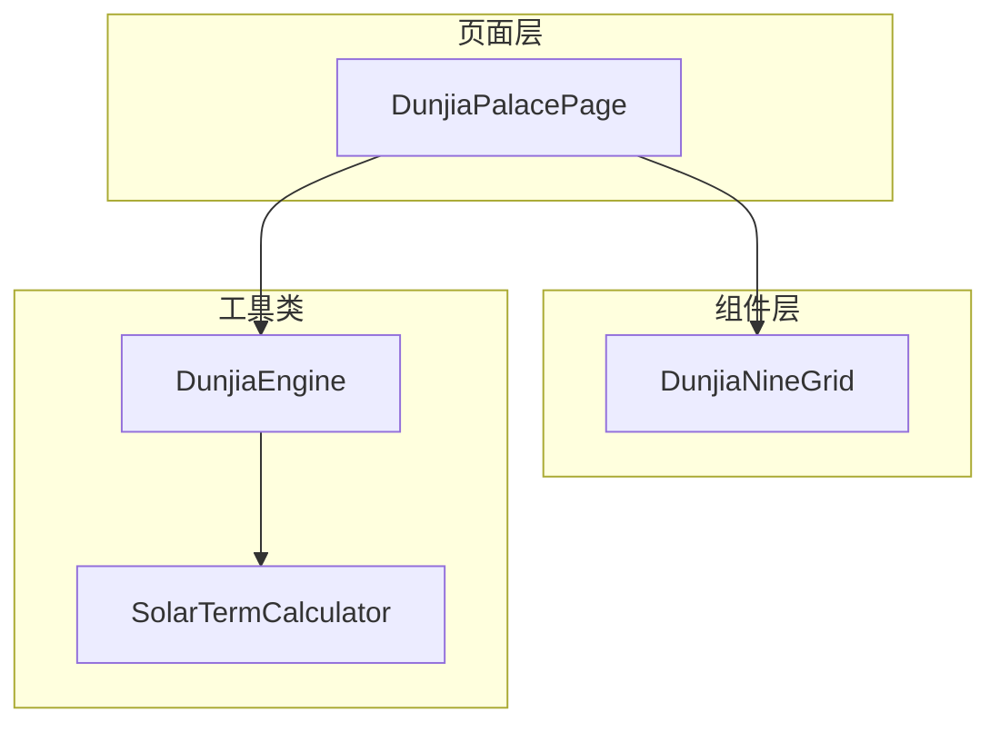
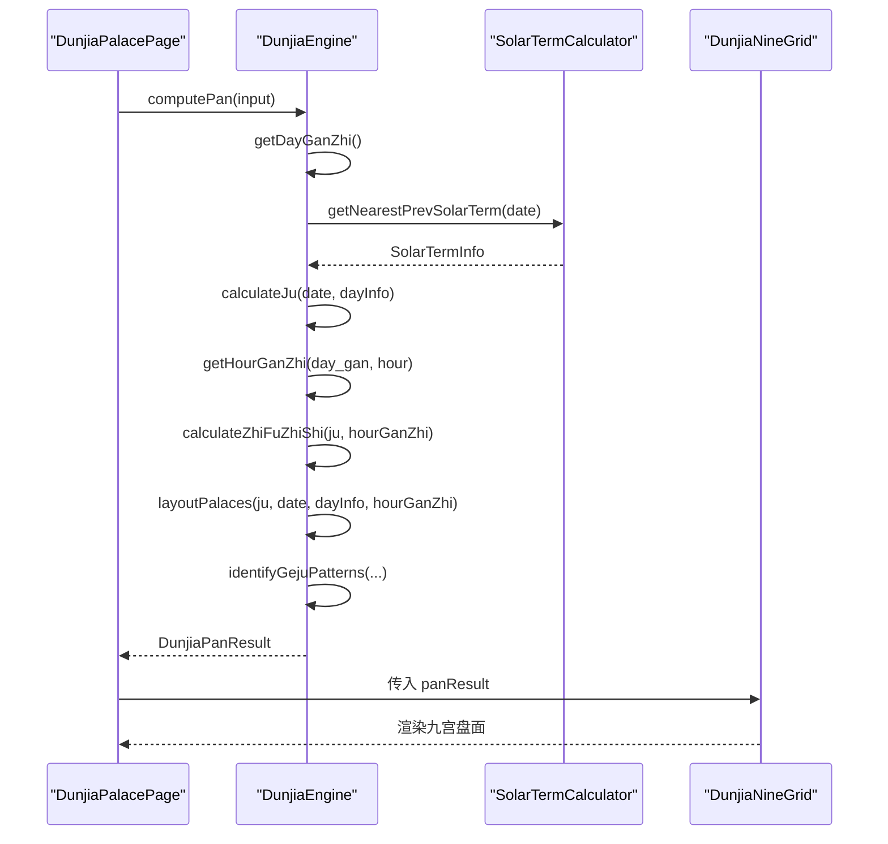
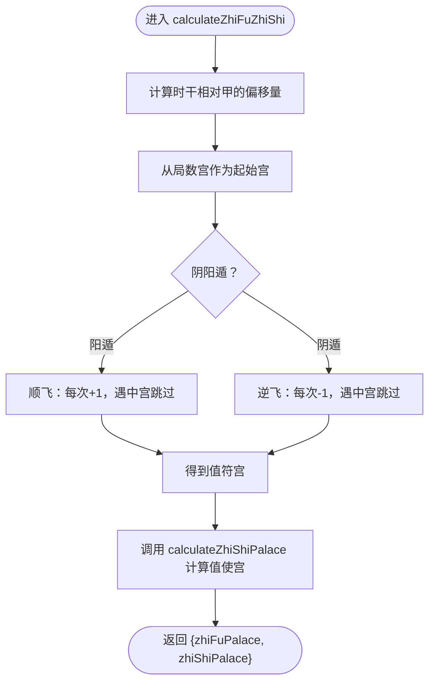
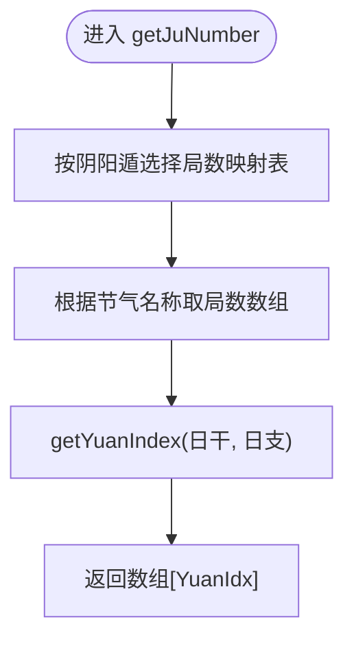
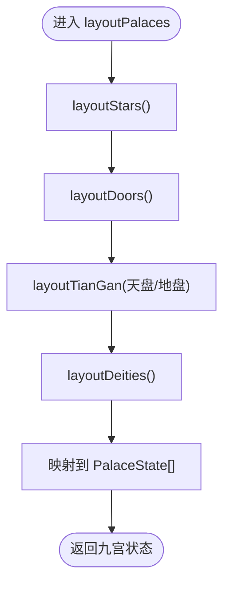
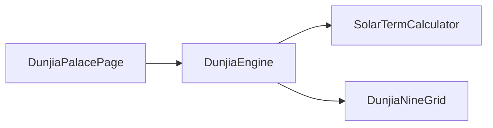

# 算法组件实现

<cite>
**本文引用的文件**
- [DunjiaEngine.ets](file://entry/src/main/ets/utils/DunjiaEngine.ets)
- [DunjiaNineGrid.ets](file://entry/src/main/ets/components/DunjiaNineGrid.ets)
- [SolarTermCalculator.ets](file://entry/src/main/ets/utils/SolarTermCalculator.ets)
- [DunjiaPalacePage.ets](file://entry/src/main/ets/pages/DunjiaPalacePage.ets)
- [LocalUnit.test.ets](file://entry/src/test/LocalUnit.test.ets)
- [真太阳时讲解.md](file://entry/src/main/resources/rawfile/真太阳时讲解.md)
- [万年历json数据文件解读.md](file://entry/src/main/resources/rawfile/万年历json数据文件解读.md)
</cite>

## 目录
1. [简介](#简介)
2. [项目结构](#项目结构)
3. [核心组件](#核心组件)
4. [架构总览](#架构总览)
5. [详细组件分析](#详细组件分析)
6. [依赖分析](#依赖分析)
7. [性能考虑](#性能考虑)
8. [故障排查指南](#故障排查指南)
9. [结论](#结论)
10. [附录](#附录)

## 简介
本文件面向算法实现与工程实践，系统梳理遁甲排盘算法组件的实现细节，重点覆盖：
- 九宫布局算法：layoutPalaces()主布局函数及其子布局方法 layoutStars()、layoutDoors()、layoutTianGan()、layoutDeities()
- 值符值使计算：calculateZhiFuZhiShi()核心算法，含飞宫规则与中宫跳过机制
- 局数计算：getJuNumber()节气映射逻辑与上中下元判定
- 性能与复杂度分析
- 调试与测试方法

## 项目结构
本项目采用“页面-组件-工具类”分层组织，算法核心位于工具类，界面层通过组件渲染与交互驱动算法执行。

图表来源
- [DunjiaPalacePage.ets](file://entry/src/main/ets/pages/DunjiaPalacePage.ets#L1-L120)
- [DunjiaNineGrid.ets](file://entry/src/main/ets/components/DunjiaNineGrid.ets#L1-L40)
- [DunjiaEngine.ets](file://entry/src/main/ets/utils/DunjiaEngine.ets#L1-L120)
- [SolarTermCalculator.ets](file://entry/src/main/ets/utils/SolarTermCalculator.ets#L1-L60)

章节来源
- [DunjiaPalacePage.ets](file://entry/src/main/ets/pages/DunjiaPalacePage.ets#L1-L120)
- [DunjiaNineGrid.ets](file://entry/src/main/ets/components/DunjiaNineGrid.ets#L1-L40)
- [DunjiaEngine.ets](file://entry/src/main/ets/utils/DunjiaEngine.ets#L1-L120)
- [SolarTermCalculator.ets](file://entry/src/main/ets/utils/SolarTermCalculator.ets#L1-L60)

## 核心组件
- DunjiaEngine：核心引擎，负责从输入时间与地点推导遁甲时空盘，包含值符值使计算、局数计算、九宫布局与格局识别。
- DunjiaNineGrid：九宫格展示组件，承载九宫盘面与时间、局数信息的可视化。
- SolarTermCalculator：节气精确时刻计算器，为局数与阴阳遁判定提供依据。

章节来源
- [DunjiaEngine.ets](file://entry/src/main/ets/utils/DunjiaEngine.ets#L98-L162)
- [DunjiaNineGrid.ets](file://entry/src/main/ets/components/DunjiaNineGrid.ets#L1-L40)
- [SolarTermCalculator.ets](file://entry/src/main/ets/utils/SolarTermCalculator.ets#L30-L52)

## 架构总览
算法执行主流程如下：页面接收时间输入，调用引擎计算，引擎完成干支、局数、值符值使、九宫布局与格局识别，最终由组件渲染展示。

图表来源
- [DunjiaPalacePage.ets](file://entry/src/main/ets/pages/DunjiaPalacePage.ets#L218-L236)
- [DunjiaEngine.ets](file://entry/src/main/ets/utils/DunjiaEngine.ets#L113-L162)
- [SolarTermCalculator.ets](file://entry/src/main/ets/utils/SolarTermCalculator.ets#L143-L159)

## 详细组件分析

### 值符值使计算：calculateZhiFuZhiShi()
- 输入：局数信息 ju 与时辰干支 hourGanZhi
- 输出：值符宫与值使宫索引
- 关键点：
  - 值符：按“时干相对甲的偏移量”从“局数宫”出发，按阴阳遁顺逆飞，跳过中宫（索引4）
  - 值使：按“时支”确定起始门（阳遁从休门一宫顺飞，阴遁从景门九宫逆飞），同样跳过中宫

图表来源
- [DunjiaEngine.ets](file://entry/src/main/ets/utils/DunjiaEngine.ets#L206-L246)
- [DunjiaEngine.ets](file://entry/src/main/ets/utils/DunjiaEngine.ets#L429-L462)

章节来源
- [DunjiaEngine.ets](file://entry/src/main/ets/utils/DunjiaEngine.ets#L206-L246)
- [DunjiaEngine.ets](file://entry/src/main/ets/utils/DunjiaEngine.ets#L429-L462)

### 值使宫计算：calculateZhiShiPalace()
- 起点：阳遁从一宫（休门），阴遁从九宫（景门）
- 步进：按“时干索引”进行飞宫，遇中宫跳过
- 返回：值使宫索引

章节来源
- [DunjiaEngine.ets](file://entry/src/main/ets/utils/DunjiaEngine.ets#L429-L462)

### 局数计算：getJuNumber()
- 输入：节气名称 solarTermName、当日干支 dayInfo、阴阳遁类型 dunType
- 规则：
  - 阳遁/阴遁分别维护局数映射表
  - 按“甲己日”地支“仲孟季”判断上中下元索引
  - 返回对应节气与元数交叉的局数

图表来源
- [DunjiaEngine.ets](file://entry/src/main/ets/utils/DunjiaEngine.ets#L294-L323)
- [DunjiaEngine.ets](file://entry/src/main/ets/utils/DunjiaEngine.ets#L332-L353)

章节来源
- [DunjiaEngine.ets](file://entry/src/main/ets/utils/DunjiaEngine.ets#L294-L323)
- [DunjiaEngine.ets](file://entry/src/main/ets/utils/DunjiaEngine.ets#L332-L353)

### 九宫布局：layoutPalaces()
- 主布局函数，串联各子布局：
  - layoutStars()：九星固定对应九宫（地盘）
  - layoutDoors()：八门固定对应九宫（地盘）
  - layoutTianGan()：天盘/地盘天干（三奇六仪）
  - layoutDeities()：八神（九天、九地、太阴、六合等）

图表来源
- [DunjiaEngine.ets](file://entry/src/main/ets/utils/DunjiaEngine.ets#L358-L389)

章节来源
- [DunjiaEngine.ets](file://entry/src/main/ets/utils/DunjiaEngine.ets#L358-L389)

### 九星布局：layoutStars()
- 九星固定对应九宫，不随局数飞布
- 顺序：天蓬一宫、天芮二宫、…、天英九宫

章节来源
- [DunjiaEngine.ets](file://entry/src/main/ets/utils/DunjiaEngine.ets#L397-L402)

### 八门布局：layoutDoors()
- 八门固定对应九宫（地盘），中宫无门
- 顺序：休门一宫、死门二宫、伤门三宫、杜门四宫、开门六宫、惊门七宫、生门八宫、景门九宫

章节来源
- [DunjiaEngine.ets](file://entry/src/main/ets/utils/DunjiaEngine.ets#L413-L418)

### 三奇六仪布局：layoutTianGan()
- 天盘（暗干）：
  - 阳遁：顺布六仪逆布三奇
  - 阴遁：逆布六仪顺布三奇
  - 起点：局数宫；飞宫规则：遇中宫跳过
- 地盘（明干）：固定布局（跳过中宫），九宫同时出现“乙/丙”时，地盘特殊处理

章节来源
- [DunjiaEngine.ets](file://entry/src/main/ets/utils/DunjiaEngine.ets#L470-L556)

### 八神布局：layoutDeities()
- 以值符宫为中心，按阴阳遁规则布置九天、九地、太阴、六合等
- 中宫固定为天禽

章节来源
- [DunjiaEngine.ets](file://entry/src/main/ets/utils/DunjiaEngine.ets#L561-L601)

### 页面与组件集成
- 页面负责加载规则、构建输入、调用引擎并渲染结果
- 组件负责九宫盘面与时间、局数信息的可视化

章节来源
- [DunjiaPalacePage.ets](file://entry/src/main/ets/pages/DunjiaPalacePage.ets#L218-L236)
- [DunjiaNineGrid.ets](file://entry/src/main/ets/components/DunjiaNineGrid.ets#L72-L177)

## 依赖分析
- DunjiaEngine 依赖 SolarTermCalculator 获取节气信息，用于局数与阴阳遁判定
- 页面通过 DunjiaEngine 计算结果驱动 DunjiaNineGrid 渲染

图表来源
- [DunjiaPalacePage.ets](file://entry/src/main/ets/pages/DunjiaPalacePage.ets#L218-L236)
- [DunjiaEngine.ets](file://entry/src/main/ets/utils/DunjiaEngine.ets#L113-L162)
- [SolarTermCalculator.ets](file://entry/src/main/ets/utils/SolarTermCalculator.ets#L143-L159)

章节来源
- [DunjiaPalacePage.ets](file://entry/src/main/ets/pages/DunjiaPalacePage.ets#L218-L236)
- [DunjiaEngine.ets](file://entry/src/main/ets/utils/DunjiaEngine.ets#L113-L162)
- [SolarTermCalculator.ets](file://entry/src/main/ets/utils/SolarTermCalculator.ets#L143-L159)

## 性能考虑
- 计算路径
  - 值符值使：O(1)（飞宫次数由时干偏移量决定，最多9次，且含中宫跳过）
  - 局数计算：O(1)（查表与常量分支）
  - 九宫布局：O(1)（固定长度9，固定循环次数）
  - 节气计算：O(1)（缓存机制，按年份预热）
- 缓存策略
  - SolarTermCalculator 按年份缓存节气时刻
  - CalendarManager 按文件缓存万年历数据
- 实时性
  - 真太阳时计算：单次 < 1ms
  - 节气计算：单次 < 50ms（牛顿迭代5次）
- 建议
  - 在高频切换时间/经度时，优先复用已计算结果
  - 对节气与干支数据进行本地缓存，避免重复IO

章节来源
- [DunjiaEngine.ets](file://entry/src/main/ets/utils/DunjiaEngine.ets#L206-L246)
- [DunjiaEngine.ets](file://entry/src/main/ets/utils/DunjiaEngine.ets#L294-L323)
- [DunjiaEngine.ets](file://entry/src/main/ets/utils/DunjiaEngine.ets#L358-L389)
- [真太阳时讲解.md](file://entry/src/main/resources/rawfile/真太阳时讲解.md#L319-L325)
- [万年历json数据文件解读.md](file://entry/src/main/resources/rawfile/万年历json数据文件解读.md#L501-L514)

## 故障排查指南
- 常见问题
  - 无法获取干支信息：检查 CalendarManager 初始化与资源加载
  - 节气映射异常：核对节气名称与映射表一致性
  - 值符值使飞宫错误：确认时干偏移量与阴阳遁起始宫
  - 中宫跳过逻辑：确保飞宫过程中遇到中宫索引4时正确跳过
- 调试建议
  - 在页面层打印 panResult 关键字段（局数、值符值使、九宫状态）
  - 使用单元测试框架进行断言（当前测试因上下文限制暂无法运行）
  - 对关键函数添加日志输出，定位异常分支

章节来源
- [LocalUnit.test.ets](file://entry/src/test/LocalUnit.test.ets#L36-L50)
- [DunjiaPalacePage.ets](file://entry/src/main/ets/pages/DunjiaPalacePage.ets#L218-L236)

## 结论
本算法组件以 DunjiaEngine 为核心，结合 SolarTermCalculator 与页面/组件层，实现了高精度、可移植的遁甲排盘算法。通过固定九宫布局与飞宫规则，配合节气映射与上中下元判定，能够稳定输出值符值使与九宫要素，并进一步识别多种格局。性能方面具备良好的实时性与可扩展性，建议在工程实践中强化缓存与测试覆盖，以提升稳定性与可维护性。

## 附录
- 真太阳时与节气计算的技术细节与性能指标参见：
  - [真太阳时讲解.md](file://entry/src/main/resources/rawfile/真太阳时讲解.md#L319-L325)
  - [万年历json数据文件解读.md](file://entry/src/main/resources/rawfile/万年历json数据文件解读.md#L501-L514)