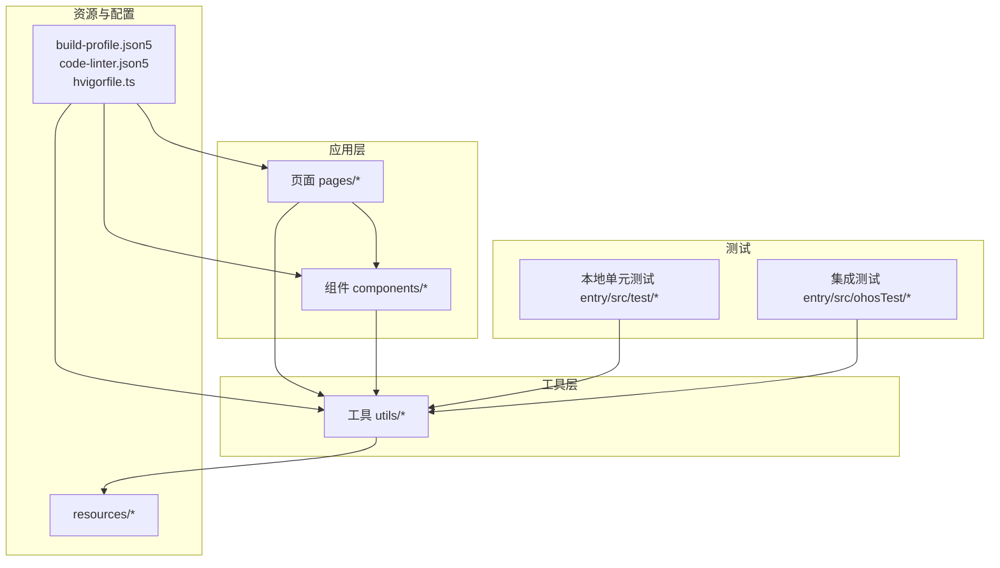
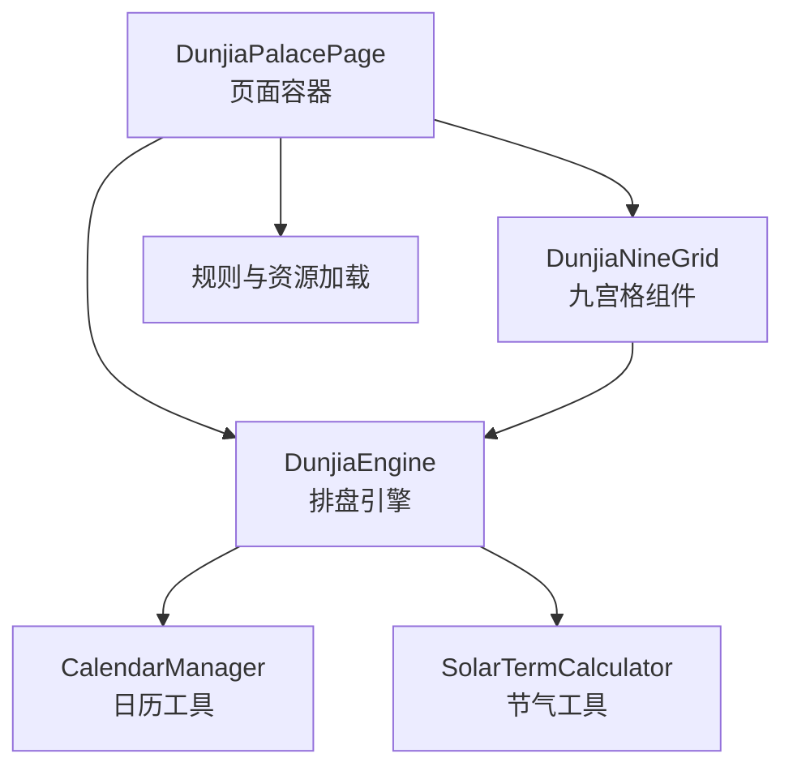
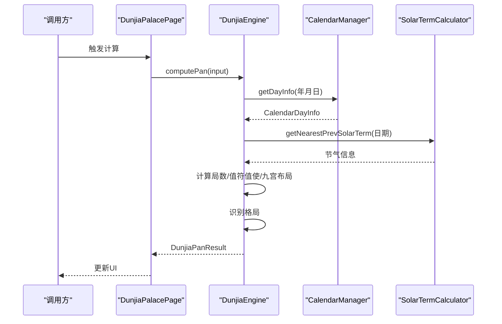
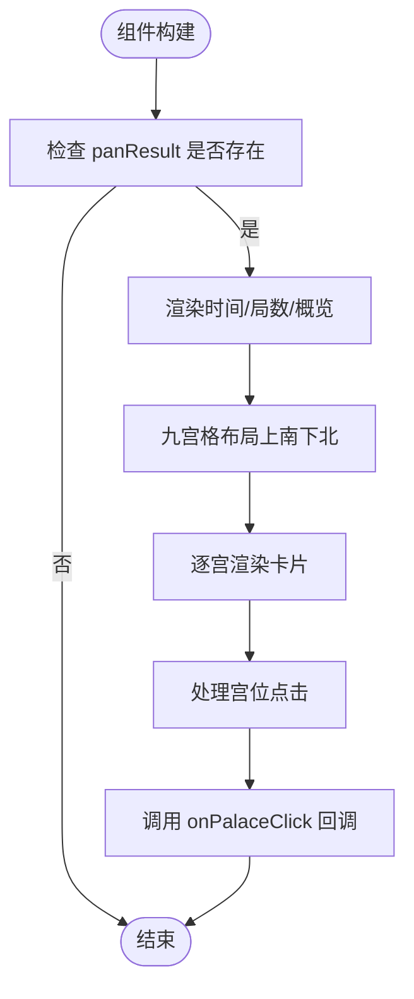
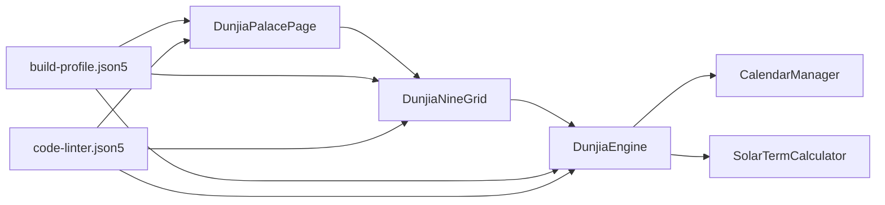

# 开发指南

<cite>
**本文引用的文件**
- [ArkTS开发规范指南.md](file://ArkTS开发规范指南.md)
- [组件化细要.md](file://组件化细要.md)
- [hvigorfile.ts](file://hvigorfile.ts)
- [build-profile.json5](file://build-profile.json5)
- [code-linter.json5](file://code-linter.json5)
- [DunjiaEngine.ets](file://entry/src/main/ets/utils/DunjiaEngine.ets)
- [DunjiaNineGrid.ets](file://entry/src/main/ets/components/DunjiaNineGrid.ets)
- [DunjiaPalacePage.ets](file://entry/src/main/ets/pages/DunjiaPalacePage.ets)
- [List.test.ets](file://entry/src/test/List.test.ets)
- [LocalUnit.test.ets](file://entry/src/test/LocalUnit.test.ets)
- [Ability.test.ets](file://entry/src/ohosTest/ets/test/Ability.test.ets)
- [List.test.ets (ohosTest)](file://entry/src/ohosTest/ets/test/List.test.ets)
- [module.json5 (entry)](file://entry/src/main/module.json5)
- [module.json5 (entry_test)](file://entry/src/ohosTest/module.json5)
</cite>

## 目录
1. [简介](#简介)
2. [项目结构](#项目结构)
3. [核心组件](#核心组件)
4. [架构总览](#架构总览)
5. [详细组件分析](#详细组件分析)
6. [依赖分析](#依赖分析)
7. [性能考虑](#性能考虑)
8. [故障排查指南](#故障排查指南)
9. [结论](#结论)
10. [附录](#附录)

## 简介
本开发指南面向参与“遁甲符应经”项目的ArkTS开发者，系统阐述开发规范、编码标准、组件化策略、测试与CI/CD实践、调试与性能分析方法，并提供扩展与协作流程建议。项目采用ArkTS/HarmonyOS生态，核心围绕“奇门遁甲”排盘引擎与UI组件化展开，强调类型安全、可维护性与可复用性。

## 项目结构
项目采用模块化与分层组织：
- AppScope：应用级资源与全局配置
- entry模块：应用入口，包含页面、组件、工具类与测试
- 规则与资料：规则JSON与说明文档
- 构建与工具：hvigor构建脚本、lint规则、签名配置

图表来源
- [DunjiaPalacePage.ets](file://entry/src/main/ets/pages/DunjiaPalacePage.ets#L1-L120)
- [DunjiaNineGrid.ets](file://entry/src/main/ets/components/DunjiaNineGrid.ets#L1-L40)
- [DunjiaEngine.ets](file://entry/src/main/ets/utils/DunjiaEngine.ets#L1-L60)
- [build-profile.json5](file://build-profile.json5#L1-L56)
- [code-linter.json5](file://code-linter.json5#L1-L32)
- [hvigorfile.ts](file://hvigorfile.ts#L1-L6)

章节来源
- [module.json5 (entry)](file://entry/src/main/module.json5#L1-L50)
- [module.json5 (entry_test)](file://entry/src/ohosTest/module.json5#L1-L12)

## 核心组件
- 排盘引擎（DunjiaEngine）
  - 职责：根据时间/地点计算九宫盘面、值符值使、天盘地盘、八神、格局识别等
  - 特点：单例模式、异步计算、强类型接口
- UI组件（DunjiaNineGrid）
  - 职责：展示九宫格、时间/真太阳时、局数与概览；处理宫位点击
  - 特点：@Prop传参、回调驱动、结构化卡片组合
- 页面容器（DunjiaPalacePage）
  - 职责：状态管理、规则加载、页面布局、交互控制
  - 特点：@State/@Link/@ObjectLink状态传递；异步资源加载与错误兜底

章节来源
- [DunjiaEngine.ets](file://entry/src/main/ets/utils/DunjiaEngine.ets#L98-L162)
- [DunjiaNineGrid.ets](file://entry/src/main/ets/components/DunjiaNineGrid.ets#L23-L70)
- [DunjiaPalacePage.ets](file://entry/src/main/ets/pages/DunjiaPalacePage.ets#L82-L120)

## 架构总览
系统采用“页面容器 + 组件 + 工具类”的分层架构，页面负责状态与编排，组件专注展示，工具类封装复杂逻辑与数据。

图表来源
- [DunjiaPalacePage.ets](file://entry/src/main/ets/pages/DunjiaPalacePage.ets#L96-L115)
- [DunjiaEngine.ets](file://entry/src/main/ets/utils/DunjiaEngine.ets#L4-L5)
- [DunjiaNineGrid.ets](file://entry/src/main/ets/components/DunjiaNineGrid.ets#L1-L5)

## 详细组件分析

### 排盘引擎（DunjiaEngine）
- 设计要点
  - 单例模式，避免重复实例化
  - 输入输出强类型接口，保证调用契约清晰
  - 核心算法模块化：节气判定、局数计算、值符值使、九宫布局、格局识别
- 关键流程（计算盘面）
  - 获取干支 → 计算局数与阴阳遁 → 计算时干支 → 计算值符值使 → 布局九宫（九星/八门/三奇六仪/八神）→ 识别格局 → 返回结果

图表来源
- [DunjiaPalacePage.ets](file://entry/src/main/ets/pages/DunjiaPalacePage.ets#L218-L236)
- [DunjiaEngine.ets](file://entry/src/main/ets/utils/DunjiaEngine.ets#L113-L162)
- [DunjiaEngine.ets](file://entry/src/main/ets/utils/DunjiaEngine.ets#L247-L250)

章节来源
- [DunjiaEngine.ets](file://entry/src/main/ets/utils/DunjiaEngine.ets#L98-L162)

### 九宫格组件（DunjiaNineGrid）
- 设计要点
  - 通过@Prop接收排盘结果与选中宫位，支持点击回调
  - 内部组合InfoCard等子组件，统一展示风格
  - 时间信息、局数、概览与九宫格布局清晰分离
- 状态传递
  - 父页面通过@Prop传入panResult与selectedPalace
  - 点击事件通过onPalaceClick回调上抛

图表来源
- [DunjiaNineGrid.ets](file://entry/src/main/ets/components/DunjiaNineGrid.ets#L72-L177)

章节来源
- [DunjiaNineGrid.ets](file://entry/src/main/ets/components/DunjiaNineGrid.ets#L23-L70)

### 页面容器（DunjiaPalacePage）
- 设计要点
  - @State管理盘面、选中宫位、加载状态与时间
  - 异步加载规则JSON与调用引擎计算
  - 提供时间调整、时辰切换、占断指引等功能
- 资源加载
  - 使用资源管理器读取规则文件，UTF-8解码
  - 异常捕获与错误日志记录

章节来源
- [DunjiaPalacePage.ets](file://entry/src/main/ets/pages/DunjiaPalacePage.ets#L96-L115)
- [DunjiaPalacePage.ets](file://entry/src/main/ets/pages/DunjiaPalacePage.ets#L120-L181)
- [DunjiaPalacePage.ets](file://entry/src/main/ets/pages/DunjiaPalacePage.ets#L218-L236)

## 依赖分析
- 模块依赖
  - 页面依赖组件与工具类
  - 组件依赖工具类（如排盘引擎）
  - 工具类依赖日历与节气计算器
- 构建与配置
  - hvigorfile.ts：内置构建任务与可选插件
  - build-profile.json5：签名、产品配置、构建模式
  - code-linter.json5：ESLint与安全规则

图表来源
- [hvigorfile.ts](file://hvigorfile.ts#L1-L6)
- [build-profile.json5](file://build-profile.json5#L1-L56)
- [code-linter.json5](file://code-linter.json5#L1-L32)
- [DunjiaEngine.ets](file://entry/src/main/ets/utils/DunjiaEngine.ets#L4-L5)

章节来源
- [hvigorfile.ts](file://hvigorfile.ts#L1-L6)
- [build-profile.json5](file://build-profile.json5#L1-L56)
- [code-linter.json5](file://code-linter.json5#L1-L32)

## 性能考虑
- 避免频繁对象创建：在循环中避免临时对象构造
- 结果缓存：对昂贵计算使用Map缓存
- 批量操作：合并多次更新为批量执行
- 组件渲染：合理使用@State/@Prop，避免不必要的重渲染
- 资源加载：异步读取与懒加载，提供降级方案

章节来源
- [ArkTS开发规范指南.md](file://ArkTS开发规范指南.md#L660-L730)

## 故障排查指南
- 编译错误定位
  - 动态索引访问：使用switch或Map替代
  - 索引签名与内联对象类型：改用明确接口
  - 静态方法中this使用：使用类名.方法名
  - 解构/展开/可选链/空值合并：使用传统方式替代
- 运行期问题
  - CalendarManager需要Context初始化：单元测试中需mock或跳过
  - UTF-8解码：确保资源读取后正确解码
  - 异步错误：在页面中捕获并设置loading=false

章节来源
- [ArkTS开发规范指南.md](file://ArkTS开发规范指南.md#L749-L782)
- [DunjiaPalacePage.ets](file://entry/src/main/ets/pages/DunjiaPalacePage.ets#L120-L181)
- [LocalUnit.test.ets](file://entry/src/test/LocalUnit.test.ets#L36-L50)

## 结论
本指南提供了从规范、架构、组件、测试到CI/CD与调试的全栈开发实践。建议团队在迭代中坚持类型安全、组件化与可测试性，逐步完善CI/CD流水线与自动化测试覆盖率，确保项目长期可维护与高质量交付。

## 附录

### 开发规范与最佳实践
- 类型安全优先：禁用any/unknown，使用明确接口与联合类型
- 循环与对象访问：使用传统循环与switch，避免for...in/for...of与动态索引
- 函数与方法：禁用解构/展开/可选链/空值合并，显式类型注解
- 静态方法：使用类名调用，避免this
- 性能优化：缓存、批处理、避免临时对象

章节来源
- [ArkTS开发规范指南.md](file://ArkTS开发规范指南.md#L6-L171)
- [ArkTS开发规范指南.md](file://ArkTS开发规范指南.md#L239-L394)
- [ArkTS开发规范指南.md](file://ArkTS开发规范指南.md#L660-L730)

### 组件化策略与实现
- UI组件：职责单一、纯展示、明确@Prop接口
- 数据组件：单例模式、隐藏复杂逻辑（文件索引/缓存/解析）
- 状态传递：@Prop/@Link/@ObjectLink/@Observed
- 复用与移植：保持相对路径与类型导出完整

章节来源
- [组件化细要.md](file://组件化细要.md#L1-L155)
- [组件化细要.md](file://组件化细要.md#L157-L227)
- [组件化细要.md](file://组件化细要.md#L230-L304)
- [组件化细要.md](file://组件化细要.md#L307-L429)

### 单元测试与集成测试
- 本地单元测试：使用@ohos/hypium框架，提供生命周期钩子
- 集成测试：能力测试示例，适合端到端场景
- 测试建议：对CalendarManager等依赖Context的模块，优先在集成测试中验证

章节来源
- [LocalUnit.test.ets](file://entry/src/test/LocalUnit.test.ets#L1-L52)
- [List.test.ets](file://entry/src/test/List.test.ets#L1-L5)
- [Ability.test.ets](file://entry/src/ohosTest/ets/test/Ability.test.ets#L1-L35)
- [List.test.ets (ohosTest)](file://entry/src/ohosTest/ets/test/List.test.ets#L1-L5)

### 持续集成与自动化部署
- 构建配置：hvigorfile.ts内置任务，可扩展插件
- 产物与签名：build-profile.json5定义签名与产品配置
- 代码质量：code-linter.json5启用ESLint与安全规则
- 建议流程：本地提交前执行lint与单元测试；CI中补充集成测试与打包校验

章节来源
- [hvigorfile.ts](file://hvigorfile.ts#L1-L6)
- [build-profile.json5](file://build-profile.json5#L1-L56)
- [code-linter.json5](file://code-linter.json5#L1-L32)

### 调试技巧与性能分析
- 调试：利用hilog输出与断点；页面中捕获异常并记录
- 性能：关注对象创建、缓存与批量操作；组件层面避免重渲染
- 规则：遵循ArkTS开发规范，减少编译期与运行期风险

章节来源
- [Ability.test.ets](file://entry/src/ohosTest/ets/test/Ability.test.ets#L25-L33)
- [ArkTS开发规范指南.md](file://ArkTS开发规范指南.md#L660-L730)

### 功能扩展与模块添加
- 新增页面：遵循DunjiaPalacePage模式，使用@State管理状态，调用DunjiaEngine
- 新增组件：保持单一职责，通过@Prop与回调与父组件通信
- 新增工具类：单例封装，提供明确接口，避免跨组件传递大对象
- 资源与规则：按组件化细要迁移资源文件与类型定义

章节来源
- [DunjiaPalacePage.ets](file://entry/src/main/ets/pages/DunjiaPalacePage.ets#L82-L120)
- [组件化细要.md](file://组件化细要.md#L364-L403)

### 团队协作与版本控制
- 分支策略：建议采用功能分支与PR评审
- 提交规范：遵循ArkTS开发规范，提交前执行lint与测试
- 文档与规则：统一维护ArkTS开发规范与组件化细要

章节来源
- [ArkTS开发规范指南.md](file://ArkTS开发规范指南.md#L731-L748)
- [组件化细要.md](file://组件化细要.md#L405-L429)