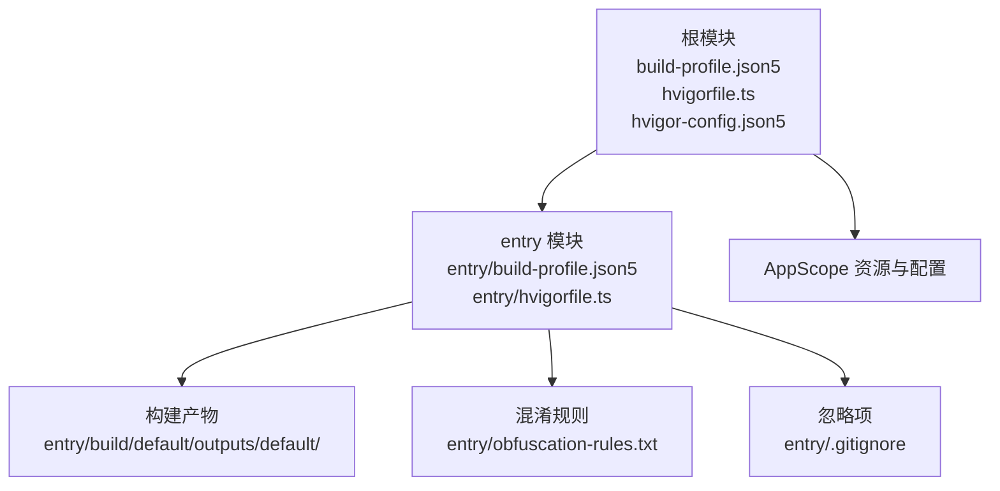
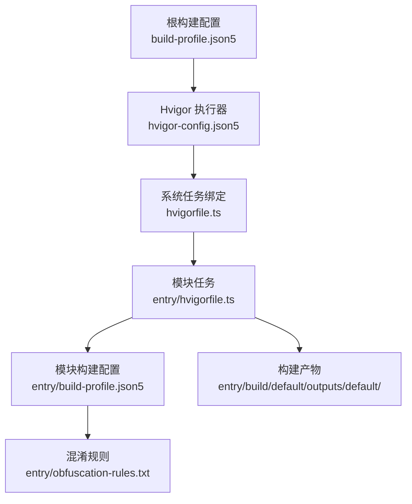
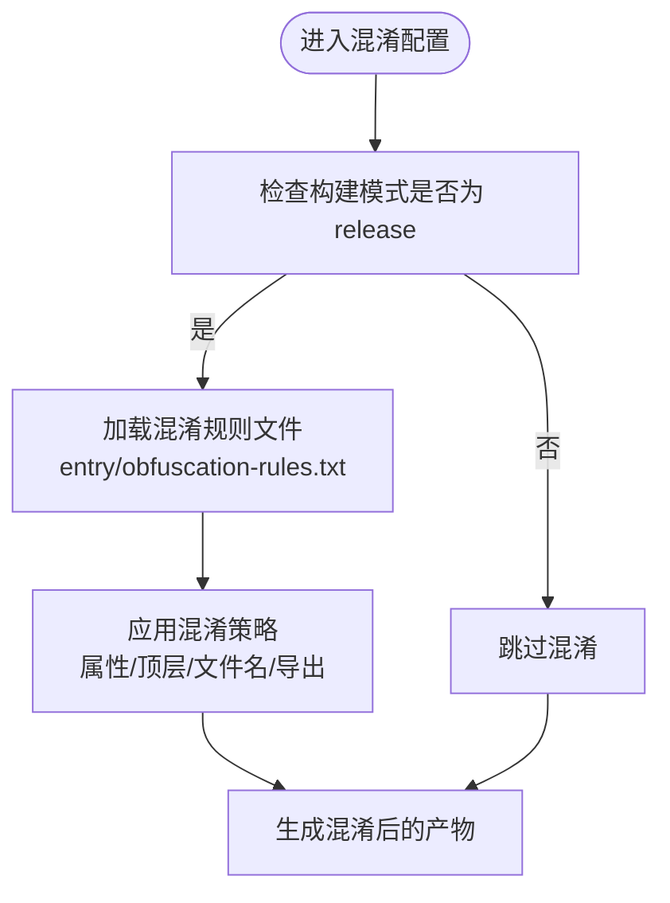
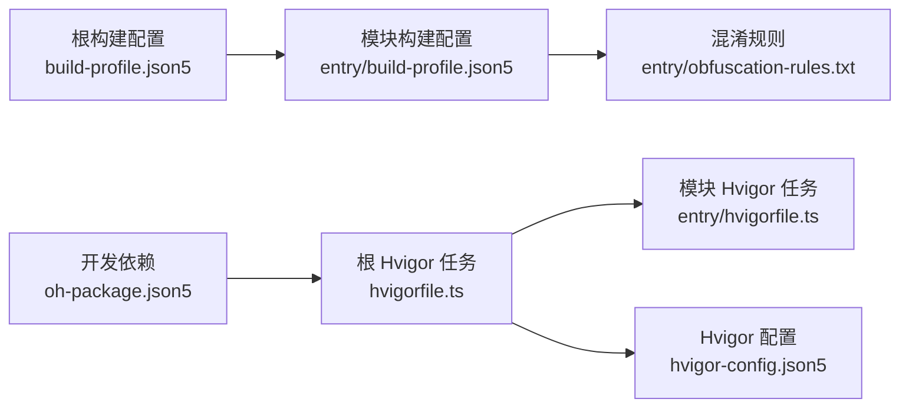

# 构建与部署

<cite>
**本文引用的文件**
- [build-profile.json5](file://build-profile.json5)
- [entry/build-profile.json5](file://entry/build-profile.json5)
- [hvigorfile.ts](file://hvigorfile.ts)
- [entry/hvigorfile.ts](file://entry/hvigorfile.ts)
- [hvigor-config.json5](file://hvigor/hvigor-config.json5)
- [obfuscation-rules.txt](file://entry/obfuscation-rules.txt)
- [oh-package.json5](file://oh-package.json5)
- [entry/oh-package.json5](file://entry/oh-package.json5)
- [entry/.gitignore](file://entry/.gitignore)
- [鸿蒙命令行编译助手.md](file://鸿蒙命令行编译助手.md)
</cite>

## 目录
1. [简介](#简介)
2. [项目结构](#项目结构)
3. [核心组件](#核心组件)
4. [架构总览](#架构总览)
5. [详细组件分析](#详细组件分析)
6. [依赖关系分析](#依赖关系分析)
7. [性能考虑](#性能考虑)
8. [故障排查指南](#故障排查指南)
9. [结论](#结论)
10. [附录](#附录)

## 简介
本指南面向鸿蒙应用“符应遁甲”的构建与部署，覆盖以下主题：
- 构建配置与优化：build-profile.json5 的参数设置与优化项
- Hvigor 构建工具使用：构建模式、目标平台与产物输出
- 代码混淆与优化：obfuscation-rules.txt 的规则与开关
- 打包与签名：发布版本的签名配置与产物生成
- 持续集成与自动化部署：流水线搭建思路与最佳实践
- 版本管理与发布策略：版本控制与热更新建议
- 故障排查与性能优化：常见问题与解决方案

## 项目结构
项目采用多模块结构，根模块负责全局构建配置，entry 模块为应用主模块，hvigor 目录存放构建工具配置。

图表来源
- [build-profile.json5](file://build-profile.json5#L1-L56)
- [hvigorfile.ts](file://hvigorfile.ts#L1-L6)
- [hvigor-config.json5](file://hvigor/hvigor-config.json5#L1-L24)
- [entry/build-profile.json5](file://entry/build-profile.json5#L1-L33)
- [entry/hvigorfile.ts](file://entry/hvigorfile.ts#L1-L6)
- [entry/obfuscation-rules.txt](file://entry/obfuscation-rules.txt#L1-L23)
- [entry/.gitignore](file://entry/.gitignore#L1-L6)

章节来源
- [build-profile.json5](file://build-profile.json5#L1-L56)
- [hvigorfile.ts](file://hvigorfile.ts#L1-L6)
- [hvigor-config.json5](file://hvigor/hvigor-config.json5#L1-L24)
- [entry/build-profile.json5](file://entry/build-profile.json5#L1-L33)
- [entry/hvigorfile.ts](file://entry/hvigorfile.ts#L1-L6)
- [entry/obfuscation-rules.txt](file://entry/obfuscation-rules.txt#L1-L23)
- [entry/.gitignore](file://entry/.gitignore#L1-L6)

## 核心组件
- 根模块构建配置：定义签名、产品配置、构建模式集合与模块映射
- entry 模块构建配置：定义 API 类型、资源处理、构建选项集（含 ArkTS 混淆）
- Hvigor 构建脚本：根模块与 entry 模块分别绑定系统任务
- Hvigor 工具配置：执行策略、日志级别、调试与 Node 参数
- 混淆规则：定义 ArkTS 源码混淆策略与保留项
- 依赖与包配置：oh-package.json5 描述依赖与开发依赖
- 忽略项：entry/.gitignore 控制构建与中间产物的版本控制范围

章节来源
- [build-profile.json5](file://build-profile.json5#L1-L56)
- [entry/build-profile.json5](file://entry/build-profile.json5#L1-L33)
- [hvigorfile.ts](file://hvigorfile.ts#L1-L6)
- [entry/hvigorfile.ts](file://entry/hvigorfile.ts#L1-L6)
- [hvigor-config.json5](file://hvigor/hvigor-config.json5#L1-L24)
- [obfuscation-rules.txt](file://entry/obfuscation-rules.txt#L1-L23)
- [oh-package.json5](file://oh-package.json5#L1-L11)
- [entry/oh-package.json5](file://entry/oh-package.json5#L1-L11)
- [entry/.gitignore](file://entry/.gitignore#L1-L6)

## 架构总览
下图展示了从配置到产物的关键路径，以及 Hvigor 在其中的角色。

图表来源
- [build-profile.json5](file://build-profile.json5#L1-L56)
- [hvigor-config.json5](file://hvigor/hvigor-config.json5#L1-L24)
- [hvigorfile.ts](file://hvigorfile.ts#L1-L6)
- [entry/hvigorfile.ts](file://entry/hvigorfile.ts#L1-L6)
- [entry/build-profile.json5](file://entry/build-profile.json5#L1-L33)
- [entry/obfuscation-rules.txt](file://entry/obfuscation-rules.txt#L1-L23)

## 详细组件分析

### 构建配置与优化（build-profile.json5）
- 签名配置（signingConfigs）
  - 名称与类型：用于标识 HarmonyOS 签名材料
  - 材料字段：证书路径、密钥别名、密钥密码、profile、签名算法、store 文件与 store 密码
  - 作用：为发布版本提供签名能力，确保应用可分发与安装
- 产品配置（products）
  - 名称与签名关联：通过 signingConfig 关联根配置中的签名
  - SDK 版本：targetSdkVersion 与 compatibleSdkVersion
  - 运行时 OS：runtimeOS 指定目标系统
  - 严格模式：大小写敏感检查与 URL 规范化
- 构建模式集合（buildModeSet）
  - debug 与 release：两种构建模式，影响日志、优化与产物特性
- 模块映射（modules）
  - entry 模块：指定源码路径与目标产品映射

章节来源
- [build-profile.json5](file://build-profile.json5#L1-L56)

### Hvigor 构建工具使用
- 根模块与 entry 模块的任务绑定
  - 根模块：appTasks，系统内置任务
  - entry 模块：hapTasks，HAP 打包相关任务
- 常用命令（基于仓库内编译助手）
  - assembleHap：编译并打包
  - assembleHap --mode debug/release：指定构建模式
  - clean：清理构建缓存
  - ohpm install/list/update/clean：依赖管理
  - codelinter/hstack：代码质量检查
- 输出位置
  - HAP 包：entry/build/default/outputs/default/
  - 构建日志：.hvigor/outputs/build-logs/
  - 缓存：.hvigor/cache/

章节来源
- [hvigorfile.ts](file://hvigorfile.ts#L1-L6)
- [entry/hvigorfile.ts](file://entry/hvigorfile.ts#L1-L6)
- [鸿蒙命令行编译助手.md](file://鸿蒙命令行编译助手.md#L47-L134)

### 代码混淆与优化（obfuscation-rules.txt 与 entry/build-profile.json5）
- 混淆规则文件
  - 用途：定义属性名、全局名、文件名与导出对象的混淆策略
  - 可选开关：禁用混淆、启用属性混淆、启用顶层混淆、启用文件名混淆、启用导出混淆等
  - 保留项：保留特定属性名或全局名
- 模块构建配置中的 ArkTS 混淆
  - release 构建选项：开启混淆规则文件引用
  - 规则文件路径：./obfuscation-rules.txt

图表来源
- [entry/build-profile.json5](file://entry/build-profile.json5#L10-L24)
- [entry/obfuscation-rules.txt](file://entry/obfuscation-rules.txt#L1-L23)

章节来源
- [entry/build-profile.json5](file://entry/build-profile.json5#L1-L33)
- [entry/obfuscation-rules.txt](file://entry/obfuscation-rules.txt#L1-L23)

### 打包与签名（发布版本）
- 签名配置
  - 在根构建配置中定义 HarmonyOS 签名材料，包含证书、密钥别名、密码与 store 信息
  - 产品配置通过 signingConfig 引用该签名
- 发布流程
  - 使用 release 模式编译：assembleHap --mode release
  - 产物位于 entry/build/default/outputs/default/，包含已签名的 HAP 包
- 注意事项
  - 确保密钥与证书路径正确且权限允许
  - 在 CI 环境中安全存储密钥材料

章节来源
- [build-profile.json5](file://build-profile.json5#L1-L56)
- [entry/build-profile.json5](file://entry/build-profile.json5#L1-L33)
- [鸿蒙命令行编译助手.md](file://鸿蒙命令行编译助手.md#L117-L119)

### 持续集成与自动化部署（CI/CD）
- 流水线建议阶段
  - 环境准备：安装 DevEco Studio 与 Node.js，配置 PATH
  - 依赖安装：ohpm install
  - 清理缓存：hvigorw clean
  - 构建与测试：hvigorw assembleHap（可按需切换 --mode）
  - 产物归档：收集 entry/build/default/outputs/default/ 下的 HAP 包
  - 签名与发布：在受控环境中执行签名与分发
- 最佳实践
  - 使用缓存目录 .hvigor/cache/ 以提升增量构建速度
  - 将密钥材料放入受保护的 CI 变量或机密存储
  - 分离 debug 与 release 环节，避免误签

章节来源
- [hvigor-config.json5](file://hvigor/hvigor-config.json5#L1-L24)
- [entry/.gitignore](file://entry/.gitignore#L1-L6)
- [鸿蒙命令行编译助手.md](file://鸿蒙命令行编译助手.md#L122-L126)

### 版本管理与发布策略
- 版本控制
  - 使用 oh-package.json5 管理依赖与开发依赖，保持版本一致性
  - hvigor-config.json5 的 modelVersion 与构建工具版本对齐
- 发布策略
  - 通过构建模式区分 debug 与 release
  - 使用签名配置统一发布版本的签名流程
- 热更新建议
  - 本仓库未发现热更新相关实现；如需热更，建议引入官方热更新能力并在 CI 中增加校验与回滚策略

章节来源
- [oh-package.json5](file://oh-package.json5#L1-L11)
- [entry/oh-package.json5](file://entry/oh-package.json5#L1-L11)
- [hvigor-config.json5](file://hvigor/hvigor-config.json5#L1-L24)
- [build-profile.json5](file://build-profile.json5#L1-L56)

## 依赖关系分析
- 配置耦合
  - 根构建配置与模块构建配置通过 product 与 target 映射关联
  - 混淆规则由模块构建配置启用，影响产物体积与安全性
- 外部依赖
  - 开发依赖：@ohos/hypium、@ohos/hamock
  - 构建插件：hvigor-ohos-plugin（通过系统任务绑定）

图表来源
- [build-profile.json5](file://build-profile.json5#L1-L56)
- [entry/build-profile.json5](file://entry/build-profile.json5#L1-L33)
- [entry/obfuscation-rules.txt](file://entry/obfuscation-rules.txt#L1-L23)
- [hvigorfile.ts](file://hvigorfile.ts#L1-L6)
- [entry/hvigorfile.ts](file://entry/hvigorfile.ts#L1-L6)
- [hvigor-config.json5](file://hvigor/hvigor-config.json5#L1-L24)
- [oh-package.json5](file://oh-package.json5#L1-L11)

章节来源
- [build-profile.json5](file://build-profile.json5#L1-L56)
- [entry/build-profile.json5](file://entry/build-profile.json5#L1-L33)
- [hvigorfile.ts](file://hvigorfile.ts#L1-L6)
- [entry/hvigorfile.ts](file://entry/hvigorfile.ts#L1-L6)
- [hvigor-config.json5](file://hvigor/hvigor-config.json5#L1-L24)
- [oh-package.json5](file://oh-package.json5#L1-L11)

## 性能考虑
- 构建性能
  - 启用并行编译与增量编译（Hvigor 默认支持），减少重复工作
  - 利用缓存目录 .hvigor/cache/ 保存中间结果
- 混淆与压缩
  - release 模式启用 ArkTS 混淆，降低包体与反编译难度
  - 合理使用保留项，避免破坏运行时反射或动态调用
- 日志与诊断
  - hvigor-config.json5 支持日志级别与调试选项，便于定位问题

章节来源
- [hvigor-config.json5](file://hvigor/hvigor-config.json5#L1-L24)
- [entry/build-profile.json5](file://entry/build-profile.json5#L10-L24)
- [entry/obfuscation-rules.txt](file://entry/obfuscation-rules.txt#L1-L23)
- [entry/.gitignore](file://entry/.gitignore#L1-L6)

## 故障排查指南
- 工具未找到
  - 确认 PATH 包含 DevEco Studio 的工具路径
- 编译失败
  - 先执行 hvigorw clean 清理缓存与中间产物
- 依赖问题
  - 运行 ohpm clean 后重新执行 ohpm install
- 签名警告
  - 在根构建配置中完善 signingConfigs 字段
- 版本不匹配
  - 确保 hvigor-config.json5、oh-package.json5 与 build-profile.json5 的 modelVersion 一致
- SDK 版本错误
  - 在 build-profile.json5 中使用系统已安装的 SDK 版本

章节来源
- [鸿蒙命令行编译助手.md](file://鸿蒙命令行编译助手.md#L109-L116)
- [hvigor-config.json5](file://hvigor/hvigor-config.json5#L1-L24)
- [oh-package.json5](file://oh-package.json5#L1-L11)
- [build-profile.json5](file://build-profile.json5#L1-L56)

## 结论
本指南基于仓库现有配置，给出了从配置到产物的完整路径与优化建议。建议在 CI 环境中固化依赖安装、清理与构建步骤，并通过 release 模式与签名配置统一发布流程。混淆规则与缓存策略可进一步提升产物安全性与构建效率。

## 附录
- 命令速查
  - hvigorw assembleHap：编译打包
  - hvigorw assembleHap --mode debug/release：指定模式
  - hvigorw clean：清理
  - ohpm install/list/update/clean：依赖管理
  - codelinter/hstack：代码质量检查
- 产物位置
  - HAP 包：entry/build/default/outputs/default/
  - 构建日志：.hvigor/outputs/build-logs/
  - 缓存：.hvigor/cache/

章节来源
- [鸿蒙命令行编译助手.md](file://鸿蒙命令行编译助手.md#L47-L134)
- [entry/.gitignore](file://entry/.gitignore#L1-L6)