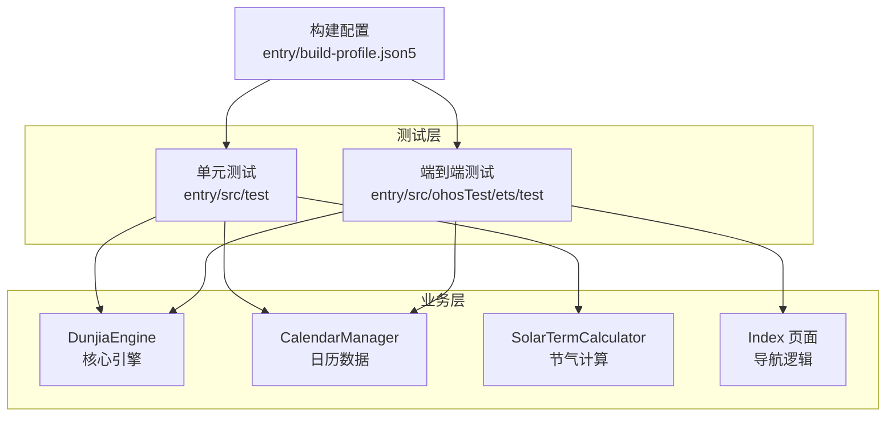
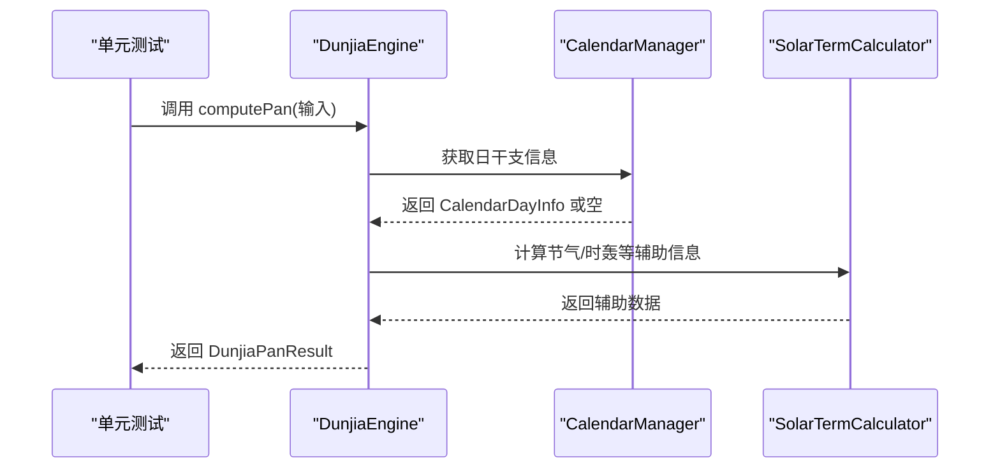
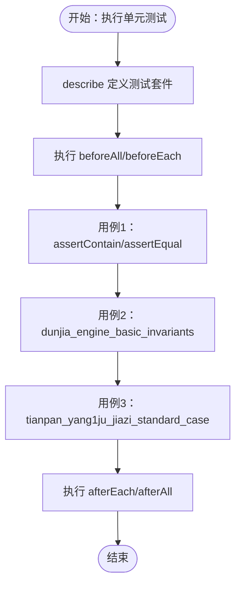
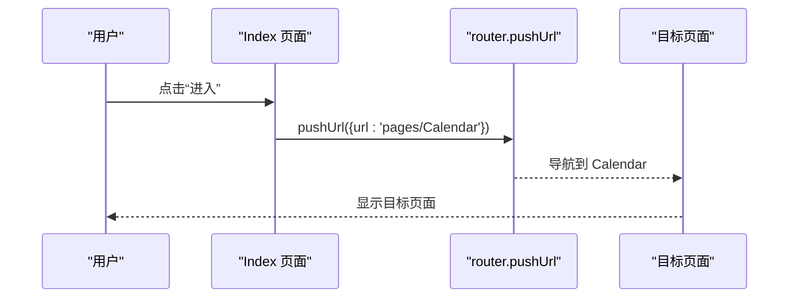
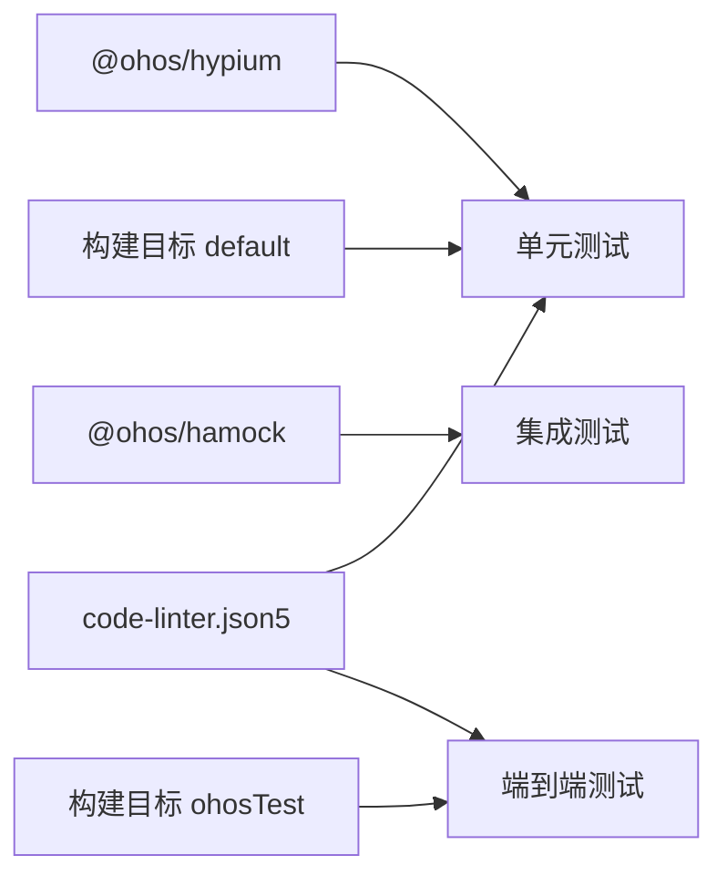

# 测试策略

<cite>
**本文引用的文件**
- [entry\src\test\List.test.ets](file://entry/src/test/List.test.ets)
- [entry\src\test\LocalUnit.test.ets](file://entry/src/test/LocalUnit.test.ets)
- [entry\src\ohosTest\ets\test\List.test.ets](file://entry/src/ohosTest/ets/test/List.test.ets)
- [entry\src\ohosTest\ets\test\Ability.test.ets](file://entry/src/ohosTest/ets/test/Ability.test.ets)
- [entry\src\ohosTest\module.json5](file://entry/src/ohosTest/module.json5)
- [entry\build-profile.json5](file://entry/build-profile.json5)
- [oh-package.json5](file://oh-package.json5)
- [entry\src\main\ets\utils\DunjiaEngine.ets](file://entry/src/main/ets/utils/DunjiaEngine.ets)
- [entry\src\main\ets\utils\CalendarManager.ets](file://entry/src/main/ets/utils/CalendarManager.ets)
- [entry\src\main\ets\utils\SolarTermCalculator.ets](file://entry/src/main/ets/utils/SolarTermCalculator.ets)
- [entry\src\main\ets\pages\Index.ets](file://entry/src/main/ets/pages/Index.ets)
- [code-linter.json5](file://code-linter.json5)
- [entry\src\mock\mock-config.json5](file://entry/src/mock/mock-config.json5)
</cite>

## 目录
1. [简介](#简介)
2. [项目结构](#项目结构)
3. [核心组件](#核心组件)
4. [架构总览](#架构总览)
5. [详细组件分析](#详细组件分析)
6. [依赖关系分析](#依赖关系分析)
7. [性能考虑](#性能考虑)
8. [故障排查指南](#故障排查指南)
9. [结论](#结论)
10. [附录](#附录)

## 简介
本测试策略文档面向鸿蒙应用“遁甲符应经”的测试工作，覆盖单元测试、集成测试、端到端测试、性能与压力测试、测试数据准备与管理、测试报告与分析工具使用等。文档以仓库现有测试文件为基础，结合核心业务组件，给出可落地的测试设计原则、实施步骤与最佳实践，并通过图示帮助读者快速理解测试流程与组件交互。

## 项目结构
测试相关目录与文件分布如下：
- 单元测试（本地测试）：entry/src/test
- 端到端测试（ohosTest）：entry/src/ohosTest/ets/test
- 构建目标：entry/build-profile.json5 中定义了 default 与 ohosTest 两个构建目标
- 工具依赖：oh-package.json5 中声明了 @ohos/hypium（测试框架）与 @ohos/hamock（Mock 工具）
- 核心业务组件：DunjiaEngine、CalendarManager、SolarTermCalculator 等位于 entry/src/main/ets/utils
- 页面导航：Index 页面包含路由跳转逻辑，用于端到端测试场景

图表来源
- [entry\src\test\List.test.ets](file://entry/src/test/List.test.ets#L1-L5)
- [entry\src\ohosTest\ets\test\List.test.ets](file://entry/src/ohosTest/ets/test/List.test.ets#L1-L5)
- [entry\build-profile.json5](file://entry/build-profile.json5#L25-L32)
- [entry\src\main\ets\utils\DunjiaEngine.ets](file://entry/src/main/ets/utils/DunjiaEngine.ets#L98-L162)
- [entry\src\main\ets\utils\CalendarManager.ets](file://entry/src/main/ets/utils/CalendarManager.ets#L30-L92)
- [entry\src\main\ets\utils\SolarTermCalculator.ets](file://entry/src/main/ets/utils/SolarTermCalculator.ets#L30-L115)
- [entry\src\main\ets\pages\Index.ets](file://entry/src/main/ets/pages/Index.ets#L1-L88)

章节来源
- [entry\build-profile.json5](file://entry/build-profile.json5#L1-L33)
- [entry\src\test\List.test.ets](file://entry/src/test/List.test.ets#L1-L5)
- [entry\src\ohosTest\ets\test\List.test.ets](file://entry/src/ohosTest/ets/test/List.test.ets#L1-L5)

## 核心组件
- DunjiaEngine：核心计算引擎，负责从时间/地点输入推导遁甲盘面、值符值使、九宫状态、规则命中与格局识别等。
- CalendarManager：提供万年历日数据查询、节气精确时刻附加、缓存机制与上下文依赖。
- SolarTermCalculator：节气时刻计算工具，支持跨年节气定位与缓存。
- Index 页面：包含导航逻辑（router.pushUrl），适合端到端测试验证页面跳转与交互。

章节来源
- [entry\src\main\ets\utils\DunjiaEngine.ets](file://entry/src/main/ets/utils/DunjiaEngine.ets#L98-L162)
- [entry\src\main\ets\utils\CalendarManager.ets](file://entry/src/main/ets/utils/CalendarManager.ets#L30-L92)
- [entry\src\main\ets\utils\SolarTermCalculator.ets](file://entry/src/main/ets/utils/SolarTermCalculator.ets#L30-L115)
- [entry\src\main\ets\pages\Index.ets](file://entry/src/main/ets/pages/Index.ets#L1-L88)

## 架构总览
测试架构分为三层：
- 单元测试：针对纯函数与无上下文依赖的模块进行断言与不变式验证。
- 集成测试：在具备上下文或外部资源访问能力的环境中，验证组件间协作（如引擎与日历数据）。
- 端到端测试：模拟真实用户路径，验证页面导航、交互与业务流程闭环。

图表来源
- [entry\src\main\ets\utils\DunjiaEngine.ets](file://entry/src/main/ets/utils/DunjiaEngine.ets#L113-L162)
- [entry\src\main\ets\utils\CalendarManager.ets](file://entry/src/main/ets/utils/CalendarManager.ets#L51-L92)
- [entry\src\main\ets\utils\SolarTermCalculator.ets](file://entry/src/main/ets/utils/SolarTermCalculator.ets#L93-L115)

## 详细组件分析

### 单元测试策略与最佳实践
- 测试框架：使用 @ohos/hypium 提供的 describe/it/expect 等 API，支持 beforeAll/beforeEach/afterEach/afterAll 生命周期钩子。
- 设计原则
  - 每个测试用例聚焦单一行为，命名清晰表达预期。
  - 使用断言方法验证布尔条件与相等性，避免副作用。
  - 对于需要上下文的模块（如 CalendarManager），在单元测试中通过 Mock 替换或跳过，将上下文相关验证放入集成测试。
- 覆盖率要求
  - 关键算法与分支：核心计算（如时轰干支、值符值使、九宫布阵）应达到高分支覆盖率。
  - 异常路径：空数据、越界、格式错误等边界条件必须覆盖。
  - 不变式：引擎返回结构的关键不变式（如宫位数量、天干地支映射）应持续验证。
- 示例参考
  - List.test.ets 作为测试入口，聚合本地单元测试。
  - LocalUnit.test.ets 展示了基本生命周期与断言用法，并标注了需要上下文的测试项应延后到集成测试。

图表来源
- [entry\src\test\LocalUnit.test.ets](file://entry/src/test/LocalUnit.test.ets#L4-L51)
- [entry\src\test\List.test.ets](file://entry/src/test/List.test.ets#L1-L5)

章节来源
- [entry\src\test\LocalUnit.test.ets](file://entry/src/test/LocalUnit.test.ets#L1-L52)
- [entry\src\test\List.test.ets](file://entry/src/test/List.test.ets#L1-L5)

### 集成测试策略
- 目标：验证组件间交互、上下文注入、异步数据加载与缓存策略。
- 关键点
  - CalendarManager 需要上下文初始化，应在集成测试中注入 mock 上下文或使用真实资源加载。
  - DunjiaEngine 与 CalendarManager/SolarTermCalculator 的协作路径需完整走通。
  - 跳过在单元测试中无法满足的测试（如涉及上下文初始化的案例），并在集成测试中补齐。
- 实施建议
  - 使用 @ohos/hamock 进行依赖替换与桩件注入。
  - 通过构建目标 ohosTest 执行集成测试，确保资源与上下文可用。
  - 对关键流程（输入 -> 计算 -> 结果结构）进行端到端回归。

章节来源
- [entry\src\main\ets\utils\CalendarManager.ets](file://entry/src/main/ets/utils/CalendarManager.ets#L44-L46)
- [entry\src\main\ets\utils\DunjiaEngine.ets](file://entry/src/main/ets/utils/DunjiaEngine.ets#L113-L162)
- [entry\src\ohosTest\module.json5](file://entry/src/ohosTest/module.json5#L1-L12)

### 端到端测试策略
- 目标：模拟真实用户路径，验证页面导航、交互与业务闭环。
- 关键点
  - Index 页面包含导航逻辑，适合验证 pushUrl 跳转与协议页跳转。
  - 结合 @kit.PerformanceAnalysisKit 的 hilog 输出进行性能观测。
- 实施建议
  - 在 ohosTest 目标下组织测试用例，确保设备/模拟器环境可用。
  - 对关键交互（点击进入、协议页跳转）进行断言与截图/日志记录。
  - 与性能测试结合，记录关键路径耗时。

图表来源
- [entry\src\main\ets\pages\Index.ets](file://entry/src/main/ets/pages/Index.ets#L6-L14)
- [entry\src\ohosTest\ets\test\Ability.test.ets](file://entry/src/ohosTest/ets/test/Ability.test.ets#L25-L33)

章节来源
- [entry\src\main\ets\pages\Index.ets](file://entry/src/main/ets/pages/Index.ets#L1-L88)
- [entry\src\ohosTest\ets\test\Ability.test.ets](file://entry/src/ohosTest/ets/test/Ability.test.ets#L1-L35)

### 测试数据准备与管理
- 数据来源
  - 万年历数据：CalendarManager 通过资源文件加载年份对应 JSON，范围覆盖 1900-2060。
  - 节气数据：SolarTermCalculator 计算 24 节气时刻并缓存。
- 管理策略
  - 使用资源目录下的 calendar 与 rules 子目录存放 JSON 数据，便于版本控制与更新。
  - 单元测试中对依赖外部资源的模块采用 Mock 替换；集成测试中使用真实资源。
  - 对于复杂业务场景（如标准案例验证），可在测试中构造稳定输入并断言固定输出。

章节来源
- [entry\src\main\ets\utils\CalendarManager.ets](file://entry/src/main/ets/utils/CalendarManager.ets#L94-L109)
- [entry\src\main\ets\utils\SolarTermCalculator.ets](file://entry/src/main/ets/utils/SolarTermCalculator.ets#L61-L86)

### 性能测试与压力测试
- 性能观测
  - 使用 @kit.PerformanceAnalysisKit 的 hilog 输出关键路径耗时与事件日志。
  - 在端到端测试中记录页面切换、数据加载与计算耗时。
- 压力测试
  - 批量调用 DunjiaEngine.computePan，改变时间/地点输入，统计平均耗时与异常比例。
  - 并发访问 CalendarManager 的缓存与资源加载，观察缓存命中率与抖动。
- 报告与分析
  - 使用 DevEco Studio 的性能分析工具与日志收集功能，生成性能报告。
  - 对比不同输入规模与并发度下的指标，定位瓶颈。

章节来源
- [entry\src\ohosTest\ets\test\Ability.test.ets](file://entry/src/ohosTest/ets/test/Ability.test.ets#L1-L35)
- [entry\src\main\ets\utils\DunjiaEngine.ets](file://entry/src/main/ets/utils/DunjiaEngine.ets#L113-L162)

### 测试示例说明
- List.test.ets（测试入口）
  - 作用：聚合各测试套件，统一执行。
  - 建议：新增测试时在此注册新套件。
- LocalUnit.test.ets（本地单元测试）
  - 作用：演示生命周期钩子与断言用法；标注需要上下文的测试项应延后到集成测试。
  - 建议：为每个重要算法增加独立用例，覆盖分支与边界。
- Ability.test.ets（端到端测试示例）
  - 作用：演示 hilog 使用与基本断言，适合作为端到端测试模板。
  - 建议：结合页面导航逻辑扩展到更多页面与交互路径。

章节来源
- [entry\src\test\List.test.ets](file://entry/src/test/List.test.ets#L1-L5)
- [entry\src\test\LocalUnit.test.ets](file://entry/src/test/LocalUnit.test.ets#L1-L52)
- [entry\src\ohosTest\ets\test\List.test.ets](file://entry/src/ohosTest/ets/test/List.test.ets#L1-L5)
- [entry\src\ohosTest\ets\test\Ability.test.ets](file://entry/src/ohosTest/ets/test/Ability.test.ets#L1-L35)

## 依赖关系分析
- 测试框架与工具
  - @ohos/hypium：提供测试生命周期与断言 API。
  - @ohos/hamock：提供 Mock 能力，便于替换依赖。
- 构建目标
  - default：常规构建目标。
  - ohosTest：端到端测试目标，包含测试模块配置。
- 代码质量
  - code-linter.json5 忽略测试与构建产物目录，避免误报。

图表来源
- [oh-package.json5](file://oh-package.json5#L6-L9)
- [entry\build-profile.json5](file://entry/build-profile.json5#L25-L32)
- [code-linter.json5](file://code-linter.json5#L2-L13)

章节来源
- [oh-package.json5](file://oh-package.json5#L1-L11)
- [entry\build-profile.json5](file://entry/build-profile.json5#L1-L33)
- [code-linter.json5](file://code-linter.json5#L1-L32)

## 性能考虑
- 计算密集型
  - DunjiaEngine 的计算流程包含多步算法，建议在压力测试中统计耗时分布与异常率。
- I/O 与缓存
  - CalendarManager 的资源加载与缓存策略直接影响性能，应验证缓存命中与加载失败的回退逻辑。
- 导航与渲染
  - 端到端测试中记录页面切换耗时，结合 hilog 输出定位卡顿点。

## 故障排查指南
- 单元测试跳过问题
  - 若出现“需要上下文初始化”的跳过提示，确认是否在集成测试中正确注入上下文。
- 断言失败
  - 使用更详细的日志输出与断言组合，缩小问题范围。
- 构建与目标
  - 确认构建目标选择正确（default vs ohosTest），避免资源缺失导致的测试失败。

章节来源
- [entry\src\test\LocalUnit.test.ets](file://entry/src/test/LocalUnit.test.ets#L37-L50)
- [entry\src\ohosTest\module.json5](file://entry/src/ohosTest/module.json5#L1-L12)

## 结论
本测试策略以现有测试文件为基础，明确了单元、集成与端到端测试的职责边界与实施路径。通过 Mock 与资源管理降低耦合，借助性能分析工具量化指标，形成可重复、可维护的测试体系。建议持续完善覆盖率与性能基线，确保核心业务逻辑的稳定性与用户体验。

## 附录
- 测试报告与分析工具
  - 使用 DevEco Studio 的测试与性能分析面板查看日志与指标。
  - 对关键路径输出 hilog，结合截图与视频回放定位问题。
- Mock 配置
  - entry/src/mock/mock-config.json5 为空配置，可根据需要扩展 Mock 行为。

章节来源
- [entry\src\mock\mock-config.json5](file://entry/src/mock/mock-config.json5#L1-L2)