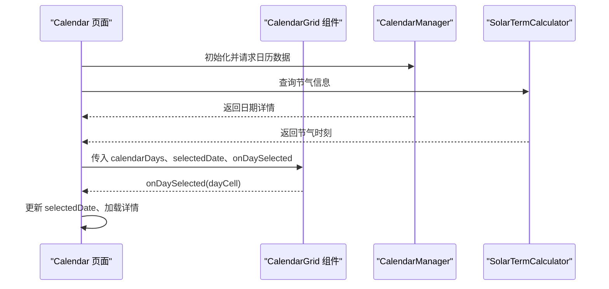
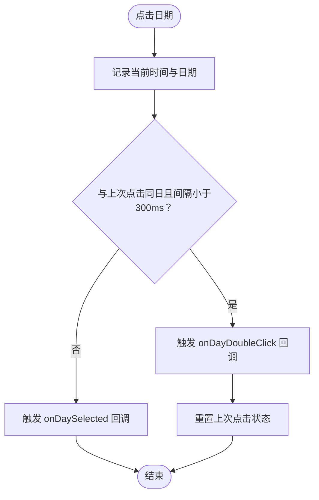
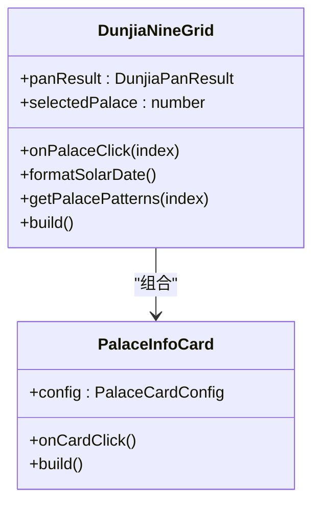
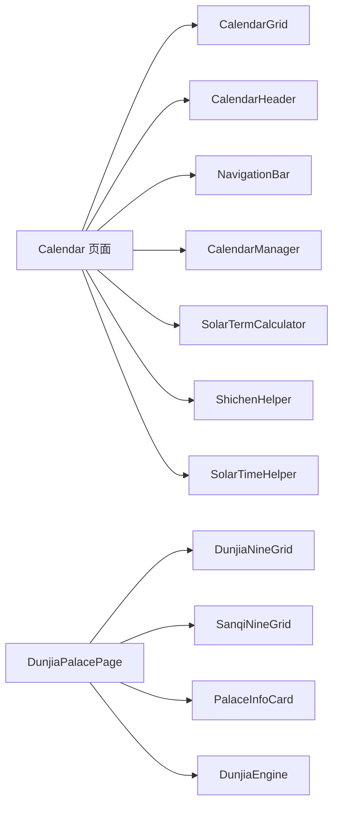

# 组件开发

<cite>
**本文引用的文件**
- [CalendarGrid.ets](file://entry/src/main/ets/components/CalendarGrid.ets)
- [DunjiaNineGrid.ets](file://entry/src/main/ets/components/DunjiaNineGrid.ets)
- [SanqiNineGrid.ets](file://entry/src/main/ets/components/SanqiNineGrid.ets)
- [PalaceInfoCard.ets](file://entry/src/main/ets/components/PalaceInfoCard.ets)
- [Calendar.ets](file://entry/src/main/ets/pages/Calendar.ets)
- [DunjiaPalacePage.ets](file://entry/src/main/ets/pages/DunjiaPalacePage.ets)
- [DunjiaEngine.ets](file://entry/src/main/ets/utils/DunjiaEngine.ets)
- [CalendarManager.ets](file://entry/src/main/ets/utils/CalendarManager.ets)
- [ShichenHelper.ets](file://entry/src/main/ets/utils/ShichenHelper.ets)
- [SolarTermCalculator.ets](file://entry/src/main/ets/utils/SolarTermCalculator.ets)
- [SolarTimeHelper.ets](file://entry/src/main/ets/utils/SolarTimeHelper.ets)
- [NavigationBar.ets](file://entry/src/main/ets/components/NavigationBar.ets)
- [CalendarHeader.ets](file://entry/src/main/ets/components/CalendarHeader.ets)
- [InfoCard.ets](file://entry/src/main/ets/components/InfoCard.ets)
- [List.test.ets](file://entry/src/test/List.test.ets)
</cite>

## 目录
1. [简介](#简介)
2. [项目结构](#项目结构)
3. [核心组件](#核心组件)
4. [架构总览](#架构总览)
5. [组件详解](#组件详解)
6. [依赖关系分析](#依赖关系分析)
7. [性能考量](#性能考量)
8. [故障排查指南](#故障排查指南)
9. [结论](#结论)
10. [附录](#附录)

## 简介
本指南面向组件化开发，围绕遁甲应用中的核心组件与页面，系统阐述设计理念、实现策略与最佳实践。内容涵盖：
- 组件开发范式：Props 输入、状态驱动、事件回调、Builder 渲染
- 生命周期与状态管理：页面级状态、组件内部状态、响应式更新
- 事件处理与交互：单击/双击、路由跳转、弹层控制
- 组件通信：父子通信（Props/回调）、页面间通信（路由参数）
- 组件复用：高内聚低耦合、统一样式与主题
- 样式与主题：颜色、字体、阴影、边框、圆角的统一管理
- 开发示例：CalendarGrid、DunjiaNineGrid 等核心组件的实现要点
- 测试方法：单元测试与集成测试思路

## 项目结构
项目采用页面-组件-工具分层组织，页面负责状态与业务流程，组件负责渲染与交互，工具模块封装算法与数据。

```mermaid
graph TB
subgraph "页面层"
P_Calendar["Calendar 页面"]
P_DunjiaPalace["DunjiaPalacePage 页面"]
end
subgraph "组件层"
C_CalendarGrid["CalendarGrid 日历网格"]
C_DunjiaNineGrid["DunjiaNineGrid 九宫格"]
C_SanqiNineGrid["SanqiNineGrid 三奇九宫"]
C_PalaceInfoCard["PalaceInfoCard 宫位卡片"]
C_NavBar["NavigationBar 导航栏"]
C_CalendarHeader["CalendarHeader 月份头部"]
C_InfoCard["InfoCard 信息卡片"]
end
subgraph "工具层"
U_DunjiaEngine["DunjiaEngine 排盘引擎"]
U_CalendarManager["CalendarManager 万年历"]
U_ShichenHelper["ShichenHelper 时辰工具"]
U_SolarTermCalculator["SolarTermCalculator 节气计算"]
U_SolarTimeHelper["SolarTimeHelper 真太阳时"]
end
P_Calendar --> C_CalendarGrid
P_Calendar --> C_CalendarHeader
P_Calendar --> C_NavBar
P_Calendar --> C_InfoCard
P_Calendar --> U_CalendarManager
P_Calendar --> U_ShichenHelper
P_Calendar --> U_SolarTermCalculator
P_Calendar --> U_SolarTimeHelper
P_DunjiaPalace --> C_DunjiaNineGrid
P_DunjiaPalace --> C_SanqiNineGrid
P_DunjiaPalace --> C_PalaceInfoCard
P_DunjiaPalace --> U_DunjiaEngine
```

图表来源
- [Calendar.ets](file://entry/src/main/ets/pages/Calendar.ets#L1-L602)
- [DunjiaPalacePage.ets](file://entry/src/main/ets/pages/DunjiaPalacePage.ets#L1-L1017)
- [CalendarGrid.ets](file://entry/src/main/ets/components/CalendarGrid.ets#L1-L167)
- [DunjiaNineGrid.ets](file://entry/src/main/ets/components/DunjiaNineGrid.ets#L1-L179)
- [SanqiNineGrid.ets](file://entry/src/main/ets/components/SanqiNineGrid.ets#L1-L169)
- [PalaceInfoCard.ets](file://entry/src/main/ets/components/PalaceInfoCard.ets#L1-L179)
- [NavigationBar.ets](file://entry/src/main/ets/components/NavigationBar.ets#L1-L86)
- [CalendarHeader.ets](file://entry/src/main/ets/components/CalendarHeader.ets#L1-L108)
- [InfoCard.ets](file://entry/src/main/ets/components/InfoCard.ets#L1-L114)
- [DunjiaEngine.ets](file://entry/src/main/ets/utils/DunjiaEngine.ets#L1-L961)
- [CalendarManager.ets](file://entry/src/main/ets/utils/CalendarManager.ets#L1-L123)
- [ShichenHelper.ets](file://entry/src/main/ets/utils/ShichenHelper.ets#L1-L114)
- [SolarTermCalculator.ets](file://entry/src/main/ets/utils/SolarTermCalculator.ets#L1-L375)
- [SolarTimeHelper.ets](file://entry/src/main/ets/utils/SolarTimeHelper.ets#L1-L270)

章节来源
- [Calendar.ets](file://entry/src/main/ets/pages/Calendar.ets#L1-L602)
- [DunjiaPalacePage.ets](file://entry/src/main/ets/pages/DunjiaPalacePage.ets#L1-L1017)

## 核心组件
- 日历网格组件 CalendarGrid：渲染星期标题与 6×7 日期网格，支持选中态、今日高亮、节日标记、单击/双击事件。
- 九宫格组件 DunjiaNineGrid：展示遁甲九宫排盘，包含时间信息、局数、格局徽章与宫位卡片。
- 三奇九宫组件 SanqiNineGrid：聚焦三奇标识与应验方位，强调乙丙丁三奇宫位。
- 宫位卡片 PalaceInfoCard：渲染单个宫位的九星、八门、天地盘、八神、地支与格局徽章，并支持点击。
- 信息卡片 InfoCard：通用信息卡片，支持标题、副标题、摘要、等级标签与标签列表。
- 导航栏 NavigationBar：统一导航栏，支持自定义标题、返回与右侧操作。
- 月份头部 CalendarHeader：提供年月切换与“今天”入口。

章节来源
- [CalendarGrid.ets](file://entry/src/main/ets/components/CalendarGrid.ets#L1-L167)
- [DunjiaNineGrid.ets](file://entry/src/main/ets/components/DunjiaNineGrid.ets#L1-L179)
- [SanqiNineGrid.ets](file://entry/src/main/ets/components/SanqiNineGrid.ets#L1-L169)
- [PalaceInfoCard.ets](file://entry/src/main/ets/components/PalaceInfoCard.ets#L1-L179)
- [InfoCard.ets](file://entry/src/main/ets/components/InfoCard.ets#L1-L114)
- [NavigationBar.ets](file://entry/src/main/ets/components/NavigationBar.ets#L1-L86)
- [CalendarHeader.ets](file://entry/src/main/ets/components/CalendarHeader.ets#L1-L108)

## 架构总览
页面通过 Props 将数据与回调传递给组件；组件内部通过状态与事件回调完成交互；工具模块提供算法与数据服务，保证数据一致性与可维护性。

图表来源
- [Calendar.ets](file://entry/src/main/ets/pages/Calendar.ets#L1-L602)
- [CalendarGrid.ets](file://entry/src/main/ets/components/CalendarGrid.ets#L1-L167)
- [CalendarManager.ets](file://entry/src/main/ets/utils/CalendarManager.ets#L1-L123)
- [SolarTermCalculator.ets](file://entry/src/main/ets/utils/SolarTermCalculator.ets#L1-L375)

## 组件详解

### CalendarGrid 组件
- 设计目标：渲染日历网格，支持日期选中、今日高亮、节日标记、单击/双击事件。
- 关键实现：
  - Props 输入：calendarDays、selectedDate、onDaySelected/onDayDoubleClick
  - 选中态判定：比较年月日
  - 今日高亮：与系统当前日期比较
  - 双击检测：记录上次点击时间与日期，300ms 内为双击
  - 样式：背景色、边框、圆角、边框宽度/颜色随状态变化
- 交互流程：点击日期 -> 判断单击/双击 -> 触发回调 -> 页面更新状态

图表来源
- [CalendarGrid.ets](file://entry/src/main/ets/components/CalendarGrid.ets#L144-L164)

章节来源
- [CalendarGrid.ets](file://entry/src/main/ets/components/CalendarGrid.ets#L1-L167)

### DunjiaNineGrid 组件
- 设计目标：展示遁甲九宫排盘，包含时间信息、局数、格局徽章与宫位卡片。
- 关键实现：
  - Props 输入：panResult、selectedPalace、onPalaceClick
  - 时间信息：阳历、农历、真太阳时偏移
  - 格局徽章：根据宫位匹配 gejuPatterns
  - 宫位布局：按传统方位（上南下北）组织 3×3 网格
  - 点击处理：触发 onPalaceClick 回调
- 依赖：PalaceInfoCard 子组件

图表来源
- [DunjiaNineGrid.ets](file://entry/src/main/ets/components/DunjiaNineGrid.ets#L1-L179)
- [PalaceInfoCard.ets](file://entry/src/main/ets/components/PalaceInfoCard.ets#L1-L179)

章节来源
- [DunjiaNineGrid.ets](file://entry/src/main/ets/components/DunjiaNineGrid.ets#L1-L179)
- [PalaceInfoCard.ets](file://entry/src/main/ets/components/PalaceInfoCard.ets#L1-L179)

### SanqiNineGrid 组件
- 设计目标：三奇择日九宫，突出三奇（乙、丙、丁）标识与应验方位。
- 关键实现：
  - Props 输入：panResult、selectedPalace、onPalaceClick
  - 三奇标识：根据天干为乙/丙/丁时高亮显示
  - 值符/值使角标：符/使角标样式与阴影
  - 布局：按传统方位组织宫位
- 与 DunjiaNineGrid 的差异：不显示八神、不显示格局徽章，强调三奇应验

章节来源
- [SanqiNineGrid.ets](file://entry/src/main/ets/components/SanqiNineGrid.ets#L1-L169)

### PalaceInfoCard 组件
- 设计目标：渲染单个宫位的完整信息，支持值符/值使标识与格局徽章。
- 关键实现：
  - Props 输入：config（包含 PalaceState、索引、选中态、值符/值使、格局）
  - 地支映射：根据宫位索引映射到地支
  - 徽章颜色：按格局类型分配颜色
  - 点击处理：触发 onCardClick 回调

章节来源
- [PalaceInfoCard.ets](file://entry/src/main/ets/components/PalaceInfoCard.ets#L1-L179)

### InfoCard 组件
- 设计目标：通用信息卡片，支持标题、副标题、摘要、等级标签与标签列表。
- 关键实现：
  - Props 输入：title、subtitle、summary、level、tags、accentColor、cardBackgroundColor、showShadow
  - 点击处理：触发 onCardClick 回调
  - 样式：统一圆角、阴影、边框与配色

章节来源
- [InfoCard.ets](file://entry/src/main/ets/components/InfoCard.ets#L1-L114)

### NavigationBar 与 CalendarHeader 组件
- NavigationBar：统一导航栏，支持自定义标题、返回与右侧操作按钮。
- CalendarHeader：提供年月切换与“今天”入口，可复用。

章节来源
- [NavigationBar.ets](file://entry/src/main/ets/components/NavigationBar.ets#L1-L86)
- [CalendarHeader.ets](file://entry/src/main/ets/components/CalendarHeader.ets#L1-L108)

### 页面与组件通信
- Calendar 页面与 CalendarGrid：通过 Props 传入 calendarDays、selectedDate，并接收 onDaySelected/onDayDoubleClick 回调，实现日期选择与双击进入排盘。
- DunjiaPalacePage 页面与 DunjiaNineGrid/SanqiNineGrid：通过 Props 传入 panResult、selectedPalace，并接收 onPalaceClick 回调，实现宫位选择与详情展示。

章节来源
- [Calendar.ets](file://entry/src/main/ets/pages/Calendar.ets#L1-L602)
- [DunjiaPalacePage.ets](file://entry/src/main/ets/pages/DunjiaPalacePage.ets#L1-L1017)

## 依赖关系分析
- 页面依赖组件：Calendar 页面依赖 CalendarGrid、CalendarHeader、NavigationBar、InfoCard；DunjiaPalacePage 依赖 DunjiaNineGrid、SanqiNineGrid、PalaceInfoCard。
- 组件依赖工具：CalendarGrid 依赖 CalendarManager、SolarTermCalculator、ShichenHelper、SolarTimeHelper；DunjiaNineGrid 依赖 DunjiaEngine；PalaceInfoCard 依赖 DunjiaEngine 数据模型。
- 数据流向：页面状态驱动组件渲染，组件通过回调反馈用户交互，工具模块提供数据与算法支持。

图表来源
- [Calendar.ets](file://entry/src/main/ets/pages/Calendar.ets#L1-L602)
- [DunjiaPalacePage.ets](file://entry/src/main/ets/pages/DunjiaPalacePage.ets#L1-L1017)
- [CalendarGrid.ets](file://entry/src/main/ets/components/CalendarGrid.ets#L1-L167)
- [DunjiaNineGrid.ets](file://entry/src/main/ets/components/DunjiaNineGrid.ets#L1-L179)
- [SanqiNineGrid.ets](file://entry/src/main/ets/components/SanqiNineGrid.ets#L1-L169)
- [PalaceInfoCard.ets](file://entry/src/main/ets/components/PalaceInfoCard.ets#L1-L179)
- [CalendarManager.ets](file://entry/src/main/ets/utils/CalendarManager.ets#L1-L123)
- [SolarTermCalculator.ets](file://entry/src/main/ets/utils/SolarTermCalculator.ets#L1-L375)
- [ShichenHelper.ets](file://entry/src/main/ets/utils/ShichenHelper.ets#L1-L114)
- [SolarTimeHelper.ets](file://entry/src/main/ets/utils/SolarTimeHelper.ets#L1-L270)
- [DunjiaEngine.ets](file://entry/src/main/ets/utils/DunjiaEngine.ets#L1-L961)

章节来源
- [Calendar.ets](file://entry/src/main/ets/pages/Calendar.ets#L1-L602)
- [DunjiaPalacePage.ets](file://entry/src/main/ets/pages/DunjiaPalacePage.ets#L1-L1017)

## 性能考量
- 批量数据加载：Calendar 页面在生成日历网格时，先收集所有日期再批量查询 CalendarManager，减少多次 IO。
- 缓存策略：CalendarManager 对年数据进行缓存，避免重复读取资源文件。
- 异步计算：DunjiaPalacePage 在 aboutToAppear 生命周期中异步执行排盘计算，避免阻塞 UI。
- 样式与阴影：合理使用阴影与边框，避免过度阴影导致绘制开销增加。
- 字体与字号：统一字号与字重，减少样式分支带来的重绘成本。

## 故障排查指南
- 日历网格无数据：检查 CalendarManager 初始化与资源路径，确认 getDayInfo 返回值。
- 选中态不生效：核对 isSelectedDate 的比较逻辑（年/月/日）。
- 三奇标识不显示：确认天干是否为乙/丙/丁，SanqiNineGrid 的颜色与阴影条件。
- 排盘计算异常：检查 DunjiaEngine 的输入参数（时间、经度、场景类型），捕获异常并设置 loading 状态。
- 真太阳时偏差：核对 SolarTimeHelper 的经度设置与均时差计算。

章节来源
- [CalendarManager.ets](file://entry/src/main/ets/utils/CalendarManager.ets#L1-L123)
- [CalendarGrid.ets](file://entry/src/main/ets/components/CalendarGrid.ets#L1-L167)
- [SanqiNineGrid.ets](file://entry/src/main/ets/components/SanqiNineGrid.ets#L1-L169)
- [DunjiaPalacePage.ets](file://entry/src/main/ets/pages/DunjiaPalacePage.ets#L1-L1017)
- [SolarTimeHelper.ets](file://entry/src/main/ets/utils/SolarTimeHelper.ets#L1-L270)

## 结论
本项目通过清晰的页面-组件-工具分层，实现了高内聚低耦合的组件化架构。CalendarGrid、DunjiaNineGrid、SanqiNineGrid 等核心组件具备良好的可复用性与扩展性，配合统一的样式与主题策略，能够支撑复杂业务场景下的 UI 一致性与交互体验。建议在后续开发中持续完善测试体系与文档，确保组件质量与可维护性。

## 附录

### 组件开发最佳实践
- Props 设计：保持单一职责，避免过度嵌套；使用明确的类型与默认值。
- 状态管理：页面集中管理状态，组件内部仅维护必要局部状态；通过回调向上反馈。
- 事件处理：区分单击与双击，避免冲突；统一事件命名与参数结构。
- 样式统一：建立颜色、字体、阴影、边框、圆角的规范；通过 Props 支持主题定制。
- 组件复用：抽象通用能力（如 InfoCard、NavigationBar），降低重复代码。
- 主题定制：通过全局变量或上下文注入主题色，组件内部按需覆盖。

### 样式与主题管理
- 颜色体系：使用统一的颜色变量（如主色调、辅助色、中性色）。
- 字体体系：统一字号、字重与行高，确保可读性与一致性。
- 阴影与边框：限定阴影范围与透明度，避免过度渲染。
- 圆角与间距：建立圆角与间距规范，提升视觉层次。

### 组件测试方法与工具
- 单元测试：针对纯函数与工具类（如 ShichenHelper、SolarTermCalculator）编写测试用例，验证计算准确性。
- 集成测试：在页面中模拟用户交互（如点击、双击、切换月份），验证组件回调与状态更新。
- 示例测试入口：项目已提供测试入口文件，可作为测试组织的起点。

章节来源
- [List.test.ets](file://entry/src/test/List.test.ets#L1-L5)