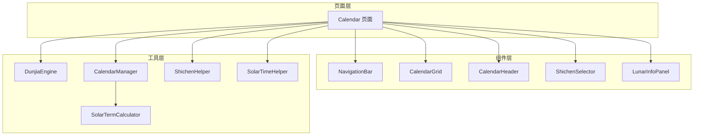
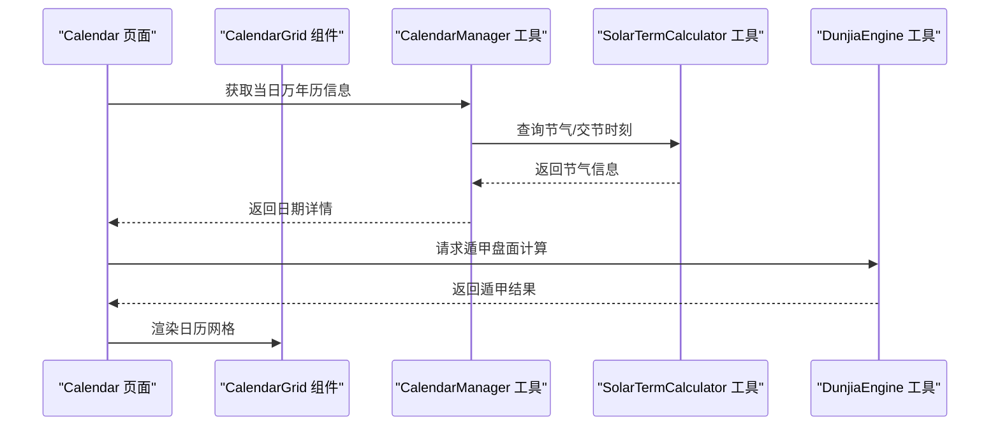
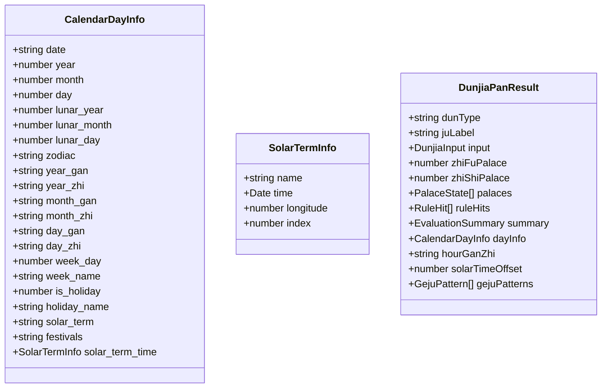
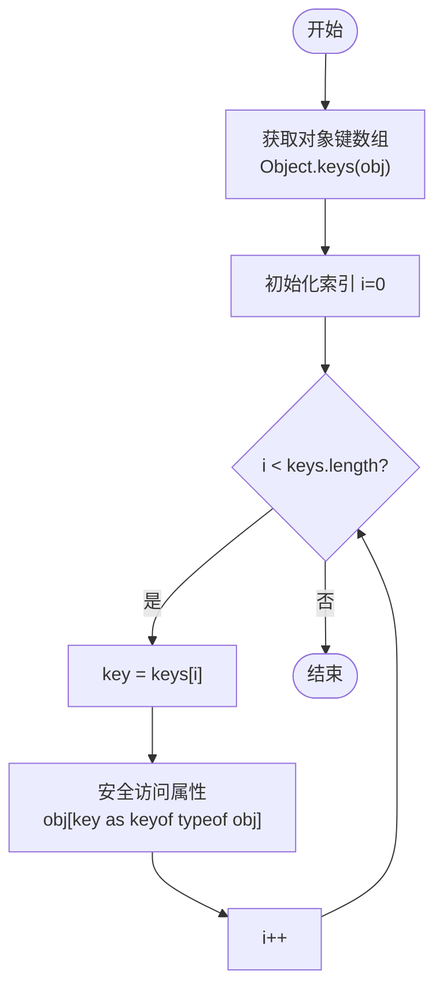
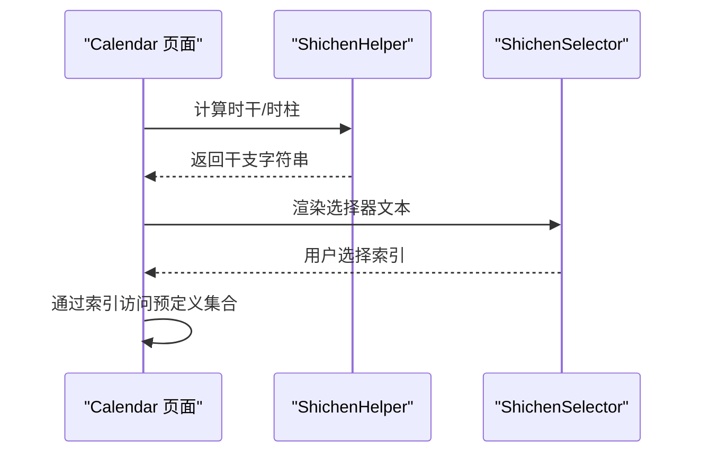
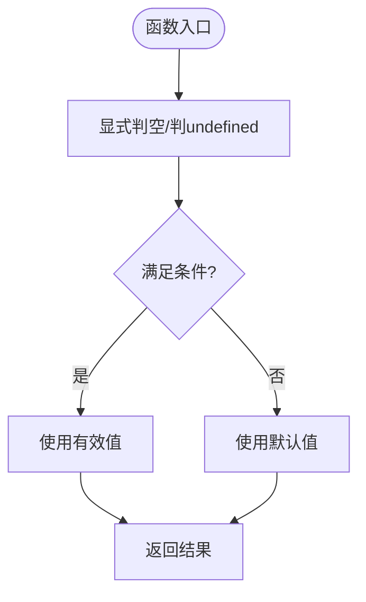
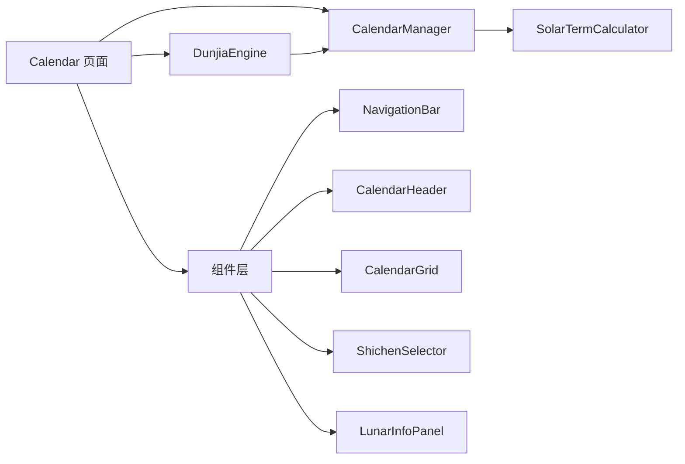

# 编码规范

<cite>
**本文引用的文件**
- [ArkTS开发规范指南.md](file://ArkTS开发规范指南.md)
- [code-linter.json5](file://code-linter.json5)
- [DunjiaEngine.ets](file://entry/src/main/ets/utils/DunjiaEngine.ets)
- [SolarTermCalculator.ets](file://entry/src/main/ets/utils/SolarTermCalculator.ets)
- [CalendarManager.ets](file://entry/src/main/ets/utils/CalendarManager.ets)
- [CalendarGrid.ets](file://entry/src/main/ets/components/CalendarGrid.ets)
- [Calendar.ets](file://entry/src/main/ets/pages/Calendar.ets)
- [ShichenHelper.ets](file://entry/src/main/ets/utils/ShichenHelper.ets)
- [SolarTimeHelper.ets](file://entry/src/main/ets/utils/SolarTimeHelper.ets)
- [NavigationBar.ets](file://entry/src/main/ets/components/NavigationBar.ets)
- [CalendarHeader.ets](file://entry/src/main/ets/components/CalendarHeader.ets)
- [ShichenSelector.ets](file://entry/src/main/ets/components/ShichenSelector.ets)
- [LunarInfoPanel.ets](file://entry/src/main/ets/components/LunarInfoPanel.ets)
</cite>

## 目录
1. [简介](#简介)
2. [项目结构](#项目结构)
3. [核心组件](#核心组件)
4. [架构总览](#架构总览)
5. [详细组件分析](#详细组件分析)
6. [依赖分析](#依赖分析)
7. [性能考虑](#性能考虑)
8. [故障排查指南](#故障排查指南)
9. [结论](#结论)
10. [附录](#附录)

## 简介
本文件依据项目内的《ArkTS开发规范指南》与实际代码实现，系统化整理了ArkTS开发的编码规范与限制要求，重点覆盖：
- 类型系统的严格限制与替代方案
- 循环语句使用规范与对象遍历限制
- 属性访问安全性与动态索引限制
- 接口定义的重要性与正确范式
- 函数与方法规范、解构与展开等现代语法的替代
- 错误处理与性能优化最佳实践

## 项目结构
项目采用ArkTS + ArkUI的页面/组件/工具分层组织：
- 页面层：Calendar 等页面组件，负责交互与路由
- 组件层：NavigationBar、CalendarGrid、ShichenSelector、LunarInfoPanel 等UI组件
- 工具层：DunjiaEngine、SolarTermCalculator、CalendarManager、ShichenHelper、SolarTimeHelper 等业务与算法工具
- 规范与质量：ArkTS开发规范指南、linter配置

图表来源
- [Calendar.ets](file://entry/src/main/ets/pages/Calendar.ets#L1-L602)
- [NavigationBar.ets](file://entry/src/main/ets/components/NavigationBar.ets#L1-L86)
- [CalendarHeader.ets](file://entry/src/main/ets/components/CalendarHeader.ets#L1-L108)
- [CalendarGrid.ets](file://entry/src/main/ets/components/CalendarGrid.ets#L1-L167)
- [ShichenSelector.ets](file://entry/src/main/ets/components/ShichenSelector.ets#L1-L133)
- [LunarInfoPanel.ets](file://entry/src/main/ets/components/LunarInfoPanel.ets#L1-L142)
- [DunjiaEngine.ets](file://entry/src/main/ets/utils/DunjiaEngine.ets#L1-L961)
- [SolarTermCalculator.ets](file://entry/src/main/ets/utils/SolarTermCalculator.ets#L1-L375)
- [CalendarManager.ets](file://entry/src/main/ets/utils/CalendarManager.ets#L1-L123)
- [ShichenHelper.ets](file://entry/src/main/ets/utils/ShichenHelper.ets#L1-L114)
- [SolarTimeHelper.ets](file://entry/src/main/ets/utils/SolarTimeHelper.ets#L1-L270)

章节来源
- [Calendar.ets](file://entry/src/main/ets/pages/Calendar.ets#L1-L602)

## 核心组件
- 类型系统限制与替代
  - 禁止 any/unknown；禁止索引签名与内联对象字面量类型；必须显式接口定义与类型注解
  - 替代：使用 Map/Record、switch 分支、明确接口与类型守卫
- 循环与对象遍历
  - 禁止 for...in / for...of 用于对象；数组可使用 for...of；对象遍历使用传统循环 + Object.keys
- 属性访问安全
  - 禁止动态索引 obj[key]；使用明确属性名或 switch/Map
- 函数与方法
  - 禁止解构赋值、展开运算符、可选链、空值合并；替代：逐项赋值、显式拼接、显式判空
- 静态方法
  - 静态方法中禁止 this；必须使用 ClassName.method()

章节来源
- [ArkTS开发规范指南.md](file://ArkTS开发规范指南.md#L8-L397)

## 架构总览
下图展示了页面与组件、工具之间的调用关系，体现类型安全与职责分离：

图表来源
- [Calendar.ets](file://entry/src/main/ets/pages/Calendar.ets#L1-L602)
- [CalendarManager.ets](file://entry/src/main/ets/utils/CalendarManager.ets#L1-L123)
- [SolarTermCalculator.ets](file://entry/src/main/ets/utils/SolarTermCalculator.ets#L1-L375)
- [DunjiaEngine.ets](file://entry/src/main/ets/utils/DunjiaEngine.ets#L1-L961)
- [CalendarGrid.ets](file://entry/src/main/ets/components/CalendarGrid.ets#L1-L167)

## 详细组件分析

### 类型系统与接口定义
- 规范要点
  - 禁止 any/unknown；禁止索引签名与内联对象字面量类型
  - 所有对象必须预先定义接口，函数返回值与复杂变量必须显式类型注解
- 代码映射
  - 接口定义广泛存在于工具与组件中，如 CalendarDayInfo、SolarTermInfo、DunjiaPanResult 等
  - 页面与组件通过明确接口消费数据，避免隐式类型推断
- 替代方案
  - 使用 Map/Record 替代动态对象
  - 使用 switch 或 Map 进行动态属性访问
  - 使用工具类封装数组/对象操作，避免解构与展开

图表来源
- [CalendarManager.ets](file://entry/src/main/ets/utils/CalendarManager.ets#L5-L28)
- [SolarTermCalculator.ets](file://entry/src/main/ets/utils/SolarTermCalculator.ets#L23-L28)
- [DunjiaEngine.ets](file://entry/src/main/ets/utils/DunjiaEngine.ets#L21-L84)

章节来源
- [ArkTS开发规范指南.md](file://ArkTS开发规范指南.md#L8-L170)
- [CalendarManager.ets](file://entry/src/main/ets/utils/CalendarManager.ets#L5-L28)
- [SolarTermCalculator.ets](file://entry/src/main/ets/utils/SolarTermCalculator.ets#L23-L28)
- [DunjiaEngine.ets](file://entry/src/main/ets/utils/DunjiaEngine.ets#L21-L84)

### 循环与对象遍历
- 规范要点
  - 禁止 for...in / for...of 用于对象；数组可使用 for...of
  - 对象遍历使用传统循环 + Object.keys，并配合类型断言保证安全
- 代码映射
  - 页面与组件中常见 for...of 用于数组渲染
  - 对象遍历统一通过 Object.keys + 传统循环实现

图表来源
- [ArkTS开发规范指南.md](file://ArkTS开发规范指南.md#L47-L83)
- [CalendarGrid.ets](file://entry/src/main/ets/components/CalendarGrid.ets#L75-L82)

章节来源
- [ArkTS开发规范指南.md](file://ArkTS开发规范指南.md#L47-L83)
- [CalendarGrid.ets](file://entry/src/main/ets/components/CalendarGrid.ets#L75-L82)

### 属性访问安全与动态索引
- 规范要点
  - 禁止动态索引 obj[key]；必须使用明确属性名或类型安全方式
  - 替代：switch 分支、Map、Record
- 代码映射
  - 页面与组件通过明确属性名访问，避免运行时动态键
  - 工具类中通过 switch 或 Map 实现动态访问

图表来源
- [ShichenHelper.ets](file://entry/src/main/ets/utils/ShichenHelper.ets#L59-L100)
- [ShichenSelector.ets](file://entry/src/main/ets/components/ShichenSelector.ets#L80-L131)
- [Calendar.ets](file://entry/src/main/ets/pages/Calendar.ets#L228-L248)

章节来源
- [ArkTS开发规范指南.md](file://ArkTS开发规范指南.md#L85-L128)
- [ShichenHelper.ets](file://entry/src/main/ets/utils/ShichenHelper.ets#L59-L100)
- [ShichenSelector.ets](file://entry/src/main/ets/components/ShichenSelector.ets#L80-L131)

### 函数与方法规范
- 规范要点
  - 禁止解构赋值、展开运算符、可选链、空值合并
  - 替代：逐项赋值、显式拼接、显式判空
- 代码映射
  - 页面与组件中通过传统赋值与显式拼接实现功能
  - 工具类中通过显式条件判断替代可选链与空值合并

图表来源
- [ArkTS开发规范指南.md](file://ArkTS开发规范指南.md#L241-L297)
- [Calendar.ets](file://entry/src/main/ets/pages/Calendar.ets#L250-L257)

章节来源
- [ArkTS开发规范指南.md](file://ArkTS开发规范指南.md#L241-L297)
- [Calendar.ets](file://entry/src/main/ets/pages/Calendar.ets#L250-L257)

### 静态方法限制
- 规范要点
  - 静态方法中禁止 this；必须使用 ClassName.method()
- 代码映射
  - 工具类中通过类名直接调用静态方法，避免 this 引用

章节来源
- [ArkTS开发规范指南.md](file://ArkTS开发规范指南.md#L299-L339)
- [DunjiaEngine.ets](file://entry/src/main/ets/utils/DunjiaEngine.ets#L98-L108)

### 类型推断与显式注解
- 规范要点
  - 函数返回值、复杂变量、类属性必须显式类型注解
- 代码映射
  - 工具类与页面中大量使用显式接口与类型注解，确保类型安全

章节来源
- [ArkTS开发规范指南.md](file://ArkTS开发规范指南.md#L341-L393)
- [DunjiaEngine.ets](file://entry/src/main/ets/utils/DunjiaEngine.ets#L98-L162)

### 实用技巧与常见场景
- 快速错误定位：依据编译错误代码识别违规类型
- 类型安全优先：优先使用类型安全API，避免类型断言
- 清晰接口层次：为数据结构定义明确接口，使用接口继承
- 枚举与联合类型：提升可读性与约束范围
- 工具类与辅助方法：封装数组/对象操作，避免现代语法

章节来源
- [ArkTS开发规范指南.md](file://ArkTS开发规范指南.md#L395-L458)
- [DunjiaEngine.ets](file://entry/src/main/ets/utils/DunjiaEngine.ets#L424-L462)

## 依赖分析
- 组件耦合
  - 页面依赖多个工具类与组件，组件之间通过 props 传递数据，降低耦合
- 工具依赖
  - CalendarManager 依赖 SolarTermCalculator；DunjiaEngine 依赖 CalendarManager 与 SolarTermCalculator
- 类型依赖
  - 所有数据结构通过明确接口定义，避免隐式类型推断

图表来源
- [Calendar.ets](file://entry/src/main/ets/pages/Calendar.ets#L1-L602)
- [CalendarManager.ets](file://entry/src/main/ets/utils/CalendarManager.ets#L1-L123)
- [SolarTermCalculator.ets](file://entry/src/main/ets/utils/SolarTermCalculator.ets#L1-L375)
- [DunjiaEngine.ets](file://entry/src/main/ets/utils/DunjiaEngine.ets#L1-L961)
- [NavigationBar.ets](file://entry/src/main/ets/components/NavigationBar.ets#L1-L86)
- [CalendarHeader.ets](file://entry/src/main/ets/components/CalendarHeader.ets#L1-L108)
- [CalendarGrid.ets](file://entry/src/main/ets/components/CalendarGrid.ets#L1-L167)
- [ShichenSelector.ets](file://entry/src/main/ets/components/ShichenSelector.ets#L1-L133)
- [LunarInfoPanel.ets](file://entry/src/main/ets/components/LunarInfoPanel.ets#L1-L142)

章节来源
- [Calendar.ets](file://entry/src/main/ets/pages/Calendar.ets#L1-L602)

## 性能考虑
- 避免不必要的对象创建：减少循环中临时对象的频繁分配
- 缓存计算结果：对昂贵计算使用 Map 缓存
- 批量操作优化：批量更新优于多次单独操作
- 组件渲染优化：通过状态最小化与合理拆分组件，减少重绘

章节来源
- [ArkTS开发规范指南.md](file://ArkTS开发规范指南.md#L660-L729)
- [DunjiaEngine.ets](file://entry/src/main/ets/utils/DunjiaEngine.ets#L686-L704)

## 故障排查指南
- 常见编译错误与解决方案
  - 动态索引访问被禁止：改用 switch 或 Map
  - 索引签名被禁止：改用 Map 或 Record
  - 内联对象字面量类型被禁止：预定义接口
  - 静态方法中使用 this：改用类名调用
  - 解构赋值/展开运算符/可选链/空值合并被禁止：改用显式赋值与判空
  - 函数缺少返回类型注解：添加明确返回类型
- 检查清单
  - 未使用 any/unknown、索引签名、内联对象字面量
  - 对象访问使用明确属性名
  - 对象遍历使用传统循环
  - 静态方法使用类名调用
  - 未使用解构/展开/可选链/空值合并
  - 所有函数与复杂变量有显式类型注解

章节来源
- [ArkTS开发规范指南.md](file://ArkTS开发规范指南.md#L749-L800)

## 结论
本规范文档基于项目现有实现与规范指南，明确了ArkTS开发中的类型、循环、属性访问、函数方法、静态方法与类型推断等关键限制与替代方案。通过接口定义、传统语法与工具类封装，项目实现了强类型与高可维护性。建议在后续开发中持续遵循规范，配合 linter 与检查清单，确保代码质量与一致性。

## 附录
- 规范与质量配置
  - linter 配置启用性能与TypeScript ESLint规则，覆盖安全与性能相关插件

章节来源
- [code-linter.json5](file://code-linter.json5#L1-L32)