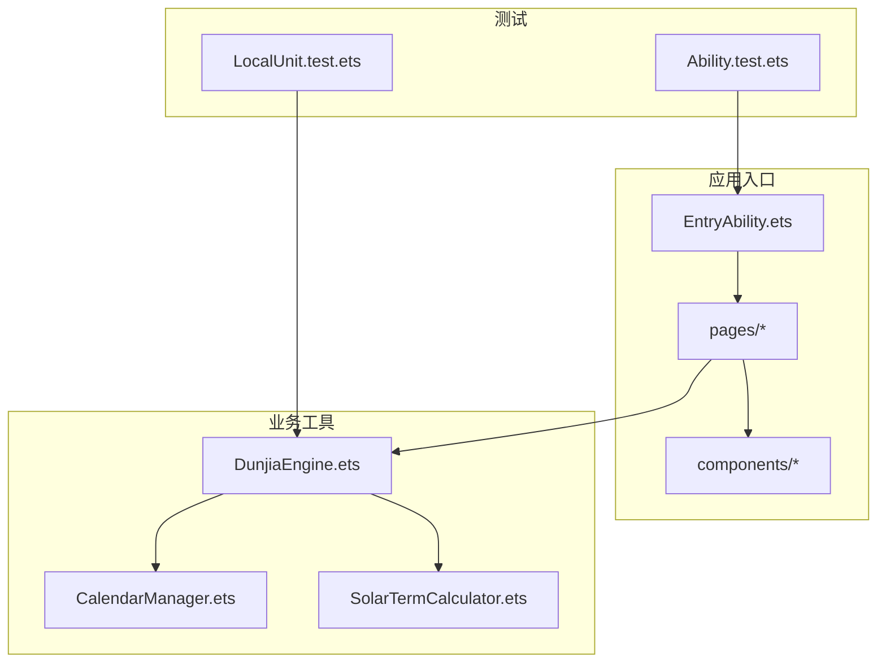
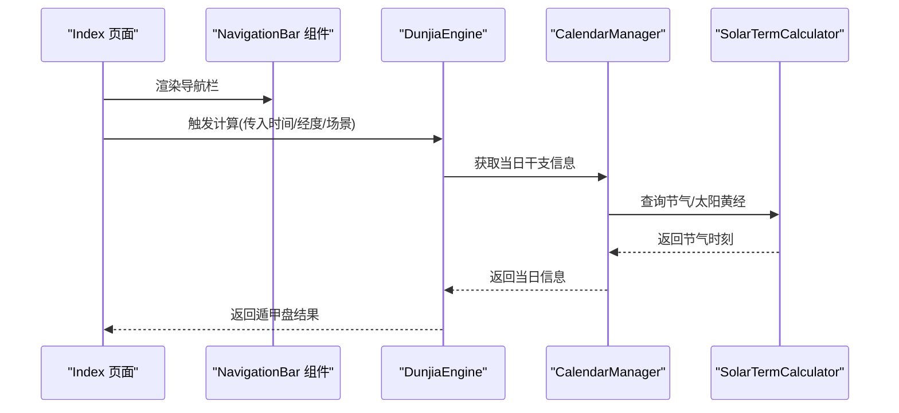
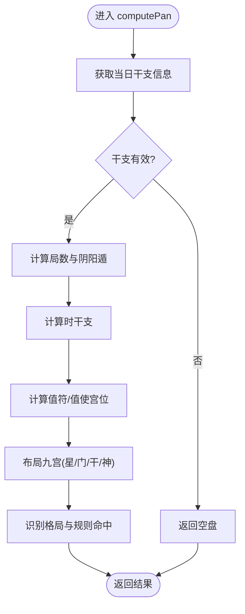
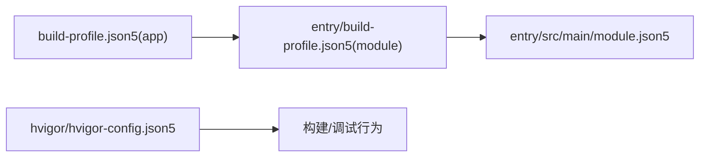

# 调试与性能分析

<cite>
**本文引用的文件**   
- [entry/src/main/ets/pages/Index.ets](file://entry/src/main/ets/pages/Index.ets)
- [entry/src/main/ets/utils/DunjiaEngine.ets](file://entry/src/main/ets/utils/DunjiaEngine.ets)
- [entry/src/main/ets/utils/SolarTermCalculator.ets](file://entry/src/main/ets/utils/SolarTermCalculator.ets)
- [entry/src/main/ets/utils/CalendarManager.ets](file://entry/src/main/ets/utils/CalendarManager.ets)
- [entry/src/main/ets/components/NavigationBar.ets](file://entry/src/main/ets/components/NavigationBar.ets)
- [entry/src/main/ets/entryability/EntryAbility.ets](file://entry/src/main/ets/entryability/EntryAbility.ets)
- [entry/src/ohosTest/ets/test/Ability.test.ets](file://entry/src/ohosTest/ets/test/Ability.test.ets)
- [entry/src/test/LocalUnit.test.ets](file://entry/src/test/LocalUnit.test.ets)
- [build-profile.json5](file://build-profile.json5)
- [entry/build-profile.json5](file://entry/build-profile.json5)
- [entry/src/main/module.json5](file://entry/src/main/module.json5)
- [hvigor/hvigor-config.json5](file://hvigor/hvigor-config.json5)
- [ArkTS开发规范指南.md](file://ArkTS开发规范指南.md)
- [鸿蒙命令行编译助手.md](file://鸿蒙命令行编译助手.md)
</cite>

## 目录
1. [简介](#简介)
2. [项目结构](#项目结构)
3. [核心组件](#核心组件)
4. [架构总览](#架构总览)
5. [详细组件分析](#详细组件分析)
6. [依赖分析](#依赖分析)
7. [性能考量](#性能考量)
8. [故障排查指南](#故障排查指南)
9. [结论](#结论)
10. [附录](#附录)

## 简介
本指南面向使用 DevEco Studio 开发的 ArkTS/HarmonyOS 应用工程师，聚焦于调试与性能分析的实操方法。内容涵盖：
- 断点设置、变量监控与调用栈分析
- 远程调试与真机调试配置
- 在不同设备上的调试策略
- 性能分析工具使用：内存、CPU、渲染
- 日志系统配置与运行时日志采集
- 网络请求调试与 API 响应时间监控
- 内存泄漏检测与修复路径
- 性能瓶颈定位与优化实例

## 项目结构
本项目采用模块化组织，入口模块为 entry，包含页面、组件、工具类与测试用例。关键路径如下：
- 页面与入口能力：entry/src/main/ets/pages、entry/src/main/ets/entryability
- 工具类：entry/src/main/ets/utils（包含核心计算引擎与日历/节气工具）
- 组件：entry/src/main/ets/components
- 测试：entry/src/test、entry/src/ohosTest
- 构建与签名配置：build-profile.json5、entry/build-profile.json5、entry/src/main/module.json5
- 构建执行配置：hvigor/hvigor-config.json5

**图表来源**
- [entry/src/main/ets/entryability/EntryAbility.ets](file://entry/src/main/ets/entryability/EntryAbility.ets#L1-L60)
- [entry/src/main/ets/pages/Index.ets](file://entry/src/main/ets/pages/Index.ets#L1-L88)
- [entry/src/main/ets/components/NavigationBar.ets](file://entry/src/main/ets/components/NavigationBar.ets#L1-L86)
- [entry/src/main/ets/utils/DunjiaEngine.ets](file://entry/src/main/ets/utils/DunjiaEngine.ets#L1-L120)
- [entry/src/main/ets/utils/CalendarManager.ets](file://entry/src/main/ets/utils/CalendarManager.ets#L1-L123)
- [entry/src/main/ets/utils/SolarTermCalculator.ets](file://entry/src/main/ets/utils/SolarTermCalculator.ets#L1-L80)
- [entry/src/test/LocalUnit.test.ets](file://entry/src/test/LocalUnit.test.ets#L1-L52)
- [entry/src/ohosTest/ets/test/Ability.test.ets](file://entry/src/ohosTest/ets/test/Ability.test.ets#L1-L35)

**章节来源**
- [entry/src/main/module.json5](file://entry/src/main/module.json5#L1-L50)
- [build-profile.json5](file://build-profile.json5#L1-L56)
- [entry/build-profile.json5](file://entry/build-profile.json5#L1-L33)

## 核心组件
- 入口能力与生命周期：EntryAbility 提供应用前后台切换与窗口销毁的生命周期钩子，便于在调试阶段插入日志与断点。
- 页面与导航：Index 页面承载首页交互；NavigationBar 组件提供统一导航栏，便于测试导航链路与事件触发。
- 核心引擎：DunjiaEngine 负责遁甲盘面计算，包含大量同步/异步计算与缓存逻辑，是性能分析与内存监控的重点对象。
- 日历与节气：CalendarManager 与 SolarTermCalculator 提供日期与节气数据，涉及资源读取与缓存，适合进行 I/O 与缓存命中率分析。

**章节来源**
- [entry/src/main/ets/entryability/EntryAbility.ets](file://entry/src/main/ets/entryability/EntryAbility.ets#L31-L48)
- [entry/src/main/ets/pages/Index.ets](file://entry/src/main/ets/pages/Index.ets#L1-L88)
- [entry/src/main/ets/components/NavigationBar.ets](file://entry/src/main/ets/components/NavigationBar.ets#L1-L86)
- [entry/src/main/ets/utils/DunjiaEngine.ets](file://entry/src/main/ets/utils/DunjiaEngine.ets#L98-L162)
- [entry/src/main/ets/utils/CalendarManager.ets](file://entry/src/main/ets/utils/CalendarManager.ets#L30-L92)
- [entry/src/main/ets/utils/SolarTermCalculator.ets](file://entry/src/main/ets/utils/SolarTermCalculator.ets#L30-L86)

## 架构总览
下图展示了从页面到核心引擎与工具类的数据流与调用关系，有助于在调试时快速定位问题来源。

**图表来源**
- [entry/src/main/ets/pages/Index.ets](file://entry/src/main/ets/pages/Index.ets#L1-L88)
- [entry/src/main/ets/components/NavigationBar.ets](file://entry/src/main/ets/components/NavigationBar.ets#L1-L86)
- [entry/src/main/ets/utils/DunjiaEngine.ets](file://entry/src/main/ets/utils/DunjiaEngine.ets#L113-L162)
- [entry/src/main/ets/utils/CalendarManager.ets](file://entry/src/main/ets/utils/CalendarManager.ets#L51-L92)
- [entry/src/main/ets/utils/SolarTermCalculator.ets](file://entry/src/main/ets/utils/SolarTermCalculator.ets#L143-L159)

## 详细组件分析

### DunjiaEngine（遁甲引擎）
- 职责：从输入时间/地点/场景计算遁甲盘面，产出宫位状态、规则命中与格局识别结果。
- 关键点：
  - 异步获取干支信息，存在潜在 I/O 与缓存命中差异
  - 大量数学与映射计算，涉及数组/对象构造与循环
  - 值符/值使位置计算包含飞布规则与中宫跳过逻辑
- 调试建议：
  - 在 computePan 入口设置断点，观察输入与返回结构
  - 分段断点：干支获取、局数计算、值符值使、九宫布局、格局识别
  - 监控变量：palaces 数组大小、ruleHits 与 gejuPatterns 长度
  - 使用调用栈查看从页面到引擎的调用链

**图表来源**
- [entry/src/main/ets/utils/DunjiaEngine.ets](file://entry/src/main/ets/utils/DunjiaEngine.ets#L113-L162)
- [entry/src/main/ets/utils/DunjiaEngine.ets](file://entry/src/main/ets/utils/DunjiaEngine.ets#L247-L250)
- [entry/src/main/ets/utils/DunjiaEngine.ets](file://entry/src/main/ets/utils/DunjiaEngine.ets#L256-L281)
- [entry/src/main/ets/utils/DunjiaEngine.ets](file://entry/src/main/ets/utils/DunjiaEngine.ets#L206-L246)
- [entry/src/main/ets/utils/DunjiaEngine.ets](file://entry/src/main/ets/utils/DunjiaEngine.ets#L358-L389)
- [entry/src/main/ets/utils/DunjiaEngine.ets](file://entry/src/main/ets/utils/DunjiaEngine.ets#L678-L791)

**章节来源**
- [entry/src/main/ets/utils/DunjiaEngine.ets](file://entry/src/main/ets/utils/DunjiaEngine.ets#L98-L162)

### CalendarManager 与 SolarTermCalculator（日历与节气）
- 职责：提供日期详细信息与节气精确时刻，支持缓存与预加载。
- 关键点：
  - 资源读取与 JSON 解析，易成为 I/O 瓶颈
  - 缓存 Map 结构，命中率直接影响性能
  - 节气时刻计算使用高精度天文算法，注意时间复杂度
- 调试建议：
  - 在 getDayInfo 入口断点，观察缓存命中与资源读取
  - 在 calculate24Terms 与 getNearestPrevSolarTerm 设置断点，观测边界条件
  - 使用变量监控缓存大小与命中率

**章节来源**
- [entry/src/main/ets/utils/CalendarManager.ets](file://entry/src/main/ets/utils/CalendarManager.ets#L51-L92)
- [entry/src/main/ets/utils/SolarTermCalculator.ets](file://entry/src/main/ets/utils/SolarTermCalculator.ets#L61-L86)
- [entry/src/main/ets/utils/SolarTermCalculator.ets](file://entry/src/main/ets/utils/SolarTermCalculator.ets#L143-L159)

### 页面与导航组件（Index 与 NavigationBar）
- 职责：首页布局与导航栏交互，承载路由跳转与点击事件。
- 调试建议：
  - 在 onClick 回调中设置断点，验证事件触发与路由参数
  - 使用调用栈确认页面到组件再到引擎的调用链
  - 在组件 props 变化时观察重渲染次数

**章节来源**
- [entry/src/main/ets/pages/Index.ets](file://entry/src/main/ets/pages/Index.ets#L6-L14)
- [entry/src/main/ets/components/NavigationBar.ets](file://entry/src/main/ets/components/NavigationBar.ets#L43-L72)

### 测试与日志（本地单元测试与能力测试）
- 本地单元测试：验证基本断言与占位逻辑，便于在无上下文时进行纯逻辑测试。
- 能力测试：引入 hilog，可在设备端输出性能分析日志，适合集成测试与真机调试。
- 调试建议：
  - 在能力测试中使用 hilog.info 输出关键节点日志
  - 结合 DevEco Studio Logcat 查看设备端日志
  - 在本地测试中模拟异常分支，验证健壮性

**章节来源**
- [entry/src/test/LocalUnit.test.ets](file://entry/src/test/LocalUnit.test.ets#L1-L52)
- [entry/src/ohosTest/ets/test/Ability.test.ets](file://entry/src/ohosTest/ets/test/Ability.test.ets#L1-L35)

## 依赖分析
- 模块依赖：entry 模块作为应用入口，声明了主元素与页面清单。
- 构建配置：app 与 module 的签名、目标 SDK、构建模式等影响调试与性能分析开关。
- 执行配置：hvigor 的执行选项与日志级别可影响构建与运行时行为。

**图表来源**
- [build-profile.json5](file://build-profile.json5#L1-L56)
- [entry/build-profile.json5](file://entry/build-profile.json5#L1-L33)
- [entry/src/main/module.json5](file://entry/src/main/module.json5#L1-L50)
- [hvigor/hvigor-config.json5](file://hvigor/hvigor-config.json5#L1-L23)

**章节来源**
- [build-profile.json5](file://build-profile.json5#L1-L56)
- [entry/build-profile.json5](file://entry/build-profile.json5#L1-L33)
- [entry/src/main/module.json5](file://entry/src/main/module.json5#L1-L50)
- [hvigor/hvigor-config.json5](file://hvigor/hvigor-config.json5#L1-L23)

## 性能考量
- 缓存与预加载：SolarTermCalculator 提供预加载与缓存清理接口，建议在冷启动阶段预热常用年份数据。
- I/O 与解析：CalendarManager 读取资源并解析 JSON，建议在 UI 空闲期批量加载，并避免重复解析。
- 计算密集型：DunjiaEngine 的布局与格局识别涉及多轮循环与映射，建议：
  - 合理拆分计算步骤，分段断点与日志
  - 对热点路径进行缓存（如局数与宫位映射）
  - 控制数组与对象构造规模，减少中间对象分配
- 构建优化：启用增量编译与并行编译，避免频繁 clean；合理配置优化策略。

**章节来源**
- [entry/src/main/ets/utils/SolarTermCalculator.ets](file://entry/src/main/ets/utils/SolarTermCalculator.ets#L369-L373)
- [entry/src/main/ets/utils/CalendarManager.ets](file://entry/src/main/ets/utils/CalendarManager.ets#L111-L121)
- [ArkTS开发规范指南.md](file://ArkTS开发规范指南.md#L684-L735)
- [hvigor/hvigor-config.json5](file://hvigor/hvigor-config.json5#L6-L11)
- [鸿蒙命令行编译助手.md](file://鸿蒙命令行编译助手.md#L122-L126)

## 故障排查指南
- 编译与构建
  - 症状：工具未找到/版本不匹配/SDK 错误
  - 排查：检查 PATH、清理缓存、核对配置文件版本
- 真机调试
  - 症状：无法连接/断连频繁
  - 排查：确认设备开发者选项、USB 调试、驱动与 ADB；检查签名与构建模式
- 日志采集
  - 使用 hilog.info 输出关键节点；在 DevEco Studio Logcat 中过滤 tag 与关键字
- 内存泄漏
  - 症状：长时间运行后内存持续增长
  - 排查：关注大数组/对象长期持有、事件监听未释放、缓存未清理
- 网络请求调试
  - 建议：在请求发起与回调处设置断点，记录请求 URL、耗时与响应码；结合日志分析慢请求

**章节来源**
- [entry/src/ohosTest/ets/test/Ability.test.ets](file://entry/src/ohosTest/ets/test/Ability.test.ets#L27-L33)
- [entry/src/main/ets/entryability/EntryAbility.ets](file://entry/src/main/ets/entryability/EntryAbility.ets#L34-L47)
- [build-profile.json5](file://build-profile.json5#L3-L16)
- [鸿蒙命令行编译助手.md](file://鸿蒙命令行编译助手.md#L109-L115)

## 结论
通过在关键路径设置断点、结合日志与调用栈分析、利用缓存与预加载策略、以及在真机上进行端到端验证，可以高效定位并解决性能与稳定性问题。建议将性能分析纳入常规开发流程，持续监控热点路径与内存占用，确保应用在多设备上的稳定表现。

## 附录
- 调试最佳实践
  - 在页面交互、引擎计算、工具类 I/O 三个层面分别设置断点
  - 使用 hilog 输出关键指标（耗时、缓存命中、对象数量）
  - 对异常分支与边界条件编写单元测试与集成测试
- 性能优化清单
  - 启用增量/并行编译，避免频繁 clean
  - 合理使用缓存，控制缓存容量与失效策略
  - 减少不必要的对象创建与深层嵌套结构
  - 在 UI 空闲期进行批量数据加载