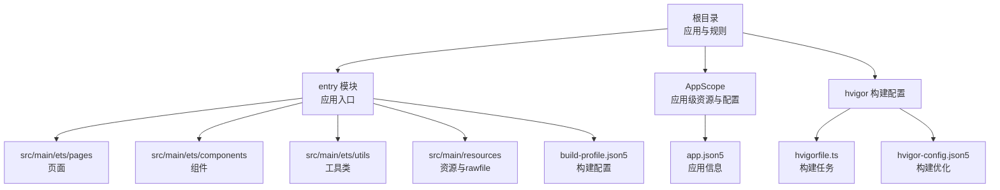
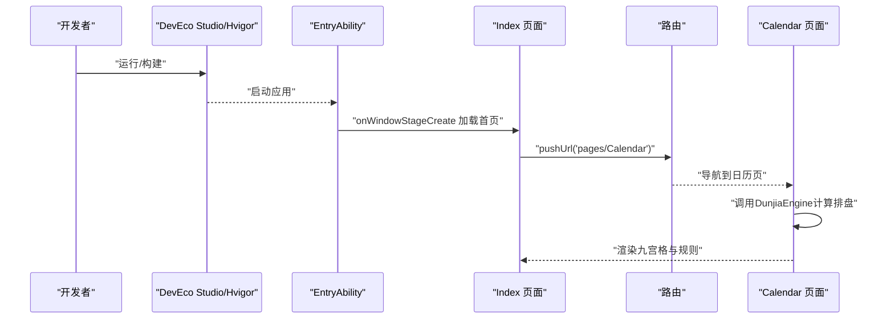
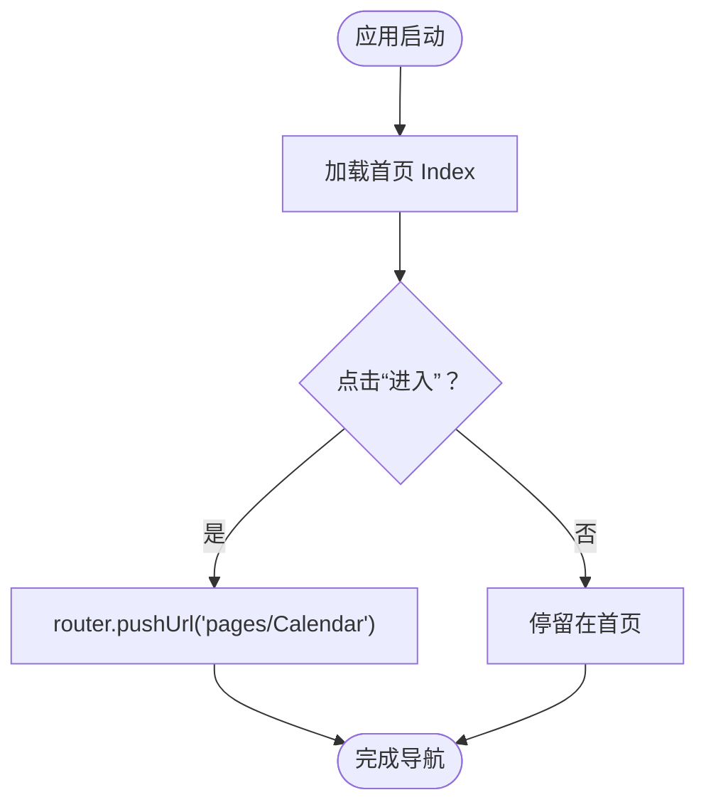
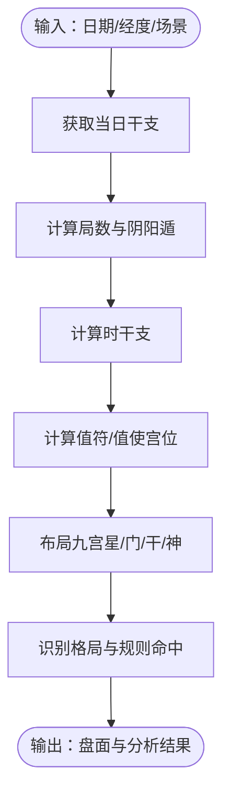
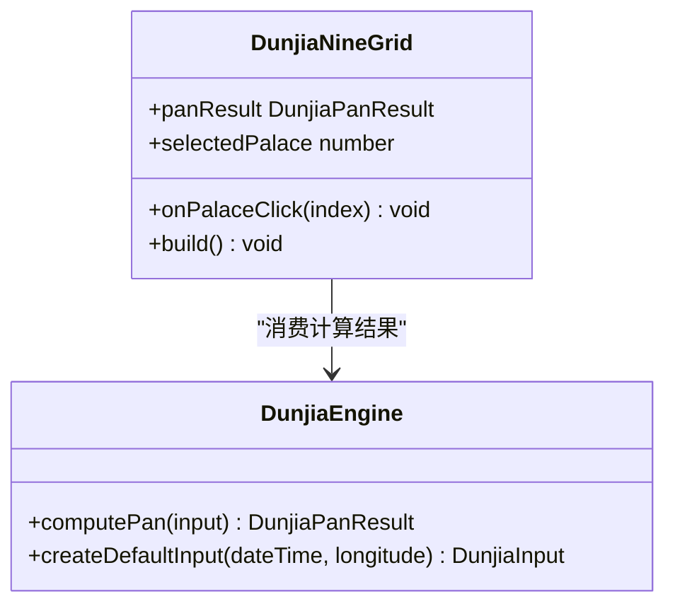
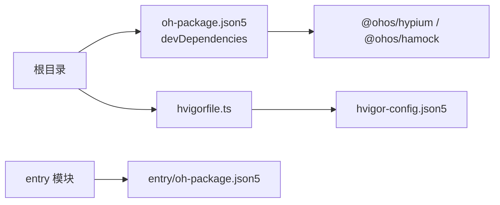

# 快速开始

<cite>
**本文引用的文件**
- [build-profile.json5](file://build-profile.json5)
- [entry/build-profile.json5](file://entry/build-profile.json5)
- [oh-package.json5](file://oh-package.json5)
- [entry/oh-package.json5](file://entry/oh-package.json5)
- [entry/src/main/module.json5](file://entry/src/main/module.json5)
- [AppScope/app.json5](file://AppScope/app.json5)
- [hvigorfile.ts](file://hvigorfile.ts)
- [entry/hvigorfile.ts](file://entry/hvigorfile.ts)
- [hvigor/hvigor-config.json5](file://hvigor/hvigor-config.json5)
- [entry/src/main/ets/entryability/EntryAbility.ets](file://entry/src/main/ets/entryability/EntryAbility.ets)
- [entry/src/main/ets/pages/Index.ets](file://entry/src/main/ets/pages/Index.ets)
- [entry/src/main/ets/utils/DunjiaEngine.ets](file://entry/src/main/ets/utils/DunjiaEngine.ets)
- [entry/src/main/ets/components/DunjiaNineGrid.ets](file://entry/src/main/ets/components/DunjiaNineGrid.ets)
- [entry/src/main/resources/base/profile/main_pages.json](file://entry/src/main/resources/base/profile/main_pages.json)
- [entry/src/main/resources/rawfile/术数与真太阳时.md](file://entry/src/main/resources/rawfile/术数与真太阳时.md)
- [entry/src/main/resources/rawfile/真太阳时讲解.md](file://entry/src/main/resources/rawfile/真太阳时讲解.md)
- [规则/01-遁甲排盘规则体系.md](file://规则/01-遁甲排盘规则体系.md)
- [规则/02-遁甲格局与吉凶规则.md](file://规则/02-遁甲格局与吉凶规则.md)
- [规则/03-遁甲九星断语.md](file://规则/03-遁甲九星断语.md)
- [规则/04-遁甲神煞理论.md](file://规则/04-遁甲神煞理论.md)
- [规则/05-遁甲择日与应用.md](file://规则/05-遁甲择日与应用.md)
</cite>

## 目录
1. [简介](#简介)
2. [项目结构](#项目结构)
3. [核心组件](#核心组件)
4. [架构总览](#架构总览)
5. [详细组件分析](#详细组件分析)
6. [依赖分析](#依赖分析)
7. [性能考虑](#性能考虑)
8. [故障排除指南](#故障排除指南)
9. [结论](#结论)
10. [附录](#附录)

## 简介
本指南面向初次接触遁甲应用开发的开发者，帮助你在最短时间内完成开发环境搭建、项目克隆、构建与运行，并理解项目目录结构与关键配置文件的作用。你还将了解基本的开发工作流（代码编写、调试、热重载等），并获得常见问题的解决方案。最后，我们将提供一个“第一个功能”的实现示例，让你快速体验项目的核心能力。

## 项目结构
该仓库采用模块化的多模块工程组织，根目录包含应用级配置与规则文档，entry 模块为应用入口模块，包含页面、组件、工具类与资源。hvigor 构建系统负责统一编译与打包。

图表来源
- [entry/src/main/module.json5](file://entry/src/main/module.json5#L1-L50)
- [AppScope/app.json5](file://AppScope/app.json5#L1-L11)
- [hvigorfile.ts](file://hvigorfile.ts#L1-L6)
- [hvigor/hvigor-config.json5](file://hvigor/hvigor-config.json5#L1-L24)

章节来源
- [entry/src/main/module.json5](file://entry/src/main/module.json5#L1-L50)
- [AppScope/app.json5](file://AppScope/app.json5#L1-L11)
- [hvigorfile.ts](file://hvigorfile.ts#L1-L6)
- [hvigor/hvigor-config.json5](file://hvigor/hvigor-config.json5#L1-L24)

## 核心组件
- 应用入口能力（EntryAbility）：负责应用生命周期与窗口初始化，加载首页。
- 首页（Index 页面）：作为应用入口页，提供导航到日历页与法律页的交互。
- 核心引擎（DunjiaEngine）：实现遁甲排盘与规则识别，输出结构化结果。
- 九宫格组件（DunjiaNineGrid）：渲染排盘结果，展示时间、局数与宫位信息。

章节来源
- [entry/src/main/ets/entryability/EntryAbility.ets](file://entry/src/main/ets/entryability/EntryAbility.ets#L1-L48)
- [entry/src/main/ets/pages/Index.ets](file://entry/src/main/ets/pages/Index.ets#L1-L88)
- [entry/src/main/ets/utils/DunjiaEngine.ets](file://entry/src/main/ets/utils/DunjiaEngine.ets#L1-L120)
- [entry/src/main/ets/components/DunjiaNineGrid.ets](file://entry/src/main/ets/components/DunjiaNineGrid.ets#L1-L80)

## 架构总览
应用启动流程从 EntryAbility 的窗口创建开始，加载首页 Index；Index 通过路由跳转到日历页，日历页可进一步联动核心引擎进行遁甲排盘计算与展示。

图表来源
- [entry/src/main/ets/entryability/EntryAbility.ets](file://entry/src/main/ets/entryability/EntryAbility.ets#L21-L32)
- [entry/src/main/ets/pages/Index.ets](file://entry/src/main/ets/pages/Index.ets#L6-L14)
- [entry/src/main/ets/utils/DunjiaEngine.ets](file://entry/src/main/ets/utils/DunjiaEngine.ets#L113-L162)

章节来源
- [entry/src/main/ets/entryability/EntryAbility.ets](file://entry/src/main/ets/entryability/EntryAbility.ets#L1-L48)
- [entry/src/main/ets/pages/Index.ets](file://entry/src/main/ets/pages/Index.ets#L1-L88)
- [entry/src/main/ets/utils/DunjiaEngine.ets](file://entry/src/main/ets/utils/DunjiaEngine.ets#L1-L200)

## 详细组件分析

### 组件A：应用入口与页面导航
- 入口能力（EntryAbility）：设置颜色模式、记录日志、加载首页。
- 首页（Index）：提供“进入”按钮与法律页链接，点击后通过路由跳转。

图表来源
- [entry/src/main/ets/entryability/EntryAbility.ets](file://entry/src/main/ets/entryability/EntryAbility.ets#L21-L32)
- [entry/src/main/ets/pages/Index.ets](file://entry/src/main/ets/pages/Index.ets#L6-L14)

章节来源
- [entry/src/main/ets/entryability/EntryAbility.ets](file://entry/src/main/ets/entryability/EntryAbility.ets#L1-L48)
- [entry/src/main/ets/pages/Index.ets](file://entry/src/main/ets/pages/Index.ets#L1-L88)

### 组件B：遁甲核心引擎（DunjiaEngine）
- 职责：接收时间、经度与场景类型，计算遁甲盘面、值符值使、九宫状态、规则命中与格局识别。
- 关键流程：获取日干支 -> 计算局数与阴阳遁 -> 计算时干支 -> 布局九宫（九星、八门、三奇六仪、八神）-> 识别格局。

图表来源
- [entry/src/main/ets/utils/DunjiaEngine.ets](file://entry/src/main/ets/utils/DunjiaEngine.ets#L113-L162)
- [entry/src/main/ets/utils/DunjiaEngine.ets](file://entry/src/main/ets/utils/DunjiaEngine.ets#L247-L281)
- [entry/src/main/ets/utils/DunjiaEngine.ets](file://entry/src/main/ets/utils/DunjiaEngine.ets#L358-L389)

章节来源
- [entry/src/main/ets/utils/DunjiaEngine.ets](file://entry/src/main/ets/utils/DunjiaEngine.ets#L1-L200)
- [entry/src/main/ets/utils/DunjiaEngine.ets](file://entry/src/main/ets/utils/DunjiaEngine.ets#L200-L400)
- [entry/src/main/ets/utils/DunjiaEngine.ets](file://entry/src/main/ets/utils/DunjiaEngine.ets#L400-L650)

### 组件C：九宫格展示组件（DunjiaNineGrid）
- 职责：渲染九宫格、时间信息、局数与格局提示；支持宫位点击回调。
- 数据来源：DunjiaEngine 的计算结果。

图表来源
- [entry/src/main/ets/utils/DunjiaEngine.ets](file://entry/src/main/ets/utils/DunjiaEngine.ets#L113-L162)
- [entry/src/main/ets/components/DunjiaNineGrid.ets](file://entry/src/main/ets/components/DunjiaNineGrid.ets#L24-L70)

章节来源
- [entry/src/main/ets/components/DunjiaNineGrid.ets](file://entry/src/main/ets/components/DunjiaNineGrid.ets#L1-L179)

## 依赖分析
- 应用级依赖：测试框架与模拟库（hypium、hamock）。
- 模块级依赖：entry 模块自身依赖为空，实际运行时通过 ArkTS 运行时与系统能力提供 UI、窗口与路由等。
- 构建系统：hvigorfile.ts 定义了系统任务与插件扩展点；hvigor-config.json5 提供构建优化开关。

图表来源
- [oh-package.json5](file://oh-package.json5#L1-L11)
- [entry/oh-package.json5](file://entry/oh-package.json5#L1-L11)
- [hvigorfile.ts](file://hvigorfile.ts#L1-L6)
- [hvigor/hvigor-config.json5](file://hvigor/hvigor-config.json5#L1-L24)

章节来源
- [oh-package.json5](file://oh-package.json5#L1-L11)
- [entry/oh-package.json5](file://entry/oh-package.json5#L1-L11)
- [hvigorfile.ts](file://hvigorfile.ts#L1-L6)
- [hvigor/hvigor-config.json5](file://hvigor/hvigor-config.json5#L1-L24)

## 性能考虑
- 构建优化：hvigor-config.json5 提供并行编译、增量编译、类型检查等可选优化策略，建议在本地开发启用并行与增量以提升效率。
- 资源与页面：main_pages.json 控制页面清单，避免冗余页面影响打包体积。
- 引擎计算：DunjiaEngine 的计算逻辑较为集中，建议在 UI 层做必要的缓存与懒加载，避免频繁重复计算。

章节来源
- [hvigor/hvigor-config.json5](file://hvigor/hvigor-config.json5#L1-L24)
- [entry/src/main/resources/base/profile/main_pages.json](file://entry/src/main/resources/base/profile/main_pages.json#L1-L20)

## 故障排除指南
- 构建签名配置路径错误
  - 现象：构建时报签名材料路径不存在或密码不匹配。
  - 排查：检查根目录 build-profile.json5 中 signingConfigs 的 certpath、storeFile、storePassword、keyPassword 等字段是否指向有效证书与密钥文件。
  - 参考
    - [build-profile.json5](file://build-profile.json5#L3-L16)
- 页面未显示或路由失败
  - 现象：点击导航后页面不跳转或空白。
  - 排查：确认 main_pages.json 中目标页面已注册，且路由 URL 与页面路径一致；检查页面组件是否正确导出。
  - 参考
    - [entry/src/main/resources/base/profile/main_pages.json](file://entry/src/main/resources/base/profile/main_pages.json#L1-L20)
    - [entry/src/main/ets/pages/Index.ets](file://entry/src/main/ets/pages/Index.ets#L6-L14)
- 真太阳时偏移异常
  - 现象：显示的真太阳时偏移与预期不符。
  - 排查：确认传入经度值合理；核对引擎中经度换算逻辑与展示格式。
  - 参考
    - [entry/src/main/ets/utils/DunjiaEngine.ets](file://entry/src/main/ets/utils/DunjiaEngine.ets#L658-L661)
- 资源引用错误
  - 现象：图片或媒体资源无法加载。
  - 排查：确认资源 ID 与文件存在，检查资源目录结构与引用方式。
  - 参考
    - [entry/src/main/ets/pages/Index.ets](file://entry/src/main/ets/pages/Index.ets#L19-L22)

章节来源
- [build-profile.json5](file://build-profile.json5#L1-L56)
- [entry/src/main/resources/base/profile/main_pages.json](file://entry/src/main/resources/base/profile/main_pages.json#L1-L20)
- [entry/src/main/ets/pages/Index.ets](file://entry/src/main/ets/pages/Index.ets#L1-L88)
- [entry/src/main/ets/utils/DunjiaEngine.ets](file://entry/src/main/ets/utils/DunjiaEngine.ets#L658-L661)

## 结论
通过本指南，你已经完成了开发环境准备、项目构建与运行，并理解了项目的关键配置与核心组件。建议在熟悉现有页面与引擎的基础上，逐步扩展新页面与规则，完善遁甲知识体系与排盘展示。

## 附录

### 环境准备与安装
- 开发工具
  - DevEco Studio：HarmonyOS 应用开发 IDE，提供项目模板、构建与调试能力。
- SDK 与运行设备
  - 安装 HarmonyOS SDK 与模拟器/真机驱动，确保设备可被识别。
- Node.js 与包管理
  - 安装 Node.js，确保 npm/yarn 可用，以便管理依赖与脚本执行。
- 项目克隆与导入
  - 将仓库克隆到本地后，使用 DevEco Studio 打开根目录，自动识别 hvigor 与模块配置。

### 项目构建与运行
- 构建命令（推荐）
  - 在 DevEco Studio 终端执行构建任务，选择 debug 或 release 模式。
- 运行命令（推荐）
  - 选择模拟器或连接真机，点击“运行”按钮启动应用。
- 关键配置文件
  - 根 build-profile.json5：签名、产品配置与构建模式。
  - entry/build-profile.json5：模块构建选项与资源拷贝策略。
  - hvigorfile.ts / hvigor/hvigor-config.json5：构建任务与优化策略。
  - entry/src/main/module.json5：模块能力、页面清单与扩展能力。
  - AppScope/app.json5：应用包名、图标与版本信息。
  - 参考
    - [build-profile.json5](file://build-profile.json5#L1-L56)
    - [entry/build-profile.json5](file://entry/build-profile.json5#L1-L33)
    - [hvigorfile.ts](file://hvigorfile.ts#L1-L6)
    - [hvigor/hvigor-config.json5](file://hvigor/hvigor-config.json5#L1-L24)
    - [entry/src/main/module.json5](file://entry/src/main/module.json5#L1-L50)
    - [AppScope/app.json5](file://AppScope/app.json5#L1-L11)

### 目录结构与关键文件
- 根目录
  - 规则与文档：包含遁甲排盘、格局、九星、神煞与择日等规则文档。
  - 构建配置：hvigor 与 hvigor-config。
- entry 模块
  - src/main/ets：页面、组件、工具类。
  - src/main/resources：媒体、配置与 rawfile 文档。
  - build-profile.json5：模块构建配置。
  - 参考
    - [entry/src/main/resources/base/profile/main_pages.json](file://entry/src/main/resources/base/profile/main_pages.json#L1-L20)
    - [entry/src/main/resources/rawfile/术数与真太阳时.md](file://entry/src/main/resources/rawfile/术数与真太阳时.md)
    - [entry/src/main/resources/rawfile/真太阳时讲解.md](file://entry/src/main/resources/rawfile/真太阳时讲解.md)

### 开发工作流
- 代码编写
  - 新增页面：在 pages 目录创建新页面组件，并在 main_pages.json 注册。
  - 新增组件：在 components 目录创建复用组件，通过属性传递数据。
  - 工具类：在 utils 目录新增业务逻辑，保持纯函数与可测试性。
- 调试
  - 使用 DevEco Studio 的断点与日志输出（hilog）进行调试。
  - 通过路由与页面栈验证导航链路。
- 热重载
  - 修改 ArkTS/资源后保存，DevEco Studio 自动触发增量编译与热重载（视配置而定）。

### 第一个功能：从当前时间进入遁甲排盘
- 目标：在首页点击“进入”，跳转到日历页，使用当前时间与默认经度生成遁甲盘面并展示九宫格。
- 实现步骤
  1) 在首页绑定点击事件，跳转到日历页。
     - 参考
       - [entry/src/main/ets/pages/Index.ets](file://entry/src/main/ets/pages/Index.ets#L6-L14)
  2) 在日历页调用 DunjiaEngine 的计算方法，传入当前时间与经度。
     - 参考
       - [entry/src/main/ets/utils/DunjiaEngine.ets](file://entry/src/main/ets/utils/DunjiaEngine.ets#L645-L651)
  3) 使用 DunjiaNineGrid 渲染结果，展示时间、局数与宫位信息。
     - 参考
       - [entry/src/main/ets/components/DunjiaNineGrid.ets](file://entry/src/main/ets/components/DunjiaNineGrid.ets#L72-L177)