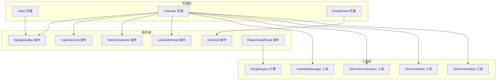
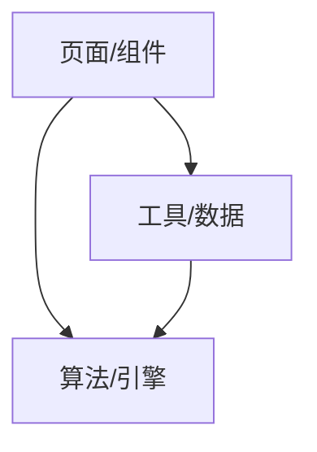
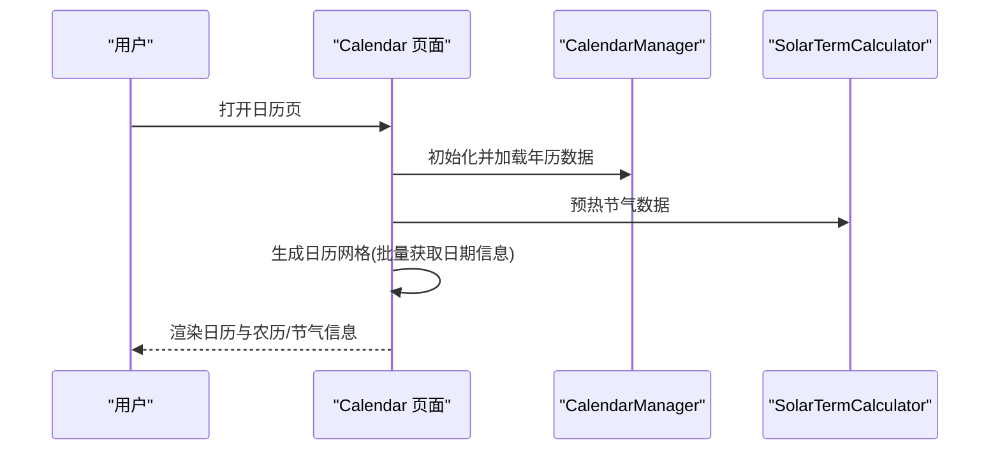
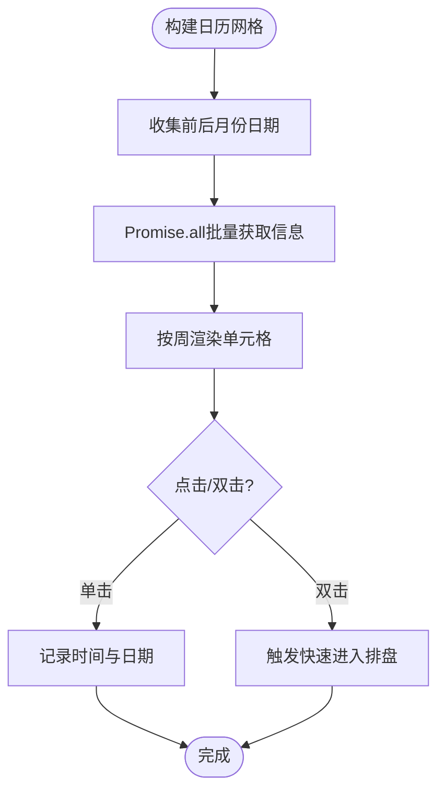
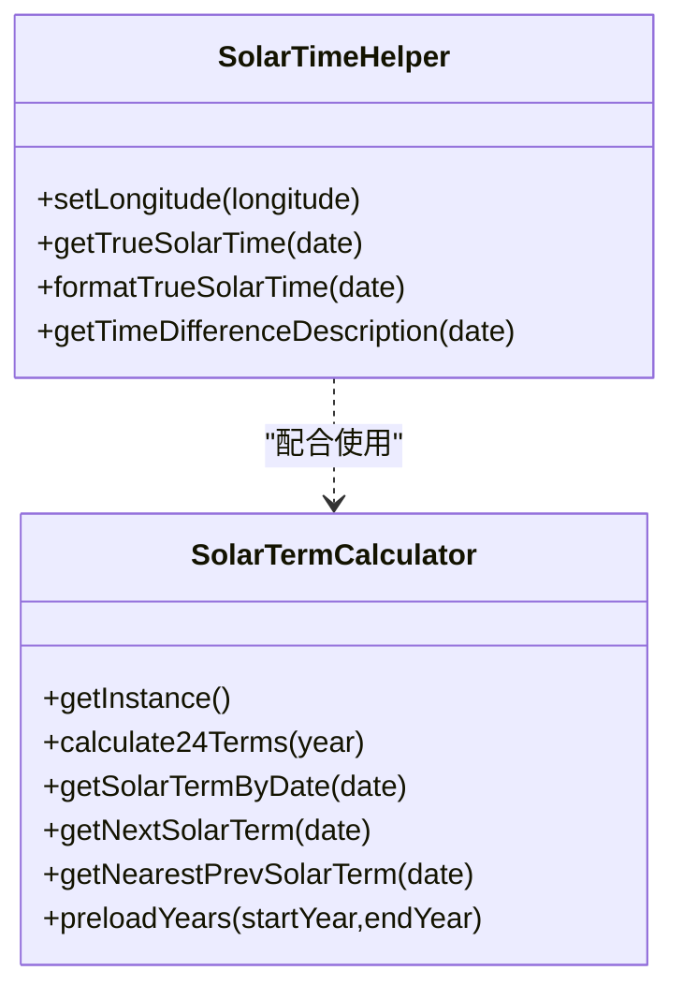
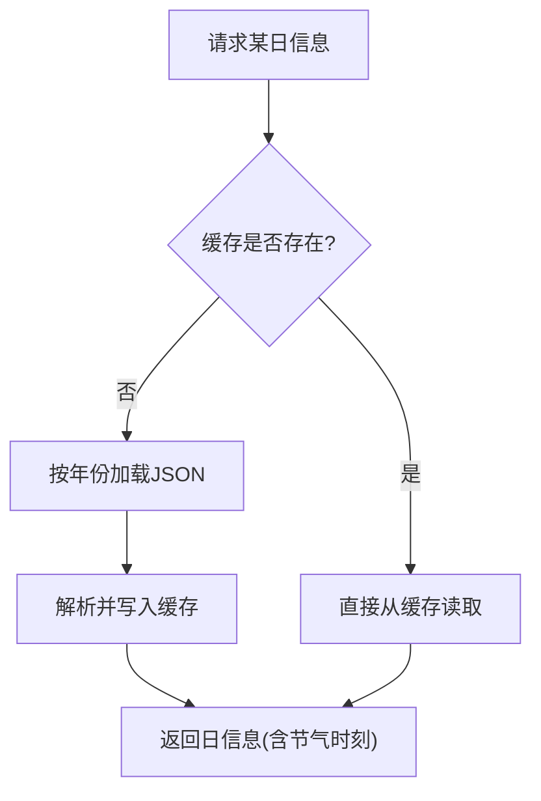
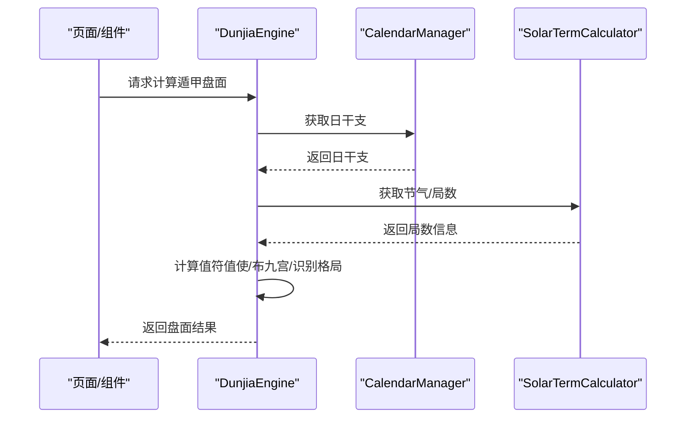
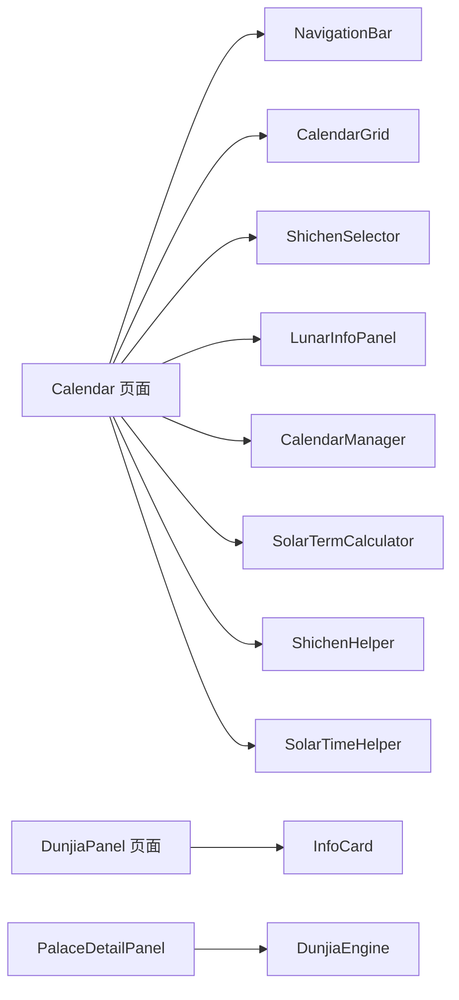

# 性能优化

<cite>
**本文引用的文件**   
- [entry/src/main/ets/pages/Index.ets](file://entry/src/main/ets/pages/Index.ets)
- [entry/src/main/ets/pages/Calendar.ets](file://entry/src/main/ets/pages/Calendar.ets)
- [entry/src/main/ets/pages/DunjiaPanel.ets](file://entry/src/main/ets/pages/DunjiaPanel.ets)
- [entry/src/main/ets/components/CalendarGrid.ets](file://entry/src/main/ets/components/CalendarGrid.ets)
- [entry/src/main/ets/components/InfoCard.ets](file://entry/src/main/ets/components/InfoCard.ets)
- [entry/src/main/ets/components/NavigationBar.ets](file://entry/src/main/ets/components/NavigationBar.ets)
- [entry/src/main/ets/components/ShichenSelector.ets](file://entry/src/main/ets/components/ShichenSelector.ets)
- [entry/src/main/ets/components/LunarInfoPanel.ets](file://entry/src/main/ets/components/LunarInfoPanel.ets)
- [entry/src/main/ets/components/PalaceDetailPanel.ets](file://entry/src/main/ets/components/PalaceDetailPanel.ets)
- [entry/src/main/ets/utils/CalendarManager.ets](file://entry/src/main/ets/utils/CalendarManager.ets)
- [entry/src/main/ets/utils/SolarTermCalculator.ets](file://entry/src/main/ets/utils/SolarTermCalculator.ets)
- [entry/src/main/ets/utils/ShichenHelper.ets](file://entry/src/main/ets/utils/ShichenHelper.ets)
- [entry/src/main/ets/utils/SolarTimeHelper.ets](file://entry/src/main/ets/utils/SolarTimeHelper.ets)
- [entry/src/main/ets/utils/DunjiaEngine.ets](file://entry/src/main/ets/utils/DunjiaEngine.ets)
</cite>

## 目录
1. [简介](#简介)
2. [项目结构](#项目结构)
3. [核心组件](#核心组件)
4. [架构总览](#架构总览)
5. [详细组件分析](#详细组件分析)
6. [依赖分析](#依赖分析)
7. [性能考量](#性能考量)
8. [故障排查指南](#故障排查指南)
9. [结论](#结论)
10. [附录](#附录)

## 简介
本指南聚焦于该鸿蒙应用在实际运行中的性能问题诊断与优化，围绕应用启动速度慢、页面切换卡顿、内存占用过高、组件渲染性能瓶颈、计算密集型任务处理、缓存策略、网络请求与数据预加载、图片资源优化与懒加载、以及用户体验优化与效果评估等方面，提供系统化的分析方法与可落地的优化建议。文档以仓库现有代码为依据，结合ArkTS/HarmonyOS开发特性，给出面向工程实践的指导。

## 项目结构
应用采用典型的页面-组件-工具分层组织：
- 页面层：Index、Calendar、DunjiaPanel等页面，负责路由与业务编排
- 组件层：NavigationBar、CalendarGrid、InfoCard、ShichenSelector、LunarInfoPanel、PalaceDetailPanel等，负责UI复用与交互
- 工具层：CalendarManager、SolarTermCalculator、ShichenHelper、SolarTimeHelper、DunjiaEngine等，负责数据与算法

图表来源
- [entry/src/main/ets/pages/Index.ets](file://entry/src/main/ets/pages/Index.ets#L1-L88)
- [entry/src/main/ets/pages/Calendar.ets](file://entry/src/main/ets/pages/Calendar.ets#L1-L602)
- [entry/src/main/ets/pages/DunjiaPanel.ets](file://entry/src/main/ets/pages/DunjiaPanel.ets#L1-L189)
- [entry/src/main/ets/components/NavigationBar.ets](file://entry/src/main/ets/components/NavigationBar.ets#L1-L86)
- [entry/src/main/ets/components/CalendarGrid.ets](file://entry/src/main/ets/components/CalendarGrid.ets#L1-L167)
- [entry/src/main/ets/components/InfoCard.ets](file://entry/src/main/ets/components/InfoCard.ets#L1-L114)
- [entry/src/main/ets/components/ShichenSelector.ets](file://entry/src/main/ets/components/ShichenSelector.ets#L1-L133)
- [entry/src/main/ets/components/LunarInfoPanel.ets](file://entry/src/main/ets/components/LunarInfoPanel.ets#L1-L142)
- [entry/src/main/ets/components/PalaceDetailPanel.ets](file://entry/src/main/ets/components/PalaceDetailPanel.ets#L1-L481)
- [entry/src/main/ets/utils/CalendarManager.ets](file://entry/src/main/ets/utils/CalendarManager.ets#L1-L123)
- [entry/src/main/ets/utils/SolarTermCalculator.ets](file://entry/src/main/ets/utils/SolarTermCalculator.ets#L1-L375)
- [entry/src/main/ets/utils/ShichenHelper.ets](file://entry/src/main/ets/utils/ShichenHelper.ets#L1-L114)
- [entry/src/main/ets/utils/SolarTimeHelper.ets](file://entry/src/main/ets/utils/SolarTimeHelper.ets#L1-L270)
- [entry/src/main/ets/utils/DunjiaEngine.ets](file://entry/src/main/ets/utils/DunjiaEngine.ets#L1-L961)

章节来源
- [entry/src/main/ets/pages/Index.ets](file://entry/src/main/ets/pages/Index.ets#L1-L88)
- [entry/src/main/ets/pages/Calendar.ets](file://entry/src/main/ets/pages/Calendar.ets#L1-L602)
- [entry/src/main/ets/pages/DunjiaPanel.ets](file://entry/src/main/ets/pages/DunjiaPanel.ets#L1-L189)

## 核心组件
- 页面与路由
  - Index：首页入口，触发跳转到日历页
  - Calendar：日历与日期选择、真太阳时展示、时辰选择、农历信息展示
  - DunjiaPanel：研习模块导航，承载多个研习模块入口
- 组件
  - NavigationBar：统一导航栏
  - CalendarGrid：日历网格渲染与点击/双击事件
  - InfoCard：模块卡片，支持点击跳转
  - ShichenSelector：时辰网格选择器
  - LunarInfoPanel：农历与节气/节日信息展示
  - PalaceDetailPanel：宫位详情与九星八门解读
- 工具与引擎
  - CalendarManager：年历数据缓存与批量加载
  - SolarTermCalculator：节气精确时刻计算与缓存
  - ShichenHelper：时辰计算与显示
  - SolarTimeHelper：真太阳时计算
  - DunjiaEngine：遁甲盘面计算与规则识别（计算密集）

章节来源
- [entry/src/main/ets/pages/Index.ets](file://entry/src/main/ets/pages/Index.ets#L1-L88)
- [entry/src/main/ets/pages/Calendar.ets](file://entry/src/main/ets/pages/Calendar.ets#L1-L602)
- [entry/src/main/ets/pages/DunjiaPanel.ets](file://entry/src/main/ets/pages/DunjiaPanel.ets#L1-L189)
- [entry/src/main/ets/components/CalendarGrid.ets](file://entry/src/main/ets/components/CalendarGrid.ets#L1-L167)
- [entry/src/main/ets/components/InfoCard.ets](file://entry/src/main/ets/components/InfoCard.ets#L1-L114)
- [entry/src/main/ets/components/ShichenSelector.ets](file://entry/src/main/ets/components/ShichenSelector.ets#L1-L133)
- [entry/src/main/ets/components/LunarInfoPanel.ets](file://entry/src/main/ets/components/LunarInfoPanel.ets#L1-L142)
- [entry/src/main/ets/components/PalaceDetailPanel.ets](file://entry/src/main/ets/components/PalaceDetailPanel.ets#L1-L481)
- [entry/src/main/ets/utils/CalendarManager.ets](file://entry/src/main/ets/utils/CalendarManager.ets#L1-L123)
- [entry/src/main/ets/utils/SolarTermCalculator.ets](file://entry/src/main/ets/utils/SolarTermCalculator.ets#L1-L375)
- [entry/src/main/ets/utils/ShichenHelper.ets](file://entry/src/main/ets/utils/ShichenHelper.ets#L1-L114)
- [entry/src/main/ets/utils/SolarTimeHelper.ets](file://entry/src/main/ets/utils/SolarTimeHelper.ets#L1-L270)
- [entry/src/main/ets/utils/DunjiaEngine.ets](file://entry/src/main/ets/utils/DunjiaEngine.ets#L1-L961)

## 架构总览
应用采用“页面-组件-工具”三层架构，页面负责路由与状态管理，组件负责UI与交互，工具负责数据与算法。日历页承担大量数据加载与计算任务，是性能优化的关键入口。

图表来源
- [entry/src/main/ets/pages/Calendar.ets](file://entry/src/main/ets/pages/Calendar.ets#L1-L602)
- [entry/src/main/ets/utils/CalendarManager.ets](file://entry/src/main/ets/utils/CalendarManager.ets#L1-L123)
- [entry/src/main/ets/utils/SolarTermCalculator.ets](file://entry/src/main/ets/utils/SolarTermCalculator.ets#L1-L375)
- [entry/src/main/ets/utils/DunjiaEngine.ets](file://entry/src/main/ets/utils/DunjiaEngine.ets#L1-L961)

## 详细组件分析

### 日历页（Calendar）性能分析与优化
- 数据加载与渲染
  - 批量生成日历网格：一次性收集当月前后日期，Promise.all并发获取农历/节气/节日信息，减少多次IO与渲染抖动
  - 事件处理：双击快速进入排盘，单击/双击去抖逻辑避免重复触发
- 计算密集型任务
  - 真太阳时与节气计算：SolarTimeHelper与SolarTermCalculator具备缓存机制，建议在页面生命周期内预热常用年份
- 内存与状态
  - 使用@State管理选中日期、时辰索引、日历数据等，避免不必要的重组
- 优化建议
  - 预加载：在aboutToAppear阶段预加载未来/历史若干年节气数据
  - 分页/虚拟滚动：若日历跨度扩大，考虑分页或虚拟滚动
  - 图片与背景：背景图使用Cover适配，避免重复缩放计算

图表来源
- [entry/src/main/ets/pages/Calendar.ets](file://entry/src/main/ets/pages/Calendar.ets#L32-L137)
- [entry/src/main/ets/utils/CalendarManager.ets](file://entry/src/main/ets/utils/CalendarManager.ets#L44-L92)
- [entry/src/main/ets/utils/SolarTermCalculator.ets](file://entry/src/main/ets/utils/SolarTermCalculator.ets#L61-L86)

章节来源
- [entry/src/main/ets/pages/Calendar.ets](file://entry/src/main/ets/pages/Calendar.ets#L32-L137)
- [entry/src/main/ets/utils/CalendarManager.ets](file://entry/src/main/ets/utils/CalendarManager.ets#L44-L92)
- [entry/src/main/ets/utils/SolarTermCalculator.ets](file://entry/src/main/ets/utils/SolarTermCalculator.ets#L61-L86)

### 日历网格组件（CalendarGrid）渲染优化
- 渲染路径
  - 6×7网格，按周分组渲染，减少父容器层级
  - 日期单元格区分今日/选中/非当月，使用条件样式，避免多余节点
- 交互优化
  - 单击/双击去抖，避免频繁状态变更
- 优化建议
  - 使用@memo或状态最小化，确保只有必要属性变化才重绘
  - 若日粒度过大，考虑虚拟列表

图表来源
- [entry/src/main/ets/pages/Calendar.ets](file://entry/src/main/ets/pages/Calendar.ets#L46-L137)
- [entry/src/main/ets/components/CalendarGrid.ets](file://entry/src/main/ets/components/CalendarGrid.ets#L74-L165)

章节来源
- [entry/src/main/ets/components/CalendarGrid.ets](file://entry/src/main/ets/components/CalendarGrid.ets#L74-L165)

### 真太阳时与节气计算（SolarTimeHelper/SolarTermCalculator）
- 真太阳时
  - 均时差与经度修正，提供格式化输出与时差描述
- 节气计算
  - 24节气精确时刻计算，按年缓存，支持预加载
- 优化建议
  - 在Calendar页aboutToAppear阶段调用preloadYears预热
  - 对高频调用的格式化函数进行缓存

图表来源
- [entry/src/main/ets/utils/SolarTimeHelper.ets](file://entry/src/main/ets/utils/SolarTimeHelper.ets#L1-L270)
- [entry/src/main/ets/utils/SolarTermCalculator.ets](file://entry/src/main/ets/utils/SolarTermCalculator.ets#L1-L375)

章节来源
- [entry/src/main/ets/utils/SolarTimeHelper.ets](file://entry/src/main/ets/utils/SolarTimeHelper.ets#L54-L108)
- [entry/src/main/ets/utils/SolarTermCalculator.ets](file://entry/src/main/ets/utils/SolarTermCalculator.ets#L61-L86)

### 年历数据缓存（CalendarManager）
- 缓存策略
  - 按年文件名映射，首次加载后缓存，避免重复IO
  - 支持按日期精确查询，附加节气精确时刻
- 优化建议
  - 预加载常用年份范围
  - 对异常数据进行兜底与错误日志

图表来源
- [entry/src/main/ets/utils/CalendarManager.ets](file://entry/src/main/ets/utils/CalendarManager.ets#L51-L92)

章节来源
- [entry/src/main/ets/utils/CalendarManager.ets](file://entry/src/main/ets/utils/CalendarManager.ets#L51-L92)

### 遁甲引擎（DunjiaEngine）计算优化
- 计算链路
  - 获取日干支 -> 计算局数与阴阳遁 -> 计算值符值使 -> 布九宫 -> 识别格局
- 优化建议
  - 将昂贵的节气/日干支查询前置到页面层，避免在组件内重复计算
  - 对布局与识别过程进行分段执行，必要时拆分为Web Worker或后台任务
  - 使用结果缓存，相同输入复用上次结果

图表来源
- [entry/src/main/ets/utils/DunjiaEngine.ets](file://entry/src/main/ets/utils/DunjiaEngine.ets#L113-L162)
- [entry/src/main/ets/utils/CalendarManager.ets](file://entry/src/main/ets/utils/CalendarManager.ets#L247-L250)
- [entry/src/main/ets/utils/SolarTermCalculator.ets](file://entry/src/main/ets/utils/SolarTermCalculator.ets#L143-L159)

章节来源
- [entry/src/main/ets/utils/DunjiaEngine.ets](file://entry/src/main/ets/utils/DunjiaEngine.ets#L113-L162)

### 页面导航与模块入口（DunjiaPanel）
- 作用：提供研习模块入口，按需传递时间戳等参数
- 优化建议：对未实现路由进行占位提示，避免无效跳转

章节来源
- [entry/src/main/ets/pages/DunjiaPanel.ets](file://entry/src/main/ets/pages/DunjiaPanel.ets#L151-L177)

### 通用组件（NavigationBar/InfoCard/ShichenSelector/LunarInfoPanel）
- 统一样式与交互，降低重复开发成本
- 优化建议：对复杂组件的props进行最小化，避免不必要的重渲染

章节来源
- [entry/src/main/ets/components/NavigationBar.ets](file://entry/src/main/ets/components/NavigationBar.ets#L35-L84)
- [entry/src/main/ets/components/InfoCard.ets](file://entry/src/main/ets/components/InfoCard.ets#L37-L112)
- [entry/src/main/ets/components/ShichenSelector.ets](file://entry/src/main/ets/components/ShichenSelector.ets#L34-L78)
- [entry/src/main/ets/components/LunarInfoPanel.ets](file://entry/src/main/ets/components/LunarInfoPanel.ets#L41-L127)

## 依赖分析
- 页面到组件
  - Calendar依赖NavigationBar、CalendarGrid、ShichenSelector、LunarInfoPanel
  - DunjiaPanel依赖InfoCard
- 页面到工具
  - Calendar依赖CalendarManager、SolarTermCalculator、ShichenHelper、SolarTimeHelper
  - PalaceDetailPanel依赖DunjiaEngine
- 工具内部耦合
  - CalendarManager与SolarTermCalculator存在数据关联（节气时刻）

图表来源
- [entry/src/main/ets/pages/Calendar.ets](file://entry/src/main/ets/pages/Calendar.ets#L1-L602)
- [entry/src/main/ets/pages/DunjiaPanel.ets](file://entry/src/main/ets/pages/DunjiaPanel.ets#L1-L189)
- [entry/src/main/ets/components/PalaceDetailPanel.ets](file://entry/src/main/ets/components/PalaceDetailPanel.ets#L1-L481)
- [entry/src/main/ets/utils/DunjiaEngine.ets](file://entry/src/main/ets/utils/DunjiaEngine.ets#L1-L961)

章节来源
- [entry/src/main/ets/pages/Calendar.ets](file://entry/src/main/ets/pages/Calendar.ets#L1-L602)
- [entry/src/main/ets/pages/DunjiaPanel.ets](file://entry/src/main/ets/pages/DunjiaPanel.ets#L1-L189)

## 性能考量
- 启动速度优化
  - 首屏渲染：Index页面仅包含必要元素，避免在首屏加载重型组件
  - 路由懒加载：将Calendar、DunjiaPanel等页面按需加载
  - 资源预热：在Index页aboutToAppear阶段预热Calendar所需节气与年历数据
- 页面切换卡顿
  - Calendar网格渲染：保持一次性批量渲染，避免逐项插入
  - 交互去抖：CalendarGrid双击去抖，减少状态抖动
- 内存占用
  - CalendarManager缓存按年存储，避免重复解析
  - SolarTermCalculator缓存按年存储，提供preloadYears预热
  - 页面状态最小化，避免大对象在@State中频繁更新
- 计算密集型任务
  - DunjiaEngine计算链路较长，建议在后台线程执行或分段执行
  - 对布局与识别过程进行结果缓存，避免重复计算
- 网络与数据预加载
  - 年历数据为本地资源，建议在应用启动时预加载常用年份
  - 节气数据按年缓存，避免重复计算
- 图片与资源
  - 背景图使用Cover适配，避免重复缩放
  - 图片懒加载：仅在进入详情页时加载大图
- 用户体验
  - 提供加载指示与骨架屏
  - 对无效路由进行友好提示

## 故障排查指南
- 日历页空白或渲染缓慢
  - 检查CalendarManager是否初始化上下文
  - 确认年历JSON文件是否存在与格式正确
  - 关注Promise.all批量加载是否出现异常
- 真太阳时显示异常
  - 检查SolarTimeHelper经度设置与格式化输出
  - 核对SolarTermCalculator节气时刻是否正确
- 计算结果为空
  - 检查DunjiaEngine输入参数（时间、经度、场景）
  - 确认日干支与节气查询成功
- 组件闪烁或卡顿
  - 检查@State更新频率与渲染路径
  - 确保CalendarGrid点击/双击去抖逻辑生效

章节来源
- [entry/src/main/ets/utils/CalendarManager.ets](file://entry/src/main/ets/utils/CalendarManager.ets#L44-L92)
- [entry/src/main/ets/utils/SolarTimeHelper.ets](file://entry/src/main/ets/utils/SolarTimeHelper.ets#L54-L108)
- [entry/src/main/ets/utils/SolarTermCalculator.ets](file://entry/src/main/ets/utils/SolarTermCalculator.ets#L93-L159)
- [entry/src/main/ets/utils/DunjiaEngine.ets](file://entry/src/main/ets/utils/DunjiaEngine.ets#L113-L162)
- [entry/src/main/ets/components/CalendarGrid.ets](file://entry/src/main/ets/components/CalendarGrid.ets#L144-L164)

## 结论
通过对页面、组件与工具层的系统性分析，可以发现日历页是性能优化的核心入口：批量数据加载、缓存策略、交互去抖与计算链路的前置/分段执行是提升启动速度、页面切换流畅度与内存占用的关键。建议在现有基础上完善预加载、缓存与后台计算能力，并持续监控与评估优化效果。

## 附录
- 性能分析工具建议
  - 使用DevEco Studio自带性能分析器观察主线程耗时
  - 关注渲染帧率与GC频率，定位卡顿与内存峰值
- 评估方法
  - 启动时延：从Index到Calendar首帧渲染时间
  - 切换时延：页面间路由与首次渲染时间
  - 内存占用：常驻页面与详情页峰值内存
  - 计算耗时：DunjiaEngine单次计算耗时与缓存命中率