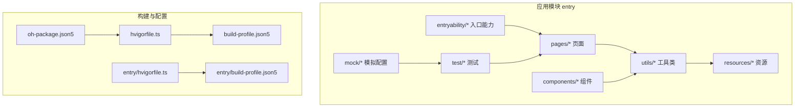
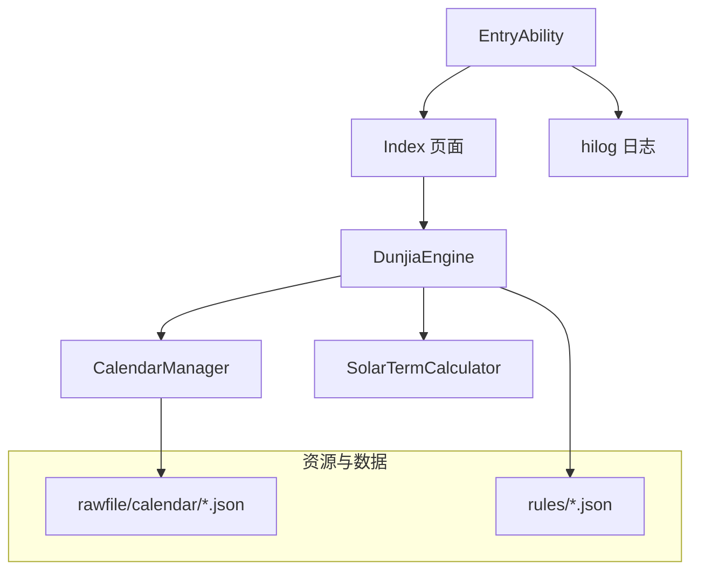
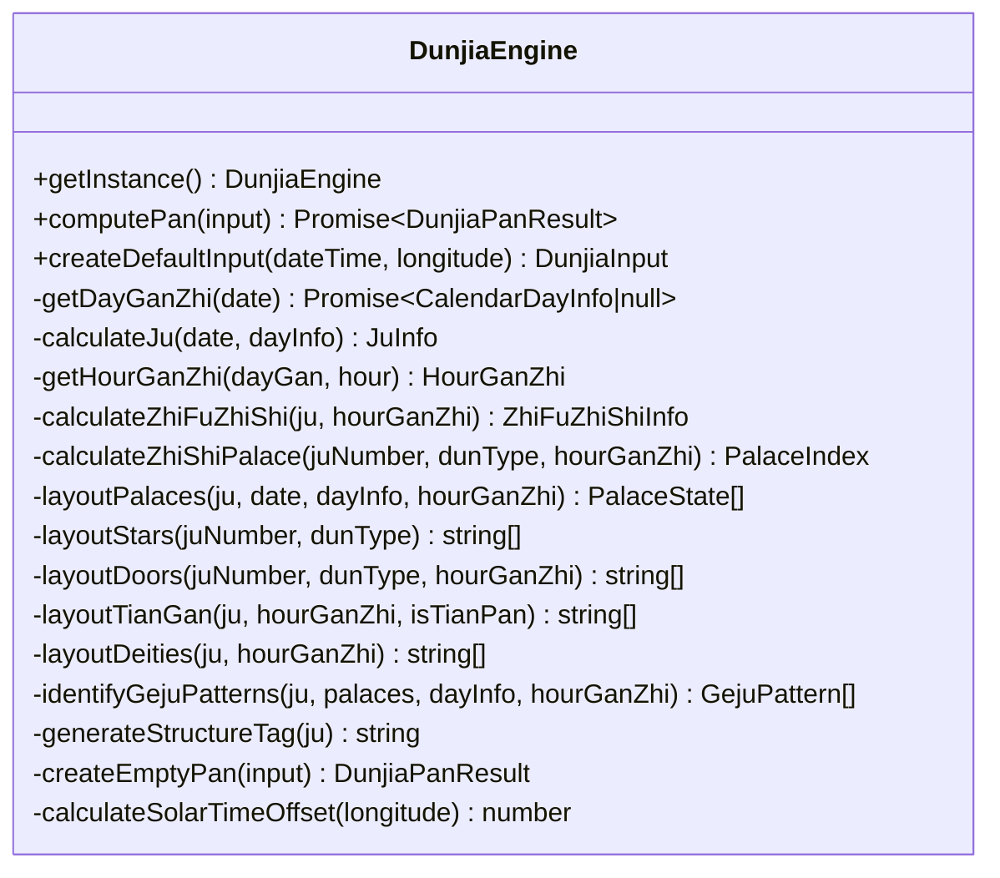
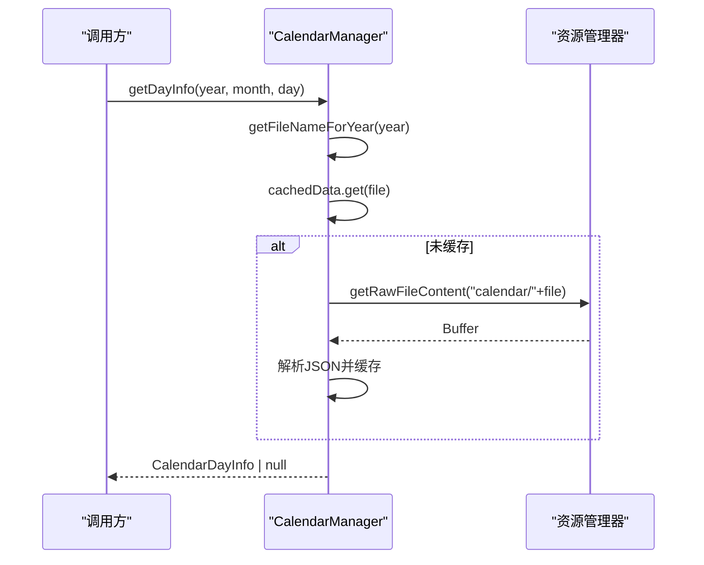
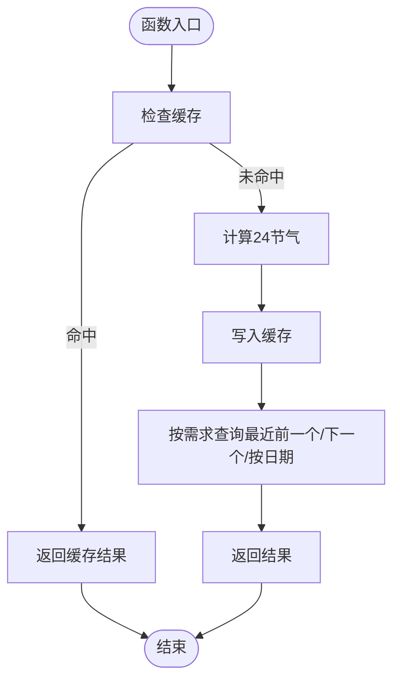
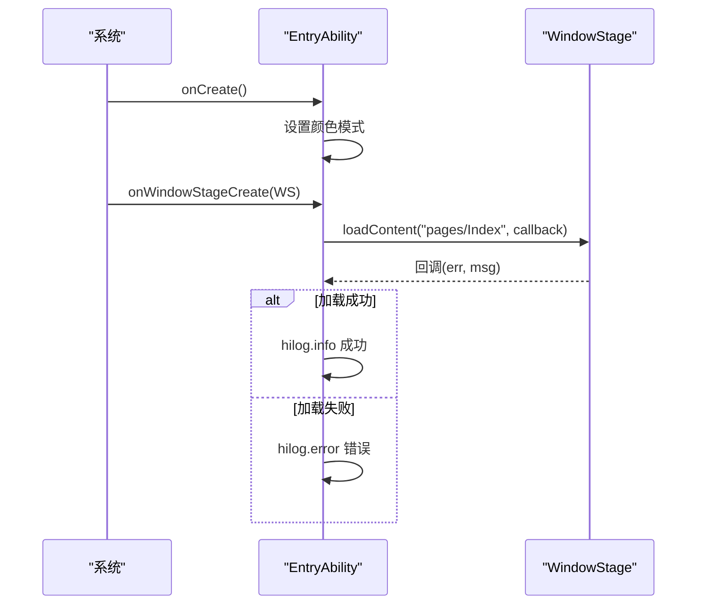
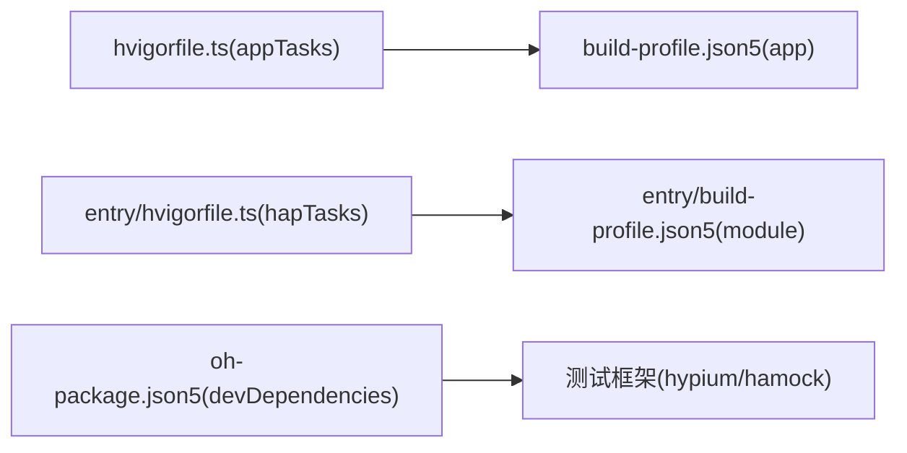

# 故障排除

<cite>
**本文引用的文件**
- [build-profile.json5](file://build-profile.json5)
- [hvigorfile.ts](file://hvigorfile.ts)
- [oh-package.json5](file://oh-package.json5)
- [entry/build-profile.json5](file://entry/build-profile.json5)
- [entry/hvigorfile.ts](file://entry/hvigorfile.ts)
- [Index.ets](file://entry/src/main/ets/pages/Index.ets)
- [DunjiaEngine.ets](file://entry/src/main/ets/utils/DunjiaEngine.ets)
- [CalendarManager.ets](file://entry/src/main/ets/utils/CalendarManager.ets)
- [SolarTermCalculator.ets](file://entry/src/main/ets/utils/SolarTermCalculator.ets)
- [EntryAbility.ets](file://entry/src/main/ets/entryability/EntryAbility.ets)
- [术数与真太阳时.md](file://entry/src/main/resources/rawfile/术数与真太阳时.md)
- [真太阳时讲解.md](file://entry/src/main/resources/rawfile/真太阳时讲解.md)
- [List.test.ets](file://entry/src/test/List.test.ets)
- [mock-config.json5](file://entry/src/mock/mock-config.json5)
</cite>

## 目录
1. [简介](#简介)
2. [项目结构](#项目结构)
3. [核心组件](#核心组件)
4. [架构总览](#架构总览)
5. [详细组件分析](#详细组件分析)
6. [依赖分析](#依赖分析)
7. [性能考量](#性能考量)
8. [故障排除指南](#故障排除指南)
9. [结论](#结论)
10. [附录](#附录)

## 简介
本指南面向“遁甲符应经”项目的开发者与运维人员，聚焦于构建失败、运行异常、数据错误、性能问题等常见问题的诊断与修复路径，并提供日志分析、错误追踪、模拟数据复现、版本兼容性处理以及社区支持渠道等实用建议。文档以代码级事实为基础，配合可视化图示帮助快速定位问题。

## 项目结构
项目采用模块化的多页面 ArkTS 应用结构，入口模块为 entry，包含页面、组件、工具类与资源。构建与打包通过 Hvigor 驱动，配置位于顶层与模块级 build-profile.json5 与 hvigorfile.ts。

图表来源
- [hvigorfile.ts](file://hvigorfile.ts#L1-L6)
- [build-profile.json5](file://build-profile.json5#L1-L56)
- [entry/hvigorfile.ts](file://entry/hvigorfile.ts#L1-L6)
- [entry/build-profile.json5](file://entry/build-profile.json5#L1-L33)

章节来源
- [hvigorfile.ts](file://hvigorfile.ts#L1-L6)
- [build-profile.json5](file://build-profile.json5#L1-L56)
- [entry/hvigorfile.ts](file://entry/hvigorfile.ts#L1-L6)
- [entry/build-profile.json5](file://entry/build-profile.json5#L1-L33)
- [oh-package.json5](file://oh-package.json5#L1-L11)

## 核心组件
- 入口页面与导航：Index 页面负责引导与路由跳转，承载首页入口与法律页链接。
- 核心引擎：DunjiaEngine 负责遁甲盘面计算、规则命中与结构评估，依赖日历与节气工具。
- 数据访问：CalendarManager 提供年历数据加载与缓存，SolarTermCalculator 提供节气精确时刻。
- 应用生命周期：EntryAbility 管理窗口阶段与日志记录，便于问题定位。
- 构建与测试：Hvigor 任务、模块构建配置、单元测试入口与模拟配置。

章节来源
- [Index.ets](file://entry/src/main/ets/pages/Index.ets#L1-L88)
- [DunjiaEngine.ets](file://entry/src/main/ets/utils/DunjiaEngine.ets#L1-L961)
- [CalendarManager.ets](file://entry/src/main/ets/utils/CalendarManager.ets#L1-L123)
- [SolarTermCalculator.ets](file://entry/src/main/ets/utils/SolarTermCalculator.ets#L1-L375)
- [EntryAbility.ets](file://entry/src/main/ets/entryability/EntryAbility.ets#L1-L48)
- [List.test.ets](file://entry/src/test/List.test.ets#L1-L5)
- [mock-config.json5](file://entry/src/mock/mock-config.json5#L1-L2)

## 架构总览
应用采用“页面-组件-工具类”的分层设计，数据流围绕 CalendarManager 与 SolarTermCalculator，最终由 DunjiaEngine 输出盘面与规则命中结果。入口能力负责窗口加载与日志输出。

图表来源
- [Index.ets](file://entry/src/main/ets/pages/Index.ets#L1-L88)
- [DunjiaEngine.ets](file://entry/src/main/ets/utils/DunjiaEngine.ets#L1-L961)
- [CalendarManager.ets](file://entry/src/main/ets/utils/CalendarManager.ets#L1-L123)
- [SolarTermCalculator.ets](file://entry/src/main/ets/utils/SolarTermCalculator.ets#L1-L375)
- [EntryAbility.ets](file://entry/src/main/ets/entryability/EntryAbility.ets#L1-L48)

## 详细组件分析

### 组件 A：DunjiaEngine（遁甲盘面计算）
职责：从输入时间、经度与场景类型，计算遁甲盘面、值符值使、九宫状态、规则命中与结构评估；提供默认输入与真太阳时偏移计算。

图表来源
- [DunjiaEngine.ets](file://entry/src/main/ets/utils/DunjiaEngine.ets#L1-L961)

章节来源
- [DunjiaEngine.ets](file://entry/src/main/ets/utils/DunjiaEngine.ets#L1-L961)

### 组件 B：CalendarManager（年历数据加载）
职责：按年份加载对应 JSON 年历数据，缓存并返回指定日期的干支与节气信息；提供文件名映射与错误日志。

图表来源
- [CalendarManager.ets](file://entry/src/main/ets/utils/CalendarManager.ets#L1-L123)

章节来源
- [CalendarManager.ets](file://entry/src/main/ets/utils/CalendarManager.ets#L1-L123)

### 组件 C：SolarTermCalculator（节气精确时刻）
职责：计算指定年份的24节气精确时刻，支持“最近前一个节气”“下一个节气”“按日期匹配”等查询；内部缓存与预加载。

图表来源
- [SolarTermCalculator.ets](file://entry/src/main/ets/utils/SolarTermCalculator.ets#L1-L375)

章节来源
- [SolarTermCalculator.ets](file://entry/src/main/ets/utils/SolarTermCalculator.ets#L1-L375)

### 组件 D：EntryAbility（应用生命周期与日志）
职责：设置颜色模式、记录窗口生命周期事件与内容加载结果；使用 hilog 输出日志，便于问题定位。

图表来源
- [EntryAbility.ets](file://entry/src/main/ets/entryability/EntryAbility.ets#L1-L48)

章节来源
- [EntryAbility.ets](file://entry/src/main/ets/entryability/EntryAbility.ets#L1-L48)

## 依赖分析
- 构建与插件：顶层 hvigorfile.ts 引入 appTasks，模块 hvigorfile.ts 引入 hapTasks；构建模式包含 debug/release。
- 依赖管理：oh-package.json5 声明开发依赖 hypium 与 hamock，用于测试与模拟。
- 模块配置：entry/build-profile.json5 控制资源复制、混淆规则与目标产物；顶层 build-profile.json5 管理签名、产品与构建模式。

图表来源
- [hvigorfile.ts](file://hvigorfile.ts#L1-L6)
- [entry/hvigorfile.ts](file://entry/hvigorfile.ts#L1-L6)
- [oh-package.json5](file://oh-package.json5#L1-L11)
- [build-profile.json5](file://build-profile.json5#L1-L56)
- [entry/build-profile.json5](file://entry/build-profile.json5#L1-L33)

章节来源
- [hvigorfile.ts](file://hvigorfile.ts#L1-L6)
- [entry/hvigorfile.ts](file://entry/hvigorfile.ts#L1-L6)
- [oh-package.json5](file://oh-package.json5#L1-L11)
- [build-profile.json5](file://build-profile.json5#L1-L56)
- [entry/build-profile.json5](file://entry/build-profile.json5#L1-L33)

## 性能考量
- 数据加载与缓存：CalendarManager 对年历数据进行缓存，减少重复 IO；SolarTermCalculator 对年份节气计算结果缓存，避免重复计算。
- 计算复杂度：DunjiaEngine 的布局与规则识别为 O(1)（固定九宫与有限规则），整体开销可控。
- 资源与混淆：entry/build-profile.json5 中 release 模式可配置混淆规则文件，建议在发布前开启以减小包体与提升安全性。

章节来源
- [CalendarManager.ets](file://entry/src/main/ets/utils/CalendarManager.ets#L1-L123)
- [SolarTermCalculator.ets](file://entry/src/main/ets/utils/SolarTermCalculator.ets#L1-L375)
- [entry/build-profile.json5](file://entry/build-profile.json5#L1-L33)

## 故障排除指南

### 一、构建失败
常见症状
- 签名配置缺失或证书路径错误
- 产品与构建模式未正确声明
- 模块目标产物未匹配

排查步骤
1. 校验顶层签名材料路径与别名、密码是否正确。
2. 确认产品名称与构建模式（debug/release）已在顶层配置中声明。
3. 确认模块 targets 与 applyToProducts 关联正确。
4. 若使用 release 混淆，确认混淆规则文件存在且路径正确。

定位文件
- [build-profile.json5](file://build-profile.json5#L1-L56)
- [entry/build-profile.json5](file://entry/build-profile.json5#L1-L33)
- [hvigorfile.ts](file://hvigorfile.ts#L1-L6)
- [entry/hvigorfile.ts](file://entry/hvigorfile.ts#L1-L6)

章节来源
- [build-profile.json5](file://build-profile.json5#L1-L56)
- [entry/build-profile.json5](file://entry/build-profile.json5#L1-L33)
- [hvigorfile.ts](file://hvigorfile.ts#L1-L6)
- [entry/hvigorfile.ts](file://entry/hvigorfile.ts#L1-L6)

### 二、运行时异常（页面加载失败）
常见症状
- 首页或法律页无法打开
- 生命周期回调报错

排查步骤
1. 检查 WindowStage.loadContent 回调中的错误码与消息。
2. 确认页面 URL 与模块路由一致。
3. 查看 hilog 输出，定位 onCreate/onWindowStageCreate/onDestroy 等阶段的异常。

定位文件
- [EntryAbility.ets](file://entry/src/main/ets/entryability/EntryAbility.ets#L1-L48)
- [Index.ets](file://entry/src/main/ets/pages/Index.ets#L1-L88)

章节来源
- [EntryAbility.ets](file://entry/src/main/ets/entryability/EntryAbility.ets#L1-L48)
- [Index.ets](file://entry/src/main/ets/pages/Index.ets#L1-L88)

### 三、数据错误（年历/节气/盘面为空）
常见症状
- 年历数据加载失败，返回空
- 节气查询为空或不正确
- 盘面为空或结构标签异常

排查步骤
1. CalendarManager 初始化是否传入上下文；若未初始化，将返回空并记录错误日志。
2. 年份是否在支持范围内（1900-2060）；超出范围将返回空。
3. 节气精确时刻计算是否命中缓存；必要时执行预加载。
4. DunjiaEngine 在无法获取干支信息时会返回空盘，检查上游数据链路。

定位文件
- [CalendarManager.ets](file://entry/src/main/ets/utils/CalendarManager.ets#L1-L123)
- [SolarTermCalculator.ets](file://entry/src/main/ets/utils/SolarTermCalculator.ets#L1-L375)
- [DunjiaEngine.ets](file://entry/src/main/ets/utils/DunjiaEngine.ets#L1-L961)

章节来源
- [CalendarManager.ets](file://entry/src/main/ets/utils/CalendarManager.ets#L1-L123)
- [SolarTermCalculator.ets](file://entry/src/main/ets/utils/SolarTermCalculator.ets#L1-L375)
- [DunjiaEngine.ets](file://entry/src/main/ets/utils/DunjiaEngine.ets#L1-L961)

### 四、性能问题（页面卡顿/计算耗时）
常见症状
- 页面切换延迟
- 盘面计算响应慢

优化建议
1. 确保 CalendarManager 与 SolarTermCalculator 的缓存生效，避免重复 IO 与计算。
2. 在 release 模式启用混淆规则，减小包体与提升加载效率。
3. 对高频调用的布局与规则识别逻辑保持 O(1) 复杂度，避免额外遍历。

定位文件
- [CalendarManager.ets](file://entry/src/main/ets/utils/CalendarManager.ets#L1-L123)
- [SolarTermCalculator.ets](file://entry/src/main/ets/utils/SolarTermCalculator.ets#L1-L375)
- [entry/build-profile.json5](file://entry/build-profile.json5#L1-L33)

章节来源
- [CalendarManager.ets](file://entry/src/main/ets/utils/CalendarManager.ets#L1-L123)
- [SolarTermCalculator.ets](file://entry/src/main/ets/utils/SolarTermCalculator.ets#L1-L375)
- [entry/build-profile.json5](file://entry/build-profile.json5#L1-L33)

### 五、日志分析与错误追踪
- 使用 hilog 输出关键生命周期与加载结果，便于定位页面加载失败与异常。
- 在 CalendarManager 与 SolarTermCalculator 中捕获异常并记录错误日志，便于发现数据加载失败与解析异常。

定位文件
- [EntryAbility.ets](file://entry/src/main/ets/entryability/EntryAbility.ets#L1-L48)
- [CalendarManager.ets](file://entry/src/main/ets/utils/CalendarManager.ets#L1-L123)
- [SolarTermCalculator.ets](file://entry/src/main/ets/utils/SolarTermCalculator.ets#L1-L375)

章节来源
- [EntryAbility.ets](file://entry/src/main/ets/entryability/EntryAbility.ets#L1-L48)
- [CalendarManager.ets](file://entry/src/main/ets/utils/CalendarManager.ets#L1-L123)
- [SolarTermCalculator.ets](file://entry/src/main/ets/utils/SolarTermCalculator.ets#L1-L375)

### 六、使用模拟数据进行问题复现
- 测试入口：entry/src/test/List.test.ets 聚合本地单元测试。
- 模拟配置：entry/src/mock/mock-config.json5 作为模拟开关文件，可扩展为测试桩配置。
- 建议：针对 CalendarManager 与 DunjiaEngine 的关键路径编写单元测试，使用 mock-config.json5 控制模拟数据加载。

定位文件
- [List.test.ets](file://entry/src/test/List.test.ets#L1-L5)
- [mock-config.json5](file://entry/src/mock/mock-config.json5#L1-L2)

章节来源
- [List.test.ets](file://entry/src/test/List.test.ets#L1-L5)
- [mock-config.json5](file://entry/src/mock/mock-config.json5#L1-L2)

### 七、版本兼容性问题
- 产品与运行时 OS：顶层 build-profile.json5 指定 runtimeOS 与 SDK 版本，确保 DevEco Studio 与设备版本匹配。
- 构建严格模式：开启大小写敏感与 OHM URL 规范化，避免资源引用大小写与路径差异导致的加载失败。
- 依赖版本：oh-package.json5 中的开发依赖版本需与当前 IDE 插件兼容。

定位文件
- [build-profile.json5](file://build-profile.json5#L1-L56)
- [oh-package.json5](file://oh-package.json5#L1-L11)

章节来源
- [build-profile.json5](file://build-profile.json5#L1-L56)
- [oh-package.json5](file://oh-package.json5#L1-L11)

### 八、真太阳时与术数应用相关问题
- 真太阳时重要性：奇门遁甲、紫微斗数、大六壬、金口诀等术数必须使用真太阳时，否则盘面与结论完全错误。
- 时差影响：西部地区（如乌鲁木齐、拉萨）与北京时间相差可达 2 小时以上，必须启用真太阳时。
- 子时争议：早子时（23:00-0:00）按“后一天”处理更符合主流术数实践。
- 建议：在界面中增强真太阳时显示与术数模式提示，提供时差警告与子时模式选择。

定位文件
- [术数与真太阳时.md](file://entry/src/main/resources/rawfile/术数与真太阳时.md#L1-L992)
- [真太阳时讲解.md](file://entry/src/main/resources/rawfile/真太阳时讲解.md#L1-L423)
- [DunjiaEngine.ets](file://entry/src/main/ets/utils/DunjiaEngine.ets#L1-L961)

章节来源
- [术数与真太阳时.md](file://entry/src/main/resources/rawfile/术数与真太阳时.md#L1-L992)
- [真太阳时讲解.md](file://entry/src/main/resources/rawfile/真太阳时讲解.md#L1-L423)
- [DunjiaEngine.ets](file://entry/src/main/ets/utils/DunjiaEngine.ets#L1-L961)

### 九、社区支持与问题反馈
- 开发依赖：项目使用 @ohos/hypium 与 @ohos/hamock 作为测试与模拟框架，建议在社区论坛或官方渠道反馈问题时附带日志与最小复现步骤。
- 建议：在 GitHub Issues 或 DevEco 社区提交问题时，包含以下信息：
  - 环境信息（IDE 版本、设备/模拟器版本、HarmonyOS 版本）
  - 复现步骤与期望/实际结果
  - 相关日志（hilog 输出）
  - 关键配置文件片段（build-profile.json5、hvigorfile.ts）

定位文件
- [oh-package.json5](file://oh-package.json5#L1-L11)

章节来源
- [oh-package.json5](file://oh-package.json5#L1-L11)

## 结论
本指南基于仓库现有代码与配置，梳理了构建、运行、数据与性能等关键问题的排查路径，并结合真太阳时与术数应用背景提供了针对性建议。建议在日常开发中：
- 重视日志输出与错误捕获
- 合理利用缓存与严格构建配置
- 在关键术数场景（奇门遁甲等）强制启用真太阳时
- 通过单元测试与模拟配置保障可复现性

## 附录
- 相关文件清单与定位路径见“本文引用的文件”。