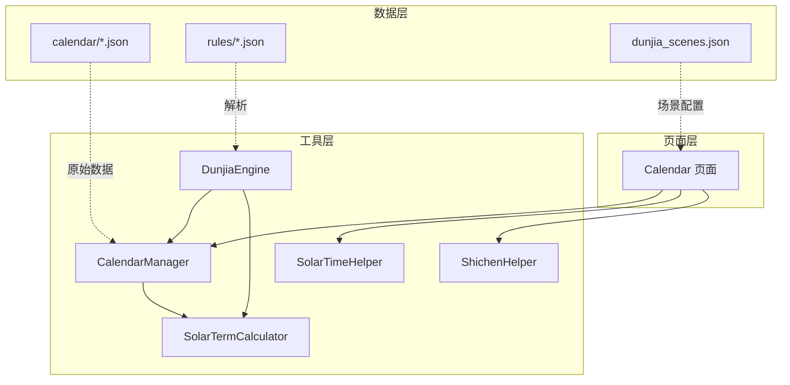
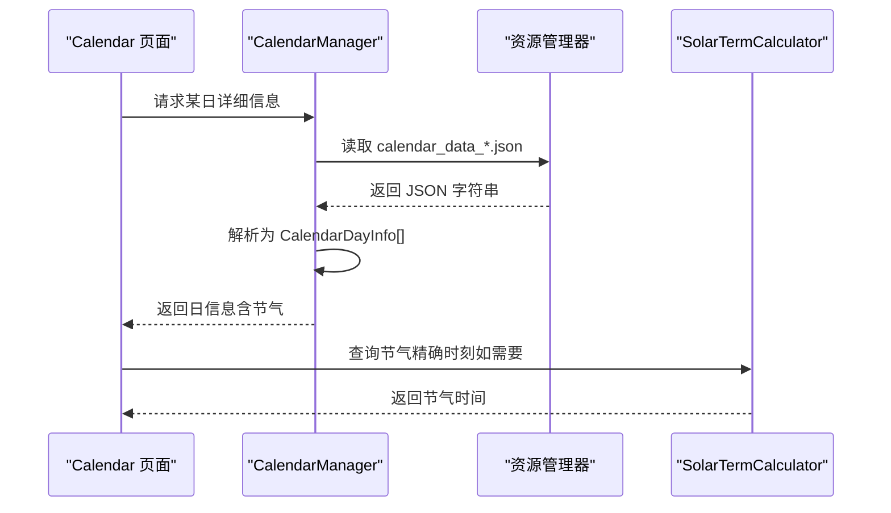
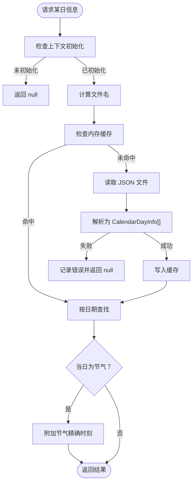
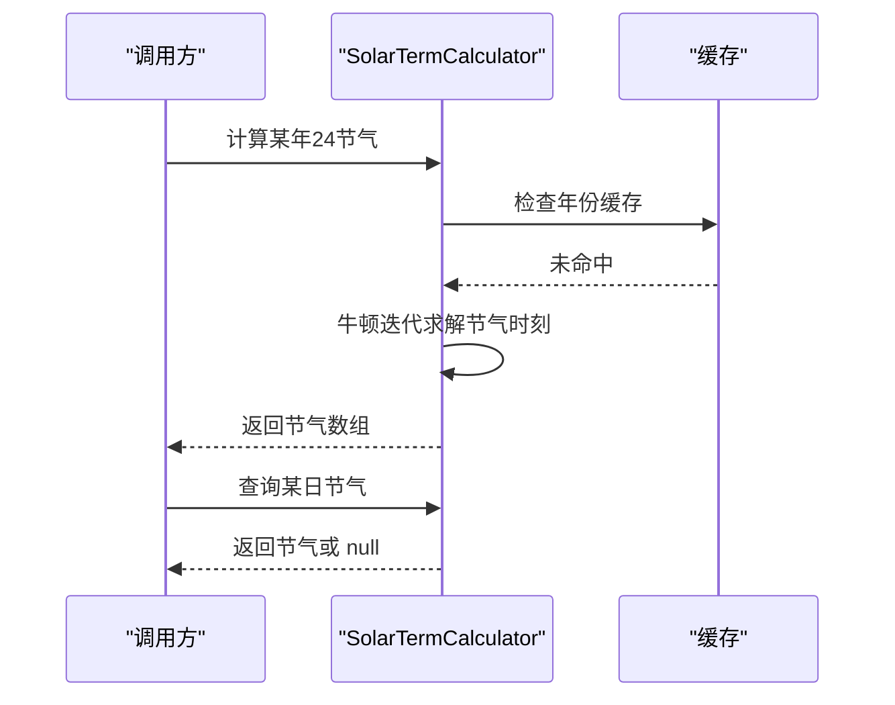
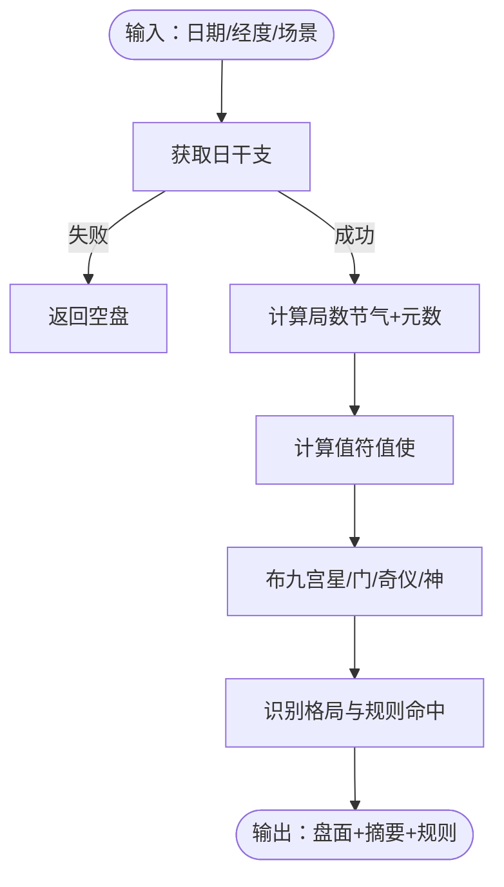
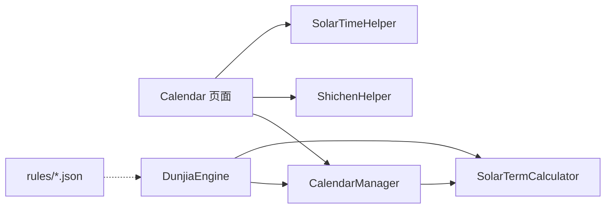

# 数据问题

<cite>
**本文引用的文件**
- [CalendarManager.ets](file://entry/src/main/ets/utils/CalendarManager.ets)
- [SolarTermCalculator.ets](file://entry/src/main/ets/utils/SolarTermCalculator.ets)
- [DunjiaEngine.ets](file://entry/src/main/ets/utils/DunjiaEngine.ets)
- [Calendar.ets](file://entry/src/main/ets/pages/Calendar.ets)
- [SolarTimeHelper.ets](file://entry/src/main/ets/utils/SolarTimeHelper.ets)
- [ShichenHelper.ets](file://entry/src/main/ets/utils/ShichenHelper.ets)
- [calendar_data_0001.json](file://entry/src/main/resources/rawfile/calendar/calendar_data_0001.json)
- [jiuxing_duanyu_rules.json](file://entry/src/main/resources/rawfile/rules/jiuxing_duanyu_rules.json)
- [sanqi_yingyan_rules.json](file://entry/src/main/resources/rawfile/rules/sanqi_yingyan_rules.json)
- [yongshen_mapping_rules.json](file://entry/src/main/resources/rawfile/rules/yongshen_mapping_rules.json)
- [zeri_yingyong_rules.json](file://entry/src/main/resources/rawfile/rules/zeri_yingyong_rules.json)
- [dunjia_scenes.json](file://entry/src/main/resources/rawfile/dunjia_scenes.json)
</cite>

## 目录
1. [简介](#简介)
2. [项目结构](#项目结构)
3. [核心组件](#核心组件)
4. [架构总览](#架构总览)
5. [详细组件分析](#详细组件分析)
6. [依赖分析](#依赖分析)
7. [性能考虑](#性能考虑)
8. [故障排除指南](#故障排除指南)
9. [结论](#结论)
10. [附录](#附录)

## 简介
本指南聚焦于本项目中的数据相关问题，涵盖日历数据加载失败、规则数据解析错误、计算结果异常、JSON数据格式验证与修正、日期计算与节气算法调试、规则文件读取与解析问题、数据完整性与服务端接口响应验证、数据缓存与同步诊断、本地存储与数据库访问异常处理、以及数据迁移与版本升级过程中的问题预防与修复。文档以代码为依据，提供可操作的排查步骤与图示。

## 项目结构
项目采用 ArkTS 分层组织，数据与算法集中在 utils 目录，页面组件在 pages 目录，原始资源在 resources/rawfile 目录。日历数据与规则数据以 JSON 文件形式嵌入资源，引擎与工具类负责解析与计算。

图表来源
- [Calendar.ets](file://entry/src/main/ets/pages/Calendar.ets#L1-L602)
- [CalendarManager.ets](file://entry/src/main/ets/utils/CalendarManager.ets#L1-L123)
- [SolarTermCalculator.ets](file://entry/src/main/ets/utils/SolarTermCalculator.ets#L1-L375)
- [DunjiaEngine.ets](file://entry/src/main/ets/utils/DunjiaEngine.ets#L1-L961)
- [SolarTimeHelper.ets](file://entry/src/main/ets/utils/SolarTimeHelper.ets#L1-L270)
- [ShichenHelper.ets](file://entry/src/main/ets/utils/ShichenHelper.ets#L1-L114)
- [calendar_data_0001.json](file://entry/src/main/resources/rawfile/calendar/calendar_data_0001.json#L1-L200)
- [jiuxing_duanyu_rules.json](file://entry/src/main/resources/rawfile/rules/jiuxing_duanyu_rules.json#L1-L256)
- [sanqi_yingyan_rules.json](file://entry/src/main/resources/rawfile/rules/sanqi_yingyan_rules.json#L1-L525)
- [yongshen_mapping_rules.json](file://entry/src/main/resources/rawfile/rules/yongshen_mapping_rules.json#L1-L510)
- [zeri_yingyong_rules.json](file://entry/src/main/resources/rawfile/rules/zeri_yingyong_rules.json#L1-L145)
- [dunjia_scenes.json](file://entry/src/main/resources/rawfile/dunjia_scenes.json#L1-L50)

章节来源
- [Calendar.ets](file://entry/src/main/ets/pages/Calendar.ets#L1-L602)
- [CalendarManager.ets](file://entry/src/main/ets/utils/CalendarManager.ets#L1-L123)
- [SolarTermCalculator.ets](file://entry/src/main/ets/utils/SolarTermCalculator.ets#L1-L375)
- [DunjiaEngine.ets](file://entry/src/main/ets/utils/DunjiaEngine.ets#L1-L961)
- [SolarTimeHelper.ets](file://entry/src/main/ets/utils/SolarTimeHelper.ets#L1-L270)
- [ShichenHelper.ets](file://entry/src/main/ets/utils/ShichenHelper.ets#L1-L114)
- [calendar_data_0001.json](file://entry/src/main/resources/rawfile/calendar/calendar_data_0001.json#L1-L200)
- [jiuxing_duanyu_rules.json](file://entry/src/main/resources/rawfile/rules/jiuxing_duanyu_rules.json#L1-L256)
- [sanqi_yingyan_rules.json](file://entry/src/main/resources/rawfile/rules/sanqi_yingyan_rules.json#L1-L525)
- [yongshen_mapping_rules.json](file://entry/src/main/resources/rawfile/rules/yongshen_mapping_rules.json#L1-L510)
- [zeri_yingyong_rules.json](file://entry/src/main/resources/rawfile/rules/zeri_yingyong_rules.json#L1-L145)
- [dunjia_scenes.json](file://entry/src/main/resources/rawfile/dunjia_scenes.json#L1-L50)

## 核心组件
- 日历数据管理：CalendarManager 负责按年份分片加载 calendar/*.json，解析为 CalendarDayInfo 数组，并按日期检索。
- 节气计算：SolarTermCalculator 提供节气精确时刻计算、缓存与跨年处理。
- 引擎计算：DunjiaEngine 依赖日历与节气，计算遁甲盘面、值符值使、九宫元素与规则命中。
- 真太阳时：SolarTimeHelper 提供均时差与经度修正，辅助节气与择日。
- 时辰工具：ShichenHelper 提供时辰干支推算与显示。
- 规则解析：各 rules/*.json 描述断语、应验、用神映射与择日规则，供引擎与 UI 使用。

章节来源
- [CalendarManager.ets](file://entry/src/main/ets/utils/CalendarManager.ets#L1-L123)
- [SolarTermCalculator.ets](file://entry/src/main/ets/utils/SolarTermCalculator.ets#L1-L375)
- [DunjiaEngine.ets](file://entry/src/main/ets/utils/DunjiaEngine.ets#L1-L961)
- [SolarTimeHelper.ets](file://entry/src/main/ets/utils/SolarTimeHelper.ets#L1-L270)
- [ShichenHelper.ets](file://entry/src/main/ets/utils/ShichenHelper.ets#L1-L114)
- [jiuxing_duanyu_rules.json](file://entry/src/main/resources/rawfile/rules/jiuxing_duanyu_rules.json#L1-L256)
- [sanqi_yingyan_rules.json](file://entry/src/main/resources/rawfile/rules/sanqi_yingyan_rules.json#L1-L525)
- [yongshen_mapping_rules.json](file://entry/src/main/resources/rawfile/rules/yongshen_mapping_rules.json#L1-L510)
- [zeri_yingyong_rules.json](file://entry/src/main/resources/rawfile/rules/zeri_yingyong_rules.json#L1-L145)

## 架构总览
日历与规则数据通过资源管理器加载，引擎在计算前确保数据可用，页面组件负责交互与展示。

图表来源
- [Calendar.ets](file://entry/src/main/ets/pages/Calendar.ets#L250-L257)
- [CalendarManager.ets](file://entry/src/main/ets/utils/CalendarManager.ets#L111-L121)
- [SolarTermCalculator.ets](file://entry/src/main/ets/utils/SolarTermCalculator.ets#L93-L115)

## 详细组件分析

### 日历数据加载与缓存（CalendarManager）
- 年份分片：按 10 年一组映射到 calendar_data_XXXX.json，超出范围返回空。
- 缓存策略：Map<String, Array<CalendarDayInfo>> 缓存已加载年份数据。
- 错误处理：读取失败或解析失败返回 null，并记录错误日志。
- 节气附加：若当日为节气，附加 SolarTermInfo。

图表来源
- [CalendarManager.ets](file://entry/src/main/ets/utils/CalendarManager.ets#L44-L121)

章节来源
- [CalendarManager.ets](file://entry/src/main/ets/utils/CalendarManager.ets#L30-L121)

### 节气计算与真太阳时（SolarTermCalculator/SolarTimeHelper）
- 节气计算：基于太阳黄经与牛顿迭代法，返回北京时间的节气时刻，支持缓存与跨年。
- 真太阳时：均时差与经度修正，计算真太阳时与本地时间差异。

图表来源
- [SolarTermCalculator.ets](file://entry/src/main/ets/utils/SolarTermCalculator.ets#L61-L159)

章节来源
- [SolarTermCalculator.ets](file://entry/src/main/ets/utils/SolarTermCalculator.ets#L30-L375)
- [SolarTimeHelper.ets](file://entry/src/main/ets/utils/SolarTimeHelper.ets#L29-L245)

### 引擎计算与规则匹配（DunjiaEngine）
- 输入：公历时间、经度、研习场景。
- 流程：获取日干支 -> 计算局数（节气+元数）-> 计算值符值使 -> 布九宫 -> 识别格局与规则命中 -> 生成结果。
- 异常：日干支缺失时返回空盘。

图表来源
- [DunjiaEngine.ets](file://entry/src/main/ets/utils/DunjiaEngine.ets#L113-L162)

章节来源
- [DunjiaEngine.ets](file://entry/src/main/ets/utils/DunjiaEngine.ets#L98-L640)

### 规则数据结构与解析
- 九星断语：包含基础属性、旺衰、断语与宜忌。
- 三奇应验：按日/月/星奇到宫的应验征兆与时间窗。
- 用神映射：按事务类型（寻人、寻物、出行、婚恋、求职、求财、考试、健康）选择用神与判断逻辑。
- 择日应用：五类日子、利客利主、五阳五阴时、天门地户玉女。

章节来源
- [jiuxing_duanyu_rules.json](file://entry/src/main/resources/rawfile/rules/jiuxing_duanyu_rules.json#L1-L256)
- [sanqi_yingyan_rules.json](file://entry/src/main/resources/rawfile/rules/sanqi_yingyan_rules.json#L1-L525)
- [yongshen_mapping_rules.json](file://entry/src/main/resources/rawfile/rules/yongshen_mapping_rules.json#L1-L510)
- [zeri_yingyong_rules.json](file://entry/src/main/resources/rawfile/rules/zeri_yingyong_rules.json#L1-L145)

## 依赖分析
- CalendarManager 依赖资源管理器读取 calendar/*.json。
- DunjiaEngine 依赖 CalendarManager 与 SolarTermCalculator。
- Calendar 页面依赖 CalendarManager、ShichenHelper、SolarTimeHelper。
- 规则文件独立于引擎，通过结构化字段驱动 UI 与分析。

图表来源
- [Calendar.ets](file://entry/src/main/ets/pages/Calendar.ets#L1-L10)
- [CalendarManager.ets](file://entry/src/main/ets/utils/CalendarManager.ets#L1-L3)
- [DunjiaEngine.ets](file://entry/src/main/ets/utils/DunjiaEngine.ets#L4-L5)

章节来源
- [Calendar.ets](file://entry/src/main/ets/pages/Calendar.ets#L1-L10)
- [CalendarManager.ets](file://entry/src/main/ets/utils/CalendarManager.ets#L1-L3)
- [DunjiaEngine.ets](file://entry/src/main/ets/utils/DunjiaEngine.ets#L4-L5)

## 性能考虑
- CalendarManager 使用 Map 缓存年数据，避免重复 IO。
- SolarTermCalculator 使用 Map 缓存年节气，减少重复计算。
- DunjiaEngine 在计算前尽量复用已解析的日干支与节气信息。
- 页面批量生成日历时使用 Promise.all 并行查询日期信息。

章节来源
- [CalendarManager.ets](file://entry/src/main/ets/utils/CalendarManager.ets#L33-L68)
- [SolarTermCalculator.ets](file://entry/src/main/ets/utils/SolarTermCalculator.ets#L32-L84)
- [Calendar.ets](file://entry/src/main/ets/pages/Calendar.ets#L82-L85)

## 故障排除指南

### 1. 日历数据加载失败
- 现象：页面无法显示某日信息或返回空。
- 排查步骤
  - 确认 CalendarManager 已初始化：检查页面 aboutToAppear 中的 init 调用。
  - 检查年份范围：CalendarManager 的年份映射仅支持 1900-2060。
  - 检查资源文件是否存在：确认 calendar_data_XXXX.json 是否存在于资源目录。
  - 查看控制台错误：loadJson 捕获异常并打印错误日志。
  - 验证 JSON 格式：使用 JSON 校验工具检查 calendar_data_0001.json 的语法。
- 修复建议
  - 若年份超出范围，调整输入或扩展分片映射。
  - 若文件缺失，补充对应 calendar_data_*.json。
  - 若 JSON 语法错误，修正后重新打包。

章节来源
- [CalendarManager.ets](file://entry/src/main/ets/utils/CalendarManager.ets#L44-L121)
- [Calendar.ets](file://entry/src/main/ets/pages/Calendar.ets#L32-L43)

### 2. 规则数据解析错误
- 现象：引擎或 UI 无法正确展示规则、断语或应验。
- 排查步骤
  - 校验 JSON 语法：使用在线 JSON 校验工具逐项检查 rules/*.json。
  - 核对字段：确保 id、name、category、rules 等字段存在且类型正确。
  - 检查编码：确认文件保存为 UTF-8，避免乱码导致解析失败。
  - 运行时日志：在解析处增加 try/catch 输出具体错误。
- 修复建议
  - 补充缺失字段或修正字段类型。
  - 统一字段命名与层级结构，避免大小写与拼写差异。

章节来源
- [jiuxing_duanyu_rules.json](file://entry/src/main/resources/rawfile/rules/jiuxing_duanyu_rules.json#L1-L256)
- [sanqi_yingyan_rules.json](file://entry/src/main/resources/rawfile/rules/sanqi_yingyan_rules.json#L1-L525)
- [yongshen_mapping_rules.json](file://entry/src/main/resources/rawfile/rules/yongshen_mapping_rules.json#L1-L510)
- [zeri_yingyong_rules.json](file://entry/src/main/resources/rawfile/rules/zeri_yingyong_rules.json#L1-L145)

### 3. 计算结果异常
- 现象：值符值使、局数或九宫状态异常。
- 排查步骤
  - 检查日干支来源：确认 CalendarManager.getDayInfo 返回值非空。
  - 核对节气：SolarTermCalculator.getNearestPrevSolarTerm 的返回值是否合理。
  - 检查经度：DunjiaEngine.calculateSolarTimeOffset 使用的经度是否正确。
  - 逐段调试：在 DunjiaEngine 的关键函数（如 calculateJu、calculateZhiFuZhiShi）添加日志。
- 修复建议
  - 若日干支为空，返回空盘并提示数据加载失败。
  - 若节气跨年边界，确认跨年逻辑（前一年节气集合）。
  - 校正经度输入，确保真太阳时偏移正确。

章节来源
- [DunjiaEngine.ets](file://entry/src/main/ets/utils/DunjiaEngine.ets#L113-L162)
- [CalendarManager.ets](file://entry/src/main/ets/utils/CalendarManager.ets#L247-L250)
- [SolarTermCalculator.ets](file://entry/src/main/ets/utils/SolarTermCalculator.ets#L143-L159)
- [SolarTimeHelper.ets](file://entry/src/main/ets/utils/SolarTimeHelper.ets#L658-L661)

### 4. JSON 数据格式验证与修正技巧
- 验证清单
  - 顶层必须为对象或数组。
  - 字段名使用双引号，避免尾逗号。
  - 数字、布尔值不使用引号。
  - 日期字符串遵循 YYYY-MM-DD。
  - 数组元素结构一致，避免混杂类型。
- 修正流程
  - 使用 JSONLint 或 VSCode JSON 扩展自动格式化与纠错。
  - 逐步注释可疑字段，定位错误位置。
  - 对大型 JSON 分块校验，缩小范围后再合并。

章节来源
- [calendar_data_0001.json](file://entry/src/main/resources/rawfile/calendar/calendar_data_0001.json#L1-L200)
- [jiuxing_duanyu_rules.json](file://entry/src/main/resources/rawfile/rules/jiuxing_duanyu_rules.json#L1-L256)
- [sanqi_yingyan_rules.json](file://entry/src/main/resources/rawfile/rules/sanqi_yingyan_rules.json#L1-L525)
- [yongshen_mapping_rules.json](file://entry/src/main/resources/rawfile/rules/yongshen_mapping_rules.json#L1-L510)
- [zeri_yingyong_rules.json](file://entry/src/main/resources/rawfile/rules/zeri_yingyong_rules.json#L1-L145)

### 5. 日期计算与节气算法调试
- 调试要点
  - 节气边界：跨年小寒/大寒需检查前一年节气集合。
  - 缓存一致性：修改年份后清理 SolarTermCalculator 缓存。
  - 精确时刻：核对北京时间与儒略日转换逻辑。
- 诊断步骤
  - 打印节气数组与目标日期比较。
  - 使用 formatSolarTermTime 与 getShortDescription 辅助比对。
  - 验证 isSameDay 逻辑，避免时区/毫秒差异。

章节来源
- [SolarTermCalculator.ets](file://entry/src/main/ets/utils/SolarTermCalculator.ets#L93-L159)
- [SolarTermCalculator.ets](file://entry/src/main/ets/utils/SolarTermCalculator.ets#L331-L355)

### 6. 规则文件读取与解析问题
- 问题类型
  - 文件未被打包：确认 rules/*.json 在 rawfile/rule 下并参与构建。
  - 字段缺失：引擎按结构读取，缺失字段会导致解析失败。
  - 编码问题：非 UTF-8 导致解析异常。
- 解决方案
  - 检查构建配置，确保 rawfile 资源包含 rules。
  - 统一字段命名，提供默认值或容错分支。
  - 统一编码为 UTF-8，避免 BOM。

章节来源
- [jiuxing_duanyu_rules.json](file://entry/src/main/resources/rawfile/rules/jiuxing_duanyu_rules.json#L1-L256)
- [sanqi_yingyan_rules.json](file://entry/src/main/resources/rawfile/rules/sanqi_yingyan_rules.json#L1-L525)
- [yongshen_mapping_rules.json](file://entry/src/main/resources/rawfile/rules/yongshen_mapping_rules.json#L1-L510)
- [zeri_yingyong_rules.json](file://entry/src/main/resources/rawfile/rules/zeri_yingyong_rules.json#L1-L145)

### 7. 数据完整性与服务端接口响应验证
- 验证方法
  - 校验关键字段：date、year、month、day、lunar_*、day_gan、day_zhi、solar_term、festivals。
  - 跨年与闰年：检查 2 月 28/29 日与跨年边界。
  - 节气一致性：节气名称与日期匹配，且相邻节气时间间隔合理。
- 诊断步骤
  - 生成样本数据对比：随机抽取 100 天比对字段完整性。
  - 与历史数据交叉验证：与已知节气表比对。
  - 接口模拟：在本地构造错误数据，验证引擎降级处理。

章节来源
- [calendar_data_0001.json](file://entry/src/main/resources/rawfile/calendar/calendar_data_0001.json#L1-L200)
- [CalendarManager.ets](file://entry/src/main/ets/utils/CalendarManager.ets#L51-L92)

### 8. 数据缓存与同步问题诊断
- 现象：页面显示旧数据或缓存不一致。
- 诊断步骤
  - 检查 CalendarManager 缓存键：按文件名缓存，确认键一致。
  - 检查 SolarTermCalculator 缓存：跨年场景需清理或预加载。
  - 检查页面生命周期：避免重复初始化导致上下文丢失。
- 修复建议
  - 提供缓存清理接口（如 clearCache）。
  - 预加载常用年份节气（preloadYears）。
  - 在页面销毁时清理缓存，避免内存泄漏。

章节来源
- [CalendarManager.ets](file://entry/src/main/ets/utils/CalendarManager.ets#L33-L68)
- [SolarTermCalculator.ets](file://entry/src/main/ets/utils/SolarTermCalculator.ets#L360-L373)

### 9. 本地存储与数据库访问异常
- 说明：本项目使用资源文件与内存缓存，未直接使用本地数据库。
- 建议
  - 若引入本地存储，统一使用类型安全的序列化/反序列化。
  - 对关键数据提供校验和或版本号，防止脏数据。
  - 在升级时提供迁移脚本，兼容旧版本结构。

[本节为通用指导，不直接分析具体文件]

### 10. 数据迁移与版本升级
- 预防措施
  - 版本化 JSON 字段：为规则与日历数据添加 version 字段。
  - 向后兼容：新增字段提供默认值，避免解析失败。
  - 自动迁移：提供迁移函数，将旧格式转换为新格式。
- 修复流程
  - 读取旧版本数据，映射到新结构。
  - 校验转换结果，必要时回滚。
  - 记录迁移日志，便于审计。

章节来源
- [jiuxing_duanyu_rules.json](file://entry/src/main/resources/rawfile/rules/jiuxing_duanyu_rules.json#L252-L256)
- [sanqi_yingyan_rules.json](file://entry/src/main/resources/rawfile/rules/sanqi_yingyan_rules.json#L521-L525)
- [yongshen_mapping_rules.json](file://entry/src/main/resources/rawfile/rules/yongshen_mapping_rules.json#L503-L508)
- [zeri_yingyong_rules.json](file://entry/src/main/resources/rawfile/rules/zeri_yingyong_rules.json#L141-L143)

## 结论
本指南围绕日历数据、节气算法、规则解析与引擎计算提供了系统化的故障排除方法。通过严格的 JSON 校验、缓存与边界条件处理、以及分层调试，可高效定位并修复数据相关问题。建议在开发与发布流程中固化校验与迁移机制，提升系统的稳定性与可维护性。

## 附录
- 场景配置：dunjia_scenes.json 提供研习场景的标题、摘要与标签，便于 UI 展示与导航。

章节来源
- [dunjia_scenes.json](file://entry/src/main/resources/rawfile/dunjia_scenes.json#L1-L50)