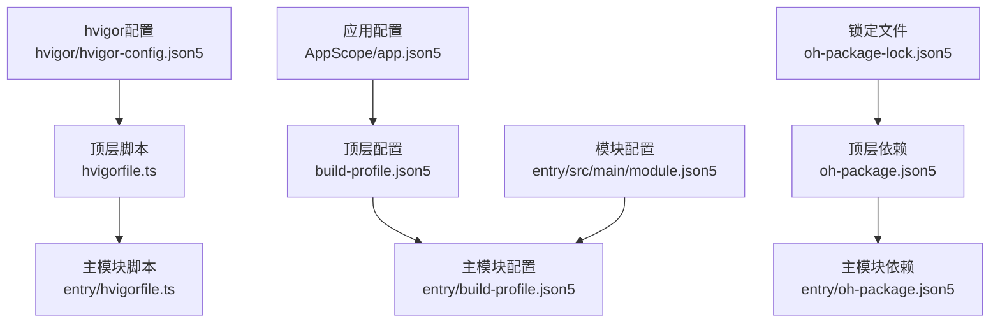
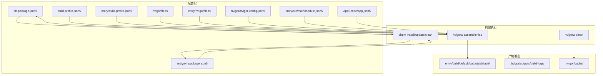
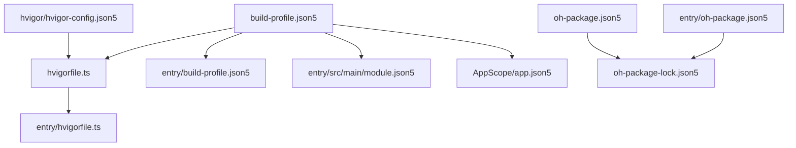
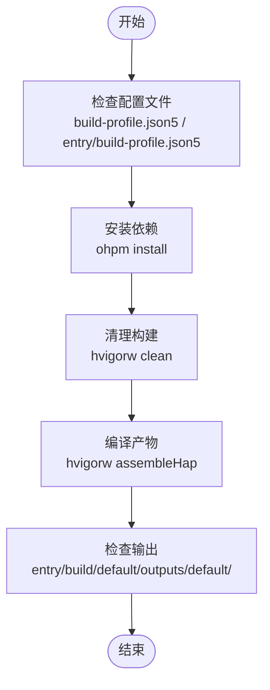

# 构建问题

<cite>
**本文引用的文件**
- [build-profile.json5](file://build-profile.json5)
- [entry/build-profile.json5](file://entry/build-profile.json5)
- [hvigorfile.ts](file://hvigorfile.ts)
- [entry/hvigorfile.ts](file://entry/hvigorfile.ts)
- [oh-package.json5](file://oh-package.json5)
- [entry/oh-package.json5](file://entry/oh-package.json5)
- [oh-package-lock.json5](file://oh-package-lock.json5)
- [hvigor/hvigor-config.json5](file://hvigor/hvigor-config.json5)
- [local.properties](file://local.properties)
- [entry/src/main/module.json5](file://entry/src/main/module.json5)
- [AppScope/app.json5](file://AppScope/app.json5)
- [entry/src/main/ets/pages/DocsPage.ets](file://entry/src/main/ets/pages/DocsPage.ets)
- [entry/src/main/ets/utils/SolarTimeHelper.ets](file://entry/src/main/ets/utils/SolarTimeHelper.ets)
- [组件化细要.md](file://组件化细要.md)
- [ArkTS开发规范指南.md](file://ArkTS开发规范指南.md)
- [鸿蒙命令行编译助手.md](file://鸿蒙命令行编译助手.md)
</cite>

## 目录
1. [简介](#简介)
2. [项目结构](#项目结构)
3. [核心组件](#核心组件)
4. [架构总览](#架构总览)
5. [详细组件分析](#详细组件分析)
6. [依赖关系分析](#依赖关系分析)
7. [性能考虑](#性能考虑)
8. [故障排除指南](#故障排除指南)
9. [结论](#结论)
10. [附录](#附录)

## 简介
本指南聚焦于本项目的构建问题排查与修复，覆盖依赖安装问题、版本冲突、编译错误、hvigor构建工具使用、build-profile配置调整、npm/ohpm包管理器问题、缓存清理与重新构建流程、模块解析失败与路径配置错误处理，以及开发环境配置验证方法。内容基于仓库中的实际配置文件与开发规范文档整理，旨在帮助开发者快速定位并解决问题。

## 项目结构
本项目采用多模块结构，主模块为 entry，应用级配置位于 AppScope，构建工具使用 hvigor，包管理使用 ohpm。关键配置文件分布如下：
- 顶层构建配置：build-profile.json5
- 主模块构建配置：entry/build-profile.json5
- 顶层构建脚本：hvigorfile.ts
- 主模块构建脚本：entry/hvigorfile.ts
- 顶层依赖配置：oh-package.json5
- 主模块依赖配置：entry/oh-package.json5
- 顶层锁定文件：oh-package-lock.json5
- hvigor执行配置：hvigor/hvigor-config.json5
- 开发环境配置占位：local.properties
- 主模块模块配置：entry/src/main/module.json5
- 应用级配置：AppScope/app.json5

图表来源
- [build-profile.json5](file://build-profile.json5#L1-L56)
- [entry/build-profile.json5](file://entry/build-profile.json5#L1-L33)
- [hvigorfile.ts](file://hvigorfile.ts#L1-L6)
- [entry/hvigorfile.ts](file://entry/hvigorfile.ts#L1-L6)
- [oh-package.json5](file://oh-package.json5#L1-L11)
- [entry/oh-package.json5](file://entry/oh-package.json5#L1-L11)
- [hvigor/hvigor-config.json5](file://hvigor/hvigor-config.json5#L1-L24)
- [entry/src/main/module.json5](file://entry/src/main/module.json5#L1-L50)
- [AppScope/app.json5](file://AppScope/app.json5#L1-L11)
- [oh-package-lock.json5](file://oh-package-lock.json5#L1-L28)

章节来源
- [build-profile.json5](file://build-profile.json5#L1-L56)
- [entry/build-profile.json5](file://entry/build-profile.json5#L1-L33)
- [hvigorfile.ts](file://hvigorfile.ts#L1-L6)
- [entry/hvigorfile.ts](file://entry/hvigorfile.ts#L1-L6)
- [oh-package.json5](file://oh-package.json5#L1-L11)
- [entry/oh-package.json5](file://entry/oh-package.json5#L1-L11)
- [hvigor/hvigor-config.json5](file://hvigor/hvigor-config.json5#L1-L24)
- [entry/src/main/module.json5](file://entry/src/main/module.json5#L1-L50)
- [AppScope/app.json5](file://AppScope/app.json5#L1-L11)
- [oh-package-lock.json5](file://oh-package-lock.json5#L1-L28)

## 核心组件
- 构建配置层
  - 顶层构建配置：定义签名、产品配置、构建模式集合与模块映射。
  - 主模块构建配置：定义API类型、资源复制策略、目标产物与发布配置。
- 构建脚本层
  - 顶层hvigorfile.ts：绑定系统任务，扩展插件。
  - 主模块hvigorfile.ts：绑定HAP任务。
- 依赖与锁定层
  - 顶层oh-package.json5与entry/oh-package.json5：声明依赖与开发依赖。
  - oh-package-lock.json5：锁定依赖版本，保证可复现性。
- hvigor执行层
  - hvigor/hvigor-config.json5：控制执行模式、日志级别、调试选项与Node参数。
- 模块与应用配置层
  - entry/src/main/module.json5：定义模块类型、页面、能力与扩展能力。
  - AppScope/app.json5：定义应用级包名、图标、标签等。

章节来源
- [build-profile.json5](file://build-profile.json5#L1-L56)
- [entry/build-profile.json5](file://entry/build-profile.json5#L1-L33)
- [hvigorfile.ts](file://hvigorfile.ts#L1-L6)
- [entry/hvigorfile.ts](file://entry/hvigorfile.ts#L1-L6)
- [oh-package.json5](file://oh-package.json5#L1-L11)
- [entry/oh-package.json5](file://entry/oh-package.json5#L1-L11)
- [hvigor/hvigor-config.json5](file://hvigor/hvigor-config.json5#L1-L24)
- [entry/src/main/module.json5](file://entry/src/main/module.json5#L1-L50)
- [AppScope/app.json5](file://AppScope/app.json5#L1-L11)

## 架构总览
下图展示了从配置到构建产物的关键流转路径，包括hvigor任务、模块配置与产物输出位置。

图表来源
- [build-profile.json5](file://build-profile.json5#L1-L56)
- [entry/build-profile.json5](file://entry/build-profile.json5#L1-L33)
- [hvigorfile.ts](file://hvigorfile.ts#L1-L6)
- [entry/hvigorfile.ts](file://entry/hvigorfile.ts#L1-L6)
- [oh-package.json5](file://oh-package.json5#L1-L11)
- [entry/oh-package.json5](file://entry/oh-package.json5#L1-L11)
- [hvigor/hvigor-config.json5](file://hvigor/hvigor-config.json5#L1-L24)
- [entry/src/main/module.json5](file://entry/src/main/module.json5#L1-L50)
- [AppScope/app.json5](file://AppScope/app.json5#L1-L11)
- [鸿蒙命令行编译助手.md](file://鸿蒙命令行编译助手.md#L47-L107)

章节来源
- [鸿蒙命令行编译助手.md](file://鸿蒙命令行编译助手.md#L47-L107)

## 详细组件分析

### 构建配置文件分析
- 顶层构建配置（build-profile.json5）
  - 签名配置：包含证书路径、密钥别名、密码与签名算法等字段，确保签名材料有效且路径正确。
  - 产品配置：定义目标SDK版本、兼容SDK版本、运行时操作系统与严格模式开关。
  - 构建模式：提供debug与release两种模式集合。
  - 模块映射：将entry模块与default目标关联。
- 主模块构建配置（entry/build-profile.json5）
  - API类型：stageMode，适用于阶段化构建。
  - 资源复制策略：关闭代码资源复制，避免重复拷贝。
  - 发布配置：release目标下的Ark编译混淆规则文件路径。
  - 目标产物：default与ohosTest两个目标。

章节来源
- [build-profile.json5](file://build-profile.json5#L1-L56)
- [entry/build-profile.json5](file://entry/build-profile.json5#L1-L33)

### hvigor构建脚本分析
- 顶层hvigorfile.ts
  - 绑定系统任务appTasks，作为构建入口。
  - 插件数组为空，表示当前无自定义插件。
- 主模块hvigorfile.ts
  - 绑定系统任务hapTasks，专用于HAP产物构建。

章节来源
- [hvigorfile.ts](file://hvigorfile.ts#L1-L6)
- [entry/hvigorfile.ts](file://entry/hvigorfile.ts#L1-L6)

### 依赖与锁定文件分析
- 顶层oh-package.json5
  - 依赖为空，开发依赖包含@ohos/hypium与@ohos/hamock。
- 主模块oh-package.json5
  - 依赖为空，符合模块独立依赖的组织方式。
- 锁定文件oh-package-lock.json5
  - 记录ohpm注册表中的包版本与完整性校验，确保依赖一致性。

章节来源
- [oh-package.json5](file://oh-package.json5#L1-L11)
- [entry/oh-package.json5](file://entry/oh-package.json5#L1-L11)
- [oh-package-lock.json5](file://oh-package-lock.json5#L1-L28)

### hvigor执行配置分析
- hvigor/hvigor-config.json5
  - execution：可配置分析模式、守护进程、增量编译、并行编译、类型检查与优化策略。
  - logging：可设置日志级别。
  - debugging：可控制堆栈跟踪。
  - nodeOptions：可设置Node.js内存与GC相关参数。

章节来源
- [hvigor/hvigor-config.json5](file://hvigor/hvigor-config.json5#L1-L24)

### 模块与应用配置分析
- entry/src/main/module.json5
  - 定义模块类型为entry，主元素为EntryAbility，设备类型为phone。
  - 页面与能力配置指向profile与资源路径。
  - 扩展能力包含备份能力及其元数据。
- AppScope/app.json5
  - 定义应用bundleName、图标、标签等应用级信息。

章节来源
- [entry/src/main/module.json5](file://entry/src/main/module.json5#L1-L50)
- [AppScope/app.json5](file://AppScope/app.json5#L1-L11)

### ArkTS开发规范与编译限制
- ArkTS开发规范指南
  - 核心禁用规则：禁止any/unknown、索引签名、内联对象字面量、for...in/for...of用于对象、动态索引访问、解构赋值、展开运算符、可选链、空值合并等。
  - 推荐替代方案：使用Map/Record、传统循环、预定义接口、显式类型注解等。
  - 常见编译错误与解决方案：针对违规语法给出明确的错误代码与修复建议。
- 组件化细要
  - 路径一致性：组件内部硬编码路径需与rawfile目录结构一致。
  - 单例状态：跨项目使用时需在入口调用init()初始化上下文。
  - 类型定义：确保导出所有必需的接口与枚举。
  - 样式适配：组件内硬编码颜色与尺寸，如需适配建议提取为主题配置。

章节来源
- [ArkTS开发规范指南.md](file://ArkTS开发规范指南.md#L1-L800)
- [组件化细要.md](file://组件化细要.md#L385-L429)

## 依赖关系分析
下图展示配置文件之间的依赖关系与耦合点，便于定位配置冲突与版本不一致问题。

图表来源
- [build-profile.json5](file://build-profile.json5#L1-L56)
- [hvigorfile.ts](file://hvigorfile.ts#L1-L6)
- [entry/build-profile.json5](file://entry/build-profile.json5#L1-L33)
- [entry/hvigorfile.ts](file://entry/hvigorfile.ts#L1-L6)
- [oh-package.json5](file://oh-package.json5#L1-L11)
- [entry/oh-package.json5](file://entry/oh-package.json5#L1-L11)
- [oh-package-lock.json5](file://oh-package-lock.json5#L1-L28)
- [hvigor/hvigor-config.json5](file://hvigor/hvigor-config.json5#L1-L24)
- [entry/src/main/module.json5](file://entry/src/main/module.json5#L1-L50)
- [AppScope/app.json5](file://AppScope/app.json5#L1-L11)

章节来源
- [build-profile.json5](file://build-profile.json5#L1-L56)
- [hvigorfile.ts](file://hvigorfile.ts#L1-L6)
- [entry/build-profile.json5](file://entry/build-profile.json5#L1-L33)
- [hvigor/hvigor-config.json5](file://hvigor/hvigor-config.json5#L1-L24)
- [oh-package.json5](file://oh-package.json5#L1-L11)
- [entry/oh-package.json5](file://entry/oh-package.json5#L1-L11)
- [oh-package-lock.json5](file://oh-package-lock.json5#L1-L28)
- [entry/src/main/module.json5](file://entry/src/main/module.json5#L1-L50)
- [AppScope/app.json5](file://AppScope/app.json5#L1-L11)

## 性能考虑
- 增量编译：优先使用增量编译减少全量编译时间，避免频繁执行hvigorw clean。
- 并行编译：Hvigor默认启用并行编译，有助于提升构建效率。
- 缓存利用：保留hvigor缓存目录，避免重复下载与解析依赖。
- 日志级别：在调试阶段可适当提高日志级别以便定位问题，但生产构建建议使用较低日志级别以减少IO开销。

## 故障排除指南

### 一、依赖包安装问题
- 现象
  - 依赖安装失败、版本冲突或网络超时。
- 排查步骤
  - 检查ohpm注册表可用性与网络代理设置。
  - 运行ohpm install安装依赖；若失败，先执行ohpm clean清理缓存后重试。
  - 对比oh-package-lock.json5与oh-package.json5，确保锁定文件与依赖声明一致。
- 修复建议
  - 在hvigor/hvigor-config.json5中开启并行与增量编译以加速安装过程。
  - 若存在私有包或镜像源，确保ohpm配置正确。

章节来源
- [oh-package.json5](file://oh-package.json5#L1-L11)
- [oh-package-lock.json5](file://oh-package-lock.json5#L1-L28)
- [hvigor/hvigor-config.json5](file://hvigor/hvigor-config.json5#L1-L24)
- [鸿蒙命令行编译助手.md](file://鸿蒙命令行编译助手.md#L71-L87)

### 二、版本冲突与配置不一致
- 现象
  - 构建时报错提示版本不匹配或SDK版本错误。
- 排查步骤
  - 检查build-profile.json5中的targetSdkVersion与compatibleSdkVersion是否与已安装SDK一致。
  - 确认hvigor/hvigor-config.json5、oh-package.json5与build-profile.json5中的版本号保持一致。
- 修复建议
  - 更新build-profile.json5中的SDK版本至系统已安装版本。
  - 同步各配置文件版本号，避免跨文件版本漂移。

章节来源
- [build-profile.json5](file://build-profile.json5#L18-L32)
- [hvigor/hvigor-config.json5](file://hvigor/hvigor-config.json5#L1-L24)
- [鸿蒙命令行编译助手.md](file://鸿蒙命令行编译助手.md#L114-L115)

### 三、编译错误（基于ArkTS开发规范）
- 现象
  - 编译报错：属性访问不允许、索引签名不允许、对象字面量类型不允许、静态上下文中的this使用、解构赋值不允许、展开运算符不允许、可选链不允许、空值合并不允许、返回类型注解缺失等。
- 排查步骤
  - 根据错误代码定位违规语法，对照ArkTS开发规范指南中的“常见编译错误及解决方案”进行修正。
  - 检查组件与工具类是否遵循规范，如使用Map替代动态索引、使用传统循环替代for...in/for...of等。
- 修复建议
  - 将内联对象字面量替换为预定义接口。
  - 使用switch语句或Map替代动态索引访问。
  - 使用显式类型注解与明确的返回类型。

章节来源
- [ArkTS开发规范指南.md](file://ArkTS开发规范指南.md#L749-L781)

### 四、hvigor构建工具使用与常见错误处理
- 常用命令
  - hvigorw assembleHap：编译HAP产物。
  - hvigorw assembleHap --mode debug/release：指定构建模式。
  - hvigorw clean：清理缓存与中间产物。
  - hvigorw clean && hvigorw assembleHap：先清理再编译。
- 常见问题
  - 工具未找到：检查PATH环境变量，确保命令行工具路径已加入。
  - 构建失败：先执行hvigorw clean清理缓存，再重新编译。
  - 签名警告：在build-profile.json5中完善signingConfigs配置。
- 输出位置
  - HAP包：entry/build/default/outputs/default/
  - 构建日志：.hvigor/outputs/build-logs/
  - 缓存文件：.hvigor/cache/

章节来源
- [鸿蒙命令行编译助手.md](file://鸿蒙命令行编译助手.md#L47-L107)

### 五、build-profile配置文件调整方法
- 顶层配置（build-profile.json5）
  - 签名配置：确保certpath、storeFile、keyAlias、password等字段路径与内容正确。
  - 产品配置：targetSdkVersion与compatibleSdkVersion需与系统SDK一致。
  - 构建模式：根据需要启用debug与release模式。
  - 模块映射：确保entry模块与default目标正确关联。
- 主模块配置（entry/build-profile.json5）
  - API类型：stageMode适用于阶段化构建。
  - 资源复制：关闭copyCodeResource避免重复拷贝。
  - 发布配置：release目标下的Ark编译混淆规则文件路径需存在。

章节来源
- [build-profile.json5](file://build-profile.json5#L1-L56)
- [entry/build-profile.json5](file://entry/build-profile.json5#L1-L33)

### 六、npm/ohpm包管理器问题解决步骤
- 依赖安装失败
  - 执行ohpm install安装依赖。
  - 若失败，执行ohpm clean清理缓存后重试。
- 依赖更新
  - 执行ohpm update更新依赖至最新兼容版本。
- 依赖列表
  - 执行ohpm list查看当前依赖树。
- 锁定文件一致性
  - 确保oh-package-lock.json5与oh-package.json5一致，避免版本漂移。

章节来源
- [oh-package.json5](file://oh-package.json5#L1-L11)
- [oh-package-lock.json5](file://oh-package-lock.json5#L1-L28)
- [鸿蒙命令行编译助手.md](file://鸿蒙命令行编译助手.md#L71-L87)

### 七、清理缓存与重新构建流程
- 流程步骤
  - 执行hvigorw clean清理缓存与中间产物。
  - 执行ohpm install安装依赖。
  - 执行hvigorw assembleHap编译项目。
  - 检查产物：entry/build/default/outputs/default/。
- 注意事项
  - 频繁clean会影响构建速度，建议仅在必要时执行。
  - 并行编译与增量编译可显著提升效率。

章节来源
- [鸿蒙命令行编译助手.md](file://鸿蒙命令行编译助手.md#L102-L107)

### 八、模块解析失败与路径配置错误
- 现象
  - 资源读取失败、模块导入路径错误、rawfile路径不一致导致文件加载异常。
- 排查步骤
  - 检查组件导入路径是否使用相对路径且与目录层级一致。
  - 确认组件内部硬编码路径与rawfile目录结构一致。
  - 在跨项目使用时，确保在入口调用管理器的init()方法初始化上下文。
- 修复建议
  - 统一路径风格，避免绝对路径与相对路径混用。
  - 将硬编码路径提取为常量或配置项，便于维护与适配。

章节来源
- [组件化细要.md](file://组件化细要.md#L385-L429)
- [entry/src/main/ets/pages/DocsPage.ets](file://entry/src/main/ets/pages/DocsPage.ets#L1-L41)

### 九、开发环境配置验证
- 环境变量
  - 确认命令行工具路径已加入PATH，确保hvigorw与ohpm可用。
- 配置文件一致性
  - 检查hvigor/hvigor-config.json5、oh-package.json5与build-profile.json5中的版本号一致。
- 本地配置
  - local.properties为DevEco Studio生成文件，避免手动修改。

章节来源
- [鸿蒙命令行编译助手.md](file://鸿蒙命令行编译助手.md#L7-L16)
- [hvigor/hvigor-config.json5](file://hvigor/hvigor-config.json5#L1-L24)
- [oh-package.json5](file://oh-package.json5#L1-L11)
- [local.properties](file://local.properties#L1-L10)

## 结论
本指南围绕本项目的构建配置与工具使用，提供了从依赖安装、版本一致性、编译限制到hvigor命令与路径配置的全流程故障排除方法。建议在日常开发中：
- 严格遵循ArkTS开发规范，避免触发编译限制。
- 保持配置文件版本一致，定期清理缓存并增量编译。
- 使用ohpm进行依赖管理，确保锁定文件与依赖声明一致。
- 通过命令行工具进行验证，确保构建产物与预期一致。

## 附录

### A. 关键流程图：从配置到产物

图表来源
- [build-profile.json5](file://build-profile.json5#L1-L56)
- [entry/build-profile.json5](file://entry/build-profile.json5#L1-L33)
- [hvigorfile.ts](file://hvigorfile.ts#L1-L6)
- [entry/hvigorfile.ts](file://entry/hvigorfile.ts#L1-L6)
- [oh-package.json5](file://oh-package.json5#L1-L11)
- [鸿蒙命令行编译助手.md](file://鸿蒙命令行编译助手.md#L47-L107)