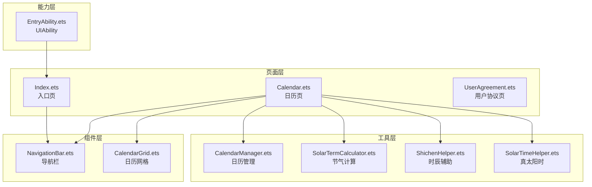
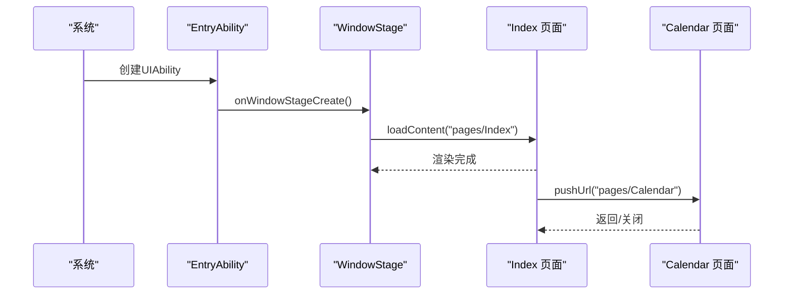
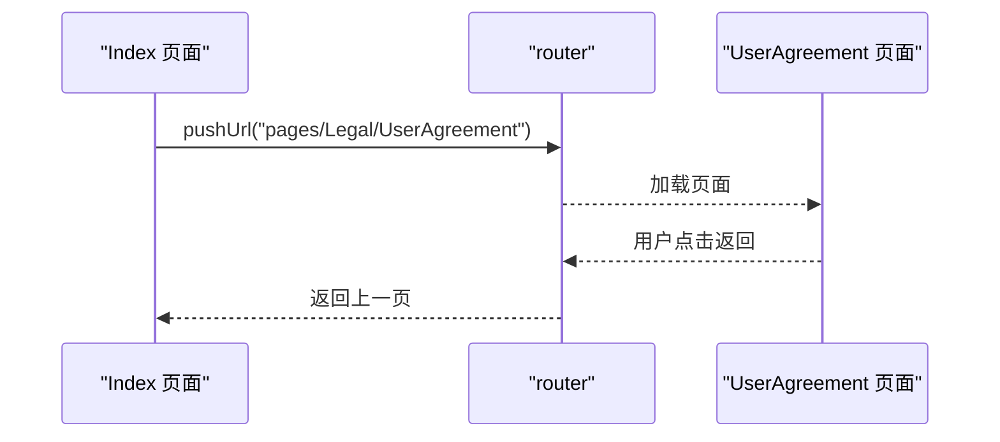
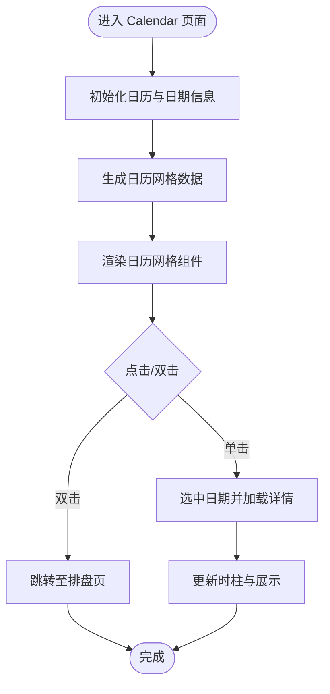
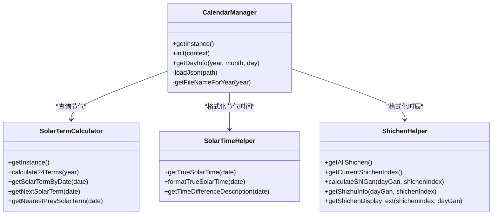
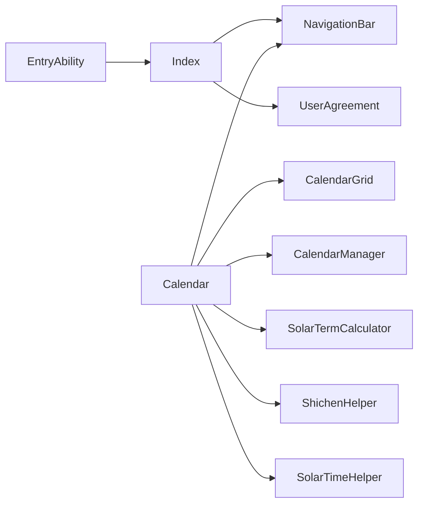
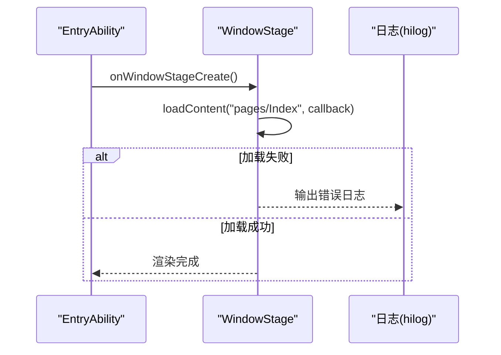

# 运行时错误

<cite>
**本文引用的文件**
- [entry\src\main\ets\pages\Index.ets](file://entry\src\main\ets\pages\Index.ets)
- [entry\src\main\ets\entryability\EntryAbility.ets](file://entry\src\main\ets\entryability\EntryAbility.ets)
- [entry\src\main\ets\pages\Calendar.ets](file://entry\src\main\ets\pages\Calendar.ets)
- [entry\src\main\ets\utils\CalendarManager.ets](file://entry\src\main\ets\utils\CalendarManager.ets)
- [entry\src\main\ets\components\CalendarGrid.ets](file://entry\src\main\ets\components\CalendarGrid.ets)
- [entry\src\main\ets\pages\Legal\UserAgreement.ets](file://entry\src\main\ets\pages\Legal\UserAgreement.ets)
- [entry\src\main\ets\utils\SolarTermCalculator.ets](file://entry\src\main\ets\utils\SolarTermCalculator.ets)
- [entry\src\main\ets\utils\ShichenHelper.ets](file://entry\src\main\ets\utils\ShichenHelper.ets)
- [entry\src\main\ets\utils\SolarTimeHelper.ets](file://entry\src\main\ets\utils\SolarTimeHelper.ets)
- [entry\build\default\cache\default\default@CompileArkTS\esmodule\debug\compiler.cache\modules\Index.ets-a6426e26ffab9a4beb0ca861dbf7f6c60e0010f4de42c45610cb774dfd2fa5e6.msgpack](file://entry\build\default\cache\default\default@CompileArkTS\esmodule\debug\compiler.cache\modules\Index.ets-a6426e26ffab9a4beb0ca861dbf7f6c60e0010f4de42c45610cb774dfd2fa5e6.msgpack)
- [entry\src\ohosTest\ets\test\Ability.test.ets](file://entry\src\ohosTest\ets\test\Ability.test.ets)
- [entry\src\test\List.test.ets](file://entry\src\test\List.test.ets)
</cite>

## 目录
1. [简介](#简介)
2. [项目结构](#项目结构)
3. [核心组件](#核心组件)
4. [架构总览](#架构总览)
5. [详细组件分析](#详细组件分析)
6. [依赖分析](#依赖分析)
7. [性能考虑](#性能考虑)
8. [故障排除指南](#故障排除指南)
9. [结论](#结论)
10. [附录](#附录)

## 简介
本指南聚焦于鸿蒙应用在运行时可能出现的各类错误与异常，涵盖应用启动失败、页面加载错误、组件渲染异常、路由与导航问题、内存与性能瓶颈，以及单元测试与调试最佳实践。文档基于仓库中的实际源码与构建产物，提供可操作的诊断步骤、修复策略与DevEco Studio调试技巧。

## 项目结构
应用采用ArkTS + ArkUI架构，页面、组件与工具类清晰分层：
- 页面层：入口页、日历页、法律页等
- 组件层：导航栏、日历网格、时辰选择器等
- 工具层：日历管理、节气计算、真太阳时、时辰辅助等
- 能力层：UIAbility生命周期与窗口加载

图表来源
- [entry\src\main\ets\pages\Index.ets](file://entry\src\main\ets\pages\Index.ets#L1-L88)
- [entry\src\main\ets\pages\Calendar.ets](file://entry\src\main\ets\pages\Calendar.ets#L1-L602)
- [entry\src\main\ets\pages\Legal\UserAgreement.ets](file://entry\src\main\ets\pages\Legal\UserAgreement.ets#L1-L154)
- [entry\src\main\ets\components\NavigationBar.ets](file://entry\src\main\ets\components\NavigationBar.ets#L1-L86)
- [entry\src\main\ets\components\CalendarGrid.ets](file://entry\src\main\ets\components\CalendarGrid.ets#L1-L167)
- [entry\src\main\ets\utils\CalendarManager.ets](file://entry\src\main\ets\utils\CalendarManager.ets#L1-L123)
- [entry\src\main\ets\utils\SolarTermCalculator.ets](file://entry\src\main\ets\utils\SolarTermCalculator.ets#L1-L375)
- [entry\src\main\ets\utils\ShichenHelper.ets](file://entry\src\main\ets\utils\ShichenHelper.ets#L1-L114)
- [entry\src\main\ets\utils\SolarTimeHelper.ets](file://entry\src\main\ets\utils\SolarTimeHelper.ets#L1-L270)
- [entry\src\main\ets\entryability\EntryAbility.ets](file://entry\src\main\ets\entryability\EntryAbility.ets#L1-L48)

章节来源
- [entry\src\main\ets\pages\Index.ets](file://entry\src\main\ets\pages\Index.ets#L1-L88)
- [entry\src\main\ets\entryability\EntryAbility.ets](file://entry\src\main\ets\entryability\EntryAbility.ets#L1-L48)

## 核心组件
- 入口页与导航：入口页负责首页导航与法律页跳转；导航栏统一处理返回与右侧动作。
- 日历页：聚合日历网格、节气、真太阳时、时辰选择与农历信息，支持双击快速进入排盘。
- 工具类：日历管理负责资源读取与缓存；节气计算提供精确时刻；真太阳时与时辰辅助提供时制换算。

章节来源
- [entry\src\main\ets\pages\Index.ets](file://entry\src\main\ets\pages\Index.ets#L1-L88)
- [entry\src\main\ets\components\NavigationBar.ets](file://entry\src\main\ets\components\NavigationBar.ets#L1-L86)
- [entry\src\main\ets\pages\Calendar.ets](file://entry\src\main\ets\pages\Calendar.ets#L1-L602)
- [entry\src\main\ets\utils\CalendarManager.ets](file://entry\src\main\ets\utils\CalendarManager.ets#L1-L123)
- [entry\src\main\ets\utils\SolarTermCalculator.ets](file://entry\src\main\ets\utils\SolarTermCalculator.ets#L1-L375)
- [entry\src\main\ets\utils\SolarTimeHelper.ets](file://entry\src\main\ets\utils\SolarTimeHelper.ets#L1-L270)
- [entry\src\main\ets\utils\ShichenHelper.ets](file://entry\src\main\ets\utils\ShichenHelper.ets#L1-L114)

## 架构总览
应用启动流程：UIAbility创建窗口并加载入口页；入口页提供导航至日历页与法律页；日历页通过组件与工具类完成复杂数据与视图交互。

图表来源
- [entry\src\main\ets\entryability\EntryAbility.ets](file://entry\src\main\ets\entryability\EntryAbility.ets#L21-L32)
- [entry\src\main\ets\pages\Index.ets](file://entry\src\main\ets\pages\Index.ets#L6-L14)
- [entry\src\main\ets\pages\Calendar.ets](file://entry\src\main\ets\pages\Calendar.ets#L289-L304)

## 详细组件分析

### 入口页与导航
- 入口页提供“进入”按钮与法律页链接，点击触发路由跳转。
- 法律页提供返回按钮与跳转至隐私政策的链接。
- 构建产物中保留了路由调用与事件绑定，确保点击事件与URL跳转路径正确。

图表来源
- [entry\src\main\ets\pages\Index.ets](file://entry\src\main\ets\pages\Index.ets#L56-L74)
- [entry\src\main\ets\pages\Legal\UserAgreement.ets](file://entry\src\main\ets\pages\Legal\UserAgreement.ets#L10-L16)

章节来源
- [entry\src\main\ets\pages\Index.ets](file://entry\src\main\ets\pages\Index.ets#L1-L88)
- [entry\src\main\ets\pages\Legal\UserAgreement.ets](file://entry\src\main\ets\pages\Legal\UserAgreement.ets#L1-L154)
- [entry\build\default\cache\default\default@CompileArkTS\esmodule\debug\compiler.cache\modules\Index.ets-a6426e26ffab9a4beb0ca861dbf7f6c60e0010f4de42c45610cb774dfd2fa5e6.msgpack](file://entry\build\default\cache\default\default@CompileArkTS\esmodule\debug\compiler.cache\modules\Index.ets-a6426e26ffab9a4beb0ca861dbf7f6c60e0010f4de42c45610cb774dfd2fa5e6.msgpack#L24-L31)

### 日历页与组件
- 日历页负责生成日历网格、加载日期信息、选择时辰并跳转至排盘页。
- 日历网格组件支持单击与双击事件，区分当月与非当月日期，避免误操作。
- 通过工具类组合节气、真太阳时与时辰信息，提升用户体验。

图表来源
- [entry\src\main\ets\pages\Calendar.ets](file://entry\src\main\ets\pages\Calendar.ets#L46-L137)
- [entry\src\main\ets\components\CalendarGrid.ets](file://entry\src\main\ets\components\CalendarGrid.ets#L144-L164)

章节来源
- [entry\src\main\ets\pages\Calendar.ets](file://entry\src\main\ets\pages\Calendar.ets#L1-L602)
- [entry\src\main\ets\components\CalendarGrid.ets](file://entry\src\main\ets\components\CalendarGrid.ets#L1-L167)

### 工具类与数据流
- 日历管理器负责按年份加载JSON资源，缓存解析结果，提供日期详情查询。
- 节气计算器提供精确时刻，支持跨年节气查找。
- 真太阳时与时辰辅助分别处理时间修正与时干计算。

图表来源
- [entry\src\main\ets\utils\CalendarManager.ets](file://entry\src\main\ets\utils\CalendarManager.ets#L30-L92)
- [entry\src\main\ets\utils\SolarTermCalculator.ets](file://entry\src\main\ets\utils\SolarTermCalculator.ets#L30-L159)
- [entry\src\main\ets\utils\SolarTimeHelper.ets](file://entry\src\main\ets\utils\SolarTimeHelper.ets#L54-L108)
- [entry\src\main\ets\utils\ShichenHelper.ets](file://entry\src\main\ets\utils\ShichenHelper.ets#L59-L112)

章节来源
- [entry\src\main\ets\utils\CalendarManager.ets](file://entry\src\main\ets\utils\CalendarManager.ets#L1-L123)
- [entry\src\main\ets\utils\SolarTermCalculator.ets](file://entry\src\main\ets\utils\SolarTermCalculator.ets#L1-L375)
- [entry\src\main\ets\utils\SolarTimeHelper.ets](file://entry\src\main\ets\utils\SolarTimeHelper.ets#L1-L270)
- [entry\src\main\ets\utils\ShichenHelper.ets](file://entry\src\main\ets\utils\ShichenHelper.ets#L1-L114)

## 依赖分析
- 页面依赖组件与工具类：日历页依赖导航栏、日历网格、日历管理、节气计算、时辰与真太阳时工具。
- 入口页依赖导航栏与法律页；法律页依赖路由返回。
- UIAbility负责加载入口页，错误将导致页面无法渲染。

图表来源
- [entry\src\main\ets\entryability\EntryAbility.ets](file://entry\src\main\ets\entryability\EntryAbility.ets#L25-L31)
- [entry\src\main\ets\pages\Index.ets](file://entry\src\main\ets\pages\Index.ets#L1-L14)
- [entry\src\main\ets\pages\Calendar.ets](file://entry\src\main\ets\pages\Calendar.ets#L1-L10)

章节来源
- [entry\src\main\ets\entryability\EntryAbility.ets](file://entry\src\main\ets\entryability\EntryAbility.ets#L1-L48)
- [entry\src\main\ets\pages\Index.ets](file://entry\src\main\ets\pages\Index.ets#L1-L88)
- [entry\src\main\ets\pages\Calendar.ets](file://entry\src\main\ets\pages\Calendar.ets#L1-L602)

## 性能考虑
- 资源加载与缓存：日历管理器按年份缓存JSON数据，减少重复IO与解析开销。
- 批量异步请求：日历页批量获取多日期信息，降低多次网络/资源调用成本。
- 组件渲染优化：日历网格组件按需高亮选中与今日日期，避免全量重绘。
- 时间计算：节气与真太阳时计算采用缓存与预加载策略，降低重复计算。

章节来源
- [entry\src\main\ets\utils\CalendarManager.ets](file://entry\src\main\ets\utils\CalendarManager.ets#L62-L92)
- [entry\src\main\ets\pages\Calendar.ets](file://entry\src\main\ets\pages\Calendar.ets#L83-L85)
- [entry\src\main\ets\utils\SolarTermCalculator.ets](file://entry\src\main\ets\utils\SolarTermCalculator.ets#L61-L86)
- [entry\src\main\ets\utils\SolarTimeHelper.ets](file://entry\src\main\ets\utils\SolarTimeHelper.ets#L54-L77)

## 故障排除指南

### 应用启动失败
- 症状：应用启动后无界面或黑屏。
- 排查要点：
  - 检查UIAbility窗口创建回调是否成功加载入口页。
  - 关注窗口加载回调中的错误日志，确认页面路径与资源是否存在。
- 修复建议：
  - 确认入口页路径与模块注册一致。
  - 在窗口加载失败时记录错误原因并提供降级页面。

图表来源
- [entry\src\main\ets\entryability\EntryAbility.ets](file://entry\src\main\ets\entryability\EntryAbility.ets#L25-L31)

章节来源
- [entry\src\main\ets\entryability\EntryAbility.ets](file://entry\src\main\ets\entryability\EntryAbility.ets#L1-L48)

### 页面加载错误
- 症状：进入日历页或法律页后空白或报错。
- 排查要点：
  - 检查路由URL是否正确（如“pages/Calendar”“pages/Legal/UserAgreement”）。
  - 检查页面组件是否正确导入与注册。
  - 检查资源文件是否存在（如背景图、JSON数据）。
- 修复建议：
  - 校验路由目标页面路径与模块映射。
  - 在页面构造函数或生命周期中增加错误捕获与降级渲染。

章节来源
- [entry\src\main\ets\pages\Calendar.ets](file://entry\src\main\ets\pages\Calendar.ets#L289-L304)
- [entry\src\main\ets\pages\Legal\UserAgreement.ets](file://entry\src\main\ets\pages\Legal\UserAgreement.ets#L10-L16)
- [entry\src\main\ets\pages\Index.ets](file://entry\src\main\ets\pages\Index.ets#L6-L14)

### 组件渲染异常
- 症状：日历网格显示异常、点击无响应或高亮错乱。
- 排查要点：
  - 检查日期对象比较逻辑（年/月/日）是否正确。
  - 检查双击判定时间间隔与上次点击日期是否一致。
  - 检查组件属性传递（selectedDate、calendarDays）是否为空或未更新。
- 修复建议：
  - 在日期比较中明确使用getFullYear/getMonth/getDate。
  - 在事件回调中先判空再调用，避免空指针访问。

章节来源
- [entry\src\main\ets\components\CalendarGrid.ets](file://entry\src\main\ets\components\CalendarGrid.ets#L42-L55)
- [entry\src\main\ets\components\CalendarGrid.ets](file://entry\src\main\ets\components\CalendarGrid.ets#L144-L164)

### 路由与导航问题
- 症状：点击“进入”或“说明”无反应；返回按钮无效。
- 排查要点：
  - 检查router.pushUrl/router.back的调用是否在事件回调中。
  - 检查页面是否正确声明@Entry且路由映射存在。
- 修复建议：
  - 确保事件回调中调用router方法，避免在非回调上下文中调用。
  - 在导航前校验目标页面路径与参数。

章节来源
- [entry\src\main\ets\pages\Calendar.ets](file://entry\src\main\ets\pages\Calendar.ets#L314-L317)
- [entry\src\main\ets\pages\Calendar.ets](file://entry\src\main\ets\pages\Calendar.ets#L448-L450)
- [entry\src\main\ets\pages\Index.ets](file://entry\src\main\ets\pages\Index.ets#L46-L48)
- [entry\src\main\ets\pages\Legal\UserAgreement.ets](file://entry\src\main\ets\pages\Legal\UserAgreement.ets#L10-L16)

### 常见异常类型与处理策略
- NullPointerException（空指针）
  - 触发场景：日历管理器未初始化、日期详情为空、组件属性未赋值。
  - 处理策略：在调用前检查对象与属性是否为空，提供默认值或降级逻辑。
- 类型不匹配
  - 触发场景：日期对象与字符串拼接、数组元素类型不一致。
  - 处理策略：明确类型声明与断言，使用安全访问与类型守卫。

章节来源
- [entry\src\main\ets\utils\CalendarManager.ets](file://entry\src\main\ets\utils\CalendarManager.ets#L52-L55)
- [entry\src\main\ets\pages\Calendar.ets](file://entry\src\main\ets\pages\Calendar.ets#L250-L257)

### 使用DevEco Studio调试工具
- 日志与性能分析：
  - 使用hilog记录UIAbility生命周期与页面加载状态，定位异常发生阶段。
- 断点与单步：
  - 在页面生命周期（如aboutToAppear）与关键事件回调（如onDaySelected、navigateToDunjia）设置断点，观察变量状态与调用链。
- 构建产物与源码映射：
  - 构建产物中保留了路由调用与事件绑定，可对照源码定位问题。

章节来源
- [entry\src\main\ets\entryability\EntryAbility.ets](file://entry\src\main\ets\entryability\EntryAbility.ets#L9-L14)
- [entry\build\default\cache\default\default@CompileArkTS\esmodule\debug\compiler.cache\modules\Index.ets-a6426e26ffab9a4beb0ca861dbf7f6c60e0010f4de42c45610cb774dfd2fa5e6.msgpack](file://entry\build\default\cache\default\default@CompileArkTS\esmodule\debug\compiler.cache\modules\Index.ets-a6426e26ffab9a4beb0ca861dbf7f6c60e0010f4de42c45610cb774dfd2fa5e6.msgpack#L98-L101)

### 内存泄漏与性能瓶颈识别
- 内存泄漏排查：
  - 检查长生命周期对象（如单例工具类）是否持有页面引用。
  - 确认事件监听与定时器在页面销毁时被清理。
- 性能瓶颈排查：
  - 使用hilog记录关键耗时点（如资源加载、数据解析、组件渲染）。
  - 优化批量请求与缓存策略，减少主线程阻塞。

章节来源
- [entry\src\main\ets\utils\CalendarManager.ets](file://entry\src\main\ets\utils\CalendarManager.ets#L62-L92)
- [entry\src\main\ets\pages\Calendar.ets](file://entry\src\main\ets\pages\Calendar.ets#L83-L85)

### 测试用例编写与执行
- 单元测试框架：
  - 使用@ohos/hypium提供的describe/it/expect等API组织测试用例。
- 测试套件组织：
  - 将本地测试用例整合为testsuite，便于批量执行。
- 最佳实践：
  - 为关键逻辑（如日期比较、路由跳转）编写断言。
  - 使用beforeEach/afterEach清理状态，确保测试隔离。

章节来源
- [entry\src\ohosTest\ets\test\Ability.test.ets](file://entry\src\ohosTest\ets\test\Ability.test.ets#L1-L35)
- [entry\src\test\List.test.ets](file://entry\src\test\List.test.ets#L1-L5)

## 结论
通过梳理页面、组件与工具类的职责边界与交互关系，结合日志与断点调试手段，可高效定位并修复启动失败、页面加载错误、组件渲染异常、路由与导航问题、内存与性能瓶颈等运行时错误。配合单元测试与断言，进一步提升代码质量与稳定性。

## 附录
- 路由与页面路径清单
  - 入口页：pages/Index
  - 日历页：pages/Calendar
  - 用户协议页：pages/Legal/UserAgreement
  - 隐私政策页：pages/Legal/PrivacyPolicy
- 关键工具类
  - 日历管理：CalendarManager
  - 节气计算：SolarTermCalculator
  - 真太阳时：SolarTimeHelper
  - 时辰辅助：ShichenHelper