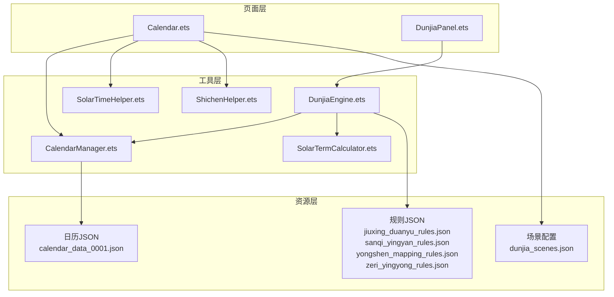
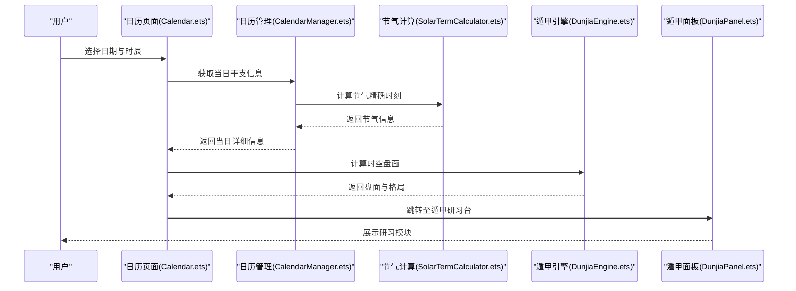
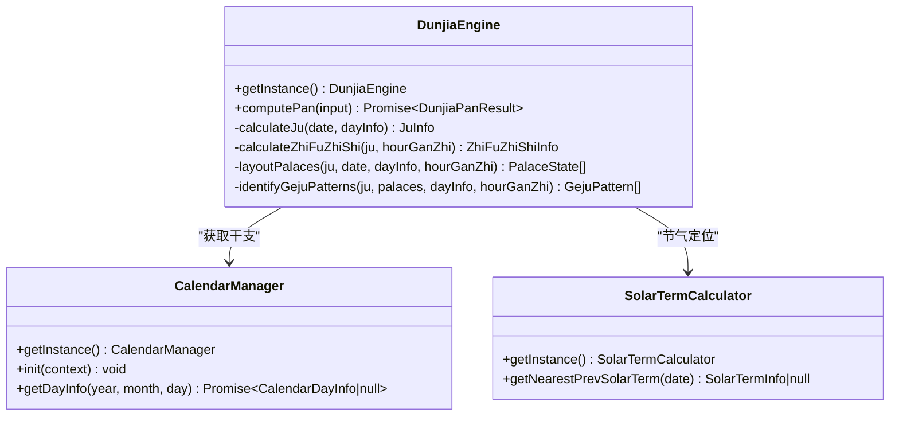
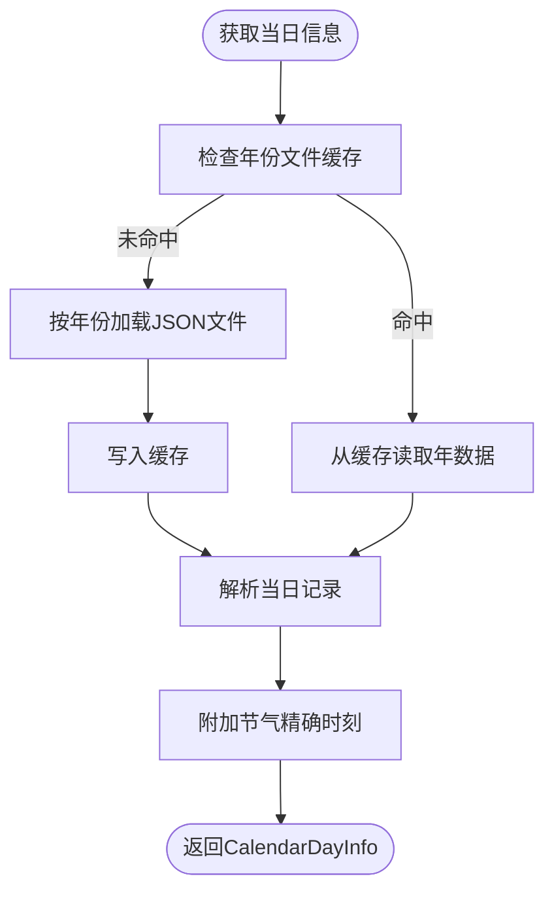
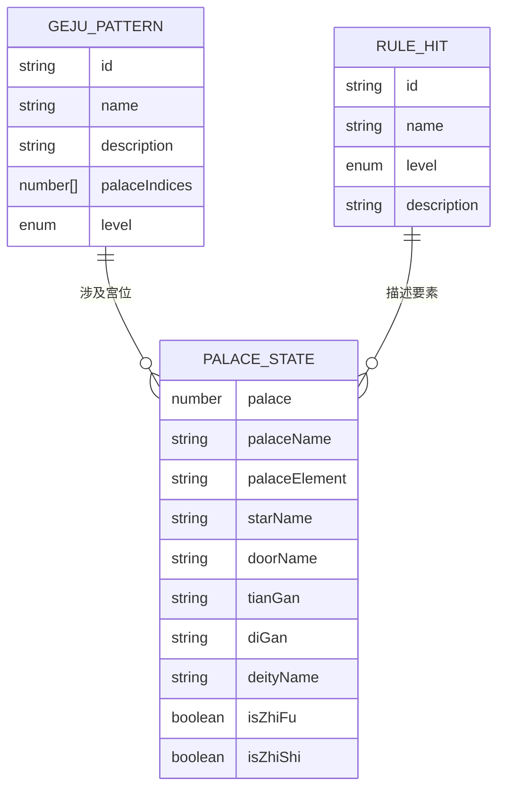
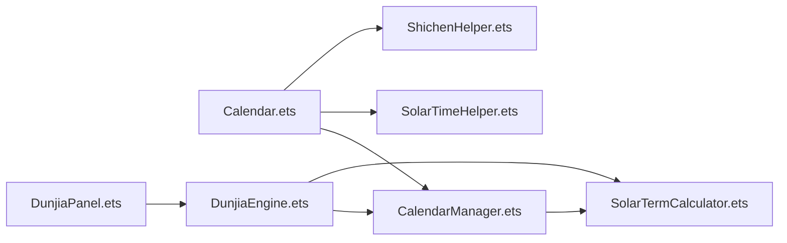

# 数据与规则系统

<cite>
**本文档引用的文件**
- [DunjiaEngine.ets](file://entry/src/main/ets/utils/DunjiaEngine.ets)
- [CalendarManager.ets](file://entry/src/main/ets/utils/CalendarManager.ets)
- [SolarTermCalculator.ets](file://entry/src/main/ets/utils/SolarTermCalculator.ets)
- [ShichenHelper.ets](file://entry/src/main/ets/utils/ShichenHelper.ets)
- [SolarTimeHelper.ets](file://entry/src/main/ets/utils/SolarTimeHelper.ets)
- [Calendar.ets](file://entry/src/main/ets/pages/Calendar.ets)
- [DunjiaPanel.ets](file://entry/src/main/ets/pages/DunjiaPanel.ets)
- [jiuxing_duanyu_rules.json](file://entry/src/main/resources/rawfile/rules/jiuxing_duanyu_rules.json)
- [sanqi_yingyan_rules.json](file://entry/src/main/resources/rawfile/rules/sanqi_yingyan_rules.json)
- [yongshen_mapping_rules.json](file://entry/src/main/resources/rawfile/rules/yongshen_mapping_rules.json)
- [zeri_yingyong_rules.json](file://entry/src/main/resources/rawfile/rules/zeri_yingyong_rules.json)
- [calendar_data_0001.json](file://entry/src/main/resources/rawfile/calendar/calendar_data_0001.json)
- [dunjia_scenes.json](file://entry/src/main/resources/rawfile/dunjia_scenes.json)
</cite>

## 目录
1. [简介](#简介)
2. [项目结构](#项目结构)
3. [核心组件](#核心组件)
4. [架构总览](#架构总览)
5. [详细组件分析](#详细组件分析)
6. [依赖关系分析](#依赖关系分析)
7. [性能考量](#性能考量)
8. [故障排查指南](#故障排查指南)
9. [结论](#结论)
10. [附录](#附录)

## 简介
本项目围绕《遁甲符应经》构建了完整的数据与规则系统，涵盖：
- 遁甲排盘核心引擎：基于阴阳遁、局数、值符值使、九宫要素（九星、八门、三奇六仪、八神）的计算与布局
- 数字化规则体系：将经典文献转化为结构化规则文件，支撑格局识别与用神映射
- 日历与节气系统：提供干支、节气、真太阳时等时空基准数据
- 用户交互与研习模块：从万年历进入时空盘，支持多种研习场景与应用页面

## 项目结构
项目采用分层组织，核心逻辑集中在 utils 目录，页面组件位于 pages 目录，规则与日历数据放置在 rawfile 目录。

**图表来源**
- [Calendar.ets](file://entry/src/main/ets/pages/Calendar.ets#L1-L602)
- [DunjiaPanel.ets](file://entry/src/main/ets/pages/DunjiaPanel.ets#L1-L189)
- [CalendarManager.ets](file://entry/src/main/ets/utils/CalendarManager.ets#L1-L123)
- [SolarTermCalculator.ets](file://entry/src/main/ets/utils/SolarTermCalculator.ets#L1-L375)
- [ShichenHelper.ets](file://entry/src/main/ets/utils/ShichenHelper.ets#L1-L114)
- [SolarTimeHelper.ets](file://entry/src/main/ets/utils/SolarTimeHelper.ets#L1-L270)
- [DunjiaEngine.ets](file://entry/src/main/ets/utils/DunjiaEngine.ets#L1-L961)

**章节来源**
- [Calendar.ets](file://entry/src/main/ets/pages/Calendar.ets#L1-L602)
- [DunjiaPanel.ets](file://entry/src/main/ets/pages/DunjiaPanel.ets#L1-L189)
- [CalendarManager.ets](file://entry/src/main/ets/utils/CalendarManager.ets#L1-L123)
- [SolarTermCalculator.ets](file://entry/src/main/ets/utils/SolarTermCalculator.ets#L1-L375)
- [ShichenHelper.ets](file://entry/src/main/ets/utils/ShichenHelper.ets#L1-L114)
- [SolarTimeHelper.ets](file://entry/src/main/ets/utils/SolarTimeHelper.ets#L1-L270)
- [DunjiaEngine.ets](file://entry/src/main/ets/utils/DunjiaEngine.ets#L1-L961)

## 核心组件
- 遁甲引擎（DunjiaEngine）
  - 输入：公历时间、地理经度、研习场景类型
  - 输出：时空盘面、九宫状态、规则命中、格局识别、摘要与日干支信息
  - 关键能力：节气定位、局数计算、值符值使、九宫布局、格局识别
- 日历管理（CalendarManager）
  - 输入：年份、月份、日期
  - 输出：干支、节气、节日、真太阳时等详细信息
  - 关键能力：按年分片加载、缓存、节气精确时刻附加
- 节气计算（SolarTermCalculator）
  - 输入：年份
  - 输出：24节气精确时刻（北京时间）
  - 关键能力：儒略日、太阳黄经、牛顿迭代法、缓存
- 时辰工具（ShichenHelper）
  - 输入：日干、时辰索引
  - 输出：时干、时柱、时辰显示文本
- 真太阳时（SolarTimeHelper）
  - 输入：本地时间、经度
  - 输出：真太阳时、均时差、经度时差、总偏差
- 规则系统
  - 九星断语、三奇应验、用神映射、择日应用等规则文件
- 场景配置
  - 研习模块与页面的结构化配置

**章节来源**
- [DunjiaEngine.ets](file://entry/src/main/ets/utils/DunjiaEngine.ets#L1-L961)
- [CalendarManager.ets](file://entry/src/main/ets/utils/CalendarManager.ets#L1-L123)
- [SolarTermCalculator.ets](file://entry/src/main/ets/utils/SolarTermCalculator.ets#L1-L375)
- [ShichenHelper.ets](file://entry/src/main/ets/utils/ShichenHelper.ets#L1-L114)
- [SolarTimeHelper.ets](file://entry/src/main/ets/utils/SolarTimeHelper.ets#L1-L270)

## 架构总览
系统采用“页面层-工具层-资源层”的分层架构。页面层负责用户交互与路由，工具层提供核心算法与数据访问，资源层承载规则与日历数据。

**图表来源**
- [Calendar.ets](file://entry/src/main/ets/pages/Calendar.ets#L250-L304)
- [CalendarManager.ets](file://entry/src/main/ets/utils/CalendarManager.ets#L51-L92)
- [SolarTermCalculator.ets](file://entry/src/main/ets/utils/SolarTermCalculator.ets#L93-L159)
- [DunjiaEngine.ets](file://entry/src/main/ets/utils/DunjiaEngine.ets#L113-L162)
- [DunjiaPanel.ets](file://entry/src/main/ets/pages/DunjiaPanel.ets#L1-L189)

## 详细组件分析

### 遁甲引擎（DunjiaEngine）
- 数据结构
  - 输入：DunjiaInput（日期、经度、场景类型）
  - 输出：DunjiaPanResult（阴阳遁、局数、值符值使、九宫状态、规则命中、格局、摘要、日干支、时辰干支、真太阳时偏移、结构标签）
  - 内部类型：JuInfo（阴阳遁、局数、元数、值符值使宫位）、HourGanZhi（时干支索引）、ZhiFuZhiShiInfo（值符值使宫位）
- 核心算法
  - 节气定位：基于 SolarTermCalculator 获取最近前一个节气，判断阴阳遁与局数
  - 局数计算：根据节气与日干支地支的“仲孟季”确定上中下元，查表得到局数
  - 值符值使：值符随“时干”飞布（阳遁顺飞、阴遁逆飞，跳过中宫）；值使随“时支”飞布
  - 九宫布局：九星固定对应九宫；八门固定对应九宫；三奇六仪按阴阳遁规则布天盘/地盘；八神按值符位置推导
  - 格局识别：三奇得使、三遁、三奇合、伏吟、反吹、青龙返首、飞鸟跌穴、三奇入墓、六仪击刑、太白入荧惑、荧惑入太白、天网四张等
- 性能与扩展
  - 值符值使与九宫布局可进一步抽取为独立模块，便于单元测试与规则扩展
  - 格局识别可抽象为规则引擎，支持动态加载与优先级排序

**图表来源**
- [DunjiaEngine.ets](file://entry/src/main/ets/utils/DunjiaEngine.ets#L98-L162)
- [CalendarManager.ets](file://entry/src/main/ets/utils/CalendarManager.ets#L30-L92)
- [SolarTermCalculator.ets](file://entry/src/main/ets/utils/SolarTermCalculator.ets#L143-L159)

**章节来源**
- [DunjiaEngine.ets](file://entry/src/main/ets/utils/DunjiaEngine.ets#L1-L961)

### 日历与节气系统
- 日历数据格式
  - 每日记录包含：日期、农历年月日、生肖、年/月/日干支、星期、节假日、节气、节日等字段
  - 年度分片：按十年区间命名文件（如 calendar_data_0001.json 对应 1900-1909）
- 加载与缓存
  - CalendarManager 按年分片加载，使用 Map 缓存，避免重复 IO
  - 节气精确时刻：SolarTermCalculator 计算后附加到当日信息
- 真太阳时
  - SolarTimeHelper 提供真太阳时计算与格式化显示，支持均时差与经度时差修正

**图表来源**
- [CalendarManager.ets](file://entry/src/main/ets/utils/CalendarManager.ets#L51-L92)
- [SolarTermCalculator.ets](file://entry/src/main/ets/utils/SolarTermCalculator.ets#L93-L115)
- [calendar_data_0001.json](file://entry/src/main/resources/rawfile/calendar/calendar_data_0001.json#L1-L200)

**章节来源**
- [CalendarManager.ets](file://entry/src/main/ets/utils/CalendarManager.ets#L1-L123)
- [SolarTermCalculator.ets](file://entry/src/main/ets/utils/SolarTermCalculator.ets#L1-L375)
- [calendar_data_0001.json](file://entry/src/main/resources/rawfile/calendar/calendar_data_0001.json#L1-L200)

### 规则系统与数据结构
- 规则文件结构
  - jiuxing_duanyu_rules.json：九星基础属性、旺衰规则、断语与出行护佑
  - sanqi_yingyan_rules.json：三奇（日奇乙、月奇丙、星奇丁）到宫应验、路应示例
  - yongshen_mapping_rules.json：用神映射（寻人、寻物、出行、婚恋、求职、求财、考试、疾病）
  - zeri_yingyong_rules.json：五类日子吉凶、利客利主格局、五阳五阴时、十二日天门地户玉女
- 规则提取与数字化
  - 将《遁甲符应经》等经典文献的断语、规则、示例整理为结构化 JSON
  - 字段设计遵循“id/name/category/ruleSource/description/...”模式，便于 UI 展示与算法匹配
- 规则引擎工作原理（基于现有实现）
  - 布局完成后，遍历九宫要素（天干、地干、星、门、神）进行规则匹配
  - 以 GejuPattern 形式记录命中的格局，含 id、name、description、palaceIndices、level
  - 支持组合规则（如三奇合、反吹等）

**图表来源**
- [DunjiaEngine.ets](file://entry/src/main/ets/utils/DunjiaEngine.ets#L89-L95)
- [jiuxing_duanyu_rules.json](file://entry/src/main/resources/rawfile/rules/jiuxing_duanyu_rules.json#L1-L256)
- [sanqi_yingyan_rules.json](file://entry/src/main/resources/rawfile/rules/sanqi_yingyan_rules.json#L1-L525)
- [yongshen_mapping_rules.json](file://entry/src/main/resources/rawfile/rules/yongshen_mapping_rules.json#L1-L510)
- [zeri_yingyong_rules.json](file://entry/src/main/resources/rawfile/rules/zeri_yingyong_rules.json#L1-L145)

**章节来源**
- [jiuxing_duanyu_rules.json](file://entry/src/main/resources/rawfile/rules/jiuxing_duanyu_rules.json#L1-L256)
- [sanqi_yingyan_rules.json](file://entry/src/main/resources/rawfile/rules/sanqi_yingyan_rules.json#L1-L525)
- [yongshen_mapping_rules.json](file://entry/src/main/resources/rawfile/rules/yongshen_mapping_rules.json#L1-L510)
- [zeri_yingyong_rules.json](file://entry/src/main/resources/rawfile/rules/zeri_yingyong_rules.json#L1-L145)
- [DunjiaEngine.ets](file://entry/src/main/ets/utils/DunjiaEngine.ets#L678-L936)

### 页面与交互
- 日历页面（Calendar.ets）
  - 生成日历网格、批量获取日期信息、展示真太阳时、选择时辰并进入遁甲研习
- 遁甲研习台（DunjiaPanel.ets）
  - 模块化导航：基础知识、九宫排盘、九星八门、格局识别、三奇应验、攻守方位、古籍案例、下卷符咒
- 真太阳时展示
  - SolarTimeHelper 提供格式化与差异描述，便于用户理解时差

**章节来源**
- [Calendar.ets](file://entry/src/main/ets/pages/Calendar.ets#L1-L602)
- [DunjiaPanel.ets](file://entry/src/main/ets/pages/DunjiaPanel.ets#L1-L189)
- [SolarTimeHelper.ets](file://entry/src/main/ets/utils/SolarTimeHelper.ets#L84-L108)

## 依赖关系分析
- 页面依赖工具层：Calendar.ets 依赖 CalendarManager、SolarTimeHelper、ShichenHelper；DunjiaPanel.ets 依赖 DunjiaEngine
- 工具层内部耦合：DunjiaEngine 依赖 CalendarManager 与 SolarTermCalculator；CalendarManager 依赖 SolarTermCalculator
- 资源依赖：规则 JSON 与日历 JSON 由工具层按需加载

**图表来源**
- [Calendar.ets](file://entry/src/main/ets/pages/Calendar.ets#L1-L10)
- [DunjiaPanel.ets](file://entry/src/main/ets/pages/DunjiaPanel.ets#L1-L10)
- [DunjiaEngine.ets](file://entry/src/main/ets/utils/DunjiaEngine.ets#L1-L10)
- [CalendarManager.ets](file://entry/src/main/ets/utils/CalendarManager.ets#L1-L10)
- [SolarTermCalculator.ets](file://entry/src/main/ets/utils/SolarTermCalculator.ets#L1-L10)
- [SolarTimeHelper.ets](file://entry/src/main/ets/utils/SolarTimeHelper.ets#L1-L10)
- [ShichenHelper.ets](file://entry/src/main/ets/utils/ShichenHelper.ets#L1-L10)

**章节来源**
- [Calendar.ets](file://entry/src/main/ets/pages/Calendar.ets#L1-L602)
- [DunjiaPanel.ets](file://entry/src/main/ets/pages/DunjiaPanel.ets#L1-L189)
- [DunjiaEngine.ets](file://entry/src/main/ets/utils/DunjiaEngine.ets#L1-L961)
- [CalendarManager.ets](file://entry/src/main/ets/utils/CalendarManager.ets#L1-L123)
- [SolarTermCalculator.ets](file://entry/src/main/ets/utils/SolarTermCalculator.ets#L1-L375)
- [SolarTimeHelper.ets](file://entry/src/main/ets/utils/SolarTimeHelper.ets#L1-L270)
- [ShichenHelper.ets](file://entry/src/main/ets/utils/ShichenHelper.ets#L1-L114)

## 性能考量
- 缓存策略
  - CalendarManager：按年份文件缓存，避免重复 IO；节气计算使用 SolarTermCalculator 的缓存
  - SolarTermCalculator：按年份缓存节气结果，支持预加载
- 异步加载
  - 日历数据与规则文件采用异步加载，减少主线程阻塞
- 数据结构优化
  - 九宫布局使用数组索引，规则匹配采用线性扫描；可引入哈希表或区间树优化高频查询
- 真太阳时计算
  - 均时差与经度时差计算为纯数学运算，开销较小；可按需缓存结果

**章节来源**
- [CalendarManager.ets](file://entry/src/main/ets/utils/CalendarManager.ets#L33-L68)
- [SolarTermCalculator.ets](file://entry/src/main/ets/utils/SolarTermCalculator.ets#L32-L84)
- [SolarTimeHelper.ets](file://entry/src/main/ets/utils/SolarTimeHelper.ets#L54-L77)

## 故障排查指南
- 日历数据加载失败
  - 检查年份范围与文件命名是否符合约定（1900-2060）
  - 确认资源路径与文件存在性
- 节气时刻异常
  - 核对 SolarTermCalculator 的缓存与预加载逻辑
  - 检查跨年节气边界（如小寒在1月初）
- 真太阳时显示异常
  - 核对经度设置与标准经度（东八区）
  - 检查均时差与经度时差计算
- 规则匹配不生效
  - 检查规则文件结构与字段一致性
  - 确认九宫布局与规则匹配逻辑（如三奇合、反吹等）

**章节来源**
- [CalendarManager.ets](file://entry/src/main/ets/utils/CalendarManager.ets#L94-L121)
- [SolarTermCalculator.ets](file://entry/src/main/ets/utils/SolarTermCalculator.ets#L117-L159)
- [SolarTimeHelper.ets](file://entry/src/main/ets/utils/SolarTimeHelper.ets#L150-L202)
- [DunjiaEngine.ets](file://entry/src/main/ets/utils/DunjiaEngine.ets#L678-L936)

## 结论
本系统以《遁甲符应经》为核心，构建了从日历节气到遁甲排盘、从规则提取到研习应用的完整链路。通过结构化的数据与规则文件、清晰的分层架构与缓存策略，实现了高性能、可扩展、可维护的遁甲研习平台。未来可在规则引擎模块化、匹配算法优化与测试工具完善方面继续深化。

## 附录
- 场景配置（dunjia_scenes.json）：定义研习模块的层级、标签与颜色，指导页面导航与展示
- 扩展建议
  - 规则引擎：将格局识别抽象为规则引擎，支持动态加载、优先级与组合规则
  - 测试工具：为 DunjiaEngine 的关键算法（值符值使、九宫布局、格局识别）编写单元测试
  - 性能优化：对高频规则匹配引入索引与缓存，对日历数据采用分页与懒加载

**章节来源**
- [dunjia_scenes.json](file://entry/src/main/resources/rawfile/dunjia_scenes.json#L1-L50)