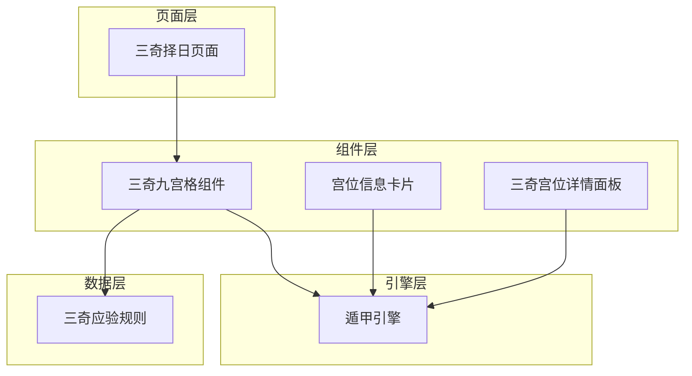
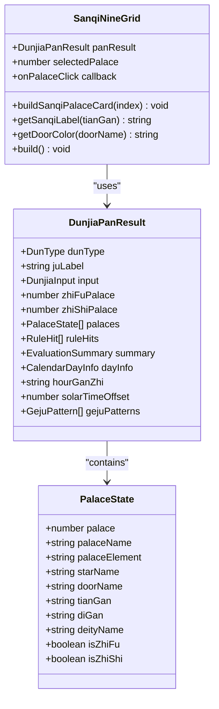
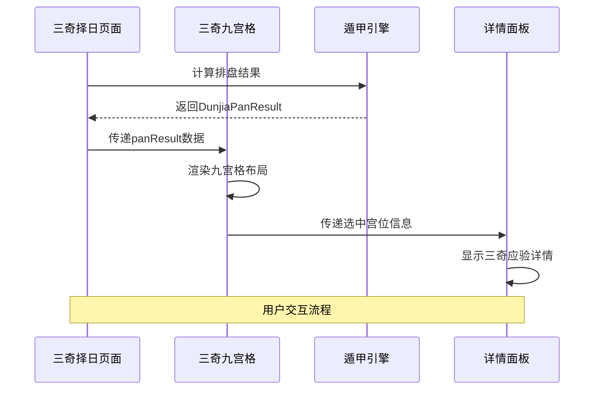
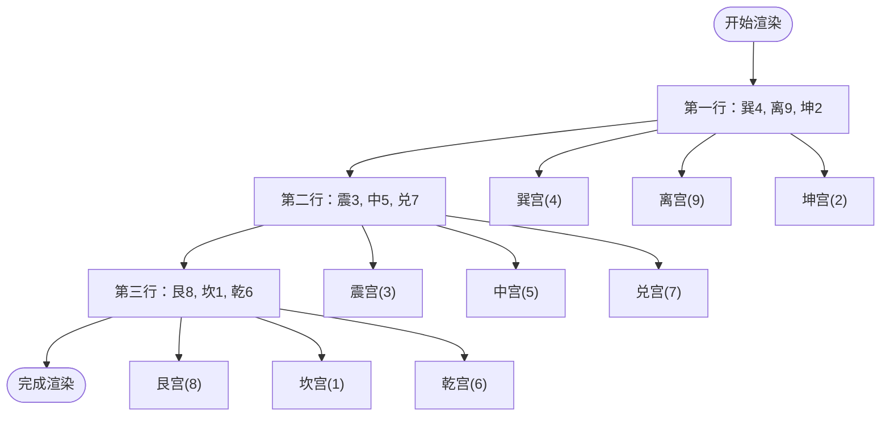
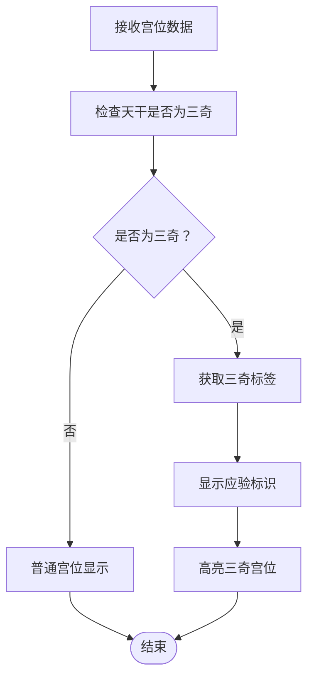
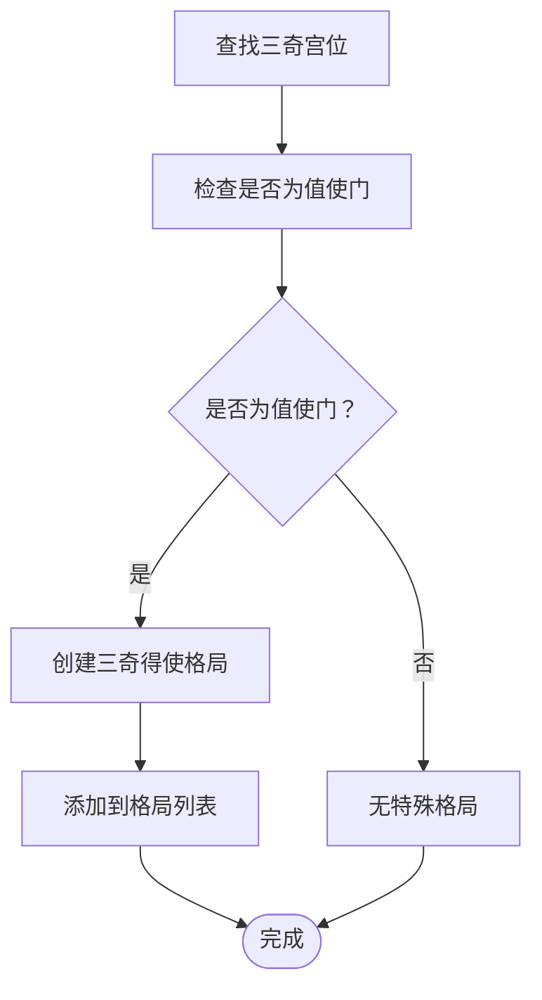
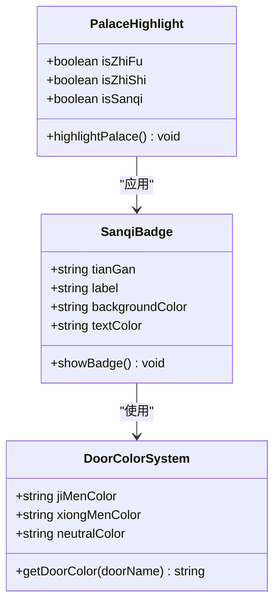
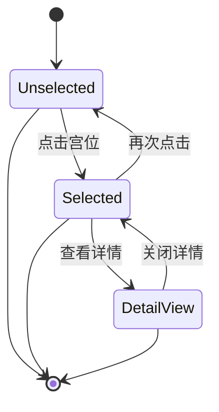
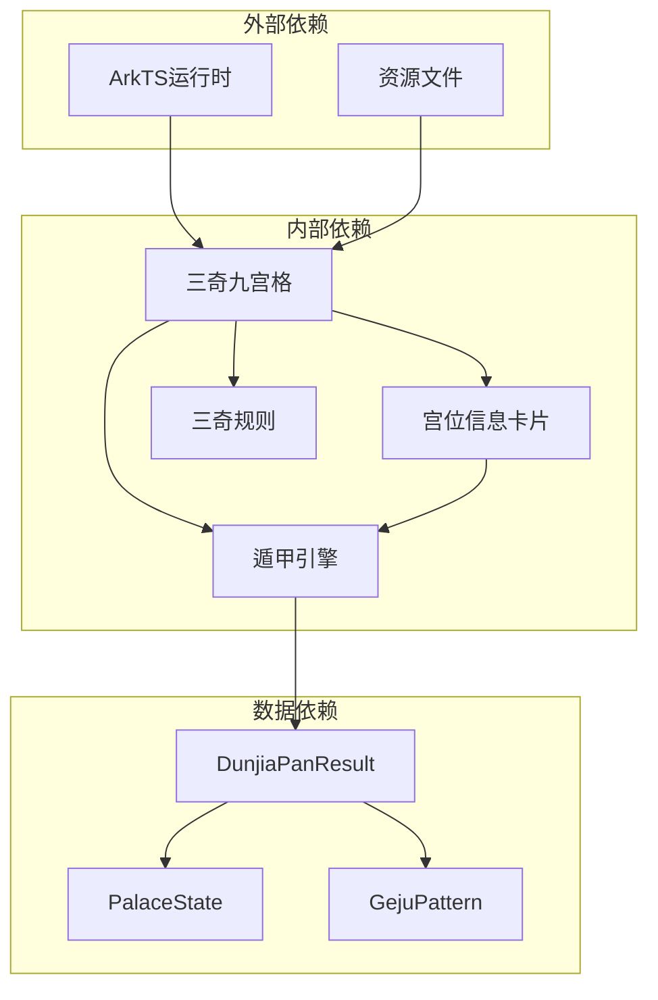

# 三奇九宫格

<cite>
**本文档引用的文件**
- [SanqiNineGrid.ets](file://entry/src/main/ets/components/SanqiNineGrid.ets)
- [DunjiaEngine.ets](file://entry/src/main/ets/utils/DunjiaEngine.ets)
- [DunjiaNineGrid.ets](file://entry/src/main/ets/components/DunjiaNineGrid.ets)
- [PalaceInfoCard.ets](file://entry/src/main/ets/components/PalaceInfoCard.ets)
- [SanqiPalaceDetailPanel.ets](file://entry/src/main/ets/components/SanqiPalaceDetailPanel.ets)
- [SanqiZheriPage.ets](file://entry/src/main/ets/pages/SanqiZheriPage.ets)
- [sanqi_yingyan_rules.json](file://entry/src/main/resources/rawfile/rules/sanqi_yingyan_rules.json)
- [02-遁甲格局与吉凶规则_白话文.md](file://规则/02-遁甲格局与吉凶规则_白话文.md)
</cite>

## 目录
1. [简介](#简介)
2. [项目结构](#项目结构)
3. [核心组件](#核心组件)
4. [架构概览](#架构概览)
5. [详细组件分析](#详细组件分析)
6. [依赖关系分析](#依赖关系分析)
7. [性能考虑](#性能考虑)
8. [故障排除指南](#故障排除指南)
9. [结论](#结论)
10. [附录](#附录)

## 简介

三奇九宫格是遁甲排盘系统中的核心可视化组件，专门用于展示三奇（乙、丙、丁）在九宫中的分布情况。该组件基于《遁甲符应经》的理论体系，通过直观的九宫格布局，帮助用户理解和分析三奇在遁甲时空盘中的应验规律。

与传统的遁甲九宫格相比，三奇九宫格具有以下特色：

- **专注三奇标识**：重点突出三奇（乙、丙、丁）的标识和应验信息
- **简化显示内容**：不显示八神和格局徽章，专注于核心要素
- **应验方位标识**：为三奇宫位提供特殊的应验标识
- **择日专用设计**：针对择日应用场景优化的布局和交互

## 项目结构

三奇九宫格组件位于遁甲应用的组件化架构中，采用分层设计：



**图表来源**
- [SanqiZheriPage.ets](file://entry/src/main/ets/pages/SanqiZheriPage.ets#L78-L815)
- [SanqiNineGrid.ets](file://entry/src/main/ets/components/SanqiNineGrid.ets#L16-L169)
- [DunjiaEngine.ets](file://entry/src/main/ets/utils/DunjiaEngine.ets#L98-L162)

**章节来源**
- [SanqiZheriPage.ets](file://entry/src/main/ets/pages/SanqiZheriPage.ets#L1-L815)
- [SanqiNineGrid.ets](file://entry/src/main/ets/components/SanqiNineGrid.ets#L1-L169)

## 核心组件

### SanqiNineGrid 组件

SanqiNineGrid 是三奇九宫格的核心组件，负责渲染九宫格布局并展示三奇信息。

#### 主要特性

1. **三奇标识系统**：为三奇（乙、丙、丁）提供特殊的视觉标识
2. **应验方位显示**：在三奇宫位显示相应的应验标识
3. **值符值使高亮**：突出显示值符宫和值使宫
4. **交互反馈机制**：支持宫位点击和选中状态反馈

#### 数据结构

组件接收 `DunjiaPanResult` 类型的数据，包含完整的遁甲排盘信息：



**图表来源**
- [SanqiNineGrid.ets](file://entry/src/main/ets/components/SanqiNineGrid.ets#L16-L169)
- [DunjiaEngine.ets](file://entry/src/main/ets/utils/DunjiaEngine.ets#L59-L84)

**章节来源**
- [SanqiNineGrid.ets](file://entry/src/main/ets/components/SanqiNineGrid.ets#L16-L169)
- [DunjiaEngine.ets](file://entry/src/main/ets/utils/DunjiaEngine.ets#L59-L84)

## 架构概览

三奇九宫格的架构遵循组件化设计原则，实现了数据与视图的分离：



**图表来源**
- [SanqiZheriPage.ets](file://entry/src/main/ets/pages/SanqiZheriPage.ets#L117-L134)
- [SanqiNineGrid.ets](file://entry/src/main/ets/components/SanqiNineGrid.ets#L136-L167)
- [SanqiPalaceDetailPanel.ets](file://entry/src/main/ets/components/SanqiPalaceDetailPanel.ets#L50-L153)

## 详细组件分析

### 三奇九宫格布局算法

三奇九宫格采用传统的洛书布局，按照九宫的方位关系进行排列：



**图表来源**
- [SanqiNineGrid.ets](file://entry/src/main/ets/components/SanqiNineGrid.ets#L136-L167)

#### 三奇特殊定位逻辑

三奇（乙、丙、丁）在九宫中的定位遵循遁甲规则：

1. **阳遁布局**：三奇顺布（一宫至九宫）
2. **阴遁布局**：三奇逆布（九宫至一宫）
3. **跳过中宫**：三奇飞布时跳过中宫（索引4）

**章节来源**
- [SanqiNineGrid.ets](file://entry/src/main/ets/components/SanqiNineGrid.ets#L12-L14)
- [DunjiaEngine.ets](file://entry/src/main/ets/utils/DunjiaEngine.ets#L470-L556)

### 三奇宫位识别机制

三奇九宫格通过以下方式识别和标记三奇宫位：



**图表来源**
- [SanqiNineGrid.ets](file://entry/src/main/ets/components/SanqiNineGrid.ets#L57-L65)
- [SanqiNineGrid.ets](file://entry/src/main/ets/components/SanqiNineGrid.ets#L111-L118)

#### 三奇标签系统

三奇标签对应关系：
- 乙 → 日奇
- 丙 → 月奇  
- 丁 → 星奇

**章节来源**
- [SanqiNineGrid.ets](file://entry/src/main/ets/components/SanqiNineGrid.ets#L111-L118)

### 特殊格局判断

三奇九宫格集成了多种特殊格局的判断逻辑：

#### 三奇得使格局

当三奇（乙、丙、丁）落在值使门宫位时，形成三奇得使格局：



**图表来源**
- [DunjiaEngine.ets](file://entry/src/main/ets/utils/DunjiaEngine.ets#L681-L695)

#### 三遁格局识别

三遁格局包括天遁、地遁、人遁三种类型：

- **天遁**：生门 + 丙奇
- **地遁**：开门 + 乙奇  
- **人遁**：休门 + 丁奇

**章节来源**
- [DunjiaEngine.ets](file://entry/src/main/ets/utils/DunjiaEngine.ets#L697-L730)

### 视觉标识系统

三奇九宫格采用了多层次的视觉标识系统：

#### 三奇应验标识



**图表来源**
- [SanqiNineGrid.ets](file://entry/src/main/ets/components/SanqiNineGrid.ets#L57-L65)
- [SanqiNineGrid.ets](file://entry/src/main/ets/components/SanqiNineGrid.ets#L120-L134)
- [SanqiNineGrid.ets](file://entry/src/main/ets/components/SanqiNineGrid.ets#L89-L100)

#### 值符值使标识

- **值符宫**：使用棕色背景标识
- **值使宫**：使用蓝色背景标识
- **三奇宫位**：使用橙色边框和阴影

**章节来源**
- [SanqiNineGrid.ets](file://entry/src/main/ets/components/SanqiNineGrid.ets#L70-L85)
- [SanqiNineGrid.ets](file://entry/src/main/ets/components/SanqiNineGrid.ets#L89-L100)

### 交互反馈机制

三奇九宫格提供了完整的交互反馈机制：

#### 选中状态管理



**图表来源**
- [SanqiNineGrid.ets](file://entry/src/main/ets/components/SanqiNineGrid.ets#L101-L105)
- [SanqiZheriPage.ets](file://entry/src/main/ets/pages/SanqiZheriPage.ets#L788-L791)

#### 详情面板集成

当用户点击某个宫位时，会显示对应的三奇应验详情：

- **三奇类型说明**：日奇、月奇、星奇的具体含义
- **应验象征**：不同宫位的应验象征和时间周期
- **择日建议**：基于三奇应验的行动建议

**章节来源**
- [SanqiPalaceDetailPanel.ets](file://entry/src/main/ets/components/SanqiPalaceDetailPanel.ets#L35-L48)
- [SanqiPalaceDetailPanel.ets](file://entry/src/main/ets/components/SanqiPalaceDetailPanel.ets#L120-L143)

## 依赖关系分析

三奇九宫格组件的依赖关系体现了清晰的分层架构：



**图表来源**
- [SanqiNineGrid.ets](file://entry/src/main/ets/components/SanqiNineGrid.ets#L1-L20)
- [DunjiaEngine.ets](file://entry/src/main/ets/utils/DunjiaEngine.ets#L59-L84)

### 组件耦合度分析

三奇九宫格组件具有良好的内聚性和较低的耦合度：

- **数据驱动**：完全依赖传入的DunjiaPanResult数据
- **无状态设计**：避免内部状态管理，提高可测试性
- **单一职责**：专注于三奇信息的展示和交互

**章节来源**
- [SanqiNineGrid.ets](file://entry/src/main/ets/components/SanqiNineGrid.ets#L16-L21)
- [DunjiaEngine.ets](file://entry/src/main/ets/utils/DunjiaEngine.ets#L98-L162)

## 性能考虑

### 渲染优化策略

1. **虚拟DOM优化**：使用ArkTS的@Builder装饰器优化渲染性能
2. **条件渲染**：仅在必要时渲染三奇标识和特殊标记
3. **缓存机制**：避免重复计算相同的样式和颜色

### 内存管理

- **数据传递**：通过Props传递数据，避免组件内部存储大量状态
- **事件处理**：使用回调函数处理用户交互，减少内存占用

## 故障排除指南

### 常见问题及解决方案

#### 三奇标识不显示

**问题描述**：三奇宫位没有显示橙色标识

**可能原因**：
1. 三奇数据为空
2. 天干不在三奇范围内
3. 数据格式错误

**解决方法**：
1. 检查DunjiaPanResult数据完整性
2. 验证天干字段是否正确
3. 确认三奇识别逻辑

#### 值符值使标识异常

**问题描述**：值符或值使标识显示错误

**可能原因**：
1. 值符值使位置计算错误
2. 宫位索引映射问题
3. 数据更新不及时

**解决方法**：
1. 检查值符值使计算逻辑
2. 验证宫位索引映射关系
3. 确保数据同步更新

**章节来源**
- [SanqiNineGrid.ets](file://entry/src/main/ets/components/SanqiNineGrid.ets#L57-L65)
- [SanqiNineGrid.ets](file://entry/src/main/ets/components/SanqiNineGrid.ets#L70-L85)

## 结论

三奇九宫格组件成功实现了三奇在遁甲九宫中的可视化展示，具有以下优势：

1. **专业性强**：专注于三奇应验的专业展示
2. **用户体验佳**：直观的布局和丰富的视觉标识
3. **扩展性好**：模块化的组件设计便于功能扩展
4. **性能稳定**：优化的渲染策略保证了良好的性能表现

该组件为遁甲应用提供了重要的可视化基础，为用户理解三奇应验规律提供了有力支持。

## 附录

### 使用示例

#### 基本使用

```typescript
SanqiNineGrid({
  panResult: this.panResult,
  selectedPalace: this.selectedPalace,
  onPalaceClick: (index) => {
    this.selectedPalace = index;
  }
})
```

#### 高级配置

```typescript
SanqiNineGrid({
  panResult: this.panResult,
  selectedPalace: this.selectedPalace,
  onPalaceClick: (index) => {
    this.handlePalaceClick(index);
  }
})
```

### 配置选项

| 属性名 | 类型 | 描述 | 默认值 |
|--------|------|------|--------|
| panResult | DunjiaPanResult | 排盘结果数据 | 必填 |
| selectedPalace | number \| null | 选中宫位索引 | null |
| onPalaceClick | Function | 宫位点击回调 | 无 |

### 规则参考

三奇九宫格遵循《遁甲符应经》中的三奇应验规则，具体规则可在以下文件中找到：
- 三奇运行规则
- 三奇到宫应验规则
- 三奇合局规则

**章节来源**
- [sanqi_yingyan_rules.json](file://entry/src/main/resources/rawfile/rules/sanqi_yingyan_rules.json#L1-L36)
- [02-遁甲格局与吉凶规则_白话文.md](file://规则/02-遁甲格局与吉凶规则_白话文.md#L21-L29)