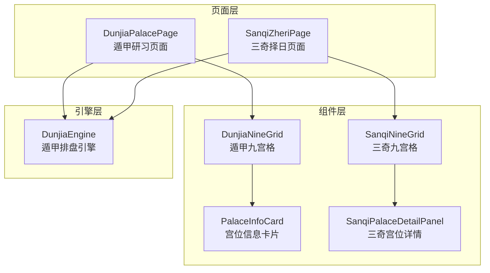
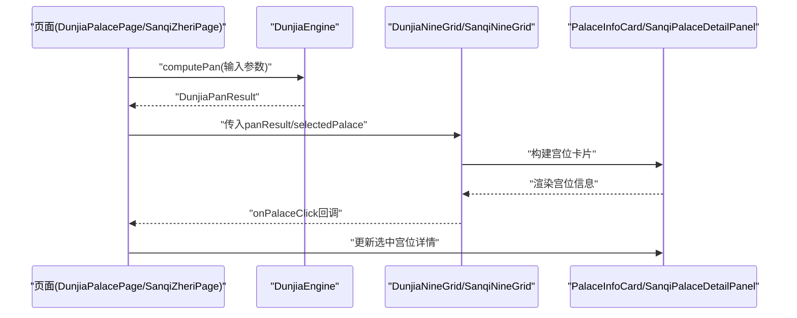
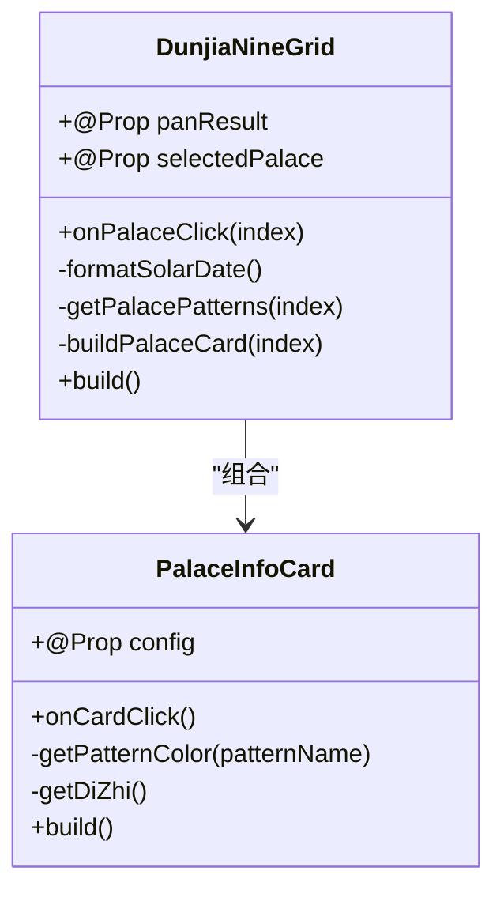
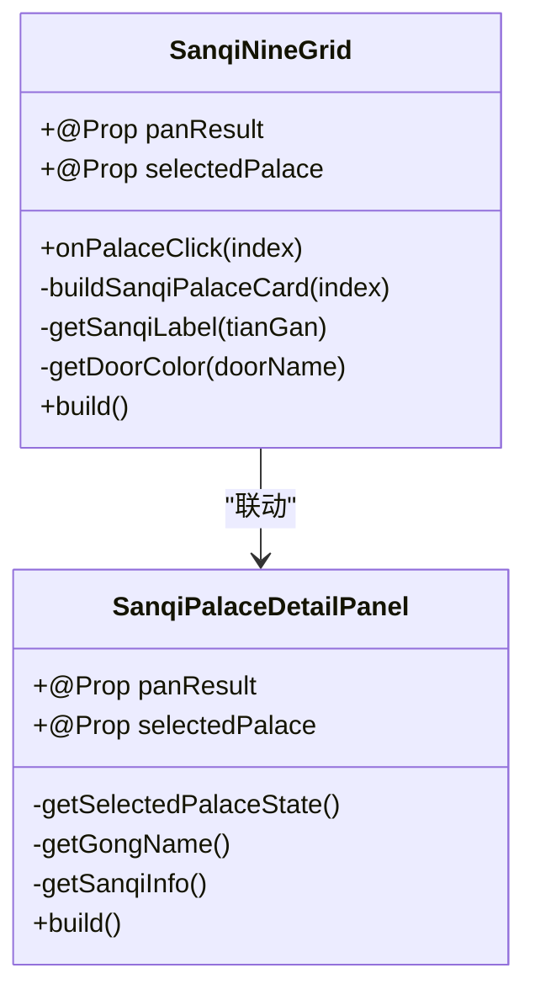
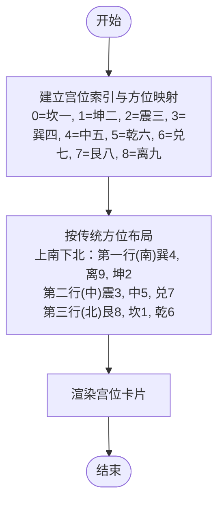
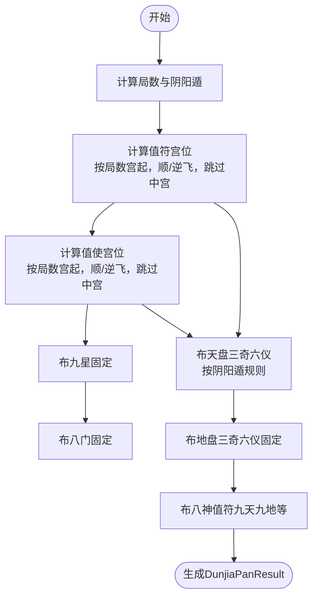
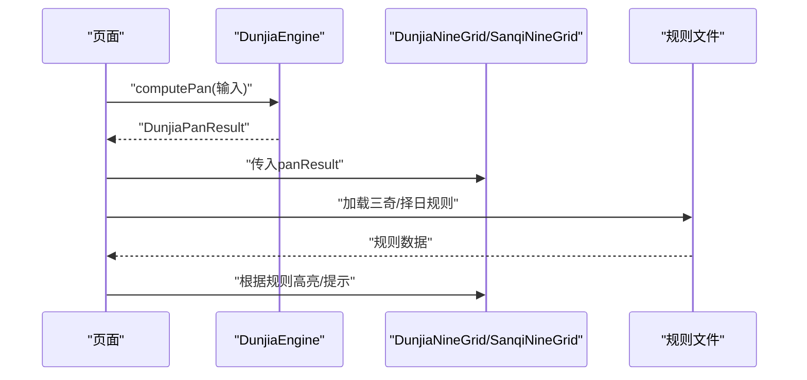
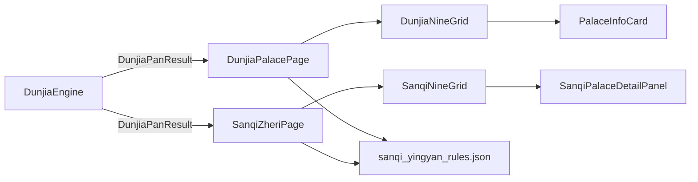

# 九宫格组件

<cite>
**本文档引用的文件**
- [DunjiaNineGrid.ets](file://entry/src/main/ets/components/DunjiaNineGrid.ets)
- [SanqiNineGrid.ets](file://entry/src/main/ets/components/SanqiNineGrid.ets)
- [PalaceInfoCard.ets](file://entry/src/main/ets/components/PalaceInfoCard.ets)
- [SanqiPalaceDetailPanel.ets](file://entry/src/main/ets/components/SanqiPalaceDetailPanel.ets)
- [DunjiaEngine.ets](file://entry/src/main/ets/utils/DunjiaEngine.ets)
- [DunjiaPalacePage.ets](file://entry/src/main/ets/pages/DunjiaPalacePage.ets)
- [SanqiZheriPage.ets](file://entry/src/main/ets/pages/SanqiZheriPage.ets)
- [sanqi_yingyan_rules.json](file://entry/src/main/resources/rawfile/rules/sanqi_yingyan_rules.json)
- [dunjia_scenes.json](file://entry/src/main/resources/rawfile/dunjia_scenes.json)
- [color.json](file://entry/src/main/resources/base/element/color.json)
</cite>

## 目录
1. [简介](#简介)
2. [项目结构](#项目结构)
3. [核心组件](#核心组件)
4. [架构总览](#架构总览)
5. [详细组件分析](#详细组件分析)
6. [依赖关系分析](#依赖关系分析)
7. [性能考虑](#性能考虑)
8. [故障排查指南](#故障排查指南)
9. [结论](#结论)
10. [附录](#附录)

## 简介
本文件系统性梳理遁甲九宫格组件的设计与实现，涵盖遁甲九宫格与三奇九宫格两类组件，解释其布局算法、数据结构、与遁甲引擎的集成方式、交互反馈机制、以及使用示例与自定义配置方法。文档面向开发者与研习者，既提供代码级细节，也提供概念性说明，帮助读者快速理解并高效使用九宫格组件。

## 项目结构
九宫格组件位于 entry/src/main/ets/components 目录，配合引擎与页面共同构成完整的遁甲排盘与展示体系：
- 组件层：DunjiaNineGrid（遁甲研习九宫格）、SanqiNineGrid（三奇择日九宫格）、PalaceInfoCard（宫位信息卡片）、SanqiPalaceDetailPanel（三奇宫位详情）
- 引擎层：DunjiaEngine（遁甲排盘引擎，负责局数、值符值使、九星八门三奇六仪八神布局与规则识别）
- 页面层：DunjiaPalacePage（遁甲研习页面）、SanqiZheriPage（三奇择日页面）

**图表来源**
- [DunjiaPalacePage.ets](file://entry/src/main/ets/pages/DunjiaPalacePage.ets#L82-L115)
- [SanqiZheriPage.ets](file://entry/src/main/ets/pages/SanqiZheriPage.ets#L76-L112)
- [DunjiaNineGrid.ets](file://entry/src/main/ets/components/DunjiaNineGrid.ets#L23-L27)
- [SanqiNineGrid.ets](file://entry/src/main/ets/components/SanqiNineGrid.ets#L16-L20)
- [PalaceInfoCard.ets](file://entry/src/main/ets/components/PalaceInfoCard.ets#L22-L25)
- [SanqiPalaceDetailPanel.ets](file://entry/src/main/ets/components/SanqiPalaceDetailPanel.ets#L11-L14)
- [DunjiaEngine.ets](file://entry/src/main/ets/utils/DunjiaEngine.ets#L98-L162)

**章节来源**
- [DunjiaNineGrid.ets](file://entry/src/main/ets/components/DunjiaNineGrid.ets#L1-L179)
- [SanqiNineGrid.ets](file://entry/src/main/ets/components/SanqiNineGrid.ets#L1-L169)
- [PalaceInfoCard.ets](file://entry/src/main/ets/components/PalaceInfoCard.ets#L1-L179)
- [SanqiPalaceDetailPanel.ets](file://entry/src/main/ets/components/SanqiPalaceDetailPanel.ets#L1-L155)
- [DunjiaEngine.ets](file://entry/src/main/ets/utils/DunjiaEngine.ets#L1-L961)
- [DunjiaPalacePage.ets](file://entry/src/main/ets/pages/DunjiaPalacePage.ets#L82-L115)
- [SanqiZheriPage.ets](file://entry/src/main/ets/pages/SanqiZheriPage.ets#L76-L112)

## 核心组件
- DunjiaNineGrid（遁甲研习九宫格）：展示完整遁甲盘面（九星、八门、天盘地盘、八神、值符值使、格局徽章），支持宫位点击与选中态高亮。
- SanqiNineGrid（三奇择日九宫格）：聚焦三奇（乙、丙、丁）到宫应验，突出三奇标识与应验方位，适合择日场景。
- PalaceInfoCard（宫位信息卡片）：通用宫位卡片，承载九星、八门、天干地支、八神、值符值使、格局徽章等信息。
- SanqiPalaceDetailPanel（三奇宫位详情）：展示三奇到宫的应验信息、时间周期与建议。

**章节来源**
- [DunjiaNineGrid.ets](file://entry/src/main/ets/components/DunjiaNineGrid.ets#L5-L22)
- [SanqiNineGrid.ets](file://entry/src/main/ets/components/SanqiNineGrid.ets#L3-L14)
- [PalaceInfoCard.ets](file://entry/src/main/ets/components/PalaceInfoCard.ets#L3-L11)
- [SanqiPalaceDetailPanel.ets](file://entry/src/main/ets/components/SanqiPalaceDetailPanel.ets#L3-L10)

## 架构总览
九宫格组件与遁甲引擎的集成采用“页面状态管理 + 组件渲染”的模式：
- 页面负责输入参数构造（时间、经度、场景类型）、调用引擎计算、接收并传递排盘结果。
- 组件负责将排盘结果结构化渲染为宫位卡片，处理点击与选中态，联动详情面板。
- 规则文件（如三奇应验规则）在页面加载时解析，驱动三奇应验展示与提示。

**图表来源**
- [DunjiaPalacePage.ets](file://entry/src/main/ets/pages/DunjiaPalacePage.ets#L218-L236)
- [SanqiZheriPage.ets](file://entry/src/main/ets/pages/SanqiZheriPage.ets#L117-L134)
- [DunjiaEngine.ets](file://entry/src/main/ets/utils/DunjiaEngine.ets#L113-L162)
- [DunjiaNineGrid.ets](file://entry/src/main/ets/components/DunjiaNineGrid.ets#L51-L70)
- [SanqiNineGrid.ets](file://entry/src/main/ets/components/SanqiNineGrid.ets#L25-L106)
- [PalaceInfoCard.ets](file://entry/src/main/ets/components/PalaceInfoCard.ets#L50-L177)
- [SanqiPalaceDetailPanel.ets](file://entry/src/main/ets/components/SanqiPalaceDetailPanel.ets#L50-L153)

## 详细组件分析

### 组件A：遁甲九宫格（DunjiaNineGrid）
- 设计目标：完整展示遁甲盘面，包含时间信息、局数、九星八门三奇六仪八神、值符值使、格局徽章与宫位点击交互。
- 关键特性：
  - 时间信息：阳历、农历、真太阳时偏移与经度标注。
  - 局数信息：局号与整体概览。
  - 布局算法：按传统方位（上南下北）组织九宫格，行列索引与宫位索引一一对应。
  - 样式与主题：卡片圆角、阴影、边框、选中态高亮、值符值使角标。
  - 交互反馈：点击宫位触发回调，支持选中态切换。
- 数据结构与属性：
  - @Prop panResult: DunjiaPanResult | null
  - @Prop selectedPalace: number | null
  - onPalaceClick?: (index: number) => void
- 与PalaceInfoCard协作：通过配置对象传递宫位状态、选中态、值符值使与格局徽章列表。

**图表来源**
- [DunjiaNineGrid.ets](file://entry/src/main/ets/components/DunjiaNineGrid.ets#L23-L70)
- [PalaceInfoCard.ets](file://entry/src/main/ets/components/PalaceInfoCard.ets#L22-L177)

**章节来源**
- [DunjiaNineGrid.ets](file://entry/src/main/ets/components/DunjiaNineGrid.ets#L1-L179)
- [PalaceInfoCard.ets](file://entry/src/main/ets/components/PalaceInfoCard.ets#L1-L179)

### 组件B：三奇九宫格（SanqiNineGrid）
- 设计目标：聚焦三奇（乙、丙、丁）到宫应验，突出三奇标识与应验方位，适合择日场景。
- 关键特性：
  - 三奇标识：对乙、丙、丁天干进行高亮与徽章标注。
  - 八门颜色：根据吉门、凶门、平门区分颜色。
  - 值符值使与三奇联动：三奇宫位与值符值使宫位同时高亮。
  - 布局算法：与遁甲九宫一致，按传统方位组织。
- 数据结构与属性：
  - @Prop panResult: DunjiaPanResult
  - @Prop selectedPalace: number | null
  - onPalaceClick?: (index: number) => void
- 与SanqiPalaceDetailPanel协作：选中宫位后展示三奇应验详情。

**图表来源**
- [SanqiNineGrid.ets](file://entry/src/main/ets/components/SanqiNineGrid.ets#L16-L106)
- [SanqiPalaceDetailPanel.ets](file://entry/src/main/ets/components/SanqiPalaceDetailPanel.ets#L11-L153)

**章节来源**
- [SanqiNineGrid.ets](file://entry/src/main/ets/components/SanqiNineGrid.ets#L1-L169)
- [SanqiPalaceDetailPanel.ets](file://entry/src/main/ets/components/SanqiPalaceDetailPanel.ets#L1-L155)

### 组件C：宫位信息卡片（PalaceInfoCard）
- 设计目标：统一渲染宫位信息，支持值符值使标识、格局徽章、选中态高亮。
- 关键特性：
  - 信息层次：宫名、地支、九星、八门、天干地支、八神、格局徽章。
  - 样式控制：根据值符值使与选中态动态调整边框、阴影、背景色。
  - 地支映射：根据宫位索引映射到地支符号。
- 适用场景：遁甲研习九宫格与三奇九宫格均可复用。

**章节来源**
- [PalaceInfoCard.ets](file://entry/src/main/ets/components/PalaceInfoCard.ets#L1-L179)

### 组件D：三奇宫位详情（SanqiPalaceDetailPanel）
- 设计目标：展示三奇到宫的应验信息、时间周期与建议。
- 关键特性：
  - 条件渲染：仅在三奇宫位展示应验详情。
  - 结构化信息：九星、八门、天盘、地盘、三奇应验说明。
  - 样式与提示：背景色、边框与提示文本。

**章节来源**
- [SanqiPalaceDetailPanel.ets](file://entry/src/main/ets/components/SanqiPalaceDetailPanel.ets#L1-L155)

### 布局算法与数据流

#### 宫位索引与方位映射
- 九宫索引：0-8 对应一宫至九宫。
- 传统方位映射：上南下北，行列索引与宫位索引一一对应，便于在网格中布局。

**图表来源**
- [DunjiaNineGrid.ets](file://entry/src/main/ets/components/DunjiaNineGrid.ets#L143-L171)
- [SanqiNineGrid.ets](file://entry/src/main/ets/components/SanqiNineGrid.ets#L136-L166)

#### 九星飞布与值符值使计算
- 九星固定：九星固定对应九宫（地盘），不随局数飞布。
- 值符：随局数宫起，按阴阳遁顺逆飞布，跳过中宫。
- 值使：随局数宫起，按阴阳遁顺逆飞布，跳过中宫。
- 三奇六仪：天盘按阴阳遁顺逆布六仪逆布三奇或顺布三奇逆布六仪，地盘按固定规则布局。

**图表来源**
- [DunjiaEngine.ets](file://entry/src/main/ets/utils/DunjiaEngine.ets#L206-L246)
- [DunjiaEngine.ets](file://entry/src/main/ets/utils/DunjiaEngine.ets#L358-L389)
- [DunjiaEngine.ets](file://entry/src/main/ets/utils/DunjiaEngine.ets#L464-L556)
- [DunjiaEngine.ets](file://entry/src/main/ets/utils/DunjiaEngine.ets#L558-L601)

**章节来源**
- [DunjiaEngine.ets](file://entry/src/main/ets/utils/DunjiaEngine.ets#L98-L162)

### 与遁甲引擎的集成
- 页面构造输入参数：时间、经度、场景类型。
- 引擎计算：返回 DunjiaPanResult，包含局数、值符值使、九宫状态、规则命中与结构评估。
- 组件渲染：将 DunjiaPanResult 传入九宫格组件，组件内部再组合宫位卡片。
- 三奇应验：页面加载规则文件，根据盘面三奇位置筛选应验信息并展示。

**图表来源**
- [DunjiaPalacePage.ets](file://entry/src/main/ets/pages/DunjiaPalacePage.ets#L218-L236)
- [SanqiZheriPage.ets](file://entry/src/main/ets/pages/SanqiZheriPage.ets#L117-L134)
- [DunjiaEngine.ets](file://entry/src/main/ets/utils/DunjiaEngine.ets#L113-L162)
- [sanqi_yingyan_rules.json](file://entry/src/main/resources/rawfile/rules/sanqi_yingyan_rules.json#L1-L525)

**章节来源**
- [DunjiaPalacePage.ets](file://entry/src/main/ets/pages/DunjiaPalacePage.ets#L107-L181)
- [SanqiZheriPage.ets](file://entry/src/main/ets/pages/SanqiZheriPage.ets#L136-L295)
- [sanqi_yingyan_rules.json](file://entry/src/main/resources/rawfile/rules/sanqi_yingyan_rules.json#L1-L525)

## 依赖关系分析
- DunjiaNineGrid 依赖 DunjiaEngine 的排盘结果与 PalaceInfoCard 进行渲染。
- SanqiNineGrid 依赖 DunjiaEngine 的排盘结果与 SanqiPalaceDetailPanel 进行详情展示。
- 页面层通过规则文件驱动三奇应验展示，规则文件来自资源目录。

**图表来源**
- [DunjiaEngine.ets](file://entry/src/main/ets/utils/DunjiaEngine.ets#L113-L162)
- [DunjiaPalacePage.ets](file://entry/src/main/ets/pages/DunjiaPalacePage.ets#L107-L181)
- [SanqiZheriPage.ets](file://entry/src/main/ets/pages/SanqiZheriPage.ets#L136-L295)
- [sanqi_yingyan_rules.json](file://entry/src/main/resources/rawfile/rules/sanqi_yingyan_rules.json#L1-L525)

**章节来源**
- [DunjiaEngine.ets](file://entry/src/main/ets/utils/DunjiaEngine.ets#L113-L162)
- [DunjiaPalacePage.ets](file://entry/src/main/ets/pages/DunjiaPalacePage.ets#L107-L181)
- [SanqiZheriPage.ets](file://entry/src/main/ets/pages/SanqiZheriPage.ets#L136-L295)

## 性能考虑
- 渲染优化
  - 使用 @Builder 构建器函数减少重复渲染开销，按需渲染宫位卡片。
  - 选中态与值符值使高亮采用条件样式，避免不必要的重绘。
- 数据访问
  - 通过 props 传递排盘结果，避免组件内部重复计算。
  - 在 DunjiaNineGrid 中缓存宫位相关格局列表，减少过滤开销。
- 异步计算
  - 页面层异步调用引擎计算，避免阻塞 UI。
- 资源加载
  - 规则文件在页面初始化阶段加载并解析，避免运行时频繁 IO。

[本节为通用指导，无需特定文件引用]

## 故障排查指南
- 无法获取排盘结果
  - 检查输入参数（时间、经度、场景类型）是否正确。
  - 查看页面计算流程与错误捕获逻辑。
- 三奇应验未显示
  - 确认规则文件加载成功且解析无误。
  - 检查盘面中是否存在三奇宫位。
- 样式异常
  - 检查颜色主题与资源文件是否正确加载。
  - 确认选中态与值符值使高亮逻辑生效。

**章节来源**
- [DunjiaPalacePage.ets](file://entry/src/main/ets/pages/DunjiaPalacePage.ets#L218-L236)
- [SanqiZheriPage.ets](file://entry/src/main/ets/pages/SanqiZheriPage.ets#L117-L134)
- [color.json](file://entry/src/main/resources/base/element/color.json#L1-L8)

## 结论
遁甲九宫格组件通过清晰的职责划分与与引擎的紧密集成，实现了从排盘计算到可视化渲染的完整链路。遁甲九宫格强调全面信息展示，三奇九宫格聚焦应验指引，两者配合规则文件，既能满足研习需求，也能支撑择日实践。组件化的架构便于扩展与维护，为后续功能迭代提供了良好基础。

## 附录

### 使用示例与自定义配置
- 基本使用
  - 在页面中构造输入参数并调用引擎计算，将结果传入九宫格组件。
  - 通过 onPalaceClick 回调处理宫位点击事件，更新选中态并在详情面板展示。
- 自定义配置
  - 样式主题：通过组件的样式属性（边框、阴影、背景色、选中态）进行主题定制。
  - 规则扩展：在规则文件中新增三奇应验条目，页面加载后自动生效。
  - 布局适配：根据设备尺寸调整宫位卡片宽度与间距，保证在不同屏幕下的可读性。

**章节来源**
- [DunjiaPalacePage.ets](file://entry/src/main/ets/pages/DunjiaPalacePage.ets#L218-L236)
- [SanqiZheriPage.ets](file://entry/src/main/ets/pages/SanqiZheriPage.ets#L117-L134)
- [sanqi_yingyan_rules.json](file://entry/src/main/resources/rawfile/rules/sanqi_yingyan_rules.json#L1-L525)
- [dunjia_scenes.json](file://entry/src/main/resources/rawfile/dunjia_scenes.json#L1-L50)