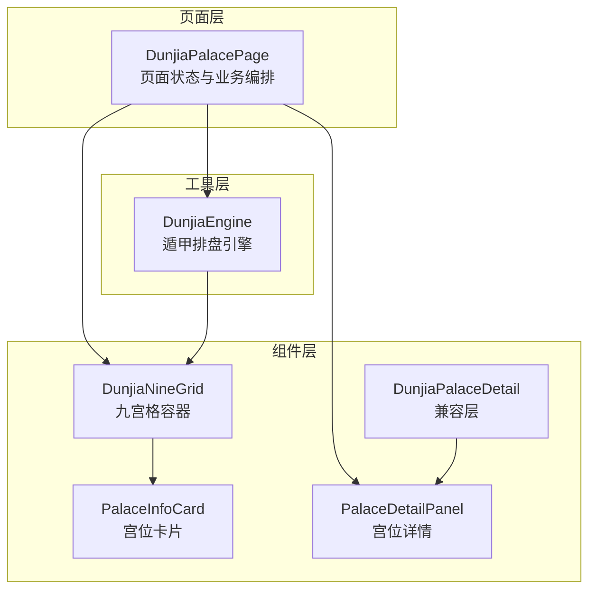
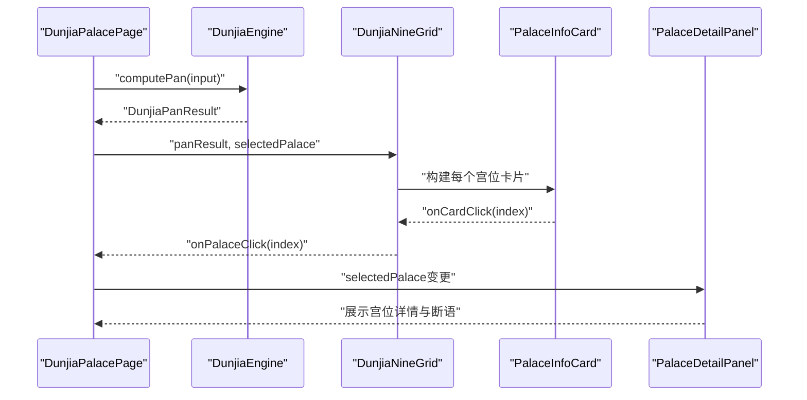
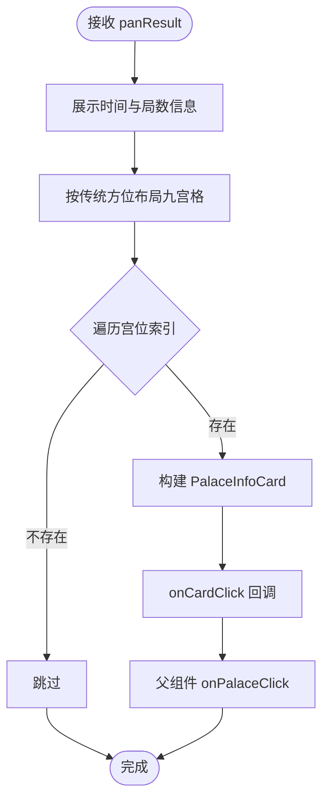
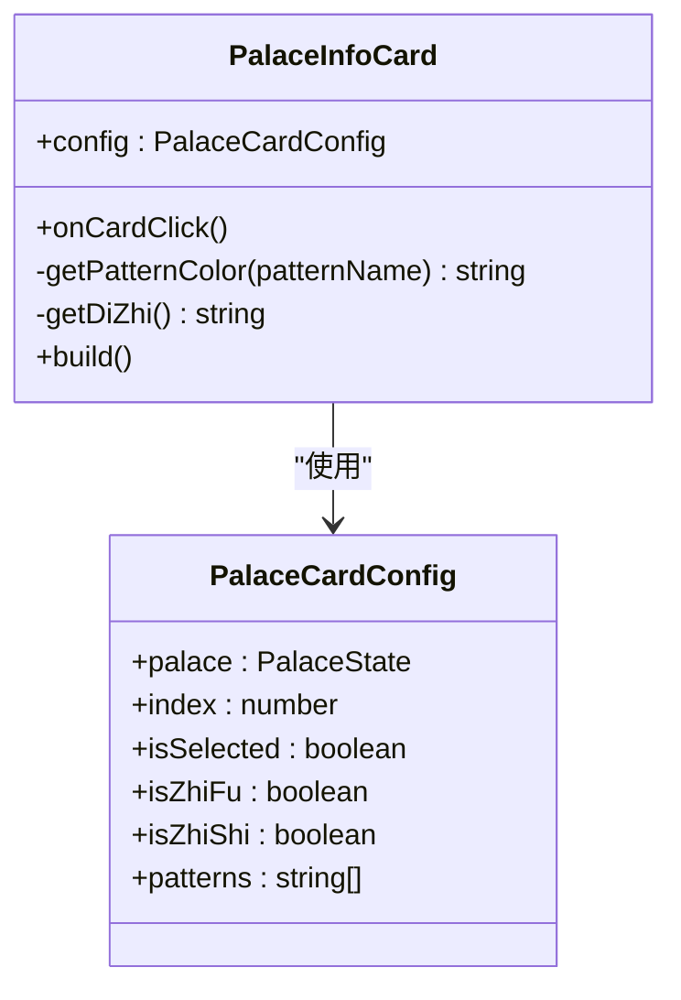
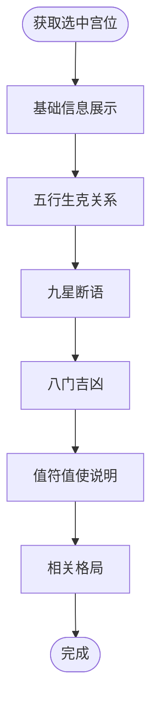
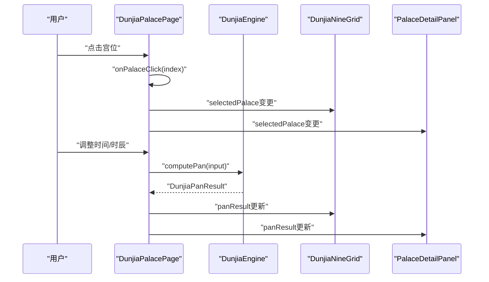
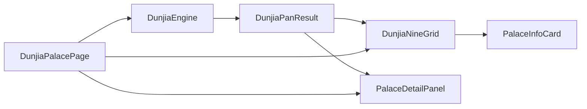

# 遁甲九宫格

<cite>
**本文引用的文件**
- [DunjiaNineGrid.ets](file://entry/src/main/ets/components/DunjiaNineGrid.ets)
- [PalaceInfoCard.ets](file://entry/src/main/ets/components/PalaceInfoCard.ets)
- [PalaceDetailPanel.ets](file://entry/src/main/ets/components/PalaceDetailPanel.ets)
- [DunjiaPalaceDetail.ets](file://entry/src/main/ets/components/DunjiaPalaceDetail.ets)
- [DunjiaEngine.ets](file://entry/src/main/ets/utils/DunjiaEngine.ets)
- [DunjiaPalacePage.ets](file://entry/src/main/ets/pages/DunjiaPalacePage.ets)
- [jiuxing_duanyu_rules.json](file://entry/build/default/intermediates/res/default/resources/rawfile/rules/jiuxing_duanyu_rules.json)
- [sanqi_yingyan_rules.json](file://entry/build/default/intermediates/res/default/resources/rawfile/rules/sanqi_yingyan_rules.json)
- [dunjia_scenes.json](file://entry/build/default/intermediates/res/default/resources/rawfile/dunjia_scenes.json)
</cite>

## 目录
1. [简介](#简介)
2. [项目结构](#项目结构)
3. [核心组件](#核心组件)
4. [架构总览](#架构总览)
5. [详细组件解析](#详细组件解析)
6. [依赖关系分析](#依赖关系分析)
7. [性能考量](#性能考量)
8. [故障排查指南](#故障排查指南)
9. [结论](#结论)
10. [附录](#附录)

## 简介
遁甲九宫格是奇门遁甲时空盘的核心可视化组件，负责将遁甲引擎计算出的排盘结果以传统方位布局（上南下北）直观呈现。它不仅展示九宫的九星、八门、三奇六仪、八神等要素，还支持时间信息（阳历、农历、真太阳时）、局数信息、值符值使标识、格局模式提示，并提供宫位点击与详情联动能力。本文档将深入解析其设计原理、数据结构、渲染流程、与遁甲引擎的集成方式，以及如何扩展样式与交互。

## 项目结构
本项目采用按功能域划分的组织方式：
- 页面层：负责状态管理与业务流程编排（如九宫盘页面）
- 组件层：提供可复用的UI组件（九宫格、宫位卡片、详情面板等）
- 工具层：提供核心算法与规则（遁甲引擎、节气与时辰工具等）

图表来源
- [DunjiaPalacePage.ets](file://entry/src/main/ets/pages/DunjiaPalacePage.ets#L82-L115)
- [DunjiaNineGrid.ets](file://entry/src/main/ets/components/DunjiaNineGrid.ets#L23-L27)
- [PalaceInfoCard.ets](file://entry/src/main/ets/components/PalaceInfoCard.ets#L22-L25)
- [PalaceDetailPanel.ets](file://entry/src/main/ets/components/PalaceDetailPanel.ets#L32-L35)
- [DunjiaPalaceDetail.ets](file://entry/src/main/ets/components/DunjiaPalaceDetail.ets#L11-L22)
- [DunjiaEngine.ets](file://entry/src/main/ets/utils/DunjiaEngine.ets#L98-L162)

章节来源
- [DunjiaPalacePage.ets](file://entry/src/main/ets/pages/DunjiaPalacePage.ets#L82-L115)
- [DunjiaNineGrid.ets](file://entry/src/main/ets/components/DunjiaNineGrid.ets#L23-L27)
- [PalaceInfoCard.ets](file://entry/src/main/ets/components/PalaceInfoCard.ets#L22-L25)
- [PalaceDetailPanel.ets](file://entry/src/main/ets/components/PalaceDetailPanel.ets#L32-L35)
- [DunjiaPalaceDetail.ets](file://entry/src/main/ets/components/DunjiaPalaceDetail.ets#L11-L22)
- [DunjiaEngine.ets](file://entry/src/main/ets/utils/DunjiaEngine.ets#L98-L162)

## 核心组件
- 九宫格容器（DunjiaNineGrid）：承载时间信息、局数信息与九宫格布局，负责将遁甲排盘结果映射为宫位卡片。
- 宫位卡片（PalaceInfoCard）：渲染单宫的九星、八门、天干地干、八神、值符值使标识与格局徽章，并响应点击。
- 宫位详情面板（PalaceDetailPanel）：基于《遁甲符应经》的九星断语、八门吉凶、五行生克、值符值使说明与相关格局进行深度解读。
- 页面（DunjiaPalacePage）：负责排盘计算、选中状态管理、时间与时辰切换、三奇应验指引等。

章节来源
- [DunjiaNineGrid.ets](file://entry/src/main/ets/components/DunjiaNineGrid.ets#L23-L179)
- [PalaceInfoCard.ets](file://entry/src/main/ets/components/PalaceInfoCard.ets#L22-L179)
- [PalaceDetailPanel.ets](file://entry/src/main/ets/components/PalaceDetailPanel.ets#L32-L481)
- [DunjiaPalacePage.ets](file://entry/src/main/ets/pages/DunjiaPalacePage.ets#L82-L340)

## 架构总览
九宫格与遁甲引擎的集成遵循“数据驱动”的原则：页面发起排盘请求，引擎返回结构化的排盘结果，组件基于结果进行渲染与交互。

图表来源
- [DunjiaPalacePage.ets](file://entry/src/main/ets/pages/DunjiaPalacePage.ets#L218-L236)
- [DunjiaEngine.ets](file://entry/src/main/ets/utils/DunjiaEngine.ets#L113-L162)
- [DunjiaNineGrid.ets](file://entry/src/main/ets/components/DunjiaNineGrid.ets#L51-L70)
- [PalaceInfoCard.ets](file://entry/src/main/ets/components/PalaceInfoCard.ets#L172-L177)
- [PalaceDetailPanel.ets](file://entry/src/main/ets/components/PalaceDetailPanel.ets#L40-L53)

## 详细组件解析

### 九宫格容器（DunjiaNineGrid）
- 职责
  - 展示时间信息（阳历、农历、真太阳时）与局数
  - 以传统方位布局（上南下北）渲染九宫格
  - 将排盘结果映射为宫位卡片，传递选中状态与点击回调
- 关键点
  - 传统方位布局：第一行（上南）巽4、离9、坤2；第二行（中）震3、中5、兑7；第三行（下北）艮8、坎1、乾6
  - 选中态与值符/值使态通过卡片配置传递
  - 格局模式通过过滤 panResult.gejuPatterns 得到
- 数据流
  - 输入：DunjiaPanResult、selectedPalace、onPalaceClick
  - 输出：九宫格布局、宫位点击事件

图表来源
- [DunjiaNineGrid.ets](file://entry/src/main/ets/components/DunjiaNineGrid.ets#L72-L177)
- [DunjiaNineGrid.ets](file://entry/src/main/ets/components/DunjiaNineGrid.ets#L144-L171)
- [DunjiaNineGrid.ets](file://entry/src/main/ets/components/DunjiaNineGrid.ets#L41-L46)

章节来源
- [DunjiaNineGrid.ets](file://entry/src/main/ets/components/DunjiaNineGrid.ets#L23-L179)

### 宫位卡片（PalaceInfoCard）
- 职责
  - 渲染宫位基本信息（宫名、地支、九星、八门、天干地干、八神）
  - 值符/值使标识与阴影高亮
  - 格局徽章（按名称匹配颜色）
  - 选中态背景与边框变化
- 关键点
  - 地支映射：通过宫位索引映射到十二地支
  - 格局徽章颜色策略：天遁/三奇得使（橙）、地遁/人遁（棕）、其他（蓝）
  - 点击事件透传给父组件

图表来源
- [PalaceInfoCard.ets](file://entry/src/main/ets/components/PalaceInfoCard.ets#L13-L20)
- [PalaceInfoCard.ets](file://entry/src/main/ets/components/PalaceInfoCard.ets#L22-L179)

章节来源
- [PalaceInfoCard.ets](file://entry/src/main/ets/components/PalaceInfoCard.ets#L22-L179)

### 宫位详情面板（PalaceDetailPanel）
- 职责
  - 基础信息：宫位、五行、九星、八门、天干地干、八神
  - 五行生克：基于宫位五行生成生克关系
  - 九星断语与八门吉凶：从规则库中提取断语与宜忌
  - 值符值使说明：根据全局值符值使位置给出解释
  - 相关格局：筛选与当前宫位相关的格局并展示
- 关键点
  - 断语来源：规则文件（九星断语、三奇应验等）
  - 与页面联动：通过 selectedPalace 获取当前宫位状态

图表来源
- [PalaceDetailPanel.ets](file://entry/src/main/ets/components/PalaceDetailPanel.ets#L40-L53)
- [PalaceDetailPanel.ets](file://entry/src/main/ets/components/PalaceDetailPanel.ets#L58-L82)
- [PalaceDetailPanel.ets](file://entry/src/main/ets/components/PalaceDetailPanel.ets#L101-L154)
- [PalaceDetailPanel.ets](file://entry/src/main/ets/components/PalaceDetailPanel.ets#L159-L215)
- [PalaceDetailPanel.ets](file://entry/src/main/ets/components/PalaceDetailPanel.ets#L87-L96)
- [PalaceDetailPanel.ets](file://entry/src/main/ets/components/PalaceDetailPanel.ets#L414-L450)

章节来源
- [PalaceDetailPanel.ets](file://entry/src/main/ets/components/PalaceDetailPanel.ets#L32-L481)

### 页面（DunjiaPalacePage）
- 职责
  - 排盘计算：构造输入参数并调用引擎
  - 状态管理：panResult、selectedPalace、loading
  - 交互控制：时间调整、时辰切换、宫位点击
  - 规则加载：用神映射与三奇应验规则
- 关键点
  - onPalaceClick：切换选中宫位
  - adjustTime/switchToShichen：改变时间与时辰并重新计算
  - 三奇象意：根据当前盘面与所选事类筛选象意

图表来源
- [DunjiaPalacePage.ets](file://entry/src/main/ets/pages/DunjiaPalacePage.ets#L278-L286)
- [DunjiaPalacePage.ets](file://entry/src/main/ets/pages/DunjiaPalacePage.ets#L288-L339)
- [DunjiaPalacePage.ets](file://entry/src/main/ets/pages/DunjiaPalacePage.ets#L218-L236)
- [DunjiaPalacePage.ets](file://entry/src/main/ets/pages/DunjiaPalacePage.ets#L357-L423)

章节来源
- [DunjiaPalacePage.ets](file://entry/src/main/ets/pages/DunjiaPalacePage.ets#L82-L340)

## 依赖关系分析
- DunjiaNineGrid 依赖 DunjiaEngine 的排盘结果类型与 PalaceInfoCard 进行渲染
- PalaceInfoCard 依赖 DunjiaEngine 的 PalaceState 与 GejuPattern
- PalaceDetailPanel 依赖 DunjiaEngine 的 DunjiaPanResult 与规则文件
- DunjiaPalacePage 依赖 DunjiaEngine 进行排盘，并与九宫格、详情面板协作

图表来源
- [DunjiaEngine.ets](file://entry/src/main/ets/utils/DunjiaEngine.ets#L59-L84)
- [DunjiaNineGrid.ets](file://entry/src/main/ets/components/DunjiaNineGrid.ets#L1-L3)
- [PalaceInfoCard.ets](file://entry/src/main/ets/components/PalaceInfoCard.ets#L1-L1)
- [PalaceDetailPanel.ets](file://entry/src/main/ets/components/PalaceDetailPanel.ets#L1-L2)
- [DunjiaPalacePage.ets](file://entry/src/main/ets/pages/DunjiaPalacePage.ets#L1-L6)

章节来源
- [DunjiaEngine.ets](file://entry/src/main/ets/utils/DunjiaEngine.ets#L59-L84)
- [DunjiaNineGrid.ets](file://entry/src/main/ets/components/DunjiaNineGrid.ets#L1-L3)
- [PalaceInfoCard.ets](file://entry/src/main/ets/components/PalaceInfoCard.ets#L1-L1)
- [PalaceDetailPanel.ets](file://entry/src/main/ets/components/PalaceDetailPanel.ets#L1-L2)
- [DunjiaPalacePage.ets](file://entry/src/main/ets/pages/DunjiaPalacePage.ets#L1-L6)

## 性能考量
- 渲染优化
  - 九宫格采用固定布局与 Builder 构建，减少不必要的重组
  - 宫位卡片按需渲染，避免重复计算
- 数据结构
  - DunjiaPanResult 一次性计算，避免多次查询
  - 格局模式预先识别，减少渲染时的过滤开销
- 异步计算
  - 排盘计算为异步，页面在 loading 状态下提供反馈，避免阻塞

[本节为通用建议，无需特定文件引用]

## 故障排查指南
- 无法显示排盘
  - 检查引擎返回的 panResult 是否为空或字段缺失
  - 确认页面已正确设置 loading 与 panResult
- 宫位点击无效
  - 确认 onPalaceClick 回调是否正确传递到九宫格
  - 检查 selectedPalace 是否在页面中正确更新
- 格局徽章不显示
  - 确认 gejuPatterns 是否存在且包含当前宫位索引
  - 检查名称匹配逻辑与颜色映射
- 详情面板空白
  - 确认 selectedPalace 不为 null 且在 panResult.palaces 中存在
  - 检查规则文件加载是否成功

章节来源
- [DunjiaPalacePage.ets](file://entry/src/main/ets/pages/DunjiaPalacePage.ets#L218-L236)
- [DunjiaNineGrid.ets](file://entry/src/main/ets/components/DunjiaNineGrid.ets#L41-L46)
- [PalaceDetailPanel.ets](file://entry/src/main/ets/components/PalaceDetailPanel.ets#L40-L53)

## 结论
遁甲九宫格通过清晰的组件边界与数据驱动的渲染策略，实现了传统方位布局与现代UI的融合。它与遁甲引擎紧密耦合，既保证了排盘结果的准确性，又提供了丰富的交互与解读能力。通过模块化设计，开发者可以轻松扩展样式、交互与规则，满足不同研习场景的需求。

[本节为总结性内容，无需特定文件引用]

## 附录

### 数据结构与算法要点
- 宫位索引映射
  - 九宫索引 0-8 对应九宫：0=一宫坎, 1=二宫坤, 2=三宫震, 3=四宫巽, 4=五宫中, 5=六宫乾, 6=七宫兑, 7=八宫艮, 8=九宫离
  - 传统方位布局：上南下北，第一行（上）巽4、离9、坤2；第二行（中）震3、中5、兑7；第三行（下）艮8、坎1、乾6
- 九星飞布
  - 九星固定对应九宫（地盘），不随局数飞布
  - 值符在九星盘上随局数与阴阳遁飞布，跳过中宫
- 八门飞布
  - 八门固定对应九宫（地盘），不随局数飞布
  - 值使门随局数与阴阳遁飞布，跳过中宫
- 三奇六仪布局
  - 天盘（暗干）：阳遁顺布六仪逆布三奇，阴遁逆布六仪顺布三奇
  - 地盘（明干）：固定布局，跳过中宫
- 八神布局
  - 值符后一为九天，后二为九地，前二为太阴，前三为六合（阳遁）
  - 值符前一为九天，前二为九地，后二为太阴，后三为六合（阴遁）
  - 中宫固定为天禽

章节来源
- [DunjiaEngine.ets](file://entry/src/main/ets/utils/DunjiaEngine.ets#L18-L19)
- [DunjiaEngine.ets](file://entry/src/main/ets/utils/DunjiaEngine.ets#L358-L389)
- [DunjiaEngine.ets](file://entry/src/main/ets/utils/DunjiaEngine.ets#L397-L402)
- [DunjiaEngine.ets](file://entry/src/main/ets/utils/DunjiaEngine.ets#L413-L418)
- [DunjiaEngine.ets](file://entry/src/main/ets/utils/DunjiaEngine.ets#L470-L556)
- [DunjiaEngine.ets](file://entry/src/main/ets/utils/DunjiaEngine.ets#L561-L601)

### 使用示例与自定义配置
- 基本使用
  - 在页面中调用引擎 computePan，得到 DunjiaPanResult 后传入九宫格
  - 通过 onPalaceClick 处理宫位点击，更新 selectedPalace
- 自定义样式
  - 通过 PalaceInfoCard 的选中态、值符/值使态样式进行主题化
  - 通过 PalaceDetailPanel 的背景色与边框进行风格定制
- 交互行为
  - 页面提供时间调整与时辰切换，重新计算排盘
  - 三奇应验规则按当前盘面与所选事类动态筛选象意

章节来源
- [DunjiaPalacePage.ets](file://entry/src/main/ets/pages/DunjiaPalacePage.ets#L218-L236)
- [DunjiaPalacePage.ets](file://entry/src/main/ets/pages/DunjiaPalacePage.ets#L278-L339)
- [PalaceInfoCard.ets](file://entry/src/main/ets/components/PalaceInfoCard.ets#L157-L177)
- [PalaceDetailPanel.ets](file://entry/src/main/ets/components/PalaceDetailPanel.ets#L217-L460)

### 规则与知识来源
- 九星断语规则：来源于规则文件，提供九星基础属性、旺衰、断语与宜忌
- 三奇应验规则：来源于规则文件，提供日奇、月奇、星奇到宫的应验象意与时间窗口
- 场景说明：来源于场景配置文件，提供不同研习场景的标题、摘要与标签

章节来源
- [jiuxing_duanyu_rules.json](file://entry/build/default/intermediates/res/default/resources/rawfile/rules/jiuxing_duanyu_rules.json#L1-L256)
- [sanqi_yingyan_rules.json](file://entry/build/default/intermediates/res/default/resources/rawfile/rules/sanqi_yingyan_rules.json#L1-L200)
- [dunjia_scenes.json](file://entry/build/default/intermediates/res/default/resources/rawfile/dunjia_scenes.json#L1-L50)