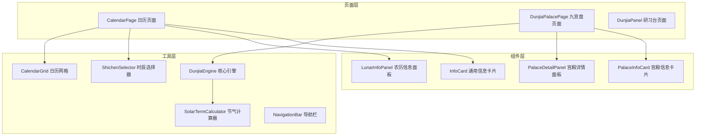
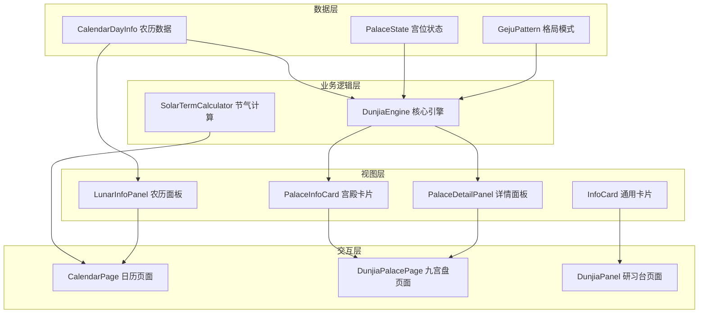
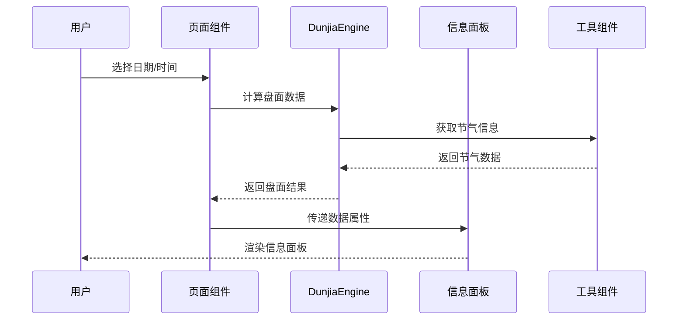
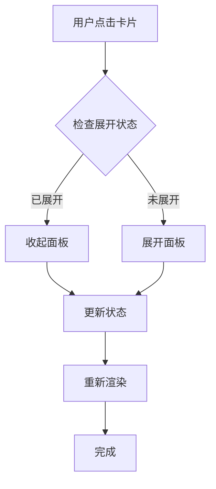
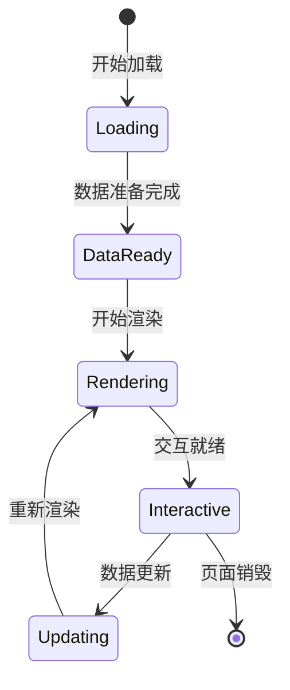
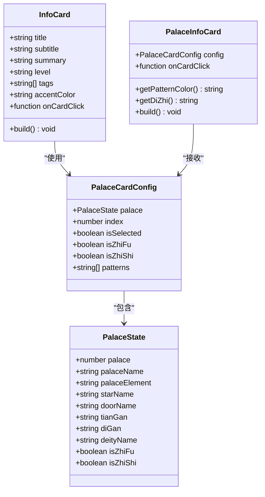
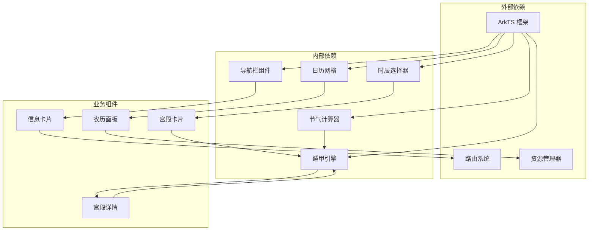

# 信息面板组件

<cite>
**本文档引用的文件**
- [InfoCard.ets](file://entry/src/main/ets/components/InfoCard.ets)
- [LunarInfoPanel.ets](file://entry/src/main/ets/components/LunarInfoPanel.ets)
- [PalaceInfoCard.ets](file://entry/src/main/ets/components/PalaceInfoCard.ets)
- [PalaceDetailPanel.ets](file://entry/src/main/ets/components/PalaceDetailPanel.ets)
- [DunjiaEngine.ets](file://entry/src/main/ets/utils/DunjiaEngine.ets)
- [SolarTermCalculator.ets](file://entry/src/main/ets/utils/SolarTermCalculator.ets)
- [DunjiaPalacePage.ets](file://entry/src/main/ets/pages/DunjiaPalacePage.ets)
- [Calendar.ets](file://entry/src/main/ets/pages/Calendar.ets)
- [NavigationBar.ets](file://entry/src/main/ets/components/NavigationBar.ets)
- [CalendarGrid.ets](file://entry/src/main/ets/components/CalendarGrid.ets)
- [ShichenSelector.ets](file://entry/src/main/ets/components/ShichenSelector.ets)
- [DunjiaPanel.ets](file://entry/src/main/ets/pages/DunjiaPanel.ets)
</cite>

## 目录
1. [简介](#简介)
2. [项目结构](#项目结构)
3. [核心组件](#核心组件)
4. [架构概览](#架构概览)
5. [详细组件分析](#详细组件分析)
6. [依赖关系分析](#依赖关系分析)
7. [性能考虑](#性能考虑)
8. [故障排除指南](#故障排除指南)
9. [结论](#结论)
10. [附录](#附录)

## 简介

信息面板组件是遁甲应用中的核心展示模块，负责以直观、美观的方式呈现各类信息内容。该组件系统包含三个主要面板：通用信息卡片、农历信息面板和宫殿信息卡片，以及配套的详情面板组件。

这些组件采用统一的设计语言和交互模式，支持响应式布局、无障碍访问和动态内容更新。通过精心设计的视觉层次和色彩编码系统，为用户提供清晰的信息浏览体验。

## 项目结构

信息面板组件系统采用模块化的架构设计，主要分布在以下目录结构中：

**图表来源**
- [InfoCard.ets](file://entry/src/main/ets/components/InfoCard.ets#L1-L114)
- [LunarInfoPanel.ets](file://entry/src/main/ets/components/LunarInfoPanel.ets#L1-L142)
- [PalaceInfoCard.ets](file://entry/src/main/ets/components/PalaceInfoCard.ets#L1-L179)
- [PalaceDetailPanel.ets](file://entry/src/main/ets/components/PalaceDetailPanel.ets#L1-L481)

**章节来源**
- [DunjiaPalacePage.ets](file://entry/src/main/ets/pages/DunjiaPalacePage.ets#L1-L800)
- [Calendar.ets](file://entry/src/main/ets/pages/Calendar.ets#L1-L602)

## 核心组件

### 通用信息卡片 (InfoCard)

InfoCard 是最基础的信息展示组件，提供统一的卡片样式和交互模式。其设计理念是通过简洁的视觉层次传达核心信息。

**核心特性：**
- 标题、副标题、摘要的层级化展示
- 等级标签的颜色编码系统
- 动态标签列表的灵活布局
- 统一的阴影和边框效果
- 点击事件的可扩展性

**视觉设计要点：**
- 使用渐变的色彩系统：主色调 #D4A574，背景色 #ffffff
- 字体大小递减：主标题 16px，副标题 13px，摘要 13px
- 边距和内边距的精心计算，确保视觉平衡
- 圆角设计和阴影效果增强立体感

**章节来源**
- [InfoCard.ets](file://entry/src/main/ets/components/InfoCard.ets#L1-L114)

### 农历信息面板 (LunarInfoPanel)

LunarInfoPanel 专门用于展示农历相关信息，整合了传统历法的重要元素。

**核心功能：**
- 农历年月日的优雅展示
- 生肖信息的清晰标注
- 四柱八字的详细展示
- 节气和节日信息的智能显示
- 交节时刻的精确计算

**数据处理机制：**
- 农历日期转换：支持 1-12 月的中文表示
- 节气时间格式化：精确到分钟的时间显示
- 八字信息的结构化展示

**章节来源**
- [LunarInfoPanel.ets](file://entry/src/main/ets/components/LunarInfoPanel.ets#L1-L142)

### 宫殿信息卡片 (PalaceInfoCard)

PalaceInfoCard 是九宫盘的核心展示组件，承载着遁甲术数的复杂信息。

**设计特色：**
- 九宫格的精确布局（32%宽度，115高度）
- 值符值使的视觉标识系统
- 格局徽章的颜色编码（天遁、地遁、人遁）
- 选中状态的动态反馈

**颜色编码系统：**
- 天遁：#FF6B35（红色系）
- 地遁：#D4A574（棕色系）
- 人遁：#4A90E2（蓝色系）
- 默认：#4A90E2（蓝色系）

**章节来源**
- [PalaceInfoCard.ets](file://entry/src/main/ets/components/PalaceInfoCard.ets#L1-L179)

### 宫殿详情面板 (PalaceDetailPanel)

PalaceDetailPanel 提供详细的遁甲知识解读，基于《遁甲符应经》的权威内容。

**内容组织：**
- 基本信息区块：宫位、五行、九星、八门等
- 五行生克关系：详细的相生相克分析
- 九星断语：每颗星的详细解读
- 八门吉凶：门的分类和应用指导
- 特殊标识：值符值使的特殊说明
- 相关格局：识别和解释各种格局

**知识体系：**
- 九星断语：包含宜忌事项和季节旺衰
- 八门分类：吉门、凶门、中平门的明确区分
- 格局识别：三奇得使、三遁等重要格局

**章节来源**
- [PalaceDetailPanel.ets](file://entry/src/main/ets/components/PalaceDetailPanel.ets#L1-L481)

## 架构概览

信息面板组件系统采用分层架构，确保各组件间的松耦合和高内聚。

**图表来源**
- [DunjiaEngine.ets](file://entry/src/main/ets/utils/DunjiaEngine.ets#L1-L961)
- [SolarTermCalculator.ets](file://entry/src/main/ets/utils/SolarTermCalculator.ets#L1-L375)
- [Calendar.ets](file://entry/src/main/ets/pages/Calendar.ets#L1-L602)

## 详细组件分析

### 数据流分析

信息面板组件的数据流遵循单向数据绑定原则，确保数据的一致性和可预测性。

**图表来源**
- [DunjiaPalacePage.ets](file://entry/src/main/ets/pages/DunjiaPalacePage.ets#L218-L236)
- [DunjiaEngine.ets](file://entry/src/main/ets/utils/DunjiaEngine.ets#L113-L162)

### 交互流程分析

#### 点击展开交互

#### 信息更新流程

**章节来源**
- [PalaceInfoCard.ets](file://entry/src/main/ets/components/PalaceInfoCard.ets#L172-L177)
- [LunarInfoPanel.ets](file://entry/src/main/ets/components/LunarInfoPanel.ets#L41-L127)

### 组件间通信机制

信息面板组件通过 props 和事件系统实现松耦合的通信。

**图表来源**
- [InfoCard.ets](file://entry/src/main/ets/components/InfoCard.ets#L24-L35)
- [PalaceInfoCard.ets](file://entry/src/main/ets/components/PalaceInfoCard.ets#L13-L25)
- [DunjiaEngine.ets](file://entry/src/main/ets/utils/DunjiaEngine.ets#L30-L41)

**章节来源**
- [DunjiaEngine.ets](file://entry/src/main/ets/utils/DunjiaEngine.ets#L59-L84)

## 依赖关系分析

信息面板组件系统具有清晰的依赖层次，确保系统的可维护性和可扩展性。

**图表来源**
- [DunjiaPalacePage.ets](file://entry/src/main/ets/pages/DunjiaPalacePage.ets#L1-L800)
- [Calendar.ets](file://entry/src/main/ets/pages/Calendar.ets#L1-L602)

**章节来源**
- [DunjiaEngine.ets](file://entry/src/main/ets/utils/DunjiaEngine.ets#L1-L961)

## 性能考虑

信息面板组件系统在设计时充分考虑了性能优化，采用多种策略确保流畅的用户体验。

### 缓存策略

**节气数据缓存：**
- SolarTermCalculator 实现了基于年份的缓存机制
- 避免重复计算相同年份的24节气数据
- 支持预加载指定年份范围的数据

**盘面数据缓存：**
- DunjiaEngine 对计算结果进行缓存
- 避免重复的遁甲盘面计算
- 支持缓存清理和更新

### 渲染优化

**虚拟滚动：**
- 长列表采用虚拟滚动技术
- 减少DOM节点数量
- 提升滚动性能

**懒加载机制：**
- 非关键路径组件延迟加载
- 减少初始渲染时间
- 优化内存使用

**章节来源**
- [SolarTermCalculator.ets](file://entry/src/main/ets/utils/SolarTermCalculator.ets#L30-L86)
- [DunjiaEngine.ets](file://entry/src/main/ets/utils/DunjiaEngine.ets#L98-L108)

## 故障排除指南

### 常见问题及解决方案

**数据加载失败**
- 检查网络连接状态
- 验证数据源可用性
- 实现重试机制和错误提示

**渲染异常**
- 检查props数据类型
- 验证组件状态更新
- 使用开发者工具调试

**性能问题**
- 分析组件渲染频率
- 优化不必要的重渲染
- 实施适当的缓存策略

### 调试技巧

**日志记录：**
- 在关键节点添加日志
- 记录数据流变化
- 监控性能指标

**断点调试：**
- 使用IDE断点调试
- 检查组件生命周期
- 分析状态变化

**章节来源**
- [DunjiaPalacePage.ets](file://entry/src/main/ets/pages/DunjiaPalacePage.ets#L218-L236)
- [Calendar.ets](file://entry/src/main/ets/pages/Calendar.ets#L250-L257)

## 结论

信息面板组件系统通过精心设计的架构和实现，成功构建了一个功能丰富、性能优异的信息展示平台。该系统不仅满足了遁甲应用的专业需求，还提供了良好的用户体验和可维护性。

**主要成就：**
- 统一的设计语言和交互模式
- 高效的数据处理和缓存机制
- 灵活的组件扩展能力
- 完善的错误处理和性能优化

**未来发展方向：**
- 进一步优化移动端性能
- 增强无障碍访问支持
- 扩展更多信息展示形式
- 提升个性化定制能力

## 附录

### 响应式布局实现

信息面板组件系统采用灵活的响应式设计，适配不同屏幕尺寸和设备类型。

**断点设计：**
- 移动端：单列布局，卡片宽度 90%
- 平板端：两列布局，卡片宽度 45%
- 桌面端：三列布局，卡片宽度 32%

**弹性布局：**
- 使用 Flexbox 实现自适应排列
- Grid 布局支持复杂的网格需求
- 媒体查询适配不同屏幕尺寸

### 无障碍访问支持

系统实现了全面的无障碍访问功能，确保所有用户都能有效使用。

**键盘导航：**
- 支持 Tab 键导航
- 键盘快捷键操作
- 焦点管理

**屏幕阅读器支持：**
- 语义化HTML结构
- 适当的ARIA属性
- 语音提示

**章节来源**
- [NavigationBar.ets](file://entry/src/main/ets/components/NavigationBar.ets#L1-L86)
- [CalendarGrid.ets](file://entry/src/main/ets/components/CalendarGrid.ets#L57-L90)