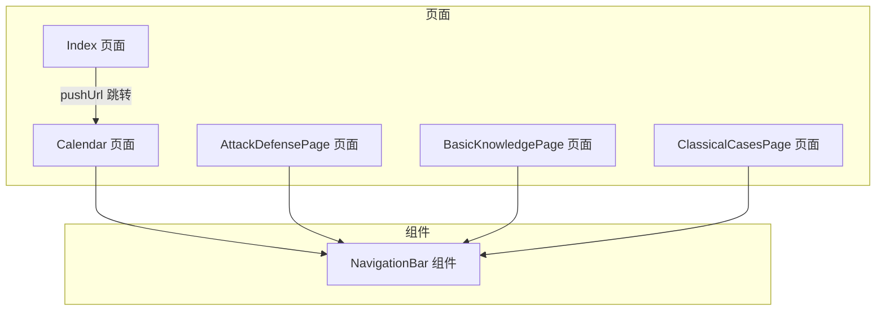
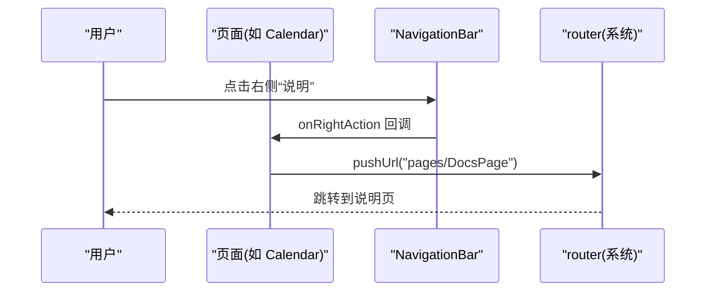
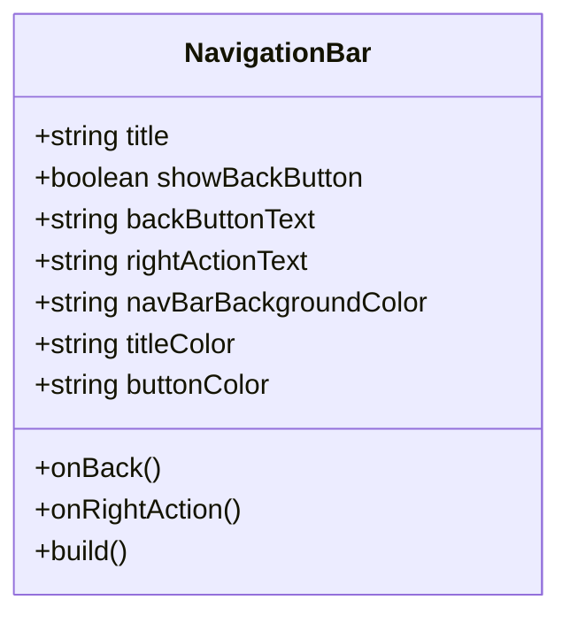
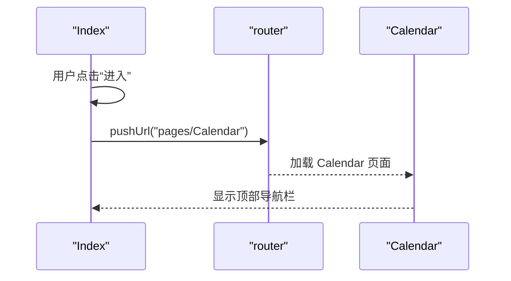
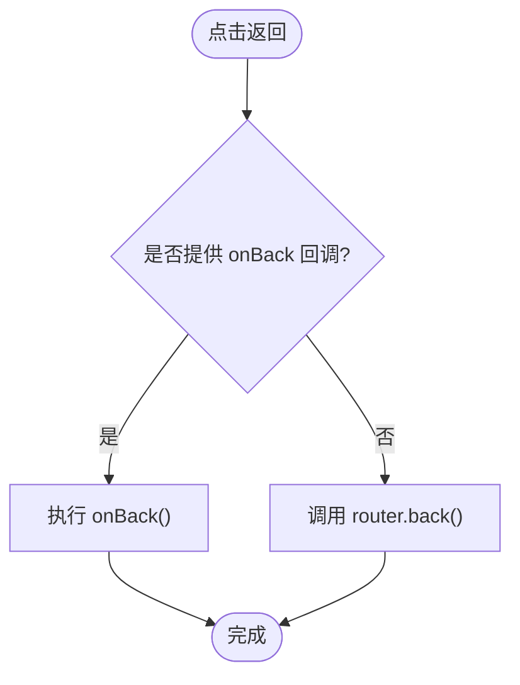
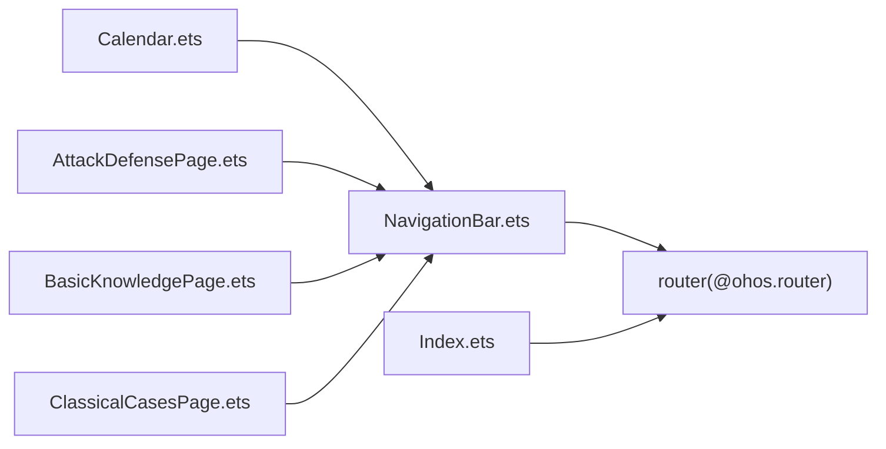

# 导航组件

<cite>
**本文引用的文件**
- [NavigationBar.ets](file://entry/src/main/ets/components/NavigationBar.ets)
- [Index.ets](file://entry/src/main/ets/pages/Index.ets)
- [Calendar.ets](file://entry/src/main/ets/pages/Calendar.ets)
- [AttackDefensePage.ets](file://entry/src/main/ets/pages/AttackDefensePage.ets)
- [BasicKnowledgePage.ets](file://entry/src/main/ets/pages/BasicKnowledgePage.ets)
- [ClassicalCasesPage.ets](file://entry/src/main/ets/pages/ClassicalCasesPage.ets)
- [module.json5](file://entry/src/main/module.json5)
- [color.json(浅色)](file://entry/src/main/resources/base/element/color.json)
- [color.json(深色)](file://entry/src/main/resources/dark/element/color.json)
</cite>

## 目录
1. [简介](#简介)
2. [项目结构](#项目结构)
3. [核心组件](#核心组件)
4. [架构总览](#架构总览)
5. [详细组件分析](#详细组件分析)
6. [依赖关系分析](#依赖关系分析)
7. [性能考量](#性能考量)
8. [故障排查指南](#故障排查指南)
9. [结论](#结论)
10. [附录](#附录)

## 简介
本文件系统性梳理导航栏组件的设计与实现，覆盖状态管理（当前页面标识、路由跳转、返回栈维护）、样式定制与主题适配、与主页面 Index 的集成与数据绑定、导航事件处理流程与错误恢复策略，以及移动端与多设备场景下的适配方案，并总结组件的扩展性与可定制性。

## 项目结构
导航组件位于组件目录，页面通过导入该组件并在各自 build 中组合使用；Index 作为入口页面负责发起路由跳转；其他页面在顶部统一挂载导航栏以形成一致的交互体验。

**图表来源**
- [Index.ets](file://entry/src/main/ets/pages/Index.ets#L6-L14)
- [Calendar.ets](file://entry/src/main/ets/pages/Calendar.ets#L306-L318)
- [AttackDefensePage.ets](file://entry/src/main/ets/pages/AttackDefensePage.ets#L257-L259)
- [BasicKnowledgePage.ets](file://entry/src/main/ets/pages/BasicKnowledgePage.ets#L730-L733)
- [ClassicalCasesPage.ets](file://entry/src/main/ets/pages/ClassicalCasesPage.ets#L593-L595)

**章节来源**
- [Index.ets](file://entry/src/main/ets/pages/Index.ets#L1-L88)
- [NavigationBar.ets](file://entry/src/main/ets/components/NavigationBar.ets#L1-L86)

## 核心组件
- 导航栏组件提供统一的顶部导航条，支持自定义标题、返回按钮显隐与文本、右侧操作按钮及颜色主题参数；默认回退行为由内置 router.back 提供，也可通过回调覆盖。
- 页面通过 router.pushUrl 发起跳转，Calendar 页面在导航栏右侧“说明”按钮处触发跳转到说明页；Index 页面负责引导进入日历页。

**章节来源**
- [NavigationBar.ets](file://entry/src/main/ets/components/NavigationBar.ets#L22-L86)
- [Index.ets](file://entry/src/main/ets/pages/Index.ets#L6-L14)
- [Calendar.ets](file://entry/src/main/ets/pages/Calendar.ets#L313-L317)

## 架构总览
导航组件采用“页面内嵌组件”的轻量架构：页面仅负责业务渲染与路由控制，导航栏专注 UI 呈现与交互事件分发。返回栈由系统路由管理，导航栏提供便捷的回退入口。

**图表来源**
- [Calendar.ets](file://entry/src/main/ets/pages/Calendar.ets#L313-L317)

## 详细组件分析

### 导航栏组件设计与实现
- 结构组成：左侧返回按钮、中间标题、右侧操作按钮，底部分割线。
- 属性与行为：
  - 标题与按钮文本可配置
  - 返回按钮可隐藏或自定义文本
  - 右侧按钮文本为空时不渲染
  - 默认回退：未提供 onBack 时使用 router.back
  - 主题参数：背景色、标题色、按钮色
- 事件处理：点击回调优先使用传入的 onBack/onRightAction，否则执行默认行为。

**图表来源**
- [NavigationBar.ets](file://entry/src/main/ets/components/NavigationBar.ets#L22-L86)

**章节来源**
- [NavigationBar.ets](file://entry/src/main/ets/components/NavigationBar.ets#L22-L86)

### 页面与导航栏的集成
- Index：作为入口页，提供“进入”与“协议/隐私”跳转，点击后通过 router.pushUrl 跳转到 Calendar。
- Calendar：顶部集成 NavigationBar，右侧“说明”按钮跳转到 DocsPage；内部还存在多处“说明”文字点击跳转。
- 其他页面：AttackDefensePage、BasicKnowledgePage、ClassicalCasesPage 在顶部直接使用 NavigationBar，不带右侧按钮。

**图表来源**
- [Index.ets](file://entry/src/main/ets/pages/Index.ets#L6-L14)
- [Calendar.ets](file://entry/src/main/ets/pages/Calendar.ets#L306-L318)

**章节来源**
- [Index.ets](file://entry/src/main/ets/pages/Index.ets#L6-L14)
- [Calendar.ets](file://entry/src/main/ets/pages/Calendar.ets#L306-L318)
- [AttackDefensePage.ets](file://entry/src/main/ets/pages/AttackDefensePage.ets#L257-L259)
- [BasicKnowledgePage.ets](file://entry/src/main/ets/pages/BasicKnowledgePage.ets#L730-L733)
- [ClassicalCasesPage.ets](file://entry/src/main/ets/pages/ClassicalCasesPage.ets#L593-L595)

### 状态管理与路由控制
- 当前页面标识：通过页面自身状态（如 Calendar 中的日期选择、时辰选择等）表达当前视图状态，导航栏本身不持有页面状态。
- 路由跳转：页面通过 router.pushUrl 发起新页面加载；导航栏右侧按钮可触发额外跳转。
- 返回栈维护：返回按钮默认调用 router.back，交由系统维护历史栈；若需自定义回退逻辑，可在 onBack 中实现。

**图表来源**
- [NavigationBar.ets](file://entry/src/main/ets/components/NavigationBar.ets#L43-L48)

**章节来源**
- [NavigationBar.ets](file://entry/src/main/ets/components/NavigationBar.ets#L43-L48)

### 样式定制与主题适配
- 组件级主题参数：背景色、标题色、按钮色，便于在不同页面快速切换风格。
- 页面级主题：通过资源目录中的浅色/深色 color.json 实现全局主题切换，影响整体 UI 色彩（如背景、文字等），导航栏背景色可按需调整以匹配主题。
- 设备类型：module.json5 声明 deviceTypes 包含 phone，确保导航组件在手机端正常渲染。

**章节来源**
- [NavigationBar.ets](file://entry/src/main/ets/components/NavigationBar.ets#L28-L30)
- [color.json(浅色)](file://entry/src/main/resources/base/element/color.json#L1-L8)
- [color.json(深色)](file://entry/src/main/resources/dark/element/color.json#L1-L8)
- [module.json5](file://entry/src/main/module.json5#L7-L9)

### 数据绑定与事件处理
- 导航栏不直接绑定页面数据，但可通过 props 接收标题与按钮文案，实现从父页面向导航栏注入内容。
- 点击事件通过回调传递给父页面，由父页面决定具体行为（如跳转、保存、关闭对话框等）。

**章节来源**
- [NavigationBar.ets](file://entry/src/main/ets/components/NavigationBar.ets#L24-L33)

### 错误恢复策略
- 回退失败兜底：当 onBack 未提供或回调异常时，组件仍可调用 router.back，避免无响应。
- 跳转失败处理：页面侧应确保目标页面 URL 正确且已注册；若跳转失败，建议在父页面捕获异常并提示用户或回退至上一页。
- 无右侧按钮保护：当 rightActionText 为空时，不渲染按钮，避免误触。

**章节来源**
- [NavigationBar.ets](file://entry/src/main/ets/components/NavigationBar.ets#L64-L76)

### 移动端与多设备适配
- 设备类型：module.json5 指定为 phone，导航栏布局与字体大小适配移动端触摸交互。
- 响应式布局：导航栏使用 Row 容器与居中对齐，配合 padding 与宽度设置，保证在不同屏幕尺寸下保持一致的视觉与交互体验。

**章节来源**
- [module.json5](file://entry/src/main/module.json5#L7-L9)
- [NavigationBar.ets](file://entry/src/main/ets/components/NavigationBar.ets#L77-L83)

### 扩展性与可定制性
- 可扩展点：
  - 新增按钮位置：可在现有左右两侧基础上扩展中间区域或新增右侧按钮组。
  - 自定义样式：通过 props 增加更多主题参数（如边框、圆角、阴影等）。
  - 行为扩展：onBack/onRightAction 支持任意复杂逻辑（如二次确认、数据校验、埋点上报等）。
- 可复用性：所有页面统一引入 NavigationBar，减少重复代码，提升一致性与可维护性。

**章节来源**
- [NavigationBar.ets](file://entry/src/main/ets/components/NavigationBar.ets#L22-L33)

## 依赖关系分析
- 组件依赖：NavigationBar 依赖系统 router 模块用于默认回退；页面依赖 NavigationBar 与 router 进行导航。
- 文件耦合：页面与导航栏通过 props 与回调解耦，降低耦合度，便于独立演进。

**图表来源**
- [NavigationBar.ets](file://entry/src/main/ets/components/NavigationBar.ets#L1)
- [Index.ets](file://entry/src/main/ets/pages/Index.ets#L1)
- [Calendar.ets](file://entry/src/main/ets/pages/Calendar.ets#L4)
- [AttackDefensePage.ets](file://entry/src/main/ets/pages/AttackDefensePage.ets#L1)
- [BasicKnowledgePage.ets](file://entry/src/main/ets/pages/BasicKnowledgePage.ets#L1)
- [ClassicalCasesPage.ets](file://entry/src/main/ets/pages/ClassicalCasesPage.ets#L1)

**章节来源**
- [NavigationBar.ets](file://entry/src/main/ets/components/NavigationBar.ets#L1)
- [Index.ets](file://entry/src/main/ets/pages/Index.ets#L1)
- [Calendar.ets](file://entry/src/main/ets/pages/Calendar.ets#L4)
- [AttackDefensePage.ets](file://entry/src/main/ets/pages/AttackDefensePage.ets#L1)
- [BasicKnowledgePage.ets](file://entry/src/main/ets/pages/BasicKnowledgePage.ets#L1)
- [ClassicalCasesPage.ets](file://entry/src/main/ets/pages/ClassicalCasesPage.ets#L1)

## 性能考量
- 渲染开销：导航栏为轻量结构，仅包含少量文本与容器，渲染成本低。
- 事件处理：点击事件仅做回调转发，避免在组件内进行重型计算。
- 主题切换：通过资源文件切换主题色，无需在运行时频繁修改样式属性，降低重绘成本。

## 故障排查指南
- 症状：点击返回无响应
  - 检查是否提供了 onBack 回调；若未提供，确认 router 是否可用。
- 症状：跳转到目标页面失败
  - 检查目标 URL 是否正确；确认页面已在模块配置中注册。
- 症状：右侧按钮不显示
  - 确认 rightActionText 是否为空；为空时组件不会渲染按钮。
- 症状：主题色不生效
  - 检查资源目录中的浅色/深色 color.json 是否正确配置；确认页面背景与导航栏背景色协调。

**章节来源**
- [NavigationBar.ets](file://entry/src/main/ets/components/NavigationBar.ets#L64-L76)
- [Index.ets](file://entry/src/main/ets/pages/Index.ets#L6-L14)
- [Calendar.ets](file://entry/src/main/ets/pages/Calendar.ets#L313-L317)

## 结论
导航栏组件以简洁的 API 和明确的职责边界，实现了跨页面的一致导航体验。其与页面的松耦合设计、对系统路由的良好集成、以及可扩展的主题与行为接口，使其具备良好的可维护性与可定制性。结合移动端设备类型声明与资源主题配置，能够稳定适配多设备场景。

## 附录
- 关键实现路径参考：
  - 导航栏组件定义与事件处理：[NavigationBar.ets](file://entry/src/main/ets/components/NavigationBar.ets#L22-L86)
  - 入口页面跳转逻辑：[Index.ets](file://entry/src/main/ets/pages/Index.ets#L6-L14)
  - 页面顶部导航栏集成示例：[Calendar.ets](file://entry/src/main/ets/pages/Calendar.ets#L306-L318)、[AttackDefensePage.ets](file://entry/src/main/ets/pages/AttackDefensePage.ets#L257-L259)、[BasicKnowledgePage.ets](file://entry/src/main/ets/pages/BasicKnowledgePage.ets#L730-L733)、[ClassicalCasesPage.ets](file://entry/src/main/ets/pages/ClassicalCasesPage.ets#L593-L595)
  - 主题资源文件：[color.json(浅色)](file://entry/src/main/resources/base/element/color.json#L1-L8)、[color.json(深色)](file://entry/src/main/resources/dark/element/color.json#L1-L8)
  - 设备类型声明：[module.json5](file://entry/src/main/module.json5#L7-L9)