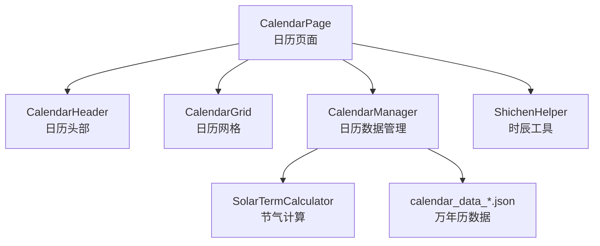
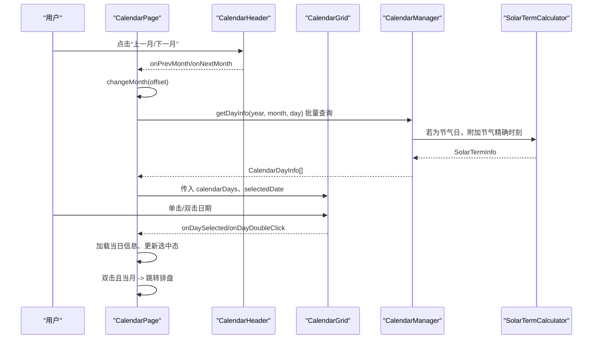
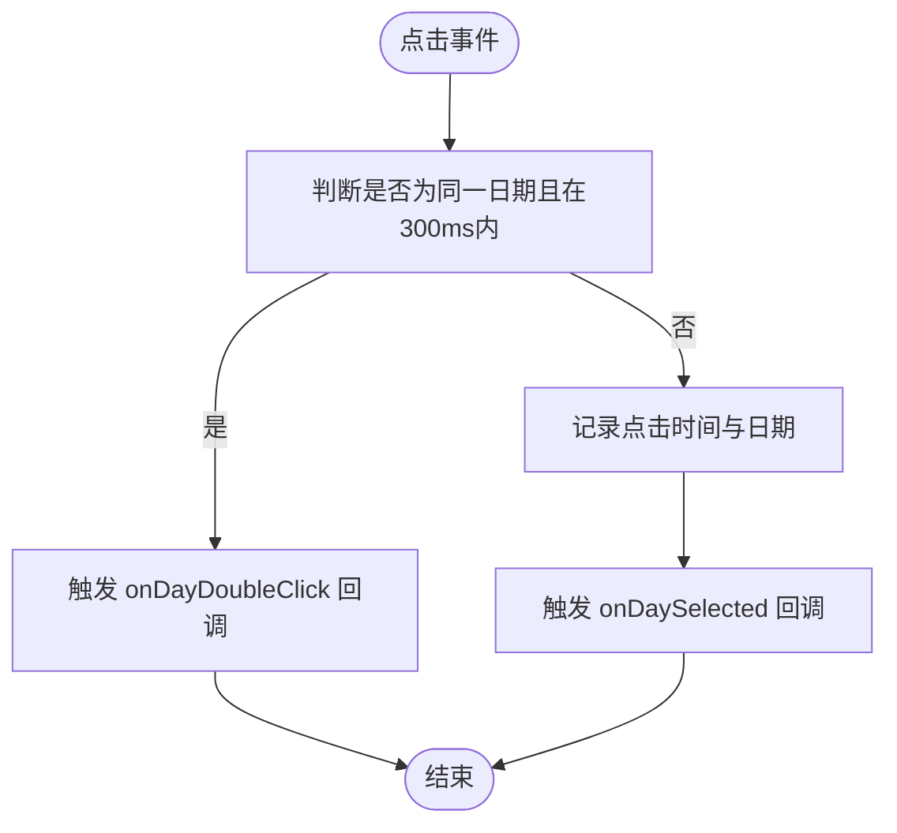
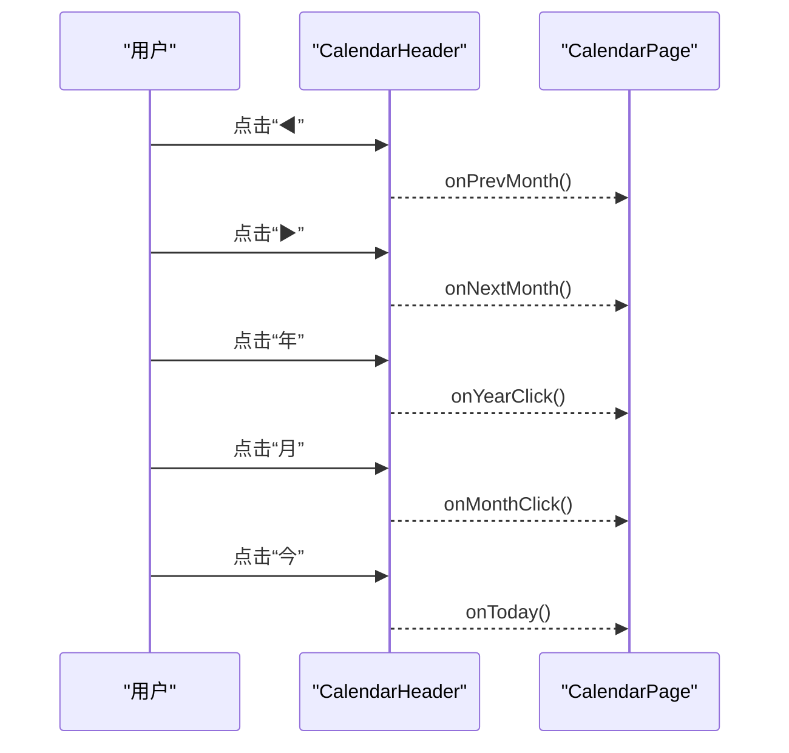
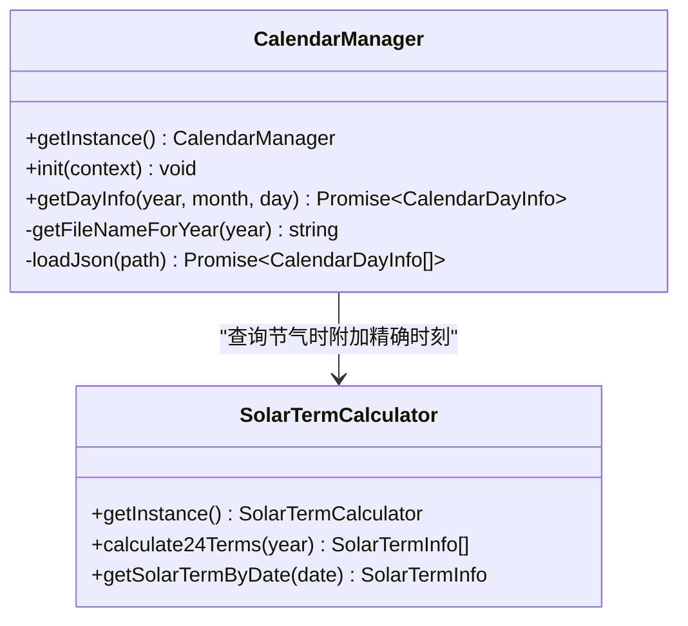
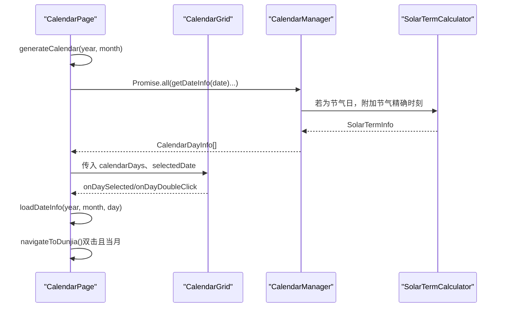
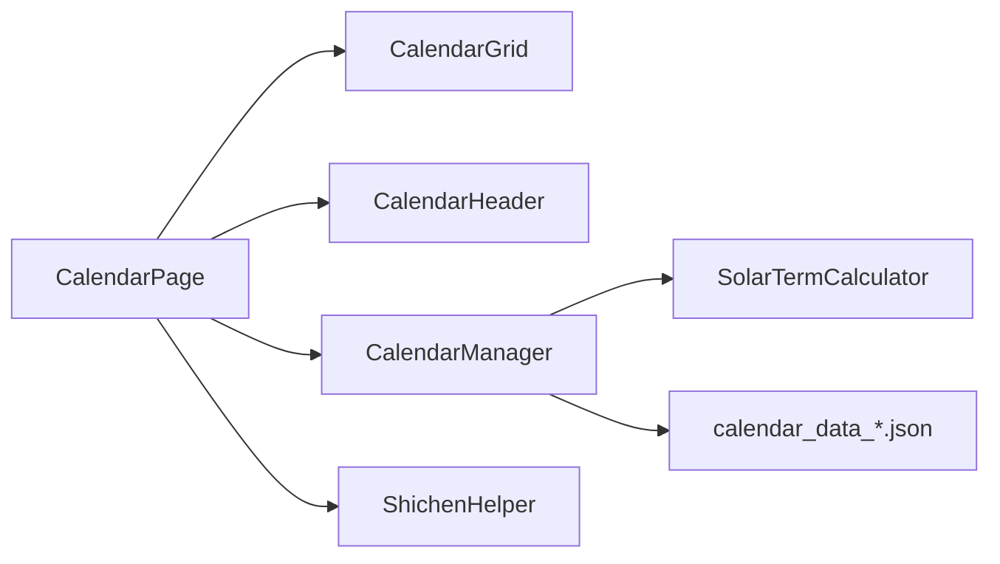

# 日历组件

<cite>
**本文引用的文件**
- [CalendarGrid.ets](file://entry/src/main/ets/components/CalendarGrid.ets)
- [CalendarHeader.ets](file://entry/src/main/ets/components/CalendarHeader.ets)
- [CalendarManager.ets](file://entry/src/main/ets/utils/CalendarManager.ets)
- [Calendar.ets](file://entry/src/main/ets/pages/Calendar.ets)
- [SolarTermCalculator.ets](file://entry/src/main/ets/utils/SolarTermCalculator.ets)
- [ShichenHelper.ets](file://entry/src/main/ets/utils/ShichenHelper.ets)
- [calendar_data_0001.json](file://entry/src/main/resources/rawfile/calendar/calendar_data_0001.json)
- [calendar_data.md](file://entry/src/main/resources/rawfile/calendar/calendar_data.md)
</cite>

## 目录
1. [简介](#简介)
2. [项目结构](#项目结构)
3. [核心组件](#核心组件)
4. [架构总览](#架构总览)
5. [详细组件分析](#详细组件分析)
6. [依赖关系分析](#依赖关系分析)
7. [性能考量](#性能考量)
8. [故障排查指南](#故障排查指南)
9. [结论](#结论)
10. [附录](#附录)

## 简介
本文件面向“遁甲符应经”项目中的日历组件，系统性梳理日历网格组件与日历头部组件的功能特性、渲染逻辑、交互流程与与日历管理器的协作关系。重点覆盖：
- 日历网格的日期计算、农历显示、节气标注、节日标记
- 双击事件处理机制与日期选择交互流程
- 日历头部的月份切换与导航功能
- 组件配置项与样式定制方法
- 多语言支持与本地化适配策略

## 项目结构
日历组件由页面页（CalendarPage）、日历网格组件（CalendarGrid）、日历头部组件（CalendarHeader），以及日历管理器（CalendarManager）等组成；同时配合节气计算器（SolarTermCalculator）与时辰工具（ShichenHelper）完成节气与排盘相关的数据支撑。

图表来源
- [Calendar.ets](file://entry/src/main/ets/pages/Calendar.ets#L1-L602)
- [CalendarGrid.ets](file://entry/src/main/ets/components/CalendarGrid.ets#L1-L167)
- [CalendarHeader.ets](file://entry/src/main/ets/components/CalendarHeader.ets#L1-L108)
- [CalendarManager.ets](file://entry/src/main/ets/utils/CalendarManager.ets#L1-L123)
- [SolarTermCalculator.ets](file://entry/src/main/ets/utils/SolarTermCalculator.ets#L1-L375)
- [ShichenHelper.ets](file://entry/src/main/ets/utils/ShichenHelper.ets#L1-L114)

章节来源
- [Calendar.ets](file://entry/src/main/ets/pages/Calendar.ets#L1-L602)

## 核心组件
- 日历网格组件（CalendarGrid）
  - 功能：渲染星期标题、6×7日期网格、当月/非当月日期区分、今日高亮、选中态高亮、节气/农历/节日标记、单击/双击事件处理
  - 关键接口：@Prop calendarDays、selectedDate；回调：onDaySelected、onDayDoubleClick
- 日历头部组件（CalendarHeader）
  - 功能：显示年月、上一月/下一月切换、返回今天、年/月点击触发选择器
  - 关键接口：@Prop year、month；回调：onPrevMonth、onNextMonth、onToday、onYearClick、onMonthClick
- 日历管理器（CalendarManager）
  - 功能：按年份加载对应万年历数据文件、缓存、查询某日详细信息、附加节气精确时刻
  - 关键接口：getDayInfo(year, month, day)、初始化init(context)
- 页面（CalendarPage）
  - 功能：生成日历数据、处理月份切换、日期选择与双击、加载当日信息、跳转排盘

章节来源
- [CalendarGrid.ets](file://entry/src/main/ets/components/CalendarGrid.ets#L1-L167)
- [CalendarHeader.ets](file://entry/src/main/ets/components/CalendarHeader.ets#L1-L108)
- [CalendarManager.ets](file://entry/src/main/ets/utils/CalendarManager.ets#L1-L123)
- [Calendar.ets](file://entry/src/main/ets/pages/Calendar.ets#L1-L602)

## 架构总览
日历页面作为控制中心，负责：
- 生成日历网格所需的数据（包含上月尾部、当月、下月开头）
- 绑定头部组件的月份切换回调
- 处理日期点击与双击事件，并在必要时跳转至排盘页面
- 通过日历管理器加载万年历数据，结合节气计算器与时辰工具提供节气与排盘信息

图表来源
- [Calendar.ets](file://entry/src/main/ets/pages/Calendar.ets#L184-L304)
- [CalendarGrid.ets](file://entry/src/main/ets/components/CalendarGrid.ets#L144-L164)
- [CalendarManager.ets](file://entry/src/main/ets/utils/CalendarManager.ets#L51-L92)
- [SolarTermCalculator.ets](file://entry/src/main/ets/utils/SolarTermCalculator.ets#L93-L115)

## 详细组件分析

### 日历网格组件（CalendarGrid）
- 数据模型
  - DayCell：包含公历日期、是否当月、完整日期对象、农历、节气、节日标记等
- 渲染逻辑
  - 星期标题行固定显示“周一～周日”
  - 6×7网格：上月尾部（非当月淡色）、当月日期（今日高亮、选中态高亮）、下月开头（非当月淡色）
  - 文字层级：公历日期（今日加粗/橙色，选中态背景高亮），节气优先显示（红色突出），否则显示农历（非当月灰色）
  - 节日标记：当月且有节日时，在右上角绘制小圆点
- 交互与事件
  - 单击：触发 onDaySelected 回调
  - 双击：触发 onDayDoubleClick 回调（仅当月有效）
  - 双击检测：同一日期、300ms内第二次点击视为双击
- 样式定制建议
  - 通过修改字体大小、颜色、边框、圆角等属性实现主题化
  - 选中态与今日态的颜色与边框可按品牌色调整

图表来源
- [CalendarGrid.ets](file://entry/src/main/ets/components/CalendarGrid.ets#L144-L164)

章节来源
- [CalendarGrid.ets](file://entry/src/main/ets/components/CalendarGrid.ets#L1-L167)

### 日历头部组件（CalendarHeader）
- 功能要点
  - 展示当前年份与月份，支持点击“年”“月”打开选择器
  - 提供“◀”“▶”切换上/下月，“今”回到今天
- 交互流程
  - 点击“◀”触发 onPrevMonth
  - 点击“▶”触发 onNextMonth
  - 点击“年”触发 onYearClick（由父页面实现年份选择器）
  - 点击“月”触发 onMonthClick（由父页面实现月份选择器）
  - 点击“今”触发 onToday（由父页面实现回到今天逻辑）

图表来源
- [CalendarHeader.ets](file://entry/src/main/ets/components/CalendarHeader.ets#L34-L106)
- [Calendar.ets](file://entry/src/main/ets/pages/Calendar.ets#L323-L341)

章节来源
- [CalendarHeader.ets](file://entry/src/main/ets/components/CalendarHeader.ets#L1-L108)
- [Calendar.ets](file://entry/src/main/ets/pages/Calendar.ets#L323-L341)

### 日历管理器（CalendarManager）
- 数据来源
  - 依据年份映射到 calendar_data_*.json 文件，按10年一组进行分档
  - 数据字段包含：公历年月日、农历、生肖、干支、星期、节假日、节气等
- 查询流程
  - 初始化时注入上下文
  - 按年份加载对应JSON文件并缓存
  - 查询某日信息：若为节气日，附加节气精确时刻（通过 SolarTermCalculator）
- 性能优化
  - 文件级缓存，避免重复读取
  - 节气精确时刻按需计算并附加

图表来源
- [CalendarManager.ets](file://entry/src/main/ets/utils/CalendarManager.ets#L30-L123)
- [SolarTermCalculator.ets](file://entry/src/main/ets/utils/SolarTermCalculator.ets#L30-L115)

章节来源
- [CalendarManager.ets](file://entry/src/main/ets/utils/CalendarManager.ets#L1-L123)
- [calendar_data.md](file://entry/src/main/resources/rawfile/calendar/calendar_data.md#L1-L17)
- [calendar_data_0001.json](file://entry/src/main/resources/rawfile/calendar/calendar_data_0001.json#L1-L200)

### 页面（CalendarPage）与组件协作
- 日历数据生成
  - 计算当月第一天与最后一天，确定首周偏移
  - 收集上月尾部、当月、下月开头的日期集合
  - 批量查询并组装 DayCell 数组（含农历、节气、节日标记）
- 交互处理
  - 单击：若点击非当月日期，先切换月份再更新选中态
  - 双击：仅当月日期才触发跳转排盘
  - 加载当日信息：更新节气、时辰选项与时柱
- 排盘跳转
  - 根据选中日期与所选时辰索引构造目标时间戳，传递至排盘页面

图表来源
- [Calendar.ets](file://entry/src/main/ets/pages/Calendar.ets#L46-L137)
- [Calendar.ets](file://entry/src/main/ets/pages/Calendar.ets#L228-L304)
- [CalendarManager.ets](file://entry/src/main/ets/utils/CalendarManager.ets#L51-L92)
- [SolarTermCalculator.ets](file://entry/src/main/ets/utils/SolarTermCalculator.ets#L93-L115)

章节来源
- [Calendar.ets](file://entry/src/main/ets/pages/Calendar.ets#L1-L602)

## 依赖关系分析
- 组件耦合
  - CalendarPage 依赖 CalendarGrid、CalendarHeader、CalendarManager、ShichenHelper
  - CalendarGrid 依赖 CalendarManager 提供的日期信息（通过 props 注入）
  - CalendarManager 依赖 SolarTermCalculator 提供节气精确时刻
- 外部依赖
  - JSON 数据文件按年份分档存储，通过资源管理器读取
  - 页面通过路由跳转至排盘页面

图表来源
- [Calendar.ets](file://entry/src/main/ets/pages/Calendar.ets#L1-L602)
- [CalendarGrid.ets](file://entry/src/main/ets/components/CalendarGrid.ets#L1-L167)
- [CalendarHeader.ets](file://entry/src/main/ets/components/CalendarHeader.ets#L1-L108)
- [CalendarManager.ets](file://entry/src/main/ets/utils/CalendarManager.ets#L1-L123)
- [SolarTermCalculator.ets](file://entry/src/main/ets/utils/SolarTermCalculator.ets#L1-L375)
- [ShichenHelper.ets](file://entry/src/main/ets/utils/ShichenHelper.ets#L1-L114)

章节来源
- [Calendar.ets](file://entry/src/main/ets/pages/Calendar.ets#L1-L602)

## 性能考量
- 数据批量查询
  - 一次性收集所有待查询日期，使用 Promise.all 并行请求，减少网络/IO等待
- 缓存策略
  - CalendarManager 对已加载的年份数据进行缓存，避免重复读取
  - SolarTermCalculator 对计算结果进行缓存，提高重复查询效率
- 渲染优化
  - 网格采用固定6×7布局，避免动态高度变化带来的重排
  - 非当月日期使用浅色，降低视觉复杂度

[本节为通用性能讨论，无需列出具体文件来源]

## 故障排查指南
- 无法加载日历数据
  - 检查 CalendarManager.init 是否正确传入上下文
  - 确认 calendar_data_*.json 文件路径与命名规则一致
- 节气显示异常
  - 确认 SolarTermCalculator 的年份范围与数据文件匹配
  - 检查节气精确时刻附加逻辑是否生效
- 交互无响应
  - 确认 CalendarGrid 的回调 onDaySelected/onDayDoubleClick 是否正确绑定
  - 检查双击检测阈值（默认300ms）是否过短或过长导致误判
- 选中态与今日态显示异常
  - 检查 selectedDate 与当前系统时间是否一致
  - 确认样式属性（颜色、边框、背景）是否被覆盖

章节来源
- [CalendarManager.ets](file://entry/src/main/ets/utils/CalendarManager.ets#L44-L92)
- [CalendarGrid.ets](file://entry/src/main/ets/components/CalendarGrid.ets#L43-L55)
- [CalendarGrid.ets](file://entry/src/main/ets/components/CalendarGrid.ets#L144-L164)

## 结论
日历组件通过清晰的职责划分与数据驱动渲染，实现了完整的日期网格展示、农历与节气标注、节日标记、双击快速排盘等核心能力。CalendarPage 作为控制中枢协调各组件与工具类，CalendarManager 提供稳定的数据支撑，SolarTermCalculator 与时辰工具保障节气与排盘信息的准确性。整体架构具备良好的扩展性与可维护性。

[本节为总结性内容，无需列出具体文件来源]

## 附录

### 组件配置与样式定制
- 日历网格（CalendarGrid）
  - Props：calendarDays（DayCell[]）、selectedDate（Date）
  - 回调：onDaySelected、onDayDoubleClick
  - 样式定制：通过字体大小、颜色、边框宽度与圆角等属性实现主题化
- 日历头部（CalendarHeader）
  - Props：year（number）、month（number）
  - 回调：onPrevMonth、onNextMonth、onToday、onYearClick、onMonthClick
  - 样式定制：年/月标签的背景色、边框、圆角与点击反馈可自定义
- 页面（CalendarPage）
  - 通过状态管理 selectedDate、currentYear、currentMonth 控制网格与头部
  - 可扩展添加多语言文案与本地化资源

章节来源
- [CalendarGrid.ets](file://entry/src/main/ets/components/CalendarGrid.ets#L30-L36)
- [CalendarHeader.ets](file://entry/src/main/ets/components/CalendarHeader.ets#L24-L32)
- [Calendar.ets](file://entry/src/main/ets/pages/Calendar.ets#L19-L30)

### 多语言支持与本地化适配
- 字符串资源
  - 项目中存在基础字符串资源文件，可用于多语言文案管理
- 本地化建议
  - 将固定文案（如“周一～周日”“返回今天”“进入历法推演”等）迁移至资源文件
  - 通过资源键替换硬编码字符串，便于后续国际化扩展
  - 日期格式与节气名称可根据地区习惯进行本地化处理

章节来源
- [string.json](file://entry/src/main/resources/base/element/string.json#L1-L16)