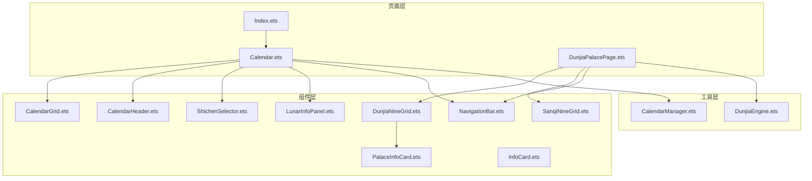
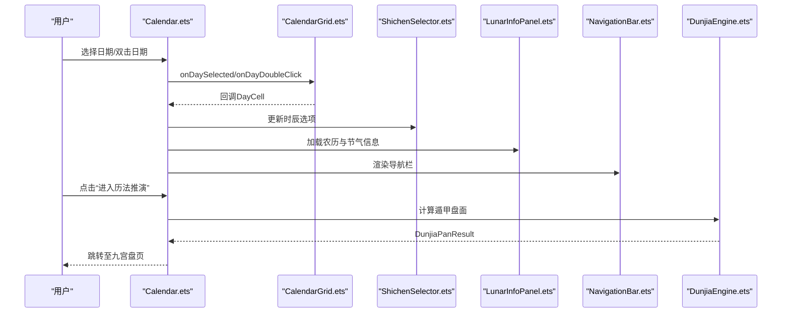
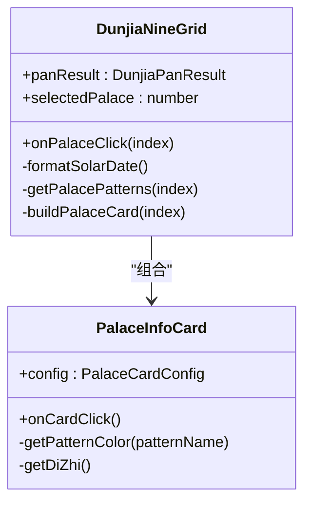
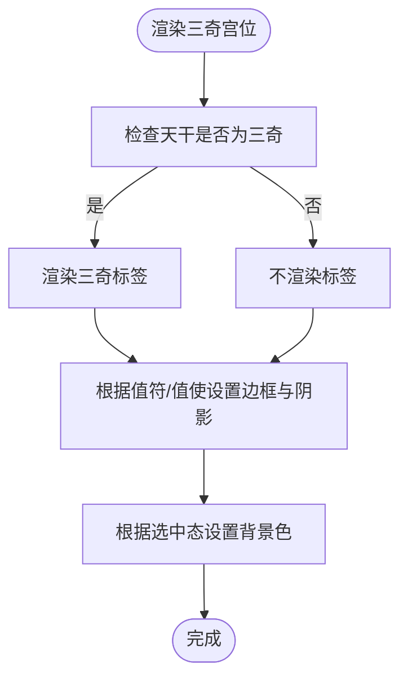
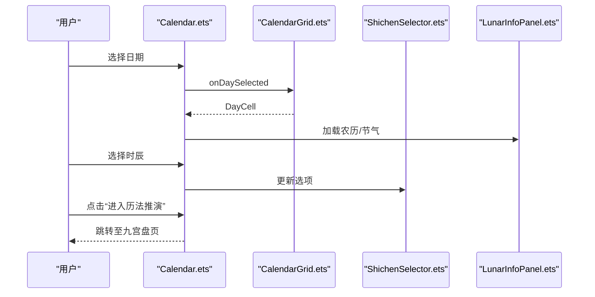
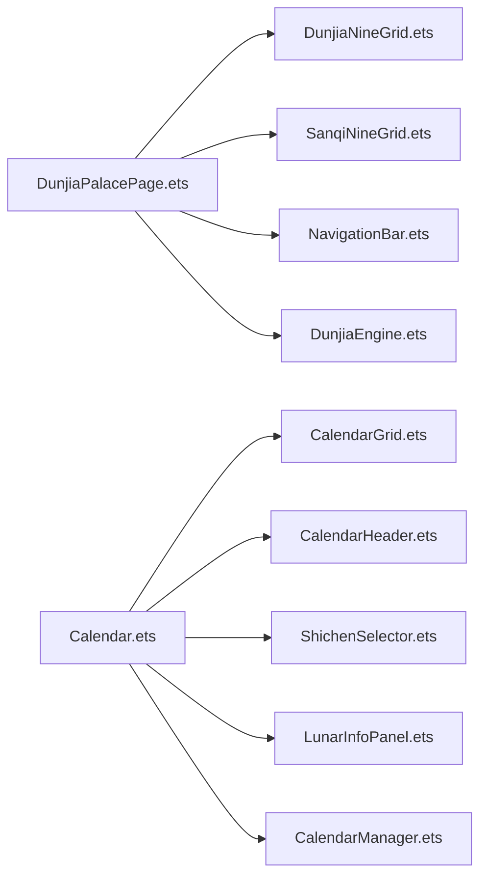

# 界面组件系统

<cite>
**本文档引用的文件**
- [DunjiaNineGrid.ets](file://entry/src/main/ets/components/DunjiaNineGrid.ets)
- [SanqiNineGrid.ets](file://entry/src/main/ets/components/SanqiNineGrid.ets)
- [PalaceInfoCard.ets](file://entry/src/main/ets/components/PalaceInfoCard.ets)
- [NavigationBar.ets](file://entry/src/main/ets/components/NavigationBar.ets)
- [InfoCard.ets](file://entry/src/main/ets/components/InfoCard.ets)
- [LunarInfoPanel.ets](file://entry/src/main/ets/components/LunarInfoPanel.ets)
- [CalendarGrid.ets](file://entry/src/main/ets/components/CalendarGrid.ets)
- [CalendarHeader.ets](file://entry/src/main/ets/components/CalendarHeader.ets)
- [ShichenSelector.ets](file://entry/src/main/ets/components/ShichenSelector.ets)
- [DunjiaEngine.ets](file://entry/src/main/ets/utils/DunjiaEngine.ets)
- [CalendarManager.ets](file://entry/src/main/ets/utils/CalendarManager.ets)
- [DunjiaPalacePage.ets](file://entry/src/main/ets/pages/DunjiaPalacePage.ets)
- [Calendar.ets](file://entry/src/main/ets/pages/Calendar.ets)
- [Index.ets](file://entry/src/main/ets/pages/Index.ets)
</cite>

## 目录
1. [简介](#简介)
2. [项目结构](#项目结构)
3. [核心组件](#核心组件)
4. [架构总览](#架构总览)
5. [详细组件分析](#详细组件分析)
6. [依赖分析](#依赖分析)
7. [性能考虑](#性能考虑)
8. [故障排查指南](#故障排查指南)
9. [结论](#结论)
10. [附录](#附录)

## 简介
本界面组件系统围绕“遁甲九宫”主题，提供从日历选择、真太阳时计算、宫位排盘到信息展示的完整交互链路。系统采用组件化设计，核心包括：
- 九宫格组件：遁甲九宫与三奇九宫两种布局形态，分别面向普通研习与择日应验场景
- 导航与信息面板：统一导航栏、农历信息面板、通用信息卡片
- 日历与选择器：日历网格、年月选择器、时辰选择器
- 数据与引擎：遁甲排盘引擎、日历数据管理器
- 页面组合：首页引导页、日历页、九宫盘页等页面对组件进行组合使用

## 项目结构
组件位于 entry/src/main/ets/components，页面位于 entry/src/main/ets/pages，工具类位于 entry/src/main/ets/utils。

图表来源
- [Index.ets](file://entry/src/main/ets/pages/Index.ets#L1-L88)
- [Calendar.ets](file://entry/src/main/ets/pages/Calendar.ets#L1-L602)
- [DunjiaPalacePage.ets](file://entry/src/main/ets/pages/DunjiaPalacePage.ets#L1-L1017)
- [DunjiaNineGrid.ets](file://entry/src/main/ets/components/DunjiaNineGrid.ets#L1-L179)
- [SanqiNineGrid.ets](file://entry/src/main/ets/components/SanqiNineGrid.ets#L1-L169)
- [PalaceInfoCard.ets](file://entry/src/main/ets/components/PalaceInfoCard.ets#L1-L179)
- [NavigationBar.ets](file://entry/src/main/ets/components/NavigationBar.ets#L1-L86)
- [CalendarGrid.ets](file://entry/src/main/ets/components/CalendarGrid.ets#L1-L167)
- [CalendarHeader.ets](file://entry/src/main/ets/components/CalendarHeader.ets#L1-L108)
- [ShichenSelector.ets](file://entry/src/main/ets/components/ShichenSelector.ets#L1-L133)
- [LunarInfoPanel.ets](file://entry/src/main/ets/components/LunarInfoPanel.ets#L1-L142)
- [InfoCard.ets](file://entry/src/main/ets/components/InfoCard.ets#L1-L114)
- [DunjiaEngine.ets](file://entry/src/main/ets/utils/DunjiaEngine.ets#L1-L961)
- [CalendarManager.ets](file://entry/src/main/ets/utils/CalendarManager.ets#L1-L123)

章节来源
- [Index.ets](file://entry/src/main/ets/pages/Index.ets#L1-L88)
- [Calendar.ets](file://entry/src/main/ets/pages/Calendar.ets#L1-L602)
- [DunjiaPalacePage.ets](file://entry/src/main/ets/pages/DunjiaPalacePage.ets#L1-L1017)

## 核心组件
- 九宫格组件
  - 遁甲九宫：展示完整九宫信息（九星、八门、天干地支、八神、值符值使、格局徽章），支持宫位点击与选中态
  - 三奇九宫：聚焦三奇（乙、丙、丁）与应验方位，突出三奇标识与值符值使边框阴影
- 导航栏组件：统一标题、返回按钮、右侧操作按钮，支持自定义颜色与文案
- 信息面板组件：农历信息面板展示农历年月日、生肖、八字、节气与节日信息
- 通用信息卡片：标题/副标题/摘要/等级标签/标签列表，支持点击事件
- 日历组件：日历网格（6×7）、星期标题、选中高亮、今日标记、双击快速进入
- 选择器组件：时辰选择器（展开网格4×3），解析时辰文本与干支范围
- 页面组合：首页引导、日历页（日期选择+真太阳时+农历信息+时辰选择）、九宫盘页（占断事类+用神指引+三奇象意）

章节来源
- [DunjiaNineGrid.ets](file://entry/src/main/ets/components/DunjiaNineGrid.ets#L1-L179)
- [SanqiNineGrid.ets](file://entry/src/main/ets/components/SanqiNineGrid.ets#L1-L169)
- [PalaceInfoCard.ets](file://entry/src/main/ets/components/PalaceInfoCard.ets#L1-L179)
- [NavigationBar.ets](file://entry/src/main/ets/components/NavigationBar.ets#L1-L86)
- [LunarInfoPanel.ets](file://entry/src/main/ets/components/LunarInfoPanel.ets#L1-L142)
- [InfoCard.ets](file://entry/src/main/ets/components/InfoCard.ets#L1-L114)
- [CalendarGrid.ets](file://entry/src/main/ets/components/CalendarGrid.ets#L1-L167)
- [ShichenSelector.ets](file://entry/src/main/ets/components/ShichenSelector.ets#L1-L133)

## 架构总览
系统采用“页面-组件-工具”的分层架构：
- 页面层负责状态管理与业务流程（路由、资源加载、规则筛选）
- 组件层负责UI渲染与交互（Props传参、事件回调）
- 工具层负责数据与算法（排盘引擎、日历数据、真太阳时计算）

图表来源
- [Calendar.ets](file://entry/src/main/ets/pages/Calendar.ets#L227-L304)
- [CalendarGrid.ets](file://entry/src/main/ets/components/CalendarGrid.ets#L144-L165)
- [ShichenSelector.ets](file://entry/src/main/ets/components/ShichenSelector.ets#L90-L131)
- [LunarInfoPanel.ets](file://entry/src/main/ets/components/LunarInfoPanel.ets#L41-L127)
- [NavigationBar.ets](file://entry/src/main/ets/components/NavigationBar.ets#L35-L84)
- [DunjiaEngine.ets](file://entry/src/main/ets/utils/DunjiaEngine.ets#L113-L162)

## 详细组件分析

### 九宫格组件（遁甲九宫）
- 设计目的：以传统方位布局（上南下北）展示九宫排盘，承载九星、八门、天干地支、八神、值符值使、格局徽章等信息
- 关键特性：
  - 时间与局数信息展示（阳历、农历、真太阳时偏移）
  - 格局徽章过滤与聚合（按宫位索引匹配）
  - 宫位卡片点击事件透传
- 实现要点：
  - 九宫布局按“巽4、离9、坤2；震3、中5、兑7；艮8、坎1、乾6”顺序渲染
  - 通过 PalaceInfoCard 组合渲染每个宫位
  - 选中态与值符值使态通过属性控制样式

图表来源
- [DunjiaNineGrid.ets](file://entry/src/main/ets/components/DunjiaNineGrid.ets#L24-L70)
- [PalaceInfoCard.ets](file://entry/src/main/ets/components/PalaceInfoCard.ets#L23-L50)

章节来源
- [DunjiaNineGrid.ets](file://entry/src/main/ets/components/DunjiaNineGrid.ets#L1-L179)
- [PalaceInfoCard.ets](file://entry/src/main/ets/components/PalaceInfoCard.ets#L1-L179)

### 九宫格组件（三奇九宫）
- 设计目的：聚焦三奇（乙、丙、丁）与应验方位，弱化八神与格局徽章，突出值符值使与三奇标识
- 关键特性：
  - 三奇标识（日奇、月奇、星奇）以标签形式展示
  - 值符值使角标与边框/阴影强调
  - 选中态背景色与边框变化
- 实现要点：
  - 布局与遁甲九宫一致，但渲染字段更聚焦三奇与八门
  - 通过 getSanqiLabel 与 getDoorColor 控制视觉表达

图表来源
- [SanqiNineGrid.ets](file://entry/src/main/ets/components/SanqiNineGrid.ets#L25-L106)

章节来源
- [SanqiNineGrid.ets](file://entry/src/main/ets/components/SanqiNineGrid.ets#L1-L169)

### 导航栏组件
- 设计目的：统一页面顶部导航，支持自定义标题、返回行为与右侧操作按钮
- 关键特性：
  - 可隐藏返回按钮
  - 支持自定义背景色、标题色、按钮色
  - 支持点击事件透传
- 实现要点：
  - 左中右三段布局，居中标题权重拉伸
  - 分割线增强层次感

章节来源
- [NavigationBar.ets](file://entry/src/main/ets/components/NavigationBar.ets#L1-L86)

### 信息面板组件（农历信息）
- 设计目的：集中展示农历日期、生肖、八字、节气与节日信息
- 关键特性：
  - 农历信息放大展示
  - 节气精确时刻显示
  - 节日与节气分区块展示
- 实现要点：
  - 月份与日期文本本地化处理
  - 节气精确时刻通过 SolarTermCalculator 格式化

章节来源
- [LunarInfoPanel.ets](file://entry/src/main/ets/components/LunarInfoPanel.ets#L1-L142)

### 通用信息卡片
- 设计目的：统一信息卡片样式，支持标题、副标题、摘要、等级标签与标签列表
- 关键特性：
  - 等级标签与标签列表可配置
  - 支持点击事件
  - 可开关阴影
- 实现要点：
  - 标签行使用 ForEach 渲染
  - 点击事件透传

章节来源
- [InfoCard.ets](file://entry/src/main/ets/components/InfoCard.ets#L1-L114)

### 日历网格组件
- 设计目的：展示标准日历网格（6×7），支持日期选中、今日高亮、节日标记与双击快速进入
- 关键特性：
  - 星期标题行
  - 上月尾部、当月、下月开头日期拼接
  - 双击检测（300ms内二次点击）
- 实现要点：
  - 通过 isSelectedDate 与 isToday 判断样式
  - 节日标记使用圆点

章节来源
- [CalendarGrid.ets](file://entry/src/main/ets/components/CalendarGrid.ets#L1-L167)

### 月份切换头部组件
- 设计目的：提供年/月切换、回到今天、点击年/月弹出选择器
- 关键特性：
  - 左右箭头切换
  - 中部年/月点击切换
  - 今日按钮快速回到当前日期

章节来源
- [CalendarHeader.ets](file://entry/src/main/ets/components/CalendarHeader.ets#L1-L108)

### 时辰选择器
- 设计目的：展开式网格选择器，支持当前选中高亮与干支范围显示
- 关键特性：
  - 点击展开/收起
  - 4×3网格布局
  - 解析时辰文本（名称/干支/时间范围）
- 实现要点：
  - 展开状态由 @State 控制
  - 选择后自动收起

章节来源
- [ShichenSelector.ets](file://entry/src/main/ets/components/ShichenSelector.ets#L1-L133)

### 页面组合与交互流程

#### 首页引导页
- 负责应用入口与协议链接跳转

章节来源
- [Index.ets](file://entry/src/main/ets/pages/Index.ets#L1-L88)

#### 日历页（日期选择与真太阳时）
- 负责：日期网格渲染、年月切换、今日回到、节日与节气信息、时辰选择、农历信息展示、进入排盘
- 关键流程：
  - 生成日历数据（批量查询农历/节气/节日）
  - 选中日期后加载农历与节气信息
  - 选择时辰后构建目标时间并跳转至九宫盘页
  - 双击当月日期快速进入排盘

图表来源
- [Calendar.ets](file://entry/src/main/ets/pages/Calendar.ets#L227-L304)
- [CalendarGrid.ets](file://entry/src/main/ets/components/CalendarGrid.ets#L144-L165)
- [ShichenSelector.ets](file://entry/src/main/ets/components/ShichenSelector.ets#L90-L131)
- [LunarInfoPanel.ets](file://entry/src/main/ets/components/LunarInfoPanel.ets#L41-L127)

#### 九宫盘页（占断与用神指引）
- 负责：加载用神映射规则与三奇应验规则、执行排盘计算、展示占断事类选择器、用神指引面板、三奇象意
- 关键流程：
  - 页面初始化加载规则与资源
  - 计算排盘并渲染遁甲九宫或三奇九宫
  - 根据选中的占断事类筛选三奇象意
  - 展示主用神/次用神/判断逻辑/方位提示

章节来源
- [DunjiaPalacePage.ets](file://entry/src/main/ets/pages/DunjiaPalacePage.ets#L98-L181)
- [DunjiaPalacePage.ets](file://entry/src/main/ets/pages/DunjiaPalacePage.ets#L218-L236)
- [DunjiaPalacePage.ets](file://entry/src/main/ets/pages/DunjiaPalacePage.ets#L357-L423)

## 依赖分析
- 组件间依赖
  - DunjiaNineGrid 依赖 PalaceInfoCard 渲染宫位
  - DunjiaPalacePage 组合使用 NavigationBar、DunjiaNineGrid、SanqiNineGrid、LunarInfoPanel 等
  - CalendarPage 组合使用 CalendarGrid、CalendarHeader、ShichenSelector、LunarInfoPanel
- 工具类依赖
  - DunjiaEngine 提供遁甲排盘计算
  - CalendarManager 提供日历数据查询与缓存
  - SolarTimeHelper 提供真太阳时计算与本地时间差异说明

图表来源
- [DunjiaPalacePage.ets](file://entry/src/main/ets/pages/DunjiaPalacePage.ets#L1-L1017)
- [Calendar.ets](file://entry/src/main/ets/pages/Calendar.ets#L1-L602)
- [DunjiaNineGrid.ets](file://entry/src/main/ets/components/DunjiaNineGrid.ets#L1-L179)
- [SanqiNineGrid.ets](file://entry/src/main/ets/components/SanqiNineGrid.ets#L1-L169)
- [NavigationBar.ets](file://entry/src/main/ets/components/NavigationBar.ets#L1-L86)
- [CalendarGrid.ets](file://entry/src/main/ets/components/CalendarGrid.ets#L1-L167)
- [CalendarHeader.ets](file://entry/src/main/ets/components/CalendarHeader.ets#L1-L108)
- [ShichenSelector.ets](file://entry/src/main/ets/components/ShichenSelector.ets#L1-L133)
- [LunarInfoPanel.ets](file://entry/src/main/ets/components/LunarInfoPanel.ets#L1-L142)
- [DunjiaEngine.ets](file://entry/src/main/ets/utils/DunjiaEngine.ets#L1-L961)
- [CalendarManager.ets](file://entry/src/main/ets/utils/CalendarManager.ets#L1-L123)

章节来源
- [DunjiaPalacePage.ets](file://entry/src/main/ets/pages/DunjiaPalacePage.ets#L1-L1017)
- [Calendar.ets](file://entry/src/main/ets/pages/Calendar.ets#L1-L602)
- [DunjiaEngine.ets](file://entry/src/main/ets/utils/DunjiaEngine.ets#L1-L961)
- [CalendarManager.ets](file://entry/src/main/ets/utils/CalendarManager.ets#L1-L123)

## 性能考虑
- 数据加载
  - CalendarManager 对年数据进行缓存，避免重复读取资源
  - 日历网格批量查询日期信息，减少多次IO
- 渲染优化
  - 九宫格与日历网格使用固定尺寸与固定行列，降低布局抖动
  - 选中态与今日态通过条件样式切换，避免复杂重绘
- 异步计算
  - 排盘计算为异步，页面提供加载态提示
- 响应式更新
  - 通过 @State 管理状态，按需刷新组件树

## 故障排查指南
- 排盘计算失败
  - 现象：页面显示“排盘计算中…”后无结果
  - 排查：检查 DunjiaEngine.computePan 输入参数（时间、经度、场景类型），确认资源加载成功
- 日历数据为空
  - 现象：农历/节气/节日信息缺失
  - 排查：确认 CalendarManager.init 已调用，文件名映射在有效年份范围内，资源路径正确
- 双击无效
  - 现象：双击日期无反应
  - 排查：仅当点击为当月日期时触发双击；检查 DOUBLE_CLICK_DELAY 与 lastClickTime 计算
- 真太阳时显示异常
  - 现象：真太阳时偏移与本地时间不符
  - 排查：确认经度输入正确，SolarTimeHelper.formatTrueSolarTime 逻辑正常

章节来源
- [DunjiaPalacePage.ets](file://entry/src/main/ets/pages/DunjiaPalacePage.ets#L218-L236)
- [CalendarManager.ets](file://entry/src/main/ets/utils/CalendarManager.ets#L51-L92)
- [CalendarGrid.ets](file://entry/src/main/ets/components/CalendarGrid.ets#L144-L165)
- [Calendar.ets](file://entry/src/main/ets/pages/Calendar.ets#L366-L396)

## 结论
本界面组件系统以“遁甲九宫”为核心，围绕日历选择、真太阳时、排盘计算与信息展示构建了完整的交互闭环。组件采用 Props 传参与事件回调的解耦设计，页面通过状态管理与工具类协作实现复杂业务流程。系统具备良好的扩展性与可维护性，适合进一步引入更多占断规则与可视化元素。

## 附录
- 组件定制化与样式配置
  - 颜色与字体：通过 Props 传入背景色、标题色、按钮色等，满足主题一致性
  - 影响范围：NavigationBar、InfoCard、LunarInfoPanel、CalendarGrid、ShichenSelector
- 响应式与多设备适配
  - 使用百分比宽度与弹性布局（Column/Flex），在不同屏幕尺寸下保持比例一致
  - 图片背景使用 Cover 模式，确保全屏覆盖
- 组合使用模式与最佳实践
  - 页面组合：日历页（日历网格+年月选择+时辰选择+农历信息）+ 九宫盘页（遁甲九宫/三奇九宫+占断事类+用神指引）
  - 事件传递：子组件通过回调向上冒泡，父组件集中处理状态更新与路由跳转
- 测试与调试
  - 单元测试：针对 CalendarManager 的 getDayInfo 与 DunjiaEngine 的计算函数进行边界测试
  - 端到端测试：模拟日期选择、双击进入、时辰切换、占断事类筛选等关键流程
  - 调试技巧：利用页面日志输出输入参数与中间结果，逐步定位问题