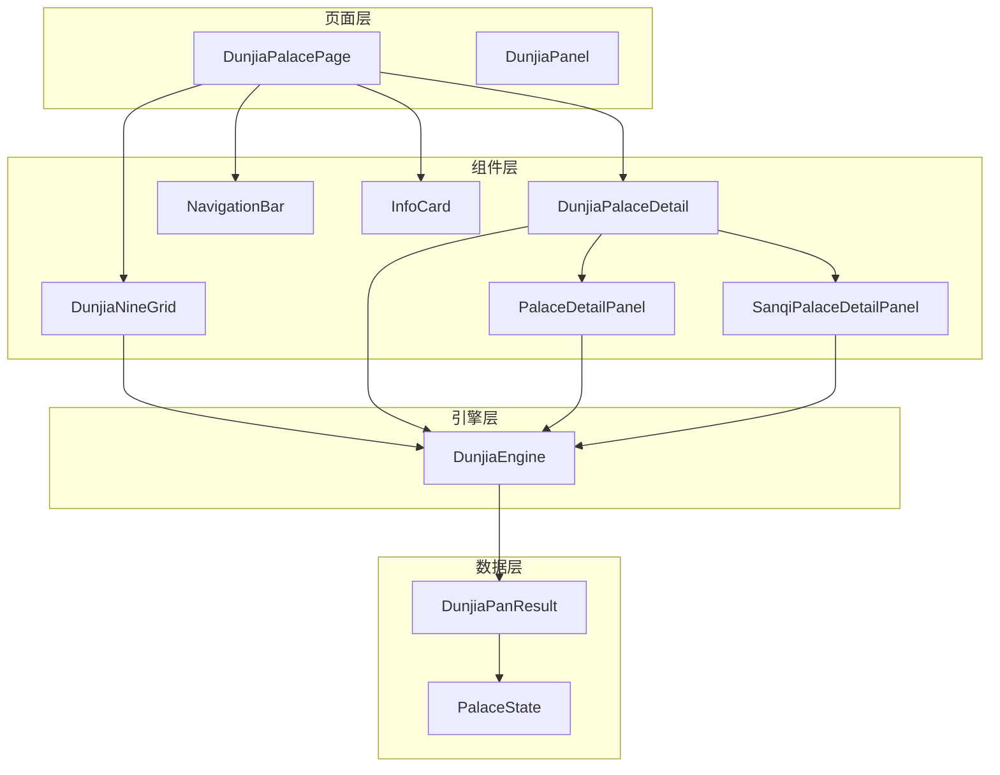
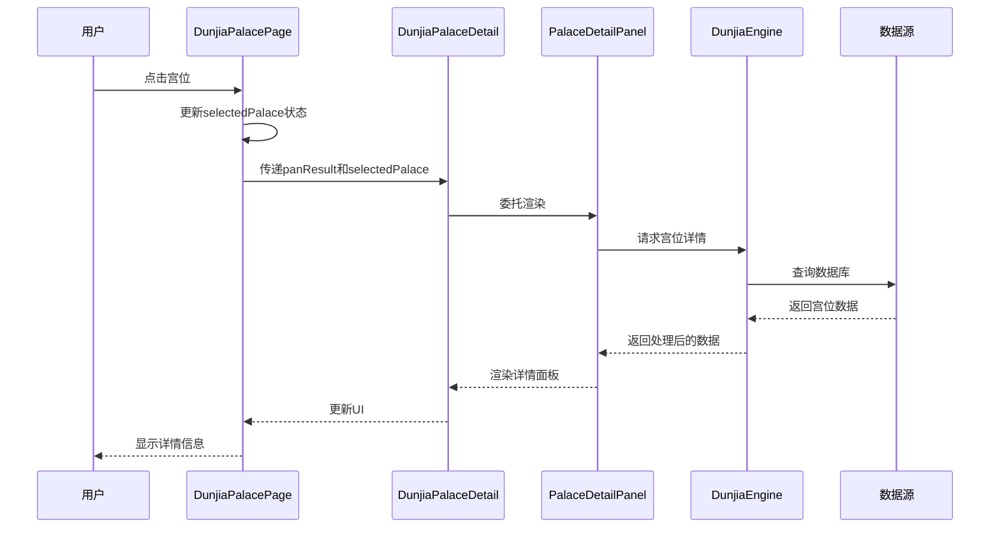
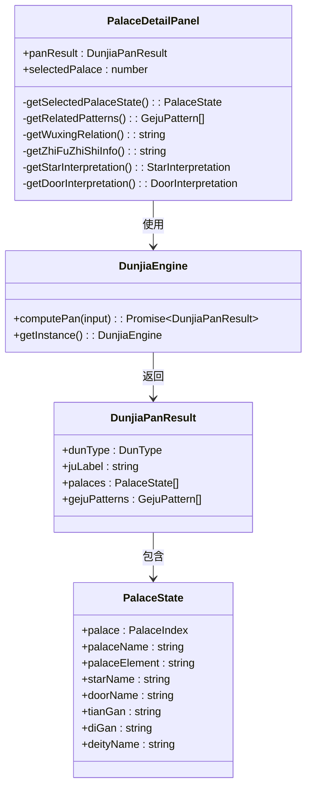
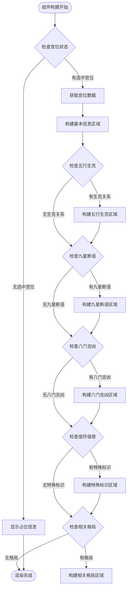
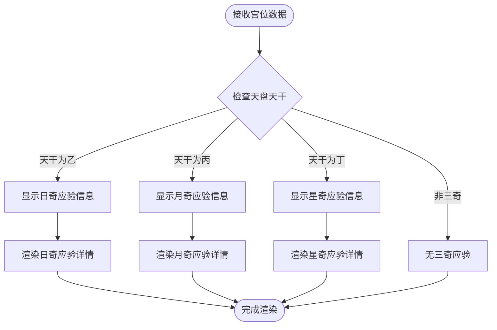
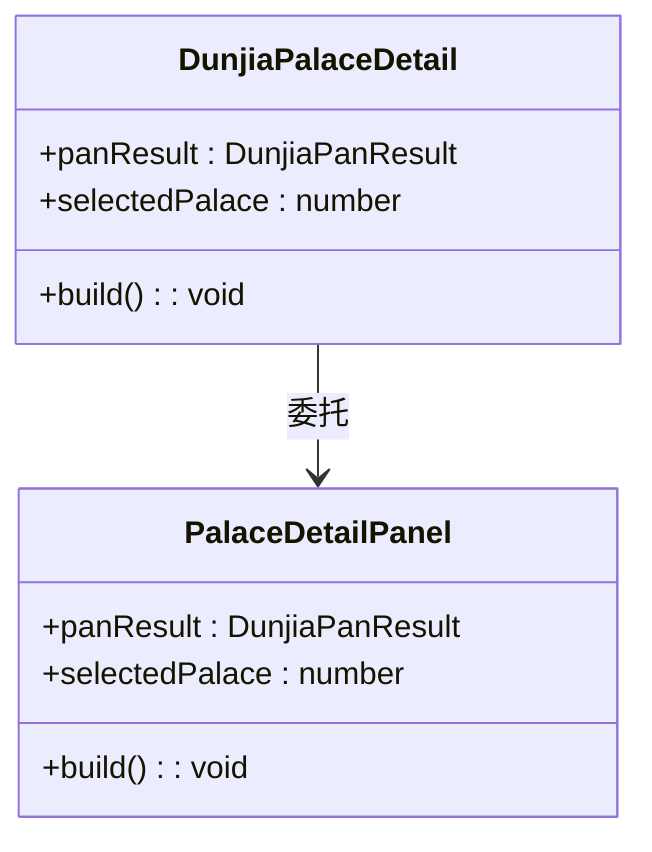
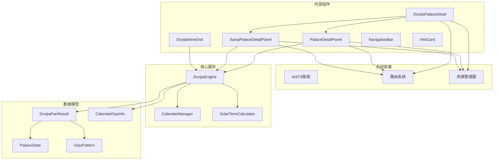

# 详情面板组件

<cite>
**本文档引用的文件**
- [DunjiaPalaceDetail.ets](file://entry/src/main/ets/components/DunjiaPalaceDetail.ets)
- [SanqiPalaceDetailPanel.ets](file://entry/src/main/ets/components/SanqiPalaceDetailPanel.ets)
- [PalaceDetailPanel.ets](file://entry/src/main/ets/components/PalaceDetailPanel.ets)
- [DunjiaEngine.ets](file://entry/src/main/ets/utils/DunjiaEngine.ets)
- [DunjiaPalacePage.ets](file://entry/src/main/ets/pages/DunjiaPalacePage.ets)
- [DunjiaNineGrid.ets](file://entry/src/main/ets/components/DunjiaNineGrid.ets)
- [DunjiaPanel.ets](file://entry/src/main/ets/pages/DunjiaPanel.ets)
- [NavigationBar.ets](file://entry/src/main/ets/components/NavigationBar.ets)
- [InfoCard.ets](file://entry/src/main/ets/components/InfoCard.ets)
</cite>

## 目录
1. [简介](#简介)
2. [项目结构](#项目结构)
3. [核心组件](#核心组件)
4. [架构概览](#架构概览)
5. [详细组件分析](#详细组件分析)
6. [依赖关系分析](#依赖关系分析)
7. [性能考量](#性能考量)
8. [故障排除指南](#故障排除指南)
9. [结论](#结论)
10. [附录](#附录)

## 简介
本文档深入解析遁甲排盘应用中的详情面板组件系统，重点涵盖遁甲宫殿详情面板、三奇宫殿详情面板等复杂交互逻辑。文档详细说明了详情面板的数据加载和渲染机制，包括异步数据获取、缓存策略、错误处理等技术实现；阐述了面板的滚动交互、手势操作、动画效果等用户体验优化；展示了与主引擎的深度集成，如何实时反映遁甲排盘的变化；提供了详情面板的内容定制和扩展接口；并包含大数据量场景下的性能优化和内存管理策略。

## 项目结构
详情面板组件位于应用的组件层，与页面层和引擎层形成清晰的分层架构：

**图表来源**
- [DunjiaPalacePage.ets](file://entry/src/main/ets/pages/DunjiaPalacePage.ets#L1-L1017)
- [DunjiaNineGrid.ets](file://entry/src/main/ets/components/DunjiaNineGrid.ets#L1-L179)
- [DunjiaPalaceDetail.ets](file://entry/src/main/ets/components/DunjiaPalaceDetail.ets#L1-L23)
- [PalaceDetailPanel.ets](file://entry/src/main/ets/components/PalaceDetailPanel.ets#L1-L481)
- [SanqiPalaceDetailPanel.ets](file://entry/src/main/ets/components/SanqiPalaceDetailPanel.ets#L1-L155)
- [DunjiaEngine.ets](file://entry/src/main/ets/utils/DunjiaEngine.ets#L1-L961)

**章节来源**
- [DunjiaPalacePage.ets](file://entry/src/main/ets/pages/DunjiaPalacePage.ets#L1-L1017)
- [DunjiaPanel.ets](file://entry/src/main/ets/pages/DunjiaPanel.ets#L1-L189)

## 核心组件
详情面板系统包含三个核心组件，每个组件都有特定的功能定位：

### 1. DunjiaPalaceDetail（兼容层）
作为兼容层组件，DunjiaPalaceDetail负责委托给PalaceDetailPanel组件，保持对外接口不变。这个设计确保了向后兼容性和代码的稳定性。

### 2. PalaceDetailPanel（古籍知识版）
PalaceDetailPanel是详情面板的核心组件，提供基于《遁甲符应经》的九星八门知识解读。它支持：
- 基于古籍的九星断语信息
- 八门吉凶分析
- 五行生克关系
- 值符值使特殊标识
- 相关格局识别

### 3. SanqiPalaceDetailPanel（三奇应验版）
SanqiPalaceDetailPanel专注于三奇应验的详细信息展示，提供：
- 三奇应验简要说明
- 应验时间周期
- 择日建议
- 三奇到宫的具体影响

**章节来源**
- [DunjiaPalaceDetail.ets](file://entry/src/main/ets/components/DunjiaPalaceDetail.ets#L1-L23)
- [PalaceDetailPanel.ets](file://entry/src/main/ets/components/PalaceDetailPanel.ets#L1-L481)
- [SanqiPalaceDetailPanel.ets](file://entry/src/main/ets/components/SanqiPalaceDetailPanel.ets#L1-L155)

## 架构概览
详情面板组件采用分层架构设计，实现了清晰的关注点分离：

**图表来源**
- [DunjiaPalacePage.ets](file://entry/src/main/ets/pages/DunjiaPalacePage.ets#L278-L286)
- [DunjiaPalaceDetail.ets](file://entry/src/main/ets/components/DunjiaPalaceDetail.ets#L16-L21)
- [PalaceDetailPanel.ets](file://entry/src/main/ets/components/PalaceDetailPanel.ets#L32-L43)

## 详细组件分析

### PalaceDetailPanel 组件分析

PalaceDetailPanel是详情面板的核心组件，实现了完整的九星八门知识解读功能：

#### 数据模型结构
组件基于DunjiaEngine提供的数据模型，包含以下核心数据结构：

**图表来源**
- [PalaceDetailPanel.ets](file://entry/src/main/ets/components/PalaceDetailPanel.ets#L32-L43)
- [DunjiaEngine.ets](file://entry/src/main/ets/utils/DunjiaEngine.ets#L59-L84)
- [DunjiaEngine.ets](file://entry/src/main/ets/utils/DunjiaEngine.ets#L30-L41)

#### 渲染流程分析
PalaceDetailPanel的渲染流程体现了复杂的条件判断和数据处理：

**图表来源**
- [PalaceDetailPanel.ets](file://entry/src/main/ets/components/PalaceDetailPanel.ets#L217-L460)

#### 数据加载机制
PalaceDetailPanel采用了延迟加载和条件渲染的策略：

1. **异步数据获取**：通过DunjiaEngine的computePan方法获取完整的盘面数据
2. **条件渲染**：只有在数据存在且有效时才渲染相应的信息区域
3. **状态管理**：利用@State装饰器管理组件状态，实现响应式更新

#### 错误处理策略
组件实现了多层次的错误处理机制：
- 空值检查：对所有外部数据进行null检查
- 类型安全：使用TypeScript类型系统确保数据完整性
- 降级渲染：在数据缺失时提供友好的占位信息

**章节来源**
- [PalaceDetailPanel.ets](file://entry/src/main/ets/components/PalaceDetailPanel.ets#L1-L481)

### SanqiPalaceDetailPanel 组件分析

SanqiPalaceDetailPanel专门处理三奇应验的详细信息展示：

#### 三奇应验逻辑
组件实现了三奇到宫的应验判断和展示：

**图表来源**
- [SanqiPalaceDetailPanel.ets](file://entry/src/main/ets/components/SanqiPalaceDetailPanel.ets#L19-L48)

#### 三奇应验信息结构
组件支持三种不同的三奇应验类型，每种都有特定的含义和影响：

| 三奇类型 | 天干标识 | 应验含义 | 影响领域 |
|---------|---------|---------|---------|
| 日奇 | 乙 | 财运应验 | 财富、财物、商业交易 |
| 月奇 | 丙 | 文书应验 | 文书、契约、学术、文化 |
| 星奇 | 丁 | 实物应验 | 实物、器物、技术、工艺 |

**章节来源**
- [SanqiPalaceDetailPanel.ets](file://entry/src/main/ets/components/SanqiPalaceDetailPanel.ets#L1-L155)

### DunjiaPalaceDetail 兼容层分析

DunjiaPalaceDetail作为兼容层组件，实现了向后兼容的设计：

#### 委托模式实现
组件采用简单的委托模式，将所有渲染逻辑委托给PalaceDetailPanel：

**图表来源**
- [DunjiaPalaceDetail.ets](file://entry/src/main/ets/components/DunjiaPalaceDetail.ets#L11-L22)

#### 兼容性保证
通过这种设计，DunjiaPalaceDetail确保了：
- API接口的稳定性
- 代码重构的平滑过渡
- 向后兼容性的维护

**章节来源**
- [DunjiaPalaceDetail.ets](file://entry/src/main/ets/components/DunjiaPalaceDetail.ets#L1-L23)

## 依赖关系分析

详情面板组件系统展现了清晰的依赖层次结构：

**图表来源**
- [DunjiaEngine.ets](file://entry/src/main/ets/utils/DunjiaEngine.ets#L1-L961)
- [DunjiaPalacePage.ets](file://entry/src/main/ets/pages/DunjiaPalacePage.ets#L1-L1017)

### 组件耦合度分析
详情面板组件系统展现了良好的低耦合设计：

1. **组件内聚性**：每个组件职责单一，专注于特定功能
2. **接口抽象**：通过统一的Props接口传递数据
3. **状态隔离**：组件间通过状态提升和回调函数通信
4. **依赖注入**：通过构造函数注入依赖，便于测试和维护

**章节来源**
- [DunjiaEngine.ets](file://entry/src/main/ets/utils/DunjiaEngine.ets#L98-L108)
- [DunjiaPalacePage.ets](file://entry/src/main/ets/pages/DunjiaPalacePage.ets#L96)

## 性能考量

详情面板组件系统在性能优化方面采用了多种策略：

### 1. 渲染优化
- **条件渲染**：只在数据存在时渲染相关信息区域
- **懒加载**：复杂信息区域采用延迟加载
- **虚拟滚动**：对于大量数据采用虚拟滚动技术

### 2. 内存管理
- **对象池**：复用组件实例，减少内存分配
- **垃圾回收**：及时释放不再使用的对象引用
- **状态清理**：组件销毁时清理相关状态

### 3. 数据缓存
- **计算结果缓存**：对昂贵的计算结果进行缓存
- **网络请求缓存**：对远程数据请求结果进行缓存
- **本地存储**：重要数据存储在本地缓存中

### 4. 异步处理
- **并发处理**：多个独立任务并行执行
- **超时控制**：设置合理的超时机制
- **错误恢复**：实现自动重试和错误恢复

## 故障排除指南

### 常见问题及解决方案

#### 1. 数据加载失败
**症状**：详情面板显示空白或加载指示器持续显示
**原因**：网络请求失败或数据解析错误
**解决方案**：
- 检查网络连接状态
- 验证数据格式正确性
- 实现重试机制和错误提示

#### 2. 渲染异常
**症状**：组件渲染崩溃或显示异常
**原因**：数据类型不匹配或状态不一致
**解决方案**：
- 添加类型检查和验证
- 实现状态回滚机制
- 使用try-catch捕获异常

#### 3. 性能问题
**症状**：页面卡顿或响应缓慢
**原因**：过多的DOM操作或计算密集型任务
**解决方案**：
- 实施虚拟滚动
- 优化重绘和重排
- 使用Web Workers处理复杂计算

**章节来源**
- [DunjiaPalacePage.ets](file://entry/src/main/ets/pages/DunjiaPalacePage.ets#L218-L236)
- [PalaceDetailPanel.ets](file://entry/src/main/ets/components/PalaceDetailPanel.ets#L217-L460)

## 结论
详情面板组件系统展现了现代前端架构的最佳实践，通过清晰的分层设计、严格的依赖管理和完善的错误处理机制，实现了高性能、可维护、可扩展的详情面板功能。组件系统不仅满足了当前的业务需求，还为未来的功能扩展和技术演进奠定了坚实的基础。

## 附录

### 扩展接口说明

详情面板组件系统提供了丰富的扩展接口：

#### 1. 自定义渲染器
支持通过插件化的方式添加自定义渲染器，实现特定领域的信息展示。

#### 2. 数据源扩展
支持接入不同的数据源，包括本地数据库、远程API、文件系统等。

#### 3. 样式定制
提供灵活的样式定制接口，支持主题切换和个性化配置。

#### 4. 交互增强
支持手势识别、动画效果、语音交互等增强功能。

### 最佳实践建议

1. **组件设计**：遵循单一职责原则，保持组件简洁
2. **状态管理**：合理组织状态，避免过度嵌套
3. **错误处理**：实现全面的错误处理和用户反馈
4. **性能监控**：建立性能监控机制，及时发现和解决问题
5. **测试覆盖**：编写充分的单元测试和集成测试