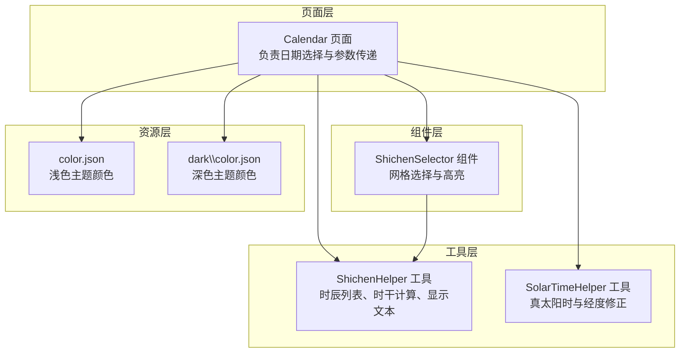
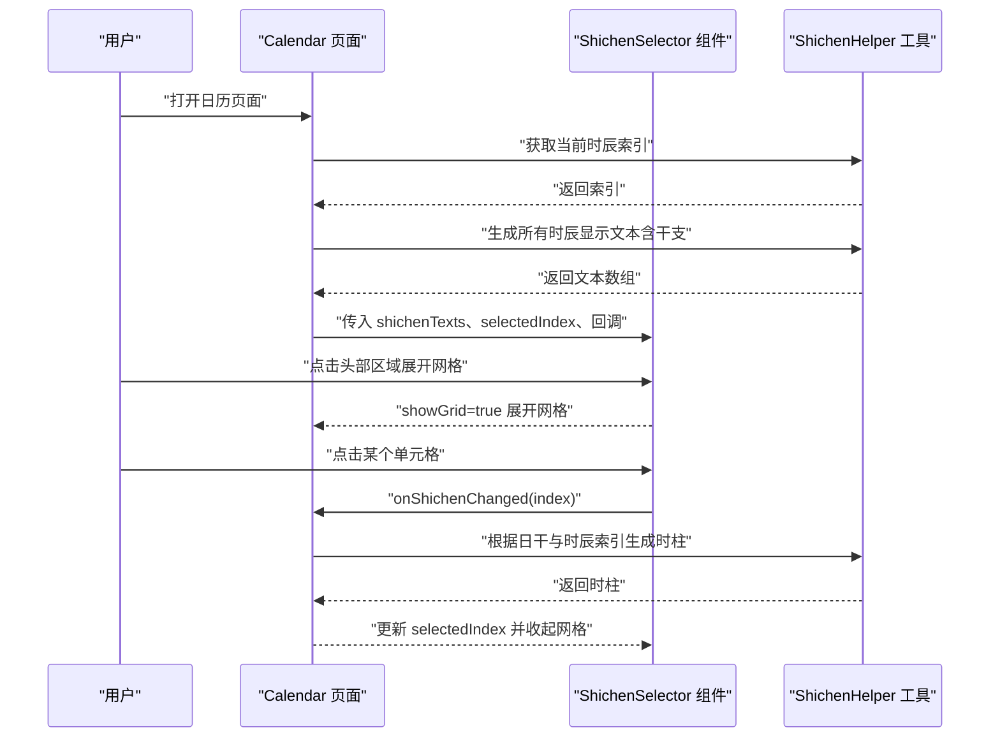
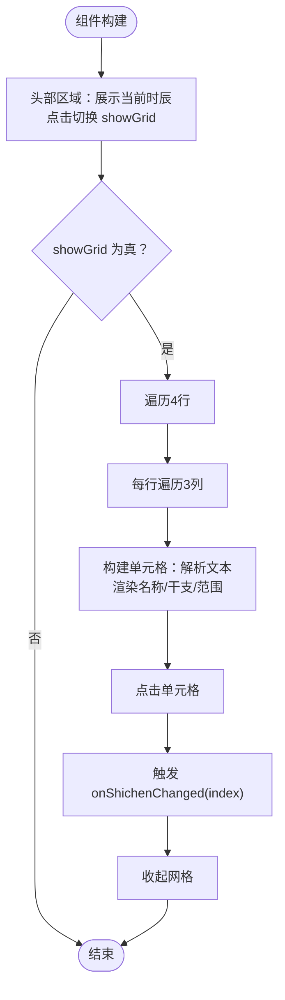
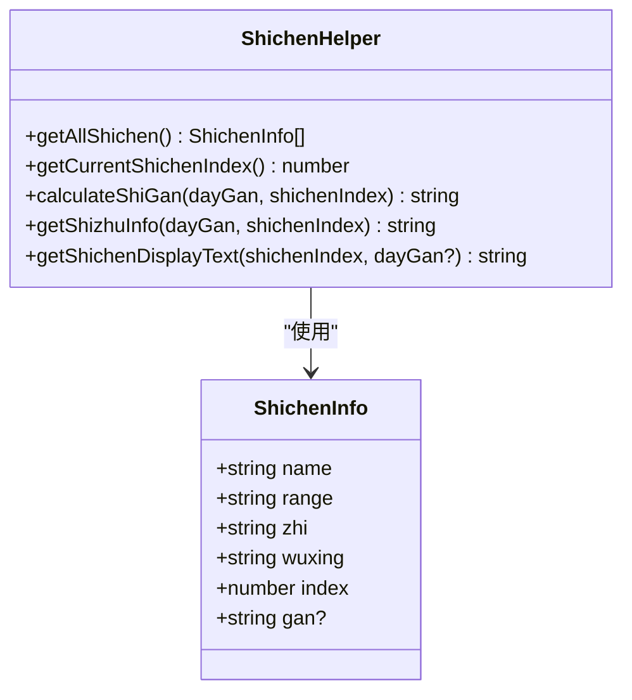
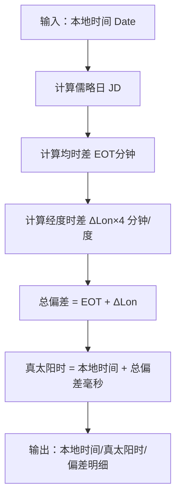
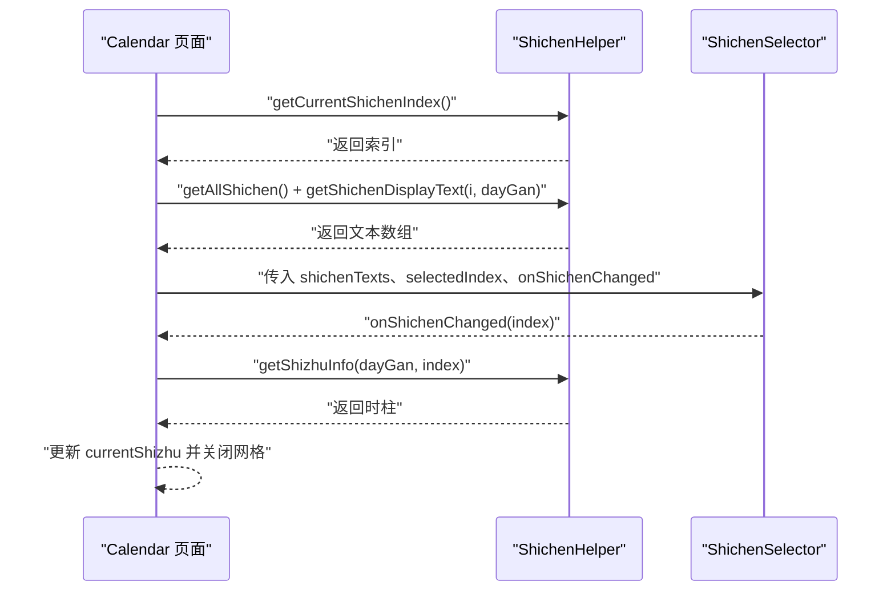
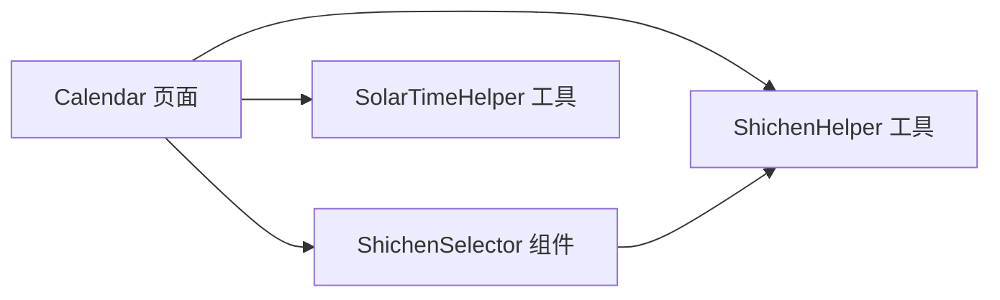
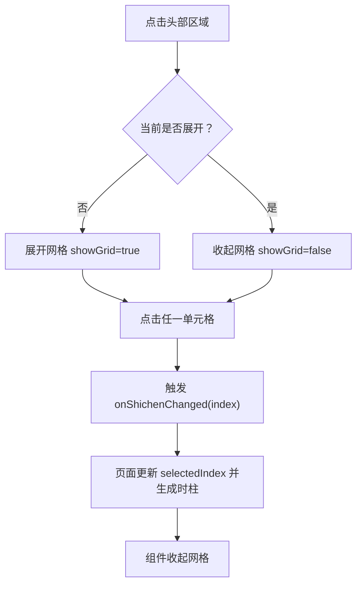
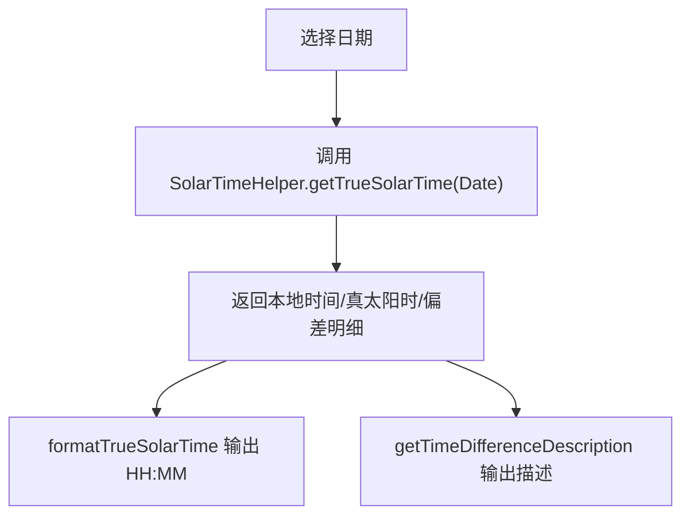

# 选择器组件

<cite>
**本文引用的文件**
- [ShichenSelector.ets](file://entry/src/main/ets/components/ShichenSelector.ets)
- [ShichenHelper.ets](file://entry/src/main/ets/utils/ShichenHelper.ets)
- [SolarTimeHelper.ets](file://entry/src/main/ets/utils/SolarTimeHelper.ets)
- [Calendar.ets](file://entry/src/main/ets/pages/Calendar.ets)
- [color.json](file://entry/src/main/resources/base/element/color.json)
- [dark\color.json](file://entry/src/main/resources/dark/element/color.json)
</cite>

## 目录
1. [简介](#简介)
2. [项目结构](#项目结构)
3. [核心组件](#核心组件)
4. [架构概览](#架构概览)
5. [详细组件分析](#详细组件分析)
6. [依赖分析](#依赖分析)
7. [性能考虑](#性能考虑)
8. [故障排查指南](#故障排查指南)
9. [结论](#结论)
10. [附录](#附录)

## 简介
本文件面向“选择器组件”（特别是“时辰选择器”）的综合技术文档，围绕以下目标展开：
- 设计原理与实现细节：解释组件如何组织界面、状态与事件流。
- 数据模型：十二时辰映射、时辰换算逻辑、时柱干支生成、真太阳时修正。
- 交互体验：点击展开/收起、网格点击确认、高亮与视觉反馈。
- 与“时辰助手工具”的协作：数据准备、回调联动、参数传递。
- 样式定制与主题适配：颜色变量、暗色模式支持。
- 多时区兼容性：真太阳时修正与经度参数化。

## 项目结构
选择器组件位于页面级目录中，与工具类共同协作完成“日历+时辰+真太阳时”的完整体验。

图表来源
- [Calendar.ets](file://entry/src/main/ets/pages/Calendar.ets#L1-L602)
- [ShichenSelector.ets](file://entry/src/main/ets/components/ShichenSelector.ets#L1-L133)
- [ShichenHelper.ets](file://entry/src/main/ets/utils/ShichenHelper.ets#L1-L114)
- [SolarTimeHelper.ets](file://entry/src/main/ets/utils/SolarTimeHelper.ets#L1-L270)
- [color.json](file://entry/src/main/resources/base/element/color.json#L1-L8)
- [dark\color.json](file://entry/src/main/resources/dark/element/color.json#L1-L8)

章节来源
- [Calendar.ets](file://entry/src/main/ets/pages/Calendar.ets#L1-L602)
- [ShichenSelector.ets](file://entry/src/main/ets/components/ShichenSelector.ets#L1-L133)
- [ShichenHelper.ets](file://entry/src/main/ets/utils/ShichenHelper.ets#L1-L114)
- [SolarTimeHelper.ets](file://entry/src/main/ets/utils/SolarTimeHelper.ets#L1-L270)
- [color.json](file://entry/src/main/resources/base/element/color.json#L1-L8)
- [dark\color.json](file://entry/src/main/resources/dark/element/color.json#L1-L8)

## 核心组件
- 时辰选择器组件：提供当前时辰展示、点击展开网格、单元格点击确认、高亮当前项等交互。
- 时辰助手工具：提供十二时辰基础数据、当前时辰索引、时干计算、时柱生成、显示文本格式化。
- 真太阳时工具：提供真太阳时计算、均时差、经度时差修正、时差描述与格式化输出。
- 页面集成：在日历页面中使用选择器，并将选中结果传递至后续页面。

章节来源
- [ShichenSelector.ets](file://entry/src/main/ets/components/ShichenSelector.ets#L1-L133)
- [ShichenHelper.ets](file://entry/src/main/ets/utils/ShichenHelper.ets#L1-L114)
- [SolarTimeHelper.ets](file://entry/src/main/ets/utils/SolarTimeHelper.ets#L1-L270)
- [Calendar.ets](file://entry/src/main/ets/pages/Calendar.ets#L250-L304)

## 架构概览
选择器与页面、工具之间的调用关系如下：

图表来源
- [Calendar.ets](file://entry/src/main/ets/pages/Calendar.ets#L250-L304)
- [ShichenSelector.ets](file://entry/src/main/ets/components/ShichenSelector.ets#L34-L78)
- [ShichenHelper.ets](file://entry/src/main/ets/utils/ShichenHelper.ets#L37-L112)

## 详细组件分析

### 1) 时辰选择器组件（ShichenSelector）
- 组件职责
  - 展示当前选中时辰文本。
  - 点击头部区域展开/收起网格。
  - 网格采用4行×3列布局，每个单元格包含“时辰名、干支、时间范围”。
  - 点击单元格触发回调并自动收起网格。
- 数据解析
  - 通过解析传入的文本，提取“时辰名”“时间范围”“干支”三段信息，分别渲染。
- 交互与视觉
  - 头部区域带指示箭头，展开时箭头方向改变。
  - 当前选中单元格高亮背景、文字颜色变化、阴影增强。
  - 非当前单元格保持边框与阴影，确保层级感。
- 参数与回调
  - @Prop: shichenTexts（显示文本数组）、selectedIndex（当前索引）。
  - @State: showGrid（是否展开网格）。
  - onShichenChanged：选中回调，接收新索引。

图表来源
- [ShichenSelector.ets](file://entry/src/main/ets/components/ShichenSelector.ets#L34-L131)

章节来源
- [ShichenSelector.ets](file://entry/src/main/ets/components/ShichenSelector.ets#L1-L133)

### 2) 时辰助手工具（ShichenHelper）
- 数据模型
  - 十二时辰基础信息：名称、时间范围、地支、五行、索引。
  - 天干序列：用于时干推算。
- 关键方法
  - getAllShichen：返回完整时辰列表。
  - getCurrentShichenIndex：根据系统时间计算当前时辰索引（23:00 归属子时）。
  - calculateShiGan：依据日干与时辰索引，使用“五鼠遁法”推导时干。
  - getShizhuInfo：拼接时干+地支得到时柱。
  - getShichenDisplayText：生成选择器显示文本（可选包含干支）。

图表来源
- [ShichenHelper.ets](file://entry/src/main/ets/utils/ShichenHelper.ets#L5-L113)

章节来源
- [ShichenHelper.ets](file://entry/src/main/ets/utils/ShichenHelper.ets#L1-L114)

### 3) 真太阳时工具（SolarTimeHelper）
- 功能概述
  - 计算真太阳时（True Solar Time）：基于本地时间、均时差、经度时差修正。
  - 提供格式化输出、时差描述、详细信息字符串。
- 关键方法
  - getTrueSolarTime：返回本地时间、真太阳时、均时差、经度时差、总偏差。
  - formatTrueSolarTime：格式化为“HH:MM”。
  - getTimeDifferenceDescription：生成“快X分钟/慢X分钟/一致”的描述。
  - setLongitude：动态设置经度（默认东八区）。
- 算法要点
  - 儒略日转换、均时差计算、经度时差=Δ经度×4分钟/度。
  - 角度归一化、时间差毫秒换算。

图表来源
- [SolarTimeHelper.ets](file://entry/src/main/ets/utils/SolarTimeHelper.ets#L54-L77)
- [SolarTimeHelper.ets](file://entry/src/main/ets/utils/SolarTimeHelper.ets#L150-L202)

章节来源
- [SolarTimeHelper.ets](file://entry/src/main/ets/utils/SolarTimeHelper.ets#L1-L270)

### 4) 页面集成与协作（Calendar）
- 初始化与默认值
  - 页面加载时设置当前日期、月份，计算当前时辰索引。
- 时辰文本生成
  - 通过工具类生成全部时辰的显示文本（包含日干推导的时干）。
- 交互回调
  - 选择器回调中更新选中索引，并根据日干与索引重新计算时柱。
- 参数传递
  - 进入下一页面时，携带时间戳、干支信息、时辰索引等参数。

图表来源
- [Calendar.ets](file://entry/src/main/ets/pages/Calendar.ets#L30-L43)
- [Calendar.ets](file://entry/src/main/ets/pages/Calendar.ets#L250-L304)
- [ShichenSelector.ets](file://entry/src/main/ets/components/ShichenSelector.ets#L34-L78)

章节来源
- [Calendar.ets](file://entry/src/main/ets/pages/Calendar.ets#L1-L602)

## 依赖分析
- 组件依赖
  - ShichenSelector 依赖 ShichenHelper 的显示文本与索引计算能力。
  - Calendar 页面同时依赖 ShichenHelper 与 SolarTimeHelper，前者用于时辰显示与干支，后者用于真太阳时展示。
- 数据流向
  - 页面从工具类获取数据，再传递给组件；组件通过回调将变更回传页面；页面再进行二次计算与参数打包。

图表来源
- [Calendar.ets](file://entry/src/main/ets/pages/Calendar.ets#L1-L602)
- [ShichenSelector.ets](file://entry/src/main/ets/components/ShichenSelector.ets#L1-L133)
- [ShichenHelper.ets](file://entry/src/main/ets/utils/ShichenHelper.ets#L1-L114)
- [SolarTimeHelper.ets](file://entry/src/main/ets/utils/SolarTimeHelper.ets#L1-L270)

章节来源
- [Calendar.ets](file://entry/src/main/ets/pages/Calendar.ets#L1-L602)
- [ShichenSelector.ets](file://entry/src/main/ets/components/ShichenSelector.ets#L1-L133)
- [ShichenHelper.ets](file://entry/src/main/ets/utils/ShichenHelper.ets#L1-L114)
- [SolarTimeHelper.ets](file://entry/src/main/ets/utils/SolarTimeHelper.ets#L1-L270)

## 性能考虑
- 文本解析
  - 选择器对每个单元格文本执行一次正则解析，复杂度线性于文本长度；在4×3网格规模下开销极低。
- 时干计算
  - 时干计算为常数时间操作，仅做数组索引与模运算，性能稳定。
- 真太阳时
  - 计算涉及浮点运算与三角函数，但仅在用户查看真太阳时时触发，频率较低。
- 渲染优化
  - 组件内部通过状态控制展开/收起，避免不必要的重绘。
  - 选择器单元格使用条件可见性与条件样式，减少无效绘制。

## 故障排查指南
- 问题：选择器不显示或空白
  - 检查传入的 shichenTexts 是否为空数组，确保页面已生成显示文本。
  - 章节来源
    - [Calendar.ets](file://entry/src/main/ets/pages/Calendar.ets#L259-L265)
    - [ShichenSelector.ets](file://entry/src/main/ets/components/ShichenSelector.ets#L80-L108)
- 问题：选中后未更新时柱
  - 确认 onShichenChanged 回调中调用了时柱生成逻辑，并更新了响应式字段。
  - 章节来源
    - [Calendar.ets](file://entry/src/main/ets/pages/Calendar.ets#L403-L409)
    - [ShichenHelper.ets](file://entry/src/main/ets/utils/ShichenHelper.ets#L96-L100)
- 问题：真太阳时显示异常
  - 检查经度设置是否正确，默认为东八区；确认传入日期有效。
  - 章节来源
    - [Calendar.ets](file://entry/src/main/ets/pages/Calendar.ets#L30-L30)
    - [SolarTimeHelper.ets](file://entry/src/main/ets/utils/SolarTimeHelper.ets#L37-L39)
- 问题：样式不符合预期
  - 检查浅色/深色主题的颜色资源是否正确加载。
  - 章节来源
    - [color.json](file://entry/src/main/resources/base/element/color.json#L1-L8)
    - [dark\color.json](file://entry/src/main/resources/dark/element/color.json#L1-L8)

## 结论
- 选择器组件以简洁的结构实现了“当前展示+网格选择+高亮反馈”的核心交互。
- 与时辰助手工具的协作清晰：页面负责数据生成与参数传递，组件负责交互与回调。
- 真太阳时工具提供了跨时区修正能力，结合页面的经度参数化，满足多时区场景需求。
- 样式与主题通过资源文件管理，具备良好的可维护性与扩展性。

## 附录

### A. 时辰数据模型与换算逻辑
- 十二时辰映射：名称、范围、地支、五行、索引。
- 时干推导：依据日干与“五鼠遁法”口诀，从子时起顺推天干。
- 显示文本：可选包含干支与时柱信息，供选择器渲染。

章节来源
- [ShichenHelper.ets](file://entry/src/main/ets/utils/ShichenHelper.ets#L16-L29)
- [ShichenHelper.ets](file://entry/src/main/ets/utils/ShichenHelper.ets#L59-L112)

### B. 交互流程图（选择器）

图表来源
- [ShichenSelector.ets](file://entry/src/main/ets/components/ShichenSelector.ets#L55-L130)
- [Calendar.ets](file://entry/src/main/ets/pages/Calendar.ets#L403-L409)

### C. 真太阳时修正流程（页面使用）

图表来源
- [Calendar.ets](file://entry/src/main/ets/pages/Calendar.ets#L375-L382)
- [SolarTimeHelper.ets](file://entry/src/main/ets/utils/SolarTimeHelper.ets#L54-L108)