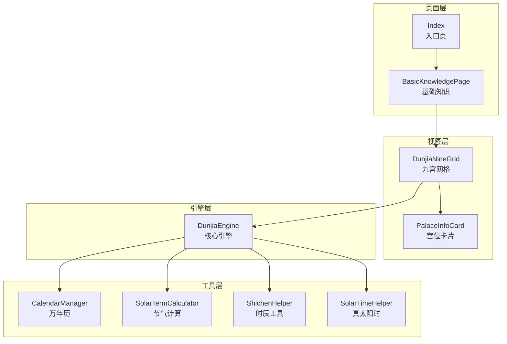
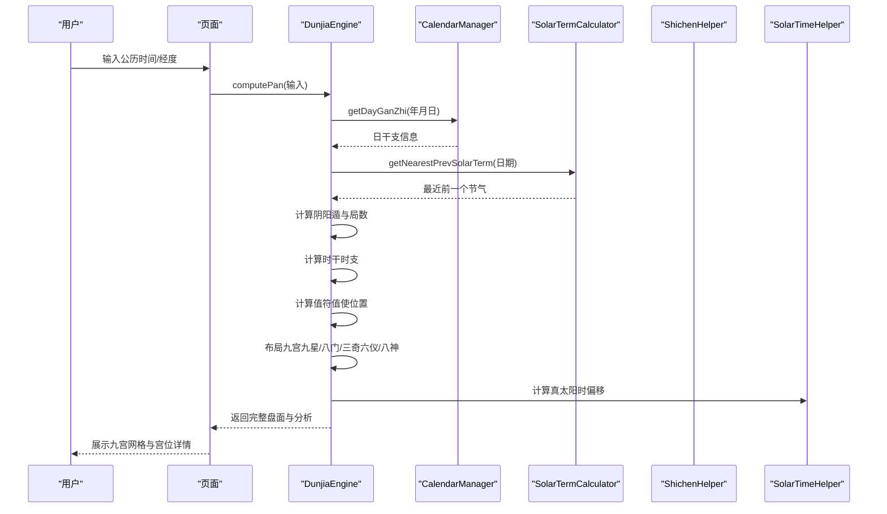
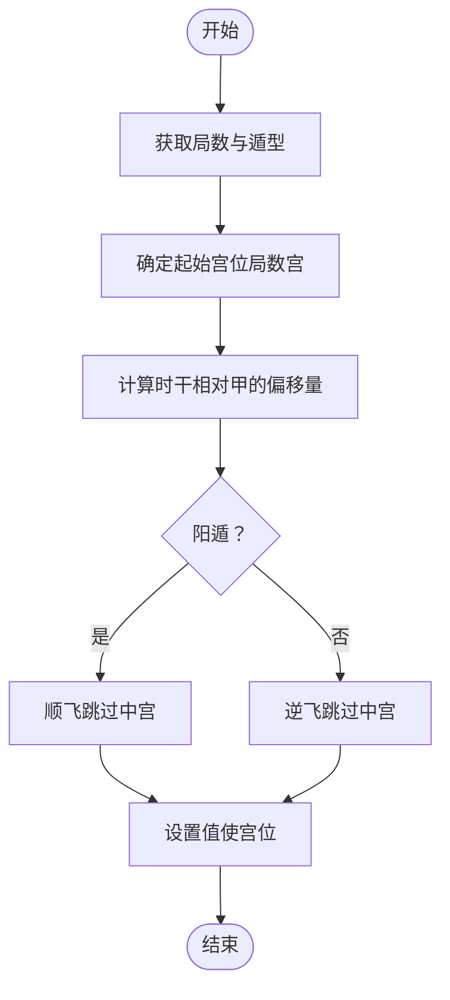
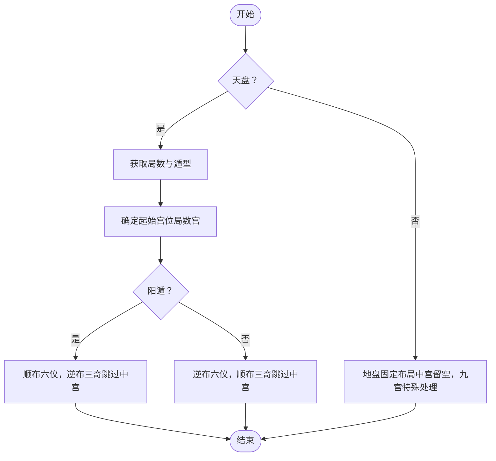
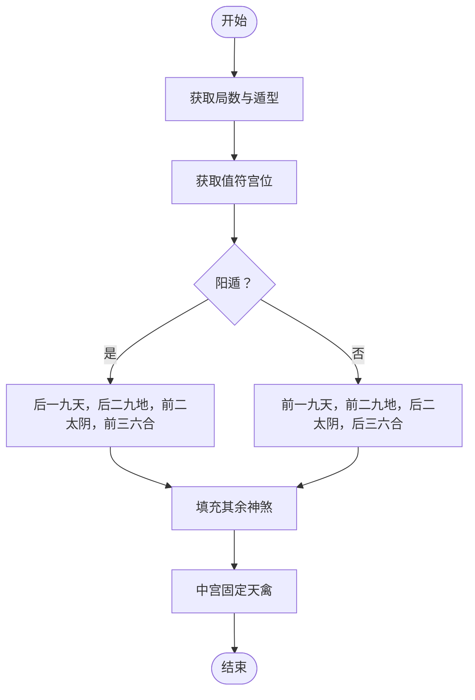
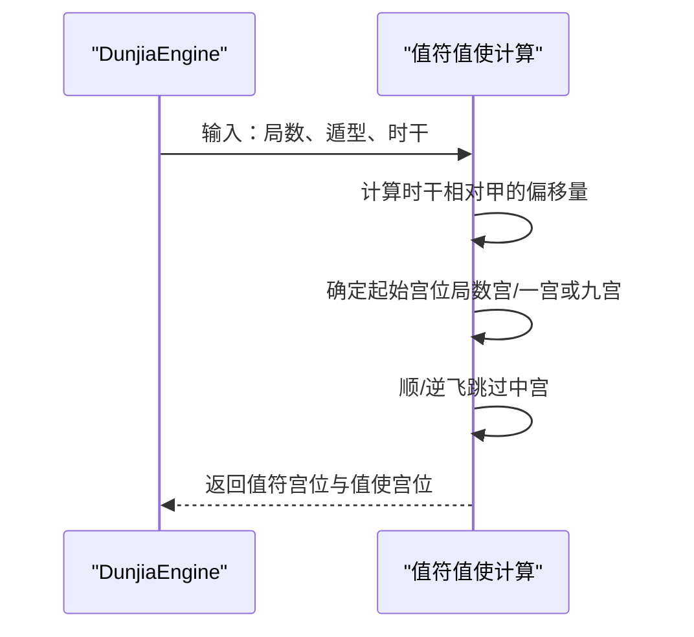
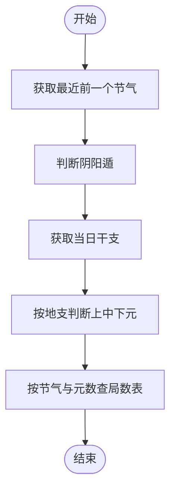
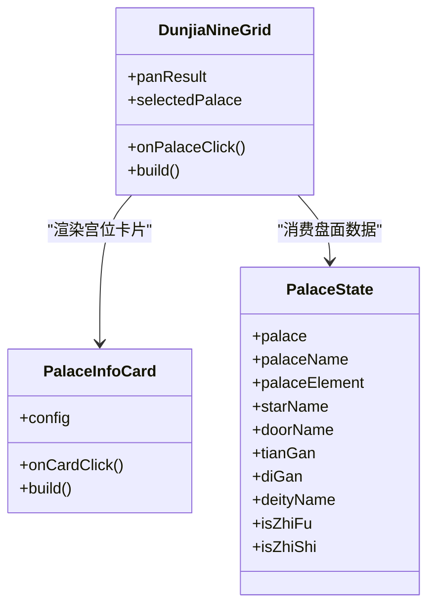
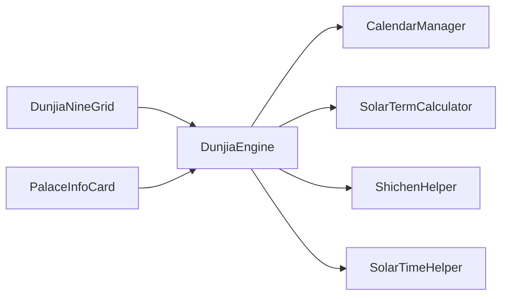

# 九宫布局系统

<cite>
**本文档引用的文件**
- [DunjiaEngine.ets](file://entry/src/main/ets/utils/DunjiaEngine.ets)
- [DunjiaNineGrid.ets](file://entry/src/main/ets/components/DunjiaNineGrid.ets)
- [PalaceInfoCard.ets](file://entry/src/main/ets/components/PalaceInfoCard.ets)
- [CalendarManager.ets](file://entry/src/main/ets/utils/CalendarManager.ets)
- [SolarTermCalculator.ets](file://entry/src/main/ets/utils/SolarTermCalculator.ets)
- [ShichenHelper.ets](file://entry/src/main/ets/utils/ShichenHelper.ets)
- [SolarTimeHelper.ets](file://entry/src/main/ets/utils/SolarTimeHelper.ets)
- [BasicKnowledgePage.ets](file://entry/src/main/ets/pages/BasicKnowledgePage.ets)
- [Index.ets](file://entry/src/main/ets/pages/Index.ets)
</cite>

## 目录
1. [简介](#简介)
2. [项目结构](#项目结构)
3. [核心组件](#核心组件)
4. [架构总览](#架构总览)
5. [详细组件分析](#详细组件分析)
6. [依赖关系分析](#依赖关系分析)
7. [性能考虑](#性能考虑)
8. [故障排查指南](#故障排查指南)
9. [结论](#结论)
10. [附录](#附录)

## 简介
本系统基于《遁甲符应经》正统规则，实现奇门遁甲九宫布局的完整引擎与可视化展示。系统涵盖：
- 阴阳遁与局数计算（依据节气与符头三元）
- 值符值使动态飞布（随时辰移动）
- 九星固定对应九宫与值符移动
- 八门固定对应九宫与值使移动
- 三奇六仪天盘地盘布局（阴阳遁不同布盘规则）
- 八神定位（九天九地太阴六合等）
- 格局识别与结构化分析
- 真太阳时与干支换算
- 交互式九宫网格与宫位详情卡片

## 项目结构
系统采用分层设计：
- 引擎层：核心计算与布局算法（DunjiaEngine）
- 工具层：节气、干支、时辰、真太阳时等辅助工具
- 视图层：九宫网格组件与宫位卡片组件
- 页面层：知识页面与入口页面

图表来源
- [DunjiaEngine.ets](file://entry/src/main/ets/utils/DunjiaEngine.ets#L98-L162)
- [DunjiaNineGrid.ets](file://entry/src/main/ets/components/DunjiaNineGrid.ets#L23-L179)
- [PalaceInfoCard.ets](file://entry/src/main/ets/components/PalaceInfoCard.ets#L22-L179)
- [CalendarManager.ets](file://entry/src/main/ets/utils/CalendarManager.ets#L30-L92)
- [SolarTermCalculator.ets](file://entry/src/main/ets/utils/SolarTermCalculator.ets#L30-L159)
- [ShichenHelper.ets](file://entry/src/main/ets/utils/ShichenHelper.ets#L14-L114)
- [SolarTimeHelper.ets](file://entry/src/main/ets/utils/SolarTimeHelper.ets#L29-L77)
- [BasicKnowledgePage.ets](file://entry/src/main/ets/pages/BasicKnowledgePage.ets#L41-L794)
- [Index.ets](file://entry/src/main/ets/pages/Index.ets#L3-L88)

章节来源
- [DunjiaEngine.ets](file://entry/src/main/ets/utils/DunjiaEngine.ets#L1-L961)
- [DunjiaNineGrid.ets](file://entry/src/main/ets/components/DunjiaNineGrid.ets#L1-L179)
- [PalaceInfoCard.ets](file://entry/src/main/ets/components/PalaceInfoCard.ets#L1-L179)
- [CalendarManager.ets](file://entry/src/main/ets/utils/CalendarManager.ets#L1-L123)
- [SolarTermCalculator.ets](file://entry/src/main/ets/utils/SolarTermCalculator.ets#L1-L375)
- [ShichenHelper.ets](file://entry/src/main/ets/utils/ShichenHelper.ets#L1-L114)
- [SolarTimeHelper.ets](file://entry/src/main/ets/utils/SolarTimeHelper.ets#L1-L270)
- [BasicKnowledgePage.ets](file://entry/src/main/ets/pages/BasicKnowledgePage.ets#L1-L794)
- [Index.ets](file://entry/src/main/ets/pages/Index.ets#L1-L88)

## 核心组件
- DunjiaEngine：核心引擎，负责从输入时间与地点计算完整的遁甲盘面，包括阴阳遁、局数、值符值使、九星、八门、三奇六仪、八神与格局识别。
- DunjiaNineGrid：九宫网格组件，渲染九宫排盘结果，支持宫位点击与选中态。
- PalaceInfoCard：宫位卡片组件，展示宫位的九星、八门、天盘地盘干支、八神、值符值使标识与格局徽章。
- CalendarManager：万年历管理，提供干支、节气、农历等信息。
- SolarTermCalculator：节气精确时刻计算，支持跨年节气查找与缓存。
- ShichenHelper：时辰工具，提供子丑寅卯等十二时辰信息与时干推算。
- SolarTimeHelper：真太阳时计算，提供均时差、经度修正与格式化输出。

章节来源
- [DunjiaEngine.ets](file://entry/src/main/ets/utils/DunjiaEngine.ets#L98-L162)
- [DunjiaNineGrid.ets](file://entry/src/main/ets/components/DunjiaNineGrid.ets#L23-L179)
- [PalaceInfoCard.ets](file://entry/src/main/ets/components/PalaceInfoCard.ets#L22-L179)
- [CalendarManager.ets](file://entry/src/main/ets/utils/CalendarManager.ets#L30-L92)
- [SolarTermCalculator.ets](file://entry/src/main/ets/utils/SolarTermCalculator.ets#L30-L159)
- [ShichenHelper.ets](file://entry/src/main/ets/utils/ShichenHelper.ets#L14-L114)
- [SolarTimeHelper.ets](file://entry/src/main/ets/utils/SolarTimeHelper.ets#L29-L77)

## 架构总览
系统以DunjiaEngine为中心，围绕“时间-地点-干支-节气-遁局-九宫”的数据流展开。计算流程如下：

图表来源
- [DunjiaEngine.ets](file://entry/src/main/ets/utils/DunjiaEngine.ets#L113-L162)
- [CalendarManager.ets](file://entry/src/main/ets/utils/CalendarManager.ets#L51-L92)
- [SolarTermCalculator.ets](file://entry/src/main/ets/utils/SolarTermCalculator.ets#L143-L159)
- [SolarTimeHelper.ets](file://entry/src/main/ets/utils/SolarTimeHelper.ets#L54-L77)

## 详细组件分析

### 九宫九星布局算法
- 九星固定对应九宫（地盘），不随局数飞布。固定映射为：一宫天蓬、二宫天芮、三宫天冲、四宫天辅、五宫天禽、六宫天心、七宫天柱、八宫天任、九宫天英。
- 值符在固定九星盘上移动，随时辰干顺/逆飞（阳遁顺飞、阴遁逆飞），跳过中宫。
- 值符宫位计算：以局数宫为起点，按“时干相对甲的偏移量”进行飞布。

图表来源
- [DunjiaEngine.ets](file://entry/src/main/ets/utils/DunjiaEngine.ets#L397-L402)
- [DunjiaEngine.ets](file://entry/src/main/ets/utils/DunjiaEngine.ets#L206-L246)

章节来源
- [DunjiaEngine.ets](file://entry/src/main/ets/utils/DunjiaEngine.ets#L397-L402)
- [DunjiaEngine.ets](file://entry/src/main/ets/utils/DunjiaEngine.ets#L206-L246)

### 八门布局逻辑
- 八门固定对应九宫（地盘），不随局数飞布。固定映射为：一宫休门、二宫死门、三宫伤门、四宫杜门、五宫中宫无门、六宫开门、七宫惊门、八宫生门、九宫景门。
- 值使门随值使宫位移动，规则与值符类似：阳遁从一宫（休门）顺飞，阴遁从九宫（景门）逆飞，跳过中宫。

图表来源
- [DunjiaEngine.ets](file://entry/src/main/ets/utils/DunjiaEngine.ets#L413-L418)
- [DunjiaEngine.ets](file://entry/src/main/ets/utils/DunjiaEngine.ets#L429-L462)

章节来源
- [DunjiaEngine.ets](file://entry/src/main/ets/utils/DunjiaEngine.ets#L413-L418)
- [DunjiaEngine.ets](file://entry/src/main/ets/utils/DunjiaEngine.ets#L429-L462)

### 三奇六仪天盘地盘布局算法
- 天盘（暗干）：按阴阳遁与局数飞布，阳遁顺布六仪逆布三奇，阴遁逆布六仪顺布三奇。值符宫位作为起始点，跳过中宫。
- 地盘（明干）：固定布局，与九宫一一对应，中宫留空，九宫特殊处理同时有乙与丙。

图表来源
- [DunjiaEngine.ets](file://entry/src/main/ets/utils/DunjiaEngine.ets#L470-L556)

章节来源
- [DunjiaEngine.ets](file://entry/src/main/ets/utils/DunjiaEngine.ets#L470-L556)

### 八神定位算法
- 九天、九地、太阴、六合随值符宫位动态定位：
  - 阳遁：值符后一为九天，后二为九地，前二为太阴，前三为六合。
  - 阴遁：值符前一为九天，前二为九地，后二为太阴，后三为六合。
- 中宫固定为天禽。

图表来源
- [DunjiaEngine.ets](file://entry/src/main/ets/utils/DunjiaEngine.ets#L561-L601)

章节来源
- [DunjiaEngine.ets](file://entry/src/main/ets/utils/DunjiaEngine.ets#L561-L601)

### 值符值使移动机制
- 值符：以“时干相对甲的偏移量”为准，从局数宫开始顺/逆飞，跳过中宫。
- 值使：以“时干相对甲的偏移量”为准，从一宫（阳遁）或九宫（阴遁）起，顺/逆飞，跳过中宫。

图表来源
- [DunjiaEngine.ets](file://entry/src/main/ets/utils/DunjiaEngine.ets#L206-L246)
- [DunjiaEngine.ets](file://entry/src/main/ets/utils/DunjiaEngine.ets#L429-L462)

章节来源
- [DunjiaEngine.ets](file://entry/src/main/ets/utils/DunjiaEngine.ets#L206-L246)
- [DunjiaEngine.ets](file://entry/src/main/ets/utils/DunjiaEngine.ets#L429-L462)

### 阴阳遁与局数判定
- 阴阳遁：依据最近前一个节气判断（冬至后为阳遁，夏至后为阴遁）。
- 局数：依据节气与符头三元（上中下元）查表确定。
- 符头：仅甲日或己日为符头，按地支“仲孟季”判断元数。

图表来源
- [DunjiaEngine.ets](file://entry/src/main/ets/utils/DunjiaEngine.ets#L256-L323)
- [SolarTermCalculator.ets](file://entry/src/main/ets/utils/SolarTermCalculator.ets#L143-L159)
- [CalendarManager.ets](file://entry/src/main/ets/utils/CalendarManager.ets#L51-L92)

章节来源
- [DunjiaEngine.ets](file://entry/src/main/ets/utils/DunjiaEngine.ets#L256-L323)
- [SolarTermCalculator.ets](file://entry/src/main/ets/utils/SolarTermCalculator.ets#L143-L159)
- [CalendarManager.ets](file://entry/src/main/ets/utils/CalendarManager.ets#L51-L92)

### 九宫网格与宫位展示
- DunjiaNineGrid：按传统方位布局（上南下北），渲染九宫格与时间信息、局数、摘要。
- PalaceInfoCard：展示宫位名称、九星、八门、天盘地盘干支、八神、值符值使标识与格局徽章。

图表来源
- [DunjiaNineGrid.ets](file://entry/src/main/ets/components/DunjiaNineGrid.ets#L23-L179)
- [PalaceInfoCard.ets](file://entry/src/main/ets/components/PalaceInfoCard.ets#L22-L179)
- [DunjiaEngine.ets](file://entry/src/main/ets/utils/DunjiaEngine.ets#L30-L84)

章节来源
- [DunjiaNineGrid.ets](file://entry/src/main/ets/components/DunjiaNineGrid.ets#L23-L179)
- [PalaceInfoCard.ets](file://entry/src/main/ets/components/PalaceInfoCard.ets#L22-L179)
- [DunjiaEngine.ets](file://entry/src/main/ets/utils/DunjiaEngine.ets#L30-L84)

### 真太阳时与干支换算
- SolarTimeHelper：计算均时差、经度时差与真太阳时，提供格式化输出与调试信息。
- ShichenHelper：提供十二时辰基础信息与根据日干推算时干的算法。

章节来源
- [SolarTimeHelper.ets](file://entry/src/main/ets/utils/SolarTimeHelper.ets#L29-L245)
- [ShichenHelper.ets](file://entry/src/main/ets/utils/ShichenHelper.ets#L14-L114)

## 依赖关系分析
- DunjiaEngine 依赖 CalendarManager 获取干支信息，依赖 SolarTermCalculator 获取节气，依赖 ShichenHelper 计算时干时支，依赖 SolarTimeHelper 计算真太阳时偏移。
- 视图层组件依赖引擎层提供的 DunjiaPanResult 数据结构进行渲染。

图表来源
- [DunjiaEngine.ets](file://entry/src/main/ets/utils/DunjiaEngine.ets#L113-L162)
- [DunjiaNineGrid.ets](file://entry/src/main/ets/components/DunjiaNineGrid.ets#L23-L179)
- [PalaceInfoCard.ets](file://entry/src/main/ets/components/PalaceInfoCard.ets#L22-L179)

章节来源
- [DunjiaEngine.ets](file://entry/src/main/ets/utils/DunjiaEngine.ets#L113-L162)
- [DunjiaNineGrid.ets](file://entry/src/main/ets/components/DunjiaNineGrid.ets#L23-L179)
- [PalaceInfoCard.ets](file://entry/src/main/ets/components/PalaceInfoCard.ets#L22-L179)

## 性能考虑
- 节气计算采用缓存策略，避免重复计算。
- 万年历数据按年份分片加载并缓存，减少IO开销。
- 九宫布局为纯数组映射与循环，时间复杂度O(1)，空间复杂度O(1)。
- 真太阳时计算为纯数学运算，复杂度低，建议在需要时才触发计算。

## 故障排查指南
- 无法获取干支信息：检查 CalendarManager 初始化与资源加载，确认日期范围与文件命名规则。
- 节气时刻不准确：确认 SolarTermCalculator 的缓存与预加载策略，必要时清理缓存。
- 真太阳时偏移异常：检查经度输入与标准经度设置，核对格式化输出。
- 九宫显示异常：检查 DunjiaNineGrid 的宫位索引与地图映射，确认九宫顺序与方位约定。
- 值符值使位置错误：核对值符值使计算逻辑与局数宫起点，确保跳过中宫规则正确执行。

章节来源
- [CalendarManager.ets](file://entry/src/main/ets/utils/CalendarManager.ets#L51-L92)
- [SolarTermCalculator.ets](file://entry/src/main/ets/utils/SolarTermCalculator.ets#L360-L373)
- [SolarTimeHelper.ets](file://entry/src/main/ets/utils/SolarTimeHelper.ets#L54-L77)
- [DunjiaNineGrid.ets](file://entry/src/main/ets/components/DunjiaNineGrid.ets#L144-L171)
- [DunjiaEngine.ets](file://entry/src/main/ets/utils/DunjiaEngine.ets#L206-L246)

## 结论
本系统严格遵循《遁甲符应经》正统规则，实现了从时间地点到完整遁甲盘面的自动化计算与可视化展示。通过清晰的模块划分与严谨的算法实现，系统能够稳定输出九宫九星、八门、三奇六仪、八神与值符值使的布局，并提供结构化分析与格局识别，为奇门遁甲的学习与实践提供了可靠支撑。

## 附录
- 示例布局要点
  - 阳遁：值符从一宫顺飞，值使从一宫顺飞；九天在值符后一，九地在后二，太阴在前二，六合在前三。
  - 阴遁：值符从九宫逆飞，值使从九宫逆飞；九天在值符前一，九地在前二，太阴在后二，六合在后三。
  - 三奇六仪：天盘按遁型与局数飞布，地盘固定对应九宫，中宫留空，九宫特殊处理。
- 宫位映射关系
  - 九星固定映射：一宫天蓬、二宫天芮、三宫天冲、四宫天辅、五宫天禽、六宫天心、七宫天柱、八宫天任、九宫天英。
  - 八门固定映射：一宫休门、二宫死门、三宫伤门、四宫杜门、五宫中宫无门、六宫开门、七宫惊门、八宫生门、九宫景门。
  - 地支宫位映射（简化）：一宫坎（子）、二宫坤（未）、三宫震（卯）、四宫巽（辰）、五宫中（-）、六宫乾（戌）、七宫兑（酉）、八宫艮（丑）、九宫离（午）。