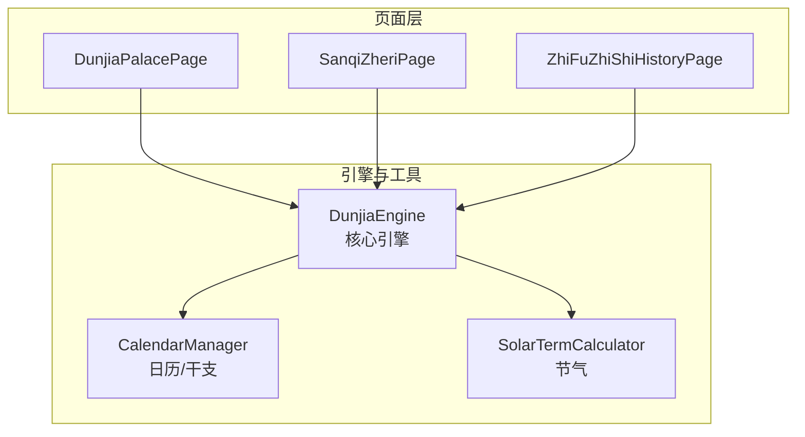
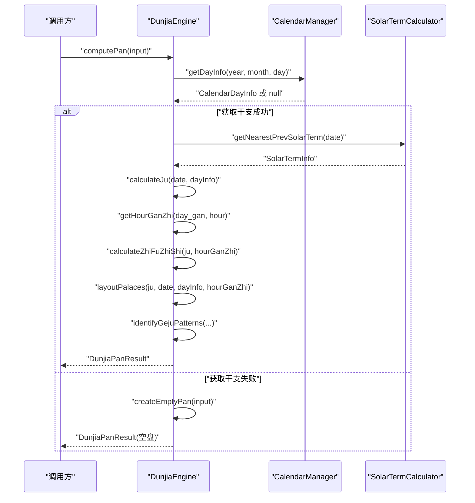
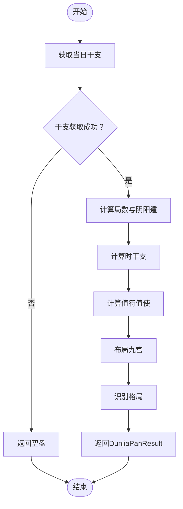
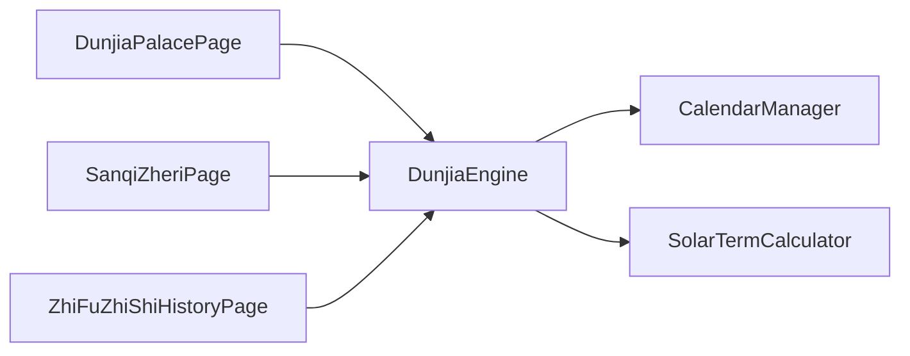
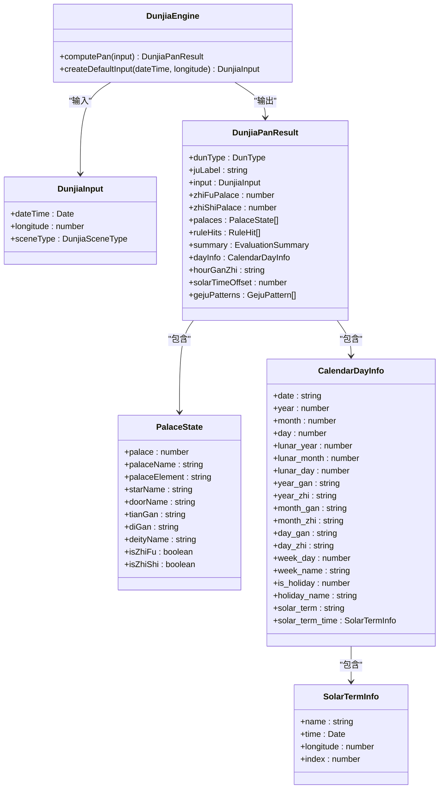

# 引擎API参考

<cite>
**本文引用的文件**
- [DunjiaEngine.ets](file://entry/src/main/ets/utils/DunjiaEngine.ets)
- [CalendarManager.ets](file://entry/src/main/ets/utils/CalendarManager.ets)
- [SolarTermCalculator.ets](file://entry/src/main/ets/utils/SolarTermCalculator.ets)
- [DunjiaPalacePage.ets](file://entry/src/main/ets/pages/DunjiaPalacePage.ets)
- [SanqiZheriPage.ets](file://entry/src/main/ets/pages/SanqiZheriPage.ets)
- [ZhiFuZhiShiHistoryPage.ets](file://entry/src/main/ets/pages/ZhiFuZhiShiHistoryPage.ets)
- [LocalUnit.test.ets](file://entry/src/test/LocalUnit.test.ets)
</cite>

## 目录
1. [简介](#简介)
2. [项目结构](#项目结构)
3. [核心组件](#核心组件)
4. [架构总览](#架构总览)
5. [详细组件分析](#详细组件分析)
6. [依赖分析](#依赖分析)
7. [性能考量](#性能考量)
8. [故障排查指南](#故障排查指南)
9. [结论](#结论)
10. [附录](#附录)

## 简介
本参考文档面向使用遁甲引擎API的开发者，系统梳理DunjiaEngine类的公共接口与数据模型，包括：
- computePan：核心计算接口，输入DunjiaInput，输出DunjiaPanResult
- createDefaultInput：便捷构造默认输入
- 输入参数DunjiaInput的字段、取值范围与典型用法
- 返回结果DunjiaPanResult的数据结构、字段含义与应用场景
- 错误处理与异常路径
- 实际调用示例与最佳实践

## 项目结构
该引擎位于entry/src/main/ets/utils目录，围绕DunjiaEngine构建，配合日历与节气工具类完成干支、节气与时辰推算，并在页面层进行调用与展示。

图表来源
- [DunjiaEngine.ets](file://entry/src/main/ets/utils/DunjiaEngine.ets#L1-L961)
- [CalendarManager.ets](file://entry/src/main/ets/utils/CalendarManager.ets#L1-L93)
- [SolarTermCalculator.ets](file://entry/src/main/ets/utils/SolarTermCalculator.ets#L1-L179)
- [DunjiaPalacePage.ets](file://entry/src/main/ets/pages/DunjiaPalacePage.ets#L1-L200)
- [SanqiZheriPage.ets](file://entry/src/main/ets/pages/SanqiZheriPage.ets#L101-L146)
- [ZhiFuZhiShiHistoryPage.ets](file://entry/src/main/ets/pages/ZhiFuZhiShiHistoryPage.ets#L42-L83)

章节来源
- [DunjiaEngine.ets](file://entry/src/main/ets/utils/DunjiaEngine.ets#L1-L961)
- [CalendarManager.ets](file://entry/src/main/ets/utils/CalendarManager.ets#L1-L93)
- [SolarTermCalculator.ets](file://entry/src/main/ets/utils/SolarTermCalculator.ets#L1-L179)

## 核心组件
- DunjiaEngine：单例引擎，提供computePan与createDefaultInput两个公共方法
- DunjiaInput：输入参数，包含公历时间、地理经度、研习场景类型
- DunjiaPanResult：完整排盘结果，包含阴阳遁、局数、值符值使、九宫状态、规则命中、整体评估、干支信息、时辰干支、真太阳时偏移、格局识别等
- CalendarManager：提供日历与干支信息查询
- SolarTermCalculator：提供节气精确时刻与最近前一个节气查询

章节来源
- [DunjiaEngine.ets](file://entry/src/main/ets/utils/DunjiaEngine.ets#L21-L84)
- [CalendarManager.ets](file://entry/src/main/ets/utils/CalendarManager.ets#L5-L28)
- [SolarTermCalculator.ets](file://entry/src/main/ets/utils/SolarTermCalculator.ets#L23-L28)

## 架构总览
DunjiaEngine的计算流程如下：接收DunjiaInput → 获取当日干支 → 计算局数与阴阳遁 → 计算时辰干支 → 计算值符值使 → 布局九宫（九星、八门、三奇六仪、八神）→ 生成评估与规则命中 → 识别格局 → 返回DunjiaPanResult。

图表来源
- [DunjiaEngine.ets](file://entry/src/main/ets/utils/DunjiaEngine.ets#L113-L162)
- [CalendarManager.ets](file://entry/src/main/ets/utils/CalendarManager.ets#L51-L92)
- [SolarTermCalculator.ets](file://entry/src/main/ets/utils/SolarTermCalculator.ets#L143-L159)

## 详细组件分析

### DunjiaEngine类
- 单例模式：getInstance提供全局唯一实例
- 公共方法
  - computePan(input: DunjiaInput): Promise<DunjiaPanResult>
    - 功能：从输入参数计算完整的遁甲盘与结构化分析
    - 参数：DunjiaInput
    - 返回：DunjiaPanResult
    - 异常路径：若CalendarManager无法获取干支信息，则返回空盘
  - createDefaultInput(dateTime: Date, longitude: number): DunjiaInput
    - 功能：便捷构造默认输入（普通研习场景）
    - 参数：日期时间、地理经度
    - 返回：DunjiaInput（sceneType=GENERAL_STUDY）

- 内部算法要点
  - 时干推算：根据日干与时区小时推导时干支
  - 值符值使：按阴阳遁与局数飞布，跳过中宫
  - 九宫布局：九星、八门固定对应九宫；三奇六仪按阴阳遁规则飞布；八神按值符宫位推定
  - 格局识别：三奇得使、三遁、三奇合、伏吟、反吹、青龙返首、飞鸟跌穴、三奇入墓、六仪击刑、太白入荧惑、荧惑入太白、天网四张等

章节来源
- [DunjiaEngine.ets](file://entry/src/main/ets/utils/DunjiaEngine.ets#L98-L162)
- [DunjiaEngine.ets](file://entry/src/main/ets/utils/DunjiaEngine.ets#L645-L651)
- [DunjiaEngine.ets](file://entry/src/main/ets/utils/DunjiaEngine.ets#L169-L198)
- [DunjiaEngine.ets](file://entry/src/main/ets/utils/DunjiaEngine.ets#L206-L246)
- [DunjiaEngine.ets](file://entry/src/main/ets/utils/DunjiaEngine.ets#L358-L462)
- [DunjiaEngine.ets](file://entry/src/main/ets/utils/DunjiaEngine.ets#L470-L601)
- [DunjiaEngine.ets](file://entry/src/main/ets/utils/DunjiaEngine.ets#L678-L936)

### 输入参数：DunjiaInput
- 字段
  - dateTime: Date
    - 含义：公历时间，建议使用真太阳时校正后的时间
    - 取值范围：任意有效Date对象
    - 用途：作为计算起点，决定干支、节气与时辰
  - longitude: number
    - 含义：地理经度（东经为正），用于真太阳时偏移与节气研习
    - 取值范围：-180 ~ 180（通常使用中国常用经度，如116.4074）
    - 用途：计算真太阳时偏移量
  - sceneType: DunjiaSceneType
    - 含义：研习场景类型
    - 取值：GENERAL_STUDY（普通研习）、STRATEGY_STUDY（局势/布局类研习）、TIME_WINDOW_STUDY（时机窗口研习）
    - 用途：影响UI呈现与提示策略（引擎内部未做分支逻辑，主要用于上层业务）

- 典型用法
  - 从当前时间生成默认输入：createDefaultInput(new Date(), 116.4074)
  - 从路由参数传入时间戳：new Date(timestamp)

章节来源
- [DunjiaEngine.ets](file://entry/src/main/ets/utils/DunjiaEngine.ets#L21-L28)
- [DunjiaEngine.ets](file://entry/src/main/ets/utils/DunjiaEngine.ets#L645-L651)
- [DunjiaPalacePage.ets](file://entry/src/main/ets/pages/DunjiaPalacePage.ets#L100-L115)
- [SanqiZheriPage.ets](file://entry/src/main/ets/pages/SanqiZheriPage.ets#L121-L125)

### 返回结果：DunjiaPanResult
- 字段
  - dunType: DunType
    - 含义：阴阳遁类型（YANG/IN）
    - 取值：'yang'/'yin'
  - juLabel: string
    - 含义：局数标签（如“阳遁三局”）
  - input: DunjiaInput
    - 含义：原始输入（便于回显）
  - zhiFuPalace: PalaceIndex
    - 含义：值符所在宫位索引（0-8）
  - zhiShiPalace: PalaceIndex
    - 含义：值使所在宫位索引（0-8）
  - palaces: PalaceState[]
    - 含义：九宫详细状态数组
    - 成员字段：palace、palaceName、palaceElement、starName、doorName、tianGan、diGan、deityName、isZhiFu、isZhiShi
  - ruleHits: RuleHit[]
    - 含义：结构规则命中列表（不直接输出吉凶，只说明结构特征）
    - 成员字段：id、name、level（'info'|'hint'|'focus'）、description
  - summary: EvaluationSummary
    - 含义：针对当前场景的整体结构评估
    - 成员字段：structureTag、overview、focusPoints
  - dayInfo?: CalendarDayInfo
    - 含义：当日干支信息（包含农历）
  - hourGanZhi?: string
    - 含义：时辰干支（如“甲子”）
  - solarTimeOffset?: number
    - 含义：真太阳时偏移量（分钟）
  - gejuPatterns?: GejuPattern[]
    - 含义：识别的格局列表
    - 成员字段：id、name、description、palaceIndices、level（'minor'|'major'|'special'）

- 应用场景
  - UI渲染：九宫图、值符值使、九星八门、三奇六仪、八神
  - 规则提示：ruleHits用于研习提示
  - 结构评估：summary用于概览与学习建议
  - 格局分析：gejuPatterns用于高级研习与实战应用

章节来源
- [DunjiaEngine.ets](file://entry/src/main/ets/utils/DunjiaEngine.ets#L59-L84)
- [DunjiaEngine.ets](file://entry/src/main/ets/utils/DunjiaEngine.ets#L30-L48)
- [DunjiaEngine.ets](file://entry/src/main/ets/utils/DunjiaEngine.ets#L50-L57)
- [DunjiaEngine.ets](file://entry/src/main/ets/utils/DunjiaEngine.ets#L89-L95)

### 计算流程与关键算法
- 时干推算：根据日干与时区小时确定时干支，支持23-1点为子时等规则
- 值符值使：按阴阳遁顺逆飞布，跳过中宫
- 九宫布局：九星、八门固定对应九宫；三奇六仪按阴阳遁规则飞布；八神按值符宫位推定
- 格局识别：涵盖三奇得使、三遁、三奇合、伏吟、反吹、青龙返首、飞鸟跌穴、三奇入墓、六仪击刑、太白入荧惑、荧惑入太白、天网四张等

图表来源
- [DunjiaEngine.ets](file://entry/src/main/ets/utils/DunjiaEngine.ets#L113-L162)
- [DunjiaEngine.ets](file://entry/src/main/ets/utils/DunjiaEngine.ets#L169-L198)
- [DunjiaEngine.ets](file://entry/src/main/ets/utils/DunjiaEngine.ets#L206-L246)
- [DunjiaEngine.ets](file://entry/src/main/ets/utils/DunjiaEngine.ets#L358-L462)
- [DunjiaEngine.ets](file://entry/src/main/ets/utils/DunjiaEngine.ets#L678-L936)

## 依赖分析
- DunjiaEngine依赖
  - CalendarManager：获取当日干支信息
  - SolarTermCalculator：获取最近前一个节气，辅助确定阴阳遁与局数
- 页面层依赖
  - DunjiaPalacePage：加载用神与三奇规则，调用computePan
  - SanqiZheriPage：演示computePan的调用方式
  - ZhiFuZhiShiHistoryPage：批量计算值符值使历史

图表来源
- [DunjiaEngine.ets](file://entry/src/main/ets/utils/DunjiaEngine.ets#L4-L5)
- [CalendarManager.ets](file://entry/src/main/ets/utils/CalendarManager.ets#L1-L3)
- [SolarTermCalculator.ets](file://entry/src/main/ets/utils/SolarTermCalculator.ets#L1-L21)
- [DunjiaPalacePage.ets](file://entry/src/main/ets/pages/DunjiaPalacePage.ets#L1-L6)
- [SanqiZheriPage.ets](file://entry/src/main/ets/pages/SanqiZheriPage.ets#L101-L134)
- [ZhiFuZhiShiHistoryPage.ets](file://entry/src/main/ets/pages/ZhiFuZhiShiHistoryPage.ets#L52-L76)

章节来源
- [DunjiaEngine.ets](file://entry/src/main/ets/utils/DunjiaEngine.ets#L4-L5)
- [CalendarManager.ets](file://entry/src/main/ets/utils/CalendarManager.ets#L1-L3)
- [SolarTermCalculator.ets](file://entry/src/main/ets/utils/SolarTermCalculator.ets#L1-L21)
- [DunjiaPalacePage.ets](file://entry/src/main/ets/pages/DunjiaPalacePage.ets#L1-L6)
- [SanqiZheriPage.ets](file://entry/src/main/ets/pages/SanqiZheriPage.ets#L101-L134)
- [ZhiFuZhiShiHistoryPage.ets](file://entry/src/main/ets/pages/ZhiFuZhiShiHistoryPage.ets#L52-L76)

## 性能考量
- 计算复杂度
  - 主要瓶颈在于九宫布局与格局识别，均为O(1)（固定九宫数量），整体为线性复杂度
- 缓存策略
  - CalendarManager对年份数据进行缓存，避免重复读取
- I/O与异步
  - computePan为异步方法，涉及外部资源读取（CalendarManager）与节气计算（SolarTermCalculator）
- 建议
  - 在高频调用场景下，复用DunjiaEngine单例实例
  - 对于批量计算（如历史值符值使），可合并请求并避免重复初始化

[本节为通用性能讨论，无需特定文件引用]

## 故障排查指南
- 常见问题
  - 无法获取干支信息：CalendarManager未初始化或资源加载失败
  - 计算结果为空盘：getDayInfo返回null时，引擎返回空盘
  - 节气边界问题：跨年节气导致最近前一个节气计算偏差
- 定位方法
  - 检查CalendarManager.init与资源路径
  - 在computePan中捕获异常并记录错误日志
  - 校验longitude取值范围与dateTime有效性
- 修复建议
  - 确保页面生命周期内先初始化CalendarManager
  - 对异常路径返回空盘并提示用户重试
  - 对跨年节气场景进行边界测试

章节来源
- [DunjiaEngine.ets](file://entry/src/main/ets/utils/DunjiaEngine.ets#L117-L120)
- [CalendarManager.ets](file://entry/src/main/ets/utils/CalendarManager.ets#L51-L92)
- [SolarTermCalculator.ets](file://entry/src/main/ets/utils/SolarTermCalculator.ets#L143-L159)
- [LocalUnit.test.ets](file://entry/src/test/LocalUnit.test.ets#L36-L50)

## 结论
DunjiaEngine提供了完整的遁甲排盘与结构化分析能力，接口简洁、数据模型清晰，适合在ArkTS应用中集成。通过合理的输入参数与错误处理，可在不同研习场景下稳定输出高质量的排盘结果。

[本节为总结性内容，无需特定文件引用]

## 附录

### API定义与调用示例

- computePan(input: DunjiaInput): Promise<DunjiaPanResult>
  - 作用：计算完整的遁甲盘与结构分析
  - 参数：DunjiaInput
  - 返回：DunjiaPanResult
  - 示例路径：
    - [DunjiaPalacePage.computePan](file://entry/src/main/ets/pages/DunjiaPalacePage.ets#L114-L134)
    - [SanqiZheriPage.computePan](file://entry/src/main/ets/pages/SanqiZheriPage.ets#L117-L134)
    - [ZhiFuZhiShiHistoryPage.historyData](file://entry/src/main/ets/pages/ZhiFuZhiShiHistoryPage.ets#L52-L76)

- createDefaultInput(dateTime: Date, longitude: number): DunjiaInput
  - 作用：便捷构造默认输入（普通研习场景）
  - 参数：日期时间、地理经度
  - 返回：DunjiaInput
  - 示例路径：
    - [DunjiaPalacePage.computePan](file://entry/src/main/ets/pages/DunjiaPalacePage.ets#L114-L134)
    - [SanqiZheriPage.computePan](file://entry/src/main/ets/pages/SanqiZheriPage.ets#L121-L125)

### 数据模型一览

图表来源
- [DunjiaEngine.ets](file://entry/src/main/ets/utils/DunjiaEngine.ets#L21-L84)
- [CalendarManager.ets](file://entry/src/main/ets/utils/CalendarManager.ets#L5-L28)
- [SolarTermCalculator.ets](file://entry/src/main/ets/utils/SolarTermCalculator.ets#L23-L28)

### 最佳实践
- 输入校验
  - 确保dateTime为有效Date对象
  - longitude在合理范围内（-180~180）
  - sceneType选择符合当前研习目标
- 错误处理
  - 捕获computePan异常并降级为空盘
  - 对CalendarManager初始化失败进行兜底
- 性能优化
  - 复用DunjiaEngine单例
  - 批量计算时合并请求
- UI呈现
  - 使用summary与ruleHits进行研习提示
  - 根据gejuPatterns提供高级解读入口

[本节为通用实践建议，无需特定文件引用]