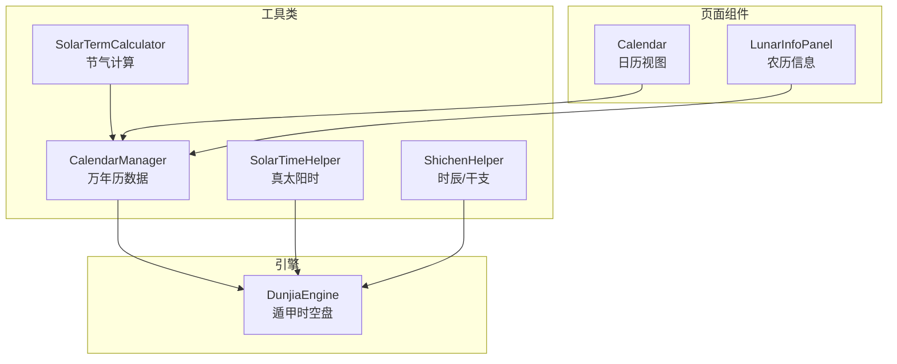
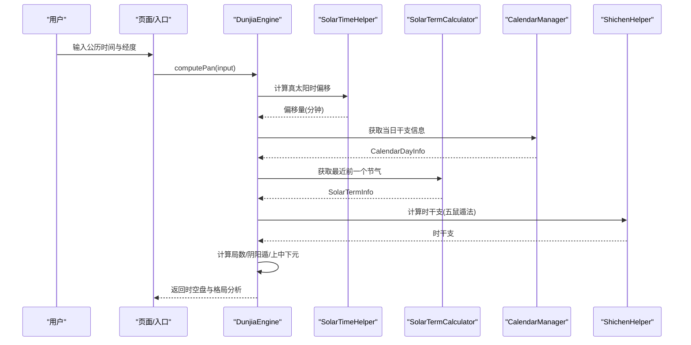
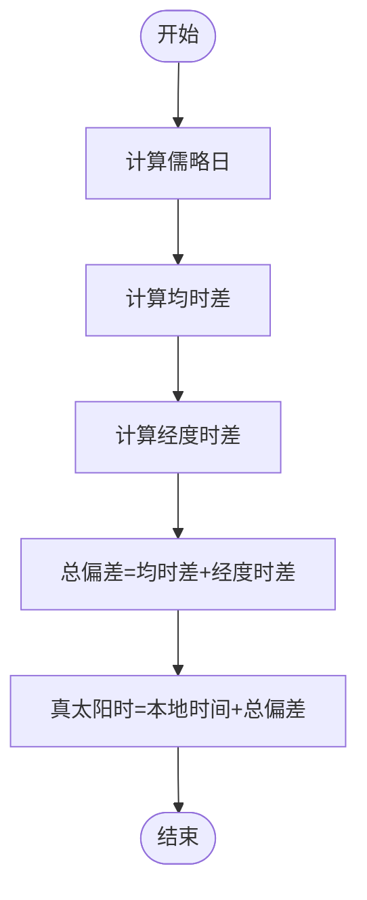
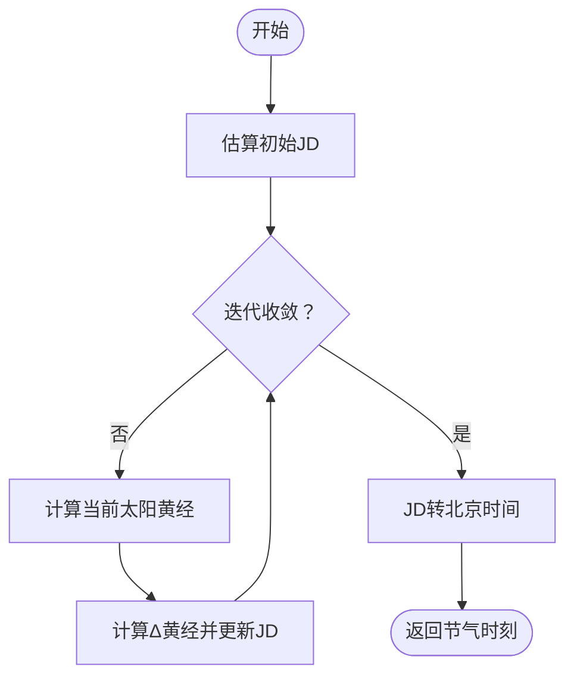
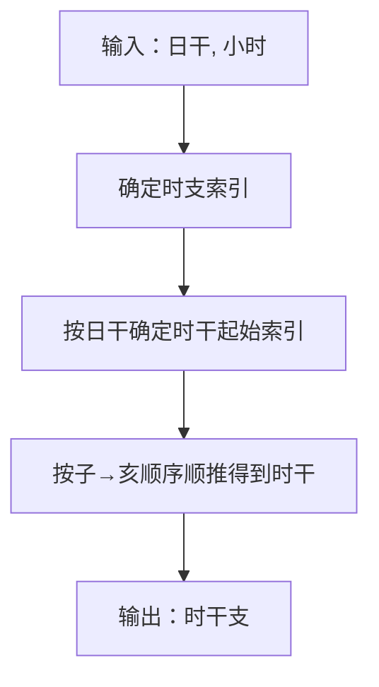
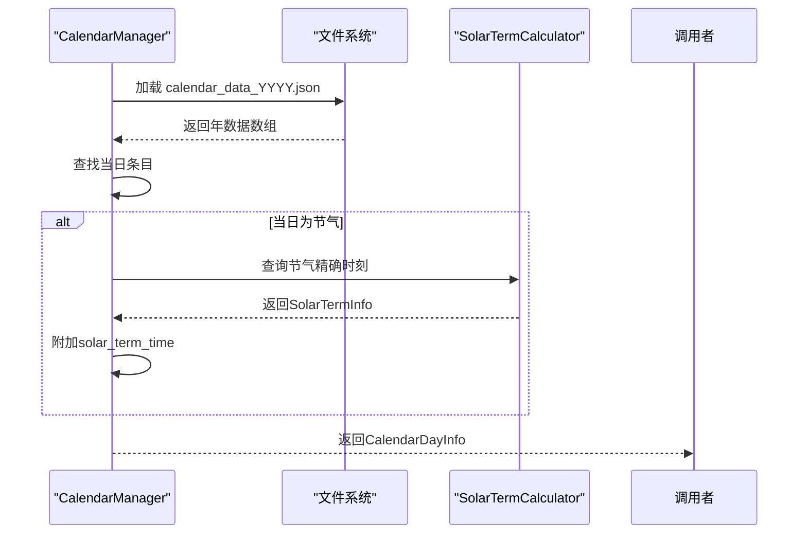
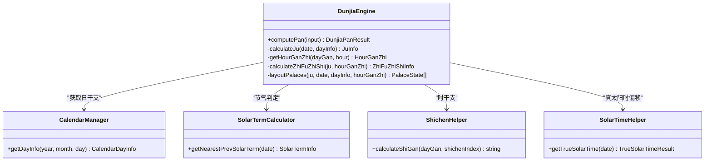
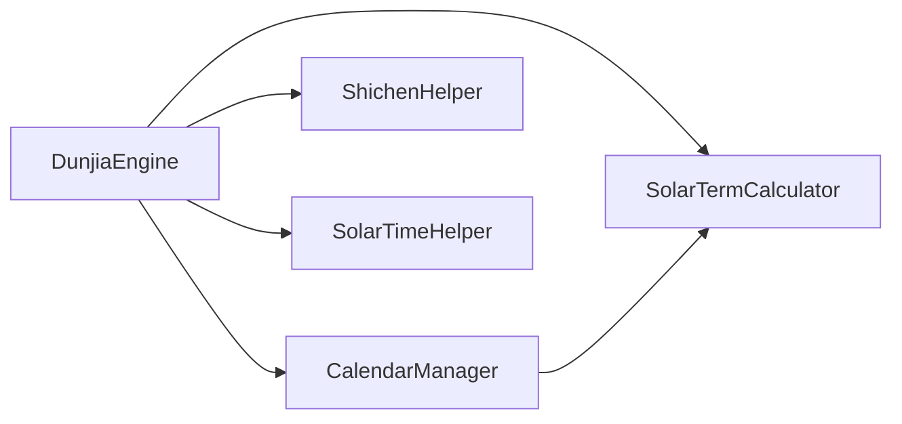

# 时间计算系统

<cite>
**本文引用的文件**
- [SolarTimeHelper.ets](file://entry/src/main/ets/utils/SolarTimeHelper.ets)
- [SolarTermCalculator.ets](file://entry/src/main/ets/utils/SolarTermCalculator.ets)
- [CalendarManager.ets](file://entry/src/main/ets/utils/CalendarManager.ets)
- [ShichenHelper.ets](file://entry/src/main/ets/utils/ShichenHelper.ets)
- [DunjiaEngine.ets](file://entry/src/main/ets/utils/DunjiaEngine.ets)
- [真太阳时讲解.md](file://entry/src/main/resources/rawfile/真太阳时讲解.md)
- [万年历json数据文件解读.md](file://entry/src/main/resources/rawfile/万年历json数据文件解读.md)
</cite>

## 目录
1. [简介](#简介)
2. [项目结构](#项目结构)
3. [核心组件](#核心组件)
4. [架构总览](#架构总览)
5. [详细组件分析](#详细组件分析)
6. [依赖关系分析](#依赖关系分析)
7. [性能考量](#性能考量)
8. [故障排查指南](#故障排查指南)
9. [结论](#结论)
10. [附录](#附录)

## 简介
本技术文档面向“遁甲时间计算系统”，聚焦以下核心能力：
- 真太阳时转换：经度偏移与均时差修正，支持多城市经纬度配置。
- 节气计算：二十四节气的精确时刻计算与缓存，支持跨年节气判定。
- 干支推演：日干支与时干支的计算规则，含“五鼠遁法”与时辰划分。
- 农历信息与公历到农历映射：通过万年历JSON数据提供干支、节日、节气等信息。
- 遁甲排盘：基于真太阳时、节气与干支的时空盘计算，支撑“阳遁/阴遁”“上/中/下元”“局数”等核心概念。

文档提供算法细节、复杂度分析、性能优化策略，并给出典型使用场景与调用流程图，帮助开发者快速集成与扩展。

## 项目结构
系统采用“工具类 + 引擎 + 页面组件”的分层组织：
- 工具类：真太阳时、节气、干支、农历管理
- 引擎：遁甲时空盘核心计算
- 页面组件：日历、详情面板等UI承载

图表来源
- [SolarTimeHelper.ets](file://entry/src/main/ets/utils/SolarTimeHelper.ets#L1-L270)
- [SolarTermCalculator.ets](file://entry/src/main/ets/utils/SolarTermCalculator.ets#L1-L375)
- [CalendarManager.ets](file://entry/src/main/ets/utils/CalendarManager.ets#L1-L123)
- [ShichenHelper.ets](file://entry/src/main/ets/utils/ShichenHelper.ets#L1-L114)
- [DunjiaEngine.ets](file://entry/src/main/ets/utils/DunjiaEngine.ets#L1-L200)

章节来源
- [SolarTimeHelper.ets](file://entry/src/main/ets/utils/SolarTimeHelper.ets#L1-L270)
- [SolarTermCalculator.ets](file://entry/src/main/ets/utils/SolarTermCalculator.ets#L1-L375)
- [CalendarManager.ets](file://entry/src/main/ets/utils/CalendarManager.ets#L1-L123)
- [ShichenHelper.ets](file://entry/src/main/ets/utils/ShichenHelper.ets#L1-L114)
- [DunjiaEngine.ets](file://entry/src/main/ets/utils/DunjiaEngine.ets#L1-L200)

## 核心组件
- 真太阳时工具：提供均时差、经度偏移、儒略日转换与格式化输出。
- 节气计算器：基于太阳黄经与牛顿迭代法计算24节气精确时刻，带缓存与跨年处理。
- 万年历管理：按年份分片加载JSON，附加节气精确时刻，提供日干支等信息。
- 时辰/干支助手：提供12时辰定义、五鼠遁法与时干计算。
- 遁甲引擎：整合时间、节气、干支与地理经度，计算遁甲时空盘与格局。

章节来源
- [SolarTimeHelper.ets](file://entry/src/main/ets/utils/SolarTimeHelper.ets#L21-L245)
- [SolarTermCalculator.ets](file://entry/src/main/ets/utils/SolarTermCalculator.ets#L23-L374)
- [CalendarManager.ets](file://entry/src/main/ets/utils/CalendarManager.ets#L5-L122)
- [ShichenHelper.ets](file://entry/src/main/ets/utils/ShichenHelper.ets#L5-L113)
- [DunjiaEngine.ets](file://entry/src/main/ets/utils/DunjiaEngine.ets#L21-L162)

## 架构总览
系统围绕“时间输入（公历+经度）”展开，依次经过真太阳时校正、节气判定、干支推演，最终进入遁甲排盘引擎生成时空盘与格局分析。

图表来源
- [DunjiaEngine.ets](file://entry/src/main/ets/utils/DunjiaEngine.ets#L113-L162)
- [SolarTimeHelper.ets](file://entry/src/main/ets/utils/SolarTimeHelper.ets#L54-L77)
- [SolarTermCalculator.ets](file://entry/src/main/ets/utils/SolarTermCalculator.ets#L143-L159)
- [CalendarManager.ets](file://entry/src/main/ets/utils/CalendarManager.ets#L51-L92)
- [ShichenHelper.ets](file://entry/src/main/ets/utils/ShichenHelper.ets#L59-L91)

## 详细组件分析

### 真太阳时转换算法
- 输入：本地时间（北京时间）与当地经度（东经为正）。
- 步骤：
  1) 计算儒略日（JD）。
  2) 计算均时差（Equation of Time），考虑地球轨道偏心率与黄赤交角。
  3) 计算经度时差：(当地经度 - 标准经度120°) × 4分钟/度。
  4) 总偏差 = 均时差 + 经度时差。
  5) 真太阳时 = 本地时间 + 总偏差（分钟）。
- 输出：真太阳时、均时差、经度偏差、总偏差。
- 多城市支持：内置中国主要城市经度常量，便于快速设置。

图表来源
- [SolarTimeHelper.ets](file://entry/src/main/ets/utils/SolarTimeHelper.ets#L54-L77)
- [真太阳时讲解.md](file://entry/src/main/resources/rawfile/真太阳时讲解.md#L166-L189)

章节来源
- [SolarTimeHelper.ets](file://entry/src/main/ets/utils/SolarTimeHelper.ets#L54-L202)
- [真太阳时讲解.md](file://entry/src/main/resources/rawfile/真太阳时讲解.md#L166-L235)

### 节气计算逻辑
- 依据太阳黄经与寿星天文历算法，24节气按15°间隔分布，小寒起始黄经285°。
- 计算流程：
  1) 估算初始儒略日（基于回归年与基准节气）。
  2) 牛顿迭代法求解目标黄经对应的JD，收敛阈值控制在微弧度级别。
  3) 将JD转换为北京时间（UTC+8）。
  4) 提供“当前日期是否为节气”“下一个节气”“最近前一个节气”等查询。
- 缓存策略：按年份缓存24节气结果，支持预加载与清理。

图表来源
- [SolarTermCalculator.ets](file://entry/src/main/ets/utils/SolarTermCalculator.ets#L167-L191)
- [SolarTermCalculator.ets](file://entry/src/main/ets/utils/SolarTermCalculator.ets#L199-L221)
- [SolarTermCalculator.ets](file://entry/src/main/ets/utils/SolarTermCalculator.ets#L228-L269)
- [SolarTermCalculator.ets](file://entry/src/main/ets/utils/SolarTermCalculator.ets#L276-L315)

章节来源
- [SolarTermCalculator.ets](file://entry/src/main/ets/utils/SolarTermCalculator.ets#L61-L159)
- [SolarTermCalculator.ets](file://entry/src/main/ets/utils/SolarTermCalculator.ets#L369-L374)
- [万年历json数据文件解读.md](file://entry/src/main/resources/rawfile/万年历json数据文件解读.md#L277-L401)

### 干支推演算法
- 日干支：来自万年历JSON数据（CalendarManager），引擎直接读取。
- 时干支（五鼠遁法）：
  - 12时辰划分：子时23:00-01:00，丑时01:00-03:00，依此类推。
  - 五鼠遁口诀：甲己还加甲，乙庚丙作初，丙辛从戊起，丁壬庚子居，戊癸何方发，壬子是真途。
  - 时干起始索引按日干决定，随后按子→亥顺序顺推。
- 时支与五行：提供时支名称、范围、五行属性，便于排盘与规则匹配。

图表来源
- [ShichenHelper.ets](file://entry/src/main/ets/utils/ShichenHelper.ets#L59-L91)
- [DunjiaEngine.ets](file://entry/src/main/ets/utils/DunjiaEngine.ets#L169-L198)

章节来源
- [ShichenHelper.ets](file://entry/src/main/ets/utils/ShichenHelper.ets#L14-L113)
- [DunjiaEngine.ets](file://entry/src/main/ets/utils/DunjiaEngine.ets#L169-L198)

### 农历信息与公历到农历映射
- 万年历数据按年分片存储（calendar_data_XXXX.json），CalendarManager按年份映射文件名并缓存。
- 附加节气精确时刻：当某日为节气时，自动查询并附加节气精确时刻（北京时间）。
- 输出字段包含：年/月/日、农历年/月/日、干支（年/月/日）、生肖、节日、节气名称等。

图表来源
- [CalendarManager.ets](file://entry/src/main/ets/utils/CalendarManager.ets#L51-L92)
- [万年历json数据文件解读.md](file://entry/src/main/resources/rawfile/万年历json数据文件解读.md#L303-L359)

章节来源
- [CalendarManager.ets](file://entry/src/main/ets/utils/CalendarManager.ets#L51-L122)
- [万年历json数据文件解读.md](file://entry/src/main/resources/rawfile/万年历json数据文件解读.md#L299-L359)

### 遁甲排盘核心流程
- 输入：公历时间（建议真太阳时）、经度、场景类型。
- 关键步骤：
  1) 获取当日干支（CalendarManager）。
  2) 计算局数：依据最近前一个节气、阴阳遁、上中下元（按日干地支的“仲孟季”）。
  3) 计算时干支（ShichenHelper + 五鼠遁法）。
  4) 计算值符/值使宫位：值符随“时干”飞布，值使随“时支”飞布，按阴阳遁顺逆与中宫跳过规则。
  5) 布局九宫：九星、八门、三奇六仪（天盘/地盘）、八神。
  6) 识别格局与规则命中，生成结构化分析摘要。
- 输出：遁甲时空盘、值符/值使宫位、九宫状态、格局与规则命中、日干支、时干支、真太阳时偏移量。

图表来源
- [DunjiaEngine.ets](file://entry/src/main/ets/utils/DunjiaEngine.ets#L113-L162)
- [CalendarManager.ets](file://entry/src/main/ets/utils/CalendarManager.ets#L51-L92)
- [SolarTermCalculator.ets](file://entry/src/main/ets/utils/SolarTermCalculator.ets#L143-L159)
- [ShichenHelper.ets](file://entry/src/main/ets/utils/ShichenHelper.ets#L59-L91)
- [SolarTimeHelper.ets](file://entry/src/main/ets/utils/SolarTimeHelper.ets#L54-L77)

章节来源
- [DunjiaEngine.ets](file://entry/src/main/ets/utils/DunjiaEngine.ets#L113-L162)
- [DunjiaEngine.ets](file://entry/src/main/ets/utils/DunjiaEngine.ets#L256-L353)
- [DunjiaEngine.ets](file://entry/src/main/ets/utils/DunjiaEngine.ets#L358-L600)

## 依赖关系分析
- DunjiaEngine 依赖 CalendarManager（日干支）、SolarTermCalculator（节气）、ShichenHelper（时干支）、SolarTimeHelper（真太阳时偏移）。
- CalendarManager 依赖 SolarTermCalculator（节气精确时刻附加）。
- SolarTermCalculator 为纯数学计算，无外部依赖；SolarTimeHelper 亦为纯数学计算。
- 页面组件（Calendar、LunarInfoPanel）依赖 CalendarManager 提供的数据。

图表来源
- [DunjiaEngine.ets](file://entry/src/main/ets/utils/DunjiaEngine.ets#L4-L6)
- [CalendarManager.ets](file://entry/src/main/ets/utils/CalendarManager.ets#L1-L3)

章节来源
- [DunjiaEngine.ets](file://entry/src/main/ets/utils/DunjiaEngine.ets#L4-L6)
- [CalendarManager.ets](file://entry/src/main/ets/utils/CalendarManager.ets#L1-L3)

## 性能考量
- 节气计算
  - 复杂度：每次计算单个节气为O(k)，k为牛顿迭代次数（通常≤5），整体O(1)。
  - 缓存：按年缓存24节气结果，避免重复计算；支持预加载与清理。
  - 精度：±2分钟，满足遁甲排盘需求。
- 真太阳时
  - 复杂度：O(1)，包含三角函数与儒略日转换。
  - 适用性：对高频调用可考虑缓存结果（如同一分钟内多次请求）。
- 万年历数据
  - 复杂度：按年分片加载，单次查找O(1)（哈希映射文件名）+ O(n)遍历年数据（n≈366）。
  - 优化：按需预加载（preloadYears），减少首次访问延迟。
- 干支与时辰
  - 复杂度：O(1)，数组索引与常量查找。
- 排盘引擎
  - 复杂度：O(1)，固定九宫布局与规则匹配；若引入大规模规则库，需注意匹配成本。

优化建议
- 预热：启动时预加载常用年份节气数据（如前后5年）。
- 缓存：对高频查询（如当前日期）增加内存缓存。
- 批处理：批量渲染日历页时一次性获取所需日期的干支与节气信息。
- 异步：CalendarManager 的JSON加载已为异步，保持调用链异步化以避免阻塞UI。

章节来源
- [SolarTermCalculator.ets](file://entry/src/main/ets/utils/SolarTermCalculator.ets#L369-L374)
- [CalendarManager.ets](file://entry/src/main/ets/utils/CalendarManager.ets#L94-L109)
- [DunjiaEngine.ets](file://entry/src/main/ets/utils/DunjiaEngine.ets#L113-L162)

## 故障排查指南
- 真太阳时异常
  - 检查经度输入是否为东经为正、西经为负。
  - 核对本地时间是否为北京时间（需先进行真太阳时校正再进入排盘）。
  - 若出现“快/慢”描述异常，检查均时差与经度时差符号。
- 节气判定错误
  - 确认日期是否跨年（小寒/大寒在1月初），使用“最近前一个节气”接口。
  - 检查SolarTermCalculator缓存是否被清理，必要时调用clearCache。
- 时干支不符
  - 确认日干字符串是否在合法集合内（甲、乙、丙、丁、戊、己、庚、辛、壬、癸）。
  - 检查ShichenHelper的getCurrentShichenIndex逻辑与小时边界（23点归子时）。
- 万年历数据缺失
  - 年份超出支持范围（1900-2060）或文件名映射失败。
  - 确认资源路径与文件存在，查看loadJson异常日志。
- 排盘结果异常
  - 检查输入时间是否为真太阳时（建议先调用SolarTimeHelper校正）。
  - 确认节气名称与局数映射表是否匹配（冬至/夏至等关键节点）。

章节来源
- [SolarTimeHelper.ets](file://entry/src/main/ets/utils/SolarTimeHelper.ets#L97-L108)
- [SolarTermCalculator.ets](file://entry/src/main/ets/utils/SolarTermCalculator.ets#L93-L115)
- [ShichenHelper.ets](file://entry/src/main/ets/utils/ShichenHelper.ets#L44-L52)
- [CalendarManager.ets](file://entry/src/main/ets/utils/CalendarManager.ets#L94-L109)
- [DunjiaEngine.ets](file://entry/src/main/ets/utils/DunjiaEngine.ets#L256-L289)

## 结论
本系统以“真太阳时 + 节气 + 干支”为核心时间基座，结合遁甲排盘规则，形成完整的时空盘计算链路。通过模块化设计与缓存策略，兼顾了精度与性能。建议在生产环境中：
- 统一使用真太阳时作为输入；
- 预加载常用年份节气数据；
- 对高频查询进行缓存；
- 保持调用链异步化，确保UI流畅。

## 附录
- 使用场景示例
  - 通用研习：输入公历时间与经度，获取遁甲时空盘与格局分析。
  - 时机窗口研习：结合节气与值符/值使飞布，识别有利时段。
  - 局势/布局类研习：按上/中/下元与局数，分析宫位与要素组合。
- 关键API路径
  - 真太阳时：[SolarTimeHelper.getTrueSolarTime](file://entry/src/main/ets/utils/SolarTimeHelper.ets#L54-L77)
  - 节气：[SolarTermCalculator.calculate24Terms](file://entry/src/main/ets/utils/SolarTermCalculator.ets#L61-L86)、[getNextSolarTerm](file://entry/src/main/ets/utils/SolarTermCalculator.ets#L122-L136)
  - 日干支：[CalendarManager.getDayInfo](file://entry/src/main/ets/utils/CalendarManager.ets#L51-L92)
  - 时干支：[ShichenHelper.calculateShiGan](file://entry/src/main/ets/utils/ShichenHelper.ets#L59-L91)
  - 排盘：[DunjiaEngine.computePan](file://entry/src/main/ets/utils/DunjiaEngine.ets#L113-L162)