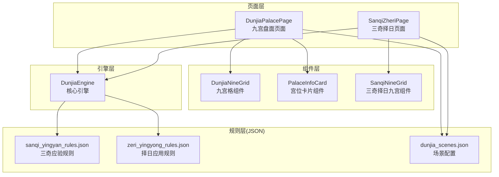
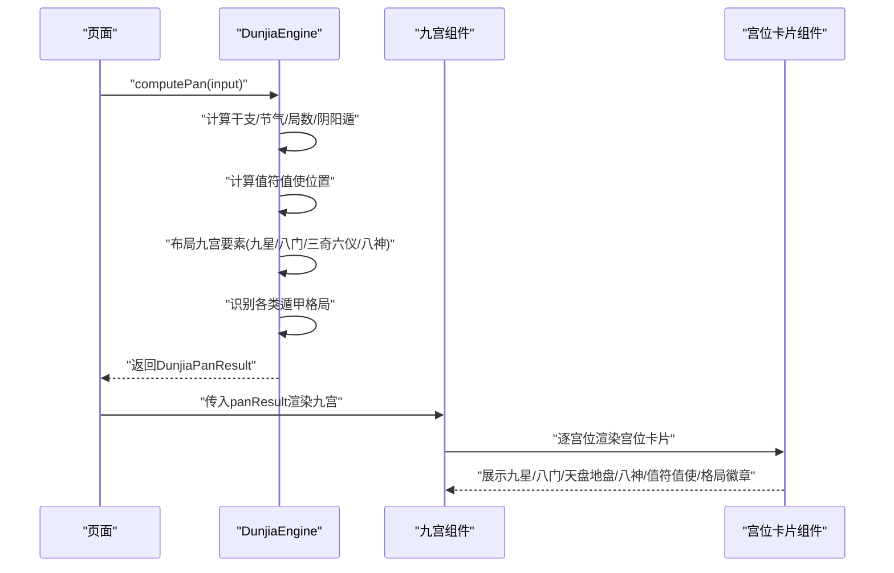
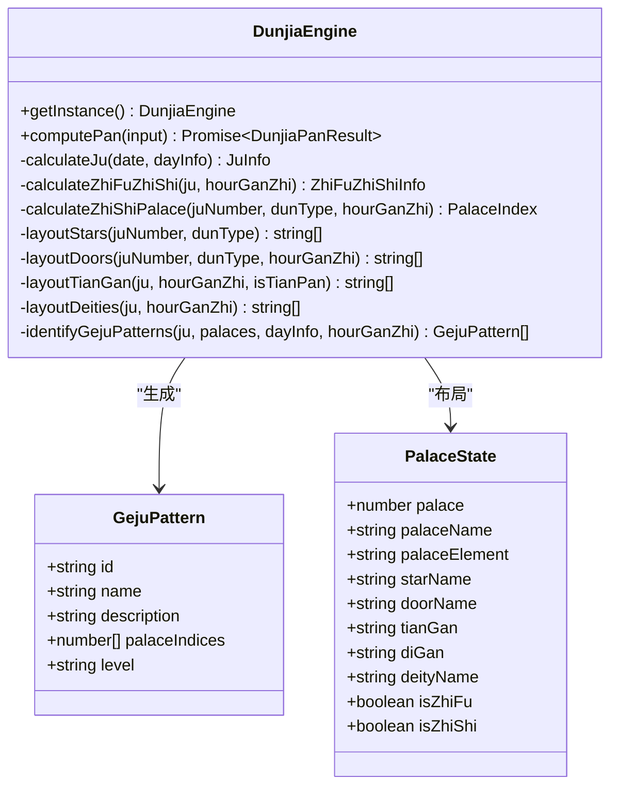
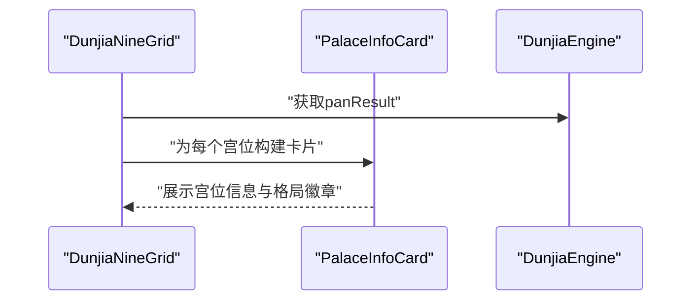
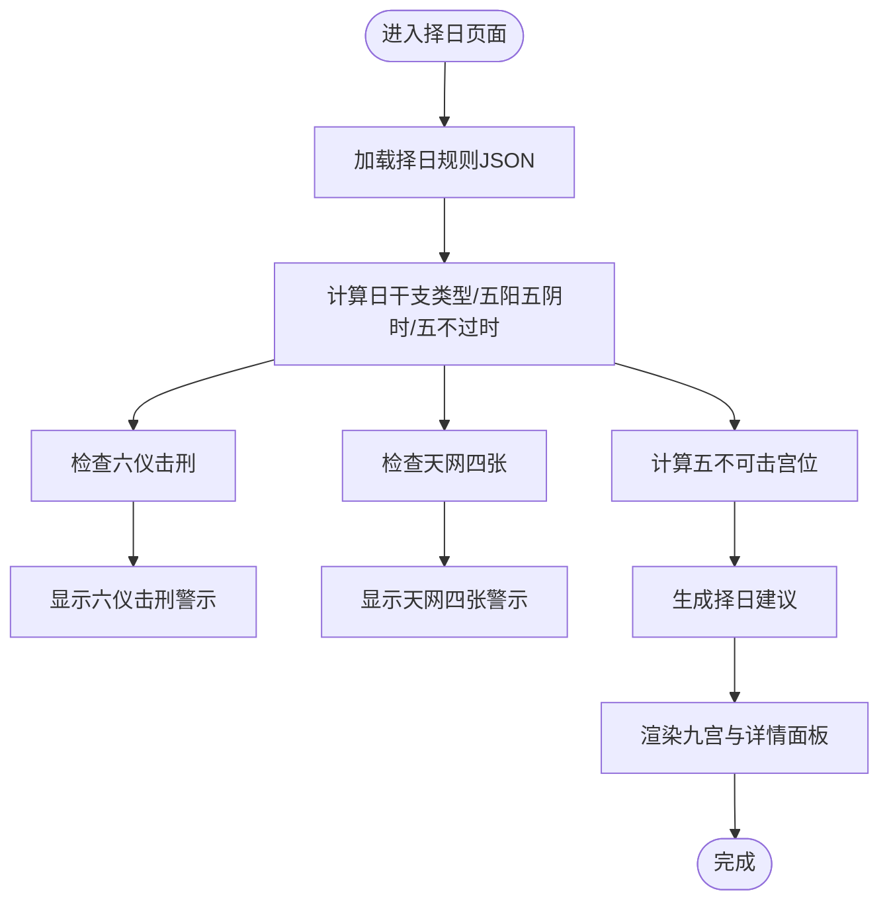
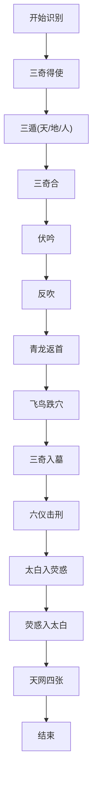
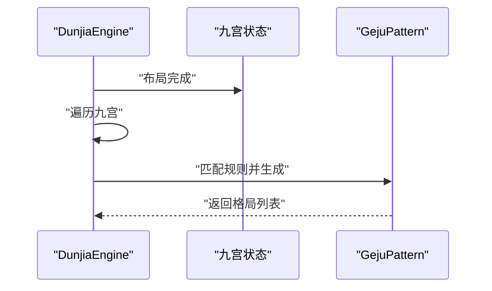
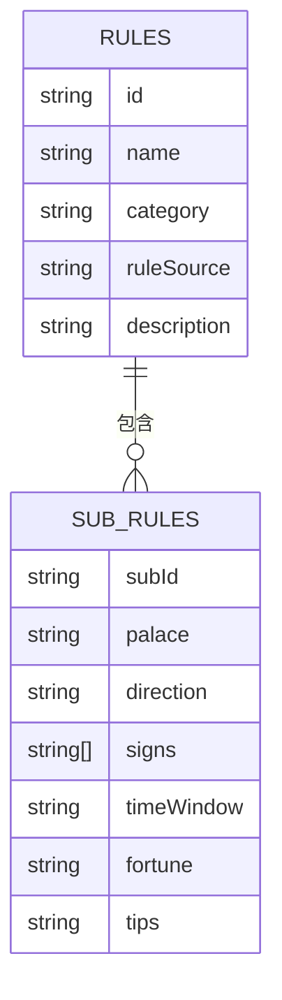
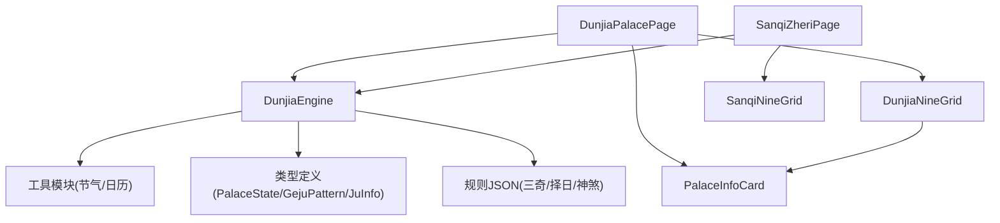

# 格局识别系统

<cite>
**本文档引用的文件**
- [DunjiaEngine.ets](file://entry/src/main/ets/utils/DunjiaEngine.ets)
- [DunjiaNineGrid.ets](file://entry/src/main/ets/components/DunjiaNineGrid.ets)
- [PalaceInfoCard.ets](file://entry/src/main/ets/components/PalaceInfoCard.ets)
- [SanqiNineGrid.ets](file://entry/src/main/ets/components/SanqiNineGrid.ets)
- [DunjiaPalacePage.ets](file://entry/src/main/ets/pages/DunjiaPalacePage.ets)
- [SanqiZheriPage.ets](file://entry/src/main/ets/pages/SanqiZheriPage.ets)
- [sanqi_yingyan_rules.json](file://entry/src/main/resources/rawfile/rules/sanqi_yingyan_rules.json)
- [zeri_yingyong_rules.json](file://entry/src/main/resources/rawfile/rules/zeri_yingyong_rules.json)
- [dunjia_scenes.json](file://entry/src/main/resources/rawfile/dunjia_scenes.json)
</cite>

## 目录
1. [简介](#简介)
2. [项目结构](#项目结构)
3. [核心组件](#核心组件)
4. [架构总览](#架构总览)
5. [详细组件分析](#详细组件分析)
6. [依赖关系分析](#依赖关系分析)
7. [性能考量](#性能考量)
8. [故障排除指南](#故障排除指南)
9. [结论](#结论)
10. [附录](#附录)

## 简介
本项目为遁甲格局识别系统，基于《遁甲符应经》规则实现，提供从时间与地理坐标计算九宫盘面、布列九星、八门、三奇六仪、八神等要素，并自动识别多种遁甲格局（如三奇得使、三遁、三奇合、伏吟、反吹、青龙返首、飞鸟跌穴、三奇入墓、六仪击刑、太白入荧惑、荧惑入太白、天网四张等），形成结构化分析结果与研习建议。系统采用ArkTS技术栈，页面层通过组件化渲染九宫盘面，规则层以JSON配置驱动，引擎层统一调度计算。

## 项目结构
系统采用分层架构：
- 页面层：负责用户交互与视图渲染，如九宫盘面展示、宫位详情、择日建议等。
- 组件层：封装可复用的UI组件，如九宫格、宫位卡片、详情面板等。
- 引擎层：核心计算引擎，负责时间节气计算、局数与阴阳遁判断、值符值使定位、九宫要素布局、格局识别等。
- 规则层：以JSON文件承载《遁甲符应经》及相关中卷、下卷规则，支持三奇应验、择日应用、神煞等。

**图表来源**
- [DunjiaPalacePage.ets](file://entry/src/main/ets/pages/DunjiaPalacePage.ets#L82-L115)
- [SanqiZheriPage.ets](file://entry/src/main/ets/pages/SanqiZheriPage.ets#L76-L112)
- [DunjiaNineGrid.ets](file://entry/src/main/ets/components/DunjiaNineGrid.ets#L23-L70)
- [PalaceInfoCard.ets](file://entry/src/main/ets/components/PalaceInfoCard.ets#L22-L50)
- [SanqiNineGrid.ets](file://entry/src/main/ets/components/SanqiNineGrid.ets#L16-L66)
- [DunjiaEngine.ets](file://entry/src/main/ets/utils/DunjiaEngine.ets#L98-L162)
- [sanqi_yingyan_rules.json](file://entry/src/main/resources/rawfile/rules/sanqi_yingyan_rules.json#L1-L525)
- [zeri_yingyong_rules.json](file://entry/src/main/resources/rawfile/rules/zeri_yingyong_rules.json#L1-L145)
- [dunjia_scenes.json](file://entry/src/main/resources/rawfile/dunjia_scenes.json#L1-L50)

**章节来源**
- [DunjiaEngine.ets](file://entry/src/main/ets/utils/DunjiaEngine.ets#L98-L162)
- [DunjiaNineGrid.ets](file://entry/src/main/ets/components/DunjiaNineGrid.ets#L23-L70)
- [PalaceInfoCard.ets](file://entry/src/main/ets/components/PalaceInfoCard.ets#L22-L50)
- [SanqiNineGrid.ets](file://entry/src/main/ets/components/SanqiNineGrid.ets#L16-L66)
- [DunjiaPalacePage.ets](file://entry/src/main/ets/pages/DunjiaPalacePage.ets#L82-L115)
- [SanqiZheriPage.ets](file://entry/src/main/ets/pages/SanqiZheriPage.ets#L76-L112)
- [sanqi_yingyan_rules.json](file://entry/src/main/resources/rawfile/rules/sanqi_yingyan_rules.json#L1-L525)
- [zeri_yingyong_rules.json](file://entry/src/main/resources/rawfile/rules/zeri_yingyong_rules.json#L1-L145)
- [dunjia_scenes.json](file://entry/src/main/resources/rawfile/dunjia_scenes.json#L1-L50)

## 核心组件
- DunjiaEngine：核心引擎，负责时间节气计算、局数与阴阳遁判断、值符值使定位、九宫要素布局、格局识别与结果组装。
- DunjiaNineGrid：九宫格组件，渲染九宫盘面，展示时间、局数、宫位信息与格局徽章。
- PalaceInfoCard：宫位卡片组件，展示九星、八门、天盘地盘干支、八神、值符值使标识与格局徽章。
- SanqiNineGrid：三奇择日九宫组件，突出三奇（乙丙丁）标识，弱化八神与格局徽章，强调应验方位。
- DunjiaPalacePage：九宫盘面页面，负责页面状态管理、组件组合、用神映射与三奇应验规则加载与筛选。
- SanqiZheriPage：三奇择日页面，负责择日信息展示、五阳五阴时判断、五不过时检查、六仪击刑与天网四张警示、五不可击宫位提示等。

**章节来源**
- [DunjiaEngine.ets](file://entry/src/main/ets/utils/DunjiaEngine.ets#L98-L162)
- [DunjiaNineGrid.ets](file://entry/src/main/ets/components/DunjiaNineGrid.ets#L23-L70)
- [PalaceInfoCard.ets](file://entry/src/main/ets/components/PalaceInfoCard.ets#L22-L50)
- [SanqiNineGrid.ets](file://entry/src/main/ets/components/SanqiNineGrid.ets#L16-L66)
- [DunjiaPalacePage.ets](file://entry/src/main/ets/pages/DunjiaPalacePage.ets#L82-L115)
- [SanqiZheriPage.ets](file://entry/src/main/ets/pages/SanqiZheriPage.ets#L76-L112)

## 架构总览
系统采用“页面-组件-引擎-规则”的分层设计。页面通过引擎计算得到完整的盘面结果，组件负责渲染与交互；规则层以JSON文件提供结构化规则，引擎在识别阶段按规则匹配并生成格局列表。

**图表来源**
- [DunjiaEngine.ets](file://entry/src/main/ets/utils/DunjiaEngine.ets#L113-L162)
- [DunjiaNineGrid.ets](file://entry/src/main/ets/components/DunjiaNineGrid.ets#L72-L177)
- [PalaceInfoCard.ets](file://entry/src/main/ets/components/PalaceInfoCard.ets#L50-L179)

**章节来源**
- [DunjiaEngine.ets](file://entry/src/main/ets/utils/DunjiaEngine.ets#L113-L162)
- [DunjiaNineGrid.ets](file://entry/src/main/ets/components/DunjiaNineGrid.ets#L72-L177)
- [PalaceInfoCard.ets](file://entry/src/main/ets/components/PalaceInfoCard.ets#L50-L179)

## 详细组件分析

### 核心引擎：DunjiaEngine
- 输入输出：接收时间、经度、研习场景类型，输出包含阴阳遁、局数、值符值使、九宫状态、规则命中、结构评估与识别的格局列表等。
- 关键算法：
  - 局数与阴阳遁：根据节气与地支仲孟季判断上中下元，查表确定局数。
  - 值符值使：值符随“时干”顺逆飞布（阳遁顺飞、阴遁逆飞），值使随“时支”从休门/景门起按门飞布。
  - 九宫布局：固定九星与八门地盘对应，天盘三奇六仪按阴阳遁与局数顺逆布列，地盘按固定规则布置，八神围绕值符定位。
  - 格局识别：遍历九宫，按规则匹配识别三奇得使、三遁、三奇合、伏吟、反吹、青龙返首、飞鸟跌穴、三奇入墓、六仪击刑、太白入荧惑、荧惑入太白、天网四张等。
- 结果组织：返回GejuPattern数组，包含id、名称、描述、涉及宫位索引、级别（次要/主要/特殊）。

**图表来源**
- [DunjiaEngine.ets](file://entry/src/main/ets/utils/DunjiaEngine.ets#L98-L162)
- [DunjiaEngine.ets](file://entry/src/main/ets/utils/DunjiaEngine.ets#L678-L936)

**章节来源**
- [DunjiaEngine.ets](file://entry/src/main/ets/utils/DunjiaEngine.ets#L98-L162)
- [DunjiaEngine.ets](file://entry/src/main/ets/utils/DunjiaEngine.ets#L678-L936)

### 九宫组件：DunjiaNineGrid 与 PalaceInfoCard
- DunjiaNineGrid：渲染时间、局数、值符值使、九宫格，支持宫位点击事件，按宫位索引展示格局名称列表。
- PalaceInfoCard：渲染单宫位信息（宫名、九星、八门、天盘地盘干支、八神、值符值使角标），并根据格局名称设置徽章颜色。

**图表来源**
- [DunjiaNineGrid.ets](file://entry/src/main/ets/components/DunjiaNineGrid.ets#L41-L70)
- [PalaceInfoCard.ets](file://entry/src/main/ets/components/PalaceInfoCard.ets#L50-L179)

**章节来源**
- [DunjiaNineGrid.ets](file://entry/src/main/ets/components/DunjiaNineGrid.ets#L41-L70)
- [PalaceInfoCard.ets](file://entry/src/main/ets/components/PalaceInfoCard.ets#L50-L179)

### 择日组件：SanqiNineGrid 与 SanqiZheriPage
- SanqiNineGrid：突出三奇（乙/丙/丁）标识，弱化八神与格局徽章，强调应验方位与宫位。
- SanqiZheriPage：加载择日规则JSON，计算日干支类型（宝/义/制/和/伐）、五阳五阴时、五不过时、六仪击刑、天网四张、五不可击宫位等，并提供择日建议。

**图表来源**
- [SanqiZheriPage.ets](file://entry/src/main/ets/pages/SanqiZheriPage.ets#L117-L134)
- [SanqiZheriPage.ets](file://entry/src/main/ets/pages/SanqiZheriPage.ets#L429-L455)
- [SanqiNineGrid.ets](file://entry/src/main/ets/components/SanqiNineGrid.ets#L25-L106)

**章节来源**
- [SanqiNineGrid.ets](file://entry/src/main/ets/components/SanqiNineGrid.ets#L25-L106)
- [SanqiZheriPage.ets](file://entry/src/main/ets/pages/SanqiZheriPage.ets#L117-L134)
- [SanqiZheriPage.ets](file://entry/src/main/ets/pages/SanqiZheriPage.ets#L429-L455)

### 格局识别算法与优先级

#### 识别算法总览
引擎在完成九宫布局后，遍历九宫状态，按以下规则逐一匹配并生成GejuPattern：

- 三奇得使：值使门宫位与天盘三奇（乙/丙/丁）重合，标记为主要格局。
- 三遁：生门+丙奇（天遁）、开门+乙奇（地遁）、休门+丁奇（人遁），标记为主要格局。
- 三奇合：同一宫位天盘地盘三奇齐全，标记为主要格局。
- 伏吟：天盘地盘干支相同，标记为次要格局。
- 反吹：天盘/地盘两宫干支构成特定对冲组合，标记为次要格局。
- 青龙返首：天盘甲/戊/己与地盘丙组合，标记为特殊格局。
- 飞鸟跌穴：天盘丙与地盘甲/戊/己组合，标记为特殊格局。
- 三奇入墓：乙奇入坤宫（木墓未位在坤）、丙/丁奇入戌宫（火墓），标记为主要格局。
- 六仪击刑：仅在甲日系列按特定时支判断，标记为主要格局。
- 太白入荧惑：天盘庚与地盘丙组合，标记为主要格局。
- 荧惑入太白：天盘丙与地盘庚组合，标记为次要格局。
- 天网四张：简化为“时干癸”，标记为主要格局。

**图表来源**
- [DunjiaEngine.ets](file://entry/src/main/ets/utils/DunjiaEngine.ets#L678-L936)

**章节来源**
- [DunjiaEngine.ets](file://entry/src/main/ets/utils/DunjiaEngine.ets#L678-L936)

#### 格局级别分类标准
- 次要：伏吟、反吹、荧惑入太白等，通常表示静守、反复或局部不利。
- 主要：三奇得使、三遁、三奇合、三奇入墓、六仪击刑、太白入荧惑、天网四张等，表示明显的吉凶倾向或强时段。
- 特殊：青龙返首、飞鸟跌穴等，表示特定的吉象或特殊应验。

**章节来源**
- [DunjiaEngine.ets](file://entry/src/main/ets/utils/DunjiaEngine.ets#L678-L936)

#### 组合规则与优先级
- 多个格局同时出现时，系统按顺序逐一识别并合并为GejuPattern数组，不进行相互抵消或优先级替换。
- UI层通过宫位索引聚合显示，便于研习者理解多重格局共现的结构特征。

**章节来源**
- [DunjiaEngine.ets](file://entry/src/main/ets/utils/DunjiaEngine.ets#L678-L936)
- [DunjiaNineGrid.ets](file://entry/src/main/ets/components/DunjiaNineGrid.ets#L41-L46)

#### 识别示例与算法流程
- 示例：某日时，值使门落在某宫，天盘三奇与值使门重合，则识别为“三奇得使”。
- 流程：布局九宫→遍历九宫→按规则匹配→生成格局列表→渲染UI。

**图表来源**
- [DunjiaEngine.ets](file://entry/src/main/ets/utils/DunjiaEngine.ets#L678-L936)

**章节来源**
- [DunjiaEngine.ets](file://entry/src/main/ets/utils/DunjiaEngine.ets#L678-L936)

### 规则数据库设计与扩展

#### 数据结构
- 规则文件采用JSON结构，包含规则标题、卷次、规则条目、子规则与元信息。
- 三奇应验规则：按日奇/月奇/星奇分类，每类包含宫位、方向、征兆、时间窗口、吉凶、提示与事类象意。
- 择日应用规则：包含干支择日类型（宝/义/制/和/伐）、五阳五阴时、天门地户玉女等。

**图表来源**
- [sanqi_yingyan_rules.json](file://entry/src/main/resources/rawfile/rules/sanqi_yingyan_rules.json#L1-L525)
- [zeri_yingyong_rules.json](file://entry/src/main/resources/rawfile/rules/zeri_yingyong_rules.json#L1-L145)

**章节来源**
- [sanqi_yingyan_rules.json](file://entry/src/main/resources/rawfile/rules/sanqi_yingyan_rules.json#L1-L525)
- [zeri_yingyong_rules.json](file://entry/src/main/resources/rawfile/rules/zeri_yingyong_rules.json#L1-L145)

#### 扩展方法
- 新增规则：在对应JSON文件中添加新规则条目，遵循现有字段命名与层级结构。
- 引擎适配：在DunjiaEngine中新增识别分支，确保与新规则匹配逻辑一致。
- 页面集成：在页面组件中加载并展示新规则，必要时扩展UI组件以支持新字段。

**章节来源**
- [DunjiaPalacePage.ets](file://entry/src/main/ets/pages/DunjiaPalacePage.ets#L118-L181)
- [SanqiZheriPage.ets](file://entry/src/main/ets/pages/SanqiZheriPage.ets#L136-L295)

## 依赖关系分析

**图表来源**
- [DunjiaEngine.ets](file://entry/src/main/ets/utils/DunjiaEngine.ets#L4-L6)
- [DunjiaPalacePage.ets](file://entry/src/main/ets/pages/DunjiaPalacePage.ets#L1-L6)
- [SanqiZheriPage.ets](file://entry/src/main/ets/pages/SanqiZheriPage.ets#L1-L5)
- [DunjiaNineGrid.ets](file://entry/src/main/ets/components/DunjiaNineGrid.ets#L1-L4)
- [PalaceInfoCard.ets](file://entry/src/main/ets/components/PalaceInfoCard.ets#L1-L4)
- [SanqiNineGrid.ets](file://entry/src/main/ets/components/SanqiNineGrid.ets#L1-L4)

**章节来源**
- [DunjiaEngine.ets](file://entry/src/main/ets/utils/DunjiaEngine.ets#L4-L6)
- [DunjiaPalacePage.ets](file://entry/src/main/ets/pages/DunjiaPalacePage.ets#L1-L6)
- [SanqiZheriPage.ets](file://entry/src/main/ets/pages/SanqiZheriPage.ets#L1-L5)
- [DunjiaNineGrid.ets](file://entry/src/main/ets/components/DunjiaNineGrid.ets#L1-L4)
- [PalaceInfoCard.ets](file://entry/src/main/ets/components/PalaceInfoCard.ets#L1-L4)
- [SanqiNineGrid.ets](file://entry/src/main/ets/components/SanqiNineGrid.ets#L1-L4)

## 性能考量
- 计算复杂度：九宫固定为9宫，识别算法为线性扫描，整体复杂度O(1)，性能开销极低。
- I/O优化：规则JSON在页面首次加载时缓存，避免重复解析；组件按需渲染，减少不必要的重绘。
- 异步计算：排盘计算采用异步方法，避免阻塞UI线程；页面提供加载状态提示。

[本节为通用指导，无需特定文件分析]

## 故障排除指南
- 无法获取干支信息：引擎返回空盘，页面显示占位信息；检查日历工具与网络权限。
- 规则加载失败：页面捕获异常并记录错误日志；检查JSON文件路径与编码。
- 识别结果为空：确认输入时间与经度有效，检查节气与局数计算逻辑。
- UI渲染异常：检查组件Props传递与样式配置，确保宫位索引与九宫布局一致。

**章节来源**
- [DunjiaEngine.ets](file://entry/src/main/ets/utils/DunjiaEngine.ets#L613-L639)
- [DunjiaPalacePage.ets](file://entry/src/main/ets/pages/DunjiaPalacePage.ets#L142-L148)
- [SanqiZheriPage.ets](file://entry/src/main/ets/pages/SanqiZheriPage.ets#L167-L181)

## 结论
本系统以DunjiaEngine为核心，结合组件化UI与结构化规则JSON，实现了从时间地理到九宫盘面与格局识别的完整流程。通过清晰的分层设计与可扩展的规则机制，既满足研习需求，也为后续扩展更多遁甲格局与应用规则提供了良好基础。

[本节为总结性内容，无需特定文件分析]

## 附录

### 场景配置
- 场景定义包含标题、副标题、摘要、难度等级与标签，用于引导用户选择合适的学习路径。

**章节来源**
- [dunjia_scenes.json](file://entry/src/main/resources/rawfile/dunjia_scenes.json#L1-L50)