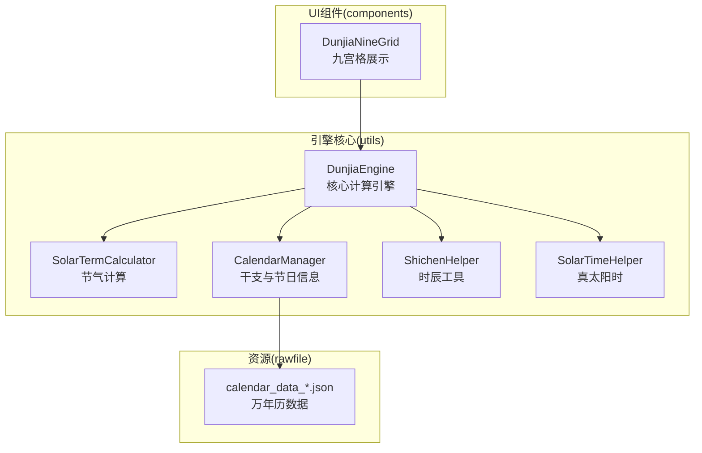
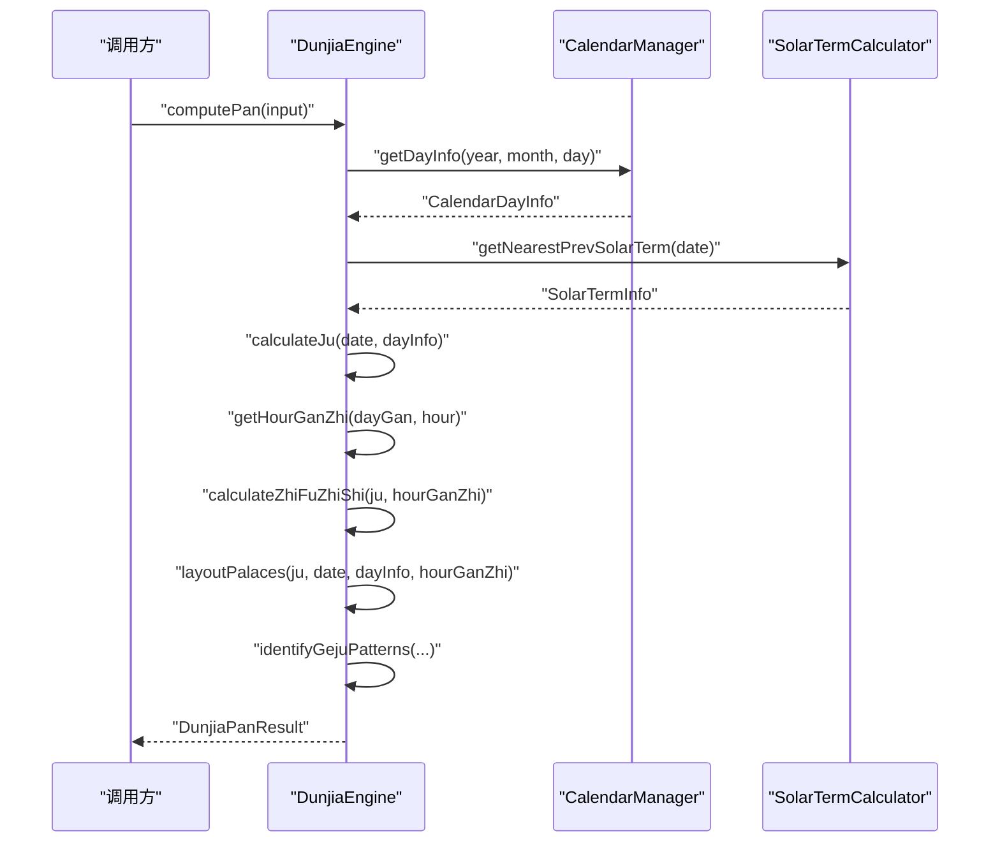
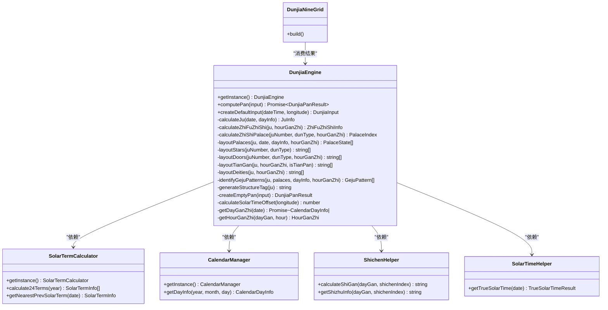
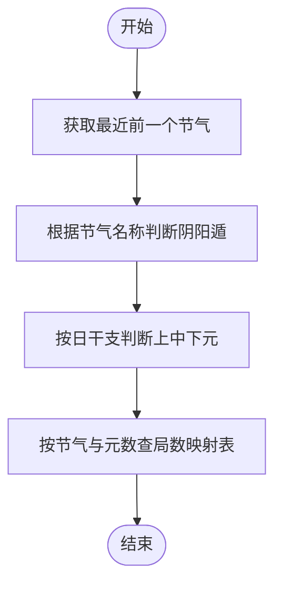
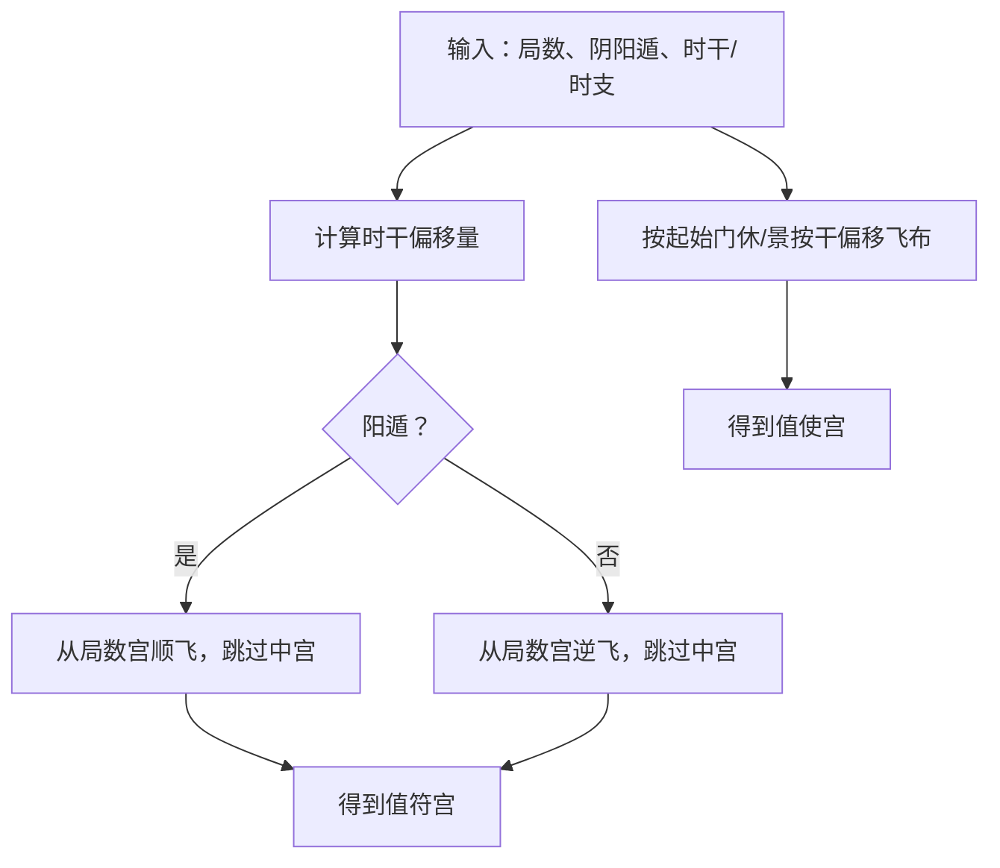
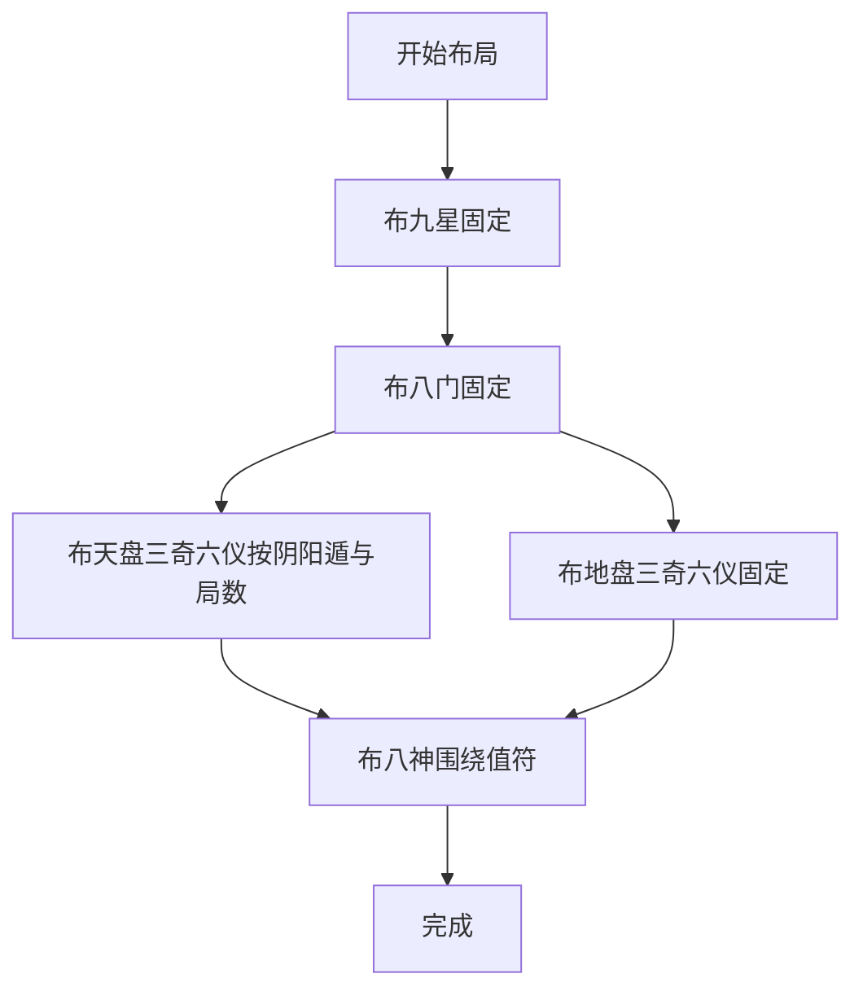
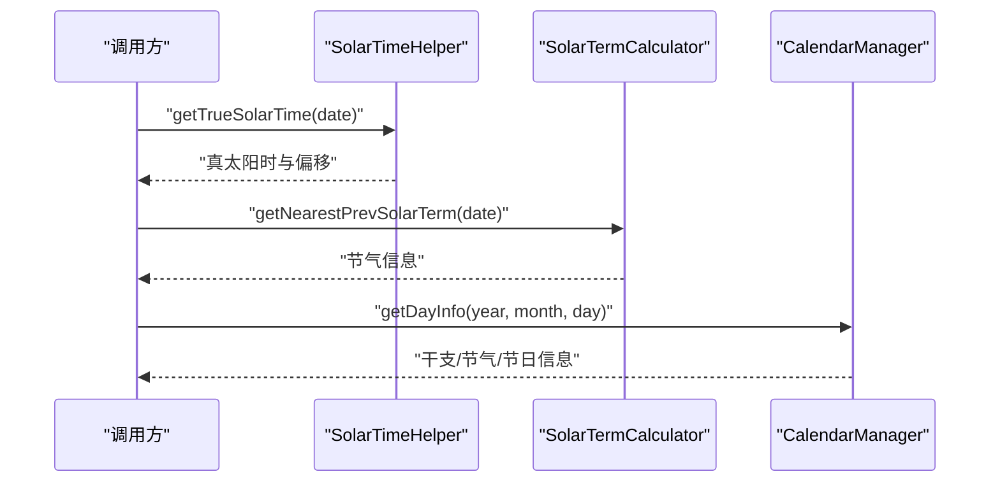
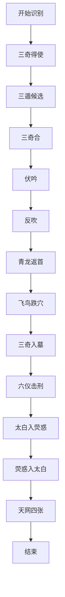
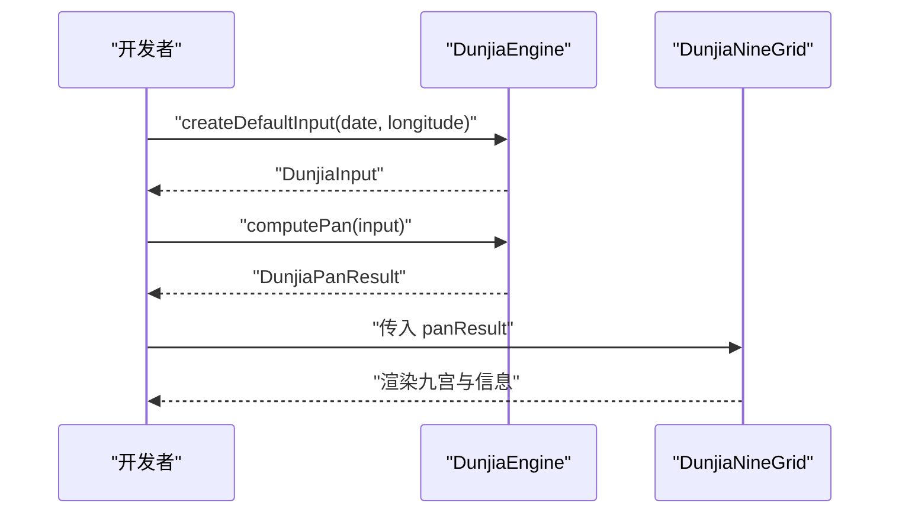
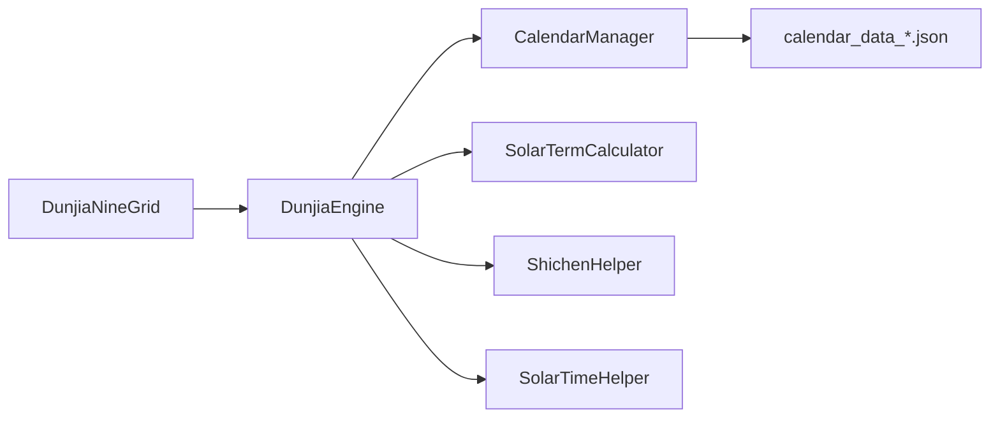

# 遁甲引擎核心

<cite>
**本文引用的文件**
- [DunjiaEngine.ets](file://entry/src/main/ets/utils/DunjiaEngine.ets)
- [SolarTermCalculator.ets](file://entry/src/main/ets/utils/SolarTermCalculator.ets)
- [CalendarManager.ets](file://entry/src/main/ets/utils/CalendarManager.ets)
- [ShichenHelper.ets](file://entry/src/main/ets/utils/ShichenHelper.ets)
- [SolarTimeHelper.ets](file://entry/src/main/ets/utils/SolarTimeHelper.ets)
- [DunjiaNineGrid.ets](file://entry/src/main/ets/components/DunjiaNineGrid.ets)
- [calendar_data_0001.json](file://entry/src/main/resources/rawfile/calendar/calendar_data_0001.json)
</cite>

## 目录
1. [简介](#简介)
2. [项目结构](#项目结构)
3. [核心组件](#核心组件)
4. [架构总览](#架构总览)
5. [详细组件分析](#详细组件分析)
6. [依赖关系分析](#依赖关系分析)
7. [性能考量](#性能考量)
8. [故障排查指南](#故障排查指南)
9. [结论](#结论)
10. [附录](#附录)

## 简介
本技术文档围绕遁甲引擎核心模块展开，系统化解析DunjiaEngine类的设计理念与实现细节，涵盖遁甲盘面计算的完整流程、阴阳遁判断算法、局数计算逻辑、值符值使定位机制、九宫布局规则（九星、八门、三奇六仪、八神）、真太阳时转换与节气计算、干支推演等时间相关功能，并提供算法复杂度分析、性能优化策略、使用示例与最佳实践，帮助开发者正确调用引擎API并与UI组件协同工作。

## 项目结构
- 引擎核心位于 utils 目录，包含时间与历法工具、引擎计算逻辑与UI组件。
- 数据来源通过 CalendarManager 读取内置的万年历JSON数据，节气信息由 SolarTermCalculator 计算。
- UI层通过 DunjiaNineGrid 组件渲染九宫盘面与相关信息。

**图表来源**
- [DunjiaEngine.ets](file://entry/src/main/ets/utils/DunjiaEngine.ets#L98-L162)
- [SolarTermCalculator.ets](file://entry/src/main/ets/utils/SolarTermCalculator.ets#L30-L86)
- [CalendarManager.ets](file://entry/src/main/ets/utils/CalendarManager.ets#L30-L92)
- [ShichenHelper.ets](file://entry/src/main/ets/utils/ShichenHelper.ets#L14-L114)
- [SolarTimeHelper.ets](file://entry/src/main/ets/utils/SolarTimeHelper.ets#L29-L77)
- [DunjiaNineGrid.ets](file://entry/src/main/ets/components/DunjiaNineGrid.ets#L24-L179)

**章节来源**
- [DunjiaEngine.ets](file://entry/src/main/ets/utils/DunjiaEngine.ets#L98-L162)
- [SolarTermCalculator.ets](file://entry/src/main/ets/utils/SolarTermCalculator.ets#L30-L86)
- [CalendarManager.ets](file://entry/src/main/ets/utils/CalendarManager.ets#L30-L92)
- [DunjiaNineGrid.ets](file://entry/src/main/ets/components/DunjiaNineGrid.ets#L24-L179)

## 核心组件
- DunjiaEngine：单例引擎，负责从输入时间与地点计算遁甲盘面、局数、值符值使、九宫布局与格局识别。
- SolarTermCalculator：节气精确时刻计算，支持跨年检索与缓存。
- CalendarManager：加载并缓存万年历JSON，提供干支、节气、节日等信息。
- ShichenHelper：十二时辰与日干起时法推算，生成时干与时支。
- SolarTimeHelper：真太阳时计算，含均时差与经度时差修正。
- DunjiaNineGrid：UI组件，渲染九宫盘面、时间信息与格局提示。

**章节来源**
- [DunjiaEngine.ets](file://entry/src/main/ets/utils/DunjiaEngine.ets#L98-L162)
- [SolarTermCalculator.ets](file://entry/src/main/ets/utils/SolarTermCalculator.ets#L30-L86)
- [CalendarManager.ets](file://entry/src/main/ets/utils/CalendarManager.ets#L30-L92)
- [ShichenHelper.ets](file://entry/src/main/ets/utils/ShichenHelper.ets#L14-L114)
- [SolarTimeHelper.ets](file://entry/src/main/ets/utils/SolarTimeHelper.ets#L29-L77)
- [DunjiaNineGrid.ets](file://entry/src/main/ets/components/DunjiaNineGrid.ets#L24-L179)

## 架构总览
DunjiaEngine 作为核心控制器，协调时间与历法工具，完成以下关键步骤：
1) 获取当日干支信息（CalendarManager）
2) 计算局数与阴阳遁（SolarTermCalculator + 内置规则映射）
3) 计算时干时支（ShichenHelper）
4) 计算值符值使（基于时干/时支与局数）
5) 布局九宫（九星、八门、三奇六仪、八神）
6) 识别格局（三奇得使、三遁、三奇合、伏吟、反吹、青龙返首、飞鸟跌穴、三奇入墓、六仪击刑、太白入荧惑、荧惑入太白、天网四张等）
7) 生成结果（含宫位状态、规则命中、结构评估）

**图表来源**
- [DunjiaEngine.ets](file://entry/src/main/ets/utils/DunjiaEngine.ets#L113-L162)
- [CalendarManager.ets](file://entry/src/main/ets/utils/CalendarManager.ets#L51-L92)
- [SolarTermCalculator.ets](file://entry/src/main/ets/utils/SolarTermCalculator.ets#L143-L159)

**章节来源**
- [DunjiaEngine.ets](file://entry/src/main/ets/utils/DunjiaEngine.ets#L113-L162)

## 详细组件分析

### DunjiaEngine 类设计与实现
- 设计理念
  - 单例模式确保全局唯一实例，避免重复初始化。
  - 面向规则的结构化输出：以 PalaceState 描述九宫状态，以 RuleHit 与 GejuPattern 描述规则命中与格局识别，便于UI呈现与研习分析。
  - 分层清晰：时间与历法工具独立，引擎专注盘面与规则识别。
- 关键流程
  - 输入校验与默认盘生成：当无法获取干支信息时，返回空盘占位。
  - 局数与阴阳遁：基于最近前一个节气名称与日干支确定，再查表得到局数。
  - 值符值使：值符随“时干”飞布（局数宫起，阳遁顺飞、阴遁逆飞，跳过中宫）；值使随“时支”定位（起于休门/景门，按干偏移飞布）。
  - 九宫布局：九星与八门固定对应九宫；三奇六仪按阴阳遁与局数规则布天盘/地盘；八神围绕值符按特定方位布列。
  - 格局识别：覆盖三奇得使、三遁、三奇合、伏吟、反吹、青龙返首、飞鸟跌穴、三奇入墓、六仪击刑、太白入荧惑、荧惑入太白、天网四张等。
- 数据模型
  - DunjiaInput：包含公历时间、地理经度、研习场景类型。
  - PalaceState：宫位索引、名称、元素、九星、八门、天盘/地盘天干、八神、值符/值使标记。
  - DunjiaPanResult：包含阴阳遁、局数标签、值符/值使宫位、九宫状态、规则命中、结构评估、干支信息、时辰干支、真太阳时偏移、格局列表等。

**图表来源**
- [DunjiaEngine.ets](file://entry/src/main/ets/utils/DunjiaEngine.ets#L98-L961)
- [SolarTermCalculator.ets](file://entry/src/main/ets/utils/SolarTermCalculator.ets#L30-L159)
- [CalendarManager.ets](file://entry/src/main/ets/utils/CalendarManager.ets#L30-L92)
- [ShichenHelper.ets](file://entry/src/main/ets/utils/ShichenHelper.ets#L14-L114)
- [SolarTimeHelper.ets](file://entry/src/main/ets/utils/SolarTimeHelper.ets#L29-L77)
- [DunjiaNineGrid.ets](file://entry/src/main/ets/components/DunjiaNineGrid.ets#L24-L179)

**章节来源**
- [DunjiaEngine.ets](file://entry/src/main/ets/utils/DunjiaEngine.ets#L98-L961)

### 阴阳遁判断与局数计算
- 阴阳遁判断：依据节气名称集合判断“冬至/小寒/大寒/立春/雨水/惊蛰/春分/清明/谷雨/立夏/小满/芒种”为阳遁；其余为阴遁。
- 局数查表：根据节气名称与日干支所属“上/中/下元”查表得到局数（阳遁与阴遁分别有不同映射）。
- 元数判断：仅在“甲日/己日”为符头日，按地支“子午卯酉/寅申巳亥/辰戌丑未”区分上/中/下元。

**图表来源**
- [DunjiaEngine.ets](file://entry/src/main/ets/utils/DunjiaEngine.ets#L256-L323)
- [SolarTermCalculator.ets](file://entry/src/main/ets/utils/SolarTermCalculator.ets#L143-L159)

**章节来源**
- [DunjiaEngine.ets](file://entry/src/main/ets/utils/DunjiaEngine.ets#L256-L323)

### 值符值使定位机制
- 值符：随“时干”飞布，从“局数宫”起，阳遁顺飞、阴遁逆飞，跳过中宫。
- 值使：随“时支”定位，阳遁从“休门”起顺飞，阴遁从“景门”起逆飞，同样跳过中宫。
- 时干时支：由 ShichenHelper 或引擎内部 getHourGanZhi 推算，日干起时法确定时干索引。

**图表来源**
- [DunjiaEngine.ets](file://entry/src/main/ets/utils/DunjiaEngine.ets#L206-L246)
- [DunjiaEngine.ets](file://entry/src/main/ets/utils/DunjiaEngine.ets#L429-L462)
- [ShichenHelper.ets](file://entry/src/main/ets/utils/ShichenHelper.ets#L59-L91)

**章节来源**
- [DunjiaEngine.ets](file://entry/src/main/ets/utils/DunjiaEngine.ets#L206-L246)
- [DunjiaEngine.ets](file://entry/src/main/ets/utils/DunjiaEngine.ets#L429-L462)
- [ShichenHelper.ets](file://entry/src/main/ets/utils/ShichenHelper.ets#L59-L91)

### 九宫布局规则（九星、八门、三奇六仪、八神）
- 九星固定对应九宫（地盘），不随局数飞布。
- 八门固定对应九宫（地盘），不随局数飞布。
- 三奇六仪：
  - 天盘（暗干）：阳遁顺布六仪逆布三奇，阴遁逆布六仪顺布三奇；从“局数宫”起，跳过中宫。
  - 地盘（明干）：固定布局（跳过中宫），九宫同时出现“乙/丙”时，九宫特殊处理。
- 八神：围绕值符布列，阳遁“值符后一九天、后二九地、前二太阴、前三六合”，阴遁相反；中宫固定为“天禽”。

**图表来源**
- [DunjiaEngine.ets](file://entry/src/main/ets/utils/DunjiaEngine.ets#L358-L601)

**章节来源**
- [DunjiaEngine.ets](file://entry/src/main/ets/utils/DunjiaEngine.ets#L358-L601)

### 真太阳时转换与节气计算
- 真太阳时：SolarTimeHelper 提供均时差与经度时差修正，计算真太阳时与本地时间差。
- 节气计算：SolarTermCalculator 基于太阳黄经与牛顿迭代法计算精确交节时刻，支持缓存与预加载。
- 万年历：CalendarManager 读取 calendar_data_*.json，提供干支、节气、节日等信息，并在节气当天附加节气精确时刻。

**图表来源**
- [SolarTimeHelper.ets](file://entry/src/main/ets/utils/SolarTimeHelper.ets#L54-L77)
- [SolarTermCalculator.ets](file://entry/src/main/ets/utils/SolarTermCalculator.ets#L143-L159)
- [CalendarManager.ets](file://entry/src/main/ets/utils/CalendarManager.ets#L51-L92)

**章节来源**
- [SolarTimeHelper.ets](file://entry/src/main/ets/utils/SolarTimeHelper.ets#L54-L77)
- [SolarTermCalculator.ets](file://entry/src/main/ets/utils/SolarTermCalculator.ets#L143-L159)
- [CalendarManager.ets](file://entry/src/main/ets/utils/CalendarManager.ets#L51-L92)

### 格局识别与规则命中
- 识别范围：三奇得使、三遁（天/地/人遁）、三奇合、伏吟、反吹、青龙返首、飞鸟跌穴、三奇入墓、六仪击刑、太白入荧惑、荧惑入太白、天网四张等。
- 实现策略：遍历九宫，按规则条件匹配，构造 GejuPattern 列表，标注级别（minor/major/special）与涉及宫位索引。
- 扩展建议：可引入规则库（JSON）与规则引擎，按需动态加载与扩展。

**图表来源**
- [DunjiaEngine.ets](file://entry/src/main/ets/utils/DunjiaEngine.ets#L678-L936)

**章节来源**
- [DunjiaEngine.ets](file://entry/src/main/ets/utils/DunjiaEngine.ets#L678-L936)

### 使用示例与API调用
- 创建默认输入
  - 使用 createDefaultInput(dateTime, longitude) 生成默认 DunjiaInput。
- 计算盘面
  - 调用 computePan(input) 返回 DunjiaPanResult。
- 渲染九宫
  - 将 DunjiaPanResult 传给 DunjiaNineGrid 组件进行展示。

**图表来源**
- [DunjiaEngine.ets](file://entry/src/main/ets/utils/DunjiaEngine.ets#L645-L651)
- [DunjiaEngine.ets](file://entry/src/main/ets/utils/DunjiaEngine.ets#L113-L162)
- [DunjiaNineGrid.ets](file://entry/src/main/ets/components/DunjiaNineGrid.ets#L24-L70)

**章节来源**
- [DunjiaEngine.ets](file://entry/src/main/ets/utils/DunjiaEngine.ets#L645-L651)
- [DunjiaEngine.ets](file://entry/src/main/ets/utils/DunjiaEngine.ets#L113-L162)
- [DunjiaNineGrid.ets](file://entry/src/main/ets/components/DunjiaNineGrid.ets#L24-L70)

## 依赖关系分析
- DunjiaEngine 依赖 CalendarManager 与 SolarTermCalculator 获取干支与节气信息；依赖 ShichenHelper 进行时干时支推算；依赖 SolarTimeHelper 进行真太阳时偏移计算。
- DunjiaNineGrid 依赖 DunjiaEngine 的计算结果进行渲染。
- CalendarManager 依赖内置 calendar_data_*.json 文件提供干支与节气数据。

**图表来源**
- [DunjiaEngine.ets](file://entry/src/main/ets/utils/DunjiaEngine.ets#L98-L162)
- [CalendarManager.ets](file://entry/src/main/ets/utils/CalendarManager.ets#L51-L92)
- [DunjiaNineGrid.ets](file://entry/src/main/ets/components/DunjiaNineGrid.ets#L24-L70)
- [calendar_data_0001.json](file://entry/src/main/resources/rawfile/calendar/calendar_data_0001.json#L1-L200)

**章节来源**
- [DunjiaEngine.ets](file://entry/src/main/ets/utils/DunjiaEngine.ets#L98-L162)
- [CalendarManager.ets](file://entry/src/main/ets/utils/CalendarManager.ets#L51-L92)
- [DunjiaNineGrid.ets](file://entry/src/main/ets/components/DunjiaNineGrid.ets#L24-L70)
- [calendar_data_0001.json](file://entry/src/main/resources/rawfile/calendar/calendar_data_0001.json#L1-L200)

## 性能考量
- 时间复杂度
  - 盘面计算：O(1)，九宫固定布局，规则识别线性扫描九宫，整体常数级。
  - 节气计算：SolarTermCalculator 使用牛顿迭代法，迭代次数固定，整体 O(1)。
  - 万年历读取：CalendarManager 采用缓存 Map，首次访问 O(n) 加载，后续 O(1) 查找。
- 空间复杂度
  - 盘面与规则命中列表规模固定（九宫×常数项），空间 O(1)。
  - 节气缓存按年份存储，最大约 24×年份数量。
- 优化策略
  - 预加载：SolarTermCalculator.preloadYears 预热未来几年节气数据。
  - 缓存复用：CalendarManager 缓存已加载年份数据；DunjiaEngine 可增加盘面结果缓存（按输入哈希）。
  - 规则扩展：将规则从代码中抽离为 JSON，按需加载，减少编译体积与启动开销。
  - 并行化：在批量计算多个时间点时，可并发调用 computePan 并合并结果。

[本节为通用性能讨论，无需具体文件分析]

## 故障排查指南
- 无法获取干支信息
  - 现象：返回空盘（占位）。
  - 排查：确认 CalendarManager 初始化与上下文可用；检查 calendar_data_*.json 是否存在且格式正确。
- 节气时间异常
  - 现象：局数或阴阳遁判断错误。
  - 排查：验证 SolarTermCalculator.getNearestPrevSolarTerm 返回值；确认输入日期处于有效年份范围。
- 时干时支不符预期
  - 现象：值符/值使位置异常。
  - 排查：核对 ShichenHelper.calculateShiGan 与引擎内部 getHourGanZhi 的时干推算逻辑；确认日干与小时输入。
- 真太阳时偏移异常
  - 现象：UI 显示的真太阳时偏移与预期不符。
  - 排查：检查 SolarTimeHelper.getTrueSolarTime 的经度设置与标准经度；确认输入经度单位与符号。
- 格局识别缺失或误判
  - 现象：缺少预期格局或出现误判。
  - 排查：核对 identifyGejuPatterns 中的匹配条件；必要时扩展规则或调整阈值。

**章节来源**
- [DunjiaEngine.ets](file://entry/src/main/ets/utils/DunjiaEngine.ets#L613-L639)
- [CalendarManager.ets](file://entry/src/main/ets/utils/CalendarManager.ets#L51-L92)
- [SolarTermCalculator.ets](file://entry/src/main/ets/utils/SolarTermCalculator.ets#L143-L159)
- [SolarTimeHelper.ets](file://entry/src/main/ets/utils/SolarTimeHelper.ets#L54-L77)

## 结论
DunjiaEngine 以规则驱动的方式实现了遁甲盘面的完整计算链路，具备清晰的职责划分与良好的扩展性。通过节气与干支工具的配合，引擎能够稳定输出结构化的盘面与格局信息，满足研习与应用需求。建议在实际工程中结合缓存与规则库策略进一步提升性能与可维护性。

[本节为总结性内容，无需具体文件分析]

## 附录
- 数据模型与枚举
  - DunType：阳遁/阴遁
  - DunjiaSceneType：普通研习/布局研习/时机窗口研习
  - PalaceIndex：宫位索引（0-8）
  - PalaceState：宫位状态字段集合
  - DunjiaPanResult：完整盘面结果
  - GejuPattern：格局模式
- 关键算法与复杂度
  - 盘面计算：O(1)
  - 节气计算：O(1)（迭代收敛）
  - 万年历读取：O(n) 首次加载，O(1) 后续访问
- 最佳实践
  - 使用 createDefaultInput 快速生成输入
  - 在 UI 层通过 DunjiaNineGrid 渲染结果
  - 对高频调用场景启用预加载与缓存
  - 将规则外置，便于版本演进与规则扩展

[本节为概览性内容，无需具体文件分析]