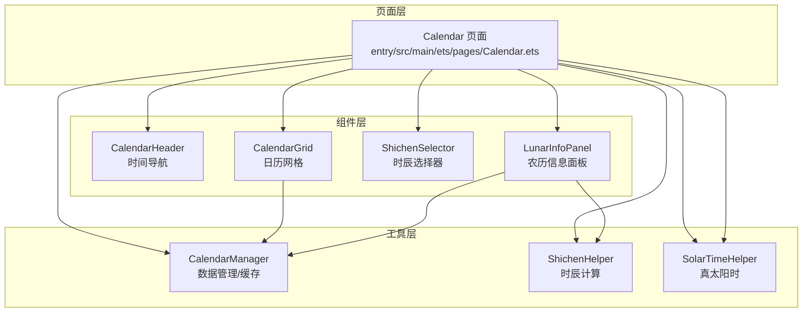
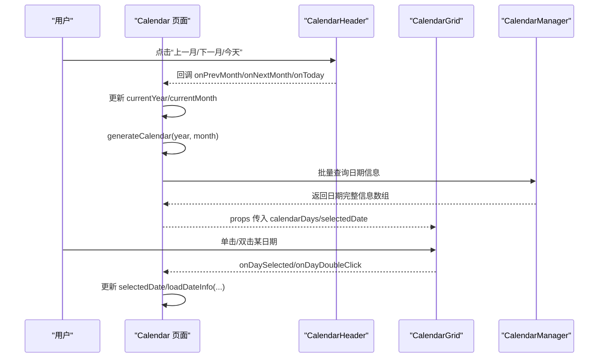
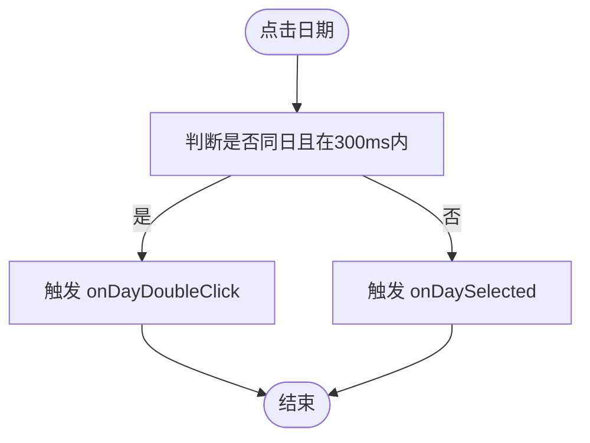
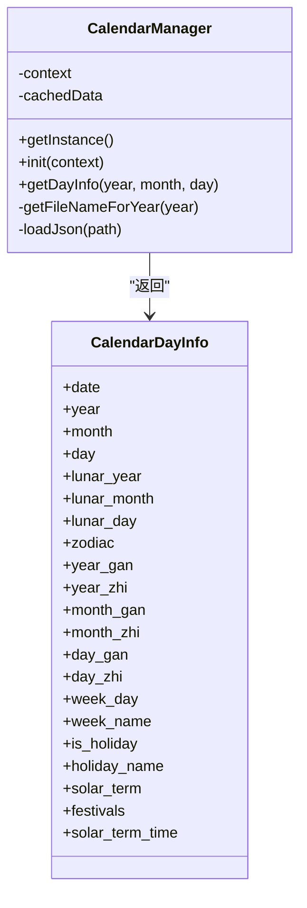
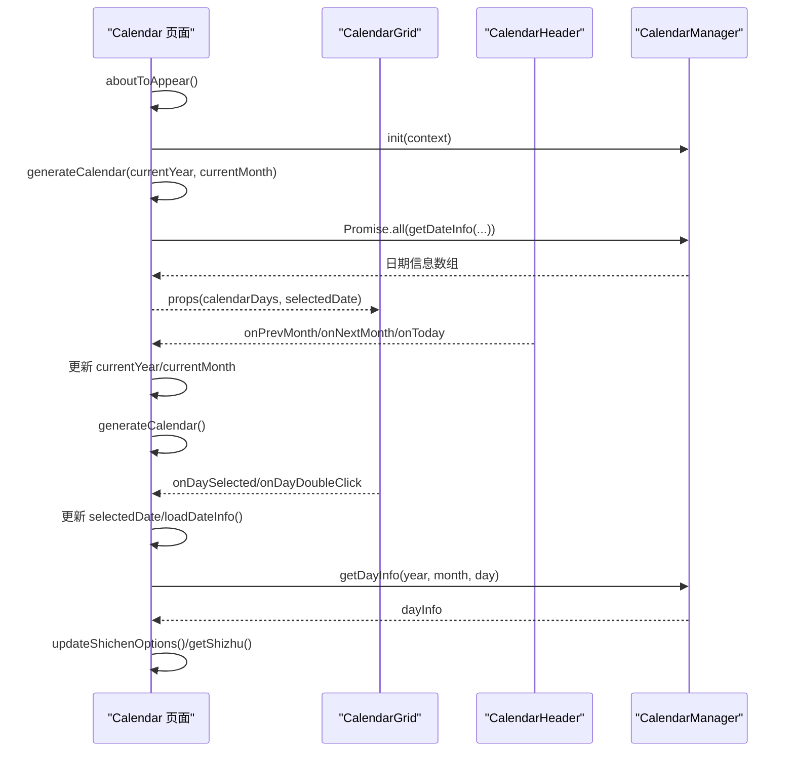
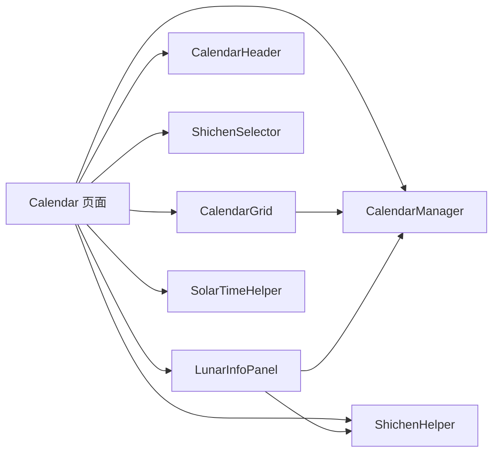

# 日历页面

<cite>
**本文档引用的文件**
- [Calendar.ets](file://entry/src/main/ets/pages/Calendar.ets)
- [CalendarGrid.ets](file://entry/src/main/ets/components/CalendarGrid.ets)
- [CalendarHeader.ets](file://entry/src/main/ets/components/CalendarHeader.ets)
- [CalendarManager.ets](file://entry/src/main/ets/utils/CalendarManager.ets)
- [ShichenHelper.ets](file://entry/src/main/ets/utils/ShichenHelper.ets)
- [SolarTimeHelper.ets](file://entry/src/main/ets/utils/SolarTimeHelper.ets)
- [ShichenSelector.ets](file://entry/src/main/ets/components/ShichenSelector.ets)
- [LunarInfoPanel.ets](file://entry/src/main/ets/components/LunarInfoPanel.ets)
- [calendar_data.md](file://entry/src/main/resources/rawfile/calendar/calendar_data.md)
- [calendar_data_0001.json](file://entry/src/main/resources/rawfile/calendar/calendar_data_0001.json)
</cite>

## 目录
1. [简介](#简介)
2. [项目结构](#项目结构)
3. [核心组件](#核心组件)
4. [架构总览](#架构总览)
5. [详细组件分析](#详细组件分析)
6. [依赖关系分析](#依赖关系分析)
7. [性能考量](#性能考量)
8. [故障排查指南](#故障排查指南)
9. [结论](#结论)
10. [附录](#附录)

## 简介
本文件面向日历页面（Calendar 页面）的功能与实现进行系统化说明，重点覆盖：
- 日历网格组件 CalendarGrid 的渲染逻辑与交互机制
- 日历头部组件 CalendarHeader 的时间导航控制
- CalendarManager 工具类的日历数据管理与缓存策略
- 页面的数据绑定模式与状态更新流程
- 组件的可定制化配置与样式调整建议
- 如何扩展日历功能以支持更多日期相关操作

## 项目结构
日历页面位于 entry/src/main/ets/pages/Calendar.ets，围绕该页面构建了多个配套组件与工具类：
- 页面层：Calendar 页面负责状态管理、数据生成与用户交互
- 组件层：CalendarGrid、CalendarHeader、ShichenSelector、LunarInfoPanel
- 工具层：CalendarManager、ShichenHelper、SolarTimeHelper

图表来源
- [Calendar.ets](file://entry/src/main/ets/pages/Calendar.ets#L1-L602)
- [CalendarGrid.ets](file://entry/src/main/ets/components/CalendarGrid.ets#L1-L167)
- [CalendarHeader.ets](file://entry/src/main/ets/components/CalendarHeader.ets#L1-L108)
- [CalendarManager.ets](file://entry/src/main/ets/utils/CalendarManager.ets#L1-L123)
- [ShichenHelper.ets](file://entry/src/main/ets/utils/ShichenHelper.ets#L1-L114)
- [SolarTimeHelper.ets](file://entry/src/main/ets/utils/SolarTimeHelper.ets#L1-L270)
- [ShichenSelector.ets](file://entry/src/main/ets/components/ShichenSelector.ets#L1-L133)
- [LunarInfoPanel.ets](file://entry/src/main/ets/components/LunarInfoPanel.ets#L1-L142)

章节来源
- [Calendar.ets](file://entry/src/main/ets/pages/Calendar.ets#L1-L602)

## 核心组件
- Calendar 页面：承载状态（选中日期、当前年月、日历数据等）、生成日历网格、处理导航与交互、联动真太阳时与排盘入口
- CalendarGrid：渲染日历网格，支持单击/双击、选中态高亮、节日标记、农历/节气显示
- CalendarHeader：提供上一月/下一月、返回今天、年/月点击弹出选择器
- CalendarManager：按年分片加载 JSON 数据，提供缓存与按日期检索
- ShichenHelper：时辰列表、当前时辰识别、时干计算、显示文本生成
- SolarTimeHelper：真太阳时计算、均时差、经度修正、格式化输出
- ShichenSelector：展开式网格选择器，展示时辰名称/干支/时段
- LunarInfoPanel：展示农历信息、生肖、四柱八字、节气与节日

章节来源
- [Calendar.ets](file://entry/src/main/ets/pages/Calendar.ets#L11-L602)
- [CalendarGrid.ets](file://entry/src/main/ets/components/CalendarGrid.ets#L1-L167)
- [CalendarHeader.ets](file://entry/src/main/ets/components/CalendarHeader.ets#L1-L108)
- [CalendarManager.ets](file://entry/src/main/ets/utils/CalendarManager.ets#L1-L123)
- [ShichenHelper.ets](file://entry/src/main/ets/utils/ShichenHelper.ets#L1-L114)
- [SolarTimeHelper.ets](file://entry/src/main/ets/utils/SolarTimeHelper.ets#L1-L270)
- [ShichenSelector.ets](file://entry/src/main/ets/components/ShichenSelector.ets#L1-L133)
- [LunarInfoPanel.ets](file://entry/src/main/ets/components/LunarInfoPanel.ets#L1-L142)

## 架构总览
日历页面采用“页面 + 组件 + 工具”的分层架构：
- 页面层通过状态驱动组件渲染，并在交互时更新状态
- 组件层负责 UI 渲染与用户交互，向页面回调事件
- 工具层提供数据与算法能力，被页面与组件调用

图表来源
- [Calendar.ets](file://entry/src/main/ets/pages/Calendar.ets#L184-L304)
- [CalendarGrid.ets](file://entry/src/main/ets/components/CalendarGrid.ets#L144-L164)
- [CalendarHeader.ets](file://entry/src/main/ets/components/CalendarHeader.ets#L34-L106)
- [CalendarManager.ets](file://entry/src/main/ets/utils/CalendarManager.ets#L51-L92)

## 详细组件分析

### 日历网格组件 CalendarGrid
- 数据模型：DayCell 表示一个日期单元，包含公历日、是否当月、完整日期对象、农历/节气/节日标记
- 渲染逻辑：
  - 星期标题行固定显示“周一～周日”
  - 6×7 网格按周遍历，每格渲染公历日、农历/节气、节日标记
  - 今日与选中日期高亮（边框/背景/粗体）
  - 非当月日期使用浅色字体
- 交互机制：
  - 单击触发 onDaySelected 回调
  - 双击触发 onDayDoubleClick 回调（300ms 内同日双击判定）
- 样式要点：
  - 选中态：浅蓝色背景 + 蓝色边框
  - 今日：橙色字体 + 橙色边框
  - 非当月：灰色字体
  - 节日：右上角小圆点

图表来源
- [CalendarGrid.ets](file://entry/src/main/ets/components/CalendarGrid.ets#L144-L164)

章节来源
- [CalendarGrid.ets](file://entry/src/main/ets/components/CalendarGrid.ets#L1-L167)

### 日历头部组件 CalendarHeader
- 功能：显示当前年/月，提供“◀/▶”切换、返回今天、年/月点击弹出选择器
- 交互：通过回调 onPrevMonth/onNextMonth/onToday/onYearClick/onMonthClick 通知页面
- 样式：年/月卡片带背景与边框，点击高亮；“今”按钮蓝色风格

章节来源
- [CalendarHeader.ets](file://entry/src/main/ets/components/CalendarHeader.ets#L1-L108)

### CalendarManager 工具类
- 单例模式：getInstance 提供全局唯一实例
- 数据源：按年分片的 JSON 文件（calendar_data_0001.json 至 calendar_data_0017.json），通过 calendar_data.md 描述年份区间映射
- 缓存策略：按文件名缓存年数据，避免重复读取
- 查询接口：按“年-月-日”字符串匹配，返回当日完整信息；若为节气日，附加节气精确时刻
- 错误处理：未初始化或加载失败时返回空值并记录错误

图表来源
- [CalendarManager.ets](file://entry/src/main/ets/utils/CalendarManager.ets#L30-L123)
- [calendar_data.md](file://entry/src/main/resources/rawfile/calendar/calendar_data.md#L1-L17)

章节来源
- [CalendarManager.ets](file://entry/src/main/ets/utils/CalendarManager.ets#L1-L123)
- [calendar_data.md](file://entry/src/main/resources/rawfile/calendar/calendar_data.md#L1-L17)
- [calendar_data_0001.json](file://entry/src/main/resources/rawfile/calendar/calendar_data_0001.json#L1-L200)

### 页面数据绑定与状态更新机制
- 状态字段：
  - selectedDate：当前选中日期
  - currentYear/currentMonth：当前显示年/月
  - calendarDays：日历网格数据
  - dayInfo：选中日期的完整信息
  - selectedShichenIndex：当前选中时辰索引
  - showYearPicker/showMonthPicker：选择器遮罩开关
- 生命周期：aboutToAppear 初始化 CalendarManager，设置默认日期并生成日历
- 数据生成：generateCalendar 计算上/当/下月日期集合，批量查询并组装 DayCell 数组
- 事件流：
  - CalendarHeader 导航事件 -> 更新年/月 -> 重新生成日历
  - CalendarGrid 单击/双击 -> 更新选中日期/加载详情 -> 更新时辰选项与真太阳时
  - ShichenSelector 选择 -> 更新 selectedShichenIndex -> 实时更新时柱显示

图表来源
- [Calendar.ets](file://entry/src/main/ets/pages/Calendar.ets#L32-L304)
- [CalendarGrid.ets](file://entry/src/main/ets/components/CalendarGrid.ets#L144-L164)
- [CalendarHeader.ets](file://entry/src/main/ets/components/CalendarHeader.ets#L34-L106)
- [CalendarManager.ets](file://entry/src/main/ets/utils/CalendarManager.ets#L51-L92)

章节来源
- [Calendar.ets](file://entry/src/main/ets/pages/Calendar.ets#L11-L304)

### 真太阳时与排盘入口
- 真太阳时：通过 SolarTimeHelper 计算，显示“⚡ 真太阳时”区域，包含格式化时间与本地时间差异说明
- 排盘入口：双击当月日期或点击“进入历法推演”，携带选中日期、干支与时辰索引跳转至 DunjiaPanel

章节来源
- [Calendar.ets](file://entry/src/main/ets/pages/Calendar.ets#L366-L304)
- [SolarTimeHelper.ets](file://entry/src/main/ets/utils/SolarTimeHelper.ets#L84-L108)

### 时辰选择与四柱信息
- ShichenHelper：提供时辰列表、当前时辰索引、时干计算、显示文本生成
- ShichenSelector：展开网格展示时辰名称/干支/时段，支持高亮与选择
- LunarInfoPanel：展示农历信息、生肖、四柱八字（年/月/日/时干支）

章节来源
- [ShichenHelper.ets](file://entry/src/main/ets/utils/ShichenHelper.ets#L1-L114)
- [ShichenSelector.ets](file://entry/src/main/ets/components/ShichenSelector.ets#L1-L133)
- [LunarInfoPanel.ets](file://entry/src/main/ets/components/LunarInfoPanel.ets#L1-L142)

## 依赖关系分析
- 页面依赖：CalendarGrid、CalendarHeader、ShichenSelector、LunarInfoPanel、CalendarManager、ShichenHelper、SolarTimeHelper
- 组件间耦合：CalendarGrid 与 CalendarHeader 仅通过回调解耦；LunarInfoPanel 依赖 CalendarManager 的节气精确时刻
- 工具类依赖：CalendarManager 依赖 SolarTermCalculator（在 LunarInfoPanel 中使用），SolarTimeHelper 依赖预设中国城市经度常量

图表来源
- [Calendar.ets](file://entry/src/main/ets/pages/Calendar.ets#L1-L10)
- [CalendarGrid.ets](file://entry/src/main/ets/components/CalendarGrid.ets#L1-L167)
- [CalendarHeader.ets](file://entry/src/main/ets/components/CalendarHeader.ets#L1-L108)
- [CalendarManager.ets](file://entry/src/main/ets/utils/CalendarManager.ets#L1-L123)
- [ShichenHelper.ets](file://entry/src/main/ets/utils/ShichenHelper.ets#L1-L114)
- [SolarTimeHelper.ets](file://entry/src/main/ets/utils/SolarTimeHelper.ets#L1-L270)
- [ShichenSelector.ets](file://entry/src/main/ets/components/ShichenSelector.ets#L1-L133)
- [LunarInfoPanel.ets](file://entry/src/main/ets/components/LunarInfoPanel.ets#L1-L142)

章节来源
- [Calendar.ets](file://entry/src/main/ets/pages/Calendar.ets#L1-L10)

## 性能考量
- 批量查询优化：generateCalendar 中一次性收集所有日期并使用 Promise.all 并行查询，减少多次 IO
- 数据缓存：CalendarManager 对年数据进行内存缓存，避免重复读取 JSON
- 渲染优化：CalendarGrid 使用固定 6×7 网格与固定尺寸，减少布局抖动
- 交互延迟：双击检测阈值 300ms，兼顾响应速度与误触防护

章节来源
- [Calendar.ets](file://entry/src/main/ets/pages/Calendar.ets#L83-L85)
- [CalendarGrid.ets](file://entry/src/main/ets/components/CalendarGrid.ets#L144-L164)
- [CalendarManager.ets](file://entry/src/main/ets/utils/CalendarManager.ets#L62-L69)

## 故障排查指南
- 未初始化错误：CalendarManager.init 未调用导致 getDayInfo 返回空
  - 现象：日历空白或详情不显示
  - 处理：确保在页面生命周期中调用 init
- 数据加载失败：JSON 文件路径或内容异常
  - 现象：控制台报错，日历数据缺失
  - 处理：检查 calendar_data_*.json 文件完整性与命名映射
- 选择器遮罩无法关闭：showYearPicker/showMonthPicker 状态未重置
  - 现象：遮罩层持续覆盖
  - 处理：确认点击遮罩区域或取消按钮逻辑
- 真太阳时显示异常：SolarTimeHelper 未正确设置经度
  - 现象：真太阳时与本地时间差异不符
  - 处理：确认传入的经度参数与实际定位一致

章节来源
- [CalendarManager.ets](file://entry/src/main/ets/utils/CalendarManager.ets#L52-L55)
- [Calendar.ets](file://entry/src/main/ets/pages/Calendar.ets#L470-L494)
- [SolarTimeHelper.ets](file://entry/src/main/ets/utils/SolarTimeHelper.ets#L37-L39)

## 结论
日历页面通过清晰的分层架构与组件化设计，实现了高性能的日历渲染与丰富的交互体验。CalendarGrid 与 CalendarHeader 提供直观的时间导航与日期选择，CalendarManager 保障了大规模历史数据的高效访问，ShichenHelper 与 SolarTimeHelper 为传统历法与现代时间计算提供了可靠支撑。页面采用响应式状态驱动渲染，交互流畅，具备良好的可扩展性。

## 附录

### 可定制化配置与样式调整
- 日历网格样式
  - 选中态：修改选中背景色与边框颜色
  - 今日态：调整今日字体颜色与边框
  - 非当月：统一浅色系字体
  - 节日标记：调整圆点大小与颜色
- 头部导航样式
  - 年/月卡片：调整背景、边框与点击高亮
  - “今”按钮：调整颜色与圆角
- 选择器样式
  - 展开网格：调整行列间距、圆角、阴影
  - 高亮态：调整文字颜色与背景色
- 真太阳时区域
  - 背景色与圆角：提升视觉层次
  - 字体大小与颜色：突出关键信息

章节来源
- [CalendarGrid.ets](file://entry/src/main/ets/components/CalendarGrid.ets#L92-L165)
- [CalendarHeader.ets](file://entry/src/main/ets/components/CalendarHeader.ets#L34-L106)
- [ShichenSelector.ets](file://entry/src/main/ets/components/ShichenSelector.ets#L34-L131)

### 扩展日历功能建议
- 支持多语言与主题切换：在组件中引入主题变量与文案资源
- 添加日程提醒：在 DayCell 中扩展事件标记与提醒图标
- 历史回溯：增加“上一年/下一年”按钮与年份选择器
- 节气专题页：点击节气跳转到专题详情页
- 导出与分享：导出当前日期的四柱信息或排盘链接
- 自定义范围：支持用户选择起止日期范围并高亮显示

章节来源
- [Calendar.ets](file://entry/src/main/ets/pages/Calendar.ets#L184-L225)
- [CalendarGrid.ets](file://entry/src/main/ets/components/CalendarGrid.ets#L144-L164)
- [LunarInfoPanel.ets](file://entry/src/main/ets/components/LunarInfoPanel.ets#L96-L117)