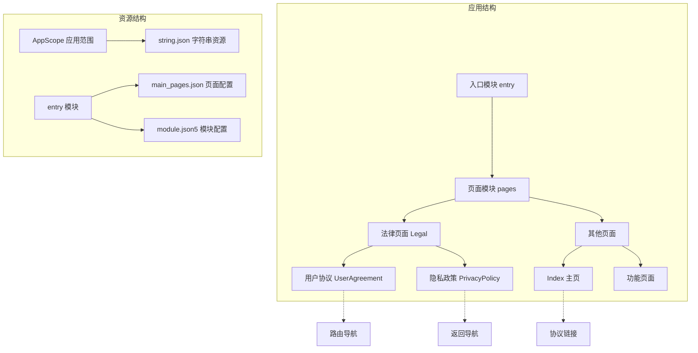
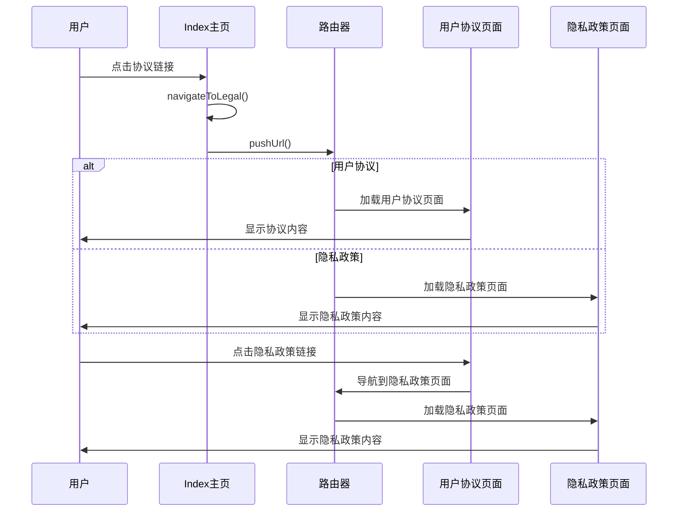
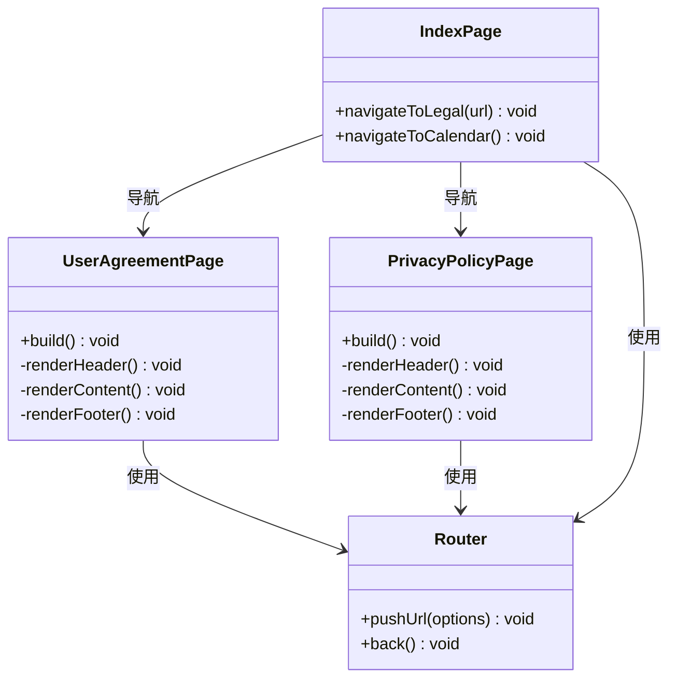
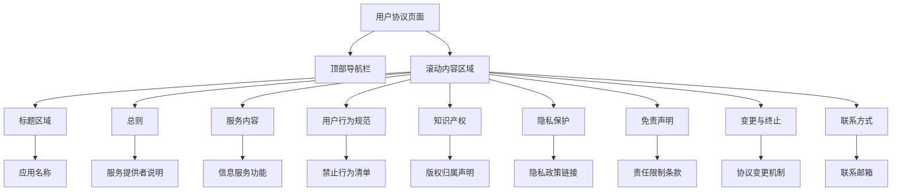
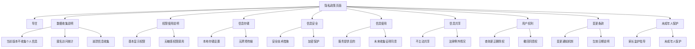
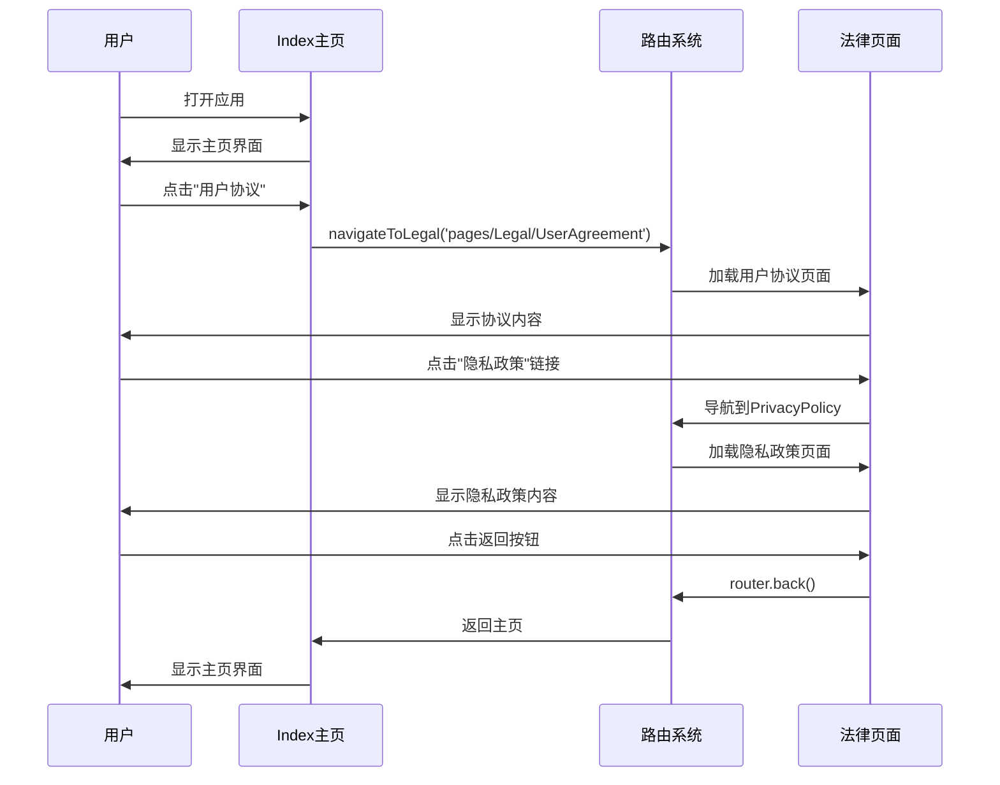
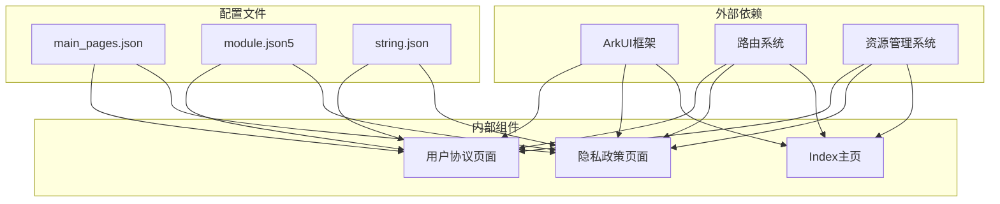

# 法律条款页面

<cite>
**本文档引用的文件**
- [UserAgreement.ets](file://entry/src/main/ets/pages/Legal/UserAgreement.ets)
- [PrivacyPolicy.ets](file://entry/src/main/ets/pages/Legal/PrivacyPolicy.ets)
- [Index.ets](file://entry/src/main/ets/pages/Index.ets)
- [main_pages.json](file://entry/src/main/resources/base/profile/main_pages.json)
- [module.json5](file://entry/src/main/module.json5)
- [string.json](file://AppScope/resources/base/element/string.json)
- [app.json5](file://AppScope/app.json5)
</cite>

## 目录
1. [简介](#简介)
2. [项目结构](#项目结构)
3. [核心组件](#核心组件)
4. [架构概览](#架构概览)
5. [详细组件分析](#详细组件分析)
6. [依赖关系分析](#依赖关系分析)
7. [性能考虑](#性能考虑)
8. [故障排除指南](#故障排除指南)
9. [结论](#结论)
10. [附录](#附录)

## 简介

法律条款页面是"遁甲符应经"应用程序的重要组成部分，负责展示用户协议和隐私政策等法律文档。该页面采用ArkTS框架开发，基于HarmonyOS应用架构，提供了完整的法律合规性支持和用户权利义务说明。

本项目专注于传统术数知识的传播和学习，通过数字化方式保护和传承中华传统文化。法律条款页面确保了应用的合规运营，为用户提供了清晰透明的使用条款和隐私保护政策。

## 项目结构

法律条款页面位于应用的页面层级中，采用模块化设计，与主应用页面分离，便于维护和更新。

**图表来源**
- [UserAgreement.ets](file://entry/src/main/ets/pages/Legal/UserAgreement.ets#L1-L154)
- [PrivacyPolicy.ets](file://entry/src/main/ets/pages/Legal/PrivacyPolicy.ets#L1-L243)
- [main_pages.json](file://entry/src/main/resources/base/profile/main_pages.json#L1-L20)

**章节来源**
- [UserAgreement.ets](file://entry/src/main/ets/pages/Legal/UserAgreement.ets#L1-L154)
- [PrivacyPolicy.ets](file://entry/src/main/ets/pages/Legal/PrivacyPolicy.ets#L1-L243)
- [main_pages.json](file://entry/src/main/resources/base/profile/main_pages.json#L1-L20)

## 核心组件

法律条款页面包含两个主要组件：用户协议页面和隐私政策页面。这两个页面都采用了统一的设计模式，确保用户体验的一致性。

### 用户协议页面 (UserAgreementPage)

用户协议页面展示了应用的基本使用条款和服务规范，涵盖了用户行为准则、知识产权保护、免责声明等内容。

### 隐私政策页面 (PrivacyPolicyPage)

隐私政策页面详细说明了数据收集、使用、存储和保护政策，特别强调了当前版本不收集个人信息的承诺。

### 导航组件

主页提供了便捷的法律条款访问入口，用户可以通过底部的协议链接快速跳转到相应的法律页面。

**章节来源**
- [UserAgreement.ets](file://entry/src/main/ets/pages/Legal/UserAgreement.ets#L1-L154)
- [PrivacyPolicy.ets](file://entry/src/main/ets/pages/Legal/PrivacyPolicy.ets#L1-L243)
- [Index.ets](file://entry/src/main/ets/pages/Index.ets#L50-L88)

## 架构概览

法律条款页面采用MVVM架构模式，结合HarmonyOS的ArkTS框架特性，实现了响应式的数据绑定和组件化开发。

**图表来源**
- [Index.ets](file://entry/src/main/ets/pages/Index.ets#L12-L14)
- [UserAgreement.ets](file://entry/src/main/ets/pages/Legal/UserAgreement.ets#L93-L95)
- [PrivacyPolicy.ets](file://entry/src/main/ets/pages/Legal/PrivacyPolicy.ets#L1-L243)

### 组件层次结构

**图表来源**
- [UserAgreement.ets](file://entry/src/main/ets/pages/Legal/UserAgreement.ets#L5-L154)
- [PrivacyPolicy.ets](file://entry/src/main/ets/pages/Legal/PrivacyPolicy.ets#L5-L243)
- [Index.ets](file://entry/src/main/ets/pages/Index.ets#L1-L88)

## 详细组件分析

### 用户协议页面详细分析

用户协议页面采用了清晰的层次结构，将协议内容分为多个重要部分：

#### 协议结构分析

**图表来源**
- [UserAgreement.ets](file://entry/src/main/ets/pages/Legal/UserAgreement.ets#L28-L141)

#### 用户权利义务说明

用户协议明确了用户在使用应用过程中的权利和义务：

**用户权利：**
- 自由浏览应用内容的权利
- 了解应用功能和服务的权利
- 获得服务通知和更新的权利

**用户义务：**
- 遵守法律法规的义务
- 不传播违法不良信息的义务
- 不干扰应用正常运行的义务
- 尊重知识产权的义务

**章节来源**
- [UserAgreement.ets](file://entry/src/main/ets/pages/Legal/UserAgreement.ets#L36-L118)

### 隐私政策页面详细分析

隐私政策页面详细阐述了数据处理原则和用户隐私保护措施：

#### 数据处理流程

**图表来源**
- [PrivacyPolicy.ets](file://entry/src/main/ets/pages/Legal/PrivacyPolicy.ets#L48-L230)

#### 隐私保护措施

隐私政策强调了以下保护措施：
- **零个人信息收集**：当前版本不收集任何个人信息
- **匿名统计**：仅收集匿名访问量和崩溃信息
- **本地存储**：所有数据仅存储在本地设备
- **无跨境传输**：不进行任何个人信息的跨境处理
- **透明度**：提供详细的权限使用说明

**章节来源**
- [PrivacyPolicy.ets](file://entry/src/main/ets/pages/Legal/PrivacyPolicy.ets#L81-L230)

### 导航系统分析

导航系统提供了直观的法律条款访问路径：

#### 导航流程

**图表来源**
- [Index.ets](file://entry/src/main/ets/pages/Index.ets#L50-L88)
- [UserAgreement.ets](file://entry/src/main/ets/pages/Legal/UserAgreement.ets#L10-L16)

**章节来源**
- [Index.ets](file://entry/src/main/ets/pages/Index.ets#L12-L14)
- [UserAgreement.ets](file://entry/src/main/ets/pages/Legal/UserAgreement.ets#L93-L95)

## 依赖关系分析

法律条款页面的依赖关系相对简单，主要依赖于HarmonyOS的ArkUI框架和路由系统。

**图表来源**
- [UserAgreement.ets](file://entry/src/main/ets/pages/Legal/UserAgreement.ets#L1)
- [PrivacyPolicy.ets](file://entry/src/main/ets/pages/Legal/PrivacyPolicy.ets#L1)
- [main_pages.json](file://entry/src/main/resources/base/profile/main_pages.json#L16-L17)

### 组件耦合度分析

法律条款页面具有较低的组件耦合度，各页面相互独立，便于维护和扩展：

- **用户协议页面**：独立存在，不依赖其他法律页面
- **隐私政策页面**：独立存在，提供完整的隐私保护说明
- **主页导航**：通过统一的导航方法连接各个页面

**章节来源**
- [module.json5](file://entry/src/main/module.json5#L12)
- [main_pages.json](file://entry/src/main/resources/base/profile/main_pages.json#L16-L17)

## 性能考虑

法律条款页面作为静态内容展示页面，具有以下性能特点：

### 渲染性能
- **轻量级组件**：页面结构简单，渲染开销小
- **滚动优化**：使用滚动容器优化长文本显示
- **内存占用**：静态内容占用内存极小

### 加载性能
- **即时加载**：页面内容在本地加载，无需网络请求
- **缓存友好**：静态资源可被系统有效缓存
- **启动快速**：页面切换响应迅速

### 用户体验优化
- **流畅滚动**：内置滚动效果提升阅读体验
- **响应式设计**：适配不同屏幕尺寸
- **无障碍支持**：提供良好的可访问性

## 故障排除指南

### 常见问题及解决方案

#### 页面无法加载
**问题描述**：用户协议或隐私政策页面无法正常显示
**可能原因**：
- 页面路径配置错误
- 资源文件缺失
- 路由配置问题

**解决步骤**：
1. 检查main_pages.json中的页面配置
2. 验证页面文件是否存在
3. 确认路由URL格式正确

#### 导航功能异常
**问题描述**：协议链接无法正常跳转
**可能原因**：
- 导航方法调用错误
- 路由参数配置问题

**解决步骤**：
1. 检查navigateToLegal方法的实现
2. 验证URL路径的正确性
3. 确认router对象的可用性

#### 文本显示问题
**问题描述**：页面文本显示异常或格式错误
**可能原因**：
- 字体资源问题
- 文本编码问题
- 样式配置错误

**解决步骤**：
1. 检查字符串资源文件
2. 验证文本编码格式
3. 确认样式属性配置

**章节来源**
- [main_pages.json](file://entry/src/main/resources/base/profile/main_pages.json#L16-L17)
- [Index.ets](file://entry/src/main/ets/pages/Index.ets#L12-L14)

## 结论

法律条款页面作为"遁甲符应经"应用的重要组成部分，成功实现了以下目标：

### 合规性保障
- 提供了完整的用户协议和隐私政策
- 明确了用户权利义务关系
- 建立了透明的数据处理机制
- 确保了应用的法律合规运营

### 用户体验优化
- 设计简洁直观的界面布局
- 提供便捷的导航访问方式
- 实现流畅的页面切换体验
- 支持多种设备屏幕适配

### 技术实现亮点
- 采用模块化设计便于维护
- 利用ArkTS框架实现响应式开发
- 通过路由系统实现页面导航
- 配置文件管理页面路由关系

该法律条款页面不仅满足了应用的合规要求，也为用户提供了清晰透明的使用条款和隐私保护政策，为应用的长期发展奠定了坚实的法律基础。

## 附录

### 版本维护指南

#### 更新流程
1. **内容审核**：确保法律条款内容符合最新法律法规
2. **版本标记**：更新生效日期和版本号
3. **测试验证**：验证页面显示和导航功能
4. **发布部署**：更新应用版本并发布

#### 维护要点
- 定期审查法律条款的有效性
- 关注相关法律法规的变化
- 及时更新隐私政策相关内容
- 保持条款内容的准确性和完整性

### 配置参考

#### 页面配置
- 页面路径：`pages/Legal/UserAgreement`
- 页面路径：`pages/Legal/PrivacyPolicy`
- 模块类型：`entry`
- 设备类型：`phone`

#### 资源配置
- 字符串资源：`$string:app_name`
- 图片资源：`$media:dunjia_background`
- 颜色资源：`$color:start_window_background`

**章节来源**
- [module.json5](file://entry/src/main/module.json5#L1-L50)
- [app.json5](file://AppScope/app.json5#L1-L10)
- [string.json](file://AppScope/resources/base/element/string.json#L1-L9)