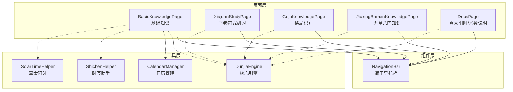
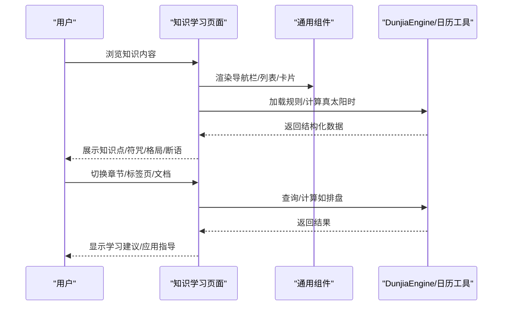
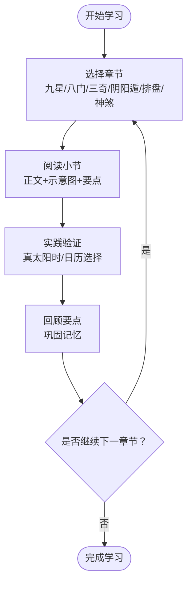
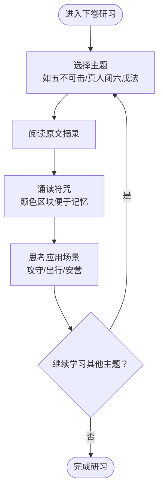
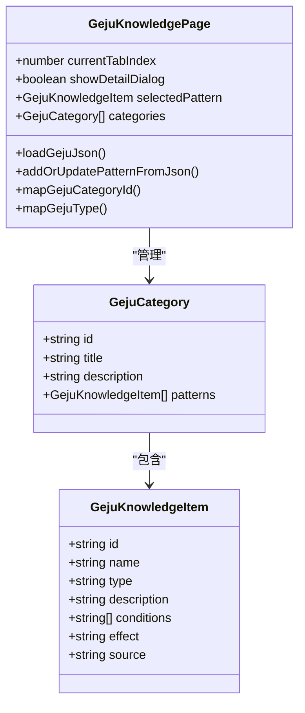
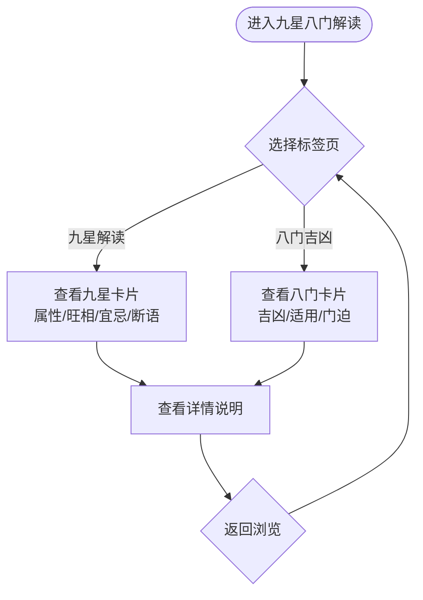
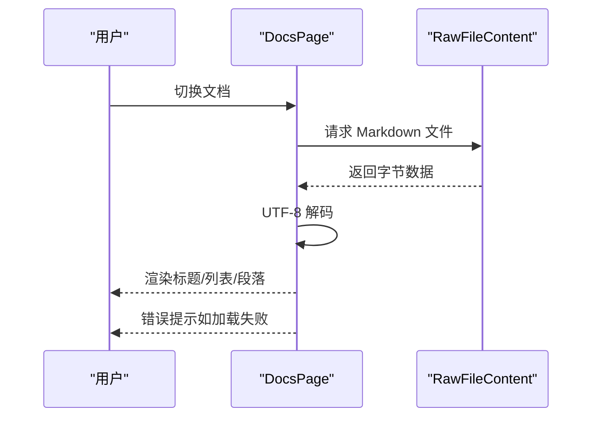
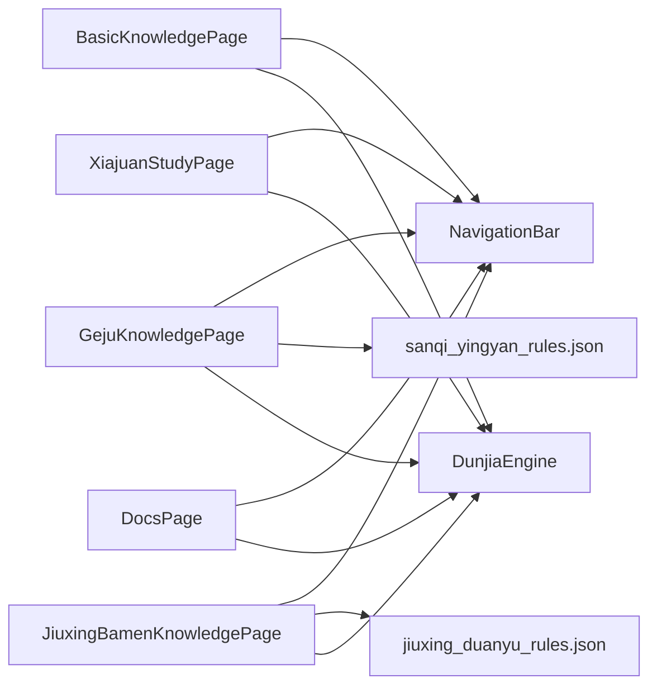

# 知识学习页面

<cite>
**本文引用的文件**
- [BasicKnowledgePage.ets](file://entry/src/main/ets/pages/BasicKnowledgePage.ets)
- [XiajuanStudyPage.ets](file://entry/src/main/ets/pages/XiajuanStudyPage.ets)
- [GejuKnowledgePage.ets](file://entry/src/main/ets/pages/GejuKnowledgePage.ets)
- [JiuxingBamenKnowledgePage.ets](file://entry/src/main/ets/pages/JiuxingBamenKnowledgePage.ets)
- [DocsPage.ets](file://entry/src/main/ets/pages/DocsPage.ets)
- [Calendar.ets](file://entry/src/main/ets/pages/Calendar.ets)
- [DunjiaEngine.ets](file://entry/src/main/ets/utils/DunjiaEngine.ets)
- [jiuxing_duanyu_rules.json](file://entry/src/main/resources/rawfile/rules/jiuxing_duanyu_rules.json)
- [sanqi_yingyan_rules.json](file://entry/src/main/resources/rawfile/rules/sanqi_yingyan_rules.json)
- [NavigationBar.ets](file://entry/src/main/ets/components/NavigationBar.ets)
</cite>

## 目录
1. [简介](#简介)
2. [项目结构](#项目结构)
3. [核心组件](#核心组件)
4. [架构总览](#架构总览)
5. [详细组件分析](#详细组件分析)
6. [依赖分析](#依赖分析)
7. [性能考虑](#性能考虑)
8. [故障排查指南](#故障排查指南)
9. [结论](#结论)
10. [附录](#附录)

## 简介
本文件面向“知识学习页面组”，系统化梳理并解释以下页面的教学设计理念与学习路径规划：
- 基础知识页面 BasicKnowledgePage：以图文并茂的方式组织奇门遁甲入门知识，采用“章节-小节-要点”的层级结构，配合迷你九宫示意图帮助理解。
- 遁甲歌诀学习页面 XiajuanStudyPage：集中展示《景祐遁甲符应经·卷之下》中的攻守规则与符咒，采用“原文摘录 + 符咒块”的结构，便于对照研习。
- 遁甲格物页面 GejuKnowledgePage：以“类别-格局条目-条件与效应”的结构化方式呈现奇门格局识别与判断，支持从 JSON 规则动态加载。
- 九星八门知识页面 JiuxingBamenKnowledgePage：系统化展示九星与八门的属性、宜忌、旺相与门迫等知识，并可从 JSON 规则补充“断语”说明。
- 文档页面 DocsPage：提供真太阳时与术数说明的 Markdown 文档浏览，支持切换与错误处理。

## 项目结构
知识学习页面组位于 entry/src/main/ets/pages 目录下，采用 ArkTS 页面组件化组织，配合 utils 与 components 目录下的工具与通用组件，形成清晰的分层：
- pages：知识学习页面（BasicKnowledgePage、XiajuanStudyPage、GejuKnowledgePage、JiuxingBamenKnowledgePage、DocsPage）
- utils：核心引擎与工具（DunjiaEngine、CalendarManager、ShichenHelper、SolarTimeHelper）
- components：通用组件（NavigationBar、CalendarGrid、CalendarHeader、ShichenSelector、LunarInfoPanel）

**图表来源**
- [BasicKnowledgePage.ets](file://entry/src/main/ets/pages/BasicKnowledgePage.ets#L41-L794)
- [XiajuanStudyPage.ets](file://entry/src/main/ets/pages/XiajuanStudyPage.ets#L3-L369)
- [GejuKnowledgePage.ets](file://entry/src/main/ets/pages/GejuKnowledgePage.ets#L71-L800)
- [JiuxingBamenKnowledgePage.ets](file://entry/src/main/ets/pages/JiuxingBamenKnowledgePage.ets#L53-L661)
- [DocsPage.ets](file://entry/src/main/ets/pages/DocsPage.ets#L4-L227)
- [DunjiaEngine.ets](file://entry/src/main/ets/utils/DunjiaEngine.ets#L98-L162)
- [NavigationBar.ets](file://entry/src/main/ets/components/NavigationBar.ets#L22-L86)

**章节来源**
- [BasicKnowledgePage.ets](file://entry/src/main/ets/pages/BasicKnowledgePage.ets#L41-L794)
- [XiajuanStudyPage.ets](file://entry/src/main/ets/pages/XiajuanStudyPage.ets#L3-L369)
- [GejuKnowledgePage.ets](file://entry/src/main/ets/pages/GejuKnowledgePage.ets#L71-L800)
- [JiuxingBamenKnowledgePage.ets](file://entry/src/main/ets/pages/JiuxingBamenKnowledgePage.ets#L53-L661)
- [DocsPage.ets](file://entry/src/main/ets/pages/DocsPage.ets#L4-L227)
- [NavigationBar.ets](file://entry/src/main/ets/components/NavigationBar.ets#L22-L86)

## 核心组件
- 导航栏组件 NavigationBar：统一导航样式与交互，支持自定义标题、返回行为与右侧操作按钮。
- 日历与真太阳时组件：Calendar、ShichenSelector、LunarInfoPanel、SolarTimeHelper，支撑“学习-实践-验证”的闭环（在 Calendar 页面中体现）。

这些组件在各知识页面中复用，确保一致的用户体验与交互风格。

**章节来源**
- [NavigationBar.ets](file://entry/src/main/ets/components/NavigationBar.ets#L22-L86)
- [Calendar.ets](file://entry/src/main/ets/pages/Calendar.ets#L17-L602)

## 架构总览
知识学习页面组围绕“结构化知识 + 规则驱动 + 实践验证”的理念构建：
- 结构化知识：以章节/类别/条目的层级组织，便于学习路径规划与检索。
- 规则驱动：通过 JSON 规则文件（如九星断语、三奇应验）动态加载与渲染，提升内容扩展性。
- 实践验证：结合日历与真太阳时工具，将学习成果映射到实际排盘与应用情境。

**图表来源**
- [BasicKnowledgePage.ets](file://entry/src/main/ets/pages/BasicKnowledgePage.ets#L41-L794)
- [GejuKnowledgePage.ets](file://entry/src/main/ets/pages/GejuKnowledgePage.ets#L295-L369)
- [JiuxingBamenKnowledgePage.ets](file://entry/src/main/ets/pages/JiuxingBamenKnowledgePage.ets#L238-L307)
- [DunjiaEngine.ets](file://entry/src/main/ets/utils/DunjiaEngine.ets#L113-L162)
- [Calendar.ets](file://entry/src/main/ets/pages/Calendar.ets#L242-L304)

## 详细组件分析

### 基础知识页面 BasicKnowledgePage
教学设计理念
- 分层组织：以“章节-小节-要点”结构呈现，便于学习者按主题逐步深入。
- 图文结合：通过迷你九宫示意图直观展示九星、八门、三奇等在不同遁局中的分布。
- 关键点提炼：每小节末尾提供“要点总结”，强化记忆与检索。

学习路径规划
- 建议顺序：九星 → 八门 → 三奇 → 阴阳遁 → 排盘流程 → 神煞理论。
- 辅助工具：结合日历与真太阳时，完成一次从“理论学习 → 时间校正 → 实盘验证”的闭环。

**图表来源**
- [BasicKnowledgePage.ets](file://entry/src/main/ets/pages/BasicKnowledgePage.ets#L41-L794)
- [Calendar.ets](file://entry/src/main/ets/pages/Calendar.ets#L242-L304)

**章节来源**
- [BasicKnowledgePage.ets](file://entry/src/main/ets/pages/BasicKnowledgePage.ets#L41-L794)

### 遁甲歌诀学习页面 XiajuanStudyPage
教学设计理念
- 原文与实践并重：以“原文摘录 + 符咒块”形式呈现，强调文化研习与仪式感。
- 分类组织：按“五不可击、玉女反闭局、行千里法、三奇吉门、伏匿藏形、真人闭六戊法、刀画地摄禁、安营、真人步斗法、遁甲门户神名、魁罡咒、天门地户、逆风镇压”等主题分段展示。
- 记忆辅助：通过颜色与区块化设计，帮助学习者区分不同主题与操作步骤。

**图表来源**
- [XiajuanStudyPage.ets](file://entry/src/main/ets/pages/XiajuanStudyPage.ets#L3-L369)

**章节来源**
- [XiajuanStudyPage.ets](file://entry/src/main/ets/pages/XiajuanStudyPage.ets#L3-L369)

### 遁甲格物页面 GejuKnowledgePage
教学设计理念
- 结构化规则：以“类别-格局条目-判定条件-效应-来源”的格式组织，便于对比与记忆。
- 动态加载：从 JSON 规则文件读取并合并到页面数据结构，支持持续扩展。
- 交互体验：点击卡片打开详情弹窗，提供更深入的解释与来源出处。

**图表来源**
- [GejuKnowledgePage.ets](file://entry/src/main/ets/pages/GejuKnowledgePage.ets#L6-L58)
- [GejuKnowledgePage.ets](file://entry/src/main/ets/pages/GejuKnowledgePage.ets#L71-L800)

**章节来源**
- [GejuKnowledgePage.ets](file://entry/src/main/ets/pages/GejuKnowledgePage.ets#L71-L800)
- [sanqi_yingyan_rules.json](file://entry/src/main/resources/rawfile/rules/sanqi_yingyan_rules.json#L1-L525)

### 九星八门知识页面 JiuxingBamenKnowledgePage
教学设计理念
- 九星与八门分别组织：九星侧重属性、旺相、宜忌与断语；八门侧重吉凶、适用场景与门迫判断。
- 动态补充：从 JSON 规则文件读取“断语”与“象意”，丰富学习内容。
- 视觉呈现：卡片式布局，突出倾向标签与关键信息，便于快速浏览与检索。

**图表来源**
- [JiuxingBamenKnowledgePage.ets](file://entry/src/main/ets/pages/JiuxingBamenKnowledgePage.ets#L53-L661)
- [jiuxing_duanyu_rules.json](file://entry/src/main/resources/rawfile/rules/jiuxing_duanyu_rules.json#L1-L256)

**章节来源**
- [JiuxingBamenKnowledgePage.ets](file://entry/src/main/ets/pages/JiuxingBamenKnowledgePage.ets#L53-L661)
- [jiuxing_duanyu_rules.json](file://entry/src/main/resources/rawfile/rules/jiuxing_duanyu_rules.json#L1-L256)

### 文档页面 DocsPage
教学设计理念
- 内容切换：支持“真太阳时说明”与“术数与真太阳时”两个文档的切换浏览。
- 错误处理：对资源加载失败进行提示，保障学习连续性。
- 结构化展示：按 Markdown 的标题、列表与段落进行渲染，提升可读性。

**图表来源**
- [DocsPage.ets](file://entry/src/main/ets/pages/DocsPage.ets#L12-L103)

**章节来源**
- [DocsPage.ets](file://entry/src/main/ets/pages/DocsPage.ets#L4-L227)

## 依赖分析
- 页面与组件：各知识页面均依赖 NavigationBar 组件，确保导航一致性。
- 页面与工具：BasicKnowledgePage、GejuKnowledgePage、JiuxingBamenKnowledgePage 在渲染阶段读取 JSON 规则文件；Calendar 页面与 DunjiaEngine 协作完成排盘计算。
- 数据流：JSON 规则文件作为外部数据源，通过页面内的异步加载函数注入到组件状态，再由渲染函数输出到 UI。

**图表来源**
- [BasicKnowledgePage.ets](file://entry/src/main/ets/pages/BasicKnowledgePage.ets#L41-L794)
- [XiajuanStudyPage.ets](file://entry/src/main/ets/pages/XiajuanStudyPage.ets#L3-L369)
- [GejuKnowledgePage.ets](file://entry/src/main/ets/pages/GejuKnowledgePage.ets#L71-L800)
- [JiuxingBamenKnowledgePage.ets](file://entry/src/main/ets/pages/JiuxingBamenKnowledgePage.ets#L53-L661)
- [DocsPage.ets](file://entry/src/main/ets/pages/DocsPage.ets#L4-L227)
- [sanqi_yingyan_rules.json](file://entry/src/main/resources/rawfile/rules/sanqi_yingyan_rules.json#L1-L525)
- [jiuxing_duanyu_rules.json](file://entry/src/main/resources/rawfile/rules/jiuxing_duanyu_rules.json#L1-L256)
- [DunjiaEngine.ets](file://entry/src/main/ets/utils/DunjiaEngine.ets#L98-L162)

**章节来源**
- [DunjiaEngine.ets](file://entry/src/main/ets/utils/DunjiaEngine.ets#L98-L162)

## 性能考虑
- JSON 规则加载：采用异步读取与 UTF-8 解码，避免主线程阻塞；建议对频繁访问的规则进行缓存。
- 渲染优化：使用 ForEach 渲染列表，合理设置容器的 padding、borderRadius 与阴影，减少不必要的重绘。
- 文档加载：对 Markdown 的逐行解析与样式映射，建议在内容较大时启用滚动区域的虚拟化或分页加载。

## 故障排查指南
常见问题与处理
- 规则文件加载失败：检查 JSON 文件路径与命名，确认资源管理器可用；在页面中捕获异常并显示错误提示。
- 中文乱码：确保使用 UTF-8 解码函数，逐字节处理四字节代理对。
- 文档切换异常：确认按钮事件绑定与状态切换逻辑，避免重复请求同一文件。

**章节来源**
- [GejuKnowledgePage.ets](file://entry/src/main/ets/pages/GejuKnowledgePage.ets#L295-L369)
- [JiuxingBamenKnowledgePage.ets](file://entry/src/main/ets/pages/JiuxingBamenKnowledgePage.ets#L242-L307)
- [DocsPage.ets](file://entry/src/main/ets/pages/DocsPage.ets#L12-L103)

## 结论
知识学习页面组通过“结构化内容 + 规则驱动 + 实践验证”的设计，为奇门遁甲的学习提供了系统化的路径与丰富的辅助工具。各页面既可独立学习，也可相互印证，最终结合日历与真太阳时工具完成从理论到实践的闭环。

## 附录
扩展知识库与新增学习模块的建议
- 新增 JSON 规则：在 rawfile/rules 目录下添加新的规则文件，遵循现有字段结构（如 id、name、category、description、conditions、effects、sub_rules 等）。
- 页面集成：在目标页面中增加对新规则文件的读取与解析逻辑，将规则合并到 categories/patterns/stars/doors 等数据结构中。
- UI 呈现：根据规则类型设计卡片/列表/弹窗等组件，保持与现有风格一致；必要时新增组件并在页面中复用。
- 质量控制：为规则文件编写单元测试或示例数据，确保解析与渲染的稳定性；对可能出现的异常进行捕获与提示。

**章节来源**
- [GejuKnowledgePage.ets](file://entry/src/main/ets/pages/GejuKnowledgePage.ets#L295-L369)
- [JiuxingBamenKnowledgePage.ets](file://entry/src/main/ets/pages/JiuxingBamenKnowledgePage.ets#L242-L307)
- [sanqi_yingyan_rules.json](file://entry/src/main/resources/rawfile/rules/sanqi_yingyan_rules.json#L1-L525)
- [jiuxing_duanyu_rules.json](file://entry/src/main/resources/rawfile/rules/jiuxing_duanyu_rules.json#L1-L256)