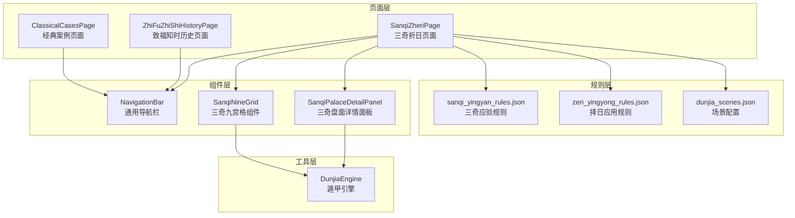
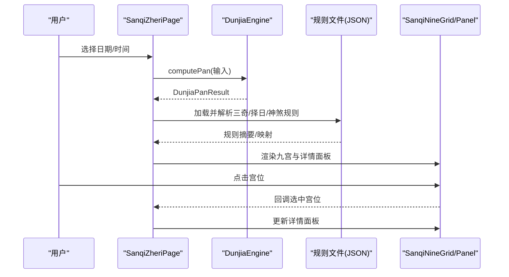
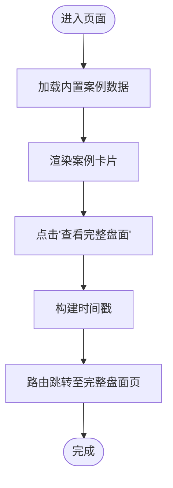
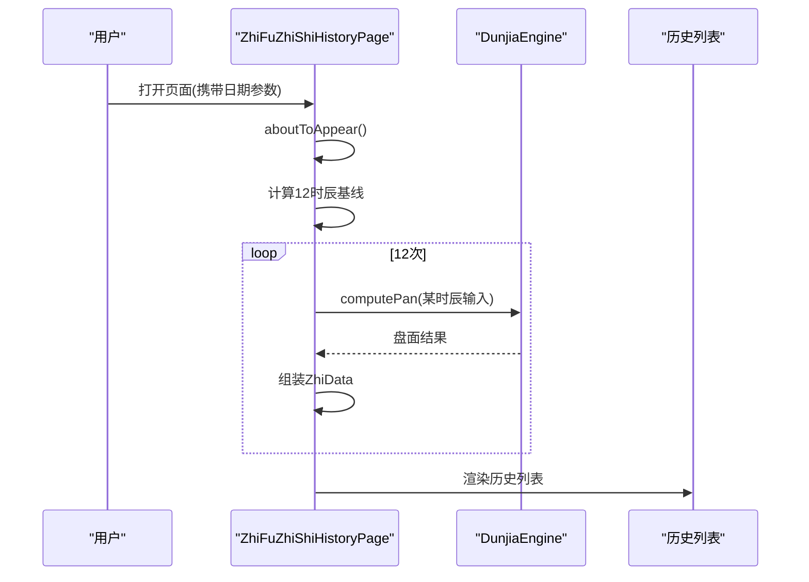
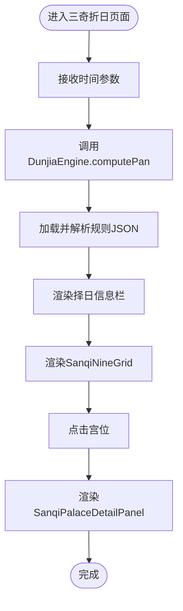
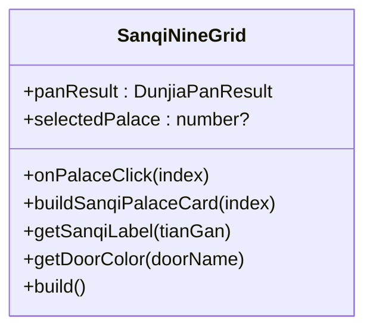
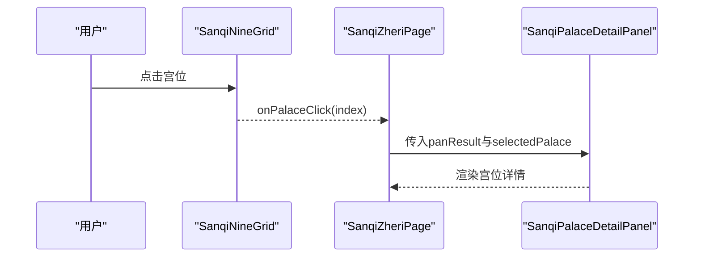
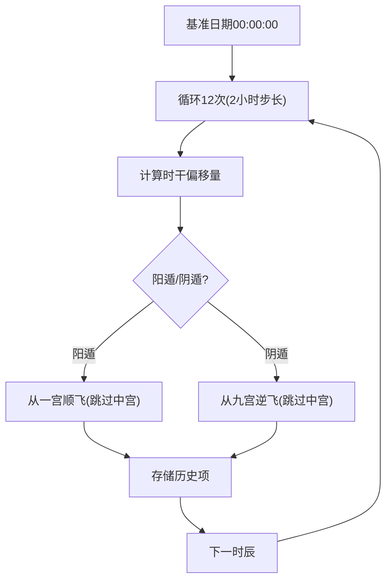
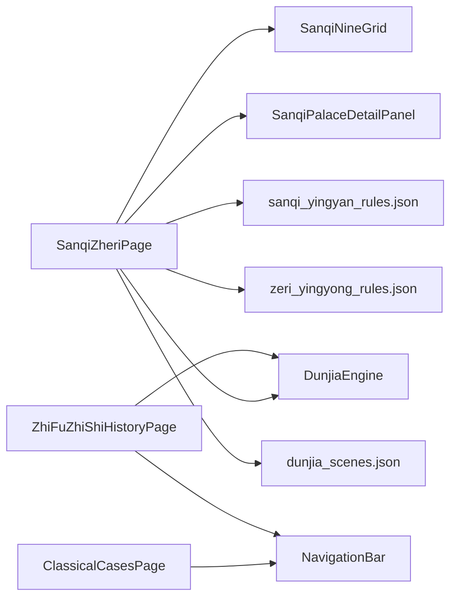

# 经典案例页面

<cite>
**本文档引用的文件**
- [ClassicalCasesPage.ets](file://entry/src/main/ets/pages/ClassicalCasesPage.ets)
- [ZhiFuZhiShiHistoryPage.ets](file://entry/src/main/ets/pages/ZhiFuZhiShiHistoryPage.ets)
- [SanqiZheriPage.ets](file://entry/src/main/ets/pages/SanqiZheriPage.ets)
- [SanqiNineGrid.ets](file://entry/src/main/ets/components/SanqiNineGrid.ets)
- [SanqiPalaceDetailPanel.ets](file://entry/src/main/ets/components/SanqiPalaceDetailPanel.ets)
- [DunjiaEngine.ets](file://entry/src/main/ets/utils/DunjiaEngine.ets)
- [NavigationBar.ets](file://entry/src/main/ets/components/NavigationBar.ets)
- [sanqi_yingyan_rules.json](file://entry/src/main/resources/rawfile/rules/sanqi_yingyan_rules.json)
- [zeri_yingyong_rules.json](file://entry/src/main/resources/rawfile/rules/zeri_yingyong_rules.json)
- [dunjia_scenes.json](file://entry/src/main/resources/rawfile/dunjia_scenes.json)
</cite>

## 目录
1. [简介](#简介)
2. [项目结构](#项目结构)
3. [核心组件](#核心组件)
4. [架构总览](#架构总览)
5. [详细组件分析](#详细组件分析)
6. [依赖关系分析](#依赖关系分析)
7. [性能考虑](#性能考虑)
8. [故障排除指南](#故障排除指南)
9. [结论](#结论)
10. [附录](#附录)

## 简介
本文件面向经典案例页面组，系统性阐述以下主题：
- 经典案例页面 ClassicalCasesPage 的案例展示与分析框架，体现《遁甲符应经》的历史传承价值与实践应用意义
- 致福知时历史页面 ZhiFuZhiShiHistoryPage 的历史文献整理与案例汇编功能
- 三奇折日页面 SanqiZheriPage 的特殊排盘与应用技巧
- 三奇九宫格组件 SanqiNineGrid 的特殊布局算法
- 三奇盘面详情面板 SanqiPalaceDetailPanel 的信息展示与交互设计
- 如何添加新的历史案例与扩展应用场景

## 项目结构
经典案例页面组位于 entry/src/main/ets/pages 与 entry/src/main/ets/components 目录下，配合 utils/DunjiaEngine 提供核心排盘能力，并通过 rawfile/rules 中的 JSON 规则文件支撑三奇应验、择日应用与神煞规则。

图表来源
- [ClassicalCasesPage.ets](file://entry/src/main/ets/pages/ClassicalCasesPage.ets#L48-L625)
- [ZhiFuZhiShiHistoryPage.ets](file://entry/src/main/ets/pages/ZhiFuZhiShiHistoryPage.ets#L9-L237)
- [SanqiZheriPage.ets](file://entry/src/main/ets/pages/SanqiZheriPage.ets#L76-L815)
- [SanqiNineGrid.ets](file://entry/src/main/ets/components/SanqiNineGrid.ets#L16-L169)
- [SanqiPalaceDetailPanel.ets](file://entry/src/main/ets/components/SanqiPalaceDetailPanel.ets#L11-L155)
- [DunjiaEngine.ets](file://entry/src/main/ets/utils/DunjiaEngine.ets#L98-L162)
- [sanqi_yingyan_rules.json](file://entry/src/main/resources/rawfile/rules/sanqi_yingyan_rules.json#L1-L525)
- [zeri_yingyong_rules.json](file://entry/src/main/resources/rawfile/rules/zeri_yingyong_rules.json#L1-L145)
- [dunjia_scenes.json](file://entry/src/main/resources/rawfile/dunjia_scenes.json#L1-L50)

章节来源
- [ClassicalCasesPage.ets](file://entry/src/main/ets/pages/ClassicalCasesPage.ets#L1-L625)
- [SanqiZheriPage.ets](file://entry/src/main/ets/pages/SanqiZheriPage.ets#L1-L815)

## 核心组件
- 经典案例页面 ClassicalCasesPage：以《遁甲符应经》原文为依据，构建典型局例的九宫示意图与结构分析，支持一键跳转至完整盘面研习页
- 致福知时历史页面 ZhiFuZhiShiHistoryPage：按 12 时辰追踪值符值使的动态演化，辅助理解遁甲时空流转
- 三奇折日页面 SanqiZheriPage：专为择日设计的排盘页面，集成三奇应验、干支择日、五阳五阴时等规则，提供择日建议与宫位详情
- 三奇九宫格组件 SanqiNineGrid：针对三奇应验的专用九宫布局，突出三奇标识与值符值使角标
- 三奇盘面详情面板 SanqiPalaceDetailPanel：展示选中宫位的三奇应验信息与应验时间周期
- 遁甲引擎 DunjiaEngine：提供从时间/地点计算完整遁甲盘面与结构分析的核心能力

章节来源
- [ClassicalCasesPage.ets](file://entry/src/main/ets/pages/ClassicalCasesPage.ets#L48-L625)
- [ZhiFuZhiShiHistoryPage.ets](file://entry/src/main/ets/pages/ZhiFuZhiShiHistoryPage.ets#L9-L237)
- [SanqiZheriPage.ets](file://entry/src/main/ets/pages/SanqiZheriPage.ets#L76-L815)
- [SanqiNineGrid.ets](file://entry/src/main/ets/components/SanqiNineGrid.ets#L16-L169)
- [SanqiPalaceDetailPanel.ets](file://entry/src/main/ets/components/SanqiPalaceDetailPanel.ets#L11-L155)
- [DunjiaEngine.ets](file://entry/src/main/ets/utils/DunjiaEngine.ets#L98-L162)

## 架构总览
经典案例页面组采用“页面 + 组件 + 引擎 + 规则”的分层架构：
- 页面层负责用户交互与信息组织
- 组件层封装可复用的 UI 与布局逻辑
- 引擎层提供核心计算能力（排盘、规则识别）
- 规则层提供结构化的知识库（三奇应验、择日应用、神煞）

图表来源
- [SanqiZheriPage.ets](file://entry/src/main/ets/pages/SanqiZheriPage.ets#L96-L134)
- [DunjiaEngine.ets](file://entry/src/main/ets/utils/DunjiaEngine.ets#L113-L162)
- [SanqiNineGrid.ets](file://entry/src/main/ets/components/SanqiNineGrid.ets#L136-L167)
- [SanqiPalaceDetailPanel.ets](file://entry/src/main/ets/components/SanqiPalaceDetailPanel.ets#L50-L153)

## 详细组件分析

### 经典案例页面 ClassicalCasesPage
- 数据结构：定义了案例数据类 ClassicalCase、时间信息 CaseDateTime、九宫微缩数据 MiniPalaceData 与宫位信息 MiniPalaceInfo
- 案例构建：内置多个代表性案例（如冬至阳遁一局·天遁格、春分阳遁四局·青龙返首、夏至阴遁九局·飞鸟跌穴、秋分阴遁三局·人遁格、立春阳遁七局·三奇入墓），每个案例包含标题、出处、时间、预期局数、关键格局、分析要点、结论与研习要点
- 展示逻辑：通过 buildMiniNineGrid 与 buildMiniPalaceCard 构建九宫微缩视图，标注值符/值使角标与格局徽章；通过 buildCaseCard 组织案例卡片，包含原文摘录、分析要点、结论与研习要点
- 交互流程：点击“查看完整盘面”按钮，将目标时间转换为时间戳并通过路由跳转至 DunjiaPalacePage 进行深入研习

图表来源
- [ClassicalCasesPage.ets](file://entry/src/main/ets/pages/ClassicalCasesPage.ets#L53-L625)

章节来源
- [ClassicalCasesPage.ets](file://entry/src/main/ets/pages/ClassicalCasesPage.ets#L7-L44)
- [ClassicalCasesPage.ets](file://entry/src/main/ets/pages/ClassicalCasesPage.ets#L57-L316)
- [ClassicalCasesPage.ets](file://entry/src/main/ets/pages/ClassicalCasesPage.ets#L318-L591)
- [ClassicalCasesPage.ets](file://entry/src/main/ets/pages/ClassicalCasesPage.ets#L593-L625)

### 致福知时历史页面 ZhiFuZhiShiHistoryPage
- 功能概述：按 12 时辰追踪值符值使的动态演化，支持从路由参数接收目标日期，计算当日 12 个时辰的值符/值使宫位与局号
- 计算流程：以目标日期为基础，逐时辰构造 DunjiaInput，调用 DunjiaEngine.computePan 获取每时辰的盘面结果，组装 ZhiData 列表
- 渲染逻辑：构建历史列表，按偶数背景色区分行，展示时辰、时间范围、值符/值使名称与宫位、局号等信息

图表来源
- [ZhiFuZhiShiHistoryPage.ets](file://entry/src/main/ets/pages/ZhiFuZhiShiHistoryPage.ets#L18-L76)
- [DunjiaEngine.ets](file://entry/src/main/ets/utils/DunjiaEngine.ets#L113-L162)

章节来源
- [ZhiFuZhiShiHistoryPage.ets](file://entry/src/main/ets/pages/ZhiFuZhiShiHistoryPage.ets#L11-L237)

### 三奇折日页面 SanqiZheriPage
- 页面职责：专为择日设计的排盘页面，展示三奇（乙丙丁）到宫应验、日干支类型（宝/义/制/和/伐）、五阳五阴时、天门地户玉女等信息，提供择日建议与宫位详情
- 排盘计算：接收时间戳或日期参数，构造 DunjiaInput 调用 DunjiaEngine.computePan 获取 DunjiaPanResult
- 规则加载：异步读取并解析 sanqi_yingyan_rules.json、zeri_yingyong_rules.json、shensha_rules.json，构建日干支类型映射、五阳五阴时属性、天门地户玉女映射等
- 交互逻辑：九宫组件支持点击选中宫位，详情面板展示该宫位的三奇应验信息与应验时间周期；提供日期选择器切换日期

图表来源
- [SanqiZheriPage.ets](file://entry/src/main/ets/pages/SanqiZheriPage.ets#L96-L134)
- [SanqiZheriPage.ets](file://entry/src/main/ets/pages/SanqiZheriPage.ets#L136-L295)
- [SanqiNineGrid.ets](file://entry/src/main/ets/components/SanqiNineGrid.ets#L136-L167)
- [SanqiPalaceDetailPanel.ets](file://entry/src/main/ets/components/SanqiPalaceDetailPanel.ets#L50-L153)

章节来源
- [SanqiZheriPage.ets](file://entry/src/main/ets/pages/SanqiZheriPage.ets#L76-L815)

### 三奇九宫格组件 SanqiNineGrid
- 专用布局：采用“上方/南（巽4、离9、坤2）—中间（震3、中5、兑7）—下方/北（艮8、坎1、乾6）”的 3×3 标准矩阵布局
- 三奇标识：当宫位天干为乙/丙/丁时，显示“日奇/月奇/星奇”标签，并以高亮边框与阴影强调
- 值符值使角标：在值符宫与值使宫显示“符/使”角标，增强视觉引导
- 选中态：选中宫位背景高亮，边框与阴影加粗，提升交互反馈

图表来源
- [SanqiNineGrid.ets](file://entry/src/main/ets/components/SanqiNineGrid.ets#L16-L169)

章节来源
- [SanqiNineGrid.ets](file://entry/src/main/ets/components/SanqiNineGrid.ets#L16-L169)

### 三奇盘面详情面板 SanqiPalaceDetailPanel
- 输入：接收 DunjiaPanResult 与选中宫位索引
- 输出：展示宫位名称、九星、八门、天盘/地盘天干，以及三奇应验简要说明与应验时间周期
- 交互：当未选中宫位时提示“请选择宫位查看详情”，选中后展示该宫位的三奇应验信息

图表来源
- [SanqiNineGrid.ets](file://entry/src/main/ets/components/SanqiNineGrid.ets#L101-L105)
- [SanqiPalaceDetailPanel.ets](file://entry/src/main/ets/components/SanqiPalaceDetailPanel.ets#L19-L48)

章节来源
- [SanqiPalaceDetailPanel.ets](file://entry/src/main/ets/components/SanqiPalaceDetailPanel.ets#L11-L155)

### 致福知时历史追踪算法
- 时间基线：以目标日期 00:00:00 为起点，按 2 小时步长生成 12 时辰
- 时干计算：根据时干索引（甲=0, 乙=1, …）确定值使门的飞布起始与偏移
- 值使门布局：阳遁从一宫（休门）顺飞，阴遁从九宫（景门）逆飞，跳过中宫
- 结果组装：将每时辰的值符/值使宫位、门名、局号等信息组装为历史列表项

图表来源
- [ZhiFuZhiShiHistoryPage.ets](file://entry/src/main/ets/pages/ZhiFuZhiShiHistoryPage.ets#L32-L76)
- [DunjiaEngine.ets](file://entry/src/main/ets/utils/DunjiaEngine.ets#L429-L462)

章节来源
- [ZhiFuZhiShiHistoryPage.ets](file://entry/src/main/ets/pages/ZhiFuZhiShiHistoryPage.ets#L32-L76)
- [DunjiaEngine.ets](file://entry/src/main/ets/utils/DunjiaEngine.ets#L429-L462)

### 三奇应验与择日应用规则
- 三奇应验：日奇（乙）、月奇（丙）、星奇（丁）到宫有不同的应验象、时间周期与事务含义，按宫位与方向分类
- 干支择日：将每日划分为宝日、义日、制日、和日、伐日五类，用于判断用事吉凶
- 五阳五阴时：前五时属阳（利客），后五时属阴（利主），指导行动时机
- 天门地户玉女：按日支确定天门、地户、玉女对应的方位，用于出入吉凶判断与伏匿藏形

章节来源
- [sanqi_yingyan_rules.json](file://entry/src/main/resources/rawfile/rules/sanqi_yingyan_rules.json#L1-L525)
- [zeri_yingyong_rules.json](file://entry/src/main/resources/rawfile/rules/zeri_yingyong_rules.json#L1-L145)

## 依赖关系分析
- 页面与组件：SanqiZheriPage 依赖 SanqiNineGrid 与 SanqiPalaceDetailPanel；ClassicalCasesPage 与 ZhiFuZhiShiHistoryPage 依赖 NavigationBar
- 页面与引擎：SanqiZheriPage 与 ZhiFuZhiShiHistoryPage 依赖 DunjiaEngine 进行排盘计算
- 页面与规则：SanqiZheriPage 依赖 sanqi_yingyan_rules.json、zeri_yingyong_rules.json、shensha_rules.json 提供结构化规则
- 场景配置：dunjia_scenes.json 提供场景级别的标签与摘要，用于页面层级与学习路径设计

图表来源
- [SanqiZheriPage.ets](file://entry/src/main/ets/pages/SanqiZheriPage.ets#L76-L815)
- [SanqiNineGrid.ets](file://entry/src/main/ets/components/SanqiNineGrid.ets#L16-L169)
- [SanqiPalaceDetailPanel.ets](file://entry/src/main/ets/components/SanqiPalaceDetailPanel.ets#L11-L155)
- [DunjiaEngine.ets](file://entry/src/main/ets/utils/DunjiaEngine.ets#L98-L162)
- [NavigationBar.ets](file://entry/src/main/ets/components/NavigationBar.ets#L22-L86)
- [sanqi_yingyan_rules.json](file://entry/src/main/resources/rawfile/rules/sanqi_yingyan_rules.json#L1-L525)
- [zeri_yingyong_rules.json](file://entry/src/main/resources/rawfile/rules/zeri_yingyong_rules.json#L1-L145)
- [dunjia_scenes.json](file://entry/src/main/resources/rawfile/dunjia_scenes.json#L1-L50)

章节来源
- [NavigationBar.ets](file://entry/src/main/ets/components/NavigationBar.ets#L22-L86)
- [DunjiaEngine.ets](file://entry/src/main/ets/utils/DunjiaEngine.ets#L98-L162)

## 性能考虑
- 异步计算：SanqiZheriPage 的排盘与规则加载采用异步方式，避免阻塞 UI
- 缓存策略：可考虑对规则 JSON 的解析结果进行缓存，减少重复读取
- 渲染优化：九宫组件按需渲染，选中态通过状态驱动更新，避免全量重绘
- 资源管理：规则文件通过资源管理器读取，注意异常处理与内存释放

## 故障排除指南
- 排盘失败：检查时间参数是否正确传递，确认 DunjiaEngine.computePan 的输入格式
- 规则加载失败：确认 JSON 文件路径与编码，检查 decodeUtf8 实现与异常捕获
- 导航参数缺失：确保路由参数包含 timestamp 或 dateTime 字段
- 值符值使历史为空：检查日期参数与 12 时辰计算逻辑，确认时干偏移量计算

章节来源
- [SanqiZheriPage.ets](file://entry/src/main/ets/pages/SanqiZheriPage.ets#L136-L295)
- [ZhiFuZhiShiHistoryPage.ets](file://entry/src/main/ets/pages/ZhiFuZhiShiHistoryPage.ets#L32-L76)

## 结论
经典案例页面组通过结构化的案例展示、历史文献追踪与择日应用，有效连接了《遁甲符应经》的理论与实践。SanqiZheriPage 以三奇应验为核心，融合干支择日与五阳五阴时规则，为用户提供可操作的择日建议；ClassicalCasesPage 与 ZhiFuZhiShiHistoryPage 则分别承担案例研习与历史演化的教学功能。SanqiNineGrid 与 SanqiPalaceDetailPanel 的专用布局与详情展示，进一步提升了用户体验与信息密度。

## 附录

### 添加新的历史案例步骤
- 在 ClassicalCasesPage.buildCases 中新增案例对象，填写 id、title、source、sourceDetail、datetime、expectedJu、keyPatterns、analysis、conclusion、studyPoints 与 miniPalaceData
- 为案例构建 miniPalaceData.palaces 数组，按九宫顺序填充宫位信息（name、star、door、tianGan、patterns）
- 若案例涉及特定格局，可在 patterns 中添加相应标识
- 通过点击“查看完整盘面”按钮跳转至完整盘面研习页进行深入分析

章节来源
- [ClassicalCasesPage.ets](file://entry/src/main/ets/pages/ClassicalCasesPage.ets#L57-L316)
- [ClassicalCasesPage.ets](file://entry/src/main/ets/pages/ClassicalCasesPage.ets#L318-L591)

### 扩展应用场景
- 新增规则：在规则目录下添加新的 JSON 文件，定义规则 ID、名称、类别与结构化描述，SanqiZheriPage 中通过 loadZeriAndSanqiJson 加载并解析
- 新增页面：参照 SanqiZheriPage 的模式，创建新页面并引入 DunjiaEngine 与规则文件，实现类似的功能扩展
- 组件复用：将 SanqiNineGrid 与 SanqiPalaceDetailPanel 抽象为更通用的组件，支持不同场景下的九宫展示与详情面板

章节来源
- [SanqiZheriPage.ets](file://entry/src/main/ets/pages/SanqiZheriPage.ets#L136-L295)
- [sanqi_yingyan_rules.json](file://entry/src/main/resources/rawfile/rules/sanqi_yingyan_rules.json#L1-L525)
- [zeri_yingyong_rules.json](file://entry/src/main/resources/rawfile/rules/zeri_yingyong_rules.json#L1-L145)