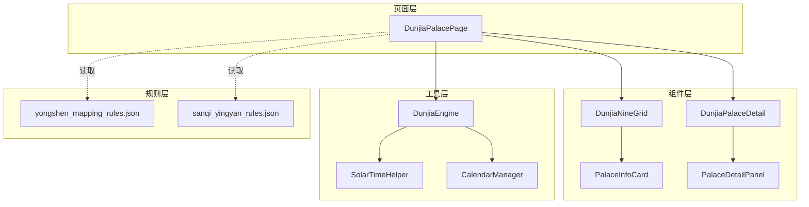
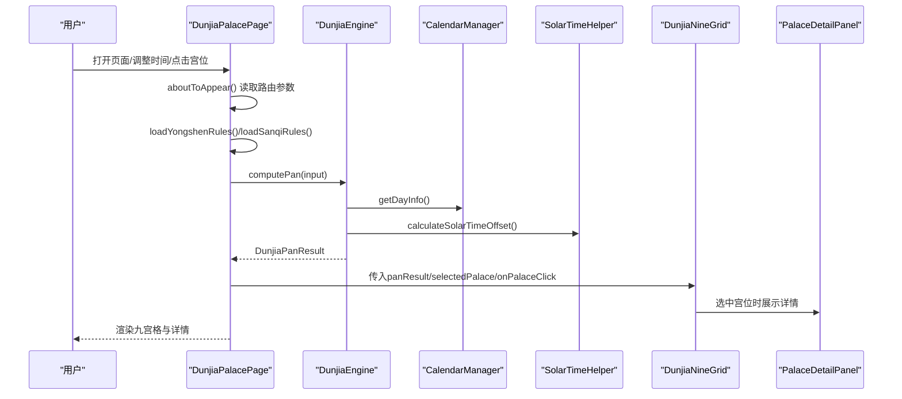
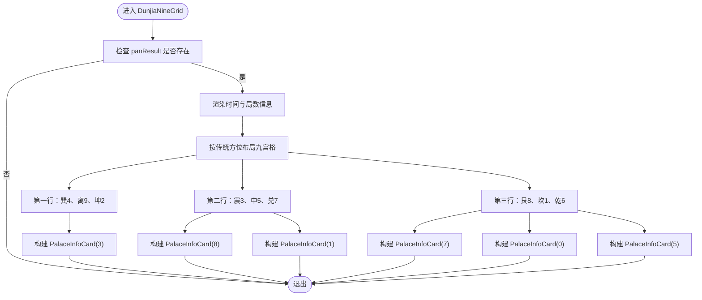
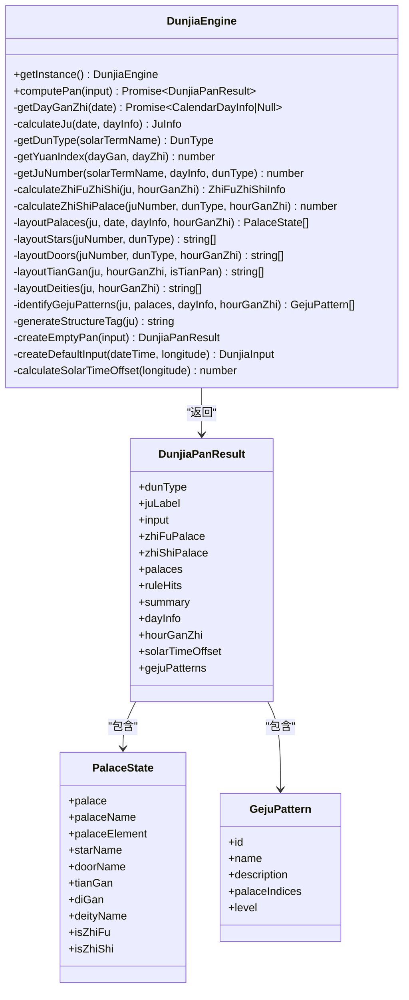
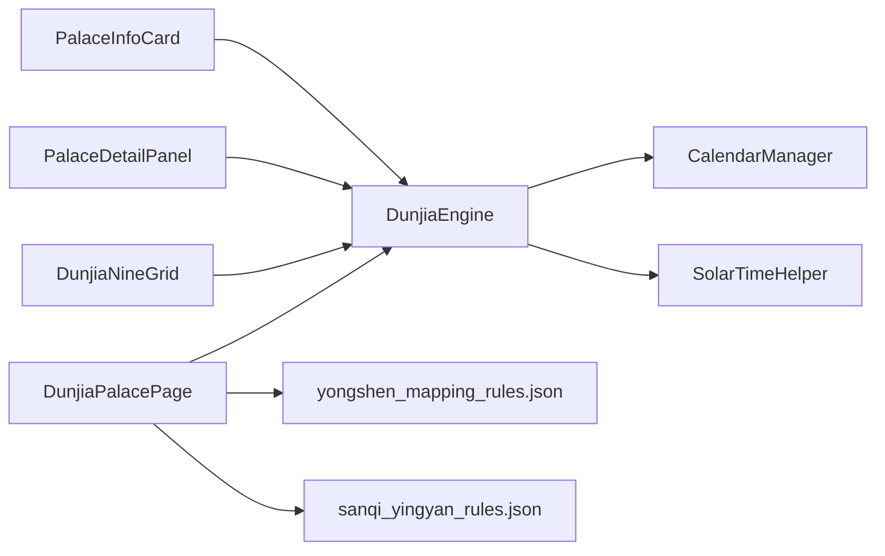

# 遁甲盘面页面

<cite>
**本文引用的文件**
- [DunjiaPalacePage.ets](file://entry/src/main/ets/pages/DunjiaPalacePage.ets)
- [DunjiaNineGrid.ets](file://entry/src/main/ets/components/DunjiaNineGrid.ets)
- [DunjiaPalaceDetail.ets](file://entry/src/main/ets/components/DunjiaPalaceDetail.ets)
- [DunjiaEngine.ets](file://entry/src/main/ets/utils/DunjiaEngine.ets)
- [PalaceInfoCard.ets](file://entry/src/main/ets/components/PalaceInfoCard.ets)
- [PalaceDetailPanel.ets](file://entry/src/main/ets/components/PalaceDetailPanel.ets)
- [SolarTimeHelper.ets](file://entry/src/main/ets/utils/SolarTimeHelper.ets)
- [CalendarManager.ets](file://entry/src/main/ets/utils/CalendarManager.ets)
- [yongshen_mapping_rules.json](file://entry/src/main/resources/rawfile/rules/yongshen_mapping_rules.json)
- [sanqi_yingyan_rules.json](file://entry/src/main/resources/rawfile/rules/sanqi_yingyan_rules.json)
</cite>

## 目录
1. [简介](#简介)
2. [项目结构](#项目结构)
3. [核心组件](#核心组件)
4. [架构总览](#架构总览)
5. [详细组件分析](#详细组件分析)
6. [依赖关系分析](#依赖关系分析)
7. [性能考量](#性能考量)
8. [故障排查指南](#故障排查指南)
9. [结论](#结论)
10. [附录](#附录)

## 简介
本文件面向“遁甲盘面页面”，系统性阐述DunjiaPalacePage的职责与交互流程，深入解析遁甲九宫格组件DunjiaNineGrid的布局算法与数据结构，详解遁甲盘面详情组件DunjiaPalaceDetail的信息展示与交互能力，并全面剖析DunjiaEngine引擎的遁甲计算逻辑与排盘算法。同时，文档给出页面数据流与状态管理机制、自定义配置与显示模式切换策略，以及扩展更多遁甲变体与高级应用的实践路径。

## 项目结构
- 页面层：DunjiaPalacePage作为入口页面，负责状态管理、规则加载、排盘计算与交互控制。
- 组件层：DunjiaNineGrid负责九宫格可视化与宫位点击；PalaceInfoCard负责单宫信息卡片渲染；PalaceDetailPanel负责宫位详情与古籍解读；DunjiaPalaceDetail为兼容层委托。
- 工具层：DunjiaEngine为核心计算引擎；SolarTimeHelper提供真太阳时计算；CalendarManager提供万年历与节气信息。
- 规则层：yongshen_mapping_rules.json提供用神映射与占断指引；sanqi_yingyan_rules.json提供三奇应验规则。

图表来源
- [DunjiaPalacePage.ets](file://entry/src/main/ets/pages/DunjiaPalacePage.ets#L1-L1017)
- [DunjiaNineGrid.ets](file://entry/src/main/ets/components/DunjiaNineGrid.ets#L1-L179)
- [PalaceInfoCard.ets](file://entry/src/main/ets/components/PalaceInfoCard.ets#L1-L179)
- [PalaceDetailPanel.ets](file://entry/src/main/ets/components/PalaceDetailPanel.ets#L1-L481)
- [DunjiaPalaceDetail.ets](file://entry/src/main/ets/components/DunjiaPalaceDetail.ets#L1-L23)
- [DunjiaEngine.ets](file://entry/src/main/ets/utils/DunjiaEngine.ets#L1-L961)
- [SolarTimeHelper.ets](file://entry/src/main/ets/utils/SolarTimeHelper.ets#L1-L270)
- [CalendarManager.ets](file://entry/src/main/ets/utils/CalendarManager.ets#L1-L123)
- [yongshen_mapping_rules.json](file://entry/src/main/resources/rawfile/rules/yongshen_mapping_rules.json#L1-L510)
- [sanqi_yingyan_rules.json](file://entry/src/main/resources/rawfile/rules/sanqi_yingyan_rules.json#L1-L525)

章节来源
- [DunjiaPalacePage.ets](file://entry/src/main/ets/pages/DunjiaPalacePage.ets#L1-L1017)
- [DunjiaEngine.ets](file://entry/src/main/ets/utils/DunjiaEngine.ets#L1-L961)

## 核心组件
- DunjiaPalacePage：页面状态管理、规则加载、排盘计算、交互控制与UI编排。
- DunjiaNineGrid：九宫格可视化、时间与局数信息展示、宫位点击回调。
- DunjiaPalaceDetail：宫位详情展示（委托PalaceDetailPanel）。
- PalaceInfoCard：单宫信息卡片，含九星、八门、三奇六仪、八神、地支与格局徽章。
- PalaceDetailPanel：基于《遁甲符应经》的九星八门知识解读、格局分析、天地盘组合吉凶判断。
- DunjiaEngine：遁甲排盘核心引擎，计算局数、值符值使、九宫要素与格局识别。
- SolarTimeHelper：真太阳时计算与经度时差修正。
- CalendarManager：万年历与节气信息查询。

章节来源
- [DunjiaPalacePage.ets](file://entry/src/main/ets/pages/DunjiaPalacePage.ets#L82-L1017)
- [DunjiaNineGrid.ets](file://entry/src/main/ets/components/DunjiaNineGrid.ets#L23-L179)
- [DunjiaPalaceDetail.ets](file://entry/src/main/ets/components/DunjiaPalaceDetail.ets#L11-L23)
- [PalaceInfoCard.ets](file://entry/src/main/ets/components/PalaceInfoCard.ets#L22-L179)
- [PalaceDetailPanel.ets](file://entry/src/main/ets/components/PalaceDetailPanel.ets#L32-L481)
- [DunjiaEngine.ets](file://entry/src/main/ets/utils/DunjiaEngine.ets#L98-L162)
- [SolarTimeHelper.ets](file://entry/src/main/ets/utils/SolarTimeHelper.ets#L29-L270)
- [CalendarManager.ets](file://entry/src/main/ets/utils/CalendarManager.ets#L30-L123)

## 架构总览
页面采用“页面-组件-引擎-规则”的分层架构：
- 页面层负责生命周期、状态与路由参数处理；
- 组件层负责UI渲染与交互；
- 引擎层负责核心计算；
- 规则层提供结构化知识与占断指引。

图表来源
- [DunjiaPalacePage.ets](file://entry/src/main/ets/pages/DunjiaPalacePage.ets#L98-L236)
- [DunjiaEngine.ets](file://entry/src/main/ets/utils/DunjiaEngine.ets#L113-L162)
- [CalendarManager.ets](file://entry/src/main/ets/utils/CalendarManager.ets#L51-L92)
- [SolarTimeHelper.ets](file://entry/src/main/ets/utils/SolarTimeHelper.ets#L54-L77)
- [DunjiaNineGrid.ets](file://entry/src/main/ets/components/DunjiaNineGrid.ets#L72-L177)
- [PalaceDetailPanel.ets](file://entry/src/main/ets/components/PalaceDetailPanel.ets#L32-L481)

## 详细组件分析

### DunjiaPalacePage：页面状态管理与交互编排
- 职责
  - 生命周期：aboutToAppear读取路由参数（时间戳），初始化状态，加载规则，执行排盘。
  - 规则加载：加载用神映射规则与三奇应验规则，解析JSON并缓存。
  - 排盘计算：构造DunjiaInput，调用DunjiaEngine.computePan，更新panResult与loading。
  - 交互控制：时间微调（小时/时辰）、恢复当前时间、宫位点击、占断事类选择与三奇象意筛选。
  - UI编排：顶部导航、时间调整区、功能导航、强凶时段提示、值符值使验证信息、九宫格、宫位详情。

- 关键状态
  - panResult：排盘结果（包含局数、值符值使、九宫状态、格局识别等）
  - selectedPalace：当前选中宫位索引
  - loading：排盘计算中状态
  - currentDateTime：当前时间
  - selectedAffair/currentAffairInfo：占断事类与当前事类信息
  - showYongshenPanel：用神指引面板显示开关
  - affairCategories/sanqiRules/currentSanqiMeanings：规则数据与筛选结果

- 数据流
  - 输入：路由参数（timestamp）、用户交互（时间调整、宫位点击、事类选择）
  - 处理：规则加载、DunjiaEngine.computePan、三奇象意筛选
  - 输出：panResult、UI渲染、详情面板

- 自定义配置与显示模式
  - longitude：经度（用于真太阳时与节气研习）
  - sceneType：研习场景（普通研习/局势研习/时机窗口研习）
  - 三奇象意显示：按事类动态筛选并展示具体象意或通用提示

章节来源
- [DunjiaPalacePage.ets](file://entry/src/main/ets/pages/DunjiaPalacePage.ets#L82-L1017)
- [yongshen_mapping_rules.json](file://entry/src/main/resources/rawfile/rules/yongshen_mapping_rules.json#L1-L510)
- [sanqi_yingyan_rules.json](file://entry/src/main/resources/rawfile/rules/sanqi_yingyan_rules.json#L1-L525)

### DunjiaNineGrid：九宫格布局与可视化
- 职责
  - 展示时间信息（阳历、农历、真太阳时偏移）、局数、概览
  - 九宫格布局（传统方位：上南下北），行/列组织
  - 渲染宫位卡片（PalaceInfoCard），支持选中态、值符/值使标识、格局徽章

- 布局算法
  - 九宫格按传统方位布局：第一行（上南）巽4、离9、坤2；第二行（中）震3、中5、兑7；第三行（下北）艮8、坎1、乾6
  - 通过buildPalaceCard(index)按索引访问panResult.palaces[index]，传递isSelected/isZhiFu/isZhiShi/patterns

- 数据结构
  - panResult：DunjiaPanResult
  - selectedPalace：number | null
  - onPalaceClick：回调函数

图表来源
- [DunjiaNineGrid.ets](file://entry/src/main/ets/components/DunjiaNineGrid.ets#L72-L177)

章节来源
- [DunjiaNineGrid.ets](file://entry/src/main/ets/components/DunjiaNineGrid.ets#L23-L179)

### PalaceInfoCard：宫位卡片渲染
- 职责
  - 展示宫名、地支、九星、八门、天盘/地盘干支、八神
  - 值符/值使角标与高亮边框与阴影
  - 格局徽章（按名称匹配颜色）

- 地支映射
  - 一宫坎→子、二宫坤→未、三宫震→卯、四宫巽→辰、五宫中→无、六宫乾→戌、七宫兑→酉、八宫艮→丑、九宫离→午

- 点击事件
  - 通过onCardClick回调通知父组件（DunjiaNineGrid）

章节来源
- [PalaceInfoCard.ets](file://entry/src/main/ets/components/PalaceInfoCard.ets#L22-L179)

### PalaceDetailPanel：宫位详情与古籍解读
- 职责
  - 基于选中宫位展示基本信息（宫位、五行、九星、八门、天盘、地盘、八神）
  - 五行生克关系
  - 九星断语与八门吉凶（含宜忌）
  - 值符/值使说明
  - 相关格局列表

- 知识来源
  - 九星断语与八门吉凶来自内置映射，体现《遁甲符应经》的研习解读

章节来源
- [PalaceDetailPanel.ets](file://entry/src/main/ets/components/PalaceDetailPanel.ets#L32-L481)

### DunjiaPalaceDetail：详情组件兼容层
- 职责
  - 委托PalaceDetailPanel，保持对外接口一致

章节来源
- [DunjiaPalaceDetail.ets](file://entry/src/main/ets/components/DunjiaPalaceDetail.ets#L11-L23)

### DunjiaEngine：遁甲排盘计算引擎
- 职责
  - 从输入时间/地点计算完整的遁甲盘面与结构化分析结果
  - 计算局数、值符值使、九宫要素（九星、八门、三奇六仪、八神）
  - 识别格局（如三奇得使、三遁、三奇合、伏吟、反吹、青龙返首等）
  - 生成结构标签与整体概览

- 关键算法
  - 时干计算：根据日干与时干起法，确定时干与地支
  - 值符值使：根据时干偏移与遁局类型（阳/阴遁）计算
  - 九宫布局：固定九星与八门地盘，按遁局与值符起宫布置三奇六仪与八神
  - 格局识别：遍历宫位，匹配规则条件，生成GejuPattern列表

- 数据结构
  - DunjiaInput：dateTime、longitude、sceneType
  - DunjiaPanResult：dunType、juLabel、input、zhiFuPalace、zhiShiPalace、palaces、ruleHits、summary、dayInfo、hourGanZhi、solarTimeOffset、gejuPatterns
  - PalaceState：宫位索引、名称、五行、九星、八门、天干（天盘/地盘）、八神、值符/值使标记
  - GejuPattern：id、name、description、palaceIndices、level

图表来源
- [DunjiaEngine.ets](file://entry/src/main/ets/utils/DunjiaEngine.ets#L98-L162)
- [DunjiaEngine.ets](file://entry/src/main/ets/utils/DunjiaEngine.ets#L59-L84)
- [DunjiaEngine.ets](file://entry/src/main/ets/utils/DunjiaEngine.ets#L30-L41)
- [DunjiaEngine.ets](file://entry/src/main/ets/utils/DunjiaEngine.ets#L89-L95)

章节来源
- [DunjiaEngine.ets](file://entry/src/main/ets/utils/DunjiaEngine.ets#L98-L961)

## 依赖关系分析
- 页面依赖引擎与规则：DunjiaPalacePage依赖DunjiaEngine进行排盘，依赖yongshen_mapping_rules.json与sanqi_yingyan_rules.json进行占断指引与三奇象意筛选。
- 组件依赖引擎：DunjiaNineGrid依赖DunjiaEngine的DunjiaPanResult；PalaceInfoCard依赖PalaceState；PalaceDetailPanel依赖DunjiaPanResult与GejuPattern。
- 引擎依赖工具：DunjiaEngine依赖CalendarManager获取干支信息，依赖SolarTimeHelper计算真太阳时偏移。
- 规则依赖：页面通过资源管理器读取JSON规则文件。

图表来源
- [DunjiaPalacePage.ets](file://entry/src/main/ets/pages/DunjiaPalacePage.ets#L1-L10)
- [DunjiaEngine.ets](file://entry/src/main/ets/utils/DunjiaEngine.ets#L1-L6)
- [CalendarManager.ets](file://entry/src/main/ets/utils/CalendarManager.ets#L1-L3)
- [SolarTimeHelper.ets](file://entry/src/main/ets/utils/SolarTimeHelper.ets#L1-L18)

章节来源
- [DunjiaPalacePage.ets](file://entry/src/main/ets/pages/DunjiaPalacePage.ets#L1-L10)
- [DunjiaEngine.ets](file://entry/src/main/ets/utils/DunjiaEngine.ets#L1-L6)

## 性能考量
- 异步排盘：computePan为异步，避免阻塞UI；页面设置loading状态提升体验。
- 缓存策略：CalendarManager对年份数据进行缓存，减少重复读取。
- 渲染优化：九宫格采用固定布局与卡片组件化，减少不必要的重绘。
- 规则加载：JSON解析与解码在aboutToAppear阶段完成，避免重复解析。
- 时间计算：SolarTimeHelper提供精确的真太阳时计算，避免频繁重复计算。

## 故障排查指南
- 排盘失败
  - 现象：loading持续为true或错误日志
  - 排查：确认DunjiaEngine.computePan返回值；检查CalendarManager.getDayInfo是否成功；检查longitude与sceneType输入
  - 参考：[DunjiaPalacePage.ets](file://entry/src/main/ets/pages/DunjiaPalacePage.ets#L218-L236)、[DunjiaEngine.ets](file://entry/src/main/ets/utils/DunjiaEngine.ets#L113-L162)
- 规则加载失败
  - 现象：用神映射或三奇应验为空
  - 排查：确认资源路径正确；检查decodeUtf8与JSON.parse；查看控制台错误
  - 参考：[DunjiaPalacePage.ets](file://entry/src/main/ets/pages/DunjiaPalacePage.ets#L120-L181)
- 真太阳时异常
  - 现象：真太阳时偏移与预期不符
  - 排查：确认longitude输入；核对calculateSolarTimeOffset公式；对比SolarTimeHelper.getTrueSolarTime
  - 参考：[DunjiaEngine.ets](file://entry/src/main/ets/utils/DunjiaEngine.ets#L658-L661)、[SolarTimeHelper.ets](file://entry/src/main/ets/utils/SolarTimeHelper.ets#L54-L77)
- 九宫格布局异常
  - 现象：宫位顺序或方位不正确
  - 排查：核对DunjiaNineGrid的行/列索引映射；确认PalaceInfoCard的地支映射
  - 参考：[DunjiaNineGrid.ets](file://entry/src/main/ets/components/DunjiaNineGrid.ets#L144-L171)、[PalaceInfoCard.ets](file://entry/src/main/ets/components/PalaceInfoCard.ets#L42-L48)

章节来源
- [DunjiaPalacePage.ets](file://entry/src/main/ets/pages/DunjiaPalacePage.ets#L120-L236)
- [DunjiaEngine.ets](file://entry/src/main/ets/utils/DunjiaEngine.ets#L658-L162)
- [SolarTimeHelper.ets](file://entry/src/main/ets/utils/SolarTimeHelper.ets#L54-L77)
- [PalaceInfoCard.ets](file://entry/src/main/ets/components/PalaceInfoCard.ets#L42-L48)

## 结论
遁甲盘面页面通过清晰的分层架构实现了从输入到可视化的完整闭环：页面负责状态与交互，组件负责渲染与细节，引擎负责核心计算，规则提供结构化知识。DunjiaNineGrid的九宫格布局遵循传统方位，PalaceDetailPanel提供深厚的古籍解读，DunjiaEngine的排盘算法严谨可靠。页面还提供了灵活的三奇象意筛选与用神指引，便于不同事务类型的占断应用。

## 附录

### 数据流与状态管理机制
- 输入：路由参数（timestamp）、用户交互（时间调整、宫位点击、事类选择）
- 处理：规则加载、DunjiaEngine.computePan、三奇象意筛选
- 输出：panResult、UI渲染、详情面板

章节来源
- [DunjiaPalacePage.ets](file://entry/src/main/ets/pages/DunjiaPalacePage.ets#L98-L236)

### 自定义配置与显示模式切换
- 经度longitude：用于真太阳时与节气研习
- 研习场景sceneType：普通研习/局势研习/时机窗口研习
- 三奇象意显示：按selectedAffair筛选sanqiRules，动态展示具体象意或通用提示

章节来源
- [DunjiaPalacePage.ets](file://entry/src/main/ets/pages/DunjiaPalacePage.ets#L222-L226)
- [DunjiaPalacePage.ets](file://entry/src/main/ets/pages/DunjiaPalacePage.ets#L357-L423)

### 扩展功能与高级应用
- 新增遁甲变体
  - 在DunjiaEngine中扩展布局算法（如不同遁局规则、特殊宫位处理）
  - 在PalaceDetailPanel中新增对应断语与吉凶解读
- 高级应用
  - 增加更多格局识别（如孤虚、天网四张、飞鸟跌穴等）
  - 引入更多规则文件与动态加载机制
  - 提供多语言与主题切换

章节来源
- [DunjiaEngine.ets](file://entry/src/main/ets/utils/DunjiaEngine.ets#L678-L801)
- [PalaceDetailPanel.ets](file://entry/src/main/ets/components/PalaceDetailPanel.ets#L101-L215)