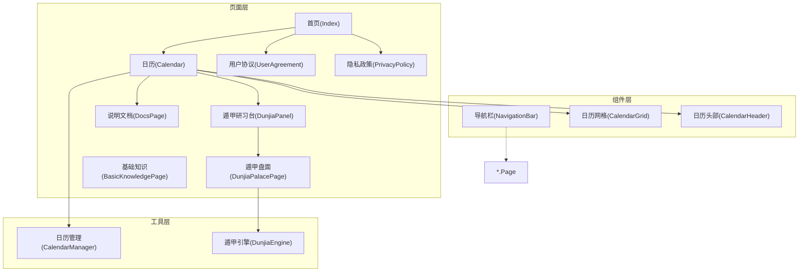
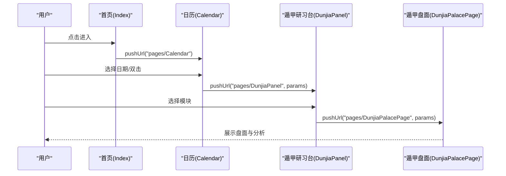
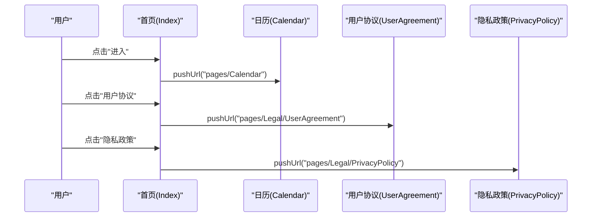
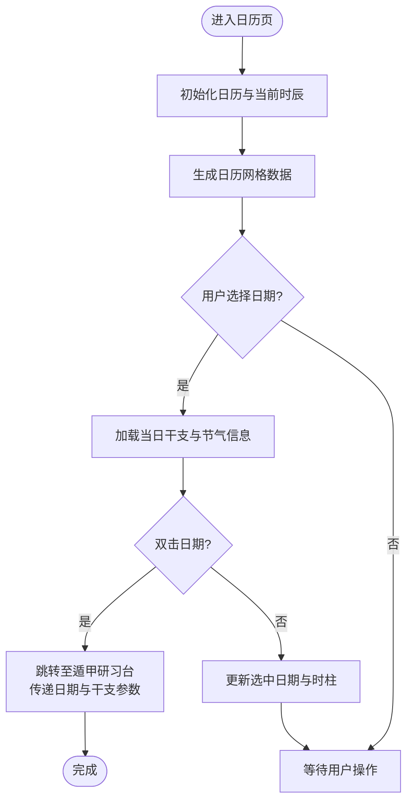
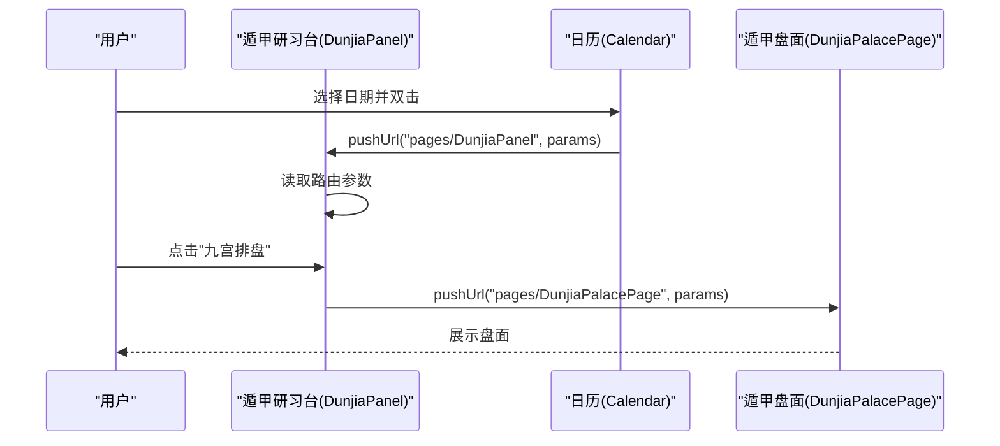
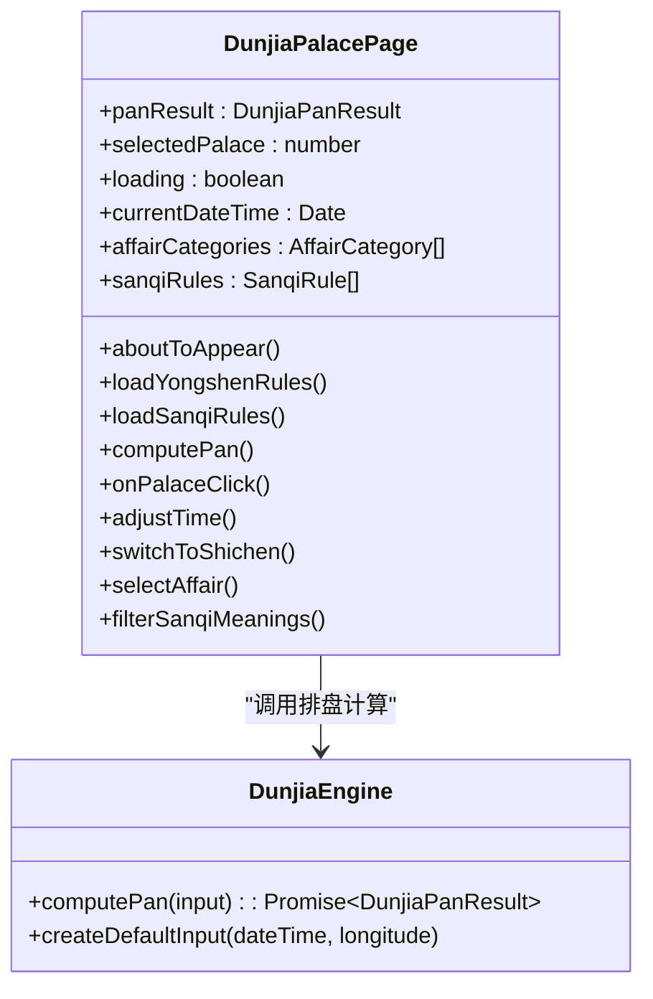
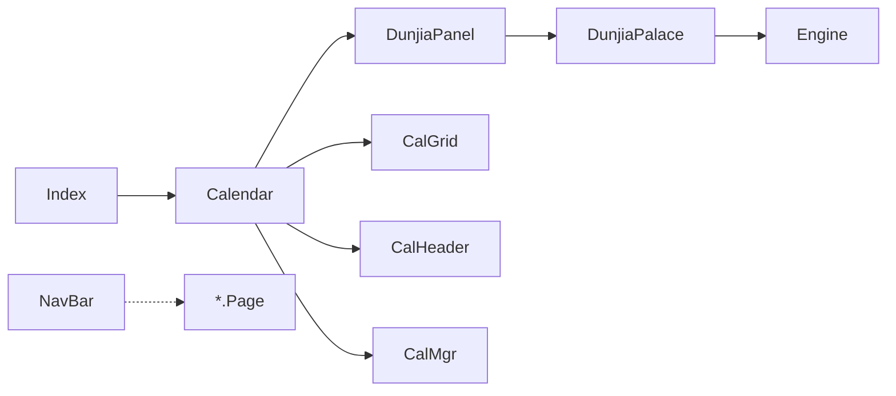

# 页面导航系统

<cite>
**本文档引用的文件**
- [Index.ets](file://entry/src/main/ets/pages/Index.ets)
- [Calendar.ets](file://entry/src/main/ets/pages/Calendar.ets)
- [DunjiaPanel.ets](file://entry/src/main/ets/pages/DunjiaPanel.ets)
- [DunjiaPalacePage.ets](file://entry/src/main/ets/pages/DunjiaPalacePage.ets)
- [BasicKnowledgePage.ets](file://entry/src/main/ets/pages/BasicKnowledgePage.ets)
- [DocsPage.ets](file://entry/src/main/ets/pages/DocsPage.ets)
- [UserAgreement.ets](file://entry/src/main/ets/pages/Legal/UserAgreement.ets)
- [PrivacyPolicy.ets](file://entry/src/main/ets/pages/Legal/PrivacyPolicy.ets)
- [NavigationBar.ets](file://entry/src/main/ets/components/NavigationBar.ets)
- [CalendarGrid.ets](file://entry/src/main/ets/components/CalendarGrid.ets)
- [CalendarHeader.ets](file://entry/src/main/ets/components/CalendarHeader.ets)
- [CalendarManager.ets](file://entry/src/main/ets/utils/CalendarManager.ets)
- [DunjiaEngine.ets](file://entry/src/main/ets/utils/DunjiaEngine.ets)
- [main_pages.json](file://entry/src/main/resources/base/profile/main_pages.json)
</cite>

## 目录
1. [简介](#简介)
2. [项目结构](#项目结构)
3. [核心组件](#核心组件)
4. [架构概览](#架构概览)
5. [详细组件分析](#详细组件分析)
6. [依赖分析](#依赖分析)
7. [性能考虑](#性能考虑)
8. [故障排除指南](#故障排除指南)
9. [结论](#结论)
10. [附录](#附录)

## 简介
本项目是一个基于 ArkTS/HarmonyOS 的遁甲应用，围绕「页面导航系统」构建了完整的页面架构与路由管理机制。系统采用统一的导航栏组件、模块化的页面设计和清晰的数据传递方式，实现了从首页到日历、遁甲盘面、基础知识等核心页面的流畅跳转与状态保持。

## 项目结构
应用采用按页面组织的结构，核心页面位于 `pages/` 目录，通用组件位于 `components/` 目录，工具类位于 `utils/` 目录。页面清单在 `main_pages.json` 中集中声明，确保路由注册的一致性。

**图表来源**
- [main_pages.json](file://entry/src/main/resources/base/profile/main_pages.json#L1-L20)
- [Index.ets](file://entry/src/main/ets/pages/Index.ets#L1-L88)
- [Calendar.ets](file://entry/src/main/ets/pages/Calendar.ets#L1-L602)
- [DunjiaPanel.ets](file://entry/src/main/ets/pages/DunjiaPanel.ets#L1-L189)
- [DunjiaPalacePage.ets](file://entry/src/main/ets/pages/DunjiaPalacePage.ets#L1-L1017)
- [BasicKnowledgePage.ets](file://entry/src/main/ets/pages/BasicKnowledgePage.ets#L1-L794)
- [DocsPage.ets](file://entry/src/main/ets/pages/DocsPage.ets#L1-L227)
- [UserAgreement.ets](file://entry/src/main/ets/pages/Legal/UserAgreement.ets#L1-L154)
- [PrivacyPolicy.ets](file://entry/src/main/ets/pages/Legal/PrivacyPolicy.ets#L1-L243)
- [NavigationBar.ets](file://entry/src/main/ets/components/NavigationBar.ets#L1-L86)
- [CalendarGrid.ets](file://entry/src/main/ets/components/CalendarGrid.ets#L1-L167)
- [CalendarHeader.ets](file://entry/src/main/ets/components/CalendarHeader.ets#L1-L108)
- [CalendarManager.ets](file://entry/src/main/ets/utils/CalendarManager.ets#L1-L123)
- [DunjiaEngine.ets](file://entry/src/main/ets/utils/DunjiaEngine.ets#L1-L961)

**章节来源**
- [main_pages.json](file://entry/src/main/resources/base/profile/main_pages.json#L1-L20)

## 核心组件
- 导航栏组件：提供统一的标题、返回与右侧操作按钮，支持自定义颜色与行为。
- 日历组件：封装日历网格与头部，提供日期选择、双击快速进入、节日与节气标记。
- 页面入口：首页负责协议链接与进入日历；日历页负责日期选择与进入遁甲盘面；遁甲研习台作为模块导航入口，承载多个研习模块。

**章节来源**
- [NavigationBar.ets](file://entry/src/main/ets/components/NavigationBar.ets#L1-L86)
- [CalendarGrid.ets](file://entry/src/main/ets/components/CalendarGrid.ets#L1-L167)
- [CalendarHeader.ets](file://entry/src/main/ets/components/CalendarHeader.ets#L1-L108)
- [Index.ets](file://entry/src/main/ets/pages/Index.ets#L1-L88)
- [Calendar.ets](file://entry/src/main/ets/pages/Calendar.ets#L1-L602)
- [DunjiaPanel.ets](file://entry/src/main/ets/pages/DunjiaPanel.ets#L1-L189)

## 架构概览
系统采用「页面-组件-工具」分层架构：
- 页面层：负责业务流程与状态管理，使用路由进行页面跳转与参数传递。
- 组件层：提供可复用的 UI 组件，降低页面耦合度。
- 工具层：封装业务逻辑与数据访问，如日历数据与遁甲排盘引擎。

**图表来源**
- [Index.ets](file://entry/src/main/ets/pages/Index.ets#L6-L14)
- [Calendar.ets](file://entry/src/main/ets/pages/Calendar.ets#L243-L304)
- [DunjiaPanel.ets](file://entry/src/main/ets/pages/DunjiaPanel.ets#L159-L176)
- [DunjiaPalacePage.ets](file://entry/src/main/ets/pages/DunjiaPalacePage.ets#L98-L115)

## 详细组件分析

### 首页(Index)
- 功能定位：应用入口，提供「进入」按钮与协议链接。
- 用户交互：点击「进入」跳转至日历页；点击协议链接跳转至相应法律页面。
- 路由管理：使用 `router.pushUrl` 实现页面跳转。

**图表来源**
- [Index.ets](file://entry/src/main/ets/pages/Index.ets#L6-L14)
- [UserAgreement.ets](file://entry/src/main/ets/pages/Legal/UserAgreement.ets#L1-L154)
- [PrivacyPolicy.ets](file://entry/src/main/ets/pages/Legal/PrivacyPolicy.ets#L1-L243)

**章节来源**
- [Index.ets](file://entry/src/main/ets/pages/Index.ets#L1-L88)

### 日历页(Calendar)
- 功能定位：提供万年历视图，支持年/月切换、今日回到、节气与节日展示、真太阳时说明。
- 用户交互：点击日期选择，双击日期快速进入遁甲盘面；通过导航栏右侧按钮进入说明文档。
- 数据传递：将选中日期与干支信息通过路由参数传递给遁甲研习台。
- 生命周期：`aboutToAppear` 初始化日历与当前时辰，生成日历网格数据。

**图表来源**
- [Calendar.ets](file://entry/src/main/ets/pages/Calendar.ets#L32-L43)
- [Calendar.ets](file://entry/src/main/ets/pages/Calendar.ets#L46-L137)
- [Calendar.ets](file://entry/src/main/ets/pages/Calendar.ets#L228-L248)
- [Calendar.ets](file://entry/src/main/ets/pages/Calendar.ets#L272-L304)

**章节来源**
- [Calendar.ets](file://entry/src/main/ets/pages/Calendar.ets#L1-L602)
- [CalendarGrid.ets](file://entry/src/main/ets/components/CalendarGrid.ets#L1-L167)
- [CalendarHeader.ets](file://entry/src/main/ets/components/CalendarHeader.ets#L1-L108)
- [CalendarManager.ets](file://entry/src/main/ets/utils/CalendarManager.ets#L1-L123)

### 遁甲研习台(DunjiaPanel)
- 功能定位：模块化导航入口，提供奇门遁甲各研习模块的入口卡片。
- 用户交互：点击卡片进入对应模块；对需要时间参数的模块（如九宫排盘、三奇应验、攻守方位）自动传递时间戳。
- 数据传递：从路由参数接收日期与干支信息，按需转发给目标页面。

**图表来源**
- [DunjiaPanel.ets](file://entry/src/main/ets/pages/DunjiaPanel.ets#L34-L48)
- [DunjiaPanel.ets](file://entry/src/main/ets/pages/DunjiaPanel.ets#L159-L176)
- [DunjiaPalacePage.ets](file://entry/src/main/ets/pages/DunjiaPalacePage.ets#L98-L115)

**章节来源**
- [DunjiaPanel.ets](file://entry/src/main/ets/pages/DunjiaPanel.ets#L1-L189)

### 遁甲盘面(DunjiaPalacePage)
- 功能定位：展示九宫时空盘面，提供用神指引、三奇象意、时间调整等功能。
- 数据来源：通过路由参数接收时间戳与干支信息，调用遁甲引擎计算盘面。
- 规则加载：从资源文件加载用神映射与三奇应验规则，解析为结构化数据。

**图表来源**
- [DunjiaPalacePage.ets](file://entry/src/main/ets/pages/DunjiaPalacePage.ets#L84-L115)
- [DunjiaPalacePage.ets](file://entry/src/main/ets/pages/DunjiaPalacePage.ets#L120-L181)
- [DunjiaPalacePage.ets](file://entry/src/main/ets/pages/DunjiaPalacePage.ets#L218-L236)
- [DunjiaEngine.ets](file://entry/src/main/ets/utils/DunjiaEngine.ets#L113-L162)

**章节来源**
- [DunjiaPalacePage.ets](file://entry/src/main/ets/pages/DunjiaPalacePage.ets#L1-L1017)
- [DunjiaEngine.ets](file://entry/src/main/ets/utils/DunjiaEngine.ets#L1-L961)

### 基础知识页(BasicKnowledgePage)
- 功能定位：系统化展示奇门遁甲基础知识，包括九星、八门、三奇、阴阳遁、排盘流程、神煞理论等。
- 用户交互：左侧章节列表，右侧内容区滚动展示；内置迷你九宫示意图辅助理解。
- 数据组织：章节与小节结构化存储，支持渲染要点总结与示意图。

**章节来源**
- [BasicKnowledgePage.ets](file://entry/src/main/ets/pages/BasicKnowledgePage.ets#L1-L794)

### 说明文档页(DocsPage)
- 功能定位：展示真太阳时与术数说明，支持文档切换与加载。
- 用户交互：顶部标签切换文档内容；底部返回按钮返回上一页。
- 数据加载：通过资源管理器读取 Markdown 文件，UTF-8 解码避免乱码。

**章节来源**
- [DocsPage.ets](file://entry/src/main/ets/pages/DocsPage.ets#L1-L227)

### 法律页面(UserAgreement/PrivacyPolicy)
- 功能定位：展示用户协议与隐私政策全文。
- 用户交互：顶部返回按钮；隐私政策页内可直接跳转至隐私政策页面。

**章节来源**
- [UserAgreement.ets](file://entry/src/main/ets/pages/Legal/UserAgreement.ets#L1-L154)
- [PrivacyPolicy.ets](file://entry/src/main/ets/pages/Legal/PrivacyPolicy.ets#L1-L243)

## 依赖分析
- 页面依赖：首页依赖日历页；日历页依赖遁甲研习台；遁甲研习台依赖遁甲盘面；日历页依赖日历组件与日历管理器；遁甲盘面依赖遁甲引擎。
- 组件依赖：各页面均依赖导航栏组件；日历页依赖日历网格与日历头部组件。
- 工具依赖：日历页依赖日历管理器；遁甲盘面依赖遁甲引擎。

**图表来源**
- [Index.ets](file://entry/src/main/ets/pages/Index.ets#L1-L88)
- [Calendar.ets](file://entry/src/main/ets/pages/Calendar.ets#L1-L602)
- [DunjiaPanel.ets](file://entry/src/main/ets/pages/DunjiaPanel.ets#L1-L189)
- [DunjiaPalacePage.ets](file://entry/src/main/ets/pages/DunjiaPalacePage.ets#L1-L1017)
- [NavigationBar.ets](file://entry/src/main/ets/components/NavigationBar.ets#L1-L86)
- [CalendarGrid.ets](file://entry/src/main/ets/components/CalendarGrid.ets#L1-L167)
- [CalendarHeader.ets](file://entry/src/main/ets/components/CalendarHeader.ets#L1-L108)
- [CalendarManager.ets](file://entry/src/main/ets/utils/CalendarManager.ets#L1-L123)
- [DunjiaEngine.ets](file://entry/src/main/ets/utils/DunjiaEngine.ets#L1-L961)

**章节来源**
- [main_pages.json](file://entry/src/main/resources/base/profile/main_pages.json#L1-L20)

## 性能考虑
- 日历渲染优化：批量获取日期信息并通过 Promise.all 并行处理，减少渲染等待时间。
- 资源加载优化：日历管理器对 JSON 数据进行缓存，避免重复读取。
- 页面懒加载：说明文档按需加载 Markdown 内容，减少初始内存占用。
- 组件复用：导航栏与日历组件在多页面复用，降低代码重复与维护成本。

**章节来源**
- [Calendar.ets](file://entry/src/main/ets/pages/Calendar.ets#L83-L85)
- [CalendarManager.ets](file://entry/src/main/ets/utils/CalendarManager.ets#L62-L69)
- [DocsPage.ets](file://entry/src/main/ets/pages/DocsPage.ets#L17-L46)

## 故障排除指南
- 文档加载失败：检查资源管理器可用性与文件路径，确认 UTF-8 解码逻辑正确。
- 日历数据为空：确认年份范围与 JSON 文件命名规则匹配，检查缓存初始化。
- 路由参数缺失：在目标页面增加参数校验与默认值处理，避免空指针异常。
- 导航栏点击无效：检查组件属性绑定与回调函数是否正确传递。

**章节来源**
- [DocsPage.ets](file://entry/src/main/ets/pages/DocsPage.ets#L22-L46)
- [CalendarManager.ets](file://entry/src/main/ets/utils/CalendarManager.ets#L51-L92)
- [DunjiaPalacePage.ets](file://entry/src/main/ets/pages/DunjiaPalacePage.ets#L98-L115)
- [NavigationBar.ets](file://entry/src/main/ets/components/NavigationBar.ets#L35-L84)

## 结论
本页面导航系统通过清晰的页面分层、统一的组件设计与规范的路由管理，实现了从首页到日历、遁甲盘面与基础知识等核心页面的顺畅流转。系统在数据传递、生命周期管理与状态保持方面具备良好实践，同时在性能与可维护性方面提供了优化建议。建议在后续版本中进一步完善错误处理与国际化支持，提升用户体验与可扩展性。

## 附录
- 页面清单：首页、日历、遁甲研习台、遁甲盘面、基础知识、说明文档、用户协议、隐私政策等。
- 组件清单：导航栏、日历网格、日历头部等。
- 工具清单：日历管理器、遁甲引擎等。

**章节来源**
- [main_pages.json](file://entry/src/main/resources/base/profile/main_pages.json#L1-L20)