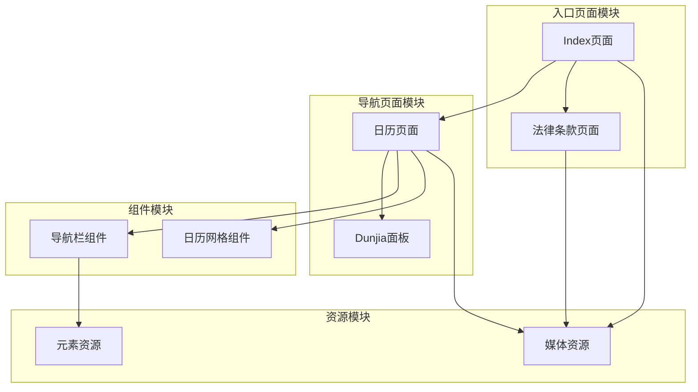
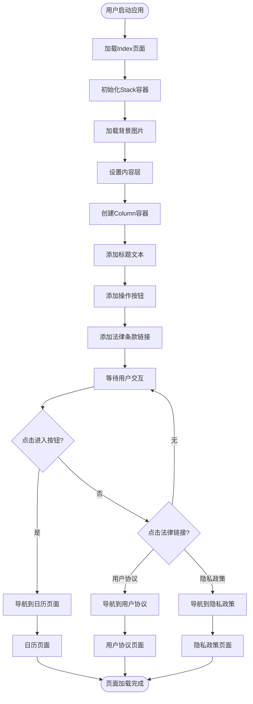
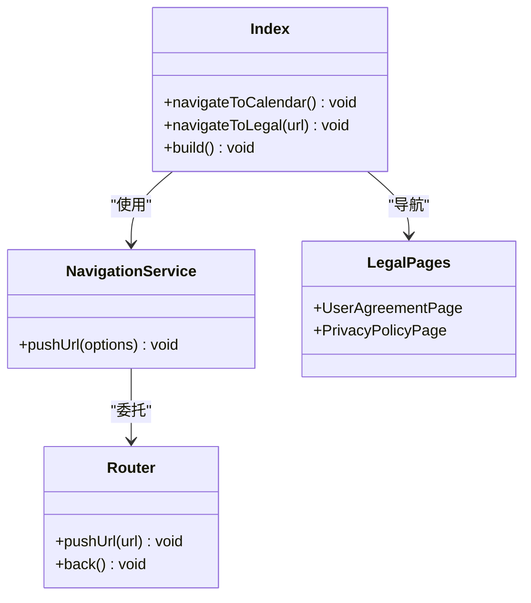
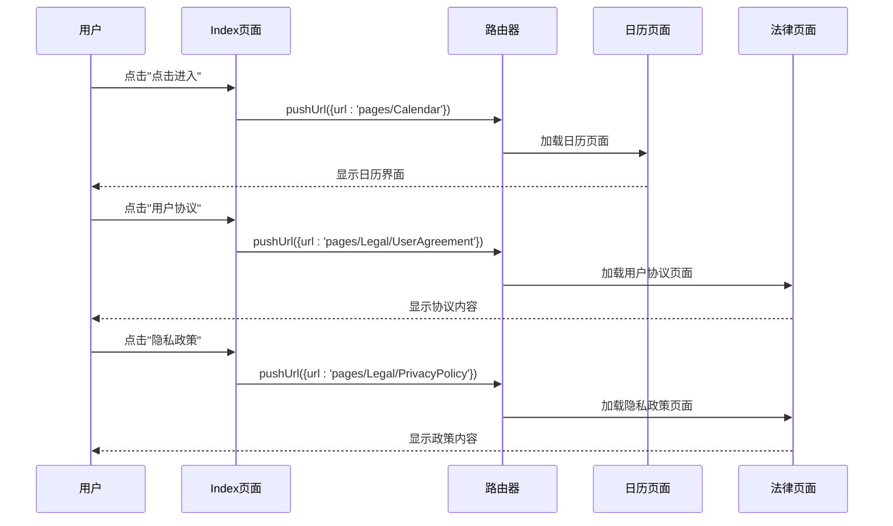
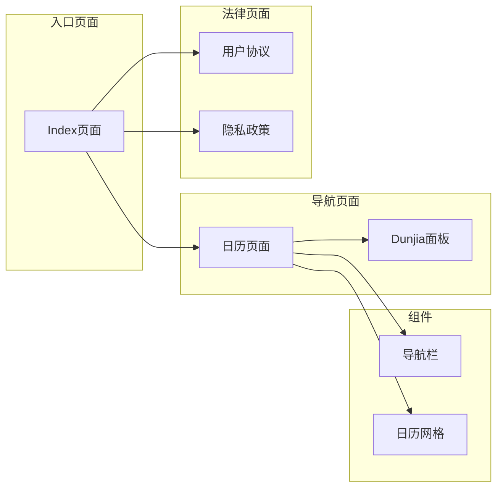

# 首页入口页面

<cite>
**本文档引用的文件**
- [Index.ets](file://entry/src/main/ets/pages/Index.ets)
- [Calendar.ets](file://entry/src/main/ets/pages/Calendar.ets)
- [UserAgreement.ets](file://entry/src/main/ets/pages/Legal/UserAgreement.ets)
- [PrivacyPolicy.ets](file://entry/src/main/ets/pages/Legal/PrivacyPolicy.ets)
- [main_pages.json](file://entry/src/main/resources/base/profile/main_pages.json)
- [color.json](file://entry/src/main/resources/base/element/color.json)
- [string.json](file://entry/src/main/resources/base/element/string.json)
- [layered_image.json](file://entry/src/main/resources/base/media/layered_image.json)
- [NavigationBar.ets](file://entry/src/main/ets/components/NavigationBar.ets)
</cite>

## 目录
1. [简介](#简介)
2. [项目结构](#项目结构)
3. [核心组件](#核心组件)
4. [架构概览](#架构概览)
5. [详细组件分析](#详细组件分析)
6. [依赖关系分析](#依赖关系分析)
7. [性能考虑](#性能考虑)
8. [故障排除指南](#故障排除指南)
9. [结论](#结论)
10. [附录](#附录)

## 简介
首页入口页面(Index)是应用的主入口，承担着品牌展示、功能引导和用户体验的第一触点职责。该页面采用简洁而富有文化内涵的设计语言，通过Stack和Column容器的层次结构，营造出沉浸式的视觉体验。页面不仅实现了基础的导航功能，还集成了法律条款展示，体现了对用户知情权和合规性的重视。

## 项目结构
首页入口页面位于entry模块的pages目录下，采用ArkTS框架构建，遵循HarmonyOS应用开发规范。整个项目采用模块化设计，各个页面和组件相互独立又有机协作。



**图表来源**
- [Index.ets](file://entry/src/main/ets/pages/Index.ets#L1-L88)
- [Calendar.ets](file://entry/src/main/ets/pages/Calendar.ets#L1-L602)
- [main_pages.json](file://entry/src/main/resources/base/profile/main_pages.json#L1-L20)

**章节来源**
- [Index.ets](file://entry/src/main/ets/pages/Index.ets#L1-L88)
- [main_pages.json](file://entry/src/main/resources/base/profile/main_pages.json#L1-L20)

## 核心组件
首页入口页面的核心组件包括：

### Stack容器层次结构
页面采用Stack容器作为根布局，通过图层叠加实现复杂的视觉效果。Stack容器提供了绝对定位的能力，使得背景图片和前景内容可以精确对齐。

### Column容器布局系统
- **顶层Column**: 包含品牌展示区域，使用layoutWeight属性实现垂直空间分配
- **底层Column**: 包含操作按钮和法律条款链接，采用居中对齐和底部内边距
- **内部Column**: 实现标题文本的垂直居中显示

### 视觉设计元素
- **背景图片**: 使用dunjia_background.png实现全屏覆盖
- **标题文本**: "遁甲符应经"采用大字号粗体设计，配合文字阴影效果
- **按钮样式**: "点击进入"文本按钮带有下划线装饰和透明度效果
- **法律条款**: 用户协议和隐私政策链接采用半透明白色字体

**章节来源**
- [Index.ets](file://entry/src/main/ets/pages/Index.ets#L16-L87)

## 架构概览
首页入口页面的架构设计体现了清晰的分层原则和职责分离：



**图表来源**
- [Index.ets](file://entry/src/main/ets/pages/Index.ets#L6-L14)
- [Calendar.ets](file://entry/src/main/ets/pages/Calendar.ets#L272-L304)
- [UserAgreement.ets](file://entry/src/main/ets/pages/Legal/UserAgreement.ets#L1-L154)
- [PrivacyPolicy.ets](file://entry/src/main/ets/pages/Legal/PrivacyPolicy.ets#L1-L243)

## 详细组件分析

### Index页面组件结构
Index页面采用组件化设计，通过装饰器(@Entry, @Component)声明页面特性，实现了良好的可维护性和复用性。



**图表来源**
- [Index.ets](file://entry/src/main/ets/pages/Index.ets#L3-L14)
- [UserAgreement.ets](file://entry/src/main/ets/pages/Legal/UserAgreement.ets#L3-L5)
- [PrivacyPolicy.ets](file://entry/src/main/ets/pages/Legal/PrivacyPolicy.ets#L3-L5)

### 视觉设计实现细节

#### 背景图片处理
页面使用Stack容器的背景层实现全屏覆盖效果，通过objectFit属性确保图片适配屏幕比例。

#### 文本样式系统
- **标题文本**: 36号粗体字，白色字体，配合8号阴影效果
- **进入按钮**: 18号字，白色下划线装饰，4号阴影效果
- **法律链接**: 14号字，白色半透明效果，4号阴影

#### 交互反馈机制
页面通过onClick事件处理器实现用户交互，每个可点击元素都提供了即时的视觉反馈。

**章节来源**
- [Index.ets](file://entry/src/main/ets/pages/Index.ets#L16-L87)

### 导航流程分析

#### 主要导航路径


**图表来源**
- [Index.ets](file://entry/src/main/ets/pages/Index.ets#L6-L14)
- [Calendar.ets](file://entry/src/main/ets/pages/Calendar.ets#L272-L304)
- [UserAgreement.ets](file://entry/src/main/ets/pages/Legal/UserAgreement.ets#L1-L154)
- [PrivacyPolicy.ets](file://entry/src/main/ets/pages/Legal/PrivacyPolicy.ets#L1-L243)

**章节来源**
- [Index.ets](file://entry/src/main/ets/pages/Index.ets#L6-L14)

### 法律条款处理机制
Index页面集成了完整的法律条款导航系统，通过统一的navigateToLegal方法处理不同类型的法律文档。

#### 用户协议页面
用户协议页面采用标准的法律文档格式，包含完整的条款内容和返回导航功能。

#### 隐私政策页面  
隐私政策页面详细说明了数据收集、存储和使用政策，符合现代应用的合规要求。

**章节来源**
- [UserAgreement.ets](file://entry/src/main/ets/pages/Legal/UserAgreement.ets#L1-L154)
- [PrivacyPolicy.ets](file://entry/src/main/ets/pages/Legal/PrivacyPolicy.ets#L1-L243)

## 依赖关系分析

### 页面依赖关系


**图表来源**
- [main_pages.json](file://entry/src/main/resources/base/profile/main_pages.json#L1-L20)
- [Index.ets](file://entry/src/main/ets/pages/Index.ets#L1-L88)

### 资源依赖分析
页面依赖多种资源类型，包括媒体资源和元素资源：

- **媒体资源**: 背景图片、品牌Logo、前景装饰
- **元素资源**: 字体颜色、字符串国际化、主题色彩

**章节来源**
- [main_pages.json](file://entry/src/main/resources/base/profile/main_pages.json#L1-L20)
- [color.json](file://entry/src/main/resources/base/element/color.json#L1-L8)
- [string.json](file://entry/src/main/resources/base/element/string.json#L1-L16)

## 性能考虑
首页入口页面在设计时充分考虑了性能优化：

### 图片加载优化
- 使用合适的图片尺寸避免内存浪费
- 采用渐进式加载减少首屏等待时间
- 合理的图片压缩策略平衡质量与体积

### 布局渲染优化
- Stack容器的层级管理避免过度重绘
- Column容器的空间分配算法高效
- 文本阴影效果的性能影响最小化

### 导航性能
- 懒加载策略避免不必要的页面初始化
- 路由缓存机制提升页面切换速度
- 异步加载大型组件的时机控制

## 故障排除指南

### 常见问题诊断
1. **页面无法加载**
   - 检查main_pages.json中的页面注册
   - 验证资源文件路径正确性
   - 确认路由参数格式正确

2. **图片显示异常**
   - 检查图片文件是否存在
   - 验证图片格式兼容性
   - 确认图片尺寸适配要求

3. **导航功能失效**
   - 检查router.pushUrl方法调用
   - 验证目标页面URL格式
   - 确认页面组件装饰器正确

### 调试建议
- 使用开发者工具检查页面渲染状态
- 监控内存使用情况避免泄漏
- 测试不同设备分辨率下的显示效果

**章节来源**
- [Index.ets](file://entry/src/main/ets/pages/Index.ets#L1-L88)
- [main_pages.json](file://entry/src/main/resources/base/profile/main_pages.json#L1-L20)

## 结论
首页入口页面成功实现了简洁而富有文化内涵的设计目标，通过合理的容器层次结构和交互设计，为用户提供了清晰的功能引导和良好的视觉体验。页面不仅具备基础的导航功能，还体现了现代应用对法律合规的重视。整体架构设计合理，组件职责明确，为后续的功能扩展奠定了坚实基础。

## 附录

### 页面定制化修改建议

#### 视觉风格调整
1. **色彩方案定制**
   - 修改标题颜色值调整品牌色调
   - 调整按钮透明度实现不同的视觉权重
   - 自定义阴影效果增强层次感

2. **布局结构调整**
   - 调整Column容器的space参数改变间距
   - 修改layoutWeight实现不同的空间分配
   - 重新排列元素顺序优化信息层级

#### 功能扩展方案
1. **多入口选项支持**
   ```typescript
   // 添加新的入口选项
   navigateToNewFeature() {
     router.pushUrl({ url: 'pages/NewFeature' })
   }
   ```

2. **动态内容展示**
   - 集成轮播图组件展示最新内容
   - 添加通知徽章显示重要信息
   - 实现个性化推荐内容

3. **交互增强**
   - 添加手势识别支持
   - 实现动画过渡效果
   - 增加无障碍访问支持

#### 样式调整方法
1. **全局样式管理**
   - 通过color.json统一管理色彩变量
   - 使用string.json实现多语言支持
   - 创建主题切换机制

2. **响应式设计**
   - 实现不同屏幕尺寸的适配
   - 支持横竖屏切换
   - 适配不同设备密度

**章节来源**
- [Index.ets](file://entry/src/main/ets/pages/Index.ets#L16-L87)
- [color.json](file://entry/src/main/resources/base/element/color.json#L1-L8)
- [string.json](file://entry/src/main/resources/base/element/string.json#L1-L16)