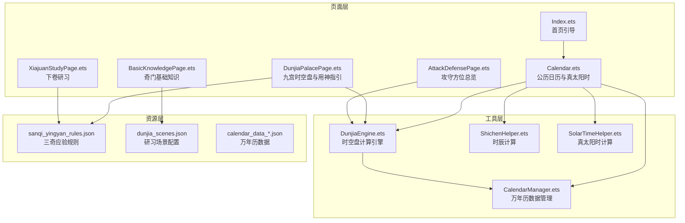
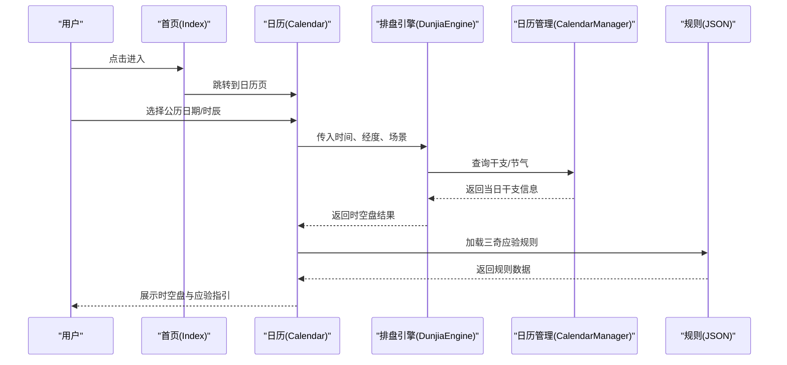
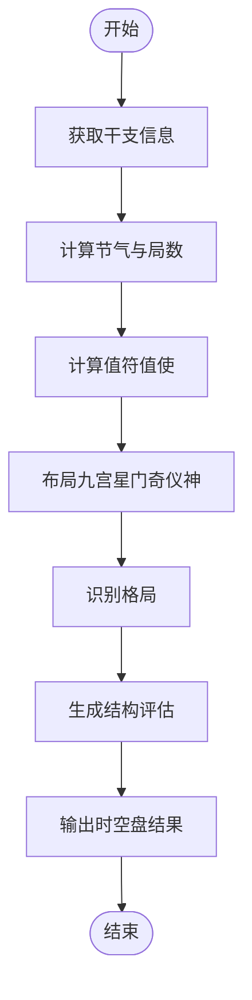
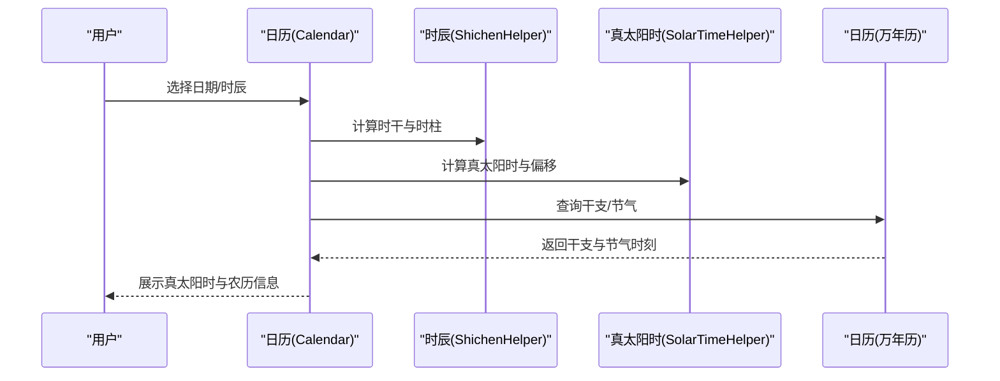
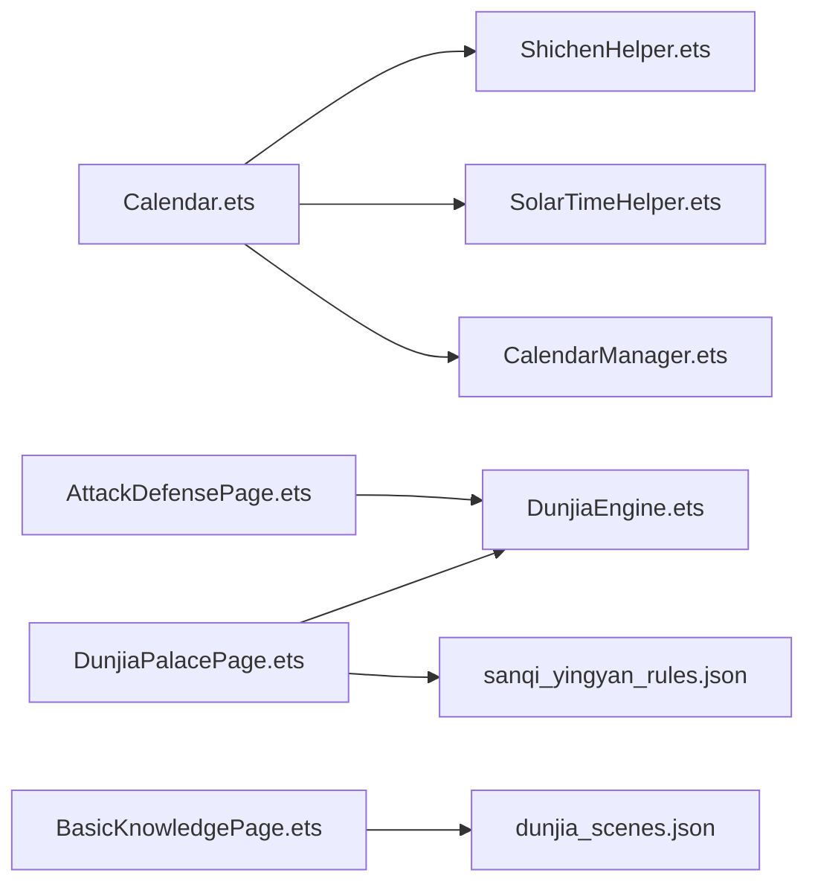

# 功能特性

<cite>
**本文引用的文件**
- [Index.ets](file://entry/src/main/ets/pages/Index.ets)
- [Calendar.ets](file://entry/src/main/ets/pages/Calendar.ets)
- [DunjiaPalacePage.ets](file://entry/src/main/ets/pages/DunjiaPalacePage.ets)
- [AttackDefensePage.ets](file://entry/src/main/ets/pages/AttackDefensePage.ets)
- [BasicKnowledgePage.ets](file://entry/src/main/ets/pages/BasicKnowledgePage.ets)
- [XiajuanStudyPage.ets](file://entry/src/main/ets/pages/XiajuanStudyPage.ets)
- [DunjiaEngine.ets](file://entry/src/main/ets/utils/DunjiaEngine.ets)
- [CalendarManager.ets](file://entry/src/main/ets/utils/CalendarManager.ets)
- [ShichenHelper.ets](file://entry/src/main/ets/utils/ShichenHelper.ets)
- [SolarTimeHelper.ets](file://entry/src/main/ets/utils/SolarTimeHelper.ets)
- [sanqi_yingyan_rules.json](file://entry/src/main/resources/rawfile/rules/sanqi_yingyan_rules.json)
- [dunjia_scenes.json](file://entry/src/main/resources/rawfile/dunjia_scenes.json)
- [calendar_data_0001.json](file://entry/src/main/resources/rawfile/calendar/calendar_data_0001.json)
</cite>

## 目录
1. [简介](#简介)
2. [项目结构](#项目结构)
3. [核心组件](#核心组件)
4. [架构总览](#架构总览)
5. [详细组件分析](#详细组件分析)
6. [依赖分析](#依赖分析)
7. [性能考虑](#性能考虑)
8. [故障排查指南](#故障排查指南)
9. [结论](#结论)
10. [附录](#附录)

## 简介
本项目为“遁甲符应经”应用，围绕奇门遁甲时空盘进行系统化呈现与交互体验设计，提供从基础认知到实战应用的全链路功能。核心目标包括：
- 时空盘计算：基于公历时间、地理经度与研习场景，输出九宫结构、值符值使、三奇六仪、八门九星、八神等完整盘面，并给出结构化评估与格局识别。
- 日历集成：内置万年历数据，支持公历日期选择、真太阳时校正、节气与干支信息展示。
- 研习场景：覆盖普通研习、布局/态势研习、时机窗口研习等多层级场景。
- 规则识别与格局分析：基于规则库识别三奇得使、三遁、三奇合、伏吟、反吹等格局，提供研习向提示。
- 用户界面：首页引导、日历选择、排盘展示、攻守总览、知识体系、下卷研习等页面，强调直观与可探索性。

## 项目结构
应用采用页面-工具-资源的分层组织：
- 页面层：首页、日历、排盘、攻守、知识、下卷研习等页面，承担用户交互与内容展示。
- 工具层：日历管理、排盘引擎、时辰与真太阳时工具、节气计算器等，提供数据与算法能力。
- 资源层：规则JSON、日历数据JSON、静态资源与媒体素材，支撑规则解析与历史数据查询。

图表来源
- [Index.ets](file://entry/src/main/ets/pages/Index.ets#L1-L88)
- [Calendar.ets](file://entry/src/main/ets/pages/Calendar.ets#L1-L602)
- [DunjiaPalacePage.ets](file://entry/src/main/ets/pages/DunjiaPalacePage.ets#L1-L1017)
- [AttackDefensePage.ets](file://entry/src/main/ets/pages/AttackDefensePage.ets#L1-L301)
- [BasicKnowledgePage.ets](file://entry/src/main/ets/pages/BasicKnowledgePage.ets#L1-L794)
- [XiajuanStudyPage.ets](file://entry/src/main/ets/pages/XiajuanStudyPage.ets#L1-L369)
- [DunjiaEngine.ets](file://entry/src/main/ets/utils/DunjiaEngine.ets#L1-L961)
- [CalendarManager.ets](file://entry/src/main/ets/utils/CalendarManager.ets#L1-L123)
- [ShichenHelper.ets](file://entry/src/main/ets/utils/ShichenHelper.ets#L1-L114)
- [SolarTimeHelper.ets](file://entry/src/main/ets/utils/SolarTimeHelper.ets#L1-L270)
- [sanqi_yingyan_rules.json](file://entry/src/main/resources/rawfile/rules/sanqi_yingyan_rules.json#L1-L525)
- [dunjia_scenes.json](file://entry/src/main/resources/rawfile/dunjia_scenes.json#L1-L50)
- [calendar_data_0001.json](file://entry/src/main/resources/rawfile/calendar/calendar_data_0001.json#L1-L200)

章节来源
- [Index.ets](file://entry/src/main/ets/pages/Index.ets#L1-L88)
- [Calendar.ets](file://entry/src/main/ets/pages/Calendar.ets#L1-L602)
- [DunjiaEngine.ets](file://entry/src/main/ets/utils/DunjiaEngine.ets#L1-L961)
- [CalendarManager.ets](file://entry/src/main/ets/utils/CalendarManager.ets#L1-L123)
- [ShichenHelper.ets](file://entry/src/main/ets/utils/ShichenHelper.ets#L1-L114)
- [SolarTimeHelper.ets](file://entry/src/main/ets/utils/SolarTimeHelper.ets#L1-L270)
- [sanqi_yingyan_rules.json](file://entry/src/main/resources/rawfile/rules/sanqi_yingyan_rules.json#L1-L525)
- [dunjia_scenes.json](file://entry/src/main/resources/rawfile/dunjia_scenes.json#L1-L50)
- [calendar_data_0001.json](file://entry/src/main/resources/rawfile/calendar/calendar_data_0001.json#L1-L200)

## 核心组件
- 时空盘计算引擎（DunjiaEngine）
  - 输入参数：公历时间、地理经度、研习场景类型。
  - 输出结果：阴阳遁类型、局数标签、值符值使宫位、九宫状态、规则命中、结构评估、干支信息、真太阳时偏移、格局识别等。
  - 关键算法：节气判定、局数计算、值符值使飞布、九星八门三奇六仪八神布局、真太阳时偏移计算、格局识别。
- 日历与节气（CalendarManager、SolarTermCalculator）
  - 万年历数据按年分片加载，支持节气精确时刻与干支信息查询。
- 时辰与真太阳时（ShichenHelper、SolarTimeHelper）
  - 提供时辰列表、日干起时法、真太阳时计算与本地时间差异展示。
- 规则库与研习场景
  - 三奇应验规则（日奇/月奇/星奇到宫应验、时间窗口、象意指引）。
  - 研习场景配置（入门/进阶标签、主题色、摘要）。

章节来源
- [DunjiaEngine.ets](file://entry/src/main/ets/utils/DunjiaEngine.ets#L21-L84)
- [CalendarManager.ets](file://entry/src/main/ets/utils/CalendarManager.ets#L5-L28)
- [ShichenHelper.ets](file://entry/src/main/ets/utils/ShichenHelper.ets#L5-L12)
- [SolarTimeHelper.ets](file://entry/src/main/ets/utils/SolarTimeHelper.ets#L21-L27)
- [sanqi_yingyan_rules.json](file://entry/src/main/resources/rawfile/rules/sanqi_yingyan_rules.json#L1-L525)
- [dunjia_scenes.json](file://entry/src/main/resources/rawfile/dunjia_scenes.json#L1-L50)

## 架构总览
应用采用“页面-工具-资源”的分层架构，页面通过工具层调用算法与数据，工具层依赖资源层的规则与日历数据。核心交互流程如下：

图表来源
- [Index.ets](file://entry/src/main/ets/pages/Index.ets#L6-L14)
- [Calendar.ets](file://entry/src/main/ets/pages/Calendar.ets#L272-L304)
- [DunjiaEngine.ets](file://entry/src/main/ets/utils/DunjiaEngine.ets#L113-L162)
- [CalendarManager.ets](file://entry/src/main/ets/utils/CalendarManager.ets#L51-L92)
- [sanqi_yingyan_rules.json](file://entry/src/main/resources/rawfile/rules/sanqi_yingyan_rules.json#L1-L525)

## 详细组件分析

### 时空盘计算与展示（DunjiaEngine 与 DunjiaPalacePage）
- 输入参数
  - dateTime：公历时间（建议使用真太阳时校正后时间）。
  - longitude：地理经度（用于真太阳时与节气研习，东经为正）。
  - sceneType：研习场景类型（普通研习、布局/态势研习、时机窗口研习）。
- 计算过程
  - 获取干支信息（通过 CalendarManager）。
  - 计算节气与局数（依据节气与地支仲孟季确定上中下元，查局数表）。
  - 计算值符值使（随局数宫与日干起时法飞布，跳过中宫）。
  - 布局九宫（九星、八门、三奇六仪、八神）。
  - 识别格局（三奇得使、三遁、三奇合、伏吟、反吹等）。
  - 结构评估（生成结构标签与研习提示）。
- 结果展示
  - 阴阳遁类型与局数标签。
  - 值符值使宫位与九宫状态。
  - 规则命中与格局列表。
  - 真太阳时偏移量。
  - 用神指引与三奇象意（按事类筛选）。

图表来源
- [DunjiaEngine.ets](file://entry/src/main/ets/utils/DunjiaEngine.ets#L113-L162)
- [CalendarManager.ets](file://entry/src/main/ets/utils/CalendarManager.ets#L247-L250)

章节来源
- [DunjiaEngine.ets](file://entry/src/main/ets/utils/DunjiaEngine.ets#L21-L84)
- [DunjiaEngine.ets](file://entry/src/main/ets/utils/DunjiaEngine.ets#L113-L162)
- [DunjiaEngine.ets](file://entry/src/main/ets/utils/DunjiaEngine.ets#L252-L281)
- [DunjiaEngine.ets](file://entry/src/main/ets/utils/DunjiaEngine.ets#L358-L389)
- [DunjiaEngine.ets](file://entry/src/main/ets/utils/DunjiaEngine.ets#L678-L801)
- [DunjiaPalacePage.ets](file://entry/src/main/ets/pages/DunjiaPalacePage.ets#L218-L236)

### 日历与真太阳时（Calendar 与 SolarTimeHelper）
- 公历日期选择与农历信息展示。
- 真太阳时计算与本地时间差异提示。
- 时辰选择器（基于 ShichenHelper 的日干起时法）。
- 节气与干支信息联动（CalendarManager 与 SolarTermCalculator）。

图表来源
- [Calendar.ets](file://entry/src/main/ets/pages/Calendar.ets#L250-L270)
- [Calendar.ets](file://entry/src/main/ets/pages/Calendar.ets#L365-L397)
- [ShichenHelper.ets](file://entry/src/main/ets/utils/ShichenHelper.ets#L59-L100)
- [SolarTimeHelper.ets](file://entry/src/main/ets/utils/SolarTimeHelper.ets#L54-L77)
- [CalendarManager.ets](file://entry/src/main/ets/utils/CalendarManager.ets#L51-L92)

章节来源
- [Calendar.ets](file://entry/src/main/ets/pages/Calendar.ets#L1-L602)
- [ShichenHelper.ets](file://entry/src/main/ets/utils/ShichenHelper.ets#L1-L114)
- [SolarTimeHelper.ets](file://entry/src/main/ets/utils/SolarTimeHelper.ets#L29-L77)
- [CalendarManager.ets](file://entry/src/main/ets/utils/CalendarManager.ets#L30-L92)

### 攻守方位总览（AttackDefensePage）
- 基于当前时空盘标注“五不可击”（值符、九天、生门、九地、直使）、“三吉门配合吉星”为优势区，其余为观望区。
- 提供九宫格可视化与战术解读面板，辅助布局/态势研习。

章节来源
- [AttackDefensePage.ets](file://entry/src/main/ets/pages/AttackDefensePage.ets#L53-L100)
- [AttackDefensePage.ets](file://entry/src/main/ets/pages/AttackDefensePage.ets#L105-L165)
- [AttackDefensePage.ets](file://entry/src/main/ets/pages/AttackDefensePage.ets#L170-L255)

### 奇门基础知识（BasicKnowledgePage）
- 分章节展示九星、八门、三奇、阴阳遁、排盘流程、神煞理论等。
- 配迷你九宫图与要点总结，支持按章节浏览与深入学习。

章节来源
- [BasicKnowledgePage.ets](file://entry/src/main/ets/pages/BasicKnowledgePage.ets#L45-L623)

### 下卷研习（XiajuanStudyPage）
- 汇总《景祐遁甲符应经·卷之下》中“攻守禁区、出行闭局、安营布阵”等规则与符咒，仅用于学术研习。

章节来源
- [XiajuanStudyPage.ets](file://entry/src/main/ets/pages/XiajuanStudyPage.ets#L1-L369)

### 数据来源与规则库组织
- 万年历数据：按年分片（calendar_data_YYYY.json），包含干支、节气、节日等字段。
- 规则库：三奇应验规则（日奇/月奇/星奇到宫应验、时间窗口、象意指引），研习场景配置（入门/进阶标签、主题色、摘要）。

章节来源
- [calendar_data_0001.json](file://entry/src/main/resources/rawfile/calendar/calendar_data_0001.json#L1-L200)
- [sanqi_yingyan_rules.json](file://entry/src/main/resources/rawfile/rules/sanqi_yingyan_rules.json#L1-L525)
- [dunjia_scenes.json](file://entry/src/main/resources/rawfile/dunjia_scenes.json#L1-L50)

## 依赖分析
- 页面与工具的耦合
  - Calendar 依赖 ShichenHelper 与 SolarTimeHelper 进行时辰与真太阳时计算；依赖 CalendarManager 获取干支/节气。
  - DunjiaPalacePage 依赖 DunjiaEngine 进行时空盘计算，并加载规则库进行三奇象意筛选。
  - AttackDefensePage 依赖 DunjiaEngine 的盘面结果进行攻守标注。
- 资源依赖
  - 规则库与场景配置通过资源管理器读取，避免硬编码。
- 外部依赖
  - 通过 ArkTS 能力访问资源文件与路由跳转。

图表来源
- [Calendar.ets](file://entry/src/main/ets/pages/Calendar.ets#L1-L10)
- [DunjiaPalacePage.ets](file://entry/src/main/ets/pages/DunjiaPalacePage.ets#L1-L10)
- [AttackDefensePage.ets](file://entry/src/main/ets/pages/AttackDefensePage.ets#L1-L5)
- [BasicKnowledgePage.ets](file://entry/src/main/ets/pages/BasicKnowledgePage.ets#L1-L5)
- [DunjiaEngine.ets](file://entry/src/main/ets/utils/DunjiaEngine.ets#L1-L10)
- [CalendarManager.ets](file://entry/src/main/ets/utils/CalendarManager.ets#L1-L5)
- [ShichenHelper.ets](file://entry/src/main/ets/utils/ShichenHelper.ets#L1-L5)
- [SolarTimeHelper.ets](file://entry/src/main/ets/utils/SolarTimeHelper.ets#L1-L20)
- [sanqi_yingyan_rules.json](file://entry/src/main/resources/rawfile/rules/sanqi_yingyan_rules.json#L1-L5)
- [dunjia_scenes.json](file://entry/src/main/resources/rawfile/dunjia_scenes.json#L1-L5)

章节来源
- [Calendar.ets](file://entry/src/main/ets/pages/Calendar.ets#L1-L10)
- [DunjiaPalacePage.ets](file://entry/src/main/ets/pages/DunjiaPalacePage.ets#L1-L10)
- [AttackDefensePage.ets](file://entry/src/main/ets/pages/AttackDefensePage.ets#L1-L5)
- [BasicKnowledgePage.ets](file://entry/src/main/ets/pages/BasicKnowledgePage.ets#L1-L5)

## 性能考虑
- 万年历数据按年分片缓存，减少重复 IO。
- 批量查询日历信息（日历网格渲染时）使用 Promise.all 并行请求，提升渲染效率。
- 排盘计算为纯前端算法，建议在页面进入时异步执行并提供加载态，避免阻塞 UI。
- 规则库按需加载，避免一次性解析全部规则。

## 故障排查指南
- 无法加载干支/节气
  - 检查 CalendarManager 初始化与资源路径是否正确。
  - 确认年份范围与分片文件是否存在。
- 真太阳时显示异常
  - 检查经度设置与标准经度差异计算。
  - 确认本地时间与真太阳时的时间差描述逻辑。
- 排盘结果为空
  - 检查输入时间是否有效，以及 CalendarManager 返回的干支信息。
  - 确认 DunjiaEngine 的空盘回退逻辑是否触发。
- 三奇象意未显示
  - 检查规则 JSON 是否正确加载与解析。
  - 确认当前盘面中三奇位置与事类筛选逻辑。

章节来源
- [CalendarManager.ets](file://entry/src/main/ets/utils/CalendarManager.ets#L44-L92)
- [SolarTimeHelper.ets](file://entry/src/main/ets/utils/SolarTimeHelper.ets#L54-L108)
- [DunjiaEngine.ets](file://entry/src/main/ets/utils/DunjiaEngine.ets#L613-L639)
- [DunjiaPalacePage.ets](file://entry/src/main/ets/pages/DunjiaPalacePage.ets#L120-L181)

## 结论
本应用以“遁甲符应经”为规则基石，构建了从日历选择到时空盘展示、从基础认知到实战应用的完整功能闭环。通过真太阳时校正、严谨的排盘算法与结构化规则库，为不同用户群体（初学者、研究者、实践者）提供了可探索、可验证、可迁移的学习与应用体验。

## 附录
- 功能演示与使用场景
  - 普通研习：通过首页进入日历，选择日期与时辰，查看九宫时空盘与结构评估。
  - 布局/态势研习：在攻守总览中识别五不可击与优势区，辅助布局决策。
  - 时机窗口研习：在三奇应验规则中查看日奇/月奇/星奇到宫的时间窗口与象意指引。
- 用户界面与交互
  - 首页引导简洁明确，日历页提供真太阳时与农历信息，排盘页提供用神指引与三奇象意筛选，攻守页以九宫格直观标注，知识页图文并茂，下卷页提供原文摘录与研习说明。
- 数据来源与规则库
  - 万年历数据按年分片存储，规则库以 JSON 结构化组织，便于扩展与维护。